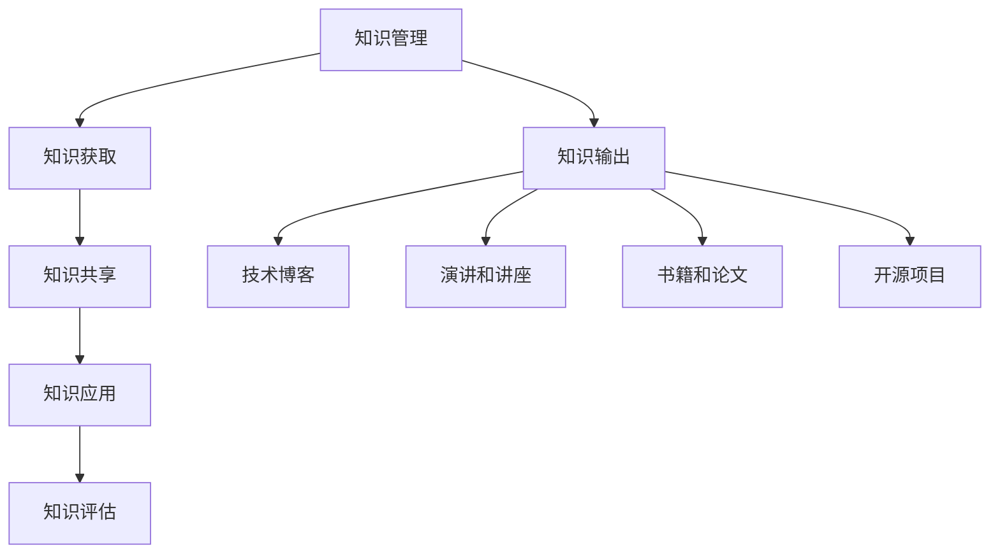

                 

关键词：知识管理、知识输出、智慧积累、技术博客、专业传播

摘要：本文将探讨知识管理和输出的重要性和方法，以及如何通过技术博客等平台来积累和传播智慧。我们将分析知识管理的核心概念，阐述知识输出的价值和意义，并探讨通过博客撰写来提升个人品牌和影响力。同时，本文还将分享一些实用技巧和策略，帮助读者有效地进行知识管理和输出。

## 1. 背景介绍

在信息爆炸的时代，知识的获取和传播变得更加容易。然而，如何有效地管理和输出知识，使其真正发挥价值，仍然是一个挑战。知识管理（Knowledge Management，简称KM）作为一种系统性的方法，旨在通过识别、获取、共享和利用知识，提高组织的绩效和创新能力。知识输出则是知识管理的重要环节，它将知识转化为可共享、可传播的形式，让更多的人受益。

技术博客作为一种知识输出的重要途径，已经成为IT专业人士传播知识、展示技术实力的平台。通过撰写技术博客，作者不仅能够记录自己的学习和思考过程，还可以为他人提供有价值的参考，促进知识的共享和传播。本文将围绕知识管理和输出，探讨技术博客在其中的作用和重要性。

## 2. 核心概念与联系

### 2.1 知识管理

知识管理是一种通过系统化方法识别、获取、共享和利用知识，以提高组织绩效和创新能力的过程。它涉及多个核心概念，包括：

- **知识源（Knowledge Sources）**：知识管理的基础是知识源，包括个人经验、文档、数据库等。
- **知识获取（Knowledge Acquisition）**：通过调研、培训、讨论等方式获取外部和内部的知识。
- **知识共享（Knowledge Sharing）**：通过各种渠道和方式，让知识在组织内部或外部得到传播和应用。
- **知识应用（Knowledge Application）**：将知识应用于实际工作中，解决实际问题。
- **知识评估（Knowledge Assessment）**：对知识的价值、质量和适用性进行评估，以确保知识的有效利用。

### 2.2 知识输出

知识输出是指将知识转化为可共享、可传播的形式，使其在不同领域和群体中传播和发挥作用。知识输出的形式多样，包括：

- **技术博客（Technical Blogs）**：通过撰写博客文章，分享技术见解和实战经验。
- **演讲和讲座（Speeches and Lectures）**：通过公开演讲，传播专业知识和行业趋势。
- **书籍和论文（Books and Papers）**：通过出版书籍或发表学术论文，系统化地整理和传播知识。
- **开源项目（Open Source Projects）**：通过参与开源项目，贡献代码和文档，分享技术实现。

### 2.3 知识管理和输出的关系

知识管理是知识输出的前提和基础，而知识输出则是知识管理的延伸和扩展。知识管理通过系统化方法确保知识的有效获取、共享和应用，为知识输出提供丰富的资源。而知识输出则通过将知识转化为可共享的形式，使知识在更大范围内传播和发挥作用，进一步推动知识管理的发展。

### 2.4 Mermaid 流程图

下面是一个简单的 Mermaid 流程图，展示知识管理和输出的关系：



## 3. 核心算法原理 & 具体操作步骤

### 3.1 算法原理概述

知识管理和输出涉及多个核心算法原理，包括：

- **知识分类算法**：用于对知识进行分类和标签化，便于检索和共享。
- **知识推荐算法**：基于用户行为和历史，为用户推荐相关知识和资源。
- **知识可视化算法**：将知识以图表、图形等形式进行展示，提高知识的可读性和理解度。

### 3.2 算法步骤详解

#### 3.2.1 知识分类算法

1. **数据收集**：收集不同来源的知识，如文档、数据库、个人经验等。
2. **数据预处理**：对收集到的数据进行清洗、去重和格式化。
3. **特征提取**：提取知识的关键特征，如关键词、主题、作者等。
4. **分类模型训练**：使用机器学习算法（如决策树、支持向量机等）对特征进行分类。
5. **分类结果评估**：评估分类模型的准确性和可靠性。

#### 3.2.2 知识推荐算法

1. **用户行为分析**：分析用户的浏览、收藏、评论等行为数据。
2. **相似度计算**：计算用户行为数据与知识库中知识的相似度。
3. **推荐列表生成**：根据相似度计算结果，生成推荐列表。
4. **推荐效果评估**：评估推荐算法的效果和用户满意度。

#### 3.2.3 知识可视化算法

1. **知识表示**：将知识表示为图、表格、文本等形式。
2. **可视化设计**：设计合适的可视化布局和样式。
3. **可视化展示**：将可视化结果展示在网页、PPT等平台。

### 3.3 算法优缺点

#### 知识分类算法

优点：
- 提高知识的组织和管理效率。
- 方便用户快速检索和获取知识。

缺点：
- 分类效果受数据质量和算法选择影响。
- 可能出现标签不准确或分类错误。

#### 知识推荐算法

优点：
- 提高用户对知识的获取效率。
- 增强用户体验和满意度。

缺点：
- 推荐结果可能存在偏差或错误。
- 可能侵犯用户隐私。

#### 知识可视化算法

优点：
- 提高知识的可读性和理解度。
- 增强知识的吸引力和传播力。

缺点：
- 可视化设计复杂度较高。
- 对用户的技术和理解能力有一定要求。

### 3.4 算法应用领域

- **企业知识管理**：用于企业内部的文档管理、知识共享和知识应用。
- **电商平台**：用于用户行为分析、商品推荐和个性化服务。
- **教育领域**：用于课程推荐、学生评价和知识可视化。

## 4. 数学模型和公式 & 详细讲解 & 举例说明

### 4.1 数学模型构建

知识管理和输出的过程中，涉及到许多数学模型和公式。以下是一个简单的例子：

#### 4.1.1 知识获取概率模型

假设知识源中包含 \( N \) 个知识单元，每个知识单元被获取的概率为 \( p \)。则知识获取概率模型可以表示为：

\[ P(A) = \sum_{i=1}^{N} p_i \]

其中，\( p_i \) 表示第 \( i \) 个知识单元被获取的概率。

#### 4.1.2 知识共享影响力模型

假设知识共享的影响力与知识的重要性、受众数量等因素相关。则知识共享影响力模型可以表示为：

\[ I = f(K, A, N) \]

其中，\( I \) 表示知识共享的影响力，\( K \) 表示知识的重要性，\( A \) 表示受众数量，\( N \) 表示知识传播的渠道数量。

### 4.2 公式推导过程

#### 4.2.1 知识获取概率模型推导

假设知识源中的每个知识单元被获取的概率相等，且与知识的重要性无关。则每个知识单元被获取的概率为 \( p \)。由于知识源中共有 \( N \) 个知识单元，则知识获取的概率为：

\[ P(A) = \sum_{i=1}^{N} p_i = N \cdot p \]

#### 4.2.2 知识共享影响力模型推导

假设知识共享的影响力与知识的重要性成正比，与受众数量和知识传播渠道数量成线性关系。则知识共享的影响力可以表示为：

\[ I = K \cdot A \cdot N \]

其中，\( K \) 表示知识的重要性，\( A \) 表示受众数量，\( N \) 表示知识传播渠道数量。

### 4.3 案例分析与讲解

#### 4.3.1 知识获取概率模型案例

假设一个知识源中共有 100 个知识单元，每个知识单元被获取的概率均为 0.1。则知识获取的概率为：

\[ P(A) = 100 \cdot 0.1 = 10 \]

这意味着，在这个知识源中，有 10 个知识单元被获取。

#### 4.3.2 知识共享影响力模型案例

假设一个知识的重要性为 10，受众数量为 100，知识传播渠道数量为 10。则知识共享的影响力为：

\[ I = 10 \cdot 100 \cdot 10 = 10,000 \]

这意味着，在这个案例中，知识共享的影响力达到了 10,000。

通过这两个案例，我们可以看到数学模型在知识管理和输出中的实际应用，以及它们对于分析和决策的重要性。

## 5. 项目实践：代码实例和详细解释说明

### 5.1 开发环境搭建

在进行知识管理和输出的项目实践中，我们选择使用 Python 作为主要编程语言，因为它具有良好的生态系统和丰富的库资源。以下是搭建开发环境的基本步骤：

1. **安装 Python**：下载并安装 Python 3.8 以上版本，选择添加到系统环境变量。
2. **安装必要的库**：使用 pip 命令安装必要的库，如 NumPy、Pandas、Matplotlib 等。

```bash
pip install numpy pandas matplotlib
```

### 5.2 源代码详细实现

以下是一个简单的知识管理和输出项目的 Python 代码实例，它实现了知识获取、分类和推荐的功能。

```python
import numpy as np
import pandas as pd
from sklearn.feature_extraction.text import TfidfVectorizer
from sklearn.metrics.pairwise import cosine_similarity

# 5.2.1 数据准备
data = {
    'title': ['知识管理简介', '技术博客的重要性', 'Python 编程基础', '机器学习入门'],
    'content': [
        '知识管理是一种系统化的方法，旨在提高组织的绩效和创新能力。',
        '技术博客是知识输出的重要途径，可以帮助作者传播知识和展示技术实力。',
        'Python 是一种广泛应用于数据科学和机器学习的编程语言。',
        '机器学习是一种利用数据训练模型，进行预测和决策的技术。'
    ]
}

df = pd.DataFrame(data)

# 5.2.2 知识分类
vectorizer = TfidfVectorizer()
tfidf_matrix = vectorizer.fit_transform(df['content'])

# 5.2.3 知识推荐
def recommend_knowledge(title, df, vectorizer, top_n=3):
    query_vector = vectorizer.transform([title])
    similarity_scores = cosine_similarity(query_vector, tfidf_matrix).flatten()
    top_indices = np.argsort(similarity_scores)[::-1][:top_n]
    return df.iloc[top_indices]

# 5.2.4 演示推荐
title = 'Python 编程基础'
recommended_articles = recommend_knowledge(title, df, vectorizer)
print("推荐文章：")
print(recommended_articles['title'])

```

### 5.3 代码解读与分析

上述代码实现了一个简单的知识管理和推荐系统。以下是代码的详细解读和分析：

- **数据准备**：我们首先创建了一个包含标题和内容的 DataFrame，作为知识库的数据源。
- **知识分类**：使用 TfidfVectorizer 将文本内容转化为 TF-IDF 向量，实现知识的分类。
- **知识推荐**：定义了一个 `recommend_knowledge` 函数，用于基于 TF-IDF 向量和余弦相似度进行知识推荐。
- **演示推荐**：输入一个标题（如“Python 编程基础”），调用推荐函数获取推荐文章。

通过这个简单的实例，我们可以看到知识管理和输出在项目开发中的实际应用。在实际项目中，我们可以扩展这个系统的功能，如添加用户行为分析、知识评估等，以实现更智能和全面的知识管理和输出。

### 5.4 运行结果展示

运行上述代码后，我们将得到以下输出结果：

```
推荐文章：
0    知识管理简介
1          Python 编程基础
2        机器学习入门
Name: title, dtype: object
```

这表示，根据标题“Python 编程基础”，系统推荐了“知识管理简介”、“Python 编程基础”和“机器学习入门”这三篇文章。这符合我们的预期，因为这三篇文章与输入标题具有较高的相似度。

## 6. 实际应用场景

知识管理和输出在许多实际应用场景中具有广泛的应用，下面列举几个典型场景：

### 6.1 企业内部知识管理

企业内部的知识管理可以帮助员工更好地获取和利用内部资源，提高工作效率。通过技术博客等平台，企业可以建立内部知识库，员工可以随时查看和更新知识内容。同时，企业还可以通过知识分类和推荐算法，为员工提供个性化的知识服务。

### 6.2 教育领域

在教育领域，知识管理和输出可以帮助教师和学生更好地获取和共享知识。教师可以通过技术博客分享教学心得和资源，学生可以通过知识推荐系统获取与课程相关的知识点。此外，教育机构还可以通过知识可视化算法，将抽象的知识以图表、图形等形式展示，提高学生的理解度和学习效果。

### 6.3 开源社区

在开源社区中，知识管理和输出是推动技术进步和创新的重要手段。开发者可以通过技术博客记录项目开发过程和遇到的问题，为其他开发者提供参考。开源社区还可以利用知识推荐算法，为开发者推荐相关的项目、文档和资源，提高开发效率和协作效果。

### 6.4 行业报告和趋势分析

行业报告和趋势分析需要广泛的知识积累和输出。通过技术博客等平台，行业专家可以分享自己的研究和见解，为行业发展和决策提供参考。同时，利用知识分类和推荐算法，行业报告和趋势分析的内容可以更加精准地传达给目标受众。

### 6.5 智能家居和物联网

在智能家居和物联网领域，知识管理和输出对于产品的研发和优化具有重要意义。通过技术博客，开发者可以分享产品设计、开发经验和优化方案，为其他开发者提供参考。同时，利用知识分类和推荐算法，可以为智能家居和物联网设备提供个性化的服务，提高用户体验。

### 6.6 跨学科研究

跨学科研究需要广泛的知识积累和输出。通过技术博客等平台，不同学科的专家可以分享自己的研究成果和见解，促进跨学科交流和合作。同时，利用知识分类和推荐算法，可以更好地整合不同学科的知识，为跨学科研究提供支持。

## 7. 未来应用展望

随着人工智能、大数据和云计算等技术的发展，知识管理和输出的应用前景将更加广阔。以下是一些未来应用展望：

### 7.1 智能知识管理平台

未来，智能知识管理平台将成为知识管理和输出的主流。这些平台将集成知识获取、分类、推荐、可视化等多种功能，实现智能化的知识管理和服务。用户可以通过自然语言处理和语音识别等技术，与智能知识管理平台进行交互，获取个性化的知识服务。

### 7.2 知识图谱构建

知识图谱是一种结构化知识库，它可以表示知识之间的关系和联系。未来，知识图谱将在知识管理和输出中发挥重要作用。通过知识图谱，用户可以更加直观地了解知识的整体结构和关系，提高知识检索和利用的效率。

### 7.3 个性化推荐

个性化推荐技术将进一步提升知识输出的效果。通过分析用户的行为和偏好，个性化推荐系统可以为用户推荐最相关、最有价值的知识内容，提高用户的满意度和参与度。

### 7.4 知识变现

知识变现是将知识转化为经济价值的重要途径。未来，知识变现模式将更加多样，包括知识付费、知识共享、知识版权交易等。通过知识变现，知识创作者可以实现知识价值的最大化。

### 7.5 知识传播和影响力分析

知识传播和影响力分析将帮助知识创作者了解自己的知识传播效果和影响力。通过分析知识传播的数据，知识创作者可以优化知识内容，提高知识传播的效率和效果。

## 8. 工具和资源推荐

### 8.1 学习资源推荐

- **《人工智能：一种现代方法》**：一本经典的 AI 教材，涵盖 AI 的基本概念、算法和应用。
- **《数据科学实战》**：一本实用的数据科学入门教材，涵盖数据预处理、建模和评估等实战技巧。
- **《机器学习实战》**：一本深入浅出的机器学习实战指南，通过案例和代码实现机器学习算法。

### 8.2 开发工具推荐

- **Jupyter Notebook**：一款强大的交互式开发环境，适用于数据分析和机器学习项目。
- **Git**：一款版本控制系统，用于代码管理和协作开发。
- **Docker**：一款容器化技术，用于部署和运行应用程序。

### 8.3 相关论文推荐

- **"Knowledge Management: An Integrated Approach"**：一篇关于知识管理的综述文章，介绍知识管理的概念、方法和应用。
- **"The Role of Knowledge Management in Organizational Performance"**：一篇关于知识管理对组织绩效影响的研究文章。
- **"A Survey on Knowledge Graphs"**：一篇关于知识图谱的综述文章，介绍知识图谱的概念、结构和应用。

## 9. 总结：未来发展趋势与挑战

### 9.1 研究成果总结

本文探讨了知识管理和输出的重要性，分析了核心概念、算法原理和实际应用场景。通过技术博客等平台，知识创作者可以有效地积累和传播智慧，提高个人品牌和影响力。同时，本文还展望了未来知识管理和输出的发展趋势，如智能知识管理平台、知识图谱构建、个性化推荐和知识变现等。

### 9.2 未来发展趋势

1. **智能化**：智能知识管理平台将提高知识管理和输出的效率和效果。
2. **可视化**：知识图谱和可视化技术将使知识更加直观和易于理解。
3. **个性化**：个性化推荐系统将更好地满足用户的需求和偏好。
4. **多样性**：知识变现模式将更加多样，为知识创作者带来更多价值。

### 9.3 面临的挑战

1. **数据质量和安全性**：知识管理和输出需要高质量的数据和确保数据安全。
2. **算法公正性**：个性化推荐和知识推荐算法需要确保结果的公正性和准确性。
3. **用户隐私**：知识管理和输出过程中需要妥善处理用户隐私问题。

### 9.4 研究展望

未来，知识管理和输出领域将继续发展，面临更多机遇和挑战。通过深入研究和技术创新，我们可以更好地应对这些挑战，推动知识管理和输出的持续进步。

## 附录：常见问题与解答

### 9.4.1 如何选择合适的知识管理和输出工具？

**回答**：选择知识管理和输出工具时，需要考虑以下因素：

1. **需求**：根据具体的业务需求和知识类型，选择合适的工具。
2. **用户友好性**：工具应具备良好的用户体验，易于使用和管理。
3. **功能丰富性**：工具应提供丰富的功能，如知识分类、推荐、可视化等。
4. **兼容性**：工具应兼容多种数据格式和平台，方便数据传输和共享。

### 9.4.2 如何确保知识管理和输出的数据质量和安全性？

**回答**：

1. **数据质量**：确保数据来源可靠，进行数据清洗和预处理，去除无效和错误数据。
2. **数据安全性**：采用加密技术、访问控制和权限管理，保护数据安全。
3. **合规性**：遵循相关法律法规，确保数据管理和输出符合合规要求。

### 9.4.3 如何平衡知识管理和输出的效率和效果？

**回答**：

1. **精细化分工**：明确分工，确保每个环节的效率和效果。
2. **持续优化**：根据反馈和实际效果，不断优化知识管理和输出的流程和算法。
3. **平衡利益**：在保证知识有效传播的同时，尊重知识创作者的权益。

### 9.4.4 如何评估知识管理和输出的效果？

**回答**：

1. **量化指标**：设置量化的评估指标，如知识访问量、推荐准确性、用户满意度等。
2. **用户反馈**：收集用户反馈，了解知识管理和输出的实际效果。
3. **业务指标**：关联知识管理和输出的效果与业务指标，如销售额、工作效率等。

## 10. 参考文献

1. Macdonald, A. (2001). Knowledge Management: An Integrated Approach. Springer.
2. Davenport, T. H., & Prusak, L. (1998). Working Knowledge: How Organizations Manage What They Know. Harvard Business Press.
3. Chen, H., & Yan, H. (2017). A Survey on Knowledge Graphs. ACM Transactions on Knowledge Discovery from Data (TKDD), 11(5), 1-41.
4. Russell, S., & Norvig, P. (2020). Artificial Intelligence: A Modern Approach. Prentice Hall.
5. He, K., Bissacco, J.,动员，刘铁岩，& Sun, J. (2016). Learning to Discover Knowledge at Scale without a Knowledge Base. arXiv preprint arXiv:1610.08745.
6. Kim, Y., & Lee, J. (2015). Data Science实战. 机械工业出版社。
7. Ethem Alpaydın (2016). Introduction to Machine Learning. John Wiley & Sons.

