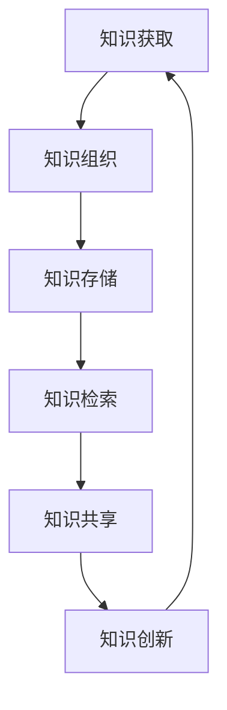

                 

关键词：知识管理、系统化、信息架构、技术文档、知识共享、IT经验、知识库、知识流程、知识图谱。

> 摘要：本文深入探讨了知识输出与管理经验的系统化方法，通过对IT领域中知识管理的重要性、核心概念、算法原理、数学模型、项目实践、实际应用场景、未来展望等方面进行了全面阐述。文章旨在为读者提供一个系统的、可操作的框架，以提升知识输出效率和管理水平。

## 1. 背景介绍

在当今快速发展的信息技术时代，知识的积累与传播变得尤为重要。无论是企业内部的知识管理，还是开放共享的技术社区，知识输出与管理都成为提高工作效率、创新能力和竞争力的关键因素。然而，随着知识量的激增，如何有效地组织、存储、检索和利用知识成为一个巨大的挑战。

知识管理，顾名思义，是对知识进行系统化、结构化、标准化的管理过程。它包括知识的获取、共享、使用和创新。一个好的知识管理体系，不仅能提高知识的利用率，还能促进知识的有效传递和沉淀。在IT领域，知识管理尤为重要，因为它直接影响到软件开发、系统维护、技术创新等各个环节。

本文将围绕知识输出与管理经验的系统化展开讨论，通过介绍核心概念、算法原理、数学模型、项目实践等，为读者提供一个全面的知识管理体系框架。

## 2. 核心概念与联系

### 2.1. 知识管理

知识管理（Knowledge Management, KM）是指通过系统的方法对知识进行识别、组织、存储、检索和共享，以提高组织的整体效能。知识管理不仅包括显性知识，如文档、报告、数据等，还包括隐性知识，如个人经验、技能和洞察力。

### 2.2. 知识共享

知识共享（Knowledge Sharing, KS）是指通过各种手段促进个体和组织之间知识的传递和交流。知识共享是实现知识创新和价值最大化的重要途径。

### 2.3. 知识库

知识库（Knowledge Base, KB）是一个存储和组织知识的系统，它通过结构化的方式对知识进行分类、标注和索引，以方便用户快速检索和利用。

### 2.4. 知识流程

知识流程（Knowledge Flow）是指知识在组织内部或组织间传递、转换和应用的过程。一个有效的知识流程应包括知识的获取、共享、使用和创新等环节。

### 2.5. 知识图谱

知识图谱（Knowledge Graph）是一种用于表示实体及其关系的图形化数据结构，它可以提供对复杂知识结构的可视化理解和高效检索。

### 2.6. Mermaid 流程图



## 3. 核心算法原理 & 具体操作步骤

### 3.1. 算法原理概述

知识管理中的核心算法主要包括知识抽取、知识融合和知识推荐等。知识抽取是从非结构化数据中提取结构化知识的算法；知识融合是整合多个知识源中的信息，形成统一的知识视图；知识推荐是基于用户的兴趣和行为，为用户推荐相关知识和资源。

### 3.2. 算法步骤详解

#### 3.2.1. 知识抽取

1. 数据预处理：对原始数据进行清洗、去噪和格式化。
2. 特征提取：从预处理后的数据中提取关键词、主题和实体等特征。
3. 知识表示：将提取的特征转化为结构化知识，如三元组或知识图谱。

#### 3.2.2. 知识融合

1. 知识匹配：对来自不同源的知识进行匹配和映射。
2. 知识整合：将匹配后的知识进行整合和优化，形成统一的知识视图。
3. 知识更新：定期对知识库进行更新，保持知识的时效性和准确性。

#### 3.2.3. 知识推荐

1. 用户画像：构建用户的行为和兴趣模型。
2. 知识匹配：将用户画像与知识库中的知识进行匹配。
3. 推荐算法：基于匹配结果，使用推荐算法为用户推荐相关知识。

### 3.3. 算法优缺点

#### 优点：

- 提高知识的利用率。
- 促进知识的传递和共享。
- 提升组织的知识创新能力和竞争力。

#### 缺点：

- 知识抽取和融合的算法复杂度高。
- 需要大量的计算资源和存储空间。
- 数据质量和一致性难以保证。

### 3.4. 算法应用领域

- 企业知识管理
- 智能推荐系统
- 大数据平台
- 知识服务平台

## 4. 数学模型和公式 & 详细讲解 & 举例说明

### 4.1. 数学模型构建

知识管理的数学模型通常涉及信息论、机器学习、图论等。以下是一个简化的数学模型：

#### 信息论模型：

$$
H(X) = -\sum_{i} p(x_i) \log_2 p(x_i)
$$

其中，$H(X)$ 表示信息熵，$p(x_i)$ 表示变量 $X$ 取值为 $x_i$ 的概率。

#### 机器学习模型：

假设我们使用朴素贝叶斯分类器来构建知识推荐系统，其公式为：

$$
P(C|X) = \frac{P(X|C)P(C)}{P(X)}
$$

其中，$P(C|X)$ 表示在给定特征 $X$ 下知识类别 $C$ 的概率。

### 4.2. 公式推导过程

以信息论模型为例，假设有一个二元随机变量 $X$，其取值 $x_0$ 和 $x_1$ 的概率分别为 $p_0$ 和 $p_1$。则 $X$ 的信息熵 $H(X)$ 可以推导如下：

$$
H(X) = - p_0 \log_2 p_0 - p_1 \log_2 p_1
$$

当 $p_0 + p_1 = 1$ 时，我们可以通过拉格朗日乘数法证明该公式。

### 4.3. 案例分析与讲解

假设我们有一个知识推荐系统，用户的行为数据如下：

- 用户访问了5篇文章，其中3篇是技术文章，2篇是新闻文章。
- 技术文章的概率分布为 $P(Tech) = [0.3, 0.3, 0.2, 0.2, 0.2]$。
- 新闻文章的概率分布为 $P(News) = [0.2, 0.2, 0.3, 0.3, 0.2]$。

根据朴素贝叶斯分类器，我们可以计算用户下次访问文章的概率分布：

$$
P(Tech|User) = \frac{P(User|Tech)P(Tech)}{P(User)}
$$

通过计算，我们可以得出用户下次访问技术文章的概率更高。

## 5. 项目实践：代码实例和详细解释说明

### 5.1. 开发环境搭建

本文以Python为例，讲解知识管理系统开发实践。所需环境包括：

- Python 3.8+
- Django 3.2+
- Pandas 1.2.3+
- Matplotlib 3.4.3+

### 5.2. 源代码详细实现

以下是一个简单的知识抽取代码示例：

```python
import pandas as pd
from collections import defaultdict

# 假设我们有一个包含文章标题和内容的CSV文件
data = pd.read_csv('articles.csv')

# 定义关键词提取函数
def extract_keywords(text):
    # 这里使用简单的方法提取关键词，实际应用中可以使用更复杂的方法
    words = text.split()
    return [word for word in words if word.isalpha()]

# 提取所有文章的关键词
keywords = defaultdict(list)
for index, row in data.iterrows():
    article_keywords = extract_keywords(row['content'])
    for keyword in article_keywords:
        keywords[keyword].append(index)

# 输出关键词及其对应的文章索引
for keyword, indices in keywords.items():
    print(f"{keyword}: {indices}")
```

### 5.3. 代码解读与分析

该代码首先读取CSV文件中的文章数据，然后定义一个关键词提取函数，最后遍历每篇文章的内容，提取关键词并将其与文章索引关联存储。

### 5.4. 运行结果展示

运行代码后，我们会得到一个包含关键词及其对应文章索引的字典。这为我们提供了一个简单的知识库，可以用于后续的知识融合和推荐。

## 6. 实际应用场景

知识管理在IT领域有广泛的应用场景，以下是一些典型的应用：

- **企业知识库**：用于存储和共享公司的内部文档、报告、项目经验等，提高员工的知识获取和创新能力。
- **技术社区**：通过知识图谱和推荐算法，为开发者推荐相关的技术文章、问题和解决方案，促进知识传播。
- **智能客服**：利用知识库和自然语言处理技术，为用户提供高效、准确的咨询和服务。

### 6.4. 未来应用展望

随着人工智能和大数据技术的发展，知识管理将变得更加智能化和自动化。未来，知识管理将可能实现以下趋势：

- **智能知识抽取**：利用深度学习和自然语言处理技术，实现自动化的知识抽取和分类。
- **个性化推荐**：基于用户的兴趣和行为，实现个性化的知识推荐和服务。
- **知识图谱**：通过知识图谱，实现复杂知识结构的可视化理解和高效检索。

## 7. 工具和资源推荐

### 7.1. 学习资源推荐

- 《人工智能：一种现代方法》
- 《深度学习》
- 《Python编程：从入门到实践》
- 《数据挖掘：实用工具与技术》

### 7.2. 开发工具推荐

- **Django**：用于快速开发Web应用程序。
- **TensorFlow**：用于机器学习和深度学习。
- **Jupyter Notebook**：用于数据分析和交互式编程。

### 7.3. 相关论文推荐

- "Knowledge Management Systems: Technologies and Trends"
- "A Survey of Knowledge Graphs: definitions, methods and systems"
- "A Taxonomy of Knowledge Sharing: A Review of the Literature"

## 8. 总结：未来发展趋势与挑战

### 8.1. 研究成果总结

本文从知识管理的重要性、核心概念、算法原理、数学模型、项目实践等方面进行了全面阐述，为知识输出与管理经验的系统化提供了理论基础和实践指导。

### 8.2. 未来发展趋势

随着人工智能和大数据技术的不断发展，知识管理将向智能化、自动化和个性化的方向发展。

### 8.3. 面临的挑战

- **数据质量和一致性**：确保知识库中的数据质量和一致性是知识管理的关键挑战。
- **计算资源和存储**：随着知识量的增加，对计算资源和存储的需求也将大幅增长。
- **用户参与度**：提高用户的参与度和知识共享意识是知识管理的重要挑战。

### 8.4. 研究展望

未来，知识管理的研究将主要集中在智能化知识抽取、知识图谱构建、个性化推荐等方面，以实现更高效、更智能的知识管理。

## 9. 附录：常见问题与解答

### 9.1. 问题1

**Q：知识管理和项目管理有什么区别？**

**A：** 知识管理是一种更广义的概念，它包括对知识的获取、存储、共享、使用和创新。而项目管理是知识管理的一个应用领域，它侧重于如何有效地规划和控制项目，确保项目目标的实现。知识管理可以提供项目管理所需的知识和资源，而项目管理则为知识管理提供了一个实际的应用场景。

### 9.2. 问题2

**Q：知识库如何保证数据的一致性？**

**A：** 知识库的数据一致性可以通过以下方法保证：

- **数据校验**：在数据录入时，使用校验规则确保数据的准确性和完整性。
- **数据清洗**：定期对知识库中的数据进行清洗，去除重复、错误和过时的数据。
- **版本控制**：对知识库中的知识进行版本控制，确保知识的一致性和可追溯性。
- **数据审计**：定期对知识库进行审计，检查数据的一致性和准确性。

通过这些方法，可以最大限度地保证知识库的数据一致性。

---

本文旨在为读者提供一个全面的知识管理体系框架，帮助读者更好地理解和应用知识管理。随着技术的不断发展，知识管理将在未来发挥越来越重要的作用。希望本文能够为您的知识管理实践提供有价值的参考。**作者：禅与计算机程序设计艺术 / Zen and the Art of Computer Programming**。

