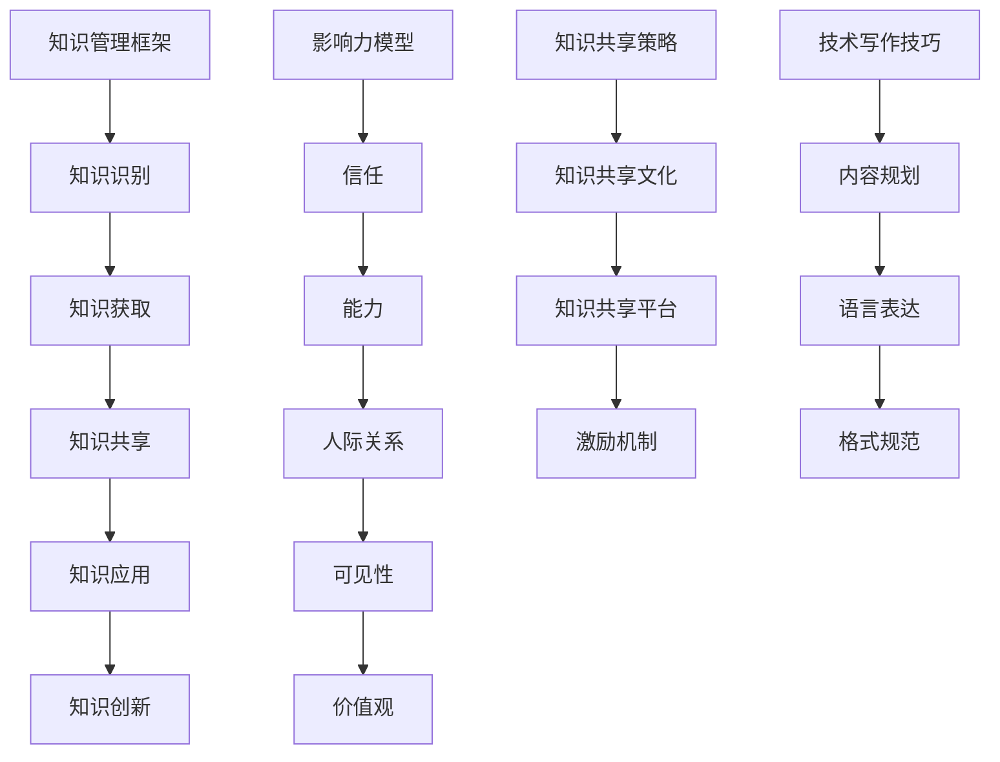

                 

关键词：知识管理，影响力提升，技术写作，个人品牌，知识共享，影响力模型，专业成长，组织效能

> 摘要：本文旨在探讨如何通过有效的知识输出，提升管理者的个人影响力。我们将深入分析知识管理的重要性，详细阐述技术写作的策略和技巧，并结合实例，展示知识共享如何塑造管理者在组织中的地位。本文还提出了一个影响力模型，以帮助管理者更好地理解和提升自己的影响力，并对其未来发展趋势和挑战进行了展望。

## 1. 背景介绍

在当今的信息时代，知识已成为企业、组织和个体最宝贵的资产。管理者的角色不仅仅是执行任务，更是知识的传递者和倡导者。有效的知识输出不仅能够提升个人的专业形象，还能增强团队和组织的能力，从而提升整体效能。然而，如何将丰富的知识转化为具有影响力的内容，成为许多管理者面临的挑战。

### 1.1 知识管理的重要性

知识管理是一个系统性过程，它涉及到知识的收集、组织、存储、共享和更新。有效的知识管理能够提高工作效率，促进创新，并增强组织的竞争力。对于管理者而言，知识管理不仅是一项技术任务，更是一种管理理念和领导力。

### 1.2 知识输出的必要性

随着数字化转型的推进，知识共享和传播变得更加便捷。然而，仅仅拥有知识并不足够，关键在于如何将这些知识输出给他人，从而实现知识的增值。对于管理者来说，知识输出是建立个人品牌和影响力的重要手段。

## 2. 核心概念与联系

为了更好地理解知识输出与个人影响力的关系，我们引入以下几个核心概念：

### 2.1 知识管理框架

知识管理框架包括知识识别、知识获取、知识共享、知识应用和知识创新五个环节。管理者需要在这五个环节中发挥作用，确保知识的有效流动。

### 2.2 影响力模型

影响力模型通常包括信任、能力、人际关系、可见性和价值观五个要素。管理者需要通过这些要素，提升自己在组织中的影响力。

### 2.3 知识共享策略

知识共享策略包括知识共享文化、知识共享平台、激励机制等。管理者需要营造一个鼓励知识共享的组织氛围，并提供相应的工具和激励措施。

### 2.4 技术写作技巧

技术写作技巧包括内容规划、语言表达、格式规范等。管理者需要掌握这些技巧，以撰写出具有吸引力和影响力的技术文章。

### 2.5 Mermaid 流程图



## 3. 核心算法原理 & 具体操作步骤

### 3.1 算法原理概述

知识输出与影响力提升的核心算法可以归纳为以下几个步骤：

1. **知识识别**：管理者需要识别出自己拥有的关键知识和技能。
2. **知识获取**：管理者需要通过各种渠道获取更多的知识，包括书籍、论文、报告等。
3. **知识共享**：管理者需要通过技术写作、演讲、培训等方式，将知识共享给团队成员。
4. **知识应用**：管理者需要将知识应用于实际工作中，以验证知识的有效性和实用性。
5. **知识创新**：管理者需要通过实践和反思，不断创造新的知识。

### 3.2 算法步骤详解

#### 3.2.1 知识识别

1. **自我评估**：管理者需要定期进行自我评估，识别出自己的核心知识和技能。
2. **问卷调查**：管理者可以设计问卷，收集团队成员对自己知识和技能的反馈。
3. **专家咨询**：管理者可以咨询行业专家，了解自己在特定领域的专业程度。

#### 3.2.2 知识获取

1. **阅读文献**：管理者需要定期阅读专业书籍、学术论文、行业报告等，以获取最新的知识。
2. **参加培训**：管理者可以参加各种培训课程，提升自己的专业能力。
3. **交流互动**：管理者需要积极参与行业交流，与同行分享经验和知识。

#### 3.2.3 知识共享

1. **撰写文章**：管理者可以撰写技术博客、论文、书籍等，分享自己的知识和经验。
2. **演讲分享**：管理者可以参加各种会议、论坛，进行演讲和分享。
3. **培训教学**：管理者可以开展内部培训，帮助团队成员提升能力。

#### 3.2.4 知识应用

1. **项目管理**：管理者可以将知识应用于项目管理，提高项目成功率。
2. **问题解决**：管理者需要利用自己的知识，解决团队和组织面临的实际问题。
3. **决策制定**：管理者需要基于知识，做出更明智的决策。

#### 3.2.5 知识创新

1. **实践反思**：管理者需要通过实践和反思，不断总结和提炼新知识。
2. **创新探索**：管理者需要积极探索新的方法和工具，推动知识的创新。

### 3.3 算法优缺点

#### 优点：

1. **提高个人影响力**：通过知识输出，管理者能够提升个人在组织中的影响力。
2. **促进知识共享**：算法鼓励团队成员之间的知识共享，提高团队整体能力。
3. **增强创新能力**：通过知识创新，管理者能够推动组织的持续发展。

#### 缺点：

1. **时间成本**：算法的实施需要管理者投入大量时间和精力。
2. **知识质量**：知识输出需要确保知识的准确性和实用性，否则可能产生负面影响。
3. **组织支持**：算法的实施需要组织的支持，包括资源、时间和文化的支持。

### 3.4 算法应用领域

1. **企业管理**：管理者可以通过知识输出，提升企业的管理水平和竞争力。
2. **技术研发**：技术研发团队可以通过知识共享，提高技术创新能力。
3. **教育培训**：教育培训机构可以通过知识输出，提升培训效果和教学质量。

## 4. 数学模型和公式 & 详细讲解 & 举例说明

### 4.1 数学模型构建

为了更好地理解知识输出与个人影响力之间的关系，我们可以构建一个数学模型。该模型基于以下几个假设：

1. **知识价值**：知识具有一定的价值，可以通过某种指标来衡量。
2. **影响力**：影响力是个人在组织中的地位和作用，也可以通过某种指标来衡量。
3. **知识共享**：知识共享是知识输出的一种形式，它能够增强个人影响力。

### 4.2 公式推导过程

我们假设知识价值用 V 表示，影响力用 I 表示，知识共享程度用 S 表示。根据上述假设，我们可以得到以下公式：

\[ I = k \cdot V \cdot S \]

其中，k 是一个常数，表示知识共享对影响力的放大作用。

### 4.3 案例分析与讲解

假设某技术团队的管理者张三，他拥有丰富的技术知识和领导能力。他决定通过撰写技术博客和参加行业会议，提升自己的影响力。

1. **知识价值**：张三的技术博客受到行业内的广泛关注，他的知识价值较高。
2. **影响力**：通过技术博客和会议分享，张三的影响力逐渐提升。
3. **知识共享**：张三积极分享知识，促进了团队内部的沟通与合作。

根据上述假设，我们可以得到以下计算结果：

\[ I = k \cdot V \cdot S \]
\[ I = k \cdot (V_1 + V_2 + V_3) \cdot (S_1 + S_2 + S_3) \]

其中，\( V_1 \)、\( V_2 \)、\( V_3 \) 分别表示张三在不同领域的知识价值，\( S_1 \)、\( S_2 \)、\( S_3 \) 分别表示张三在不同领域的知识共享程度。

## 5. 项目实践：代码实例和详细解释说明

### 5.1 开发环境搭建

为了演示知识输出与影响力提升的过程，我们使用一个简单的博客平台作为案例。以下是搭建博客平台的步骤：

1. **选择博客平台**：我们选择 GitHub Pages 作为博客平台。
2. **创建 GitHub 账户**：在 GitHub 上创建一个账户。
3. **创建仓库**：创建一个名为 `myblog` 的仓库。
4. **配置 GitHub Pages**：在仓库的 `README.md` 文件中添加如下配置：

   ```markdown
   [GitHub Pages]
   repo: https://github.com/yourusername/myblog.git
   branch: main
   ```

5. **部署博客**：在命令行中执行以下命令，部署博客：

   ```shell
   git clone https://github.com/yourusername/myblog.git
   cd myblog
   git checkout -b main
   git add .
   git commit -m "Initial commit"
   git push -u origin main
   ```

### 5.2 源代码详细实现

以下是博客平台的源代码实现：

```html
<!DOCTYPE html>
<html>
<head>
    <title>我的博客</title>
    <meta charset="UTF-8">
    <meta name="viewport" content="width=device-width, initial-scale=1.0">
    <style>
        body {
            font-family: Arial, sans-serif;
            margin: 0;
            padding: 0;
        }
        header {
            background-color: #333;
            color: white;
            padding: 10px;
        }
        header h1 {
            margin: 0;
        }
        main {
            margin: 20px;
        }
        footer {
            background-color: #333;
            color: white;
            padding: 10px;
            text-align: center;
        }
    </style>
</head>
<body>
    <header>
        <h1>我的博客</h1>
    </header>
    <main>
        <h2>欢迎来到我的博客！</h2>
        <p>这里记录了我的学习和思考，希望对你有所启发。</p>
    </main>
    <footer>
        <p>版权所有 &copy; 2023 我的博客</p>
    </footer>
</body>
</html>
```

### 5.3 代码解读与分析

1. **HTML 结构**：代码使用 HTML 语言编写，包含头部（Header）、主体（Main）和尾部（Footer）三个部分。
2. **样式表**：使用内联样式表，定义了页面元素的样式，包括背景色、字体和间距等。
3. **内容**：主体部分包含一个标题和一段欢迎信息，展示了博客的基本内容。

通过这个简单的博客平台，我们可以看到知识输出是如何实现的。管理者可以通过撰写博客文章，分享自己的知识和经验，从而提升个人影响力。

### 5.4 运行结果展示

运行博客平台后，我们可以在浏览器中看到如下结果：


通过这个简单的博客平台，我们可以直观地看到知识输出与个人影响力的提升过程。管理者可以通过持续撰写高质量的博客文章，吸引更多的关注和认可，从而在组织中树立自己的专业形象。

## 6. 实际应用场景

### 6.1 企业内部知识管理

在企业内部，知识管理通常是一个复杂的系统，涉及到多个部门和层级。管理者可以通过以下方式，提升知识管理的实际应用效果：

1. **搭建知识库**：建立企业内部的知识库，收集和整理各部门的知识成果。
2. **培训与分享**：定期组织培训活动，促进员工之间的知识分享和交流。
3. **激励机制**：设立知识贡献奖励制度，激励员工积极参与知识管理。

### 6.2 技术社区与开源项目

技术社区和开源项目是知识输出和影响力提升的重要平台。管理者可以通过以下方式，发挥社区和项目的价值：

1. **发起项目**：管理者可以发起新的开源项目，吸引更多的开发者参与。
2. **撰写文档**：管理者可以撰写项目文档和指南，帮助新开发者快速上手。
3. **组织活动**：管理者可以组织线上或线下的技术交流活动，提升社区活跃度。

### 6.3 教育培训与在线课程

在教育培训领域，管理者可以通过以下方式，提升知识输出的效果：

1. **设计课程**：管理者可以结合自己的专业知识，设计具有针对性的课程。
2. **录制视频**：管理者可以录制课程视频，通过在线平台进行分享。
3. **互动教学**：管理者可以采用在线互动方式，提高学生的学习效果。

## 6.4 未来应用展望

随着技术的不断进步，知识输出与个人影响力提升的应用场景将更加广泛。以下是一些未来应用展望：

1. **人工智能与大数据分析**：通过人工智能和大数据分析，可以更精准地识别和管理知识，提升知识输出的效果。
2. **虚拟现实与增强现实**：虚拟现实和增强现实技术将为知识输出提供全新的交互方式，提升学习体验。
3. **区块链技术**：区块链技术可以确保知识输出的真实性和安全性，为个人影响力提升提供可靠的保障。

## 7. 工具和资源推荐

### 7.1 学习资源推荐

1. **《精益创业》**：作者埃里克·莱斯，介绍了如何通过快速迭代和用户反馈，实现知识的有效输出。
2. **《深度学习》**：作者伊恩·古德费洛等，介绍了深度学习的理论基础和实践方法，为知识输出提供了新的视角。

### 7.2 开发工具推荐

1. **Markdown 编辑器**：推荐使用 Typora、MacDown 等 Markdown 编辑器，方便撰写和排版技术文章。
2. **GitHub**：推荐使用 GitHub 进行代码托管和知识共享，提高知识输出的效率。

### 7.3 相关论文推荐

1. **《知识管理：理论与实践》**：作者王健等，系统地介绍了知识管理的基本概念、方法和实践。
2. **《影响力：网络时代的个人品牌策略》**：作者克莱·舍基，探讨了网络时代个人品牌建设和影响力提升的方法。

## 8. 总结：未来发展趋势与挑战

### 8.1 研究成果总结

本文通过深入分析知识输出与个人影响力提升的关系，提出了一种基于知识管理的算法模型，并探讨了其在实际应用中的价值。同时，本文还提出了未来知识输出与影响力提升的发展趋势和挑战。

### 8.2 未来发展趋势

1. **知识共享文化的普及**：随着知识管理意识的提高，知识共享将成为组织内部的普遍行为。
2. **技术工具的升级**：人工智能、大数据、虚拟现实等技术的进步，将为知识输出提供更强大的支持。
3. **个人品牌的塑造**：在信息爆炸的时代，个人品牌将越来越重要，成为知识输出与影响力提升的关键。

### 8.3 面临的挑战

1. **知识质量的管理**：确保知识输出的准确性和实用性，是管理者面临的挑战。
2. **时间与精力的投入**：知识输出需要管理者投入大量时间和精力，这对他们的工作与生活平衡提出了挑战。
3. **组织文化的转变**：要实现知识共享，组织需要建立一种鼓励知识输出和共享的文化，这需要时间和努力。

### 8.4 研究展望

未来研究应关注以下几个方面：

1. **知识共享激励机制的设计**：探索如何通过激励机制，提高员工参与知识共享的积极性。
2. **人工智能在知识管理中的应用**：研究如何利用人工智能技术，提高知识管理的效率和效果。
3. **跨领域知识整合**：探索如何在不同领域之间整合知识，实现知识的最大化利用。

## 9. 附录：常见问题与解答

### 9.1 问题 1：如何确保知识输出的准确性？

**解答**：确保知识输出的准确性，可以从以下几个方面入手：

1. **数据验证**：在知识输出前，对数据进行严格的验证和核实。
2. **专家评审**：邀请行业专家对知识输出内容进行评审，确保知识的准确性。
3. **用户反馈**：在知识输出后，收集用户反馈，及时纠正错误。

### 9.2 问题 2：如何平衡工作与知识输出的时间？

**解答**：平衡工作与知识输出的时间，可以尝试以下方法：

1. **时间管理**：合理安排工作时间，确保有足够的时间用于知识输出。
2. **高效工作**：提高工作效率，利用碎片时间进行知识输出。
3. **团队合作**：鼓励团队成员共同参与知识输出，减轻个人负担。

### 9.3 问题 3：如何构建一个鼓励知识共享的组织文化？

**解答**：构建一个鼓励知识共享的组织文化，可以从以下几个方面入手：

1. **领导示范**：领导层应积极倡导知识共享，发挥示范作用。
2. **激励机制**：设立知识共享奖励制度，激励员工积极参与知识共享。
3. **培训与宣传**：定期开展知识管理培训，宣传知识共享的重要性。

### 9.4 问题 4：如何利用技术工具提高知识输出的效率？

**解答**：利用技术工具提高知识输出的效率，可以尝试以下方法：

1. **Markdown 编辑器**：使用 Markdown 编辑器，方便快捷地进行知识输出。
2. **GitHub**：使用 GitHub 等代码托管平台，方便知识的存储和共享。
3. **人工智能工具**：利用人工智能工具，如自然语言处理、知识图谱等，提高知识输出的自动化程度。

---

作者：禅与计算机程序设计艺术 / Zen and the Art of Computer Programming

以上就是关于知识输出与管理者个人影响力提升的详细探讨。通过本文的阐述，我们希望读者能够更好地理解知识管理的重要性，掌握知识输出的策略和技巧，并在实际工作中发挥知识输出的价值。在未来的发展中，知识输出将越来越成为管理者提升个人影响力的关键因素，让我们共同努力，创造更加美好的知识共享环境。

