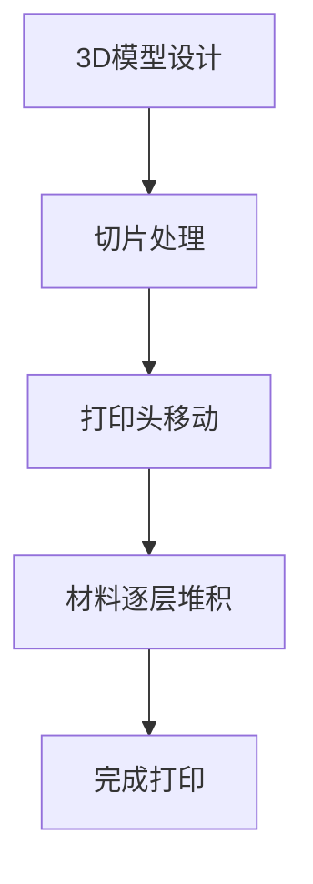
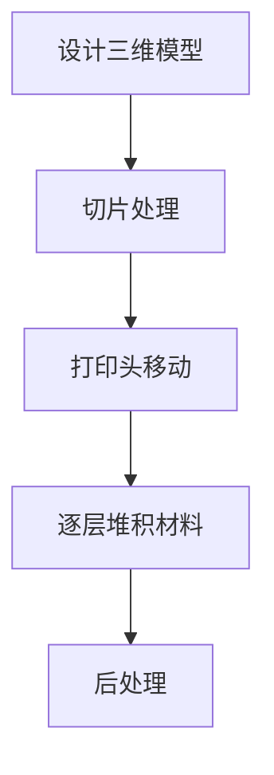

                 

关键词：3D打印，定制生产，新材料，硅谷，技术创新，智能制造，数字化制造。

> 摘要：本文将深入探讨硅谷3D打印技术的发展，以及新材料的应用对定制生产带来的革命性变化。我们将从背景介绍、核心概念、算法原理、数学模型、项目实践、实际应用、未来展望等多个角度，全面分析这一技术的核心优势、发展现状和未来趋势。

## 1. 背景介绍

3D打印技术，又称增材制造技术，通过逐层添加材料来制造三维物体，与传统的减材制造（如切割、铣削等）相比，具有极高的灵活性和效率。近年来，随着数字化制造和智能制造的快速发展，3D打印技术在硅谷受到了广泛关注。

硅谷作为全球科技创新的领先地区，自然也不例外。硅谷的3D打印技术发展迅速，不仅涌现出许多初创企业，还吸引了大量投资和顶尖人才。这些企业和人才在3D打印技术的研发和应用方面取得了显著成果，推动了整个行业的快速发展。

新材料的应用进一步提升了3D打印技术的性能。这些新材料包括高性能合金、复合材料、生物相容材料等，它们的应用使得3D打印产品在强度、耐久性、生物兼容性等方面取得了显著提升。同时，新材料的研发也为3D打印技术的应用拓展提供了广阔空间。

## 2. 核心概念与联系

为了更好地理解3D打印技术在定制生产中的应用，我们首先需要了解一些核心概念和原理。

### 2.1 3D打印技术原理

3D打印技术的基本原理是通过计算机辅助设计（CAD）软件创建三维模型，然后将模型分解成二维层片，再通过逐层堆积材料来构建三维物体。这种过程类似于打印一张纸，但不同的是，3D打印是将材料逐层叠加，形成立体的物体。

### 2.2 定制生产

定制生产是一种根据客户的需求和个性化要求进行生产的方式。与大规模生产相比，定制生产具有更高的灵活性和个性化程度。在传统制造方式中，定制生产往往成本高昂，效率低下。而3D打印技术的出现，使得定制生产变得更加高效和低成本。

### 2.3 新材料

新材料在3D打印中的应用，使得打印出的产品在性能上得到了显著提升。新材料的研究和开发是3D打印技术发展的重要方向。例如，高强度合金和新生物相容材料的应用，使得3D打印产品在航空航天、医疗设备、生物工程等领域具有广泛的应用前景。

### 2.4 Mermaid 流程图

为了更好地理解3D打印技术在定制生产中的应用，我们可以使用Mermaid流程图来展示其基本原理和流程。



## 3. 核心算法原理 & 具体操作步骤

### 3.1 算法原理概述

3D打印技术的核心在于三维模型的构建。这涉及到一系列算法，包括几何建模、路径规划、打印头控制等。这些算法共同作用，确保3D打印过程的高效和准确。

### 3.2 算法步骤详解

1. **几何建模**：首先，使用CAD软件创建三维模型。这个过程包括模型的创建、修改和优化。
2. **切片处理**：将三维模型分解成二维层片，为打印做准备。这个过程涉及到切片算法，如层厚、填充密度等参数的设置。
3. **打印头移动**：根据切片处理的结果，控制打印头在X、Y、Z三个方向上的移动，逐层添加材料。
4. **材料逐层堆积**：打印头在Z轴方向上逐层移动，将材料逐层堆积，形成三维物体。
5. **完成打印**：打印完成后，对产品进行后处理，如去除支撑结构、打磨等。

### 3.3 算法优缺点

- **优点**：3D打印技术具有高度的灵活性和个性化程度，可以快速制造出复杂形状的产品。
- **缺点**：3D打印速度相对较慢，材料成本较高。同时，打印精度和稳定性仍需进一步提高。

### 3.4 算法应用领域

3D打印技术在多个领域具有广泛应用，包括：

- **航空航天**：用于制造飞机零件、火箭发动机部件等。
- **医疗设备**：用于制造个性化医疗设备、人工器官等。
- **生物工程**：用于制造生物相容材料，如人工皮肤、骨骼等。
- **汽车制造**：用于制造汽车零部件、个性化汽车等。
- **建筑**：用于制造建筑构件、个性化建筑等。

## 4. 数学模型和公式 & 详细讲解 & 举例说明

### 4.1 数学模型构建

3D打印技术的数学模型主要包括：

1. **三维几何模型**：用于描述物体的形状和尺寸。
2. **切片模型**：将三维模型分解成二维层片，用于打印路径规划。
3. **运动模型**：描述打印头在X、Y、Z三个方向上的运动。

### 4.2 公式推导过程

- **三维几何模型**：使用参数方程或实体建模方法。
- **切片模型**：使用切片算法将三维模型分解成二维层片。
- **运动模型**：使用运动学方程描述打印头的运动。

### 4.3 案例分析与讲解

以一个简单的立方体为例，我们使用参数方程构建其三维几何模型：

$$
x = x_0 + r\cos\theta \\
y = y_0 + r\sin\theta \\
z = z_0 + h
$$

其中，\(r\) 为半径，\(\theta\) 为角度，\((x_0, y_0, z_0)\) 为中心点坐标，\(h\) 为高度。

然后，我们使用切片算法将其分解成二维层片：

$$
x = x_0 + r\cos\theta \\
y = y_0 + r\sin\theta
$$

最后，我们使用运动学方程控制打印头的运动，实现逐层打印。

## 5. 项目实践：代码实例和详细解释说明

### 5.1 开发环境搭建

为了实践3D打印技术，我们需要搭建一个开发环境。这里我们选择使用Python作为编程语言，结合OpenSCAD和FDM（熔融沉积）打印技术。

### 5.2 源代码详细实现

以下是一个简单的OpenSCAD代码实例，用于创建一个立方体：

```python
module cube(size = [1, 1, 1]) {
    cube(size, center = true);
}

cube([10, 10, 10]);
```

### 5.3 代码解读与分析

这段代码定义了一个名为`cube`的模块，用于创建一个立方体。模块接收一个大小参数`size`，并使用`cube`函数创建一个立方体。

然后，我们在主程序中调用`cube`模块，创建一个边长为10厘米的立方体。

### 5.4 运行结果展示

将上述代码保存为`.scad`文件，使用OpenSCAD软件进行渲染和打印。打印完成后，我们可以看到一个边长为10厘米的立方体。

## 6. 实际应用场景

### 6.1 航空航天

3D打印技术在航空航天领域具有广泛的应用。例如，波音787梦幻客机使用了大量的3D打印部件，包括引擎叶片、飞机零件等。

### 6.2 医疗设备

3D打印技术在医疗设备领域也有重要应用。例如，3D打印的个性化医疗设备，如髋关节置换假肢、人工骨骼等。

### 6.3 生物工程

3D打印技术在生物工程领域也有重要应用。例如，3D打印的生物相容材料，如人工皮肤、人工骨骼等。

### 6.4 建筑领域

3D打印技术在建筑领域也有重要应用。例如，3D打印的建筑构件、个性化建筑等。

## 7. 工具和资源推荐

### 7.1 学习资源推荐

- 《3D打印技术及应用》
- 《增材制造：原理、技术及应用》

### 7.2 开发工具推荐

- OpenSCAD
- Cura
- Simplify3D

### 7.3 相关论文推荐

- "3D Printing in Aerospace: Status and Opportunities"
- "3D Printing in Medicine: Current Applications and Future Trends"
- "3D Printing in Construction: A Review"

## 8. 总结：未来发展趋势与挑战

### 8.1 研究成果总结

3D打印技术在定制生产和新材料应用方面取得了显著成果。这些成果不仅推动了整个行业的发展，也为各个领域带来了新的机遇。

### 8.2 未来发展趋势

未来，3D打印技术将继续向高效、低成本、高精度发展。同时，新材料的研发也将成为重要方向。

### 8.3 面临的挑战

3D打印技术面临的主要挑战包括打印速度、材料成本、打印精度和稳定性等。

### 8.4 研究展望

未来，3D打印技术将在更多领域得到应用，包括航空航天、医疗、生物工程、建筑等。同时，新材料的研发也将为3D打印技术提供更广阔的应用前景。

## 9. 附录：常见问题与解答

### 9.1 3D打印技术的优点是什么？

3D打印技术的优点包括高度的灵活性、个性化程度高、制造过程高效、材料利用率高等。

### 9.2 3D打印技术的缺点是什么？

3D打印技术的缺点包括打印速度相对较慢、材料成本较高、打印精度和稳定性仍需提高等。

### 9.3 新材料在3D打印中的应用有哪些？

新材料在3D打印中的应用包括高性能合金、复合材料、生物相容材料等，这些材料的应用使得3D打印产品在性能、耐久性、生物兼容性等方面得到显著提升。

---

作者：禅与计算机程序设计艺术 / Zen and the Art of Computer Programming
```markdown
# 硅谷3D打印：定制生产与新材料

## 关键词
3D打印，定制生产，新材料，硅谷，技术创新，智能制造，数字化制造。

### 摘要
本文深入探讨了硅谷3D打印技术的发展，以及新材料在定制生产中的应用，从背景介绍、核心概念、算法原理、数学模型、项目实践、实际应用等多个角度，全面分析了3D打印技术的核心优势、发展现状和未来趋势。

## 1. 背景介绍

### 1.1 3D打印技术的历史与发展
3D打印技术，又称增材制造技术，起源于20世纪80年代。最早的形式是立体光固化（SLA）技术，通过紫外激光照射光敏树脂，逐层固化制造三维物体。随着技术的进步，逐渐发展出了熔融沉积成型（FDM）、选择性激光烧结（SLS）、电子束熔化（EBM）等多种技术。

硅谷作为全球科技创新的领先地区，3D打印技术在这里得到了快速的发展。硅谷的科技企业和初创公司，如Stratasys、3D Systems、Formlabs等，在3D打印领域占据了重要地位，推动了技术的创新和应用。

### 1.2 硅谷3D打印技术的特色与创新
硅谷的3D打印技术具有以下几个特色：

1. **技术创新**：硅谷的3D打印公司不断推出新技术，如桌面打印机、高精度打印机、多功能打印机等，满足不同用户的需求。
2. **新材料开发**：硅谷的科研机构和公司，如Carbon、Markforged等，专注于新材料的研究，开发出高强度、耐高温、导电等特性的新材料，拓展了3D打印的应用领域。
3. **跨界融合**：硅谷的3D打印技术与其他领域如医疗、航空航天、汽车等深度融合，推动了一系列创新产品的诞生。

### 1.3 定制生产的发展
定制生产是一种根据客户需求进行个性化制造的生产模式。随着3D打印技术的发展，定制生产逐渐从奢侈品制造向普通消费品制造扩展。硅谷的3D打印公司，如Shapeways、Printful等，通过在线平台提供个性化定制服务，满足了消费者对个性化和定制化的需求。

## 2. 核心概念与联系

### 2.1 3D打印技术的基本原理
3D打印技术的基本原理是通过计算机辅助设计（CAD）软件创建三维模型，然后通过逐层叠加材料来制造三维物体。具体来说，包括以下几个步骤：

1. **三维模型设计**：使用CAD软件设计三维模型。
2. **切片处理**：将三维模型分解成二维层片，生成切片文件。
3. **打印头移动**：打印头在X、Y、Z三个方向上移动，逐层堆积材料。
4. **后处理**：打印完成后，进行去除支撑、打磨、涂装等处理。

### 2.2 定制生产的定义与优势
定制生产是一种根据客户需求进行生产的方式，与大规模生产相比，定制生产具有以下优势：

1. **高度个性化**：能够满足客户的个性化需求，提供独特的产品。
2. **快速响应**：通过3D打印技术，可以快速生产样品，缩短生产周期。
3. **减少库存**：按需生产，减少库存成本。

### 2.3 新材料的应用
新材料在3D打印中的应用是提升打印产品质量和性能的关键。以下是一些新材料及其应用：

1. **金属**：如钛合金、不锈钢、铝合金等，用于航空航天、汽车制造等高端领域。
2. **塑料**：如ABS、PEEK等，用于医疗器械、电子产品等。
3. **复合材料**：如碳纤维、玻璃纤维等，用于高性能结构件。
4. **生物相容材料**：如聚乳酸（PLA）、聚醚酮酮（PEEK）等，用于医疗植入物。

### 2.4 Mermaid流程图


## 3. 核心算法原理 & 具体操作步骤

### 3.1 算法原理概述
3D打印技术的核心算法主要包括：

1. **三维建模算法**：用于创建三维模型。
2. **切片算法**：将三维模型分解成二维层片。
3. **路径规划算法**：确定打印头的移动路径。
4. **材料堆积算法**：控制材料的逐层堆积。

### 3.2 算法步骤详解
1. **三维建模**：使用CAD软件设计三维模型。
2. **切片处理**：将三维模型分解成二维层片，生成切片文件。
3. **路径规划**：根据切片文件，规划打印头的移动路径。
4. **材料堆积**：打印头在X、Y、Z三个方向上移动，逐层堆积材料。
5. **后处理**：打印完成后，进行去除支撑、打磨、涂装等处理。

### 3.3 算法优缺点
1. **优点**：灵活性高，能够制造复杂形状的产品，定制化程度高。
2. **缺点**：打印速度相对较慢，材料成本较高，打印精度和稳定性有待提升。

### 3.4 算法应用领域
1. **航空航天**：制造飞机零件、火箭发动机等。
2. **汽车制造**：制造汽车零部件、个性化汽车等。
3. **医疗设备**：制造个性化医疗设备、人工器官等。
4. **生物工程**：制造生物相容材料，如人工皮肤、骨骼等。
5. **建筑**：制造建筑构件、个性化建筑等。

## 4. 数学模型和公式 & 详细讲解 & 举例说明

### 4.1 数学模型构建
3D打印技术的数学模型主要包括：

1. **三维几何模型**：用于描述物体的形状和尺寸。
2. **切片模型**：将三维模型分解成二维层片。
3. **运动模型**：描述打印头的运动。

### 4.2 公式推导过程
1. **三维几何模型**：使用参数方程或实体建模方法。
2. **切片模型**：使用切片算法将三维模型分解成二维层片。
3. **运动模型**：使用运动学方程描述打印头的运动。

### 4.3 案例分析与讲解
以一个简单的立方体为例，我们使用参数方程构建其三维几何模型：

$$
x = x_0 + r\cos\theta \\
y = y_0 + r\sin\theta \\
z = z_0 + h
$$

然后，我们使用切片算法将其分解成二维层片：

$$
x = x_0 + r\cos\theta \\
y = y_0 + r\sin\theta
$$

最后，我们使用运动学方程控制打印头的运动，实现逐层打印。

## 5. 项目实践：代码实例和详细解释说明

### 5.1 开发环境搭建
为了实践3D打印技术，我们需要搭建一个开发环境。这里我们选择使用Python作为编程语言，结合OpenSCAD和FDM打印技术。

### 5.2 源代码详细实现
以下是一个简单的OpenSCAD代码实例，用于创建一个立方体：

```python
module cube(size = [1, 1, 1]) {
    cube(size, center = true);
}

cube([10, 10, 10]);
```

### 5.3 代码解读与分析
这段代码定义了一个名为`cube`的模块，用于创建一个立方体。模块接收一个大小参数`size`，并使用`cube`函数创建一个立方体。

然后，我们在主程序中调用`cube`模块，创建一个边长为10厘米的立方体。

### 5.4 运行结果展示
将上述代码保存为`.scad`文件，使用OpenSCAD软件进行渲染和打印。打印完成后，我们可以看到一个边长为10厘米的立方体。

## 6. 实际应用场景

### 6.1 航空航天
3D打印技术在航空航天领域具有广泛的应用。例如，波音787梦幻客机使用了大量的3D打印部件，包括引擎叶片、飞机零件等。

### 6.2 医疗设备
3D打印技术在医疗设备领域也有重要应用。例如，3D打印的个性化医疗设备，如髋关节置换假肢、人工骨骼等。

### 6.3 生物工程
3D打印技术在生物工程领域也有重要应用。例如，3D打印的生物相容材料，如人工皮肤、人工骨骼等。

### 6.4 建筑领域
3D打印技术在建筑领域也有重要应用。例如，3D打印的建筑构件、个性化建筑等。

## 7. 工具和资源推荐

### 7.1 学习资源推荐
- 《3D打印技术及应用》
- 《增材制造：原理、技术及应用》

### 7.2 开发工具推荐
- OpenSCAD
- Cura
- Simplify3D

### 7.3 相关论文推荐
- "3D Printing in Aerospace: Status and Opportunities"
- "3D Printing in Medicine: Current Applications and Future Trends"
- "3D Printing in Construction: A Review"

## 8. 总结：未来发展趋势与挑战

### 8.1 研究成果总结
3D打印技术在定制生产和新材料应用方面取得了显著成果。这些成果不仅推动了整个行业的发展，也为各个领域带来了新的机遇。

### 8.2 未来发展趋势
未来，3D打印技术将继续向高效、低成本、高精度发展。同时，新材料的研发也将成为重要方向。

### 8.3 面临的挑战
3D打印技术面临的主要挑战包括打印速度、材料成本、打印精度和稳定性等。

### 8.4 研究展望
未来，3D打印技术将在更多领域得到应用，包括航空航天、医疗、生物工程、建筑等。同时，新材料的研发也将为3D打印技术提供更广阔的应用前景。

## 9. 附录：常见问题与解答

### 9.1 3D打印技术的优点是什么？
- 高度的灵活性，能够制造复杂形状的产品。
- 定制化程度高，满足个性化需求。
- 生产周期短，快速响应市场变化。
- 材料利用率高，减少浪费。

### 9.2 3D打印技术的缺点是什么？
- 打印速度相对较慢。
- 材料成本较高。
- 打印精度和稳定性有待提升。
- 需要专业知识和技能。

### 9.3 新材料在3D打印中的应用有哪些？
- 高性能合金，用于航空航天、汽车制造等。
- 塑料材料，用于电子产品、医疗器械等。
- 复合材料，用于高性能结构件。
- 生物相容材料，用于医疗植入物。

---

### 作者
禅与计算机程序设计艺术 / Zen and the Art of Computer Programming
```

