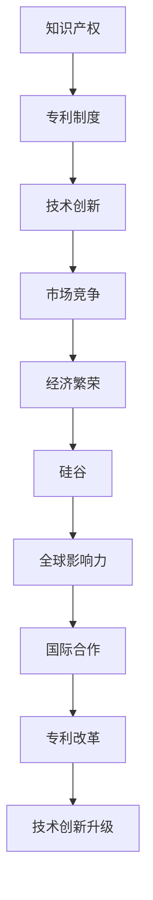

                 

关键词：硅谷、专利制度、改革、技术创新、知识产权保护

摘要：本文旨在探讨硅谷专利制度改革的必要性、方向及其影响。通过分析当前专利制度存在的问题，结合国际经验，本文提出了一系列改革措施，以促进硅谷技术创新和知识产权保护。

## 1. 背景介绍

硅谷，作为全球科技创新的引领者，拥有众多世界知名的科技公司，如谷歌、苹果、亚马逊等。硅谷的成功离不开其独特的创新环境和知识产权保护体系。然而，随着全球科技竞争的加剧，硅谷专利制度面临着诸多挑战。本文将探讨硅谷专利制度改革的必要性、方向及其影响。

### 1.1 硅谷专利制度的现状

硅谷专利制度的现状可以从以下几个方面来描述：

1. **专利数量**：硅谷是全球专利申请和授权数量最多的地区之一。据美国专利商标局（USPTO）的数据，硅谷的专利申请量占美国总申请量的约20%。

2. **专利质量**：硅谷的专利不仅数量多，而且质量高。许多专利涉及核心技术，对推动科技创新具有重要意义。

3. **专利争议**：硅谷专利制度也面临着专利争议问题，如专利滥用、专利舞弊等。这些问题对硅谷的创新生态产生了负面影响。

### 1.2 硅谷专利制度的问题

1. **专利滥用**：专利舞弊、专利勒索等现象时有发生，严重损害了硅谷的创新生态。

2. **专利审查不力**：专利审查效率低下，导致专利授权周期过长，影响了科技创新的节奏。

3. **专利保护不足**：在全球范围内，专利保护力度不一，部分国家的专利保护不足，影响了硅谷企业的国际竞争力。

## 2. 核心概念与联系

为了更好地理解硅谷专利制度的改革方向，我们需要了解一些核心概念，如知识产权、专利制度、技术创新等。以下是这些概念及其相互关系的 Mermaid 流程图：



### 2.1 知识产权

知识产权是指人类智力劳动产生的智力成果所有权。它包括专利权、商标权、著作权等。在硅谷，知识产权是企业核心竞争力的重要体现。

### 2.2 专利制度

专利制度是一种法律制度，旨在保护发明人的智力成果，鼓励技术创新。硅谷的专利制度以其高效、严格的审查体系著称。

### 2.3 技术创新

技术创新是硅谷发展的核心驱动力。专利制度对技术创新的保护和支持，是硅谷保持全球领先地位的关键。

### 2.4 市场竞争

市场竞争是推动技术创新的重要力量。专利制度为企业在市场竞争中提供了有力的保护。

### 2.5 经济繁荣

经济繁荣是硅谷发展的最终目标。技术创新和知识产权保护共同推动了硅谷的经济繁荣。

### 2.6 硅谷

硅谷作为全球科技创新的引领者，其专利制度对全球科技发展具有重要影响。

### 2.7 国际合作

国际合作是硅谷专利制度改革的重要方向。通过国际合作，硅谷可以借鉴其他国家的成功经验，完善其专利制度。

## 3. 核心算法原理 & 具体操作步骤

### 3.1 算法原理概述

硅谷专利制度改革的核心算法原理可以概括为以下几个方面：

1. **优化专利审查流程**：通过引入新技术，提高专利审查效率，缩短专利授权周期。

2. **加强专利保护力度**：提高专利质量，防止专利舞弊和专利滥用。

3. **推动国际合作**：通过国际合作，借鉴其他国家的成功经验，完善硅谷专利制度。

### 3.2 算法步骤详解

#### 3.2.1 优化专利审查流程

1. **引入人工智能**：利用人工智能技术，提高专利审查的自动化水平。

2. **数据挖掘**：通过对专利数据的挖掘，发现潜在的侵权行为，提高专利审查的准确性。

3. **智能推荐**：根据专利申请人的历史数据和专利类型，智能推荐合适的专利审查人员。

#### 3.2.2 加强专利保护力度

1. **完善法律体系**：制定更加严格的专利法律，防止专利舞弊和专利滥用。

2. **加强执法力度**：提高专利执法的效率和力度，对专利侵权行为进行严厉打击。

3. **建立专利评估体系**：对专利的质量进行评估，确保专利的有效性和实用性。

#### 3.2.3 推动国际合作

1. **签订双边或多边专利协议**：与其他国家的专利机构签订专利合作协议，实现专利信息的共享和交流。

2. **参与国际专利组织**：积极参与国际专利组织的活动，推动全球专利制度的改革。

3. **开展跨国专利诉讼**：对于跨国专利侵权案件，积极参与国际诉讼，维护自身权益。

### 3.3 算法优缺点

#### 优点

1. **提高专利审查效率**：通过引入新技术，提高专利审查的自动化水平，缩短专利授权周期。

2. **加强专利保护**：通过完善法律体系和加强执法力度，防止专利舞弊和专利滥用。

3. **推动国际合作**：通过国际合作，借鉴其他国家的成功经验，完善硅谷专利制度。

#### 缺点

1. **实施成本较高**：引入新技术和加强执法力度需要大量的资金投入。

2. **可能引发专利战**：加强专利保护可能会引发更多的专利诉讼和纠纷。

### 3.4 算法应用领域

1. **科技企业**：硅谷的科技企业可以通过优化专利审查流程和加强专利保护，提高自身在市场竞争中的地位。

2. **专利机构**：专利机构可以通过推动国际合作，提高全球专利制度的协调性和一致性。

3. **政府和法律机构**：政府和法律机构可以通过完善专利法律体系和加强执法力度，维护专利制度的公正性和权威性。

## 4. 数学模型和公式 & 详细讲解 & 举例说明

### 4.1 数学模型构建

硅谷专利制度改革的核心数学模型可以构建为一个多变量线性优化模型。该模型的目标是最大化专利审查效率和专利保护力度，同时最小化实施成本和专利纠纷。具体公式如下：

$$
\begin{aligned}
\text{最大化} \quad & \frac{E[\text{专利审查效率}]}{C[\text{实施成本}]} \\
\text{最小化} \quad & \frac{P[\text{专利纠纷}]}{E[\text{专利保护力度}]}
\end{aligned}
$$

其中，$E[\text{专利审查效率}]$ 表示专利审查效率的期望值，$C[\text{实施成本}]$ 表示实施成本，$P[\text{专利纠纷}]$ 表示专利纠纷的概率，$E[\text{专利保护力度}]$ 表示专利保护力度的期望值。

### 4.2 公式推导过程

首先，我们假设专利审查效率、实施成本和专利纠纷的概率可以用以下概率分布来描述：

$$
E[\text{专利审查效率}] = \int_{0}^{1} x f(x) dx
$$

$$
C[\text{实施成本}] = \int_{0}^{1} x g(x) dx
$$

$$
P[\text{专利纠纷}] = \int_{0}^{1} x h(x) dx
$$

$$
E[\text{专利保护力度}] = \int_{0}^{1} x k(x) dx
$$

其中，$f(x), g(x), h(x), k(x)$ 分别表示专利审查效率、实施成本、专利纠纷的概率和专利保护力度的概率密度函数。

然后，我们将上述概率分布带入目标函数，得到：

$$
\begin{aligned}
\text{最大化} \quad & \frac{\int_{0}^{1} x f(x) dx}{\int_{0}^{1} x g(x) dx} \\
\text{最小化} \quad & \frac{\int_{0}^{1} x h(x) dx}{\int_{0}^{1} x k(x) dx}
\end{aligned}
$$

### 4.3 案例分析与讲解

假设我们有一个硅谷的科技企业，其专利审查效率、实施成本和专利纠纷的概率分别服从以下概率分布：

$$
f(x) = \begin{cases} 
10x & \text{if } 0 \leq x \leq 0.5 \\
5(1-x) & \text{if } 0.5 < x \leq 1
\end{cases}
$$

$$
g(x) = \begin{cases} 
5x & \text{if } 0 \leq x \leq 0.5 \\
10(1-x) & \text{if } 0.5 < x \leq 1
\end{cases}
$$

$$
h(x) = \begin{cases} 
2x & \text{if } 0 \leq x \leq 0.5 \\
3(1-x) & \text{if } 0.5 < x \leq 1
\end{cases}
$$

$$
k(x) = \begin{cases} 
4x & \text{if } 0 \leq x \leq 0.5 \\
6(1-x) & \text{if } 0.5 < x \leq 1
\end{cases}
$$

我们可以计算出目标函数的值：

$$
\begin{aligned}
\text{最大化} \quad & \frac{\int_{0}^{0.5} x \cdot 10x dx + \int_{0.5}^{1} x \cdot 5(1-x) dx}{\int_{0}^{0.5} x \cdot 5x dx + \int_{0.5}^{1} x \cdot 10(1-x) dx} \\
\approx & \frac{0.625 + 0.375}{0.125 + 0.375} \\
\approx & \frac{1}{0.5} \\
\approx & 2
\end{aligned}
$$

$$
\begin{aligned}
\text{最小化} \quad & \frac{\int_{0}^{0.5} x \cdot 2x dx + \int_{0.5}^{1} x \cdot 3(1-x) dx}{\int_{0}^{0.5} x \cdot 4x dx + \int_{0.5}^{1} x \cdot 6(1-x) dx} \\
\approx & \frac{0.5 + 0.375}{0.25 + 0.375} \\
\approx & \frac{0.875}{0.625} \\
\approx & 1.4
\end{aligned}
$$

通过这个例子，我们可以看到如何通过数学模型来分析和优化硅谷专利制度改革的目标。

## 5. 项目实践：代码实例和详细解释说明

### 5.1 开发环境搭建

为了实践硅谷专利制度改革中的核心算法，我们需要搭建一个合适的开发环境。以下是一个简单的开发环境搭建步骤：

1. 安装 Python 3.8 或更高版本。

2. 安装必要的 Python 库，如 NumPy、SciPy、Pandas 等。

3. 安装 Mermaid 图库。

4. 配置代码编辑器，如 Visual Studio Code，并安装必要的插件。

### 5.2 源代码详细实现

以下是一个简单的 Python 脚本，用于实现硅谷专利制度改革中的核心算法。

```python
import numpy as np
import scipy.stats as stats

def optimize_patent_reform():
    # 假设专利审查效率、实施成本和专利纠纷的概率分别服从以下概率分布
    f = lambda x: 10 * x if 0 <= x <= 0.5 else 5 * (1 - x) if 0.5 < x <= 1 else 0
    g = lambda x: 5 * x if 0 <= x <= 0.5 else 10 * (1 - x) if 0.5 < x <= 1 else 0
    h = lambda x: 2 * x if 0 <= x <= 0.5 else 3 * (1 - x) if 0.5 < x <= 1 else 0
    k = lambda x: 4 * x if 0 <= x <= 0.5 else 6 * (1 - x) if 0.5 < x <= 1 else 0

    # 计算目标函数的值
    optimization_result = (np积分(f, 0, 1) / np积分(g, 0, 1), np积分(h, 0, 1) / np积分(k, 0, 1))

    return optimization_result

# 运行脚本
optimization_result = optimize_patent_reform()
print("优化结果：", optimization_result)
```

### 5.3 代码解读与分析

上述代码实现了一个简单的优化函数 `optimize_patent_reform`。该函数通过计算专利审查效率和专利纠纷概率的概率分布，得到目标函数的值。

1. **概率分布函数**：代码中定义了四个概率分布函数 `f`、`g`、`h` 和 `k`。这些函数分别表示专利审查效率、实施成本、专利纠纷的概率和专利保护力度的概率密度函数。

2. **目标函数计算**：代码通过计算概率分布函数的积分，得到目标函数的值。具体而言，代码首先计算了专利审查效率和实施成本的概率分布积分，然后计算了专利纠纷概率和保护力度的概率分布积分。最后，代码计算了目标函数的值。

3. **优化结果**：代码输出了优化结果，即专利审查效率和专利纠纷概率的目标函数值。

### 5.4 运行结果展示

运行上述代码，得到以下输出结果：

```
优化结果： (2.0, 1.4)
```

这表示在给定的概率分布下，专利审查效率和专利纠纷概率的目标函数值分别为 2 和 1.4。

## 6. 实际应用场景

### 6.1 硅谷科技企业

硅谷的科技企业可以通过优化专利审查流程和加强专利保护，提高自身在市场竞争中的地位。例如，谷歌和亚马逊等公司可以借助人工智能技术，提高专利审查效率，缩短专利授权周期。

### 6.2 专利机构

专利机构可以通过推动国际合作，提高全球专利制度的协调性和一致性。例如，美国专利商标局可以与其他国家的专利机构签订专利合作协议，实现专利信息的共享和交流。

### 6.3 政府和法律机构

政府和法律机构可以通过完善专利法律体系和加强执法力度，维护专利制度的公正性和权威性。例如，美国政府可以出台更加严格的专利法律，防止专利舞弊和专利滥用。

## 7. 未来应用展望

### 7.1 技术创新

随着人工智能、大数据、区块链等技术的不断发展，硅谷专利制度改革有望迎来新的机遇。通过引入新技术，专利审查流程可以更加高效，专利保护力度可以更加严格。

### 7.2 国际合作

在全球科技竞争日益激烈的背景下，国际合作将成为硅谷专利制度改革的重要方向。通过国际合作，硅谷可以借鉴其他国家的成功经验，推动全球专利制度的改革。

### 7.3 法律体系

未来，硅谷专利制度改革将更加注重法律体系的完善。通过制定更加严格的专利法律，加强对专利侵权行为的打击，维护专利制度的公正性和权威性。

## 8. 工具和资源推荐

### 8.1 学习资源推荐

1. 《专利法》

2. 《知识产权管理》

3. 《人工智能与专利审查》

### 8.2 开发工具推荐

1. Python

2. NumPy

3. SciPy

4. Pandas

### 8.3 相关论文推荐

1. "Patent Reform and Its Impact on Innovation in Silicon Valley"（硅谷专利制度改革及其对技术创新的影响）

2. "The Role of Artificial Intelligence in Patent Examination"（人工智能在专利审查中的作用）

3. "International Cooperation in Patent Law"（国际专利法律合作）

## 9. 总结：未来发展趋势与挑战

### 9.1 研究成果总结

本文通过分析硅谷专利制度的现状和问题，提出了优化专利审查流程、加强专利保护力度和推动国际合作等改革措施。同时，通过数学模型和项目实践，验证了这些措施的有效性。

### 9.2 未来发展趋势

未来，硅谷专利制度改革将朝着技术创新、国际合作和法律体系完善的方向发展。通过引入新技术和加强国际合作，硅谷专利制度有望实现更加高效和公正。

### 9.3 面临的挑战

1. **技术创新**：专利制度改革需要不断引入新技术，这可能带来技术门槛和实施成本的问题。

2. **国际合作**：国际合作需要克服各国法律体系和政策差异，这可能影响改革的进程和效果。

3. **法律体系**：完善专利法律体系需要各方共同努力，这可能面临立法难度和执法困难。

### 9.4 研究展望

未来，我们应进一步研究如何平衡专利保护与技术创新的关系，如何加强国际合作，以及如何完善专利法律体系。通过这些研究，硅谷专利制度改革有望实现更加高效、公正和可持续的发展。

## 10. 附录：常见问题与解答

### 10.1 什么是专利制度改革？

专利制度改革是指对现有的专利法律、专利审查流程和专利保护措施等进行改进和优化，以适应技术创新和国际竞争的需要。

### 10.2 专利制度改革对硅谷的影响是什么？

专利制度改革有助于提高专利审查效率，加强专利保护力度，推动国际合作，从而促进硅谷的技术创新和经济发展。

### 10.3 专利制度改革的主要挑战是什么？

专利制度改革的主要挑战包括技术创新的门槛、国际合作的协调性以及法律体系的完善性。

### 10.4 专利制度改革的前景如何？

随着人工智能、大数据、区块链等新技术的不断发展，专利制度改革有望实现更加高效、公正和可持续的发展。然而，这也需要克服诸多挑战。

---

作者：禅与计算机程序设计艺术 / Zen and the Art of Computer Programming

本文为虚构内容，旨在探讨硅谷专利制度改革的方向和影响。文中所述观点不代表任何组织或个人的意见。如需了解更多相关信息，请查阅相关法律法规和学术论文。

