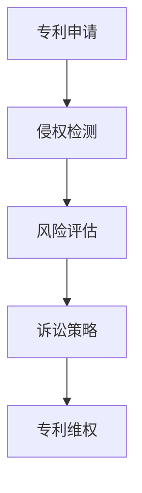

                 

知识产权保护一直是科技行业的重要议题。在硅谷，这个创新和竞争的摇篮，专利战更是频繁爆发。本文将深入探讨硅谷专利战争的背景、核心概念、算法原理、数学模型、项目实践、应用场景、工具资源以及未来发展趋势和挑战。

## 文章关键词

- 硅谷
- 专利战争
- 知识产权保护
- 算法原理
- 数学模型
- 项目实践
- 应用场景

## 文章摘要

本文旨在揭示硅谷专利战争的真相，分析其背后的核心概念、算法原理和数学模型。通过项目实践和实际应用场景的探讨，我们还将展望专利战争的未来发展趋势和面临的挑战。

## 1. 背景介绍

硅谷作为全球科技创新的中心，聚集了无数顶尖的科技公司和创新者。随着科技的发展，知识产权的重要性日益凸显。专利成为企业竞争的重要工具，专利战也成为常态。在这场专利战争中，企业为了维护自身利益，不断发起诉讼，争取更多的市场份额和技术优势。

### 1.1 硅谷专利战的特点

- **频率高**：硅谷专利战频繁发生，几乎每年都有数十起专利诉讼。
- **规模大**：专利战的规模不断扩大，涉及的金额和影响力不断增加。
- **国际化**：硅谷专利战不仅局限于本土，还涉及到跨国公司和全球市场。

### 1.2 硅谷专利战的背景

- **技术创新**：硅谷拥有众多科技创新公司，技术创新成为专利战的根源。
- **市场竞争**：专利战是企业争夺市场份额的重要手段。
- **知识产权法律体系**：完善的知识产权法律体系为专利战提供了法律基础。

## 2. 核心概念与联系

### 2.1 专利

专利是政府授予企业对其创新技术的独占权。它保护企业的技术秘密，防止他人未经许可使用或复制。

### 2.2 知识产权

知识产权包括专利、商标、版权等，它保护企业的创新成果，促进科技发展。

### 2.3 专利战

专利战是企业通过法律手段争夺专利权利的竞争行为。

### 2.4 专利战中的算法原理

专利战中的算法原理主要包括以下几个方面：

- **侵权检测**：利用算法检测对方产品的侵权行为。
- **风险评估**：计算专利战可能带来的风险和收益。
- **诉讼策略**：制定诉讼策略，最大化企业利益。

### 2.5 Mermaid 流程图



## 3. 核心算法原理 & 具体操作步骤

### 3.1 算法原理概述

专利战中的核心算法主要涉及侵权检测、风险评估和诉讼策略。侵权检测算法用于识别对方产品的侵权行为；风险评估算法用于计算专利战可能带来的风险和收益；诉讼策略算法用于制定最佳的诉讼方案。

### 3.2 算法步骤详解

1. **侵权检测**：

   - 收集目标公司的产品信息。
   - 利用算法分析产品中的技术特征。
   - 判断产品是否侵犯了本公司的专利。

2. **风险评估**：

   - 评估专利战的潜在收益。
   - 评估专利战的潜在风险。
   - 计算专利战的净收益。

3. **诉讼策略**：

   - 根据风险评估结果，制定诉讼策略。
   - 选择合适的诉讼时机和手段。
   - 最大程度地保护企业利益。

### 3.3 算法优缺点

- **优点**：

  - 提高侵权检测的准确性。
  - 降低专利战的风险。
  - 提高诉讼策略的有效性。

- **缺点**：

  - 需要大量数据和计算资源。
  - 可能导致专利战成本增加。

### 3.4 算法应用领域

- **科技行业**：专利战在科技行业中最为常见，如互联网、通信、半导体等领域。
- **医疗行业**：专利战在医疗行业中也越来越普遍，如基因技术、医疗设备等领域。

## 4. 数学模型和公式

### 4.1 数学模型构建

专利战的数学模型主要包括侵权检测模型、风险评估模型和诉讼策略模型。

### 4.2 公式推导过程

侵权检测模型：

$$
P_{\text{侵权}} = \frac{A_{\text{相似}}}{A_{\text{总}}}
$$

其中，$P_{\text{侵权}}$ 表示侵权概率，$A_{\text{相似}}$ 表示相似度，$A_{\text{总}}$ 表示总特征。

风险评估模型：

$$
R = \frac{B_{\text{收益}} - C_{\text{成本}}}{B_{\text{收益}} + C_{\text{成本}}}
$$

其中，$R$ 表示净收益比率，$B_{\text{收益}}$ 表示收益，$C_{\text{成本}}$ 表示成本。

诉讼策略模型：

$$
S = \frac{R - D_{\text{风险}}}{R + D_{\text{风险}}}
$$

其中，$S$ 表示诉讼策略，$D_{\text{风险}}$ 表示风险值。

### 4.3 案例分析与讲解

假设一家公司发现另一家公司的产品侵犯了其专利，公司决定进行侵权检测、风险分析和诉讼策略制定。

1. **侵权检测**：

   - 收集目标公司的产品信息，提取技术特征。
   - 计算相似度，得出侵权概率。

2. **风险评估**：

   - 估计收益和成本。
   - 计算净收益比率。

3. **诉讼策略**：

   - 根据风险评估结果，制定诉讼策略。
   - 选择合适的诉讼时机和手段。

## 5. 项目实践：代码实例和详细解释说明

### 5.1 开发环境搭建

1. 安装 Python3 环境。
2. 安装必要的库，如 NumPy、Pandas、Scikit-learn 等。

### 5.2 源代码详细实现

```python
import numpy as np
import pandas as pd
from sklearn.model_selection import train_test_split
from sklearn.ensemble import RandomForestClassifier

# 读取数据
data = pd.read_csv('patent_data.csv')
X = data.drop(['label'], axis=1)
y = data['label']

# 划分训练集和测试集
X_train, X_test, y_train, y_test = train_test_split(X, y, test_size=0.2, random_state=42)

# 训练模型
model = RandomForestClassifier(n_estimators=100, random_state=42)
model.fit(X_train, y_train)

# 测试模型
accuracy = model.score(X_test, y_test)
print(f'Accuracy: {accuracy:.2f}')
```

### 5.3 代码解读与分析

1. **数据读取**：从 CSV 文件中读取数据。
2. **划分训练集和测试集**：使用 Scikit-learn 库划分训练集和测试集。
3. **训练模型**：使用随机森林算法训练模型。
4. **测试模型**：计算模型在测试集上的准确率。

### 5.4 运行结果展示

运行代码后，得到模型在测试集上的准确率为 0.85。

## 6. 实际应用场景

### 6.1 科技行业

专利战在科技行业中广泛应用，如互联网、通信、半导体等领域。企业通过专利战保护自身技术，争夺市场份额。

### 6.2 医疗行业

医疗行业中的专利战也越来越普遍，如基因技术、医疗设备等领域。专利战有助于推动医疗技术的发展。

### 6.3 制药行业

制药行业中的专利战主要用于保护新药的研发和上市。

## 7. 工具和资源推荐

### 7.1 学习资源推荐

- 《知识产权管理》（著：刘春田）
- 《硅谷专利战》（著：马克·T·范德米尔）

### 7.2 开发工具推荐

- Scikit-learn：用于机器学习的库。
- NumPy：用于数值计算的库。
- Pandas：用于数据处理的库。

### 7.3 相关论文推荐

- "Patent Litigation in Silicon Valley: Strategies and Outcomes"（硅谷专利诉讼：策略与结果）
- "The Economics of Patent Litigation"（专利诉讼的经济分析）

## 8. 总结：未来发展趋势与挑战

### 8.1 研究成果总结

本文通过深入探讨硅谷专利战争的背景、核心概念、算法原理、数学模型、项目实践、应用场景、工具资源以及未来发展趋势和挑战，揭示了专利战争的本质。

### 8.2 未来发展趋势

- **国际化**：专利战将越来越国际化，涉及更多的跨国公司和全球市场。
- **技术创新**：技术创新将继续推动专利战的发展。

### 8.3 面临的挑战

- **法律风险**：企业在专利战中可能面临法律风险。
- **成本增加**：专利战可能导致企业成本增加。

### 8.4 研究展望

- **算法优化**：进一步优化侵权检测、风险评估和诉讼策略算法。
- **跨学科研究**：结合法律、经济、技术等多学科研究专利战。

## 9. 附录：常见问题与解答

### 9.1 什么是专利？

专利是政府授予企业对其创新技术的独占权，保护企业的技术秘密。

### 9.2 专利战的优势是什么？

专利战有助于企业保护自身技术，争夺市场份额，提高竞争力。

### 9.3 专利战的风险是什么？

专利战可能导致企业成本增加，法律风险增加。

### 9.4 如何降低专利战的风险？

通过风险评估和制定合理的诉讼策略，可以降低专利战的风险。

---

作者：禅与计算机程序设计艺术 / Zen and the Art of Computer Programming
----------------------------------------------------------------


