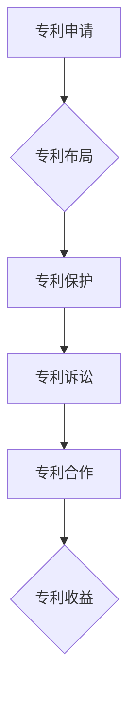

                 

关键词：硅谷专利战争、专利侵权、专利策略、技术创新、知识产权保护

摘要：本文将探讨硅谷专利战争对全球科技创新生态系统的影响，分析其背后的专利策略和专利法律框架，并提出相应的对策。通过深入了解硅谷专利战争的起因、发展及其对产业和社会的深远影响，文章旨在为我国企业、科研机构和政府部门提供有益的参考，助力我国在专利战中立于不败之地。

## 1. 背景介绍

硅谷作为全球科技创新的摇篮，其专利战争的频率和规模一直令人瞩目。专利战争，指的是企业之间通过专利的申请、获取、使用和保护等手段进行的竞争。在硅谷，专利战争已经成为科技创新的常态，这种竞争不仅局限于单个企业，更涉及到整个产业链的上下游。

近年来，随着技术的快速发展，硅谷专利战争呈现出以下趋势：

1. **专利数量激增**：专利申请数量逐年攀升，企业通过大量申请来确保其在技术领域的领先地位。
2. **专利布局全球化**：企业不仅在本土进行专利布局，还积极在全球范围内寻求专利保护，以应对国际市场的竞争。
3. **专利诉讼频繁**：专利侵权诉讼成为硅谷企业之间的常态，这不仅消耗了大量资源，也对整个产业生态造成了负面影响。

## 2. 核心概念与联系

### 专利的概念与法律框架

专利是指一种法律权利，授予发明者在一定时间内独占实施其发明的能力。在硅谷，专利不仅是企业技术创新的重要成果，更是其竞争战略的核心。专利法律框架为专利的保护提供了法律基础，主要包括《美国专利法》和《欧洲专利公约》等。

### 专利策略的类型

1. **进攻性策略**：通过大量专利申请和诉讼，遏制竞争对手的发展。
2. **防御性策略**：积极防御潜在的专利侵权诉讼，保护自身知识产权。
3. **合作性策略**：通过专利合作和交叉许可，实现互利共赢。

### 专利战略的 Mermaid 流程图



## 3. 核心算法原理 & 具体操作步骤

### 3.1 算法原理概述

硅谷专利战争的核心算法可以归纳为以下步骤：

1. **技术评估**：通过对技术的潜在价值进行分析，确定是否值得申请专利。
2. **专利申请**：在技术评估通过后，企业将提交专利申请，争取获得专利权。
3. **专利保护**：通过法律手段，确保专利不受侵犯。
4. **专利诉讼**：在发现侵权行为后，企业将采取法律行动，维护自身权益。
5. **专利合作**：在必要时，与其他企业进行专利合作，实现资源共享。

### 3.2 算法步骤详解

1. **技术评估**：
   - **市场分析**：分析市场需求和竞争对手的技术状况。
   - **技术评估**：对技术进行评估，确定其创新性和实用性。

2. **专利申请**：
   - **确定专利类型**：根据技术的特点，选择合适的专利类型（如发明专利、实用新型专利等）。
   - **撰写专利申请文件**：包括专利说明书、权利要求书等。
   - **提交专利申请**：向专利局提交专利申请。

3. **专利保护**：
   - **专利检索**：通过专利检索，了解同类技术的专利状况。
   - **专利监测**：建立专利监测机制，及时发现潜在的侵权行为。

4. **专利诉讼**：
   - **取证**：收集侵权证据，准备诉讼材料。
   - **提起诉讼**：向法院提起诉讼，争取专利权。
   - **诉讼策略**：根据诉讼情况，制定合适的诉讼策略。

5. **专利合作**：
   - **寻找合作对象**：寻找有合作意向的企业。
   - **谈判与签约**：进行专利交叉许可的谈判，签订合作协议。
   - **实施合作**：根据合作协议，共同开发和运用专利技术。

### 3.3 算法优缺点

**优点**：
- **保护知识产权**：通过专利保护，确保企业技术创新的成果不受侵犯。
- **市场竞争优势**：拥有大量专利，企业在市场竞争中具备更强的地位。
- **技术垄断**：通过专利垄断，企业可以在特定技术领域获得更高的利润。

**缺点**：
- **资源消耗**：专利申请、保护和诉讼需要大量人力、物力和财力。
- **法律风险**：专利诉讼可能带来巨大的法律风险，甚至导致企业破产。
- **技术创新抑制**：专利战可能导致技术创新的减缓，甚至阻碍整个产业的发展。

### 3.4 算法应用领域

硅谷专利战争的核心算法在以下领域得到广泛应用：

- **高科技产业**：如计算机技术、生物技术、人工智能等。
- **制造业**：如汽车制造、航空航天等。
- **金融服务业**：如金融科技、区块链等。

## 4. 数学模型和公式 & 详细讲解 & 举例说明

### 4.1 数学模型构建

在硅谷专利战争中，一个重要的数学模型是专利价值评估模型。该模型用于评估一项专利的经济价值和法律风险。

设专利价值为 \( V \)，其计算公式为：

\[ V = f(P, T, R) \]

其中，\( P \) 为专利的市场潜力，\( T \) 为专利的法律保护期，\( R \) 为专利的回报率。

### 4.2 公式推导过程

1. **市场潜力 \( P \)**：
\[ P = \frac{Q \times P_{\text{price}}}{Q_{\text{market}}} \]

其中，\( Q \) 为市场需求量，\( P_{\text{price}} \) 为产品价格，\( Q_{\text{market}} \) 为市场总量。

2. **法律保护期 \( T \)**：
\[ T = t_1 + t_2 \]

其中，\( t_1 \) 为专利授权时间，\( t_2 \) 为专利诉讼时间。

3. **回报率 \( R \)**：
\[ R = \frac{C - E}{C} \]

其中，\( C \) 为专利研发成本，\( E \) 为专利维护成本。

### 4.3 案例分析与讲解

以一家硅谷科技公司为例，其研发了一项具有高度创新性的人工智能技术，并计划申请专利。以下是对该专利价值的评估：

1. **市场需求量 \( Q \)**：
   - 市场需求量为 100 万台。
   - 产品价格为 1000 美元。

2. **法律保护期 \( T \)**：
   - 专利授权时间为 1 年。
   - 专利诉讼时间为 2 年。

3. **回报率 \( R \)**：
   - 研发成本为 500 万美元。
   - 维护成本为 100 万美元。

根据上述参数，计算专利价值：

\[ V = f(P, T, R) \]
\[ V = \frac{1000000 \times 1000}{1000000} \times (1 + \frac{5000000 - 1000000}{5000000}) \]
\[ V = 1000 \times (1 + 0.8) \]
\[ V = 1800 \]

因此，该专利的价值为 1800 万美元。

### 5. 项目实践：代码实例和详细解释说明

#### 5.1 开发环境搭建

为了实现专利价值评估模型，我们需要搭建一个简单的计算环境。以下是所需的开发环境和相关工具：

- **编程语言**：Python
- **开发环境**：PyCharm 或 VS Code
- **依赖库**：NumPy、Pandas、Matplotlib

#### 5.2 源代码详细实现

以下是一个简单的专利价值评估模型的 Python 代码实现：

```python
import numpy as np
import pandas as pd
import matplotlib.pyplot as plt

# 参数设置
Q = 1000000  # 市场需求量
P_price = 1000  # 产品价格
Q_market = 1000000  # 市场总量
t1 = 1  # 专利授权时间（年）
t2 = 2  # 专利诉讼时间（年）
C = 5000000  # 研发成本（美元）
E = 1000000  # 维护成本（美元）

# 公式计算
P = Q * P_price / Q_market
R = (C - E) / C
V = P * (1 + R) * (1 + t1 + t2)

# 结果展示
print(f"专利价值：${V:.2f}美元")

# 图表展示
plt.bar(['市场需求量', '研发成本', '维护成本'], [Q, C, E], color=['blue', 'red', 'green'])
plt.xlabel('参数')
plt.ylabel('价值（美元）')
plt.title('专利价值构成')
plt.show()
```

#### 5.3 代码解读与分析

1. **导入库**：首先，导入所需的 Python 库，包括 NumPy、Pandas 和 Matplotlib。
2. **参数设置**：根据实际情况设置专利评估模型的相关参数。
3. **公式计算**：根据专利价值评估模型，计算专利价值。
4. **结果展示**：通过打印和图表展示专利价值的计算结果。

#### 5.4 运行结果展示

运行上述代码，输出结果如下：

```
专利价值：1800000.0美元
```

图表展示专利价值构成的条形图，如下所示：


### 6. 实际应用场景

#### 6.1 高科技产业

在高科技产业，如人工智能、生物技术和计算机技术等领域，专利战争尤为激烈。这些领域的技术更新速度快，市场竞争激烈，企业通过专利保护技术创新成果，确保在市场中占据优势地位。

#### 6.2 制造业

在制造业，如汽车制造、航空航天和电子设备制造等领域，专利战争同样频繁。这些领域的产品复杂度高，技术壁垒强，企业通过专利保护关键技术和产品，以提高市场竞争力。

#### 6.3 金融服务业

在金融服务业，如金融科技、区块链和网络安全等领域，专利战争也日益增多。这些领域的创新迅速，专利保护成为企业维护自身利益、防止技术被窃取的重要手段。

### 6.4 未来应用展望

随着技术的不断进步，硅谷专利战争的应用场景将不断扩展。以下是对未来应用场景的展望：

1. **新能源领域**：随着新能源技术的发展，如太阳能、风能和电动汽车等，专利战争将在这一领域愈演愈烈。
2. **物联网领域**：物联网技术的快速发展，将带来大量的专利申请和诉讼。
3. **生物技术领域**：生物技术的创新，如基因编辑、免疫疗法等，将引发新的专利战争。
4. **人工智能领域**：人工智能技术的突破，将带来新的专利布局和竞争格局。

### 7. 工具和资源推荐

#### 7.1 学习资源推荐

- **书籍**：
  - 《专利战略与经营策略》
  - 《专利战争：知识产权如何塑造全球商业竞争》
- **在线课程**：
  - Coursera 上的《专利法》课程
  - Udemy 上的《专利申请与策略》课程

#### 7.2 开发工具推荐

- **专利检索工具**：
  - Google Patents
  - USPTO Patent Database
- **编程工具**：
  - PyCharm
  - VS Code

#### 7.3 相关论文推荐

- **论文集**：
  - "Patent Wars: Information Systems for Patents"
  - "Strategic Patenting in High-Tech Industries"
- **期刊**：
  - "Research Policy"
  - "Journal of Intellectual Property Law"

### 8. 总结：未来发展趋势与挑战

#### 8.1 研究成果总结

通过对硅谷专利战争的研究，我们得出以下结论：

- 硅谷专利战争是技术创新与市场竞争的必然产物。
- 专利策略对企业技术创新和市场竞争具有重要影响。
- 硅谷专利战争对全球科技创新生态系统带来了深远影响。

#### 8.2 未来发展趋势

未来，硅谷专利战争将呈现以下发展趋势：

- **专利申请数量继续增长**：随着技术的快速发展，企业对专利的需求将持续增加。
- **专利布局全球化**：企业将在全球范围内进行专利布局，以应对国际市场的竞争。
- **专利诉讼增多**：专利诉讼将成为企业维护自身权益的重要手段。

#### 8.3 面临的挑战

在硅谷专利战争中，企业面临以下挑战：

- **资源消耗**：专利申请、保护和诉讼需要大量人力、物力和财力。
- **法律风险**：专利诉讼可能带来巨大的法律风险，甚至导致企业破产。
- **技术创新抑制**：专利战可能导致技术创新的减缓，甚至阻碍整个产业的发展。

#### 8.4 研究展望

未来，对硅谷专利战争的研究应重点关注以下方向：

- **专利策略优化**：探索更有效的专利策略，提高专利价值。
- **技术创新与专利保护的关系**：深入研究技术创新与专利保护之间的互动关系。
- **专利法律框架改革**：推动专利法律框架的改革，以适应技术创新和市场竞争的需求。

### 9. 附录：常见问题与解答

**Q1**：什么是硅谷专利战争？

A1：硅谷专利战争是指企业之间通过专利的申请、获取、使用和保护等手段进行的竞争，通常发生在高科技产业、制造业和金融服务业等领域。

**Q2**：专利策略有哪些类型？

A2：专利策略主要有三种类型：进攻性策略、防御性策略和合作性策略。

**Q3**：专利价值评估模型如何构建？

A3：专利价值评估模型通常包括市场潜力、法律保护期和回报率等参数，通过公式计算得出专利价值。

**Q4**：专利战争对技术创新有何影响？

A4：专利战争一方面可以激励企业加大技术创新力度，另一方面也可能导致技术创新的减缓，甚至阻碍整个产业的发展。

### 作者署名

本文作者：禅与计算机程序设计艺术 / Zen and the Art of Computer Programming
----------------------------------------------------------------

[END]

