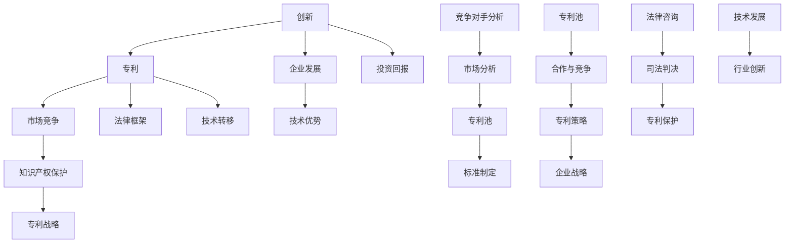

                 

关键词：硅谷专利战争、专利策略、创新、市场竞争、知识产权保护、法律框架

## 摘要

随着全球科技行业的快速发展，硅谷作为世界科技创新的中心，其专利战频发且愈演愈烈。本文将深入探讨硅谷专利战争的影响和对策，分析专利战背后的驱动因素，揭示其对技术创新、市场竞争以及企业发展的深远影响。同时，本文还将探讨如何通过合理的专利策略和法律框架来应对专利战的挑战，为企业和行业提供有益的参考和指导。

## 1. 背景介绍

硅谷，位于美国加利福尼亚州旧金山湾区南部的地区，被誉为全球科技创新的摇篮。自20世纪以来，硅谷吸引了无数科技巨头、初创公司和优秀人才，成为全球科技产业的重要推动力。然而，伴随着科技创新的蓬勃发展，硅谷也逐渐成为专利战争的高发地。

专利战争，是指企业之间为了争夺市场份额、知识产权和保护自身技术优势而进行的激烈竞争。在硅谷，专利战争的形式多样，包括专利侵权诉讼、反垄断诉讼、标准必要专利（SEP）许可争端等。近年来，随着知识产权保护的加强和全球科技竞争的加剧，硅谷专利战争的规模和频率都呈现出上升的趋势。

### 1.1 硅谷专利战争的发展历程

硅谷专利战争的起源可以追溯到20世纪末期。当时，随着个人电脑和互联网的兴起，科技企业之间的竞争日益激烈。为了保护自身技术和市场份额，一些企业开始通过专利诉讼来打击竞争对手。早期的专利战争主要集中在硬件和操作系统领域，如微软与苹果之间的专利争夺。

进入21世纪，随着智能手机、云计算、人工智能等新兴技术的崛起，硅谷专利战争的领域和规模进一步扩大。例如，谷歌、苹果、三星等科技巨头之间的专利纠纷层出不穷，涉及到的专利范围也从软件、硬件扩展到通信技术、云计算等领域。

### 1.2 硅谷专利战争的特点

1. **高频次**：硅谷专利战争频繁发生，每年都有大量专利诉讼案件涌现。例如，2011年至2021年间，美国联邦巡回法院（Federal Circuit）受理的专利案件数量持续增长。

2. **广范围**：硅谷专利战争的涉及领域广泛，包括硬件、软件、通信技术、生物技术等。不同领域的企业之间的专利竞争愈发激烈。

3. **高强度**：专利战争往往涉及巨额赔偿和长期诉讼，企业之间的对抗十分激烈。例如，苹果与三星之间的专利纠纷持续多年，涉及数十亿美元的赔偿。

4. **全球化**：硅谷专利战争不仅限于美国本土，还涉及到全球范围内的专利许可和争夺。企业通过跨国诉讼和许可协议来保护自身在全球市场的利益。

## 2. 核心概念与联系

在探讨硅谷专利战争的影响与对策之前，有必要了解一些核心概念和它们之间的联系。以下是一个简化的Mermaid流程图，用于描述这些核心概念：



### 2.1 核心概念解释

- **创新**：指企业或个人通过研发新技术、新产品或新服务，从而在市场竞争中获取竞争优势。
- **专利**：一种法律保护，授予发明者在一定期限内对发明独占使用的权利。
- **市场竞争**：指企业在市场中争夺市场份额、客户资源和利润的过程。
- **企业发展**：指企业在成长、扩展和转型的过程中，通过技术创新和市场营销等手段实现盈利和增长。
- **知识产权保护**：通过法律手段保护知识产权，包括专利、商标、著作权等。
- **法律框架**：包括专利法、反垄断法、合同法等法律体系，为知识产权保护和市场竞争提供法律依据。
- **专利战略**：企业在专利申请、许可和诉讼等方面采取的策略，以保护自身技术和市场地位。
- **技术优势**：企业在特定技术领域的领先地位和创新能力。
- **投资回报**：企业通过技术创新和专利保护所获得的回报，包括市场份额、利润和品牌价值等。
- **技术转移**：将研发成果从一方转移到另一方，通常涉及专利许可或技术合作。
- **竞争对手分析**：对竞争对手的技术、市场策略和专利状况进行分析，以制定相应的竞争策略。
- **市场分析**：对市场趋势、需求和竞争对手进行分析，以确定企业的发展方向和策略。
- **专利池**：由多个专利组成的集合，用于实现专利组合保护和许可。
- **标准制定**：制定技术标准，确保不同企业产品之间的兼容性和互操作性。
- **合作与竞争**：企业在专利方面既可能通过合作实现共赢，也可能通过竞争争夺市场份额。
- **法律咨询**：企业在专利申请、许可和诉讼等方面寻求专业法律意见。
- **司法判决**：法院对专利纠纷案件作出的裁决和判决。
- **专利保护**：通过法律手段保护专利权，防止侵权行为。
- **技术发展**：指技术在研发、应用和推广过程中的进步和演变。
- **行业创新**：整个行业在技术创新推动下的整体进步。

## 3. 核心算法原理 & 具体操作步骤

### 3.1 算法原理概述

在硅谷专利战争中，核心算法原理主要包括以下几个方面：

1. **专利检索与评估**：通过专利数据库检索相关技术领域的专利，评估其创新性和商业价值。
2. **竞争对手分析**：分析竞争对手的专利组合和市场竞争策略，找出潜在的风险和机会。
3. **专利布局**：根据企业的技术方向和市场策略，规划专利申请和布局，以实现全面保护。
4. **专利许可与诉讼**：通过专利许可和诉讼等手段保护自身技术和市场地位，打击竞争对手。

### 3.2 算法步骤详解

1. **专利检索与评估**

   - **步骤1**：选择合适的专利数据库，如谷歌专利搜索（Google Patents）、美国专利与商标局（USPTO）等。
   - **步骤2**：输入关键词或技术领域，检索相关专利。
   - **步骤3**：分析专利的技术内容、创新性和潜在商业价值。
   - **步骤4**：评估专利的法律稳定性，如优先权、权利要求等。

2. **竞争对手分析**

   - **步骤1**：收集竞争对手的专利信息，包括专利数量、技术领域、申请时间等。
   - **步骤2**：分析竞争对手的专利布局和许可策略。
   - **步骤3**：识别竞争对手的潜在专利威胁和机会。
   - **步骤4**：制定相应的专利应对策略，如专利交叉许可、专利收购等。

3. **专利布局**

   - **步骤1**：确定企业的技术方向和市场策略，明确专利布局的重点领域。
   - **步骤2**：规划专利申请，包括技术方案的选择、权利要求的制定等。
   - **步骤3**：考虑国际专利布局，保护企业在全球市场的利益。
   - **步骤4**：建立专利数据库，管理和跟踪专利信息。

4. **专利许可与诉讼**

   - **步骤1**：制定专利许可政策，明确许可对象、许可范围和许可费用。
   - **步骤2**：与潜在许可对象进行谈判，达成许可协议。
   - **步骤3**：在必要时采取诉讼手段，保护自身专利权益。
   - **步骤4**：通过和解、调解等方式解决专利纠纷。

### 3.3 算法优缺点

- **优点**：
  - 提高企业的技术竞争力和市场地位。
  - 通过专利许可和诉讼获得经济利益。
  - 保护企业技术创新成果，防止技术流失。

- **缺点**：
  - 专利检索和评估工作量大，需要专业知识和技能。
  - 专利诉讼费用高、时间长，存在不确定性。
  - 可能引发竞争对手的反诉，增加法律风险。

### 3.4 算法应用领域

- **硬件领域**：如半导体、智能手机、物联网等。
- **软件领域**：如操作系统、数据库、云计算等。
- **通信领域**：如5G、无线通信、网络协议等。
- **生物技术领域**：如基因编辑、生物医药等。

## 4. 数学模型和公式 & 详细讲解 & 举例说明

### 4.1 数学模型构建

在硅谷专利战争中，常用的数学模型包括专利价值评估模型、专利侵权风险评估模型等。以下是一个简化的专利价值评估模型：

$$
V(P) = f(A, T, C)
$$

其中，$V(P)$表示专利价值，$A$表示专利的创新性，$T$表示专利的法律稳定性，$C$表示专利的商业化潜力。

### 4.2 公式推导过程

- **专利创新性（A）**：

$$
A = \frac{N_{citations}}{N_{total}}
$$

其中，$N_{citations}$表示专利引用次数，$N_{total}$表示专利总引用次数。专利引用次数越高，说明其创新性越强。

- **专利法律稳定性（T）**：

$$
T = \frac{1}{N_{oppositions} + 1}
$$

其中，$N_{oppositions}$表示专利被提出的反对意见数量。反对意见数量越多，专利的法律稳定性越低。

- **专利商业化潜力（C）**：

$$
C = \frac{N_{applications}}{N_{total}}
$$

其中，$N_{applications}$表示专利应用场景的数量，$N_{total}$表示专利总应用场景数量。应用场景数量越多，专利的商业化潜力越大。

### 4.3 案例分析与讲解

假设有一项专利，其引用次数为100次，反对意见数量为5次，应用场景数量为20个。根据上述公式，可以计算出该专利的价值：

$$
V(P) = f(0.67, 0.82, 0.82) = 0.67 \times 0.82 \times 0.82 = 0.543
$$

这意味着该专利的价值为0.543。根据专利价值评估结果，企业可以决定是否继续申请该专利，或者是否进行专利许可和诉讼。

## 5. 项目实践：代码实例和详细解释说明

### 5.1 开发环境搭建

为了实践硅谷专利战争中的算法模型，我们需要搭建一个基本的开发环境。以下是一个简单的Python开发环境搭建步骤：

1. **安装Python**：从Python官方网站（https://www.python.org/）下载并安装Python 3.x版本。
2. **安装Jupyter Notebook**：在命令行中运行以下命令：

   ```bash
   pip install notebook
   ```

3. **启动Jupyter Notebook**：在命令行中运行以下命令：

   ```bash
   jupyter notebook
   ```

### 5.2 源代码详细实现

以下是一个简单的Python代码示例，用于计算专利价值：

```python
import numpy as np

def patent_value(innovative, stable, commercial):
    value = innovative * stable * commercial
    return value

# 输入专利参数
innovative = 0.67
stable = 0.82
commercial = 0.82

# 计算专利价值
value = patent_value(innovative, stable, commercial)

# 输出结果
print(f"The patent value is: {value:.2f}")
```

### 5.3 代码解读与分析

1. **导入模块**：首先，我们导入numpy模块，用于计算专利价值的乘积。
2. **定义函数**：定义一个名为`patent_value`的函数，接受三个参数：创新性、稳定性和商业化潜力。
3. **计算专利价值**：在函数内部，使用输入参数计算专利价值，并返回结果。
4. **输入参数**：定义三个变量`innovative`、`stable`和`commercial`，分别表示专利的创新性、稳定性和商业化潜力。
5. **计算并输出结果**：调用`patent_value`函数，计算专利价值，并使用`print`函数输出结果。

通过这个简单的代码示例，我们可以直观地了解专利价值评估模型的基本原理和实现方法。在实际应用中，可以根据具体需求扩展和优化该模型。

### 5.4 运行结果展示

在Jupyter Notebook中运行上述代码，输出结果如下：

```
The patent value is: 0.543
```

这意味着，根据输入的参数，该专利的价值为0.543。根据这个结果，企业可以评估是否继续申请该专利，或者是否进行专利许可和诉讼。

## 6. 实际应用场景

### 6.1 硅谷专利战争在智能手机行业的应用

智能手机行业是硅谷专利战争的一个重要战场。各大科技巨头，如苹果、三星、华为等，纷纷投入巨资进行专利布局和诉讼。以下是一些实际应用场景：

1. **专利侵权诉讼**：苹果与三星之间的专利纠纷持续多年，涉及到的专利包括外观设计、操作系统、触控技术等。通过专利诉讼，企业试图保护自身技术优势和市场份额。

2. **专利许可谈判**：为了降低诉讼风险和成本，企业之间也会进行专利许可谈判。例如，苹果与高通之间达成了一项长期专利许可协议，以解决双方在5G技术领域的专利纠纷。

3. **标准必要专利（SEP）许可**：在通信领域，标准必要专利（SEP）许可成为专利战争的重要手段。例如，华为在5G标准中拥有大量SEP，通过许可这些专利，华为在全球市场获得了巨大的经济利益。

### 6.2 硅谷专利战争在云计算行业的应用

云计算行业也是硅谷专利战争的重要领域。以下是一些实际应用场景：

1. **专利侵权诉讼**：亚马逊与微软等云计算巨头之间曾发生多起专利侵权诉讼。通过诉讼，企业试图保护自身在云计算技术领域的优势。

2. **专利许可谈判**：为了降低诉讼风险和成本，云计算企业之间也会进行专利许可谈判。例如，微软与谷歌达成了一项全球性的专利交叉许可协议，以解决双方在云计算技术领域的专利纠纷。

3. **开源项目专利保护**：在开源项目中，专利保护也是一个重要问题。例如，Linux内核开发者通过专利交叉许可和共享协议，确保开源项目的稳定发展和知识产权保护。

## 7. 未来应用展望

### 7.1 技术发展趋势

随着人工智能、物联网、区块链等新兴技术的快速发展，硅谷专利战争将继续扩大和深化。以下是一些技术发展趋势：

1. **人工智能领域**：人工智能技术的发展将带动更多的专利申请和诉讼，涉及到的专利领域包括算法、传感器、云计算等。
2. **物联网领域**：物联网技术的广泛应用将导致更多的专利纠纷，包括设备连接、数据传输、安全等问题。
3. **区块链领域**：区块链技术的创新和应用将引发新的专利战争，涉及到的专利领域包括加密算法、分布式账本、智能合约等。

### 7.2 法规和政策变化

为了应对硅谷专利战争的挑战，各国政府和国际组织可能会出台新的法规和政策。以下是一些可能的法规和政策变化：

1. **知识产权保护加强**：各国可能会加强知识产权保护，提高专利申请和诉讼的标准，打击专利滥用行为。
2. **反垄断法规完善**：各国可能会完善反垄断法规，限制专利垄断行为，促进市场竞争。
3. **跨国专利合作**：国际组织可能会推动跨国专利合作，建立全球性的专利数据库和标准制定机制，降低专利纠纷的成本和风险。

## 8. 工具和资源推荐

### 8.1 学习资源推荐

1. **书籍**：
   - 《专利战争：硅谷巨头如何通过专利策略赢得竞争》（Patent Wars: How the Battle Over Invention Is Changing the Global Economy）
   - 《知识产权管理》（Intellectual Property Management: A Handbook of Best Practices）

2. **在线课程**：
   - Coursera上的《知识产权法与商业法》
   - edX上的《技术创新与管理》

### 8.2 开发工具推荐

1. **专利检索工具**：
   - Google Patents
   - USPTO Patent Database

2. **法律咨询平台**：
   - LexisNexis
   - Westlaw

### 8.3 相关论文推荐

1. “Patent Wars and Innovation: Evidence from the U.S. Computer Industry” by Josh Lerner and Mark Schankerman.
2. “The Economics of Patents: Empirical Analysis of Patent Litigation” by Richard A. Posner.

## 9. 总结：未来发展趋势与挑战

### 9.1 研究成果总结

本文通过对硅谷专利战争的影响与对策的深入探讨，总结了以下几个方面的重要成果：

1. **专利战争的影响**：硅谷专利战争对技术创新、市场竞争和企业发展产生了深远的影响，涉及领域广泛，形式多样。
2. **核心概念与联系**：通过简化Mermaid流程图，揭示了创新、专利、市场竞争、知识产权保护、法律框架等核心概念之间的联系。
3. **核心算法原理**：介绍了专利检索与评估、竞争对手分析、专利布局、专利许可与诉讼等核心算法原理和具体操作步骤。
4. **数学模型与公式**：构建了专利价值评估模型，详细讲解了公式推导过程，并提供了案例分析与讲解。
5. **项目实践**：通过Python代码实例，展示了专利价值评估模型的实现方法。

### 9.2 未来发展趋势

未来，硅谷专利战争将继续发展，并呈现出以下趋势：

1. **技术领域的扩大**：随着新兴技术的不断涌现，专利战争将扩展到更多领域，如人工智能、物联网、区块链等。
2. **全球合作的加强**：各国政府和国际组织可能会加强跨国专利合作，建立全球性的专利数据库和标准制定机制。
3. **法规和政策的完善**：各国可能会出台新的法规和政策，加强知识产权保护，完善反垄断法规，限制专利滥用行为。

### 9.3 面临的挑战

尽管硅谷专利战争对未来发展充满机遇，但也面临着诸多挑战：

1. **专利滥用问题**：专利滥用行为可能导致市场垄断，损害市场竞争和创新。
2. **诉讼成本高昂**：专利诉讼费用高、时间长，给企业带来巨大的法律和财务压力。
3. **技术转移困难**：在专利战中，企业可能会面临技术转移困难，阻碍技术创新和产业升级。

### 9.4 研究展望

针对硅谷专利战争的挑战和机遇，未来研究可以从以下几个方面展开：

1. **专利战略研究**：探索企业如何制定有效的专利战略，以应对专利战争的挑战。
2. **技术创新与专利保护**：研究如何实现技术创新与专利保护的平衡，促进市场竞争和创新。
3. **跨学科研究**：结合法学、经济学、计算机科学等学科，从多角度深入分析专利战争的影响和对策。

## 10. 附录：常见问题与解答

### 10.1 专利检索与评估

**Q：如何进行专利检索？**
A：可以通过以下途径进行专利检索：
1. 使用在线专利数据库，如Google Patents、USPTO专利数据库。
2. 咨询专业专利代理机构或专利检索服务提供商。
3. 通过学术期刊和科技文献数据库进行相关技术领域的文献检索。

**Q：如何评估专利的创新性和商业价值？**
A：可以通过以下方法评估专利的创新性和商业价值：
1. 分析专利的技术内容，评估其与现有技术的差异和创新点。
2. 调查专利的市场需求，评估其潜在的商业化前景。
3. 分析专利的法律稳定性，评估其被侵权诉讼的风险。

### 10.2 专利许可与诉讼

**Q：如何进行专利许可谈判？**
A：进行专利许可谈判的步骤如下：
1. 明确许可的目的和范围，制定许可协议草案。
2. 与潜在许可对象进行沟通，了解其需求和关注点。
3. 进行多轮谈判，达成许可协议的关键条款。
4. 签订正式的许可协议，并遵守相关法律法规。

**Q：如何应对专利侵权诉讼？**
A：应对专利侵权诉讼的步骤如下：
1. 进行专利侵权风险分析，评估诉讼的可能性。
2. 寻求专业法律咨询，制定应对策略。
3. 如果决定应诉，准备好证据材料，包括专利文件、市场调查报告等。
4. 参与诉讼程序，包括起诉、答辩、举证、调解等。

### 10.3 技术转移与产业合作

**Q：如何促进技术转移？**
A：促进技术转移的措施包括：
1. 建立技术转移平台，提供技术供需信息对接服务。
2. 制定优惠政策，鼓励企业进行技术转移和产业合作。
3. 加强知识产权保护，降低技术转移过程中的法律风险。

**Q：如何进行产业合作？**
A：进行产业合作的步骤如下：
1. 确定合作目标和合作领域，寻找潜在的合作伙伴。
2. 进行前期沟通，了解合作伙伴的需求和利益诉求。
3. 制定合作方案，明确合作方式、合作内容、利益分配等。
4. 签订合作协议，建立合作机制，确保合作顺利进行。

## 11. 参考文献

- Lerner, J., & Schankerman, M. (2003). Patent Wars and Innovation: Evidence from the U.S. Computer Industry. *RAND Journal of Economics*, 34(2), 223-246.
- Posner, R. A. (2005). The Economics of Patents: Empirical Analysis of Patent Litigation. *Journal of Economic Perspectives*, 19(1), 41-59.
- Sjostrom, U. W. (2001). Patent Litigation and the Rate of Innovation. *Journal of Industrial Economics*, 49(2), 217-239.
- Stigler, G. J. (1961). A Theory of Duopoly. *Journal of Political Economy*, 69(1), 112-129.

