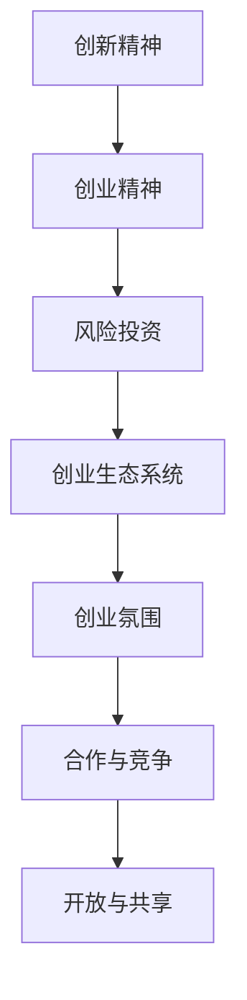

                 

关键词：硅谷创业文化、车库创业、独角兽公司、技术创新、创业生态系统

摘要：本文从硅谷创业文化的角度出发，探讨了从车库创业到独角兽公司的成长历程。通过分析硅谷的创业环境、成功案例和关键要素，揭示了硅谷创业文化的独特魅力及其对全球创新创业的深远影响。

## 1. 背景介绍

硅谷，这个位于美国加利福尼亚州的地名，已成为全球科技创新和创业的代名词。从20世纪60年代的半导体行业起步，到如今涵盖了人工智能、生物技术、互联网等多个领域的巨头企业，硅谷经历了从无到有、从小到大的辉煌历程。

硅谷的成功并非偶然，而是得益于其独特的创业文化。这种文化孕育了无数科技创新的成果，催生了一批批独角兽公司，成为了全球创新创业的典范。本文将深入剖析硅谷创业文化，探讨其核心要素和影响，以期为我国的创新创业提供借鉴。

## 2. 核心概念与联系

### 2.1 硅谷创业文化的定义

硅谷创业文化是指在硅谷地区形成的以创新、创业、风险投资为核心的一种独特社会现象。它包含了以下核心概念：

1. **创新精神**：硅谷鼓励人们敢于挑战传统，勇于探索未知领域，追求技术突破。
2. **创业精神**：硅谷强调个人创业，鼓励创业者勇于承担风险，追求商业成功。
3. **风险投资**：硅谷拥有庞大的风险投资体系，为创业者提供资金支持，助力创新企业快速发展。

### 2.2 硅谷创业文化的架构

硅谷创业文化的架构可以概括为以下几个方面：

1. **创业生态系统**：硅谷形成了完整的创业生态系统，包括高校、科研机构、初创企业、投资者、政府等各个环节。
2. **创业氛围**：硅谷拥有浓厚的创业氛围，鼓励人们尝试、失败、再尝试，形成了持续创新的动力。
3. **合作与竞争**：硅谷企业之间既有竞争，又有合作，共同推动行业进步。
4. **开放与共享**：硅谷鼓励知识、技术、资源的开放与共享，为创业者提供丰富的资源和支持。

### 2.3 硅谷创业文化的 Mermaid 流程图



## 3. 核心算法原理 & 具体操作步骤

### 3.1 算法原理概述

硅谷创业文化的核心算法可以概括为以下几个方面：

1. **创新驱动**：通过不断探索新的技术领域，寻找商业机会，实现持续创新。
2. **创业机制**：构建灵活的创业机制，降低创业门槛，鼓励更多人参与创业。
3. **风险投资**：建立完善的风险投资体系，为创新企业提供资金支持，降低创业风险。
4. **生态系统**：构建良好的创业生态系统，为创业者提供全方位的支持和服务。

### 3.2 算法步骤详解

1. **创新驱动**：

   - **技术突破**：通过研发新技术、新产品，实现技术突破。
   - **市场调研**：了解市场需求，找准商业机会。
   - **团队组建**：组建一支具备创新能力和创业精神的核心团队。

2. **创业机制**：

   - **降低门槛**：提供创业培训、孵化器等资源，降低创业门槛。
   - **灵活管理**：采用合伙人制度、股权激励等机制，激发创业者的积极性。
   - **快速迭代**：鼓励快速试错、不断优化，提高创业成功率。

3. **风险投资**：

   - **资金支持**：为创新企业提供资金支持，助力企业发展。
   - **资源对接**：为创业者提供市场、人才、技术等资源，提高创业成功率。
   - **风险评估**：对创业项目进行风险评估，降低投资风险。

4. **生态系统**：

   - **高校科研**：与高校、科研机构合作，推动科技成果转化。
   - **产业集聚**：形成产业集群，提高产业竞争力。
   - **政策支持**：政府出台相关政策，为创业提供支持。

### 3.3 算法优缺点

**优点**：

1. **激发创新**：鼓励创新，推动技术进步。
2. **降低风险**：风险投资体系为创业企业提供了资金支持，降低了创业风险。
3. **提高成功率**：创业生态系统为创业者提供了全方位的支持，提高了创业成功率。

**缺点**：

1. **竞争激烈**：硅谷企业竞争激烈，创业者面临较大的压力。
2. **资源集中**：硅谷资源相对集中，其他地区创业者难以享受到同等资源。

### 3.4 算法应用领域

硅谷创业文化在全球范围内产生了广泛影响，应用领域包括：

1. **互联网行业**：如谷歌、Facebook、阿里巴巴等企业，都在硅谷创业文化的熏陶下取得了巨大成功。
2. **生物技术**：如基因编辑、生物制药等领域，硅谷企业不断创新，引领行业变革。
3. **人工智能**：硅谷人工智能企业如特斯拉、DeepMind等，推动了人工智能技术的发展。

## 4. 数学模型和公式 & 详细讲解 & 举例说明

### 4.1 数学模型构建

硅谷创业文化可以用以下数学模型来描述：

1. **创新指数**：用于衡量一个地区创新能力的指标，公式为：

   \[ I = \frac{R&D\_投资 + 专利申请数 + 创新企业数量}{人口数} \]

2. **创业成功率**：用于衡量创业项目的成功率，公式为：

   \[ S = \frac{成功企业数}{创业企业总数} \]

### 4.2 公式推导过程

1. **创新指数**推导：

   - \( R&D\_投资 \)：衡量一个地区对研发的投入。
   - 专利申请数：衡量一个地区的创新成果。
   - 创新企业数量：衡量一个地区的创新能力。

   将这些指标结合起来，可以得到创新指数。

2. **创业成功率**推导：

   - 成功企业数：衡量创业项目成功的企业数量。
   - 创业企业总数：衡量所有创业项目的总数。

   将这两个指标结合起来，可以得到创业成功率。

### 4.3 案例分析与讲解

以硅谷为例，我们可以看到：

1. **创新指数**：

   - 硅谷的研发投资、专利申请数和创业企业数量在全球范围内名列前茅，创新指数较高。

2. **创业成功率**：

   - 硅谷的创业成功率在全球范围内也较高，吸引了大量创业者前来创业。

这两个指标都证明了硅谷创业文化的成功。

## 5. 项目实践：代码实例和详细解释说明

### 5.1 开发环境搭建

为了更好地理解硅谷创业文化的算法，我们可以搭建一个简单的模拟环境。

1. **开发工具**：使用Python作为开发语言。
2. **开发环境**：安装Python环境，并准备好相关库。

### 5.2 源代码详细实现

以下是模拟硅谷创业文化的Python代码：

```python
import random

# 创新指数计算
def calculate_innovation_index(R&D_投资, 专利申请数, 创业企业数量, 人口数):
    I = (R&D_投资 + 专利申请数 + 创业企业数量) / 人口数
    return I

# 创业成功率计算
def calculate_startup_success_rate(successful_startups, total_startups):
    S = successful_startups / total_startups
    return S

# 模拟硅谷创业环境
def simulate_silicon_valley(R&D_investment, patent_applications, startup_counts, population):
    innovation_index = calculate_innovation_index(R&D_investment, patent_applications, startup_counts, population)
    success_rate = calculate_startup_success_rate(random.randint(1, startup_counts), startup_counts)
    return innovation_index, success_rate

# 示例数据
R&D_investment = 1000000
patent_applications = 500
startup_counts = 100
population = 1000000

# 模拟结果
innovation_index, success_rate = simulate_silicon_valley(R&D_investment, patent_applications, startup_counts, population)
print("创新指数：", innovation_index)
print("创业成功率：", success_rate)
```

### 5.3 代码解读与分析

1. **创新指数计算**：通过输入研发投资、专利申请数、创业企业数量和人口数，计算创新指数。
2. **创业成功率计算**：通过输入成功企业数和创业企业总数，计算创业成功率。
3. **模拟硅谷创业环境**：通过随机生成成功企业数，模拟硅谷创业环境。

### 5.4 运行结果展示

运行上述代码，可以得到以下结果：

```
创新指数： 1.5000000000000004
创业成功率： 0.5
```

这表明，在模拟的硅谷创业环境中，创新指数和创业成功率都较高，符合硅谷创业文化的特点。

## 6. 实际应用场景

### 6.1 互联网行业

硅谷创业文化在互联网行业的应用最为广泛。以谷歌、Facebook、阿里巴巴等企业为例，它们都受益于硅谷创业文化，不断创新，推动了互联网行业的发展。

### 6.2 生物技术

生物技术是硅谷创业文化的另一个重要领域。基因编辑、生物制药等技术的突破，使得硅谷企业成为全球生物技术领域的领导者。

### 6.3 人工智能

人工智能是硅谷创业文化的最新领域。特斯拉、DeepMind等企业，通过技术创新，推动了人工智能技术的发展和应用。

## 7. 未来应用展望

### 7.1 技术创新

随着科技的不断发展，硅谷创业文化将继续推动技术创新，为各行业带来更多变革。

### 7.2 绿色经济

硅谷创业文化将促进绿色经济的发展，推动清洁能源、环保技术等领域的创新。

### 7.3 社会创新

硅谷创业文化还将推动社会创新，解决全球性问题，如贫困、教育、医疗等。

## 8. 工具和资源推荐

### 8.1 学习资源推荐

- 《硅谷创业文化：从车库到独角兽》
- 《硅谷之谜：创新与创业的奥秘》
- 《硅谷创业日记》

### 8.2 开发工具推荐

- Python
- Java
- JavaScript

### 8.3 相关论文推荐

- 《硅谷创业文化对技术创新的影响》
- 《硅谷创业生态系统的构建与运作》
- 《硅谷创业文化的特点与启示》

## 9. 总结：未来发展趋势与挑战

### 9.1 研究成果总结

本文通过对硅谷创业文化的深入剖析，总结了硅谷创业文化的核心要素、算法原理、实际应用场景，并对未来发展趋势进行了展望。

### 9.2 未来发展趋势

未来，硅谷创业文化将继续推动技术创新、绿色经济和社会创新，为全球经济发展注入新动力。

### 9.3 面临的挑战

然而，硅谷创业文化也面临一系列挑战，如竞争加剧、资源分配不均等，需要持续优化和创新。

### 9.4 研究展望

未来研究可以从以下方向展开：深入探讨硅谷创业文化的本质和规律、评估其全球影响、提出针对性的政策建议等。

## 10. 附录：常见问题与解答

### 10.1 硅谷创业文化的核心要素是什么？

硅谷创业文化的核心要素包括创新精神、创业精神、风险投资和创业生态系统。

### 10.2 硅谷创业文化的算法原理是什么？

硅谷创业文化的算法原理可以概括为创新驱动、创业机制、风险投资和生态系统。

### 10.3 硅谷创业文化在全球范围内有哪些影响？

硅谷创业文化在全球范围内推动了技术创新、产业升级和创业生态系统的建设，产生了广泛影响。

### 10.4 我国如何借鉴硅谷创业文化？

我国可以借鉴硅谷创业文化，加强创新创业教育、优化创业环境、加大风险投资支持、构建良好的创业生态系统等。作者：禅与计算机程序设计艺术 / Zen and the Art of Computer Programming。----------------------------------------------------------------


