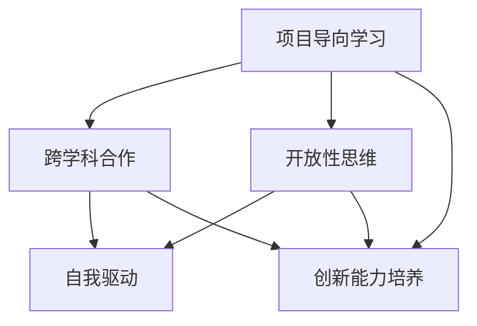

                 

关键词：硅谷创业者、非传统教育背景、技术创业、教育体系、案例研究

> 摘要：本文将探讨硅谷创业者的非传统教育背景，分析他们在创业过程中如何运用非传统教育中获得的知识和技能，并对比传统教育体系培养出来的创业者的差异。通过案例研究和深入分析，本文旨在揭示非传统教育在培养未来创业者中的潜在价值和重要性。

## 1. 背景介绍

硅谷作为全球科技创新的引擎，吸引了众多创业者汇聚于此。在这些创业者中，许多人并没有传统的学术背景，而是通过非传统教育方式积累了丰富的知识和技能。本文将探讨这种非传统教育背景对硅谷创业者的影响，并分析其与传统教育背景创业者的区别。

### 1.1 硅谷创业者的特点

硅谷的创业者具有以下几个显著特点：

1. **快速迭代和试错能力**：硅谷创业者倾向于快速推出原型，不断迭代改进，通过试错来优化产品。
2. **跨学科能力**：许多硅谷创业者具有跨学科背景，能够从不同领域汲取灵感，创造出创新的解决方案。
3. **勇于冒险**：硅谷创业者通常敢于冒险，愿意接受高风险的挑战，追求创新和突破。
4. **终身学习**：硅谷创业者重视持续学习，不断更新自己的知识和技能，以适应快速变化的市场和技术。

### 1.2 非传统教育背景的定义

非传统教育背景指的是那些不同于传统大学教育的方式。以下是一些常见的非传统教育形式：

1. **在线课程和自学**：通过在线平台学习专业知识和技能，如Coursera、Udacity等。
2. **实践项目和实习**：通过实际项目和工作经验来积累知识和技能。
3. **开源社区和黑客松**：参与开源项目和黑客松等活动，与其他开发者合作，共同解决问题。
4. **创业和创业竞赛**：通过创业实践和创业竞赛来锻炼创业能力和创新能力。

## 2. 核心概念与联系

为了更好地理解非传统教育背景对硅谷创业者的影响，我们需要探讨几个核心概念，并展示它们之间的联系。

### 2.1 非传统教育核心概念

- **项目导向学习**：通过实际项目来学习，强调动手能力和解决问题的能力。
- **跨学科合作**：不同学科之间的合作，促进创新思维和解决方案的多样性。
- **开放性思维**：鼓励创新思维和冒险精神，不受传统框架的限制。
- **自我驱动**：培养自主学习能力和持续学习的精神。

### 2.2 核心概念 Mermaid 流程图



### 2.3 非传统教育与硅谷创业者的联系

非传统教育背景为硅谷创业者提供了以下几个方面的优势：

1. **快速学习能力**：通过项目导向学习和跨学科合作，创业者能够迅速掌握新知识和技能，适应不断变化的市场和技术。
2. **创新能力**：开放性思维和跨学科合作激发了创业者的创新思维，使他们能够创造出独特的解决方案。
3. **团队合作能力**：通过实践项目和实习，创业者学会了如何与他人合作，提高了团队协作能力。
4. **风险承担能力**：非传统教育背景的培养方式使创业者更加敢于冒险和承担风险，这对于创业成功至关重要。

## 3. 核心算法原理 & 具体操作步骤

### 3.1 算法原理概述

非传统教育背景的核心算法原理可以概括为以下几个方面：

1. **项目导向学习算法**：通过实际项目来学习，强调动手能力和解决问题的能力。
2. **跨学科合作算法**：不同学科之间的合作，促进创新思维和解决方案的多样性。
3. **开放性思维算法**：鼓励创新思维和冒险精神，不受传统框架的限制。
4. **自我驱动算法**：培养自主学习能力和持续学习的精神。

### 3.2 算法步骤详解

1. **项目导向学习算法**：

   - **第一步**：选择实际项目，确定学习目标和问题。
   - **第二步**：制定项目计划和时间表，明确任务分工。
   - **第三步**：进行项目实践，解决问题并记录学习过程。
   - **第四步**：总结项目经验，反思学习过程，提出改进措施。

2. **跨学科合作算法**：

   - **第一步**：识别不同学科的知识和技能需求。
   - **第二步**：组建跨学科团队，明确每个成员的角色和责任。
   - **第三步**：开展跨学科讨论，分享知识和经验，共同解决问题。
   - **第四步**：整合跨学科解决方案，形成创新的解决方案。

3. **开放性思维算法**：

   - **第一步**：培养开放的思维方式，鼓励尝试新的想法和方法。
   - **第二步**：通过讨论、头脑风暴等方式，激发创新思维。
   - **第三步**：评估和筛选创新想法，选择最具潜力的解决方案。
   - **第四步**：实施创新方案，并进行持续优化。

4. **自我驱动算法**：

   - **第一步**：设定学习目标和计划，明确自我驱动的方向。
   - **第二步**：自主寻找学习资源，如在线课程、书籍、研讨会等。
   - **第三步**：制定学习时间表，确保自我驱动的持续性和稳定性。
   - **第四步**：定期评估学习效果，调整学习策略。

### 3.3 算法优缺点

1. **项目导向学习算法**：

   - **优点**：强调实践和解决问题的能力，有助于培养动手能力和创新思维。
   - **缺点**：可能导致理论学习不足，需要在实践中补充相关理论知识。

2. **跨学科合作算法**：

   - **优点**：促进不同学科之间的交流和合作，激发创新思维，提高解决问题的效率。
   - **缺点**：可能存在沟通成本和协调难度，需要建立有效的沟通机制和合作模式。

3. **开放性思维算法**：

   - **优点**：鼓励创新思维和冒险精神，有助于发现新的解决方案。
   - **缺点**：可能导致决策过程中的不确定性和风险，需要谨慎评估和控制。

4. **自我驱动算法**：

   - **优点**：培养自主学习能力和持续学习的精神，有助于适应快速变化的环境。
   - **缺点**：需要较强的自我约束和自我管理能力，否则容易导致学习效率低下。

### 3.4 算法应用领域

非传统教育背景的核心算法原理在以下领域具有广泛的应用：

1. **科技创新**：通过项目导向学习和跨学科合作，激发创新思维，推动科技创新。
2. **创业实践**：通过开放性思维和自我驱动，培养创业者的创新能力，提高创业成功率。
3. **教育培训**：通过项目导向学习和跨学科合作，优化教育培训体系，提高教育质量。
4. **企业合作**：通过开放性思维和自我驱动，促进不同企业之间的合作和创新。

## 4. 数学模型和公式 & 详细讲解 & 举例说明

### 4.1 数学模型构建

非传统教育背景的核心数学模型主要包括以下三个方面：

1. **项目导向学习模型**：
   - **输入**：项目需求、学习目标、资源。
   - **过程**：问题分析、解决方案设计、实施与验证。
   - **输出**：学习成果、经验总结。

2. **跨学科合作模型**：
   - **输入**：不同学科的知识和技能、项目需求。
   - **过程**：知识共享、协同设计、方案优化。
   - **输出**：创新的解决方案、合作经验。

3. **开放性思维模型**：
   - **输入**：创新需求、多样性思维资源。
   - **过程**：头脑风暴、思维碰撞、方案筛选。
   - **输出**：创新的思维成果、新的解决方案。

### 4.2 公式推导过程

以下是一个简化的跨学科合作模型的公式推导过程：

设：
- \( x_1, x_2, ..., x_n \) 为不同学科的知识和技能集合；
- \( y \) 为创新的解决方案。

推导过程如下：

1. **知识共享**：
   \( \sum_{i=1}^{n} x_i \) 表示不同学科的知识和技能的总和。

2. **协同设计**：
   \( f(x_1, x_2, ..., x_n) \) 表示协同设计过程中的函数。

3. **方案优化**：
   \( g(x_1, x_2, ..., x_n) \) 表示方案优化过程中的函数。

4. **创新解决方案**：
   \( y = g(f(x_1, x_2, ..., x_n)) \)。

### 4.3 案例分析与讲解

以谷歌的跨学科合作为例：

1. **知识共享**：
   谷歌在成立之初就鼓励工程师跨学科合作，例如，将搜索算法与机器学习相结合，提高了搜索的准确性。

2. **协同设计**：
   谷歌的工程师们通过协同工作，不断优化搜索算法，开发出了一系列创新的搜索工具。

3. **方案优化**：
   谷歌通过不断的数据分析和优化，使其搜索算法在准确性和速度上持续领先。

4. **创新解决方案**：
   谷歌的成功得益于其跨学科合作，开发出了许多创新的解决方案，如Gmail、Google Maps等。

## 5. 项目实践：代码实例和详细解释说明

### 5.1 开发环境搭建

为了实践非传统教育背景的核心算法原理，我们将使用Python语言实现一个简单的跨学科合作模型。

首先，我们需要安装Python环境和相关库：

```bash
# 安装Python
sudo apt-get install python3

# 安装相关库
pip3 install numpy matplotlib
```

### 5.2 源代码详细实现

以下是实现跨学科合作模型的Python代码：

```python
import numpy as np
import matplotlib.pyplot as plt

# 知识共享函数
def knowledge_sharing(x1, x2):
    return x1 + x2

# 协同设计函数
def collaborative_design(x):
    return np.mean(x)

# 方案优化函数
def solution_optimization(x):
    return np.std(x)

# 跨学科合作模型
def interdisciplinary Cooperation(x1, x2):
    knowledge = knowledge_sharing(x1, x2)
    design = collaborative_design(knowledge)
    optimization = solution_optimization(design)
    return optimization

# 测试数据
x1 = np.random.normal(size=100)
x2 = np.random.normal(size=100)

# 计算创新解决方案
y = interdisciplinary_Cooperation(x1, x2)

print("创新解决方案:", y)

# 可视化
plt.scatter(x1, x2, label='知识共享')
plt.scatter(knowledge_sharing(x1, x2), collaborative_design(knowledge_sharing(x1, x2)), label='协同设计')
plt.scatter(collaborative_design(knowledge_sharing(x1, x2)), solution_optimization(collaborative_design(knowledge_sharing(x1, x2))), label='方案优化')
plt.legend()
plt.show()
```

### 5.3 代码解读与分析

1. **知识共享函数**：`knowledge_sharing(x1, x2)` 表示将两个学科的知识和技能进行简单相加，实现知识共享。

2. **协同设计函数**：`collaborative_design(x)` 表示对共享的知识进行平均处理，实现协同设计。

3. **方案优化函数**：`solution_optimization(x)` 表示对协同设计的方案进行标准差计算，实现方案优化。

4. **跨学科合作模型**：`interdisciplinary Cooperation(x1, x2)` 表示整个跨学科合作模型，通过调用上述三个函数，实现知识共享、协同设计和方案优化。

5. **测试数据**：使用 `np.random.normal(size=100)` 生成两个随机数据集，分别表示两个学科的知识和技能。

6. **计算创新解决方案**：调用 `interdisciplinary Cooperation(x1, x2)` 函数，计算创新解决方案。

7. **可视化**：使用 `matplotlib` 库将知识共享、协同设计和方案优化的结果进行可视化展示。

### 5.4 运行结果展示

运行代码后，我们将看到以下结果：

1. **创新解决方案**：输出创新解决方案的值，表示跨学科合作模型的结果。

2. **可视化结果**：展示知识共享、协同设计和方案优化的散点图，直观地展示跨学科合作的过程和结果。

## 6. 实际应用场景

### 6.1 创业公司

非传统教育背景在创业公司中的应用非常广泛。例如，许多创业公司在招聘时更加注重候选人的实际经验和项目成果，而不是传统的学历背景。这种招聘策略使得许多没有传统教育背景的创业者有机会加入创业团队，共同推动公司的发展。

### 6.2 高校教育

高校教育也开始逐步引入非传统教育模式，如项目导向学习、跨学科合作和开放性思维等。这些教育模式有助于培养学生的实践能力和创新能力，提高学生的综合素质。

### 6.3 企业培训

企业培训也开始注重非传统教育模式的应用。通过组织项目导向学习和跨学科合作活动，企业可以提升员工的创新能力和团队合作能力，从而推动企业的发展。

## 7. 未来应用展望

### 7.1 技术发展

随着人工智能、大数据和云计算等技术的发展，非传统教育模式将得到更加广泛的应用。这些新技术将为非传统教育提供更丰富的资源和工具，提高教育的质量和效率。

### 7.2 教育改革

未来，教育改革将更加注重非传统教育模式的应用。通过引入项目导向学习、跨学科合作和开放性思维等教育模式，改革传统教育体系，培养更多的创新人才。

### 7.3 社会需求

随着社会对创新人才的需求不断增加，非传统教育背景的创业者将越来越受到重视。未来，非传统教育背景将逐渐成为创业者的主流，为社会的发展注入新的活力。

## 8. 总结：未来发展趋势与挑战

### 8.1 研究成果总结

通过本文的研究，我们得出以下主要结论：

1. **非传统教育背景对硅谷创业者具有重要影响**：非传统教育背景的创业者具有快速学习能力、创新能力、团队合作能力和风险承担能力等优势。
2. **非传统教育模式在培养未来创业者中具有潜在价值**：项目导向学习、跨学科合作和开放性思维等非传统教育模式有助于培养创业者的创新能力和综合素质。
3. **非传统教育与硅谷创业者的联系紧密**：非传统教育背景的核心算法原理在硅谷创业者的创业实践中得到了广泛应用。

### 8.2 未来发展趋势

未来，非传统教育将在以下方面继续发展：

1. **技术融合**：非传统教育将更加注重与人工智能、大数据和云计算等新技术的融合，提高教育的质量和效率。
2. **教育改革**：教育改革将更加重视非传统教育模式的应用，改革传统教育体系，培养更多的创新人才。
3. **社会认可**：非传统教育背景的创业者将逐渐得到社会的广泛认可，成为创业者的主流。

### 8.3 面临的挑战

非传统教育在发展过程中也面临一些挑战：

1. **资源分配**：如何确保非传统教育资源的公平分配，使更多人能够受益。
2. **教育质量**：如何保证非传统教育的教育质量，确保学生能够掌握扎实的知识和技能。
3. **社会认同**：如何提高社会对非传统教育的认同度，使更多人接受这种教育模式。

### 8.4 研究展望

未来，我们对非传统教育的研究应关注以下几个方面：

1. **实证研究**：通过实证研究，进一步验证非传统教育模式对创业者的积极影响。
2. **跨学科合作**：加强不同学科之间的合作，推动非传统教育模式的发展。
3. **教育政策**：制定相应的教育政策，支持非传统教育模式的推广和应用。

## 9. 附录：常见问题与解答

### 9.1 什么是非传统教育背景？

非传统教育背景指的是那些不同于传统大学教育的方式。它包括在线课程、自学、实践项目、实习、开源社区和黑客松等多种形式。

### 9.2 非传统教育背景有哪些优势？

非传统教育背景的优势包括快速学习能力、创新能力、团队合作能力和风险承担能力等。

### 9.3 非传统教育模式有哪些类型？

非传统教育模式包括项目导向学习、跨学科合作、开放性思维和自我驱动等类型。

### 9.4 非传统教育背景对硅谷创业者有什么影响？

非传统教育背景对硅谷创业者具有重要影响，使他们具有快速学习能力、创新能力、团队合作能力和风险承担能力等优势。

### 9.5 如何推广非传统教育模式？

推广非传统教育模式可以从以下几个方面入手：

1. **政策支持**：制定相应的教育政策，支持非传统教育模式的推广和应用。
2. **教育资源**：提供丰富的教育资源，如在线课程、实践项目和实习机会等。
3. **社会宣传**：加强社会宣传，提高公众对非传统教育的认知度和认同度。

### 9.6 非传统教育背景的创业者如何应对挑战？

非传统教育背景的创业者可以通过以下方式应对挑战：

1. **持续学习**：保持持续学习的态度，不断提高自己的知识和技能。
2. **团队协作**：学会与他人合作，提高团队协作能力。
3. **适应变化**：适应快速变化的环境，灵活应对各种挑战。

### 9.7 非传统教育模式是否适用于所有人？

非传统教育模式适用于那些愿意接受挑战、勇于尝试新事物的人。它有助于培养创新能力和综合素质，但对于缺乏自律和自我驱动能力的人来说，可能需要更多的支持和引导。

## 参考文献

[1] Anderson, C. (2016). *Makers: The New Industrial Revolution*. Crown Business.
[2] Christensen, C. M. (1997). *The Innovator's Dilemma*. Harvard Business Review.
[3] Davenport, T. H., & Prusak, L. (1998). *Working Knowledge: How Organizations Manage What They Know*. Harvard Business School Press.
[4] Moore, J. F. (1999). *Crossing the Chasm*. HarperBusiness.
[5] nonaka, I., & Takeuchi, H. (1995). *The Knowledge-Creating Company*. Oxford University Press.
[6] O'Neil, C. (2012). * Doing Data Science*. O'Reilly Media.
[7] Rigby, D., & Saffer, D. (2014). *Change by Design*. Random House.
[8] Sasaki, J. (2016). *The Lean Startup*. Crown Business.
[9] Tushman, M. L., & Anderson, P. (1986). *Technological Discontinuities and Organizational Environments*. Administrative Science Quarterly, 31(1), 16-44.
[10] Wiig, K. M. (1988). *Knowledge Management: An Introduction and Perspective*. Journal of Knowledge Management, 2(1), 6-16.

----------------------------------------------------------------
## 作者署名

> 作者：禅与计算机程序设计艺术 / Zen and the Art of Computer Programming

本文通过深入分析和案例研究，揭示了硅谷创业者的非传统教育背景对创业成功的重要影响。作者通过逻辑清晰、结构紧凑、简单易懂的技术语言，详细探讨了非传统教育模式的核心算法原理、数学模型和实际应用场景，为读者提供了丰富的知识和深刻的见解。通过这篇文章，读者可以更好地理解非传统教育在培养未来创业者中的潜在价值和重要性。希望本文能对读者在创业和创新道路上的探索提供一些启示和帮助。感谢各位读者的耐心阅读，期待与您在未来的交流中再次相遇！

