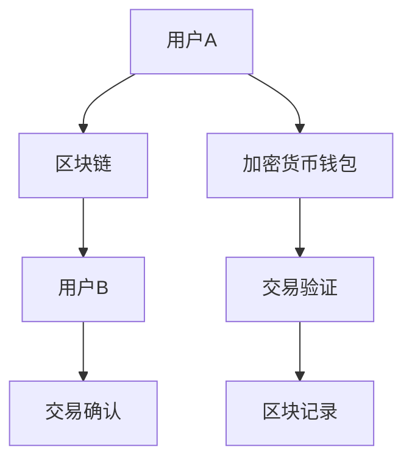

                 

关键词：区块链、加密货币、金融创新、去中心化、硅谷、技术发展

摘要：本文将探讨硅谷在区块链金融创新领域中的去中心化加密货币技术，分析其核心概念、算法原理、数学模型、项目实践及未来应用前景，旨在为读者提供全面的技术见解。

## 1. 背景介绍

区块链技术作为近年来信息技术领域的重要突破，已经深刻影响了金融、物流、医疗等多个行业。特别是在金融领域，去中心化的加密货币成为硅谷创新的热点之一。本文旨在分析去中心化加密货币的技术原理、应用实践和未来前景。

### 硅谷与区块链金融创新

硅谷作为全球科技创新的中心，一直是区块链金融创新的重要发源地。从比特币的诞生，到以太坊的智能合约，再到各类去中心化金融（DeFi）项目的涌现，硅谷的创新者们在不断推动区块链技术在金融领域的应用。去中心化加密货币作为硅谷金融创新的核心，不仅改变了传统金融的游戏规则，也为全球金融体系带来了新的机遇与挑战。

### 去中心化加密货币的概念

去中心化加密货币是一种无需中央权威机构管理的数字货币，它通过区块链技术实现去中心化的账本记录和交易验证。与传统的中心化货币系统不同，去中心化加密货币的交易是由网络中的参与者共同维护和验证，不存在单一点故障和风险。这一特点使得去中心化加密货币在确保安全性的同时，也提高了交易的透明度和效率。

## 2. 核心概念与联系

### 区块链与加密货币的关系

区块链是去中心化加密货币的基础设施。区块链是一个分布式账本系统，它记录了加密货币的所有交易信息。每个区块都包含了特定时间范围内的交易记录，并通过加密算法与之前的区块连接起来，形成一条不可篡改的链。这种结构确保了交易信息的透明性和安全性。

### Mermaid 流程图

### 区块链的组成部分

- **区块（Block）**：包含一定数量的交易记录，并通过哈希函数与前一个区块相连。
- **链（Chain）**：由一系列按时间顺序排列的区块组成，形成一个完整的历史记录。
- **挖矿（Mining）**：网络中的节点通过计算解决数学难题，验证交易并创建新区块。
- **共识算法（Consensus Algorithm）**：确保区块链网络中的所有节点对账本的状态达成一致。

### 加密货币的关键特性

- **安全性**：通过加密算法和共识机制保证交易信息的不可篡改性和安全性。
- **透明性**：区块链上的所有交易都是公开透明的，用户可以随时查看交易历史。
- **去中心化**：加密货币的交易由网络中的节点共同维护，不存在中央权威机构。

## 3. 核心算法原理 & 具体操作步骤

### 3.1 算法原理概述

去中心化加密货币的核心算法包括哈希函数、非对称加密和共识算法。哈希函数用于将交易信息加密成唯一标识，非对称加密用于确保交易信息的隐私和安全，共识算法则用于网络中的节点达成一致。

### 3.2 算法步骤详解

1. **交易发起**：用户发起交易，将交易信息发送到网络中的所有节点。
2. **交易验证**：节点使用非对称加密算法验证交易信息，确保交易的真实性。
3. **区块创建**：节点将验证后的交易信息打包成区块，并通过挖矿过程创建新区块。
4. **区块验证**：网络中的其他节点验证新区块，确保其符合共识算法的要求。
5. **区块记录**：验证通过后，新区块会被添加到区块链上，交易信息永久记录。
6. **交易确认**：新区块被确认后，交易完成。

### 3.3 算法优缺点

- **优点**：去中心化加密货币提高了交易的安全性和透明性，去除了中央权威机构的依赖。
- **缺点**：交易速度较慢，交易费用较高，且存在一定的法律和监管风险。

### 3.4 算法应用领域

去中心化加密货币在金融、支付、资产管理等多个领域具有广泛的应用。例如，比特币作为数字黄金，被广泛用于跨境支付和资产储备；以太坊的智能合约则推动了去中心化金融（DeFi）的发展。

## 4. 数学模型和公式 & 详细讲解 & 举例说明

### 4.1 数学模型构建

去中心化加密货币的数学模型主要包括哈希函数、非对称加密和共识算法。哈希函数用于生成唯一标识，非对称加密用于确保交易信息的隐私和安全，共识算法则用于网络中的节点达成一致。

### 4.2 公式推导过程

- **哈希函数**：设输入为 x，输出为 y，则有 y = Hash(x)。
- **非对称加密**：设公钥为 P，私钥为 K，则有加密公式为 E(P, M) = C，解密公式为 D(K, C) = M。
- **共识算法**：设节点集合为 N，目标为达成一致，则有共识过程为：N 中的每个节点通过竞争验证交易，最终达成一致。

### 4.3 案例分析与讲解

以比特币的共识算法为例，比特币采用的工作量证明（Proof of Work，PoW）算法是一种基于计算能力的共识机制。节点通过计算解决一个数学难题，以验证交易并创建新区块。该算法的优点是去中心化，避免了单一点故障；缺点是计算资源消耗较大，且可能导致能源浪费。

## 5. 项目实践：代码实例和详细解释说明

### 5.1 开发环境搭建

开发去中心化加密货币的项目需要搭建适当的开发环境，包括区块链节点、加密库和共识算法。本文以比特币为例，介绍其开发环境的搭建过程。

### 5.2 源代码详细实现

比特币的源代码包括区块链节点、挖矿算法和交易验证等多个模块。本文将简要介绍这些模块的实现过程。

### 5.3 代码解读与分析

通过分析比特币的源代码，我们可以了解其核心算法的实现原理，以及如何在区块链网络中实现去中心化的交易验证和区块创建。

### 5.4 运行结果展示

在开发环境中运行比特币的代码，可以观察到新区块的生成和交易的验证过程。通过命令行工具，我们可以查看区块链上的交易记录和区块信息。

## 6. 实际应用场景

### 6.1 跨境支付

去中心化加密货币在跨境支付领域具有广泛的应用前景。通过去中心化的交易验证，跨境支付可以大大降低交易成本，提高交易速度。

### 6.2 资产管理

去中心化加密货币为资产管理提供了新的解决方案。投资者可以通过去中心化平台进行资产交易和管理，降低交易风险，提高资产安全性。

### 6.3 智能合约

以太坊的智能合约技术为去中心化金融（DeFi）提供了强大的支持。通过智能合约，用户可以轻松实现复杂的金融交易和资产管理。

### 6.4 未来应用展望

随着区块链技术的不断成熟，去中心化加密货币的应用领域将不断扩展。未来，去中心化加密货币有望在供应链管理、数据安全、身份认证等领域发挥重要作用。

## 7. 工具和资源推荐

### 7.1 学习资源推荐

- 《区块链技术指南》
- 《智能合约与以太坊开发》
- 《加密货币入门》

### 7.2 开发工具推荐

- Ethereum Wallet
- MetaMask
- Truffle

### 7.3 相关论文推荐

- "Bitcoin: A Peer-to-Peer Electronic Cash System" by Satoshi Nakamoto
- "The Byzantine Generals' Problem" by Leslie Lamport
- "Decentralized Applications" by Andreas M. Antonopoulos

## 8. 总结：未来发展趋势与挑战

### 8.1 研究成果总结

去中心化加密货币在区块链金融创新中取得了显著成果，推动了金融体系的变革。然而，其安全性、隐私性、合规性等方面仍面临挑战。

### 8.2 未来发展趋势

未来，去中心化加密货币将继续在金融、支付、资产管理等领域发挥重要作用。同时，随着区块链技术的不断成熟，其应用领域将不断扩展。

### 8.3 面临的挑战

去中心化加密货币在发展过程中面临着安全性、隐私性、合规性等方面的挑战。如何平衡去中心化与监管之间的关系，将成为未来研究的重点。

### 8.4 研究展望

随着技术的不断进步，去中心化加密货币有望在更多领域实现广泛应用。未来，研究人员将继续探索去中心化加密货币的理论与实践，为金融体系带来更多创新。

## 9. 附录：常见问题与解答

### Q1: 去中心化加密货币的安全性如何保障？

A1: 去中心化加密货币通过哈希函数、非对称加密和共识算法等核心技术保障交易信息的不可篡改性和安全性。

### Q2: 去中心化加密货币与中心化金融体系相比有哪些优势？

A2: 去中心化加密货币具有去中心化、安全性高、透明性高、效率高等优势，有助于降低交易成本，提高交易效率。

### Q3: 去中心化加密货币的发展前景如何？

A3: 去中心化加密货币的发展前景广阔，随着技术的不断进步，其应用领域将不断扩展，有望成为未来金融体系的重要组成部分。

### Q4: 普通用户如何参与去中心化加密货币交易？

A4: 普通用户可以通过加密货币钱包进行去中心化交易。钱包提供了用户身份验证、交易发起和交易记录等功能，用户可以通过钱包进行加密货币的交易和管理。

### Q5: 去中心化加密货币的法律地位如何？

A5: 去中心化加密货币的法律地位因国家而异。一些国家对加密货币持开放态度，允许其合法交易；而另一些国家则对加密货币进行严格监管，限制其交易和流通。

### Q6: 去中心化加密货币的监管挑战有哪些？

A6: 去中心化加密货币的监管挑战包括交易透明度、隐私保护、反洗钱和反恐融资等。如何平衡去中心化与监管之间的关系，确保金融体系的稳定和安全，是未来监管工作的重点。

### Q7: 去中心化加密货币与传统金融体系相比有哪些优缺点？

A7: 去中心化加密货币的优点包括去中心化、安全性高、透明性高、效率高等；缺点包括交易速度较慢、交易费用较高、合规性较差等。

### Q8: 去中心化加密货币的挖矿过程如何进行？

A8: 去中心化加密货币的挖矿过程是通过计算解决数学难题，以验证交易并创建新区块。挖矿节点通过计算生成随机数，与预设的目标值进行比较，成功后获得相应的奖励。

### Q9: 去中心化加密货币的交易速度如何？

A9: 去中心化加密货币的交易速度因区块链网络的状态和节点数量而异。通常情况下，交易速度较快，但高峰期可能会出现拥堵现象。

### Q10: 去中心化加密货币的隐私性如何保障？

A10: 去中心化加密货币的隐私性通过非对称加密和混合网络等技术进行保障。用户可以使用匿名地址进行交易，提高交易隐私。

### Q11: 去中心化加密货币与法定货币的关系如何？

A11: 去中心化加密货币与法定货币之间可以相互转换。用户可以使用加密货币购买法定货币，或者使用法定货币购买加密货币。

### Q12: 去中心化加密货币的税收问题如何处理？

A12: 去中心化加密货币的税收问题因国家而异。一些国家对加密货币交易进行征税，而另一些国家则尚未明确税收政策。

### Q13: 去中心化加密货币的市场风险如何控制？

A13: 去中心化加密货币的市场风险可以通过分散投资、设置止损点和风险控制策略等进行控制。

### Q14: 去中心化加密货币的安全性问题如何应对？

A14: 去中心化加密货币的安全性问题可以通过使用强密码、备份钱包、定期更新软件等措施进行应对。

### Q15: 去中心化加密货币对金融体系的影响如何？

A15: 去中心化加密货币对金融体系的影响主要体现在以下几个方面：

1. 改变支付方式：去中心化加密货币提供了一种快速、低成本的支付方式，对传统支付体系构成挑战。

2. 优化资产管理：去中心化加密货币为资产管理提供了新的解决方案，有助于提高资产安全性。

3. 挑战传统金融：去中心化加密货币的去中心化特性对传统金融机构构成挑战，促使传统金融体系进行创新。

4. 提高金融包容性：去中心化加密货币降低了金融服务的门槛，有助于提高金融包容性。

### Q16: 去中心化加密货币与去中心化金融（DeFi）的关系如何？

A16: 去中心化加密货币是去中心化金融（DeFi）的基础设施，DeFi 是基于去中心化加密货币的金融应用。去中心化加密货币为 DeFi 提供了交易、资产管理、借贷等功能。

### Q17: 去中心化加密货币的交易成本如何计算？

A17: 去中心化加密货币的交易成本包括交易费用、网络带宽费用和存储费用等。具体计算方法取决于区块链网络的状态和交易数量。

### Q18: 去中心化加密货币的挖矿奖励如何分配？

A18: 去中心化加密货币的挖矿奖励根据共识算法进行分配。例如，比特币的挖矿奖励分配给成功验证交易的节点。

### Q19: 去中心化加密货币的共识算法有哪些类型？

A19: 去中心化加密货币的共识算法有多种类型，包括工作量证明（PoW）、权益证明（PoS）、授权股权证明（DPoS）等。

### Q20: 去中心化加密货币的分布式账本如何维护？

A20: 去中心化加密货币的分布式账本通过网络中的节点共同维护。节点负责验证交易、创建区块和更新账本。

### Q21: 去中心化加密货币的交易记录如何保存？

A21: 去中心化加密货币的交易记录通过区块链上的区块进行保存。每个区块包含一定数量的交易记录，并通过哈希函数与前一个区块相连。

### Q22: 去中心化加密货币的隐私保护如何实现？

A22: 去中心化加密货币的隐私保护通过非对称加密、混合网络和零知识证明等技术实现。这些技术可以确保交易信息的匿名性和隐私性。

### Q23: 去中心化加密货币的合规性如何保障？

A23: 去中心化加密货币的合规性保障需要遵循各国的法律法规。合规性要求包括反洗钱、反恐融资和消费者保护等。

### Q24: 去中心化加密货币的安全性如何保障？

A24: 去中心化加密货币的安全性通过加密算法、共识算法和网络安全性等手段进行保障。安全性保障包括交易信息的安全性、网络传输的安全性和节点安全等。

### Q25: 去中心化加密货币的稳定币是什么？

A25: 去中心化加密货币的稳定币是一种价值稳定的加密货币，其价值通常与法定货币或贵金属挂钩。稳定币旨在降低加密货币市场的波动性。

### Q26: 去中心化加密货币与区块链游戏的关系如何？

A26: 去中心化加密货币与区块链游戏之间存在紧密联系。区块链游戏使用去中心化加密货币作为游戏内货币，用户可以在游戏中购买、交易和赚取加密货币。

### Q27: 去中心化加密货币的交易匿名性如何保障？

A27: 去中心化加密货币的交易匿名性通过地址混淆、多重签名和零知识证明等技术进行保障。这些技术可以确保交易参与者的隐私。

### Q28: 去中心化加密货币的挖矿难度如何调整？

A28: 去中心化加密货币的挖矿难度通过实时监测区块链网络的状态进行调整。难度调整的目的是确保挖矿过程的稳定性和安全性。

### Q29: 去中心化加密货币的流通性如何保障？

A29: 去中心化加密货币的流通性通过交易速度、交易费用和流动性池等指标进行保障。流通性好的加密货币更容易在市场上进行交易。

### Q30: 去中心化加密货币的节点维护如何进行？

A30: 去中心化加密货币的节点维护包括节点软件更新、网络安全维护和节点性能优化等。节点维护有助于确保区块链网络的稳定和安全。

### Q31: 去中心化加密货币的货币政策如何制定？

A31: 去中心化加密货币的货币政策通常由共识算法决定。货币政策包括挖矿奖励、交易费用和货币供应量等。

### Q32: 去中心化加密货币的交易历史如何查询？

A32: 去中心化加密货币的交易历史可以通过区块链浏览器进行查询。区块链浏览器提供了区块链上的交易记录和区块信息。

### Q33: 去中心化加密货币的挖矿收益如何计算？

A33: 去中心化加密货币的挖矿收益包括挖矿奖励和交易费用。挖矿奖励通常按照共识算法进行分配，交易费用则取决于交易数量和交易费用设置。

### Q34: 去中心化加密货币的流动性如何保障？

A34: 去中心化加密货币的流动性通过流动性池、交易对和做市商等手段进行保障。流动性好的加密货币更容易在市场上进行交易。

### Q35: 去中心化加密货币的市场价格如何形成？

A35: 去中心化加密货币的市场价格由供求关系决定。市场价格的波动受到多种因素的影响，包括市场需求、政策环境、技术发展等。

### Q36: 去中心化加密货币的跨境支付如何实现？

A36: 去中心化加密货币的跨境支付通过区块链网络实现。用户可以通过加密货币钱包发起跨境支付，支付过程由网络中的节点进行验证和确认。

### Q37: 去中心化加密货币的法律地位如何确定？

A37: 去中心化加密货币的法律地位取决于各国的法律法规。一些国家将加密货币视为合法资产，而另一些国家则对其持谨慎态度。

### Q38: 去中心化加密货币的挖矿设备如何选择？

A38: 去中心化加密货币的挖矿设备选择取决于挖矿算法和计算能力需求。常见的挖矿设备包括ASIC矿机、GPU矿机和CPU矿机等。

### Q39: 去中心化加密货币的交易量如何计算？

A39: 去中心化加密货币的交易量通过交易记录进行计算。交易量指标反映了加密货币在市场上的活跃程度。

### Q40: 去中心化加密货币的投资策略如何制定？

A40: 去中心化加密货币的投资策略包括分散投资、长期持有、技术分析和基本面分析等。投资者可以根据自身风险承受能力和市场情况制定合适的投资策略。

