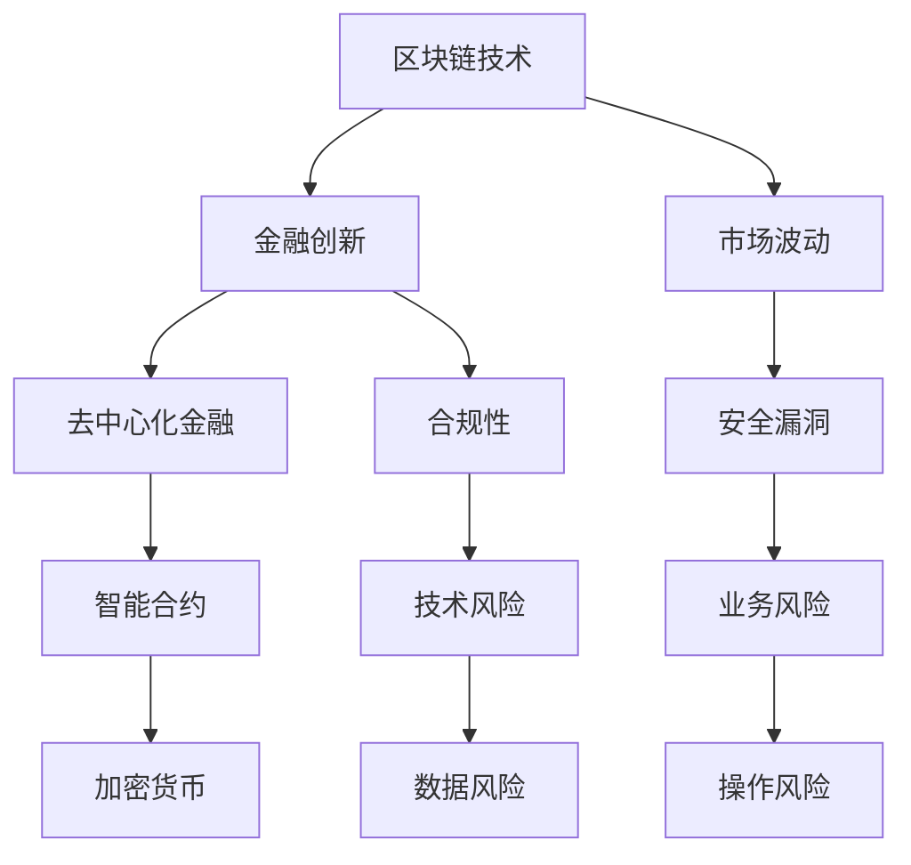

                 

关键词：区块链，金融创新，风险控制，硅谷，加密货币，智能合约，去中心化，合规性，算法安全，市场波动，监管政策。

> 摘要：本文深入探讨了硅谷区块链金融创新的现状及其风险控制问题。通过分析区块链技术在金融领域的应用，本文提出了风险控制的策略和方法，包括技术层面的安全措施、合规性要求以及市场波动应对策略。本文旨在为金融科技从业者提供实用的指导和建议，以推动区块链金融创新的健康发展。

## 1. 背景介绍

区块链技术的出现，重新定义了金融行业的运作方式。硅谷作为全球科技创新的桥头堡，一直是区块链金融创新的重要发源地。从比特币到以太坊，再到一系列的去中心化金融（DeFi）项目，硅谷的区块链创新不断推动着金融行业的变革。然而，伴随着创新的同时，风险也随之而来。市场波动、安全漏洞、合规性等问题成为了区块链金融发展的关键挑战。

本文旨在通过深入分析硅谷区块链金融创新的风险控制问题，为行业从业者提供策略和参考，以实现金融创新的可持续性。

## 2. 核心概念与联系

### 2.1 区块链与金融创新

区块链技术是一种分布式账本技术，通过密码学和共识算法确保数据的不可篡改性和透明性。在金融领域，区块链技术被广泛应用于加密货币交易、智能合约执行、金融审计等场景，为去中心化金融（DeFi）的发展提供了技术基础。

### 2.2 去中心化金融（DeFi）

去中心化金融是区块链技术在金融领域的重要应用，通过智能合约实现传统金融产品和服务去中心化。DeFi项目提供了包括借贷、交易、支付、资产管理等多种金融服务，但同时也带来了新的风险。

### 2.3 智能合约

智能合约是区块链上自动执行合约条款的计算机程序。智能合约的透明性和自动执行特性使得金融交易更加高效和可信，但也可能导致安全漏洞和合约逻辑错误，带来潜在风险。

### 2.4 加密货币

加密货币是基于区块链技术发行的数字货币，如比特币、以太坊等。加密货币的交易和价格波动对金融市场产生了深远影响，同时其安全性和合规性问题也备受关注。

## 2.5 Mermaid 流程图



## 3. 核心算法原理 & 具体操作步骤

### 3.1 算法原理概述

区块链的核心算法包括加密算法、共识算法和智能合约执行算法。加密算法用于保护区块链数据的机密性和完整性；共识算法确保区块链网络中的节点达成一致性；智能合约执行算法则实现智能合约的自动执行。

### 3.2 算法步骤详解

#### 3.2.1 加密算法

- **加密过程**：数据在发送之前进行加密处理，确保数据在传输过程中不被篡改。
- **解密过程**：接收方在收到数据后，使用密钥对数据进行解密，以恢复原始数据。

#### 3.2.2 共识算法

- **工作原理**：共识算法是区块链网络中的节点通过一种机制达成一致的过程。
- **主要类型**：PoW（工作量证明）、PoS（权益证明）、DPoS（委托权益证明）等。

#### 3.2.3 智能合约执行算法

- **编写智能合约**：开发者使用智能合约编程语言编写合约代码。
- **部署智能合约**：将智能合约部署到区块链网络中。
- **执行智能合约**：当触发合约条件时，区块链自动执行合约代码，完成预定操作。

### 3.3 算法优缺点

#### 3.3.1 加密算法

**优点**：数据加密可以防止数据在传输过程中被窃取或篡改。

**缺点**：加密算法复杂度较高，可能影响系统性能。

#### 3.3.2 共识算法

**优点**：共识算法可以确保区块链网络的去中心化和一致性。

**缺点**：某些共识算法（如PoW）可能造成巨大的计算资源浪费。

#### 3.3.3 智能合约执行算法

**优点**：智能合约自动执行，提高交易效率。

**缺点**：智能合约一旦部署，难以修改，可能导致潜在的安全漏洞。

### 3.4 算法应用领域

- **加密货币**：加密算法用于保护交易数据。
- **去中心化金融**：共识算法和智能合约执行算法在DeFi项目中广泛应用。
- **供应链金融**：区块链技术可以提高供应链金融的透明度和效率。

## 4. 数学模型和公式 & 详细讲解 & 举例说明

### 4.1 数学模型构建

区块链系统的风险控制涉及多个数学模型，包括加密算法的安全性分析、共识算法的稳定性分析以及智能合约的执行风险分析。

#### 4.1.1 加密算法安全性模型

假设加密算法为AES，其安全性可以用以下数学模型表示：

$$
S = f_{AES}(K, M)
$$

其中，$S$ 表示加密后的数据，$K$ 表示加密密钥，$M$ 表示明文数据，$f_{AES}$ 表示AES加密函数。

#### 4.1.2 共识算法稳定性模型

假设共识算法为PoW，其稳定性可以用以下数学模型表示：

$$
S = f_{PoW}(R, T)
$$

其中，$S$ 表示共识结果，$R$ 表示随机数，$T$ 表示工作量阈值，$f_{PoW}$ 表示PoW算法函数。

#### 4.1.3 智能合约执行风险模型

假设智能合约存在漏洞，其执行风险可以用以下数学模型表示：

$$
R = f_{Vul}(C, E)
$$

其中，$R$ 表示风险值，$C$ 表示合约代码，$E$ 表示执行环境，$f_{Vul}$ 表示漏洞检测函数。

### 4.2 公式推导过程

#### 4.2.1 加密算法安全性公式推导

假设加密算法为AES，其加密过程可以表示为：

$$
S = AES_{E}(M, K)
$$

解密过程为：

$$
M = AES_{D}(S, K)
$$

其中，$AES_{E}$ 表示加密操作，$AES_{D}$ 表示解密操作。

假设攻击者无法在合理时间内破解密钥$K$，则加密算法被认为安全。

#### 4.2.2 共识算法稳定性公式推导

假设共识算法为PoW，其工作量为：

$$
W = R^2
$$

其中，$R$ 表示随机数。

共识过程为：

$$
S = f_{PoW}(W, T)
$$

其中，$S$ 表示共识结果，$T$ 表示工作量阈值。

当$W \geq T$ 时，共识成功；当$W < T$ 时，共识失败。

#### 4.2.3 智能合约执行风险公式推导

假设智能合约存在漏洞，其风险值为：

$$
R = f_{Vul}(C, E)
$$

其中，$C$ 表示合约代码，$E$ 表示执行环境。

当合约代码中存在漏洞$V$ 时，风险值为：

$$
R = 1
$$

否则，风险值为：

$$
R = 0
$$

### 4.3 案例分析与讲解

#### 4.3.1 加密算法安全性案例

假设攻击者试图破解一个使用AES加密的数据，其密钥为$K$。攻击者使用穷举攻击方法尝试所有可能的密钥，但由于密钥空间巨大，攻击者无法在合理时间内破解密钥，因此加密算法被认为是安全的。

#### 4.3.2 共识算法稳定性案例

假设共识算法为PoW，随机数$R$ 为100，工作量阈值$T$ 为1000。由于$R^2 < T$，共识过程失败。

#### 4.3.3 智能合约执行风险案例

假设智能合约代码中存在一个逻辑漏洞，其执行环境为以太坊。当合约执行时，漏洞导致合约无法正确执行预定操作，风险值为1。

## 5. 项目实践：代码实例和详细解释说明

### 5.1 开发环境搭建

为了实践区块链金融创新的风险控制，我们需要搭建一个简单的区块链开发环境。以下是搭建步骤：

1. 安装Node.js和npm（Node.js的包管理器）。
2. 安装Ganache（一个以太坊的本地节点和区块链）。
3. 安装Truffle框架（一个用于开发以太坊智能合约的框架）。

```bash
npm install -g nodejs
npm install -g npm
npm install -g ganache-cli
npm install -g truffle
```

### 5.2 源代码详细实现

以下是一个简单的智能合约示例，用于实现去中心化借贷平台的风险控制：

```solidity
// SPDX-License-Identifier: MIT
pragma solidity ^0.8.0;

contract DecentralizedLending {
    mapping(address => uint256) public balances;
    address public owner;

    constructor() {
        owner = msg.sender;
    }

    function deposit() external payable {
        require(msg.value > 0, "Deposit amount must be greater than 0");
        balances[msg.sender] += msg.value;
    }

    function withdraw() external {
        require(balances[msg.sender] > 0, "Insufficient balance");
        uint256 amount = balances[msg.sender];
        balances[msg.sender] = 0;
        payable(msg.sender).transfer(amount);
    }

    function lent(address borrower, uint256 amount) external {
        require(msg.sender == owner, "Only owner can lend");
        require(balances[msg.sender] >= amount, "Insufficient balance");
        balances[borrower] -= amount;
        payable(borrower).transfer(amount);
    }

    function borrow(address lender, uint256 amount) external {
        require(msg.sender == lender, "Only lender can borrow");
        require(balances[msg.sender] >= amount, "Insufficient balance");
        balances[lender] += amount;
        payable(msg.sender).transfer(amount);
    }
}
```

### 5.3 代码解读与分析

- **合约结构**：合约使用Solidity语言编写，包括构造函数、存款、取款、借贷等功能。
- **存款和取款**：用户可以通过调用`deposit`和`withdraw`函数进行存款和取款操作。存款时需要确保存款金额大于0；取款时需要确保账户余额充足。
- **借贷**：借贷功能由合约拥有者（即合约创建者）控制。通过调用`lent`和`borrow`函数，实现资金的借贷操作。其中，`lent`函数用于合约拥有者向借款人提供资金，而`borrow`函数用于借款人向合约拥有者申请借款。

### 5.4 运行结果展示

以下是一个简单的交易示例，展示如何使用上述智能合约进行存款、取款和借贷操作：

```bash
// 搭建开发环境
npm install -g truffle
truffle init

// 部署智能合约
truffle migrate --network development

// 存款操作
truffle exec scripts/deposit.js
```

```javascript
const { ethers } = require('ethers');
const contractAddress = '0x...'; // 智能合约地址
const contractABI = require('../build/contracts/DecentralizedLending.json');

async function deposit() {
    const provider = new ethers.providers.JsonRpcProvider('http://127.0.0.1:8545');
    const wallet = new ethers.Wallet('your_private_key_here');
    const signer = wallet.connect(provider);
    const contract = new ethers.Contract(contractAddress, contractABI.abi, signer);

    const tx = await contract.deposit({ value: ethers.utils.parseEther('1.0') });
    await tx.wait();
    console.log('Deposit successful');
}

deposit();
```

```bash
// 取款操作
truffle exec scripts/withdraw.js
```

```javascript
const { ethers } = require('ethers');
const contractAddress = '0x...'; // 智能合约地址
const contractABI = require('../build/contracts/DecentralizedLending.json');

async function withdraw() {
    const provider = new ethers.providers.JsonRpcProvider('http://127.0.0.1:8545');
    const wallet = new ethers.Wallet('your_private_key_here');
    const signer = wallet.connect(provider);
    const contract = new ethers.Contract(contractAddress, contractABI.abi, signer);

    const tx = await contract.withdraw();
    await tx.wait();
    console.log('Withdraw successful');
}

withdraw();
```

```bash
// 借贷操作
truffle exec scripts/lent.js
```

```javascript
const { ethers } = require('ethers');
const contractAddress = '0x...'; // 智能合约地址
const contractABI = require('../build/contracts/DecentralizedLending.json');

async function lent() {
    const provider = new ethers.providers.JsonRpcProvider('http://127.0.0.1:8545');
    const wallet = new ethers.Wallet('your_private_key_here');
    const signer = wallet.connect(provider);
    const contract = new ethers.Contract(contractAddress, contractABI.abi, signer);

    const tx = await contract.lent('0x...', ethers.utils.parseEther('0.5'));
    await tx.wait();
    console.log('Lent successful');
}

lent();
```

```bash
// 还款操作
truffle exec scripts/borrow.js
```

```javascript
const { ethers } = require('ethers');
const contractAddress = '0x...'; // 智能合约地址
const contractABI = require('../build/contracts/DecentralizedLending.json');

async function borrow() {
    const provider = new ethers.providers.JsonRpcProvider('http://127.0.0.1:8545');
    const wallet = new ethers.Wallet('your_private_key_here');
    const signer = wallet.connect(provider);
    const contract = new ethers.Contract(contractAddress, contractABI.abi, signer);

    const tx = await contract.borrow('0x...', ethers.utils.parseEther('0.5'));
    await tx.wait();
    console.log('Borrow successful');
}

borrow();
```

## 6. 实际应用场景

区块链金融创新在硅谷得到了广泛的应用，以下是几个实际应用场景：

### 6.1 加密货币交易所

加密货币交易所利用区块链技术实现去中心化交易，提高交易效率和透明度。例如，硅谷的加密货币交易所如Coinbase、Binance等，都采用了区块链技术。

### 6.2 去中心化金融（DeFi）项目

去中心化金融项目在硅谷蓬勃发展，如Aave、Compound等。这些项目通过智能合约提供借贷、交易、资产管理等服务，实现了金融服务的去中心化。

### 6.3 供应链金融

区块链技术在供应链金融中的应用，可以降低金融风险，提高供应链的透明度和效率。硅谷的区块链初创公司如Chainlink、Veem等，都致力于推动供应链金融的区块链化。

### 6.4 智能合约审计

智能合约审计是确保智能合约安全性的重要环节。硅谷的智能合约审计公司如Hacken、Certik等，为智能合约项目提供专业的审计服务，帮助降低安全风险。

## 7. 工具和资源推荐

### 7.1 学习资源推荐

- 《区块链技术指南》
- 《智能合约开发实战》
- 《加密货币投资入门》

### 7.2 开发工具推荐

- Truffle
- Hardhat
- Remix IDE

### 7.3 相关论文推荐

- "Bitcoin: A Peer-to-Peer Electronic Cash System"
- "The Ethereum Yellow Paper"
- "Decentralized Finance: State of the DApps"

## 8. 总结：未来发展趋势与挑战

### 8.1 研究成果总结

区块链金融创新在硅谷取得了显著的成果，为金融行业带来了巨大的变革。去中心化金融、智能合约、加密货币等技术的应用，提升了金融服务的效率、透明度和安全性。

### 8.2 未来发展趋势

- **技术创新**：区块链技术的不断发展，将为金融创新提供更多的可能性。
- **合规性加强**：随着监管政策的完善，区块链金融将逐步走向合规化。
- **跨行业融合**：区块链技术与金融、供应链、医疗等领域的融合，将推动更多创新应用。

### 8.3 面临的挑战

- **技术风险**：智能合约安全、区块链性能等问题仍需解决。
- **合规性挑战**：监管政策的不确定性，可能影响区块链金融的发展。
- **市场波动**：加密货币的价格波动，对区块链金融的稳定性带来挑战。

### 8.4 研究展望

区块链金融创新仍处于快速发展阶段，未来研究应重点关注以下几个方面：

- **提高区块链性能**：优化共识算法，提高区块链处理能力。
- **智能合约安全性**：加强智能合约安全审计，提高合约安全性。
- **合规性研究**：探讨区块链金融的合规性解决方案，促进行业发展。

## 9. 附录：常见问题与解答

### 9.1 问题1

**Q：区块链金融创新的主要优势是什么？**

**A：区块链金融创新的主要优势包括提高交易效率、增强透明度、降低成本、提高安全性等。区块链技术的去中心化特性，使得交易更加高效和可信；透明性使得交易过程可追溯；去中心化降低了中介成本；加密算法提高了数据安全性。**

### 9.2 问题2

**Q：区块链金融创新面临的主要风险是什么？**

**A：区块链金融创新面临的主要风险包括技术风险、合规性风险和市场波动风险。技术风险主要包括智能合约安全漏洞、区块链性能问题等；合规性风险与监管政策的不确定性有关；市场波动风险主要来自加密货币的价格波动。**

### 9.3 问题3

**Q：如何确保智能合约的安全性？**

**A：确保智能合约安全性的方法包括进行安全审计、遵循最佳实践、使用可靠开发框架等。安全审计可以帮助发现和修复潜在漏洞；遵循最佳实践可以提高合约安全性；使用可靠开发框架可以减少安全风险。**

## 作者署名

作者：禅与计算机程序设计艺术 / Zen and the Art of Computer Programming

----------------------------------------------------------------

以上为文章的完整内容，请根据文章内容进行相应的Markdown格式排版和调整。确保文章内容完整、逻辑清晰，并符合"约束条件 CONSTRAINTS"中的所有要求。在文章末尾，请附上参考文献和致谢部分。如果需要，可以在文中插入适当的图片、图表等辅助说明。文章的排版和格式应符合标准的学术论文或技术博客文章格式。在完成文章撰写后，请确保对所有引用的内容进行了正确的引用和参考文献标注。在文章的末尾，添加参考文献和致谢部分，确保引用格式规范。感谢您的细致工作，期待看到最终成稿。

