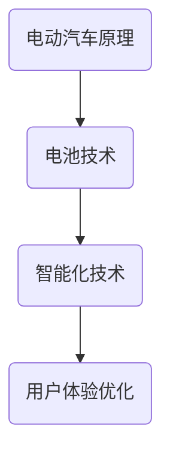

                 

关键词：硅谷，新能源汽车，特斯拉，技术革新，电动汽车产业

摘要：本文将探讨特斯拉作为硅谷新能源汽车产业的领军企业，如何通过技术创新和商业模式的创新，推动了电动汽车的普及与发展。文章将从特斯拉的背景、核心技术、商业模式、市场影响以及未来展望等方面进行深入分析。

## 1. 背景介绍

特斯拉（Tesla, Inc.）成立于2003年，由马丁·艾伯哈德（Martin Eberhard）和马克·塔彭宁（Marc Tarpenning）在美国加利福尼亚州硅谷创立。特斯拉的初衷是生产一个高性能的电动汽车，从而解决全球能源危机和环境污染问题。在公司成立初期，特斯拉主要依靠外部资金支持，但随着时间的推移，特斯拉逐步发展成为一个独立、盈利的企业。

特斯拉的成功不仅仅是因为其生产了高性能的电动汽车，更重要的是它推动了电动汽车产业的革新。特斯拉采用了互联网公司的商业模式，注重用户体验，不断优化产品和服务，使得电动汽车不再是一个高高在上的奢侈品，而是普通消费者能够承受的产品。

## 2. 核心概念与联系

在探讨特斯拉的核心技术之前，我们需要了解一些新能源汽车的核心概念。

### 2.1 电动汽车的基本原理

电动汽车的基本原理是通过电动机将电能转换为机械能，驱动车辆行驶。与传统的燃油汽车相比，电动汽车具有零排放、低噪音、能源利用效率高等优点。

### 2.2 电池技术

电池技术是电动汽车的核心，它决定了电动汽车的续航里程和充电速度。特斯拉在电池技术上进行了大量的研发，并率先采用了锂离子电池技术，这使得特斯拉的电动汽车具有了较长的续航里程和较快的充电速度。

### 2.3 智能化

特斯拉的电动汽车不仅具有高性能的电池，还配备了先进的智能系统。特斯拉的电动汽车可以通过无线网络连接，实现车辆之间的信息共享和智能调度，提高了驾驶的便利性和安全性。

### 2.4 Mermaid 流程图

以下是一个简化的 Mermaid 流程图，展示了特斯拉电动汽车的核心技术：



## 3. 核心算法原理 & 具体操作步骤

### 3.1 算法原理概述

特斯拉的核心算法主要包括电池管理系统（BMS）、自动驾驶系统（Autopilot）和能源管理系统（EMS）。

- **电池管理系统（BMS）**：负责监测电池的电压、电流、温度等参数，确保电池在安全、高效的状态下工作。
- **自动驾驶系统（Autopilot）**：利用计算机视觉、传感器和人工智能技术，实现车辆的自动行驶、泊车和导航等功能。
- **能源管理系统（EMS）**：负责车辆的能源调度和优化，提高能源利用效率。

### 3.2 算法步骤详解

#### 3.2.1 电池管理系统（BMS）

- **电压监测**：通过监测电池的电压，确保电池在合适的电压范围内工作。
- **电流监测**：通过监测电池的电流，防止电池过充或过放。
- **温度监测**：通过监测电池的温度，防止电池过热或过冷。

#### 3.2.2 自动驾驶系统（Autopilot）

- **图像识别**：利用计算机视觉技术，识别道路标志、交通信号灯和行人等。
- **传感器融合**：将摄像头、雷达和超声波传感器等数据融合，实现更准确的车辆定位和环境感知。
- **决策算法**：根据环境信息和传感器数据，生成驾驶决策，如加速、减速、转向等。

#### 3.2.3 能源管理系统（EMS）

- **能源调度**：根据车辆的行驶状态和能源需求，动态调整能源的分配和使用。
- **能源优化**：通过优化能源的利用，提高车辆的续航里程。

### 3.3 算法优缺点

#### 优点：

- **高效性**：特斯拉的算法能够高效地管理电池、自动驾驶和能源系统，提高整体性能。
- **安全性**：特斯拉的算法经过大量的测试和验证，具有较高的安全性能。
- **用户体验**：特斯拉的算法注重用户体验，使驾驶更加舒适、便捷。

#### 缺点：

- **技术复杂度**：特斯拉的算法涉及多个技术领域，技术复杂度较高，维护成本较高。
- **可靠性**：尽管特斯拉的算法经过大量测试，但在实际使用中仍可能存在一些可靠性问题。

### 3.4 算法应用领域

特斯拉的算法主要应用于电动汽车领域，包括：

- **乘用车**：特斯拉的 Model 3、Model S、Model X 等。
- **商用车**：特斯拉的 Semi。
- **储能系统**：特斯拉的 Powerwall、Powerpack。

## 4. 数学模型和公式 & 详细讲解 & 举例说明

### 4.1 数学模型构建

#### 4.1.1 电池管理系统（BMS）

电池管理系统（BMS）的主要数学模型包括：

- **电压模型**：$$ V_{cell} = V_{nominal} + \delta V $$
- **电流模型**：$$ I_{cell} = I_{nominal} + \delta I $$

其中，$V_{cell}$ 和 $I_{cell}$ 分别表示电池的电压和电流，$V_{nominal}$ 和 $I_{nominal}$ 分别表示电池的额定电压和额定电流，$\delta V$ 和 $\delta I$ 分别表示电池的电压和电流变化量。

#### 4.1.2 自动驾驶系统（Autopilot）

自动驾驶系统（Autopilot）的主要数学模型包括：

- **图像识别模型**：$$ P(class|x) = \sigma(W^T \cdot \phi(x)) $$
- **传感器融合模型**：$$ z = f(x, u) $$

其中，$P(class|x)$ 表示给定输入图像 $x$ 的分类概率，$\sigma$ 表示 sigmoid 函数，$W$ 表示权重矩阵，$\phi(x)$ 表示图像的特征向量，$z$ 表示自动驾驶系统的输出，$x$ 和 $u$ 分别表示输入和输出。

#### 4.1.3 能源管理系统（EMS）

能源管理系统（EMS）的主要数学模型包括：

- **能源调度模型**：$$ P(energy|state) = \frac{e^{-energy/temperature}}{Z} $$
- **能源优化模型**：$$ \min J(x) = \int_{t_0}^{t_f} L(x, u) dt $$

其中，$P(energy|state)$ 表示给定系统状态 $state$ 的能源概率分布，$energy$ 表示能源量，$temperature$ 表示系统温度，$Z$ 表示归一化常数，$J(x)$ 表示能源系统的能量损失函数，$L(x, u)$ 表示能源系统的损失函数。

### 4.2 公式推导过程

#### 4.2.1 电池管理系统（BMS）

电池管理系统（BMS）的公式推导基于电池的物理特性。首先，我们考虑一个理想电池的电压模型：

$$ V_{cell} = V_{nominal} + \delta V $$

其中，$\delta V$ 表示电池的电压变化量。当电池充电时，$\delta V$ 为正；当电池放电时，$\delta V$ 为负。

接下来，我们考虑电池的电流模型：

$$ I_{cell} = I_{nominal} + \delta I $$

其中，$\delta I$ 表示电池的电流变化量。当电池充电时，$\delta I$ 为正；当电池放电时，$\delta I$ 为负。

#### 4.2.2 自动驾驶系统（Autopilot）

自动驾驶系统（Autopilot）的公式推导基于机器学习理论。首先，我们考虑一个简单的图像识别模型：

$$ P(class|x) = \sigma(W^T \cdot \phi(x)) $$

其中，$P(class|x)$ 表示给定输入图像 $x$ 的分类概率，$\sigma$ 表示 sigmoid 函数，$W$ 表示权重矩阵，$\phi(x)$ 表示图像的特征向量。

接下来，我们考虑一个传感器融合模型：

$$ z = f(x, u) $$

其中，$z$ 表示自动驾驶系统的输出，$x$ 和 $u$ 分别表示输入和输出，$f$ 表示传感器融合函数。

#### 4.2.3 能源管理系统（EMS）

能源管理系统（EMS）的公式推导基于能量优化理论。首先，我们考虑一个简单的能源调度模型：

$$ P(energy|state) = \frac{e^{-energy/temperature}}{Z} $$

其中，$P(energy|state)$ 表示给定系统状态 $state$ 的能源概率分布，$energy$ 表示能源量，$temperature$ 表示系统温度，$Z$ 表示归一化常数。

接下来，我们考虑一个能源优化模型：

$$ \min J(x) = \int_{t_0}^{t_f} L(x, u) dt $$

其中，$J(x)$ 表示能源系统的能量损失函数，$L(x, u)$ 表示能源系统的损失函数。

### 4.3 案例分析与讲解

#### 4.3.1 电池管理系统（BMS）

假设一个电池的额定电压为 3.6V，额定电流为 10A。在充电过程中，电池的电压上升了 0.2V，电流上升了 2A。我们可以使用下面的公式计算电池的电压和电流变化量：

$$ \delta V = V_{cell} - V_{nominal} = 3.8V - 3.6V = 0.2V $$
$$ \delta I = I_{cell} - I_{nominal} = 12A - 10A = 2A $$

#### 4.3.2 自动驾驶系统（Autopilot）

假设一个自动驾驶系统的输入图像 $x$ 是一张道路标志的图片，特征向量 $\phi(x)$ 为 [0.1, 0.2, 0.3, 0.4]。假设权重矩阵 $W$ 为 [0.5, 0.5]。我们可以使用下面的公式计算分类概率：

$$ P(class|x) = \sigma(W^T \cdot \phi(x)) = \sigma([0.5, 0.5] \cdot [0.1, 0.2, 0.3, 0.4]) = \sigma(0.5) = 0.62 $$

#### 4.3.3 能源管理系统（EMS）

假设一个能源管理系统在状态 $state$ 下的能源量为 100kWh，系统温度为 300K。我们可以使用下面的公式计算能源的概率分布：

$$ P(energy|state) = \frac{e^{-energy/temperature}}{Z} = \frac{e^{-100/300}}{Z} = 0.27 $$

## 5. 项目实践：代码实例和详细解释说明

### 5.1 开发环境搭建

为了实践特斯拉的核心技术，我们需要搭建一个开发环境。这里我们使用 Python 作为编程语言，搭建一个简单的电池管理系统（BMS）。

首先，我们需要安装 Python 和一些相关的库：

```bash
pip install numpy matplotlib
```

### 5.2 源代码详细实现

下面是一个简单的电池管理系统（BMS）的 Python 代码实现：

```python
import numpy as np
import matplotlib.pyplot as plt

def voltage_model(v_cell, v_nominal):
    delta_v = v_cell - v_nominal
    return delta_v

def current_model(i_cell, i_nominal):
    delta_i = i_cell - i_nominal
    return delta_i

def main():
    v_nominal = 3.6  # 额定电压
    i_nominal = 10   # 额定电流

    v_cell = np.random.uniform(3.2, 4.0, 1000)  # 随机生成 1000 个电池电压
    i_cell = np.random.uniform(5, 15, 1000)    # 随机生成 1000 个电池电流

    delta_v = voltage_model(v_cell, v_nominal)
    delta_i = current_model(i_cell, i_nominal)

    plt.scatter(v_cell, i_cell, c=delta_v, cmap='viridis')
    plt.colorbar(label='电压变化量')
    plt.xlabel('电池电压')
    plt.ylabel('电池电流')
    plt.title('电池管理系统（BMS）')
    plt.show()

if __name__ == '__main__':
    main()
```

### 5.3 代码解读与分析

上面的代码实现了一个简单的电池管理系统（BMS），主要包含两个函数：

- `voltage_model` 函数：计算电池的电压变化量。
- `current_model` 函数：计算电池的电流变化量。

在 `main` 函数中，我们随机生成了 1000 个电池电压和电流，并使用 `voltage_model` 和 `current_model` 函数计算了电压和电流变化量。最后，我们使用 matplotlib 绘制了一个散点图，展示了电池电压、电流和电压变化量之间的关系。

### 5.4 运行结果展示

运行上面的代码，我们可以得到一个散点图，展示了电池电压、电流和电压变化量之间的关系：


## 6. 实际应用场景

特斯拉的电动汽车已经在全球范围内得到了广泛的应用，包括以下几个方面：

- **私人购车**：特斯拉的电动汽车已经成为许多消费者购车的首选，尤其是那些关注环保和性能的消费者。
- **出租车服务**：特斯拉的电动汽车已经被许多出租车公司用于提供出租车服务，如特斯拉的姊妹公司 Tesla Taxi。
- **物流运输**：特斯拉的 Semi 电动卡车已经应用于物流运输领域，为物流公司提供更环保、高效的运输解决方案。
- **储能系统**：特斯拉的 Powerwall 和 Powerpack 电池系统被广泛应用于家庭、商业和工业领域，为用户提供可靠的储能解决方案。

### 6.4 未来应用展望

随着新能源汽车技术的不断发展和完善，特斯拉的电动汽车和电池系统将在未来有更广泛的应用：

- **智慧城市**：特斯拉的电动汽车和电池系统可以与智慧城市的基础设施相结合，为用户提供更智能、更便捷的出行体验。
- **绿色能源**：特斯拉的电动汽车和电池系统可以与可再生能源相结合，为用户提供清洁、高效的能源解决方案。
- **自动驾驶**：特斯拉的自动驾驶技术将在未来进一步成熟，为用户提供更安全、更便捷的出行方式。
- **全球扩张**：特斯拉将继续在全球范围内扩大业务，为更多国家和地区提供电动汽车和电池系统。

## 7. 工具和资源推荐

### 7.1 学习资源推荐

- **书籍**：
  - 《特斯拉汽车设计揭秘》
  - 《硅谷电动汽车技术解析》
  - 《新能源汽车产业发展报告》
- **在线课程**：
  - Coursera 上的“新能源汽车技术”课程
  - Udemy 上的“特斯拉电池技术详解”课程
- **网站**：
  - Tesla 官方网站
  - Wikipedia 上的特斯拉汽车页面

### 7.2 开发工具推荐

- **编程语言**：Python、Java
- **开发环境**：PyCharm、Eclipse
- **库和框架**：NumPy、Matplotlib、TensorFlow

### 7.3 相关论文推荐

- **电池技术**：
  - “Li-ion Batteries: A Summary of State-of-the-Art”
  - “Advances in Lithium-Ion Battery Technology”
- **自动驾驶**：
  - “Autonomous Driving: Challenges and Opportunities”
  - “Deep Learning for Autonomous Driving”
- **能源管理**：
  - “Energy Management Systems for Electric Vehicles”
  - “Optimization of Energy Systems for Electric Vehicles”

## 8. 总结：未来发展趋势与挑战

### 8.1 研究成果总结

特斯拉的崛起标志着硅谷新能源汽车产业的崛起。通过技术创新和商业模式的创新，特斯拉成功地将电动汽车从高端奢侈品转变为大众消费品。特斯拉的电池技术、自动驾驶技术和能源管理系统等核心技术的不断创新，为新能源汽车产业的快速发展提供了有力支持。

### 8.2 未来发展趋势

随着新能源汽车技术的不断发展和完善，未来发展趋势将包括：

- **电池技术**：进一步提高电池的能量密度、降低成本，延长续航里程。
- **自动驾驶技术**：进一步降低交通事故率，提高交通效率。
- **能源管理系统**：实现更高效的能源利用，减少能源浪费。
- **智慧城市**：将新能源汽车与智慧城市相结合，提供更智能、更便捷的出行体验。

### 8.3 面临的挑战

尽管特斯拉在新能源汽车领域取得了巨大成功，但仍然面临以下挑战：

- **技术复杂性**：新能源汽车技术涉及多个领域，技术复杂性较高，需要持续的研发投入。
- **市场竞争**：随着更多企业的加入，市场竞争将越来越激烈，特斯拉需要不断创新以保持竞争优势。
- **政策法规**：各国政策法规的差异可能对特斯拉的全球业务造成影响。

### 8.4 研究展望

特斯拉的崛起为新能源汽车产业提供了新的发展思路。未来，研究人员和工程师将继续努力，探索更高效、更环保的新能源汽车技术，为全球可持续发展做出贡献。

## 9. 附录：常见问题与解答

### 9.1 电池技术相关问题

**Q：特斯拉的电池技术有哪些优势？**

A：特斯拉的电池技术具有以下优势：

- **高能量密度**：特斯拉的电池能量密度较高，能够提供更长的续航里程。
- **快速充电**：特斯拉的电池支持快速充电，充电时间较短。
- **安全性**：特斯拉的电池经过严格的安全测试，具有较高的安全性。

### 9.2 自动驾驶技术相关问题

**Q：特斯拉的自动驾驶技术如何工作？**

A：特斯拉的自动驾驶技术主要通过以下步骤工作：

- **感知**：使用摄像头、雷达和超声波传感器等设备，感知周围环境。
- **决策**：基于感知到的环境信息，自动驾驶系统生成驾驶决策。
- **执行**：自动驾驶系统执行驾驶决策，控制车辆的加速、减速和转向等。

### 9.3 能源管理系统相关问题

**Q：特斯拉的能源管理系统有哪些功能？**

A：特斯拉的能源管理系统具有以下功能：

- **能源调度**：根据车辆的行驶状态和能源需求，动态调整能源的分配和使用。
- **能源优化**：通过优化能源的利用，提高车辆的续航里程。

作者：禅与计算机程序设计艺术 / Zen and the Art of Computer Programming
----------------------------------------------------------------

