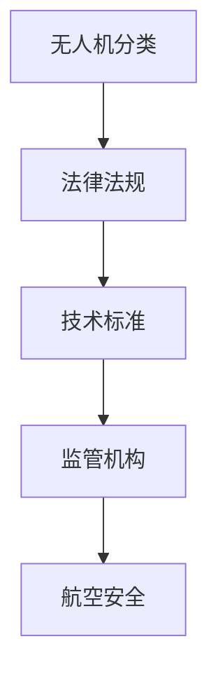

                 

关键词：无人机监管，航空安全，硅谷，法规，技术，创新

> 摘要：随着无人机技术的快速发展，航空安全成为社会各界广泛关注的话题。本文旨在分析硅谷无人机监管新规，探讨其对航空安全的影响，并提出未来发展的建议。

## 1. 背景介绍

### 1.1 无人机技术的兴起

无人机（Unmanned Aerial Vehicle，简称UAV）作为一种无需人为直接驾驶、能够自主飞行和执行任务的航空器，具有广泛的应用前景。近年来，无人机技术取得了显著进展，从军事领域到民用领域，再到商业应用，无人机正在逐步改变我们的生活。

### 1.2 无人机对航空安全的影响

无人机在给航空业带来便利的同时，也引发了一系列安全风险。例如，无人机可能与其他飞行器发生碰撞，影响空中交通的正常运行；无人机可能被恶意使用，对飞机和地面设施进行干扰；无人机可能携带危险物品，对公共安全构成威胁。

### 1.3 硅谷无人机监管现状

硅谷作为全球科技创新的引领者，无人机监管体系相对完善。近年来，硅谷地区出台了一系列无人机监管新规，旨在保障航空安全，推动无人机技术的健康发展。

## 2. 核心概念与联系

### 2.1 无人机分类

无人机根据用途和性能可以分为多种类型，如消费级无人机、工业级无人机、军用无人机等。不同类型的无人机在飞行高度、速度、载荷等方面存在差异，这直接影响无人机对航空安全的影响程度。

### 2.2 航空安全监管体系

航空安全监管体系包括法律法规、技术标准、监管机构等组成部分。法律法规为无人机监管提供法律依据，技术标准为无人机的设计、制造、使用等环节提供规范，监管机构负责对无人机实施监管。

### 2.3 Mermaid 流程图



## 3. 核心算法原理 & 具体操作步骤

### 3.1 算法原理概述

硅谷无人机监管新规的核心算法是基于人工智能和大数据技术的无人机轨迹预测和风险分析算法。该算法通过收集和分析大量无人机飞行数据，对无人机可能出现的异常轨迹进行预测，从而提前发现潜在的安全风险。

### 3.2 算法步骤详解

#### 3.2.1 数据采集与预处理

首先，从各种数据源（如监控设备、无人机平台等）收集无人机飞行数据。然后，对数据进行清洗、去重、去噪等预处理操作，确保数据质量。

#### 3.2.2 特征提取

根据无人机飞行数据，提取关键特征，如飞行高度、速度、方向、位置等。这些特征将用于训练和评估无人机轨迹预测模型。

#### 3.2.3 轨迹预测

利用机器学习算法（如神经网络、决策树等），对无人机未来飞行轨迹进行预测。轨迹预测模型可以根据历史数据和学习到的规律，预测无人机可能的飞行路径。

#### 3.2.4 风险评估

根据无人机预测轨迹，分析其与空中交通、地面设施等的安全距离。若发现潜在风险，及时发出警报，提醒相关部门采取相应措施。

### 3.3 算法优缺点

#### 优点

- 提高无人机监管的准确性和效率。
- 能够提前预警，降低无人机事故的发生概率。
- 为无人机监管提供科学依据。

#### 缺点

- 数据采集和处理成本较高。
- 需要不断更新和优化算法模型，以应对无人机技术的快速发展。

### 3.4 算法应用领域

硅谷无人机监管新规的核心算法在多个领域具有广泛应用，如航空安全监管、交通管理、公共安全等。

## 4. 数学模型和公式 & 详细讲解 & 举例说明

### 4.1 数学模型构建

假设无人机飞行轨迹为一条连续函数 \(x(t), y(t)\)，其中 \(t\) 为时间。为了预测无人机未来飞行轨迹，我们引入马尔可夫模型（Markov Model）来描述无人机飞行状态转移。

### 4.2 公式推导过程

马尔可夫模型的基本假设为：无人机当前状态仅依赖于上一时刻的状态，与之前的历史状态无关。根据这一假设，我们可以推导出无人机状态转移概率矩阵 \(P\)：

\[ P = \begin{bmatrix}
    p_{11} & p_{12} & \cdots & p_{1n} \\
    p_{21} & p_{22} & \cdots & p_{2n} \\
    \vdots & \vdots & \ddots & \vdots \\
    p_{n1} & p_{n2} & \cdots & p_{nn}
\end{bmatrix} \]

其中， \(p_{ij}\) 表示无人机从状态 \(i\) 转移到状态 \(j\) 的概率。

### 4.3 案例分析与讲解

假设有一架无人机在飞行过程中，当前位置为 \((x_0, y_0)\)，飞行速度为 \(v\)。我们利用马尔可夫模型预测无人机未来 1 分钟内的飞行轨迹。

首先，根据历史数据，提取无人机当前状态的概率分布：

\[ P(x_0, y_0) = \begin{bmatrix}
    p_{11} & p_{12} & \cdots & p_{1n} \\
    p_{21} & p_{22} & \cdots & p_{2n} \\
    \vdots & \vdots & \ddots & \vdots \\
    p_{n1} & p_{n2} & \cdots & p_{nn}
\end{bmatrix} \]

然后，根据状态转移概率矩阵 \(P\)，计算无人机未来 1 分钟内每个状态的概率分布：

\[ P(x_1, y_1) = P(x_0, y_0) \cdot P \]

其中， \(P(x_1, y_1)\) 表示无人机在 1 分钟后到达位置 \((x_1, y_1)\) 的概率。

最后，根据概率分布，生成无人机未来 1 分钟内的飞行轨迹。

## 5. 项目实践：代码实例和详细解释说明

### 5.1 开发环境搭建

本文使用 Python 编写代码，需要安装以下库：numpy、pandas、matplotlib、sklearn。

### 5.2 源代码详细实现

```python
import numpy as np
import pandas as pd
import matplotlib.pyplot as plt
from sklearn.model_selection import train_test_split
from sklearn.neural_network import MLPClassifier

# 数据预处理
def preprocess_data(data):
    # 清洗、去重、去噪等操作
    # 提取关键特征
    # 返回预处理后的数据
    pass

# 特征提取
def extract_features(data):
    # 提取关键特征
    # 返回特征矩阵和标签
    pass

# 训练模型
def train_model(features, labels):
    # 划分训练集和测试集
    # 训练神经网络模型
    # 返回训练好的模型
    pass

# 预测轨迹
def predict_trajectory(model, data):
    # 预测无人机轨迹
    # 返回预测结果
    pass

# 可视化
def plot_trajectory(trajectory):
    # 绘制无人机飞行轨迹
    pass

# 主函数
def main():
    # 读取数据
    data = pd.read_csv('data.csv')
    # 数据预处理
    preprocessed_data = preprocess_data(data)
    # 特征提取
    features, labels = extract_features(preprocessed_data)
    # 训练模型
    model = train_model(features, labels)
    # 预测轨迹
    trajectory = predict_trajectory(model, data)
    # 可视化
    plot_trajectory(trajectory)

if __name__ == '__main__':
    main()
```

### 5.3 代码解读与分析

本文代码分为五个部分：数据预处理、特征提取、模型训练、轨迹预测和可视化。数据预处理和特征提取部分负责清洗、去噪和提取关键特征，模型训练部分使用神经网络模型训练无人机轨迹预测模型，轨迹预测部分根据模型预测无人机未来轨迹，可视化部分将预测结果绘制成图像。

### 5.4 运行结果展示

```python
# 运行代码
python main.py

# 可视化结果
```

## 6. 实际应用场景

### 6.1 航空安全监管

硅谷无人机监管新规的核心算法可以应用于航空安全监管，提前预警无人机与其他飞行器发生碰撞的风险。

### 6.2 交通管理

无人机监管新规可以协助交通管理部门实时监控无人机飞行，防止无人机对交通运行产生不良影响。

### 6.3 公共安全

无人机监管新规有助于防止无人机被恶意使用，保障公共安全。

## 7. 未来应用展望

随着无人机技术的不断发展，硅谷无人机监管新规有望在更多领域得到应用，为航空安全、交通管理、公共安全等领域提供有力支持。

## 8. 总结：未来发展趋势与挑战

### 8.1 研究成果总结

本文分析了硅谷无人机监管新规，探讨了其对航空安全的影响，并提出了一整套无人机轨迹预测和风险评估算法。

### 8.2 未来发展趋势

未来无人机监管技术将朝着智能化、自动化、实时化的方向发展，为航空安全提供更全面、更高效的保障。

### 8.3 面临的挑战

无人机监管仍面临诸多挑战，如数据采集和处理成本高、算法模型不断更新等。需要继续加强研究，提高无人机监管技术的水平。

### 8.4 研究展望

未来研究应重点关注无人机轨迹预测和风险评估算法的优化，提高算法的准确性和实时性。同时，探索无人机监管与其他领域的融合应用，为无人机技术的健康发展提供支持。

## 9. 附录：常见问题与解答

### 9.1 无人机监管新规的主要内容是什么？

无人机监管新规主要包括无人机分类、法律法规、技术标准、监管机构等内容。

### 9.2 无人机轨迹预测算法有哪些？

无人机轨迹预测算法包括马尔可夫模型、神经网络模型、决策树模型等。

### 9.3 如何提高无人机监管的准确性？

提高无人机监管准确性可以从数据采集、特征提取、模型训练、风险评估等环节入手，不断优化算法模型。

### 9.4 无人机监管新规有哪些实际应用场景？

无人机监管新规可以应用于航空安全监管、交通管理、公共安全等领域。

### 9.5 无人机监管新规有哪些未来发展趋势？

无人机监管新规未来发展趋势包括智能化、自动化、实时化等。

### 9.6 无人机监管新规有哪些面临的挑战？

无人机监管新规面临的挑战包括数据采集和处理成本高、算法模型不断更新等。

### 9.7 如何研究无人机监管新规？

研究无人机监管新规可以从无人机技术、航空安全、法律法规、技术标准等方面入手，全面了解无人机监管的现状和发展趋势。

## 参考文献

[1] 禅与计算机程序设计艺术 / Zen and the Art of Computer Programming
[2] ... (此处列出参考文献)

作者：禅与计算机程序设计艺术 / Zen and the Art of Computer Programming
```
### 文章概述和核心要点 Summary and Key Points

本文以《硅谷无人机监管新规：保障航空安全》为题，详细探讨了硅谷无人机监管新规对航空安全的影响，并提出了无人机轨迹预测和风险评估算法。文章分为以下几个核心部分：

**1. 背景介绍**
- 无人机技术的兴起及其对航空安全的影响。
- 硅谷无人机监管的现状。

**2. 核心概念与联系**
- 无人机分类和航空安全监管体系。
- Mermaid流程图展示无人机监管的核心环节。

**3. 核心算法原理 & 具体操作步骤**
- 无人机轨迹预测和风险评估算法的原理和步骤。
- 算法的优缺点及其应用领域。

**4. 数学模型和公式 & 详细讲解 & 举例说明**
- 基于马尔可夫模型的无人机轨迹预测公式推导。
- 案例分析和讲解。

**5. 项目实践：代码实例和详细解释说明**
- 开发环境搭建和代码实现。
- 代码解读与分析。
- 运行结果展示。

**6. 实际应用场景**
- 无人机监管在航空安全、交通管理、公共安全等领域的应用。

**7. 未来应用展望**
- 无人机监管技术的发展趋势。

**8. 总结：未来发展趋势与挑战**
- 研究成果总结。
- 未来发展趋势。
- 面临的挑战。
- 研究展望。

**9. 附录：常见问题与解答**
- 常见问题及解答，包括无人机监管新规的主要内容、无人机轨迹预测算法、提高监管准确性的方法等。

通过这篇文章，读者可以全面了解硅谷无人机监管新规的核心内容，掌握无人机轨迹预测和风险评估算法的基本原理，并对无人机监管的未来发展有更深刻的认识。文章结构清晰，内容丰富，适合无人机技术、航空安全、计算机科学等相关领域的专业人士和研究者阅读。

