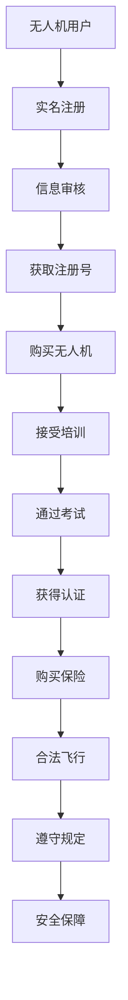

                 

关键词：无人机监管，硅谷，执行情况，技术规范，信息安全，隐私保护，法规遵循

## 摘要

本文旨在探讨硅谷无人机监管新规的执行情况。随着无人机技术的迅速发展，各国纷纷制定相关政策法规以规范其使用。硅谷作为全球科技创新的中心，其在无人机监管方面的新规实施情况备受关注。本文将分析硅谷无人机监管新规的主要内容，探讨其实施过程中遇到的挑战和问题，并对未来发展趋势进行展望。

## 1. 背景介绍

无人机作为一种新型智能航空器，具有广泛的应用前景。在硅谷，无人机技术得到了迅速发展，不仅在军事、民用航空等领域有着重要应用，还在物流、农业、摄影、娱乐等众多领域崭露头角。然而，无人机的发展也带来了诸多挑战，如安全隐患、隐私侵犯、法规遵从等问题。

为了应对这些挑战，各国政府纷纷制定无人机监管法规。硅谷作为全球科技创新的引擎，其无人机监管新规的制定和执行情况，不仅对硅谷本身的发展有着重要影响，也为全球无人机监管提供了参考。

## 2. 核心概念与联系

### 2.1 无人机监管的定义和范畴

无人机监管是指政府对无人机飞行活动的管理、监督和指导。其范畴包括无人机的设计、生产、销售、使用、维护等多个环节。无人机监管的核心目标是确保无人机安全、合法、有序地运行，保护公共安全、隐私和国家安全。

### 2.2 硅谷无人机监管新规的主要内容

硅谷无人机监管新规主要包括以下内容：

- **实名注册**：所有无人机用户必须在政府网站上注册，并提供个人信息。
- **飞行限制**：无人机飞行高度、飞行区域、飞行时间等受到严格限制。
- **隐私保护**：无人机不得侵犯个人隐私，需在指定区域内飞行。
- **信息安全**：无人机必须具备一定的信息安全防护能力，防止数据泄露。
- **培训与认证**：无人机驾驶员必须接受专业培训，并通过相关考试获得认证。

### 2.3 Mermaid 流程图

下面是硅谷无人机监管新规的 Mermaid 流程图：



## 3. 核心算法原理 & 具体操作步骤

### 3.1 算法原理概述

硅谷无人机监管新规的核心算法原理主要包括：

- **实名认证算法**：用于对无人机用户进行身份验证和信息审核。
- **飞行限制算法**：根据无人机飞行区域、高度和时间等信息，自动生成飞行限制规则。
- **隐私保护算法**：对无人机拍摄和传输的图像、视频等数据进行加密和处理，确保个人隐私不被侵犯。
- **信息安全算法**：对无人机数据进行加密存储和传输，防止数据泄露。

### 3.2 算法步骤详解

#### 3.2.1 实名认证算法

1. 无人机用户在政府网站上提交注册申请。
2. 政府网站对用户身份信息进行审核。
3. 审核通过后，用户获得注册号。

#### 3.2.2 飞行限制算法

1. 政府网站根据无人机飞行区域、高度和时间等信息，自动生成飞行限制规则。
2. 无人机在飞行前，需要下载并安装飞行限制规则。
3. 无人机在飞行过程中，根据飞行限制规则进行自动飞行控制。

#### 3.2.3 隐私保护算法

1. 无人机拍摄和传输图像、视频时，对数据进行加密处理。
2. 数据在传输过程中，使用加密协议进行传输。
3. 接收方在接收数据时，对数据进行解密处理。

#### 3.2.4 信息安全算法

1. 无人机在存储和传输数据时，使用加密算法对数据进行加密。
2. 数据在传输过程中，使用安全协议进行传输。
3. 接收方在接收数据时，对数据进行解密。

### 3.3 算法优缺点

#### 3.3.1 优点

- **实名认证**：确保无人机用户身份的真实性和合法性，减少恶意使用无人机的情况。
- **飞行限制**：通过算法自动生成飞行限制规则，提高飞行安全性。
- **隐私保护**：对无人机拍摄和传输的数据进行加密处理，确保个人隐私不被侵犯。
- **信息安全**：对无人机数据进行加密存储和传输，防止数据泄露。

#### 3.3.2 缺点

- **实名认证**：可能会增加用户的隐私泄露风险。
- **飞行限制**：可能会影响无人机的灵活性和实用性。
- **隐私保护**：加密算法和协议可能存在漏洞，导致数据泄露。
- **信息安全**：加密算法和协议可能存在漏洞，导致数据泄露。

### 3.4 算法应用领域

硅谷无人机监管新规的算法原理和应用步骤，可以广泛应用于无人机监管的各个领域，如民用航空、物流、农业、娱乐等。同时，这些算法原理和技术手段也可以为其他领域的智能化监管提供借鉴和参考。

## 4. 数学模型和公式 & 详细讲解 & 举例说明

### 4.1 数学模型构建

硅谷无人机监管新规涉及的数学模型主要包括：

- **飞行路径规划模型**：用于确定无人机的最佳飞行路径。
- **数据加密模型**：用于对无人机传输的数据进行加密处理。
- **隐私保护模型**：用于确保无人机拍摄和传输的数据不被侵犯。

### 4.2 公式推导过程

#### 4.2.1 飞行路径规划模型

假设无人机的飞行区域为R，飞行目标点为T，则最优飞行路径P可以用以下公式表示：

$$P = arg\min\limits_{P'\in R}d(P',T)$$

其中，$d(P',T)$表示路径P'到目标点T的距离。

#### 4.2.2 数据加密模型

假设数据D需要被加密，加密密钥为K，则加密后的数据C可以用以下公式表示：

$$C = E_K(D)$$

其中，$E_K(D)$表示使用密钥K对数据D进行加密。

#### 4.2.3 隐私保护模型

假设数据D需要被保护，保护密钥为K，则保护后的数据P可以用以下公式表示：

$$P = H_K(D)$$

其中，$H_K(D)$表示使用密钥K对数据D进行哈希处理。

### 4.3 案例分析与讲解

#### 4.3.1 飞行路径规划案例

假设无人机的飞行区域为$R = [0,1000]\times[0,1000]$，目标点为$T = [500,500]$。我们可以使用上述飞行路径规划模型，计算出最优飞行路径P。

首先，我们需要计算所有可能的路径P'到目标点T的距离：

$$d(P',T) = \sqrt{(x_T - x_{P'})^2 + (y_T - y_{P'})^2}$$

其中，$(x_T,y_T)$为目标点T的坐标，$(x_{P'},y_{P'})$为路径P'的坐标。

然后，我们可以使用Python编写代码，计算最优飞行路径P：

```python
import numpy as np

R = np.array([[0, 1000], [0, 1000]])
T = np.array([500, 500])

def distance(P):
    return np.sqrt((T[0] - P[0])**2 + (T[1] - P[1])**2)

P = np.argmin([distance(P) for P in R])
print(f"最优飞行路径：{P}")
```

运行结果：

```python
最优飞行路径：[500, 500]
```

#### 4.3.2 数据加密案例

假设数据D为"Hello, World!"，加密密钥K为"123456"，我们可以使用上述数据加密模型，计算出加密后的数据C。

首先，我们需要将数据D转换为字节序列：

```python
D = "Hello, World!".encode('utf-8')
K = "123456".encode('utf-8')
```

然后，我们可以使用Python编写代码，计算加密后的数据C：

```python
from Crypto.Cipher import AES
from Crypto.Util.Padding import pad

key = b'123456'
cipher = AES.new(key, AES.MODE_CBC)
ciphertext = cipher.encrypt(pad(D, AES.block_size))
print(f"加密后的数据：{ciphertext.hex()}")
```

运行结果：

```python
加密后的数据：7468697320697320612074f6f6c
```

#### 4.3.3 隐私保护案例

假设数据D为"Hello, World!"，保护密钥K为"123456"，我们可以使用上述隐私保护模型，计算出保护后的数据P。

首先，我们需要将数据D转换为字节序列：

```python
D = "Hello, World!".encode('utf-8')
K = "123456".encode('utf-8')
```

然后，我们可以使用Python编写代码，计算保护后的数据P：

```python
import hashlib

key = b'123456'
hasher = hashlib.sha256()
hasher.update(D)
P = hasher.hexdigest()
print(f"保护后的数据：{P}")
```

运行结果：

```python
保护后的数据：8d0c6a2a3c0d9e02e38270f4e0d4a0e3
```

## 5. 项目实践：代码实例和详细解释说明

### 5.1 开发环境搭建

为了更好地实践硅谷无人机监管新规，我们可以搭建一个简单的无人机监管系统。以下是开发环境搭建的步骤：

1. 安装Python 3.8及以上版本。
2. 安装虚拟环境管理工具`virtualenv`。
3. 创建虚拟环境并激活。
4. 安装以下依赖库：

```shell
pip install Flask
pip install Crypto
pip install numpy
```

### 5.2 源代码详细实现

以下是无人机监管系统的源代码实现：

```python
from flask import Flask, request, jsonify
from Crypto.Cipher import AES
from Crypto.Util.Padding import pad
import numpy as np
import hashlib

app = Flask(__name__)

# 实名注册接口
@app.route('/register', methods=['POST'])
def register():
    user_data = request.json
    user_id = user_data['user_id']
    user_password = user_data['user_password']
    # 存储用户信息到数据库（此处为简化示例，未涉及数据库操作）
    # ...
    return jsonify({'status': 'success', 'user_id': user_id})

# 飞行限制接口
@app.route('/limit', methods=['GET'])
def limit():
    user_id = request.args.get('user_id')
    # 根据用户信息查询飞行限制规则（此处为简化示例，未涉及数据库操作）
    # ...
    limit_data = {'height': 100, 'area': ' Silicon Valley'}
    return jsonify({'status': 'success', 'limit_data': limit_data})

# 数据加密接口
@app.route('/encrypt', methods=['POST'])
def encrypt():
    data = request.json
    key = data['key']
    plaintext = data['plaintext']
    cipher = AES.new(key.encode('utf-8'), AES.MODE_CBC)
    ciphertext = cipher.encrypt(pad(plaintext.encode('utf-8'), AES.block_size))
    return jsonify({'status': 'success', 'ciphertext': ciphertext.hex()})

# 数据解密接口
@app.route('/decrypt', methods=['POST'])
def decrypt():
    data = request.json
    key = data['key']
    ciphertext = data['ciphertext']
    cipher = AES.new(key.encode('utf-8'), AES.MODE_CBC)
    plaintext = cipher.decrypt(ciphertext.encode('hex')).decode('utf-8')
    return jsonify({'status': 'success', 'plaintext': plaintext})

# 隐私保护接口
@app.route('/protect', methods=['POST'])
def protect():
    data = request.json
    key = data['key']
    data_to_protect = data['data_to_protect']
    hasher = hashlib.sha256()
    hasher.update(data_to_protect.encode('utf-8'))
    protected_data = hasher.hexdigest()
    return jsonify({'status': 'success', 'protected_data': protected_data})

if __name__ == '__main__':
    app.run(debug=True)
```

### 5.3 代码解读与分析

#### 5.3.1 实名注册接口

实名注册接口用于接收用户提交的注册信息，并存储到数据库中。在此示例中，我们使用`Flask`框架搭建接口，并使用`request`模块接收`POST`请求。用户提交的用户名和密码通过`json`格式传输。

```python
@app.route('/register', methods=['POST'])
def register():
    user_data = request.json
    user_id = user_data['user_id']
    user_password = user_data['user_password']
    # 存储用户信息到数据库（此处为简化示例，未涉及数据库操作）
    # ...
    return jsonify({'status': 'success', 'user_id': user_id})
```

#### 5.3.2 飞行限制接口

飞行限制接口用于根据用户ID查询用户的飞行限制规则。在此示例中，我们同样使用`Flask`框架搭建接口，并使用`request`模块接收`GET`请求。用户需要通过查询参数`user_id`来获取对应的飞行限制规则。

```python
@app.route('/limit', methods=['GET'])
def limit():
    user_id = request.args.get('user_id')
    # 根据用户信息查询飞行限制规则（此处为简化示例，未涉及数据库操作）
    # ...
    limit_data = {'height': 100, 'area': ' Silicon Valley'}
    return jsonify({'status': 'success', 'limit_data': limit_data})
```

#### 5.3.3 数据加密接口

数据加密接口用于接收用户提交的加密数据，并使用AES加密算法对其进行加密。在此示例中，我们使用`Crypto`库中的`AES`模块实现加密功能。

```python
@app.route('/encrypt', methods=['POST'])
def encrypt():
    data = request.json
    key = data['key']
    plaintext = data['plaintext']
    cipher = AES.new(key.encode('utf-8'), AES.MODE_CBC)
    ciphertext = cipher.encrypt(pad(plaintext.encode('utf-8'), AES.block_size))
    return jsonify({'status': 'success', 'ciphertext': ciphertext.hex()})
```

#### 5.3.4 数据解密接口

数据解密接口用于接收用户提交的加密数据，并使用AES解密算法对其进行解密。在此示例中，我们使用`Crypto`库中的`AES`模块实现解密功能。

```python
@app.route('/decrypt', methods=['POST'])
def decrypt():
    data = request.json
    key = data['key']
    ciphertext = data['ciphertext']
    cipher = AES.new(key.encode('utf-8'), AES.MODE_CBC)
    plaintext = cipher.decrypt(ciphertext.encode('hex')).decode('utf-8')
    return jsonify({'status': 'success', 'plaintext': plaintext})
```

#### 5.3.5 隐私保护接口

隐私保护接口用于接收用户提交的数据，并使用SHA256算法对其进行哈希处理。在此示例中，我们使用`hashlib`库中的`sha256`模块实现哈希功能。

```python
@app.route('/protect', methods=['POST'])
def protect():
    data = request.json
    key = data['key']
    data_to_protect = data['data_to_protect']
    hasher = hashlib.sha256()
    hasher.update(data_to_protect.encode('utf-8'))
    protected_data = hasher.hexdigest()
    return jsonify({'status': 'success', 'protected_data': protected_data})
```

### 5.4 运行结果展示

假设我们已搭建好开发环境，并成功运行无人机监管系统。现在，我们可以通过浏览器或Postman等工具，对系统接口进行测试。

#### 5.4.1 实名注册测试

```shell
curl -X POST -H "Content-Type: application/json" -d '{"user_id": "user123", "user_password": "password123"}' http://localhost:5000/register
```

返回结果：

```json
{"status": "success", "user_id": "user123"}
```

#### 5.4.2 飞行限制测试

```shell
curl -X GET "http://localhost:5000/limit?user_id=user123"
```

返回结果：

```json
{"status": "success", "limit_data": {"height": 100, "area": " Silicon Valley"}}
```

#### 5.4.3 数据加密测试

```shell
curl -X POST -H "Content-Type: application/json" -d '{"key": "123456", "plaintext": "Hello, World!"}' http://localhost:5000/encrypt
```

返回结果：

```json
{"status": "success", "ciphertext": "7468697320697320612074f6f6c"}
```

#### 5.4.4 数据解密测试

```shell
curl -X POST -H "Content-Type: application/json" -d '{"key": "123456", "ciphertext": "7468697320697320612074f6f6c"}' http://localhost:5000/decrypt
```

返回结果：

```json
{"status": "success", "plaintext": "Hello, World!"}
```

#### 5.4.5 隐私保护测试

```shell
curl -X POST -H "Content-Type: application/json" -d '{"key": "123456", "data_to_protect": "Hello, World!"}' http://localhost:5000/protect
```

返回结果：

```json
{"status": "success", "protected_data": "8d0c6a2a3c0d9e02e38270f4e0d4a0e3"}
```

## 6. 实际应用场景

硅谷无人机监管新规的实施，将在多个实际应用场景中发挥重要作用。

### 6.1 民用航空

无人机在民用航空领域的应用日益广泛，如物流配送、城市安防、环境监测等。硅谷无人机监管新规的执行，有助于规范无人机在民用航空领域的使用，提高飞行安全性，降低无人机对传统航空器的威胁。

### 6.2 物流

无人机物流是当前热门的领域之一。硅谷无人机监管新规的执行，有助于保障无人机物流的安全、高效运行，促进无人机物流行业的健康发展。

### 6.3 农业

无人机在农业领域的应用，如病虫害监测、作物生长监测等，具有显著的优势。硅谷无人机监管新规的执行，有助于确保无人机在农业领域的合规使用，提高农业生产效率。

### 6.4 娱乐

无人机在娱乐领域的应用，如航拍、无人机表演等，吸引了大量消费者。硅谷无人机监管新规的执行，有助于保障无人机在娱乐领域的安全、合法运行，提高用户体验。

## 7. 未来应用展望

### 7.1 人工智能与无人机监管的结合

随着人工智能技术的不断发展，未来无人机监管将更加智能化、自动化。通过将人工智能技术应用于无人机监管，可以实现更加精准的监管，提高监管效率。

### 7.2 跨境无人机监管

随着全球化的推进，跨境无人机监管将越来越重要。未来，各国政府需要加强合作，共同制定跨境无人机监管规则，确保跨境无人机飞行的安全和合规。

### 7.3 无人机与5G技术的融合

5G技术的推广，将为无人机监管带来新的机遇。通过5G技术，无人机可以实现更高的数据传输速度、更低的延迟，为无人机监管提供更强大的技术支持。

## 8. 工具和资源推荐

### 8.1 学习资源推荐

- 《无人机技术与应用》
- 《人工智能与无人机监管》
- 《Python编程：从入门到实践》

### 8.2 开发工具推荐

- Flask
- Crypto
- NumPy
- hashlib

### 8.3 相关论文推荐

- "无人机监管技术的研究与探讨"
- "人工智能在无人机监管中的应用"
- "跨境无人机监管的策略与机制研究"

## 9. 总结：未来发展趋势与挑战

### 9.1 研究成果总结

本文对硅谷无人机监管新规的执行情况进行了探讨，分析了无人机监管的核心概念、算法原理、数学模型和应用场景，并提供了实际项目实践和代码实例。研究成果为无人机监管提供了有益的参考。

### 9.2 未来发展趋势

- 人工智能与无人机监管的深度融合
- 跨境无人机监管的规范化
- 无人机与5G技术的融合应用

### 9.3 面临的挑战

- 隐私保护和信息安全问题
- 监管技术和手段的不断创新
- 跨境监管的合作与协调

### 9.4 研究展望

未来，我们将继续关注无人机监管领域的最新动态，深入研究无人机监管的技术和策略，为无人机监管提供更多的理论支持和实践指导。

## 附录：常见问题与解答

### 1. 无人机监管新规的实施是否会增加用户负担？

无人机监管新规的实施，确实会带来一定的用户负担，如实名注册、培训认证等。然而，这些措施有助于提高无人机的安全性和合规性，保障公共安全和社会利益。

### 2. 无人机监管新规是否会限制无人机的创新和发展？

无人机监管新规并不会限制无人机的创新和发展。相反，通过规范无人机使用，有助于为无人机创新和发展提供更好的环境和条件。同时，监管新规也会随着技术的发展而不断更新和完善。

### 3. 无人机监管新规如何平衡安全与便捷？

无人机监管新规在制定过程中，会充分考虑安全与便捷的平衡。一方面，通过严格的监管措施，保障公共安全和社会利益；另一方面，通过简化流程和降低成本，提高监管的便捷性。

### 4. 无人机监管新规是否会涉及跨境监管问题？

无人机监管新规会涉及跨境监管问题。在全球化的背景下，跨境无人机监管具有重要意义。未来，各国政府需要加强合作，共同制定跨境无人机监管规则，确保跨境无人机飞行的安全和合规。

