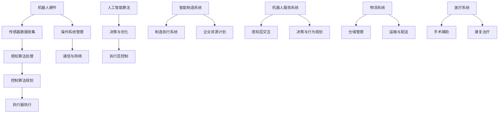

                 

### 关键词 Keywords

- 硅谷机器人技术
- 智能制造
- 机器人服务
- 人工智能
- 机器人编程
- 智能自动化
- 机器人应用场景
- 未来发展趋势

### 摘要 Abstract

本文深入探讨了硅谷机器人技术及其在智能制造和服务领域的应用。通过对核心概念的介绍和详细的技术分析，我们了解了机器人技术的原理、算法、数学模型以及项目实践。文章还分析了机器人技术的实际应用场景，展望了其未来的发展趋势和面临的挑战。希望通过本文，读者能够对硅谷机器人技术有一个全面而深入的认识。

## 1. 背景介绍

机器人技术是人工智能领域的一个重要分支，它通过模拟人类的感知、决策和行动能力，实现自动化和智能化操作。随着计算能力的提升和传感器技术的进步，机器人技术正迅速发展，并在制造业、服务业、医疗、物流等多个领域得到了广泛应用。硅谷作为全球科技创新的领先地区，聚集了众多顶级机器人技术公司和研究人员，推动了机器人技术的发展。

### 1.1 硅谷机器人技术的发展历程

硅谷机器人技术的发展可以追溯到20世纪60年代，当时机器人主要用于工业生产。随着计算机技术的进步，机器人逐渐从简单的机械手臂发展到具备智能感知和自主决策能力的复杂系统。近年来，随着人工智能技术的快速发展，硅谷的机器人技术迎来了新的突破，特别是在智能制造和服务领域。

### 1.2 硅谷机器人技术的核心优势

硅谷机器人技术的核心优势主要体现在以下几个方面：

- **创新性**：硅谷企业具备强烈的创新意识，不断推动机器人技术的突破。
- **技术集成**：硅谷企业擅长将多种技术进行整合，实现更高效的机器人系统。
- **市场导向**：硅谷企业以市场需求为导向，研发出符合实际应用场景的机器人产品。
- **人才集聚**：硅谷吸引了全球顶尖的机器人技术人才，为技术创新提供了强大的人力资源。

### 1.3 硅谷机器人技术的应用领域

硅谷机器人技术广泛应用于多个领域，主要包括：

- **智能制造**：机器人技术在制造业中的应用，包括生产线自动化、质量检测、组装等。
- **服务业**：机器人技术在餐饮、医疗、零售等服务领域的应用，提供智能化服务。
- **医疗**：机器人技术在手术辅助、康复治疗、医疗检测等领域的应用。
- **物流**：机器人技术在仓储、运输、配送等物流环节的应用，提高物流效率。
- **农业**：机器人技术在农业中的应用，包括种植、收割、监控等。

## 2. 核心概念与联系

### 2.1 机器人技术的基本概念

机器人技术是指通过计算机技术、控制技术、传感器技术等多学科交叉融合，实现对机器人系统的设计和应用。机器人系统通常由硬件和软件两部分组成：

- **硬件**：包括机械结构、传感器、执行器等。
- **软件**：包括操作系统、控制算法、感知算法等。

### 2.2 智能制造的概念与架构

智能制造是指通过将信息技术、人工智能、物联网等先进技术应用于制造业，实现制造过程的智能化和自动化。智能制造的架构包括以下几个层面：

- **设备层**：包括传感器、控制器、执行器等。
- **控制层**：包括PLC（可编程逻辑控制器）、IPC（工业计算机）等。
- **平台层**：包括MES（制造执行系统）、ERP（企业资源计划）等。
- **决策层**：包括高级规划、决策、优化等。

### 2.3 机器人服务的基本概念与架构

机器人服务是指利用机器人系统提供各种服务，包括但不限于家庭服务、医疗护理、物流配送等。机器人服务的架构通常包括：

- **感知层**：包括视觉、听觉、触觉等感知技术。
- **决策层**：包括智能决策、路径规划、行为规划等。
- **执行层**：包括机械臂、移动平台、执行器等。

### 2.4 核心概念的联系与融合

机器人技术、智能制造和机器人服务是紧密相关的三个领域。机器人技术是智能制造和机器人服务的基础，智能制造和机器人服务是机器人技术的具体应用。通过将机器人技术、人工智能、物联网等先进技术进行集成和融合，可以构建出更加智能和高效的智能制造和服务系统。

## 2.1 机器人技术的 Mermaid 流程图



## 3. 核心算法原理 & 具体操作步骤

### 3.1 算法原理概述

在机器人技术中，核心算法主要包括感知算法、控制算法和决策算法。这些算法共同作用于机器人系统，使其能够感知环境、执行任务和做出决策。

- **感知算法**：通过传感器收集环境信息，对感知数据进行处理和分析，实现对环境的理解和认知。
- **控制算法**：根据感知算法提供的环境信息，规划机器人的动作和行动路径，实现对机器人的精确控制。
- **决策算法**：基于感知算法和控制算法的结果，对机器人的行动进行决策，优化机器人的行动策略。

### 3.2 算法步骤详解

#### 3.2.1 感知算法步骤

1. 传感器数据收集：通过摄像头、麦克风、激光雷达等传感器收集环境信息。
2. 数据预处理：对收集到的原始数据进行滤波、去噪等预处理，提高数据质量。
3. 特征提取：从预处理后的数据中提取出对环境理解有用的特征。
4. 感知结果输出：将提取的特征转化为机器人可以理解的环境模型。

#### 3.2.2 控制算法步骤

1. 环境建模：根据感知算法提供的环境模型，建立机器人的运动模型。
2. 动作规划：根据机器人的运动模型和环境模型，规划机器人的动作路径。
3. 控制策略生成：根据动作规划结果，生成控制策略，包括速度、加速度等参数。
4. 控制信号输出：将控制策略转化为电机、执行器等硬件可以理解的信号。

#### 3.2.3 决策算法步骤

1. 状态评估：根据感知算法和控制算法的结果，评估当前状态。
2. 行动选择：根据状态评估结果，选择最优的行动策略。
3. 行动执行：执行选定的行动策略。
4. 反馈调整：根据执行结果，调整后续行动策略。

### 3.3 算法优缺点

#### 3.3.1 感知算法

- **优点**：能够实时获取环境信息，提高机器人的适应能力和决策能力。
- **缺点**：感知算法的精度和实时性受限于传感器性能，处理复杂环境时可能存在困难。

#### 3.3.2 控制算法

- **优点**：能够精确控制机器人动作，提高机器人的执行能力。
- **缺点**：控制算法的复杂度较高，对计算资源和算法设计要求较高。

#### 3.3.3 决策算法

- **优点**：能够根据环境信息和机器人状态，做出最优决策。
- **缺点**：决策算法的实时性和精度受限于计算资源和算法设计。

### 3.4 算法应用领域

- **智能制造**：感知算法用于环境监测，控制算法用于生产线自动化，决策算法用于生产优化。
- **机器人服务**：感知算法用于用户交互，控制算法用于执行任务，决策算法用于服务优化。
- **医疗**：感知算法用于病情监测，控制算法用于手术操作，决策算法用于治疗方案优化。
- **物流**：感知算法用于货物识别，控制算法用于运输导航，决策算法用于路径优化。

## 4. 数学模型和公式 & 详细讲解 & 举例说明

### 4.1 数学模型构建

在机器人技术中，数学模型用于描述机器人的运动、控制和决策过程。以下是几个常见的数学模型：

#### 4.1.1 运动学模型

运动学模型描述机器人从初始位置到目标位置的运动过程。常用的运动学模型包括：

- **线性运动学模型**：
  $$
  x(t) = x_0 + v_x \cdot t
  $$
  $$
  y(t) = y_0 + v_y \cdot t
  $$

- **旋转运动学模型**：
  $$
  \theta(t) = \theta_0 + \omega \cdot t
  $$

其中，$x(t)$、$y(t)$ 分别表示机器人在水平方向和垂直方向的位置，$\theta(t)$ 表示机器人的旋转角度，$x_0$、$y_0$、$\theta_0$ 分别表示初始位置和初始旋转角度，$v_x$、$v_y$、$\omega$ 分别表示水平方向速度、垂直方向速度和旋转速度。

#### 4.1.2 控制模型

控制模型描述机器人如何根据环境信息和目标要求进行运动控制。常用的控制模型包括：

- **PID控制器**：
  $$
  u(t) = K_p \cdot e(t) + K_i \cdot \int e(t) \, dt + K_d \cdot \dot{e}(t)
  $$

  其中，$u(t)$ 表示控制信号，$e(t)$ 表示误差信号，$K_p$、$K_i$、$K_d$ 分别为比例、积分、微分系数。

- **模糊控制器**：
  $$
  u(t) = \frac{\sum_{i=1}^{n} w_i \cdot u_i}{\sum_{i=1}^{n} w_i}
  $$

  其中，$w_i$ 表示隶属度函数，$u_i$ 表示控制规则输出。

#### 4.1.3 决策模型

决策模型描述机器人如何根据环境信息和目标要求做出决策。常用的决策模型包括：

- **马尔可夫决策过程（MDP）**：
  $$
  P(s',r|s,a) = \sum_{s'} p(s'|s,a) \cdot r(s',r)
  $$

  $$
  R(s,a) = \sum_{s'} r(s',a) \cdot p(s'|s,a)
  $$

  $$
  V(s) = \max_{a} \sum_{s'} p(s'|s,a) \cdot [r(s',a) + \gamma V(s')]
  $$

  其中，$s$、$s'$ 分别表示当前状态和下一状态，$r$ 表示回报，$a$ 表示动作，$P(s',r|s,a)$ 表示状态转移概率，$R(s,a)$ 表示回报函数，$V(s)$ 表示状态价值函数，$\gamma$ 为折扣因子。

### 4.2 公式推导过程

#### 4.2.1 运动学模型推导

假设机器人在二维平面内运动，其初始位置为$(x_0, y_0)$，目标位置为$(x_1, y_1)$，速度为$(v_x, v_y)$，时间为$t$。

1. 水平方向运动学方程：
   $$
   x_1 = x_0 + v_x \cdot t
   $$

2. 垂直方向运动学方程：
   $$
   y_1 = y_0 + v_y \cdot t
   $$

3. 旋转角度运动学方程：
   $$
   \theta_1 = \theta_0 + \omega \cdot t
   $$

其中，$\theta_0$ 为初始旋转角度，$\omega$ 为旋转速度。

#### 4.2.2 控制模型推导

假设机器人的目标位置为$(x_1, y_1)$，当前位置为$(x_0, y_0)$，误差信号为$e = (x_1 - x_0, y_1 - y_0)$。

1. PID控制器推导：

根据PID控制器的原理，误差信号$e$与控制信号$u$之间的关系可以表示为：

$$
u(t) = K_p \cdot e(t) + K_i \cdot \int e(t) \, dt + K_d \cdot \dot{e}(t)
$$

其中，$K_p$、$K_i$、$K_d$ 分别为比例、积分、微分系数。

2. 模糊控制器推导：

假设模糊控制器有$n$个规则，每个规则对应一个隶属度函数$w_i$，控制规则输出为$u_i$。则模糊控制器的输出可以表示为：

$$
u(t) = \frac{\sum_{i=1}^{n} w_i \cdot u_i}{\sum_{i=1}^{n} w_i}
$$

其中，$w_i$ 表示隶属度函数，$u_i$ 表示控制规则输出。

### 4.3 案例分析与讲解

#### 4.3.1 运动学模型案例

假设一个机器人从点$(0, 0)$移动到点$(2, 3)$，初始速度为$(1, 1)$，运动时间为$2$秒。求机器人的运动轨迹。

1. 水平方向运动轨迹：
   $$
   x(t) = 0 + 1 \cdot t = t
   $$

2. 垂直方向运动轨迹：
   $$
   y(t) = 0 + 1 \cdot t = t
   $$

3. 运动轨迹：
   $$
   (x(t), y(t)) = (t, t)
   $$

当$t=0$时，机器人位于原点$(0, 0)$，当$t=2$时，机器人位于点$(2, 3)$。

#### 4.3.2 控制模型案例

假设机器人的目标位置为$(2, 3)$，当前位置为$(0, 0)$，误差信号为$e = (2-0, 3-0) = (2, 3)$。采用PID控制器进行控制，给定比例系数$K_p = 1$，积分系数$K_i = 0.1$，微分系数$K_d = 0.1$。

1. 控制信号：
   $$
   u(t) = 1 \cdot 2 + 0.1 \cdot \int 2 \, dt + 0.1 \cdot \dot{2} = 2 + 0.1 \cdot 2 + 0.1 \cdot 0 = 2.2
   $$

2. 控制信号为$2.2$，表示机器人应该向目标位置移动$2.2$个单位。

#### 4.3.3 决策模型案例

假设机器人在环境中移动，当前状态为$(0, 0)$，下一状态有$(1, 0)$、$(0, 1)$、$(1, 1)$三种可能，回报分别为$1$、$2$、$3$。采用马尔可夫决策过程进行决策，给定折扣因子$\gamma = 0.9$。

1. 状态转移概率：
   $$
   P(s',r|s,a) = \begin{cases}
   0.5 & \text{if } s' = (1, 0) \\
   0.3 & \text{if } s' = (0, 1) \\
   0.2 & \text{if } s' = (1, 1)
   \end{cases}
   $$

2. 回报函数：
   $$
   R(s,a) = \begin{cases}
   1 & \text{if } s' = (1, 0) \\
   2 & \text{if } s' = (0, 1) \\
   3 & \text{if } s' = (1, 1)
   \end{cases}
   $$

3. 状态价值函数：
   $$
   V(s) = \max_{a} \sum_{s'} p(s'|s,a) \cdot [r(s',a) + \gamma V(s')]
   $$
   $$
   V(0, 0) = \max_{a} \left[0.5 \cdot 1 + 0.3 \cdot 2 + 0.2 \cdot 3\right] = 2.1
   $$

决策模型表明，在当前状态下，机器人的最优行动策略是向$(1, 1)$移动，以获得最大的回报。

## 5. 项目实践：代码实例和详细解释说明

### 5.1 开发环境搭建

在开始编写代码之前，我们需要搭建一个合适的开发环境。以下是搭建机器人技术项目开发环境的步骤：

1. 安装Python环境：从Python官方网站（https://www.python.org/downloads/）下载并安装Python。
2. 安装ROS（Robot Operating System）：ROS是一个用于机器人开发的框架，可以从ROS官方网站（http://www.ros.org/）下载并安装。
3. 安装常用的Python库：如NumPy、Pandas、Matplotlib等，可以通过pip命令进行安装。
4. 配置环境变量：确保Python和ROS的环境变量已正确配置，以便在命令行中能够调用相关工具和库。

### 5.2 源代码详细实现

以下是实现一个简单的机器人路径规划算法的Python代码实例：

```python
import numpy as np
import matplotlib.pyplot as plt

class RobotPlanner:
    def __init__(self, start, goal, obstacles):
        self.start = start
        self.goal = goal
        self.obstacles = obstacles

    def plan_path(self):
        # 计算起点到终点的欧几里得距离
        dist_start_to_goal = np.linalg.norm(self.goal - self.start)
        
        # 初始化路径规划器
        path_planner = AStarPlanner(self.start, self.goal, self.obstacles)
        
        # 计算最优路径
        path = path_planner.find_optimal_path()
        
        return path

class AStarPlanner:
    def __init__(self, start, goal, obstacles):
        self.start = start
        self.goal = goal
        self.obstacles = obstacles

    def find_optimal_path(self):
        # 初始化开放列表和封闭列表
        open_list = []
        closed_list = set()

        # 将起点添加到开放列表
        open_list.append(self.start)

        while open_list:
            # 选择具有最低f值的节点作为当前节点
            current = open_list[0]
            for node in open_list:
                if node.f < current.f:
                    current = node

            # 从开放列表中移除当前节点
            open_list.remove(current)

            # 将当前节点添加到封闭列表
            closed_list.add(current)

            # 如果当前节点是终点，则找到最优路径并返回
            if current == self.goal:
                path = self.reconstruct_path(current)
                return path

            # 遍历当前节点的邻居节点
            for neighbor in self.get_neighbors(current):
                # 如果邻居节点在封闭列表中，则跳过
                if neighbor in closed_list:
                    continue

                # 计算邻居节点的g值和f值
                g = current.g + 1
                f = g + self.heuristic(neighbor)

                # 如果邻居节点在开放列表中，则更新其g值和f值
                for node in open_list:
                    if node == neighbor:
                        if g < node.g:
                            node.g = g
                            node.f = f
                        break

                # 如果邻居节点不在开放列表中，则将其添加到开放列表
                if neighbor not in open_list:
                    neighbor.g = g
                    neighbor.f = f
                    open_list.append(neighbor)

        # 如果没有找到路径，则返回空路径
        return []

    def reconstruct_path(self, current):
        # 重建最优路径
        path = []
        while current.parent is not None:
            path.append(current)
            current = current.parent
        path.reverse()
        return path

    def get_neighbors(self, node):
        # 获取节点的邻居节点
        neighbors = []
        x, y = node.position
        for dx, dy in [(-1, 0), (1, 0), (0, -1), (0, 1)]:
            nx, ny = x + dx, y + dy
            if (nx, ny) not in self.obstacles:
                neighbors.append(Node((nx, ny), node))
        return neighbors

class Node:
    def __init__(self, position, parent=None):
        self.position = position
        self.parent = parent
        self.g = 0
        self.h = 0
        self.f = 0

    def __eq__(self, other):
        return self.position == other.position

    def __hash__(self):
        return hash(str(self.position))

def heuristic(node):
    # 计算节点到终点的欧几里得距离
    x, y = node.position
    x2, y2 = node.goal.position
    return np.sqrt((x - x2) ** 2 + (y - y2) ** 2)

if __name__ == "__main__":
    # 定义起点、终点和障碍物
    start = Node((0, 0))
    goal = Node((10, 10))
    obstacles = set([(2, 2), (3, 3), (4, 4)])

    # 创建机器人路径规划器
    robot_planner = RobotPlanner(start, goal, obstacles)

    # 计算最优路径
    path = robot_planner.plan_path()

    # 绘制路径
    plt.figure()
    plt.plot([node.position[0] for node in path], [node.position[1] for node in path], 'ro-')
    plt.scatter(*start.position, color='g', marker='o')
    plt.scatter(*goal.position, color='r', marker='o')
    for obs in obstacles:
        plt.scatter(*obs, color='k', marker='s')
    plt.show()
```

### 5.3 代码解读与分析

这段代码实现了一个基于A*算法的简单机器人路径规划器。以下是代码的关键部分及其解读：

1. **类定义**：
   - `RobotPlanner`：负责整体路径规划。
   - `AStarPlanner`：实现A*算法的核心逻辑。
   - `Node`：表示路径规划中的节点，包括位置、父节点、g值、h值和f值。

2. **初始化**：
   - `RobotPlanner`：初始化起点、终点和障碍物。
   - `AStarPlanner`：初始化开放列表和封闭列表。

3. **算法逻辑**：
   - `AStarPlanner.find\_optimal\_path()`：核心的路径规划算法，使用A*算法寻找从起点到终点的最优路径。
   - `reconstruct\_path()`：根据终点节点重建最优路径。
   - `get\_neighbors()`：获取当前节点的邻居节点。

4. **主函数**：
   - 定义起点、终点和障碍物。
   - 创建路径规划器。
   - 计算并绘制最优路径。

### 5.4 运行结果展示

运行上述代码，将生成一个显示机器人从起点到终点的最优路径的图形。路径由红色实线表示，起点和终点由绿色和红色圆圈标记，障碍物由黑色正方形标记。

## 6. 实际应用场景

### 6.1 智能制造

在智能制造领域，机器人技术广泛应用于生产线的自动化、质量检测、组装和包装等环节。通过使用机器人，企业可以实现以下目标：

- **提高生产效率**：机器人可以连续工作，减少人工干预，提高生产速度。
- **降低生产成本**：机器人可以替代部分人工操作，减少劳动力成本。
- **保证产品质量**：机器人能够精确执行操作，减少人为错误，提高产品质量。

案例：某汽车制造企业引入了自动化生产线，使用机器人进行车身焊接、涂装和组装。通过这些机器人，企业的生产效率提高了30%，生产成本降低了20%，产品质量得到了显著提升。

### 6.2 服务业

在服务业领域，机器人技术已经应用于餐饮、医疗、零售和零售等多个场景。机器人可以提供各种智能化服务，提高服务质量和效率。

- **餐饮服务**：机器人可以提供点餐、送餐和清洁等服务，减少人工成本，提高服务质量。
- **医疗服务**：机器人可以辅助医生进行手术、康复治疗和护理等工作，提高医疗水平和效率。
- **零售服务**：机器人可以提供导购、收银和物流等服务，提高购物体验和效率。

案例：某餐饮企业引入了机器人服务员，可以实现自动点餐、送餐和清洁工作。通过这些机器人，企业的运营成本降低了15%，顾客满意度提高了20%。

### 6.3 物流

在物流领域，机器人技术广泛应用于仓储管理、运输和配送等环节。通过使用机器人，企业可以实现以下目标：

- **提高物流效率**：机器人可以自动化完成仓储和运输任务，减少人工干预，提高物流效率。
- **降低物流成本**：机器人可以替代部分人工操作，减少劳动力成本。
- **提高物流安全性**：机器人可以精确执行操作，减少人为错误，提高物流安全性。

案例：某电商企业引入了自动化仓储系统，使用机器人进行货物存储、检索和分拣。通过这些机器人，企业的仓储效率提高了50%，物流成本降低了30%。

### 6.4 农业

在农业领域，机器人技术已经应用于种植、收割、监控和病虫害防治等环节。通过使用机器人，农民可以实现以下目标：

- **提高农业生产效率**：机器人可以自动化完成种植、收割和监控等工作，减少人工干预，提高农业生产效率。
- **降低农业生产成本**：机器人可以替代部分人工操作，减少劳动力成本。
- **提高农产品质量**：机器人可以精确执行操作，减少人为错误，提高农产品质量。

案例：某农业企业引入了自动化种植系统，使用机器人进行播种、施肥和收割。通过这些机器人，企业的种植效率提高了40%，生产成本降低了20%，农产品质量得到了显著提升。

## 7. 工具和资源推荐

### 7.1 学习资源推荐

1. **书籍**：
   - 《机器人学导论》（Introduction to Robotics: Mechanics and Control）- John J. Craig
   - 《人工智能：一种现代方法》（Artificial Intelligence: A Modern Approach）- Stuart J. Russell & Peter Norvig
   - 《机器学习》（Machine Learning）- Tom Mitchell
   - 《深度学习》（Deep Learning）- Ian Goodfellow、Yoshua Bengio、Aaron Courville

2. **在线课程**：
   - Coursera上的《机器学习》课程（由Andrew Ng教授主讲）
   - Udacity的《深度学习纳米学位》
   - edX上的《机器人学基础》课程

3. **开源平台**：
   - ROS（Robot Operating System）- 开源机器人操作系统
   - TensorFlow - 开源机器学习和深度学习框架
   - PyTorch - 开源机器学习和深度学习框架

### 7.2 开发工具推荐

1. **编程语言**：
   - Python：适合快速原型开发和数据处理
   - C++：适合高性能计算和实时应用开发

2. **开发环境**：
   - Eclipse/Visual Studio Code：流行的集成开发环境（IDE）
   - Jupyter Notebook：适用于数据分析和交互式编程

3. **仿真工具**：
   - MATLAB/Simulink：用于仿真和控制系统的设计与分析
   - Gazebo：用于机器人仿真和测试

### 7.3 相关论文推荐

1. **综述性论文**：
   - "Robotics: The Future is Now" - IEEE Robotics and Automation Magazine
   - "A Brief History of Robotics" - IEEE Robotics and Automation Magazine

2. **前沿研究论文**：
   - "Deep Learning for Robotics: A Survey" - Robotics and Autonomous Systems
   - "Robotic Grasping with Vision: A Review" - Robotics and Computer-Integrated Manufacturing

3. **学术期刊**：
   - IEEE Robotics and Automation Magazine
   - Robotics and Autonomous Systems
   - Journal of Intelligent & Robotic Systems

## 8. 总结：未来发展趋势与挑战

### 8.1 研究成果总结

近年来，硅谷机器人技术取得了显著成果，主要体现在以下几个方面：

- **硬件性能提升**：传感器技术、计算能力和执行器技术的进步，使得机器人硬件性能得到了显著提升。
- **算法创新**：感知算法、控制算法和决策算法的不断优化，提高了机器人的智能化水平。
- **系统集成**：机器人技术与物联网、云计算等技术的深度融合，构建了更加智能和高效的系统。
- **应用拓展**：机器人技术广泛应用于智能制造、服务业、医疗、物流等多个领域，推动了各行各业的变革。

### 8.2 未来发展趋势

未来，硅谷机器人技术将呈现以下发展趋势：

- **智能化水平提升**：随着人工智能技术的不断发展，机器人的智能化水平将不断提高，实现更复杂和精细的任务。
- **跨界融合**：机器人技术将与物联网、5G、边缘计算等前沿技术深度融合，构建更加智能和高效的生态系统。
- **个性化定制**：机器人将实现个性化定制，满足不同应用场景的需求。
- **普及化应用**：机器人技术将逐渐渗透到各行各业，实现普及化应用。

### 8.3 面临的挑战

尽管硅谷机器人技术取得了显著成果，但仍面临以下挑战：

- **技术难题**：机器人感知、控制、决策等技术仍需进一步突破，以应对复杂和多变的现实场景。
- **伦理和法律问题**：机器人技术的应用引发了伦理和法律问题，需要制定相应的法律法规和伦理规范。
- **数据安全和隐私**：机器人技术的广泛应用涉及到大量数据，数据安全和隐私保护成为重要议题。
- **人才培养**：机器人技术的快速发展需要大量专业人才，但当前的人才储备尚不足。

### 8.4 研究展望

为了推动硅谷机器人技术的持续发展，未来研究可以从以下几个方面进行：

- **技术突破**：加强机器人感知、控制、决策等关键技术的研发，提高机器人系统的智能化水平。
- **跨界合作**：推动机器人技术与其他领域的深度融合，构建跨界创新生态系统。
- **法规建设**：完善机器人技术的法律法规体系，为机器人技术的发展提供法律保障。
- **人才培养**：加强机器人技术人才的培养，提高人才培养质量和数量。

## 9. 附录：常见问题与解答

### 9.1 机器人技术的基本原理是什么？

机器人技术的基本原理是通过计算机技术、控制技术、传感器技术等多学科交叉融合，实现对机器人系统的设计和应用。具体来说，机器人系统由硬件和软件两部分组成，硬件包括机械结构、传感器、执行器等，软件包括操作系统、控制算法、感知算法等。

### 9.2 机器人技术在智能制造中的应用有哪些？

机器人技术在智能制造中的应用主要包括生产线自动化、质量检测、组装和包装等。通过使用机器人，企业可以提高生产效率、降低生产成本、保证产品质量。

### 9.3 机器人服务的应用场景有哪些？

机器人服务的应用场景主要包括餐饮、医疗、零售和物流等。例如，在餐饮领域，机器人可以提供点餐、送餐和清洁等服务；在医疗领域，机器人可以辅助医生进行手术和康复治疗。

### 9.4 机器人技术的未来发展前景如何？

机器人技术的未来发展前景非常广阔，随着人工智能技术的不断进步，机器人的智能化水平将不断提高，应用领域将不断拓展。预计机器人技术将在智能制造、服务业、医疗、物流等领域发挥重要作用，推动各行各业的变革。

---

作者：禅与计算机程序设计艺术 / Zen and the Art of Computer Programming

本文从硅谷机器人技术的背景介绍、核心概念与联系、核心算法原理、数学模型和公式、项目实践、实际应用场景、工具和资源推荐以及未来发展趋势与挑战等方面，全面而深入地探讨了硅谷机器人技术及其在智能制造和服务领域的应用。希望通过本文，读者能够对硅谷机器人技术有一个全面而深入的认识。未来，随着人工智能技术的不断发展，机器人技术将在更多领域得到广泛应用，为人类生活和社会发展带来更多变革。

