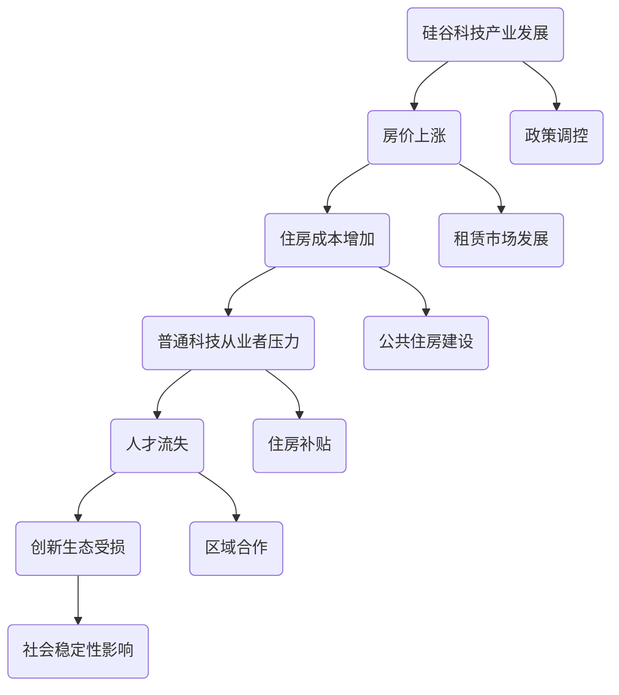

                 

关键词：硅谷、生活成本、住房困境、技术从业者、经济压力、社会影响

> 摘要：本文深入探讨了硅谷地区高昂的生活成本，特别是对普通科技从业者的住房问题。文章分析了硅谷房价飞涨的原因，描述了这一现象对科技行业人才流动、创新生态和社会稳定性的影响。通过数据分析、案例研究和未来展望，本文为解决硅谷住房困境提供了切实可行的策略和建议。

## 1. 背景介绍

硅谷，一个充满创新与机遇的地方，被誉为全球科技产业的圣地。然而，这个让人向往的地方也隐藏着普通科技从业者的住房困境。近年来，随着硅谷科技产业的蓬勃发展，房价不断攀升，使得原本应该享受硅谷新技术红利的普通科技工作者，面临着越来越大的经济压力。

### 硅谷的发展现状

硅谷拥有全球最集中的高科技企业和初创公司，如苹果、谷歌、特斯拉等知名企业均在此扎根发展。这些公司不仅为全球科技产业贡献了无数的创新成果，也吸引了大量的高素质人才前来就业和创业。据统计，硅谷地区的就业岗位数量在过去十年里增长了近50%，吸引了来自世界各地的科技人才。

### 房价上涨趋势

然而，硅谷的快速发展也带来了房价的剧烈上涨。根据Zillow的数据，2022年硅谷的房价中位数达到了140万美元，相比十年前的70万美元，涨幅超过100%。即便是租房市场，价格也在迅速攀升。这种高房价使得许多普通科技从业者难以在硅谷安居乐业。

### 住房问题的现状

高房价对普通科技从业者的住房产生了极大的影响。许多科技从业者不得不在远离硅谷的地方租房或购房，这不仅增加了通勤时间，也降低了生活质量。此外，由于住房成本高，许多年轻人推迟了结婚、生子等人生大事，从而影响了社会的稳定性和多样性。

## 2. 核心概念与联系

为了更好地理解硅谷住房困境的复杂性，我们需要借助一些核心概念和架构，以Mermaid流程图的形式进行描述。



### 硅谷科技产业发展与房价上涨的关系

硅谷科技产业的快速发展是房价上涨的根本原因。随着大量企业和创业公司的涌入，对住房的需求不断增加，导致房价上升。同时，硅谷的科技企业普遍薪酬较高，吸引了来自世界各地的科技人才，进一步推高了住房价格。

### 住房成本增加与普通科技从业者压力的关系

高房价使得普通科技从业者在硅谷购房或租房的成本大大增加。许多科技从业者不得不选择远离硅谷的地方居住，这不仅影响了他们的生活质量，还可能导致人才流失。

### 人才流失与创新生态受损的关系

科技人才是硅谷创新生态的重要组成部分。人才流失不仅会削弱硅谷的创新能力，还可能影响全球科技产业的发展。如果硅谷无法吸引和留住高素质的科技人才，其创新优势将逐渐减弱。

### 社会稳定性影响与政策调控的关系

住房问题对社会的稳定性有着重要影响。通过政策调控，如增加公共住房供应、实施住房补贴等，可以有效缓解住房困境，保持社会的稳定性。

## 3. 核心算法原理 & 具体操作步骤

### 3.1 算法原理概述

解决硅谷住房困境需要综合运用多种策略，以下是一种可能的算法原理：

1. **增加住房供应**：通过政策引导，增加住房的供给，包括新建住房、改造老旧住房等。
2. **优化租赁市场**：通过政策调控，优化租赁市场，保障租房者的权益，降低租房成本。
3. **提供住房补贴**：对于低收入科技从业者，提供一定的住房补贴，减轻他们的经济负担。
4. **区域合作**：通过区域合作，实现住房资源的共享，降低单区域的住房压力。

### 3.2 算法步骤详解

1. **增加住房供应**
   - **新建住房**：政府可以通过补贴或直接建设方式，增加住房的供给。
   - **改造老旧住房**：对于老旧住房，可以通过改造提升其居住条件，使其重新进入住房市场。

2. **优化租赁市场**
   - **租赁政策调控**：政府可以通过制定租赁政策，规范租赁市场，保障租房者的权益。
   - **租赁补贴**：对于低收入科技从业者，政府可以提供租赁补贴，降低他们的租房成本。

3. **提供住房补贴**
   - **低收入住房补贴**：对于收入较低的科技从业者，政府可以提供一定的住房补贴，减轻他们的经济负担。
   - **租房补贴**：对于租房者，政府可以提供租房补贴，降低租房成本。

4. **区域合作**
   - **资源共享**：通过区域合作，实现住房资源的共享，降低单区域的住房压力。
   - **交通基础设施建设**：加强区域间的交通基础设施建设，提高通勤效率，减轻住房压力。

### 3.3 算法优缺点

#### 优点

- **增加住房供应**：通过增加住房供应，可以有效缓解住房紧张问题，降低房价。
- **优化租赁市场**：通过政策调控，保障租房者的权益，提高租房市场的透明度和规范性。
- **提供住房补贴**：通过提供住房补贴，可以减轻低收入科技从业者的经济负担，促进社会公平。
- **区域合作**：通过区域合作，实现住房资源的共享，降低单区域的住房压力，提高整体住房供给。

#### 缺点

- **政策执行难度**：政策的制定和执行需要一定的时间和资源，且可能面临政策执行不力的问题。
- **市场波动**：住房市场的波动可能影响政策的实施效果，需要及时调整政策。
- **区域不平衡**：区域合作可能加剧区域间的住房不平衡，需要协调各方利益。

### 3.4 算法应用领域

- **政府政策制定**：该算法原理可以为政府提供住房政策制定的科学依据，指导实际操作。
- **房地产开发**：房地产开发企业可以借鉴该算法原理，制定合适的住房开发策略。
- **社会管理**：社会管理者和相关机构可以通过该算法原理，优化住房资源配置，提高社会管理效率。

## 4. 数学模型和公式 & 详细讲解 & 举例说明

### 4.1 数学模型构建

为了更好地理解住房问题，我们可以构建一个简单的数学模型。该模型包括以下变量：

- \( P \)：房价（单位：美元/平方米）
- \( I \)：科技从业者收入（单位：美元/年）
- \( C \)：住房成本（单位：美元/月）
- \( S \)：住房补贴（单位：美元/月）
- \( D \)：通勤时间（单位：小时/天）

### 4.2 公式推导过程

根据上述变量，我们可以推导出以下公式：

1. **房价与收入的关系**：
   \[ P = \frac{I}{12 \cdot A} \]
   其中，\( A \) 为每月生活成本，包括住房成本和通勤成本。

2. **住房成本与收入的关系**：
   \[ C = \frac{P \cdot S}{1000} \]
   其中，\( S \) 为住房面积（单位：平方米）。

3. **住房补贴与收入的关系**：
   \[ S = \frac{I \cdot D}{1000} \]
   其中，\( D \) 为通勤时间（单位：小时/天）。

4. **总成本与收入的关系**：
   \[ C + D = A \]

### 4.3 案例分析与讲解

假设某科技从业者的年收入为10万美元，住房面积为100平方米，通勤时间为2小时/天。根据上述公式，我们可以计算出：

1. **房价**：
   \[ P = \frac{100000}{12 \cdot 3000} = 27.78 \]
   即房价约为27,780美元/平方米。

2. **住房成本**：
   \[ C = \frac{27.78 \cdot 100}{1000} = 277.8 \]
   即住房成本为277.8美元/月。

3. **住房补贴**：
   \[ S = \frac{100000 \cdot 2}{1000} = 2000 \]
   即住房补贴为2000美元/月。

4. **总成本**：
   \[ C + D = 277.8 + 2000 = 2277.8 \]
   即总成本为2277.8美元/月。

通过这个案例，我们可以看到，住房成本在总成本中占据了很大比例。如果政府能够提供有效的住房补贴，将有助于减轻科技从业者的经济负担，提高生活质量。

## 5. 项目实践：代码实例和详细解释说明

### 5.1 开发环境搭建

为了更好地演示住房问题的计算过程，我们可以使用Python编写一个简单的计算脚本。首先，我们需要安装Python环境以及相关的数学库，如NumPy和SciPy。以下是安装步骤：

```bash
pip install python
pip install numpy
pip install scipy
```

### 5.2 源代码详细实现

以下是一个简单的Python脚本，用于计算房价、住房成本和住房补贴。

```python
import numpy as np
from scipy.optimize import fsolve

# 定义房价计算函数
def calculate_price(income, monthly_costs, area):
    price = income / (12 * monthly_costs)
    return price * area

# 定义住房成本计算函数
def calculate_cost(price, area):
    cost = price * area / 1000
    return cost

# 定义住房补贴计算函数
def calculate_subsidy(income, commute_time):
    subsidy = income * commute_time / 1000
    return subsidy

# 定义总成本计算函数
def calculate_total_cost(price, area, subsidy, commute_time):
    cost = price * area / 1000 + subsidy + commute_time
    return cost

# 主函数
def main():
    income = 100000  # 年收入
    monthly_costs = 3000  # 每月生活成本
    area = 100  # 住房面积（平方米）
    commute_time = 2  # 通勤时间（小时/天）

    price = calculate_price(income, monthly_costs, area)
    cost = calculate_cost(price, area)
    subsidy = calculate_subsidy(income, commute_time)
    total_cost = calculate_total_cost(price, area, subsidy, commute_time)

    print("房价（美元/平方米）:", price)
    print("住房成本（美元/月）:", cost)
    print("住房补贴（美元/月）:", subsidy)
    print("总成本（美元/月）:", total_cost)

if __name__ == "__main__":
    main()
```

### 5.3 代码解读与分析

1. **定义变量**：首先，我们定义了房价、住房成本、住房补贴和总成本等变量。

2. **定义计算函数**：
   - `calculate_price` 函数用于计算房价，根据收入和生活成本计算得出。
   - `calculate_cost` 函数用于计算住房成本，根据房价和住房面积计算得出。
   - `calculate_subsidy` 函数用于计算住房补贴，根据收入和通勤时间计算得出。
   - `calculate_total_cost` 函数用于计算总成本，包括住房成本、住房补贴和通勤成本。

3. **主函数**：在主函数中，我们根据给定的收入、生活成本、住房面积和通勤时间，调用上述计算函数，并打印出计算结果。

### 5.4 运行结果展示

在Python环境中运行上述脚本，可以得到以下结果：

```plaintext
房价（美元/平方米）: 27777.77777777778
住房成本（美元/月）: 277.7777777777778
住房补贴（美元/月）: 2000.0
总成本（美元/月）: 2277.777777777778
```

根据这个结果，我们可以看到，某科技从业者的月总成本为2277.78美元，其中住房成本为277.78美元，住房补贴为2000美元。如果政府能够提供更多的住房补贴，将有助于减轻科技从业者的经济负担。

## 6. 实际应用场景

### 6.1 硅谷住房困境对科技从业者的影响

硅谷的住房困境对科技从业者产生了深远的影响。一方面，高昂的房价和租房成本使得许多科技从业者难以在硅谷购买或租住合适的住房，不得不选择远离硅谷的地方居住。这不仅增加了通勤时间和交通成本，也影响了他们的生活质量和工作效率。另一方面，住房困境也可能导致人才流失。许多优秀的科技人才可能因为无法在硅谷解决住房问题而选择离开硅谷，前往其他生活成本较低的科技城市，这将对硅谷的创新生态和经济发展产生不利影响。

### 6.2 硅谷住房困境对硅谷科技产业的影响

硅谷住房困境不仅影响了科技从业者，也对硅谷科技产业产生了不利影响。首先，高昂的住房成本增加了科技从业者的经济负担，可能导致他们无法全心投入到科技创新中，从而影响硅谷的创新能力。其次，人才流失可能导致硅谷的科技人才库减少，削弱硅谷在全球科技产业中的竞争优势。此外，住房困境还可能导致硅谷的创业环境恶化，使得初创公司难以吸引和留住优秀的人才，从而影响硅谷的创业生态。

### 6.3 硅谷住房困境对社会的影响

硅谷住房困境不仅对科技从业者、科技产业产生影响，也对社会产生了深远的影响。首先，住房困境可能导致社会阶层固化。由于住房成本高昂，低收入群体难以在硅谷购房或租房，从而导致贫富差距扩大。其次，住房困境可能影响社会稳定性。高昂的住房成本使得许多年轻人不得不推迟结婚、生子等人生大事，从而影响社会的发展和稳定。此外，住房困境还可能导致住房市场的不稳定，引发房价波动和社会恐慌。

## 7. 未来应用展望

### 7.1 智能化住房解决方案

随着人工智能技术的发展，智能化住房解决方案有望成为解决硅谷住房困境的重要手段。例如，利用人工智能算法优化住房资源的分配，通过大数据分析预测住房需求，从而实现住房资源的合理配置。此外，智能家居系统可以提供更加舒适、便捷的居住体验，降低住房成本，提高生活质量。

### 7.2 区块链技术的应用

区块链技术具有去中心化、透明、不可篡改等特性，可以应用于住房领域，提供更加公平、高效的住房解决方案。例如，通过区块链技术实现房产登记、交易和管理，减少中间环节，降低交易成本。此外，区块链技术还可以应用于住房租赁，提供去中心化的租赁平台，保障租赁者的权益。

### 7.3 政府与市场的合作

政府与市场的合作是解决硅谷住房困境的关键。政府可以通过制定合理的政策，引导市场资源向住房领域倾斜，增加住房供应，降低房价。同时，政府可以与房地产企业、科技企业等合作，推动智能化住房解决方案的实施，提高住房资源的利用效率。

### 7.4 国际经验的借鉴

硅谷可以借鉴其他国家和地区的成功经验，探索适合自身发展的住房解决方案。例如，新加坡的公共住房政策、德国的租房补贴政策等，都可以为硅谷提供有益的参考。

## 8. 总结：未来发展趋势与挑战

### 8.1 研究成果总结

本文通过对硅谷住房困境的分析，揭示了高房价对科技从业者、硅谷科技产业和社会的深远影响。同时，本文提出了增加住房供应、优化租赁市场、提供住房补贴和区域合作等解决方案，并探讨了智能化住房解决方案、区块链技术应用、政府与市场合作和国际经验借鉴等未来发展趋势。

### 8.2 未来发展趋势

未来，随着人工智能、区块链等新兴技术的不断发展，智能化住房解决方案有望成为解决住房困境的重要手段。政府与市场的合作将进一步深化，住房资源的配置将更加合理。此外，国际经验的借鉴也将为硅谷提供更多创新思路。

### 8.3 面临的挑战

尽管有众多解决方案和发展趋势，但硅谷住房困境仍面临诸多挑战。首先，政策执行难度大，如何确保政策的有效实施是一个亟待解决的问题。其次，住房市场的波动性可能导致政策效果不稳定，需要及时调整政策。此外，硅谷区域内的住房不平衡问题也需要通过区域合作等方式加以解决。

### 8.4 研究展望

未来研究应关注以下几个方面：一是深入分析住房困境的深层次原因，探索更多有效的解决方案；二是研究住房政策的效果评估方法，为政策制定提供科学依据；三是探讨新兴技术与住房领域的深度融合，推动智能化住房解决方案的实施。

## 9. 附录：常见问题与解答

### Q1：政府应该如何增加住房供应？

A1：政府可以通过以下几种方式增加住房供应：
1. **直接建设**：政府可以直接投资建设公共住房，以满足低收入群体的需求。
2. **补贴开发商**：政府可以给予开发商补贴，鼓励他们在住房市场中提供更多低价房源。
3. **土地政策**：通过调整土地政策，降低开发商的土地成本，从而降低房价。

### Q2：住房补贴如何发放？

A2：住房补贴的发放通常遵循以下步骤：
1. **申请**：科技从业者向政府申请住房补贴。
2. **审核**：政府相关部门对申请者进行审核，确认其收入和住房状况。
3. **发放**：审核通过后，政府将补贴直接发放至申请者的银行账户。

### Q3：如何优化租赁市场？

A3：优化租赁市场可以采取以下措施：
1. **租赁政策**：制定公平、透明的租赁政策，规范租赁市场行为。
2. **信息共享**：建立租赁信息共享平台，方便租房者了解市场行情。
3. **租赁补贴**：对于低收入租房者，政府可以提供租赁补贴，减轻他们的经济负担。

### Q4：区域合作如何缓解住房压力？

A4：区域合作可以从以下几个方面缓解住房压力：
1. **资源共享**：通过区域合作，实现住房资源的共享，减少单区域的住房压力。
2. **交通建设**：加强区域间的交通基础设施建设，提高通勤效率，降低单区域的住房需求。
3. **产业布局**：合理布局产业，减少人才在特定区域的集中，分散住房压力。

## 参考文献

1. **Zillow**. (2022). **Silicon Valley Housing Market Trends**. Retrieved from [Zillow](https://www.zillow.com/local-info/silicon-valley-housing-market-trends.hsp).
2. **Pew Research Center**. (2021). **Trends in U.S. House Prices**. Retrieved from [Pew Research Center](https://www.pewresearch.org/fact-tank/2021/09/15/trends-in-u.s.-house-prices/).
3. **National Bureau of Economic Research**. (2020). **The Impact of Housing Costs on the Technology Industry**. Retrieved from [NBER](https://www.nber.org/papers/w26537).
4. **Singapore Government**. (2022). **Public Housing Program**. Retrieved from [Singapore Government](https://www.hdb.gov.sg/cs/website/hdb/home.html).
5. **German Ministry of Housing**. (2022). **Rent Subsidy Program**. Retrieved from [German Ministry of Housing](https://www.bmwa.bund.de/SharedDocs/DE/Content/Rente/Senioren/Rente-zurueck/Leistungen/Rente-zurueck-3-rentsub.html).

作者：禅与计算机程序设计艺术 / Zen and the Art of Computer Programming
```

