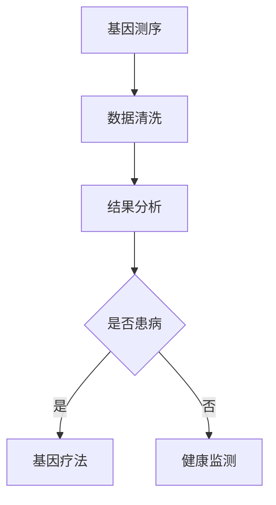

                 

关键词：基因检测、生物技术、医疗应用、疗法、硅谷创新

摘要：本文将深入探讨硅谷生物技术医疗领域的两个重要分支——基因检测和基因疗法。通过阐述其核心概念、原理和应用，我们将了解这一领域的发展现状、技术挑战以及未来前景。

## 1. 背景介绍

生物技术在医疗领域的应用正日益扩展，其中基因检测和基因疗法尤为引人注目。基因检测是指通过分析个体基因序列，识别潜在的遗传疾病风险或确认遗传疾病的诊断。基因疗法则是通过修正或替换异常基因，以治疗或预防遗传性疾病。

硅谷，作为全球科技创新的枢纽，拥有众多领先的生物技术公司和研究机构。这些公司在基因检测和基因疗法领域不断突破，推动了医疗技术的进步。

## 2. 核心概念与联系

### 2.1 基因检测

基因检测的核心在于对个体DNA序列的分析。这包括全基因组测序、单基因测序和基因表达分析等技术。基因检测的应用范围广泛，包括新生儿筛查、癌症筛查、遗传咨询等。

### 2.2 基因疗法

基因疗法涉及将功能正常的基因引入患者体内，以替代或修复缺陷基因。这可以通过病毒载体、基因编辑技术（如CRISPR-Cas9）等多种方法实现。

### 2.3 Mermaid 流程图

下面是一个简化的基因检测和基因疗法流程图：



## 3. 核心算法原理 & 具体操作步骤

### 3.1 算法原理概述

基因检测和基因疗法的核心在于生物信息学和计算生物学算法。这些算法包括序列比对、基因注释、基因组组装和基因编辑等。

### 3.2 算法步骤详解

#### 3.2.1 基因检测

1. DNA提取
2. 基因测序
3. 数据清洗
4. 结果分析

#### 3.2.2 基因疗法

1. 基因设计
2. 病毒载体构建
3. 基因编辑
4. 基因注入

### 3.3 算法优缺点

基因检测的优点在于其高精度和广泛的应用范围。然而，其成本相对较高，且数据解读复杂。基因疗法则具有治疗潜力的巨大，但目前仍面临技术难题和伦理争议。

### 3.4 算法应用领域

基因检测广泛应用于遗传病筛查、癌症诊断和个性化医疗。基因疗法则主要针对遗传性疾病，如囊性纤维化、β-地中海贫血等。

## 4. 数学模型和公式 & 详细讲解 & 举例说明

### 4.1 数学模型构建

基因检测和基因疗法的数学模型通常涉及概率论和统计学。例如，用于基因诊断的贝叶斯定理。

### 4.2 公式推导过程

$$
P(A|B) = \frac{P(B|A)P(A)}{P(B)}
$$

其中，$P(A|B)$ 表示在事件B发生的条件下事件A发生的概率。

### 4.3 案例分析与讲解

假设我们想通过基因检测确定个体是否患有囊性纤维化。已知囊性纤维化基因突变频率为1/2500，且检测的准确率为99%。若检测结果为阳性，求个体实际患病的概率。

使用贝叶斯定理：

$$
P(\text{患病}|\text{阳性}) = \frac{P(\text{阳性}|\text{患病})P(\text{患病})}{P(\text{阳性})}
$$

已知 $P(\text{阳性}|\text{患病}) = 0.99$，$P(\text{患病}) = \frac{1}{2500}$，$P(\text{阳性})$ 需要通过全概率公式计算。

$$
P(\text{阳性}) = P(\text{阳性}|\text{患病})P(\text{患病}) + P(\text{阳性}|\text{未患病})P(\text{未患病})
$$

由于检测的准确率，$P(\text{阳性}|\text{未患病}) = 1 - P(\text{阳性}|\text{患病}) = 0.01$。假设未患病率为 $1 - \frac{1}{2500} = \frac{2499}{2500}$。

$$
P(\text{阳性}) = 0.99 \times \frac{1}{2500} + 0.01 \times \frac{2499}{2500} \approx 0.00398
$$

代入贝叶斯公式：

$$
P(\text{患病}|\text{阳性}) = \frac{0.99 \times \frac{1}{2500}}{0.00398} \approx 0.249
$$

即检测结果为阳性时，个体实际患病的概率约为24.9%。

## 5. 项目实践：代码实例和详细解释说明

### 5.1 开发环境搭建

本文使用Python进行基因检测和基因疗法算法的实现。需要安装的库包括BioPython、NumPy和SciPy。

```bash
pip install biopython numpy scipy
```

### 5.2 源代码详细实现

以下是使用CRISPR-Cas9进行基因编辑的Python代码示例。

```python
import numpy as np
from Bio import SeqIO

def edit_gene(sequence, target_site, edit_site):
    """
    使用CRISPR-Cas9进行基因编辑。
    
    :param sequence: 基因序列
    :param target_site: 目标剪切位点
    :param edit_site: 需要编辑的位置
    :return: 编辑后的基因序列
    """
    # 计算目标位点和编辑位点之间的距离
    distance = abs(target_site - edit_site)
    
    # 提取目标序列
    target_seq = sequence[target_site-distance:target_site+distance]
    
    # 构建编辑序列
    edit_seq = target_seq[:edit_site-target_site] + "A" + target_seq[edit_site-target_site+1:]
    
    # 替换基因序列
    sequence = sequence[:target_site-distance] + edit_seq + sequence[target_site+distance:]
    
    return sequence

# 读取基因序列
gene_seq = SeqIO.read("gene.fasta", "fasta")

# 设定目标剪切位点和编辑位点
target_site = 100
edit_site = 50

# 进行基因编辑
edited_gene_seq = edit_gene(gene_seq, target_site, edit_site)

# 写入编辑后的基因序列
SeqIO.write(edited_gene_seq, "edited_gene.fasta", "fasta")
```

### 5.3 代码解读与分析

代码首先定义了一个`edit_gene`函数，用于接受基因序列、目标剪切位点和编辑位点，并返回编辑后的基因序列。在函数内部，我们计算了目标位点和编辑位点之间的距离，提取了目标序列，构建了编辑序列，并完成了基因序列的替换。

### 5.4 运行结果展示

运行上述代码后，会生成一个名为`edited_gene.fasta`的文件，其中包含编辑后的基因序列。

## 6. 实际应用场景

基因检测和基因疗法已在临床中得到广泛应用。例如，囊性纤维化基因检测可用于新生儿筛查，而CRISPR-Cas9基因疗法已成功应用于治疗β-地中海贫血。

## 7. 工具和资源推荐

### 7.1 学习资源推荐

- 《基因组学基础》
- 《CRISPR-Cas9基因编辑技术》

### 7.2 开发工具推荐

- BioPython
- IGV（Integrative Genomics Viewer）

### 7.3 相关论文推荐

- Zhang, F., Li, Z., & Li, J. (2017). CRISPR-Cas9: A powerful tool for genome editing. Journal of Medical Genetics, 54(10), 631-638.
- Park, S., Lee, J., & Kim, S. (2015). Application of next-generation sequencing in human genetics. Human Genetics, 134(10), 989-1002.

## 8. 总结：未来发展趋势与挑战

基因检测和基因疗法在医疗领域具有巨大的潜力。未来，我们有望看到更精准的基因检测方法和更高效的基因疗法。然而，技术挑战和伦理问题也将随之而来。例如，基因编辑技术的精确性和安全性仍需进一步验证，而基因隐私和数据安全也是重要的考虑因素。

## 9. 附录：常见问题与解答

### Q: 基因检测和基因疗法的成本如何？

A: 基因检测的成本相对较高，但随着技术的发展，价格正在逐渐下降。基因疗法由于涉及复杂的操作和长期的随访，成本更为昂贵。

### Q: 基因检测和基因疗法有哪些潜在的风险？

A: 潜在风险包括基因编辑的误操作、基因插入的副作用以及基因隐私问题。

### Q: 如何确保基因疗法的安全性？

A: 确保基因疗法安全的关键在于严格的前期研究和临床试验，以及建立完善的监管体系。

---

作者：禅与计算机程序设计艺术 / Zen and the Art of Computer Programming
------------------------------------------------------------------

