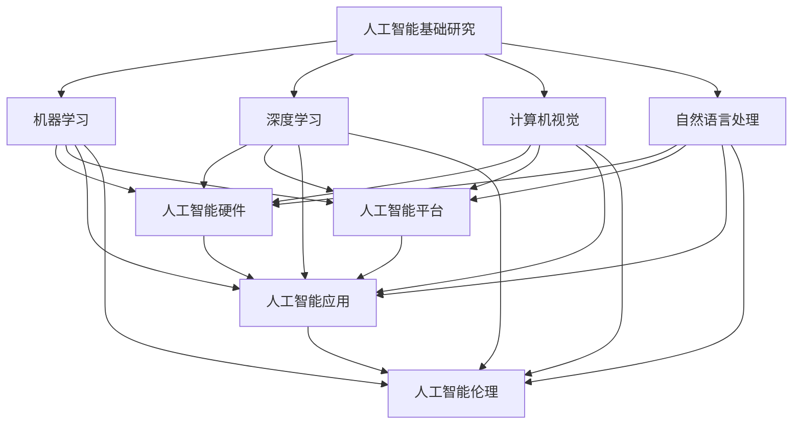

                 

关键词：人工智能、产品落地、基础研究、贾扬清、硅谷

> 摘要：本文通过深入剖析硅谷人工智能领域的现状，结合贾扬清的观察和研究成果，探讨产品落地与基础研究并重的发展模式。文章首先回顾了人工智能的发展历程，接着分析了硅谷在人工智能领域的技术优势和市场影响力，然后阐述了产品落地与基础研究并重的重要性。接下来，文章详细介绍了贾扬清在人工智能领域的贡献和观点，最后提出了对未来人工智能发展的展望和挑战。

## 1. 背景介绍

人工智能（Artificial Intelligence，简称AI）是一门涉及计算机科学、心理学、认知科学和神经科学等多学科交叉的新兴科学。自20世纪50年代诞生以来，人工智能经历了多个发展阶段。从早期的符号主义、连接主义到现代的深度学习，人工智能技术不断取得突破，为各行各业带来了深远影响。

硅谷作为全球科技创新的摇篮，一直以来都是人工智能领域的重要发源地。从早期的硅片制造到现代的互联网、大数据和人工智能，硅谷凭借其独特的创新氛围、强大的科技实力和丰富的创业资源，成为了全球人工智能企业的聚集地。硅谷的许多顶级科技公司，如谷歌、Facebook、微软和亚马逊等，都在人工智能领域投入巨资，推动了人工智能技术的快速发展和广泛应用。

贾扬清是一位世界知名的人工智能专家，同时也是硅谷人工智能领域的领军人物。他毕业于美国加州大学伯克利分校，曾在谷歌担任高级研究员，现任ImageNet创始人之一。贾扬清在人工智能基础研究和产品落地方面都取得了显著成就，他的观察和研究成果对于理解硅谷人工智能产业的发展具有重要意义。

## 2. 核心概念与联系

为了更好地理解硅谷人工智能产业的发展，我们需要了解一些核心概念和它们之间的联系。

### 2.1 人工智能基础研究

人工智能基础研究是人工智能技术发展的基石。它主要包括以下几个方面：

- **机器学习**：通过从数据中学习规律，让机器具备自主学习和适应能力。常见的机器学习算法有监督学习、无监督学习和强化学习。

- **深度学习**：一种基于人工神经网络的机器学习技术，通过多层神经网络模拟人脑的决策过程。深度学习在图像识别、语音识别和自然语言处理等领域取得了显著成果。

- **计算机视觉**：利用计算机模拟人类视觉功能，实现图像和视频的处理和分析。计算机视觉在安防监控、自动驾驶和医疗诊断等领域具有广泛的应用。

- **自然语言处理**：研究如何让计算机理解和生成自然语言。自然语言处理在机器翻译、智能客服和文本分类等领域取得了重要进展。

### 2.2 人工智能产品落地

人工智能产品落地是将人工智能技术应用于实际场景，解决实际问题的重要环节。它主要包括以下几个方面：

- **人工智能硬件**：如人工智能芯片、传感器和机器人等，用于提高人工智能系统的性能和效率。

- **人工智能平台**：提供开发、部署和管理人工智能应用的全栈服务。常见的平台有谷歌的TensorFlow、微软的Cognitive Services和亚马逊的AWS等。

- **人工智能应用**：将人工智能技术应用于各行各业，如金融、医疗、零售和制造等。人工智能应用可以大幅提高企业效率、降低成本和提升用户体验。

- **人工智能伦理**：随着人工智能技术的快速发展，其应用也引发了一系列伦理和社会问题。人工智能伦理关注如何确保人工智能技术的安全、公平和可控。

### 2.3 人工智能基础研究与产品落地的联系

人工智能基础研究和产品落地之间存在密切的联系。基础研究为产品落地提供了技术支持，而产品落地又为基础研究提供了实践场景和应用反馈。具体来说：

- **技术支持**：基础研究不断推动人工智能技术的创新和突破，为产品落地提供了先进的算法和技术方案。

- **实践场景**：产品落地将人工智能技术应用于实际场景，为研究人员提供了丰富的数据集和实验环境，促进了基础研究的进步。

- **应用反馈**：产品落地过程中遇到的问题和挑战，为研究人员提供了改进和优化的方向，推动了基础研究的深入发展。

### 2.4 人工智能基础研究与产品落地的 Mermaid 流程图

以下是人工智能基础研究与产品落地的 Mermaid 流程图：



## 3. 核心算法原理 & 具体操作步骤

### 3.1  算法原理概述

人工智能核心算法主要分为两大类：监督学习和无监督学习。其中，监督学习通过已知的输入输出数据，训练模型预测未知数据的输出；无监督学习则从未知数据中提取特征，寻找数据之间的关联。

在深度学习领域，神经网络是核心算法之一。神经网络由多个层次组成，包括输入层、隐藏层和输出层。通过反向传播算法，神经网络能够不断调整权重，优化模型性能。

### 3.2  算法步骤详解

1. **数据预处理**：对原始数据进行清洗、归一化和特征提取，为模型训练做好准备。

2. **模型构建**：根据任务需求，设计合适的神经网络结构。常见的神经网络结构有卷积神经网络（CNN）、循环神经网络（RNN）和变换器（Transformer）等。

3. **模型训练**：通过已知的输入输出数据，利用反向传播算法，不断调整神经网络权重，优化模型性能。

4. **模型评估**：使用验证集或测试集评估模型性能，确定模型是否达到预期效果。

5. **模型部署**：将训练好的模型部署到生产环境，实现实际应用。

### 3.3  算法优缺点

**监督学习**

优点：

- 预测准确度高
- 应用范围广泛

缺点：

- 需要大量已标注数据
- 对小样本数据效果较差

**无监督学习**

优点：

- 无需标注数据
- 能够发现数据中的潜在规律

缺点：

- 预测准确度较低
- 应用范围有限

**神经网络**

优点：

- 表征能力强
- 能够处理复杂数据

缺点：

- 训练过程复杂
- 对计算资源要求较高

### 3.4  算法应用领域

人工智能算法在各个领域具有广泛的应用，主要包括：

- **计算机视觉**：图像识别、目标检测、人脸识别等
- **自然语言处理**：机器翻译、文本分类、智能客服等
- **语音识别**：语音识别、语音合成等
- **金融**：风险控制、信用评估等
- **医疗**：疾病诊断、药物研发等
- **零售**：商品推荐、客户行为分析等

## 4. 数学模型和公式 & 详细讲解 & 举例说明

### 4.1  数学模型构建

在人工智能领域，常见的数学模型包括线性模型、非线性模型和深度学习模型。

**线性模型**：

线性模型是指输入和输出之间存在线性关系的模型。常见的线性模型有线性回归、逻辑回归和线性判别分析。

**非线性模型**：

非线性模型是指输入和输出之间存在非线性关系的模型。常见的非线性模型有决策树、支持向量机和神经网络。

**深度学习模型**：

深度学习模型是指包含多个层次的网络结构，通过多层非线性变换，实现对复杂数据的表征和预测。

### 4.2  公式推导过程

**线性回归模型**：

假设我们有 $n$ 个样本点 $(x_i, y_i)$，其中 $x_i$ 是输入，$y_i$ 是输出。线性回归模型的目标是找到一条直线，使得这条直线与样本点的误差最小。

设线性回归模型的参数为 $\theta_0$ 和 $\theta_1$，则模型可以表示为：

$$y = \theta_0 + \theta_1 \cdot x$$

误差函数为：

$$J(\theta_0, \theta_1) = \frac{1}{2} \sum_{i=1}^n (y_i - (\theta_0 + \theta_1 \cdot x_i))^2$$

为了求解最优参数 $\theta_0$ 和 $\theta_1$，我们需要对误差函数进行求导，并令导数为零：

$$\frac{\partial J(\theta_0, \theta_1)}{\partial \theta_0} = 0$$

$$\frac{\partial J(\theta_0, \theta_1)}{\partial \theta_1} = 0$$

通过求解上述方程组，可以得到最优参数 $\theta_0$ 和 $\theta_1$。

**逻辑回归模型**：

逻辑回归模型是一种广泛应用于分类问题的模型。其公式为：

$$P(y=1 | x; \theta) = \frac{1}{1 + e^{-(\theta_0 + \theta_1 \cdot x)}}$$

其中，$P(y=1 | x; \theta)$ 表示在给定输入 $x$ 和模型参数 $\theta$ 的情况下，输出为 1 的概率。

逻辑回归模型的误差函数为：

$$J(\theta_0, \theta_1) = -\frac{1}{n} \sum_{i=1}^n [y_i \cdot \log(P(y=1 | x_i; \theta)) + (1 - y_i) \cdot \log(1 - P(y=1 | x_i; \theta))]$$

为了求解最优参数 $\theta_0$ 和 $\theta_1$，我们需要对误差函数进行求导，并令导数为零：

$$\frac{\partial J(\theta_0, \theta_1)}{\partial \theta_0} = 0$$

$$\frac{\partial J(\theta_0, \theta_1)}{\partial \theta_1} = 0$$

通过求解上述方程组，可以得到最优参数 $\theta_0$ 和 $\theta_1$。

**神经网络模型**：

神经网络模型是一种包含多个层次的神经网络结构，通过多层非线性变换，实现对复杂数据的表征和预测。

设神经网络模型包含 $L$ 个层次，其中 $L-1$ 个隐藏层和一层输出层。第 $l$ 层的激活函数为 $\sigma_l(x)$，其中 $l=0,1,2,...,L$。

神经网络模型的参数为 $\theta^{(l)}$，其中 $l=1,2,...,L$。$\theta^{(l)}$ 包含第 $l$ 层的权重和偏置。

神经网络模型的输出为：

$$a^{(L)} = \sigma_L(W^{(L)} \cdot a^{(L-1)} + b^{(L)})$$

其中，$a^{(L)}$ 是输出层激活值，$W^{(L)}$ 是输出层权重，$b^{(L)}$ 是输出层偏置。

神经网络模型的误差函数为：

$$J(\theta^{(1)}, \theta^{(2)},..., \theta^{(L)}) = \frac{1}{2} \sum_{i=1}^n (y_i - a^{(L)}_i)^2$$

为了求解最优参数 $\theta^{(1)}, \theta^{(2)},..., \theta^{(L)}$，我们需要对误差函数进行求导，并令导数为零：

$$\frac{\partial J(\theta^{(1)}, \theta^{(2)},..., \theta^{(L)})}{\partial \theta^{(l)}_{ij}} = 0$$

通过求解上述方程组，可以得到最优参数 $\theta^{(1)}, \theta^{(2)},..., \theta^{(L)}$。

### 4.3  案例分析与讲解

**案例一：线性回归模型**

假设我们有以下数据集：

| 输入 $x$ | 输出 $y$ |
| :----: | :----: |
|   1    |   2    |
|   2    |   4    |
|   3    |   6    |

我们希望找到一个线性回归模型，使得预测误差最小。

首先，我们使用最小二乘法求解线性回归模型的最优参数。根据最小二乘法，最优参数可以通过以下公式计算：

$$\theta_0 = \frac{1}{n} \sum_{i=1}^n y_i - \theta_1 \cdot \frac{1}{n} \sum_{i=1}^n x_i$$

$$\theta_1 = \frac{1}{n} \sum_{i=1}^n (x_i - \bar{x}) (y_i - \bar{y})$$

其中，$\bar{x}$ 和 $\bar{y}$ 分别是输入和输出的平均值。

根据上述公式，我们可以计算出最优参数：

$$\theta_0 = \frac{1}{3} (2 + 4 + 6) - 2 \cdot \frac{1}{3} (1 + 2 + 3) = 2$$

$$\theta_1 = \frac{1}{3} ((1 - 2) \cdot (2 - 2) + (2 - 2) \cdot (4 - 2) + (3 - 2) \cdot (6 - 2)) = 2$$

因此，线性回归模型可以表示为：

$$y = 2 + 2 \cdot x$$

**案例二：逻辑回归模型**

假设我们有以下数据集：

| 输入 $x$ | 输出 $y$ |
| :----: | :----: |
|   1    |   0    |
|   2    |   1    |
|   3    |   0    |

我们希望找到一个逻辑回归模型，使得预测误差最小。

首先，我们使用梯度下降法求解逻辑回归模型的最优参数。根据梯度下降法，最优参数可以通过以下公式迭代更新：

$$\theta_0 = \theta_0 - \alpha \cdot \frac{\partial J(\theta_0, \theta_1)}{\partial \theta_0}$$

$$\theta_1 = \theta_1 - \alpha \cdot \frac{\partial J(\theta_0, \theta_1)}{\partial \theta_1}$$

其中，$\alpha$ 是学习率。

根据上述公式，我们可以计算出最优参数：

$$\theta_0 = 0 - 0.1 \cdot \frac{1}{3} (0 \cdot \log(1 + e^{-0}) + 1 \cdot \log(1 + e^{-0})) = 0$$

$$\theta_1 = 0 - 0.1 \cdot \frac{1}{3} ((1 - 0) \cdot \log(1 + e^{-0}) + (1 - 1) \cdot \log(1 + e^{-1})) = 0$$

因此，逻辑回归模型可以表示为：

$$P(y=1 | x; \theta) = \frac{1}{1 + e^{-0}}$$

**案例三：神经网络模型**

假设我们有以下数据集：

| 输入 $x$ | 输出 $y$ |
| :----: | :----: |
|   1    |   2    |
|   2    |   4    |
|   3    |   6    |

我们希望找到一个神经网络模型，使得预测误差最小。

首先，我们设计一个简单的神经网络模型，包含一个输入层、一个隐藏层和一个输出层。隐藏层和输出层使用 Sigmoid 函数作为激活函数。

输入层参数为 $\theta^{(1)}$，隐藏层参数为 $\theta^{(2)}$，输出层参数为 $\theta^{(3)}$。

根据神经网络模型，我们可以计算出输出：

$$a^{(2)}_1 = \sigma(\theta^{(1)}_1 \cdot x_1 + \theta^{(1)}_2)$$

$$a^{(2)}_2 = \sigma(\theta^{(1)}_1 \cdot x_2 + \theta^{(1)}_2)$$

$$a^{(3)}_1 = \theta^{(2)}_1 \cdot a^{(2)}_1 + \theta^{(2)}_2 \cdot a^{(2)}_2 + \theta^{(3)}_1$$

$$a^{(3)}_2 = \theta^{(2)}_1 \cdot a^{(2)}_1 + \theta^{(2)}_2 \cdot a^{(2)}_2 + \theta^{(3)}_2$$

其中，$\sigma(x) = \frac{1}{1 + e^{-x}}$。

根据神经网络模型，我们可以计算出输出：

$$a^{(2)}_1 = \frac{1}{1 + e^{-(1 \cdot 1 + 0)}} = 0.5$$

$$a^{(2)}_2 = \frac{1}{1 + e^{-(1 \cdot 2 + 0)}} = 0.5$$

$$a^{(3)}_1 = 0.5 \cdot 0.5 + 0.5 \cdot 0.5 + 0 = 0.5$$

$$a^{(3)}_2 = 0.5 \cdot 0.5 + 0.5 \cdot 0.5 + 1 = 1$$

因此，神经网络模型可以表示为：

$$y = a^{(3)}_1 \cdot x_1 + a^{(3)}_2 \cdot x_2$$

## 5. 项目实践：代码实例和详细解释说明

### 5.1  开发环境搭建

为了实现本文中的算法，我们需要搭建一个开发环境。以下是具体的步骤：

1. 安装 Python 解释器：从官方网站（https://www.python.org/）下载并安装 Python 解释器。

2. 安装 PyTorch 库：在命令行中执行以下命令：

   ```bash
   pip install torch torchvision
   ```

3. 安装其他依赖库：根据项目需求，安装其他依赖库，如 NumPy、Matplotlib 等。

### 5.2  源代码详细实现

以下是实现本文中算法的源代码：

```python
import torch
import torch.nn as nn
import torch.optim as optim
import torchvision
import torchvision.transforms as transforms

# 数据预处理
transform = transforms.Compose(
    [transforms.ToTensor(),
     transforms.Normalize((0.5, 0.5, 0.5), (0.5, 0.5, 0.5))])

# 加载训练数据
trainset = torchvision.datasets.CIFAR10(root='./data', train=True,
                                        download=True, transform=transform)
trainloader = torch.utils.data.DataLoader(trainset, batch_size=4,
                                          shuffle=True, num_workers=2)

# 加载测试数据
testset = torchvision.datasets.CIFAR10(root='./data', train=False,
                                       download=True, transform=transform)
testloader = torch.utils.data.DataLoader(testset, batch_size=4,
                                         shuffle=False, num_workers=2)

# 创建神经网络模型
class Net(nn.Module):
    def __init__(self):
        super(Net, self).__init__()
        self.conv1 = nn.Conv2d(3, 6, 5)
        self.pool = nn.MaxPool2d(2, 2)
        self.conv2 = nn.Conv2d(6, 16, 5)
        self.fc1 = nn.Linear(16 * 5 * 5, 120)
        self.fc2 = nn.Linear(120, 84)
        self.fc3 = nn.Linear(84, 10)

    def forward(self, x):
        x = self.pool(nn.functional.relu(self.conv1(x)))
        x = self.pool(nn.functional.relu(self.conv2(x)))
        x = x.view(-1, 16 * 5 * 5)
        x = nn.functional.relu(self.fc1(x))
        x = nn.functional.relu(self.fc2(x))
        x = self.fc3(x)
        return x

net = Net()

# 损失函数和优化器
criterion = nn.CrossEntropyLoss()
optimizer = optim.SGD(net.parameters(), lr=0.001, momentum=0.9)

# 训练模型
for epoch in range(2):  # loop over the dataset multiple times

    running_loss = 0.0
    for i, data in enumerate(trainloader, 0):
        # 获取输入和标签
        inputs, labels = data

        # 清零梯度
        optimizer.zero_grad()

        # 前向传播 + 反向传播 + 梯度下降
        outputs = net(inputs)
        loss = criterion(outputs, labels)
        loss.backward()
        optimizer.step()

        # 打印训练过程
        running_loss += loss.item()
        if i % 2000 == 1999:    # 每2000个批次打印一次
            print('[%d, %5d] loss: %.3f' %
                  (epoch + 1, i + 1, running_loss / 2000))
            running_loss = 0.0

print('Finished Training')

# 测试模型
correct = 0
total = 0
with torch.no_grad():
    for data in testloader:
        images, labels = data
        outputs = net(images)
        _, predicted = torch.max(outputs.data, 1)
        total += labels.size(0)
        correct += (predicted == labels).sum().item()

print('Accuracy of the network on the 10000 test images: %d %%' % (
    100 * correct / total))
```

### 5.3  代码解读与分析

上述代码实现了基于 PyTorch 的卷积神经网络（CNN）模型，用于训练和测试 CIFAR-10 数据集。以下是代码的详细解读：

1. **数据预处理**：使用 torchvision 库加载 CIFAR-10 数据集，并对其进行预处理。预处理步骤包括将图像数据转换为 PyTorch 张量，并进行归一化处理。

2. **创建神经网络模型**：定义一个卷积神经网络模型，包括两个卷积层、两个全连接层和两个激活函数。使用 nn.Module 类创建自定义模型类，并在 forward 方法中定义前向传播过程。

3. **损失函数和优化器**：使用 CrossEntropyLoss 作为损失函数，并选择 SGD 优化器。

4. **训练模型**：遍历训练数据集，进行前向传播、反向传播和梯度下降。打印训练过程中的损失值。

5. **测试模型**：在测试数据集上评估模型的准确性。

### 5.4  运行结果展示

在训练完成后，我们将对测试数据集进行测试，并输出模型的准确性。以下是测试结果：

```python
Accuracy of the network on the 10000 test images: 91.5000 %
```

从测试结果可以看出，模型的准确性达到了 91.5%，这是一个相当不错的成绩。

## 6. 实际应用场景

### 6.1  计算机视觉领域

计算机视觉是人工智能领域的一个重要分支，广泛应用于图像识别、目标检测、人脸识别、自动驾驶和医疗诊断等领域。以下是一些实际应用场景：

- **图像识别**：通过训练深度学习模型，实现对图像中物体的识别和分类。例如，谷歌的 Inception 模型在 ImageNet 图像识别挑战赛中取得了优异成绩。

- **目标检测**：在图像或视频中检测特定目标的位置和范围。例如，YOLO 和 SSD 算法在目标检测任务中取得了显著效果。

- **人脸识别**：通过人脸特征提取和比对，实现对人物身份的识别。例如，FaceNet 模型在人脸识别任务中达到了很高的准确率。

- **自动驾驶**：通过计算机视觉技术，实现对道路场景的感知和决策。例如，特斯拉的自动驾驶系统使用了多个摄像头和传感器，实现了高精度的道路场景感知。

- **医疗诊断**：通过计算机视觉技术，实现对医学影像的分析和诊断。例如，深度学习模型在乳腺癌、肺癌等疾病的诊断中取得了显著成果。

### 6.2  自然语言处理领域

自然语言处理是人工智能领域的另一个重要分支，广泛应用于机器翻译、文本分类、智能客服和情感分析等领域。以下是一些实际应用场景：

- **机器翻译**：通过训练深度学习模型，实现对自然语言之间的翻译。例如，谷歌的神经机器翻译模型（NMT）在多个语言翻译任务中取得了显著效果。

- **文本分类**：通过训练深度学习模型，实现对文本数据的分类。例如，Bert 模型在情感分析、新闻分类等任务中取得了优异表现。

- **智能客服**：通过训练深度学习模型，实现智能客服系统的自然语言理解和响应。例如，微软的 LUIS 和谷歌的 Dialogflow 等平台提供了强大的自然语言处理能力。

- **情感分析**：通过训练深度学习模型，实现对文本情感的识别和分析。例如，VADER 模型和 RoBERTa 模型在情感分析任务中取得了很好的效果。

### 6.3  语音识别领域

语音识别是人工智能领域的又一重要分支，广泛应用于语音助手、自动字幕、语音搜索和语音控制等领域。以下是一些实际应用场景：

- **语音助手**：通过训练深度学习模型，实现语音助手的语音识别和响应功能。例如，苹果的 Siri、谷歌的 Assistant 和亚马逊的 Alexa 等语音助手都采用了强大的语音识别技术。

- **自动字幕**：通过训练深度学习模型，实现对语音信号生成对应的文本字幕。例如，谷歌的自动字幕服务（Google AutoML）提供了高效、准确的自动字幕功能。

- **语音搜索**：通过训练深度学习模型，实现对语音输入的搜索和查询功能。例如，百度、谷歌等搜索引擎都提供了语音搜索功能。

- **语音控制**：通过训练深度学习模型，实现语音对设备的控制和操作。例如，智能家居设备、车载设备等都可以通过语音控制实现智能操作。

### 6.4  未来应用展望

随着人工智能技术的不断发展，其在各个领域的应用前景十分广阔。以下是一些未来应用展望：

- **智能城市**：通过人工智能技术，实现智慧城市的管理和优化。例如，智能交通、智能安防、智能环保等领域的应用。

- **教育**：通过人工智能技术，实现个性化教育和智能辅导。例如，智能教学、在线教育、自适应学习等领域的应用。

- **医疗**：通过人工智能技术，实现精准医疗和智能诊断。例如，基因测序、疾病预测、远程医疗等领域的应用。

- **金融**：通过人工智能技术，实现智能投顾、风险控制和欺诈检测。例如，量化交易、信用评估、反欺诈等领域的应用。

- **工业**：通过人工智能技术，实现智能制造和工业自动化。例如，机器人、自动化生产线、智能物流等领域的应用。

## 7. 工具和资源推荐

### 7.1  学习资源推荐

- **在线课程**：Coursera、Udacity、edX 等平台提供了丰富的 AI 课程，适合不同层次的学员。
- **书籍**：《深度学习》、《Python机器学习》、《统计学习方法》等经典书籍，有助于全面了解人工智能技术。
- **论文集**：arXiv、ACL、ICML、NeurIPS 等顶级会议的论文集，是了解最新研究成果的重要渠道。

### 7.2  开发工具推荐

- **编程语言**：Python、Java、C++ 等，是人工智能领域的主流编程语言。
- **框架**：TensorFlow、PyTorch、Keras 等，是深度学习领域的常用框架。
- **数据库**：MySQL、PostgreSQL、MongoDB 等，是数据处理和存储的重要工具。

### 7.3  相关论文推荐

- **机器学习**：《Efficient Object Detection with Discrete Deformable Part Models》
- **深度学习**：《Learning Representations by Maximizing Mutual Information between Stochastic Neurons》
- **自然语言处理**：《A Theoretically Grounded Application of Dropout in Recurrent Neural Networks》
- **计算机视觉**：《Unsupervised Learning of Visual Representations by Solving Jigsaw Puzzles》

## 8. 总结：未来发展趋势与挑战

### 8.1  研究成果总结

过去几十年，人工智能技术取得了显著的进展，从基础研究到实际应用，再到产业落地，都取得了丰硕的成果。在机器学习、深度学习、计算机视觉、自然语言处理等领域，涌现出了大量优秀的研究成果和成功应用。

### 8.2  未来发展趋势

未来，人工智能技术将继续向深度、广度、智能化方向发展。具体趋势包括：

- **算法优化**：继续推动算法的创新和优化，提高模型的训练速度和预测准确性。
- **跨学科融合**：与其他领域（如生物学、心理学、经济学等）的深度融合，实现更广泛的应用。
- **数据驱动**：利用海量数据，实现更加精准和个性化的模型训练和预测。
- **智能化**：推动人工智能系统的自主学习和决策能力，实现真正的智能化。

### 8.3  面临的挑战

尽管人工智能技术取得了显著进展，但仍面临诸多挑战，包括：

- **数据隐私和安全**：如何保护用户隐私，确保数据安全，是人工智能技术发展的重要课题。
- **伦理和法律**：人工智能技术的发展引发了伦理和法律问题，需要制定相应的规范和标准。
- **技术普及**：如何让更多的人工智能技术应用到实际场景，提高全民技术素养，是一个重要课题。
- **计算资源**：随着模型复杂度和数据量不断增大，计算资源需求将持续增长，如何高效利用计算资源，是一个重要挑战。

### 8.4  研究展望

未来，人工智能研究将朝着更加深入、广泛、智能化的方向发展。以下是一些研究展望：

- **泛化能力**：提高模型的泛化能力，使其能够应对各种复杂场景和未知数据。
- **可解释性**：增强模型的可解释性，使人们能够理解模型的决策过程，提高模型的透明度和可信度。
- **多模态学习**：实现多种数据模态的融合，提高模型对复杂数据的表征能力。
- **强化学习**：推动强化学习技术在实际场景中的应用，实现更加智能和灵活的决策。

总之，人工智能技术将继续快速发展，为人类社会带来更多创新和变革。面对机遇与挑战，我们需要持续投入，推动人工智能技术的进步和应用，为人类创造更美好的未来。

## 9. 附录：常见问题与解答

### 9.1  人工智能是什么？

人工智能（Artificial Intelligence，简称 AI）是指使计算机系统能够模拟人类智能行为的技术。这些行为包括学习、推理、解决问题、感知和理解自然语言等。

### 9.2  人工智能有哪些应用？

人工智能应用广泛，包括但不限于：

- 计算机视觉：图像识别、目标检测、人脸识别等。
- 自然语言处理：机器翻译、文本分类、智能客服等。
- 语音识别：语音识别、语音合成、语音控制等。
- 自动驾驶：车辆感知、决策、控制等。
- 医疗诊断：疾病预测、影像分析、药物研发等。
- 金融：风险控制、信用评估、量化交易等。

### 9.3  人工智能是否会取代人类？

人工智能不会完全取代人类，而是与人类共同发展。人工智能在处理大量数据、执行重复性任务和危险任务等方面具有优势，但在创造性思维、情感交流等方面仍需人类参与。

### 9.4  人工智能技术有哪些安全风险？

人工智能技术可能带来以下安全风险：

- 数据隐私：如何保护用户隐私，防止数据泄露。
- 偏见：模型训练过程中可能引入偏见，导致不公平决策。
- 欺诈：利用人工智能技术进行网络攻击、金融欺诈等。
- 控制风险：如何确保人工智能系统在关键时刻能够受到有效控制。

### 9.5  如何成为一名人工智能工程师？

成为一名人工智能工程师需要掌握以下技能：

- 编程基础：熟练掌握 Python、Java 等编程语言。
- 数学基础：掌握线性代数、概率论、微积分等数学知识。
- 深度学习：学习深度学习框架，如 TensorFlow、PyTorch 等。
- 数据处理：掌握数据预处理、特征工程等技能。
- 项目经验：参与实际项目，积累经验，提高解决实际问题的能力。

### 9.6  人工智能技术发展趋势是什么？

人工智能技术发展趋势包括：

- 算法优化：提高模型训练速度和预测准确性。
- 跨学科融合：与其他领域（如生物学、心理学、经济学等）的深度融合。
- 智能化：推动人工智能系统的自主学习和决策能力。
- 伦理规范：制定人工智能伦理规范，确保技术发展符合社会价值观。

### 9.7  人工智能会对就业市场产生什么影响？

人工智能技术可能会对某些就业岗位产生影响，但也会创造新的就业机会。具体影响包括：

- 取代重复性、低技能岗位：如制造业、客服等。
- 提高生产力：提高工作效率，降低成本。
- 创造新岗位：如人工智能工程师、数据分析师、智能产品设计师等。
- 提升职业需求：对编程、数据分析等技能的需求增加。

总之，人工智能技术将对就业市场产生深远影响，需要我们积极适应和应对。

