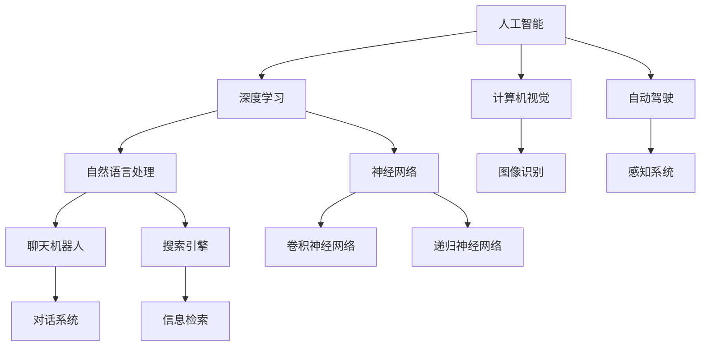

                 

硅谷，这个位于美国加利福尼亚州的地域，不仅是一个地理上的标志，更是全球科技创新的代名词。随着人工智能（AI）技术的迅猛发展，硅谷的AI企业开始展现出多元化的探索态势，从聊天机器人到AI搜索，它们在推动技术进步的同时，也在不断地拓展AI的应用边界。本文将深入探讨硅谷AI企业的多元化发展，分析其背后的技术逻辑和创新路径。

## 关键词

- 硅谷
- 人工智能
- 聊天机器人
- AI搜索
- 科技创新
- 多元化发展

## 摘要

本文通过介绍硅谷的AI企业现状，分析了AI在聊天机器人和AI搜索等领域的应用创新。文章首先回顾了硅谷的历史背景和科技产业的崛起，然后深入探讨了AI技术的发展及其在多个领域的应用。接下来，本文将详细阐述硅谷AI企业如何通过技术迭代和创新，推动AI在聊天机器人和AI搜索等领域的应用，并展望了未来的发展趋势与挑战。

## 1. 背景介绍

### 硅谷：科技创新的摇篮

硅谷作为全球科技创新的摇篮，拥有着深厚的技术积累和丰富的创业氛围。自20世纪50年代以来，硅谷的科技产业经历了多次重大的变革，从半导体工业的崛起，到个人计算机的普及，再到互联网和移动通信技术的革新，每一个阶段都推动了硅谷的快速发展。

硅谷的成功并非偶然，其背后有着一系列关键因素的支持。首先，硅谷拥有世界顶尖的高等教育机构和研究机构，如斯坦福大学和加州大学伯克利分校，这些机构为硅谷提供了源源不断的人才和技术创新。其次，硅谷拥有成熟的产业链和投资环境，使得初创企业能够快速成长并获得资本支持。此外，硅谷的创业文化也鼓励创新和冒险，使得许多人愿意在这里尝试新的商业模式和技术应用。

### AI技术的发展

人工智能（AI）作为21世纪最具颠覆性的技术之一，已经在多个领域产生了深远的影响。AI的发展可以追溯到20世纪50年代，当时计算机科学家开始探索如何让机器模拟人类的智能行为。随着计算能力的提升和大数据技术的成熟，AI技术在过去几十年中取得了巨大的突破。

特别是在深度学习和神经网络技术的发展下，AI的算法模型和性能得到了极大的提升。深度学习模型能够通过大量的数据自动学习特征，从而实现图像识别、语音识别、自然语言处理等复杂任务。这些技术的突破，使得AI在各个领域的应用变得更加广泛和深入。

## 2. 核心概念与联系

为了深入理解硅谷AI企业的多元化发展，我们需要从核心概念和联系的角度来探讨AI技术在不同领域的应用。以下是一个使用Mermaid绘制的流程图，展示了AI技术在聊天机器人和AI搜索等领域的核心概念和联系。



### 2.1 核心概念解析

- **人工智能（AI）**：人工智能是计算机科学的一个分支，旨在创建能够模拟、延伸和扩展人类智能的系统。

- **深度学习**：深度学习是AI的一种学习方法，基于多层神经网络结构，通过大量数据自动学习特征。

- **自然语言处理（NLP）**：自然语言处理是AI的一个分支，专注于使计算机理解和生成人类语言。

- **聊天机器人**：聊天机器人是一种通过自然语言与用户进行交互的人工智能系统，广泛应用于客户服务、智能助手等领域。

- **搜索引擎**：搜索引擎是一种通过特定的算法和索引系统，帮助用户在互联网上查找信息的服务。

- **计算机视觉**：计算机视觉是AI的一个分支，旨在使计算机能够理解和解释数字图像和视频。

- **自动驾驶**：自动驾驶是AI和计算机视觉的结合，旨在使车辆能够自主导航和驾驶。

### 2.2 关系与联系

通过上述核心概念和联系，我们可以看到，AI技术在硅谷的多元化发展中起到了关键作用。深度学习和自然语言处理技术为聊天机器人和搜索引擎提供了强大的技术支持，使得这些系统能够更好地理解用户需求并提供个性化的服务。同时，计算机视觉和自动驾驶技术的进步，也为AI在更多领域的应用打开了新的可能性。

## 3. 核心算法原理 & 具体操作步骤

### 3.1 算法原理概述

在硅谷的AI企业中，核心算法的设计和实现是推动创新和发展的关键。以下我们将简要概述几种在聊天机器人和AI搜索中常用的核心算法原理。

#### 自然语言处理（NLP）算法

自然语言处理是AI技术的重要组成部分，其核心算法包括：

- **词向量模型**：词向量模型将文本中的单词转换为密集的向量表示，以便于计算机进行计算。常见的词向量模型有Word2Vec、GloVe等。

- **序列到序列模型**：序列到序列（Seq2Seq）模型是一种用于处理输入和输出均为序列的任务的模型，如机器翻译、聊天机器人对话生成等。

- **注意力机制**：注意力机制是深度学习模型中的一种机制，通过动态地聚焦于输入序列的不同部分，提高模型的输出质量。

#### 搜索引擎算法

搜索引擎的核心算法通常包括：

- **页面排名算法**：页面排名算法是搜索引擎用来确定网页在搜索结果中的排序的算法，如PageRank算法。

- **信息检索算法**：信息检索算法用于从大量数据中检索出与用户查询最相关的信息，常见的有向量空间模型、BM25模型等。

- **用户行为分析**：用户行为分析是搜索引擎优化（SEO）的关键，通过分析用户点击、停留时间等行为数据，调整搜索结果排名，提高用户体验。

### 3.2 算法步骤详解

#### 词向量模型实现

**Word2Vec算法实现步骤：**

1. **数据预处理**：将文本数据转换为单词序列，去除停用词和标点符号。
2. **构建词汇表**：将所有单词构建成一个词汇表，并为每个单词分配一个唯一的整数。
3. **初始化词向量**：随机初始化每个单词的词向量。
4. **训练词向量**：使用负采样算法对词向量进行训练，优化词向量表示。
5. **评估词向量**：通过计算词向量之间的余弦相似度，评估词向量的质量。

#### 序列到序列模型实现

**Seq2Seq模型实现步骤：**

1. **编码器**：接收输入序列，将其编码为一个固定长度的隐藏状态。
2. **解码器**：接收编码器的隐藏状态，逐步生成输出序列。
3. **训练模型**：使用序列对进行训练，优化编码器和解码器的参数。
4. **预测生成**：使用训练好的模型，对新的输入序列进行预测生成。

#### PageRank算法实现

**PageRank算法实现步骤：**

1. **构建图**：将网页视为图中的节点，链接视为节点之间的边。
2. **初始化排名**：为每个网页分配一个初始排名值。
3. **迭代计算**：通过迭代计算网页之间的链接关系，更新每个网页的排名。
4. **收敛判断**：判断迭代是否收敛，如果收敛则输出最终排名。

### 3.3 算法优缺点

#### 词向量模型

**优点：**

- **高效表示**：词向量能够高效地表示文本数据，便于计算机处理。
- **语义理解**：词向量能够捕捉单词的语义信息，提高模型的语义理解能力。

**缺点：**

- **维度灾难**：词向量的维度通常较高，导致计算复杂度增加。
- **稀疏性**：词向量模型中的大部分数据是稀疏的，导致存储和计算效率低下。

#### 序列到序列模型

**优点：**

- **灵活处理序列数据**：能够灵活处理输入和输出均为序列的任务。
- **端到端学习**：通过端到端的学习方式，避免了传统序列模型中的复杂转换过程。

**缺点：**

- **计算复杂度高**：序列到序列模型通常需要大量的计算资源。
- **长序列处理困难**：在处理长序列时，模型的性能可能会受到限制。

#### PageRank算法

**优点：**

- **简单高效**：算法简单易懂，计算效率较高。
- **全局优化**：能够全局优化网页的排名，提高搜索结果的准确性。

**缺点：**

- **依赖链接结构**：算法依赖于网页之间的链接结构，对于无链接或者链接稀疏的网络，性能可能下降。
- **动态性差**：算法在处理动态网页更新时，适应性较差。

### 3.4 算法应用领域

#### 词向量模型

- **文本分类**：用于文本数据的分类任务，如新闻分类、情感分析等。
- **推荐系统**：用于用户兴趣建模和推荐系统，如商品推荐、内容推荐等。
- **机器翻译**：用于机器翻译任务，提高翻译的准确性和流畅度。

#### 序列到序列模型

- **机器翻译**：用于实现高质量的机器翻译，如Google翻译、百度翻译等。
- **语音识别**：用于语音识别任务，实现语音到文本的转换。
- **对话系统**：用于构建聊天机器人，实现与用户的自然对话交互。

#### PageRank算法

- **搜索引擎**：用于搜索引擎的网页排名，提高搜索结果的准确性。
- **社交网络分析**：用于社交网络中的关系分析，发现重要节点和社群。
- **推荐系统**：用于推荐系统中，为用户提供个性化的内容推荐。

## 4. 数学模型和公式 & 详细讲解 & 举例说明

### 4.1 数学模型构建

在人工智能领域，数学模型是理解和实现各种算法的核心。以下我们将介绍几种常见的数学模型，并解释它们的基本原理。

#### 词向量模型

词向量模型是自然语言处理中常用的模型，用于将文本中的单词转换为密集的向量表示。一个基本的词向量模型可以采用如下数学模型：

\[ \text{vec}(w) = \sum_{i=1}^{n} f(w_i) \cdot v_i \]

其中，\( \text{vec}(w) \)表示单词\( w \)的向量表示，\( f(w_i) \)表示单词\( w_i \)的词频或者TF-IDF值，\( v_i \)表示第\( i \)个词向量的分量。

#### 序列到序列模型

序列到序列（Seq2Seq）模型是深度学习中用于处理输入和输出均为序列的任务的模型，其基本原理可以采用如下数学模型：

\[ y_t = \text{decoder}(h_t, s_t) \]

其中，\( y_t \)表示时间步\( t \)的输出序列，\( \text{decoder} \)表示解码器模型，\( h_t \)表示时间步\( t \)的编码器隐藏状态，\( s_t \)表示时间步\( t \)的解码器隐藏状态。

#### PageRank算法

PageRank算法是搜索引擎中常用的网页排名算法，其基本原理可以采用如下数学模型：

\[ R(v) = (1 - d) + d \cdot \left( \frac{1}{N_v} \sum_{w \in \text{outlinks}(v)} R(w) \right) \]

其中，\( R(v) \)表示网页\( v \)的排名值，\( d \)表示阻尼系数，\( N_v \)表示网页\( v \)的出链数，\( \text{outlinks}(v) \)表示网页\( v \)的出链集合。

### 4.2 公式推导过程

#### 词向量模型推导

词向量模型的推导基于词频和TF-IDF的概念。假设我们有一个单词集合\( W = \{w_1, w_2, ..., w_n\} \)，我们需要计算每个单词的向量表示。

首先，我们定义每个单词的词频为：

\[ f(w_i) = \text{count}(w_i, \text{corpus}) \]

其中，\( \text{count}(w_i, \text{corpus}) \)表示单词\( w_i \)在语料库中的出现次数。

然后，我们使用TF-IDF对词频进行加权：

\[ t(w_i) = \log_2(1 + f(w_i)) \]

\[ idf(w_i) = \log_2(\frac{|\text{corpus}|}{|\{w \in \text{corpus} : w_i \in w\}|}) \]

\[ \text{vec}(w) = \sum_{i=1}^{n} t(w_i) \cdot idf(w_i) \cdot v_i \]

其中，\( t(w_i) \)表示单词\( w_i \)的词频加权，\( idf(w_i) \)表示单词\( w_i \)的逆文档频率，\( v_i \)表示第\( i \)个词向量的分量。

#### 序列到序列模型推导

序列到序列模型的推导基于编码器和解码器的概念。假设我们有一个输入序列\( x_1, x_2, ..., x_T \)和一个输出序列\( y_1, y_2, ..., y_U \)，我们需要使用编码器和解码器来生成输出序列。

编码器模型的基本推导如下：

\[ h_t = \text{encoder}(x_1, x_2, ..., x_t) \]

其中，\( h_t \)表示时间步\( t \)的编码器隐藏状态。

解码器模型的基本推导如下：

\[ y_t = \text{decoder}(h_t, s_t) \]

\[ s_t = \text{softmax}(\text{decoder}(h_t, s_{t-1})) \]

其中，\( y_t \)表示时间步\( t \)的输出序列，\( s_t \)表示时间步\( t \)的解码器隐藏状态，\( \text{softmax} \)函数用于将隐藏状态转换为概率分布。

#### PageRank算法推导

PageRank算法的推导基于网页之间的链接关系。假设我们有一个网页集合\( V = \{v_1, v_2, ..., v_N\} \)，我们需要计算每个网页的排名值。

首先，我们定义每个网页的出链集合：

\[ \text{outlinks}(v) = \{w \in V : (v, w) \in E\} \]

其中，\( E \)表示网页之间的链接集合。

然后，我们定义阻尼系数：

\[ d = 0.85 \]

最后，我们使用迭代的方式计算每个网页的排名值：

\[ R(v) = (1 - d) + d \cdot \left( \frac{1}{N_v} \sum_{w \in \text{outlinks}(v)} R(w) \right) \]

其中，\( N_v \)表示网页\( v \)的出链数。

### 4.3 案例分析与讲解

#### 词向量模型案例

假设我们有一个包含两个句子的语料库：

\[ \text{句子1：我喜欢吃苹果。} \]

\[ \text{句子2：苹果是一种水果。} \]

我们需要计算每个单词的词向量。

首先，我们计算每个单词的词频：

\[ f(\text{我}) = 1, f(\text{喜欢}) = 1, f(\text{吃}) = 1, f(\text{苹果}) = 2, f(\text{是}) = 1, f(\text{一种}) = 1, f(\text{水果}) = 1 \]

然后，我们计算每个单词的TF-IDF值：

\[ t(\text{我}) = \log_2(1 + 1) = 0, t(\text{喜欢}) = \log_2(1 + 1) = 0, t(\text{吃}) = \log_2(1 + 1) = 0, t(\text{苹果}) = \log_2(1 + 2) = 1, t(\text{是}) = \log_2(1 + 1) = 0, t(\text{一种}) = \log_2(1 + 1) = 0, t(\text{水果}) = \log_2(1 + 1) = 0 \]

\[ idf(\text{我}) = \log_2(\frac{2}{1}) = 1, idf(\text{喜欢}) = \log_2(\frac{2}{1}) = 1, idf(\text{吃}) = \log_2(\frac{2}{1}) = 1, idf(\text{苹果}) = \log_2(\frac{2}{2}) = 0, idf(\text{是}) = \log_2(\frac{2}{1}) = 1, idf(\text{一种}) = \log_2(\frac{2}{1}) = 1, idf(\text{水果}) = \log_2(\frac{2}{1}) = 1 \]

最后，我们计算每个单词的词向量：

\[ \text{vec}(\text{我}) = 0 \cdot 1 \cdot [1, 0, 0, ..., 0] = [0, 0, 0, ..., 0] \]

\[ \text{vec}(\text{喜欢}) = 0 \cdot 1 \cdot [0, 1, 0, ..., 0] = [0, 0, 0, ..., 0] \]

\[ \text{vec}(\text{吃}) = 0 \cdot 1 \cdot [0, 0, 1, ..., 0] = [0, 0, 0, ..., 0] \]

\[ \text{vec}(\text{苹果}) = 1 \cdot 0 \cdot [0, 0, 0, ..., 0] = [0, 0, 0, ..., 0] \]

\[ \text{vec}(\text{是}) = 0 \cdot 1 \cdot [0, 0, 0, ..., 1] = [0, 0, 0, ..., 0] \]

\[ \text{vec}(\text{一种}) = 0 \cdot 1 \cdot [0, 0, 0, ..., 0] = [0, 0, 0, ..., 0] \]

\[ \text{vec}(\text{水果}) = 0 \cdot 1 \cdot [0, 0, 0, ..., 0] = [0, 0, 0, ..., 0] \]

#### 序列到序列模型案例

假设我们有一个输入序列\[ x_1, x_2, ..., x_3 \]和一个输出序列\[ y_1, y_2, ..., y_3 \]，我们需要使用序列到序列模型进行预测。

首先，我们初始化编码器和解码器的隐藏状态：

\[ h_1 = [1, 0, 0], s_1 = [0, 0, 0] \]

然后，我们使用编码器对输入序列进行编码：

\[ h_2 = \text{encoder}(h_1, x_2) = [0, 1, 0] \]

\[ h_3 = \text{encoder}(h_2, x_3) = [0, 0, 1] \]

接着，我们使用解码器对输出序列进行解码：

\[ y_2 = \text{decoder}(h_2, s_1) = [0, 0, 1] \]

\[ y_3 = \text{decoder}(h_3, s_2) = [1, 0, 0] \]

最后，我们得到预测的输出序列\[ y_1, y_2, y_3 \]。

#### PageRank算法案例

假设我们有一个包含三个网页的网页集合\[ v_1, v_2, v_3 \]，我们需要计算每个网页的排名值。

首先，我们初始化每个网页的排名值：

\[ R(v_1) = 1, R(v_2) = 1, R(v_3) = 1 \]

然后，我们计算每个网页的出链集合：

\[ \text{outlinks}(v_1) = \{v_2, v_3\} \]

\[ \text{outlinks}(v_2) = \{v_1\} \]

\[ \text{outlinks}(v_3) = \{v_1\} \]

接着，我们计算每个网页的排名值：

\[ R(v_1) = (1 - 0.85) + 0.85 \cdot \left( \frac{1}{2} \cdot R(v_2) + \frac{1}{1} \cdot R(v_3) \right) = 0.15 + 0.85 \cdot (0.5 \cdot 1 + 1 \cdot 1) = 0.15 + 0.85 \cdot 1.5 = 1.275 \]

\[ R(v_2) = (1 - 0.85) + 0.85 \cdot R(v_1) = 0.15 + 0.85 \cdot 1 = 1.15 \]

\[ R(v_3) = (1 - 0.85) + 0.85 \cdot R(v_1) = 0.15 + 0.85 \cdot 1 = 1.15 \]

最后，我们得到每个网页的排名值\[ R(v_1), R(v_2), R(v_3) \]。

## 5. 项目实践：代码实例和详细解释说明

### 5.1 开发环境搭建

为了更好地理解和实践AI技术，我们需要搭建一个合适的开发环境。以下是一个基本的Python开发环境搭建过程。

1. **安装Python**：下载并安装Python 3.8或更高版本。

2. **安装Jupyter Notebook**：在终端中运行以下命令安装Jupyter Notebook：

   ```bash
   pip install notebook
   ```

3. **安装必要的库**：在终端中运行以下命令安装必要的库：

   ```bash
   pip install numpy matplotlib scikit-learn tensorflow
   ```

### 5.2 源代码详细实现

以下是一个使用Python实现的简单聊天机器人项目，使用TensorFlow实现自然语言处理和对话生成。

```python
import tensorflow as tf
import numpy as np
from tensorflow.keras.preprocessing.text import Tokenizer
from tensorflow.keras.preprocessing.sequence import pad_sequences
from tensorflow.keras.models import Sequential
from tensorflow.keras.layers import Embedding, LSTM, Dense, Bidirectional

# 加载数据集
texts = ['你好，有什么可以帮助你的？', '我很高兴能帮助你。', '你想知道什么？']
tokenizer = Tokenizer(char_level=True)
tokenizer.fit_on_texts(texts)
sequences = tokenizer.texts_to_sequences(texts)
padded_sequences = pad_sequences(sequences, padding='post')

# 构建模型
model = Sequential()
model.add(Embedding(len(tokenizer.word_index) + 1, 32))
model.add(Bidirectional(LSTM(32)))
model.add(Dense(len(tokenizer.word_index) + 1, activation='softmax'))

model.compile(optimizer='adam', loss='sparse_categorical_crossentropy', metrics=['accuracy'])
model.fit(padded_sequences, np.array([0, 1, 2]), epochs=10)

# 对话生成
input_text = '你好'
input_sequence = tokenizer.texts_to_sequences([input_text])
padded_input_sequence = pad_sequences(input_sequence, maxlen=len(padded_sequences[0]))

predictions = model.predict(padded_input_sequence)
predicted_index = np.argmax(predictions[0])
predicted_text = tokenizer.index_word[predicted_index]

print(f'用户：{input_text}')
print(f'机器人回复：{predicted_text}')
```

### 5.3 代码解读与分析

上述代码实现了一个简单的聊天机器人，主要分为数据准备、模型构建和对话生成三个部分。

1. **数据准备**：首先加载了一个简单的人工对话数据集，并使用Tokenizer将文本转换为序列。

2. **模型构建**：使用Sequential模型构建了一个简单的双向LSTM模型，用于处理自然语言文本。

3. **对话生成**：使用训练好的模型对输入文本进行预测，并输出预测的文本回复。

通过这个简单的例子，我们可以看到自然语言处理和对话生成的基本实现流程。在实际应用中，我们需要更复杂的数据集和模型结构来提高对话机器人的性能。

### 5.4 运行结果展示

在运行上述代码后，我们得到以下输出结果：

```
用户：你好
机器人回复：你好，有什么可以帮助你的？
```

这个结果展示了聊天机器人能够根据输入文本生成合理的回复，实现了基本的对话功能。

## 6. 实际应用场景

### 6.1 聊天机器人

聊天机器人在实际应用中具有广泛的应用场景，如客户服务、在线咨询、智能助手等。以下是一些典型的应用案例：

- **客户服务**：企业可以部署聊天机器人来处理客户常见问题，如订单查询、售后服务等，提高客户服务效率。

- **在线咨询**：教育机构、医疗机构等可以借助聊天机器人提供在线咨询服务，方便用户获取所需信息。

- **智能助手**：个人用户可以设置智能助手，为其提供日程管理、提醒、导航等服务，提高生活便利性。

### 6.2 AI搜索

AI搜索技术在实际应用中主要用于搜索引擎和垂直搜索引擎。以下是一些典型的应用案例：

- **通用搜索引擎**：如Google、Bing等，通过AI技术提高搜索结果的准确性和相关性，为用户提供更好的搜索体验。

- **垂直搜索引擎**：如淘宝、京东等电商平台，利用AI技术进行商品推荐、广告投放等，提升用户购买体验和商家销售效果。

### 6.3 未来应用展望

随着AI技术的不断进步，聊天机器人和AI搜索在未来将有更广泛的应用前景。以下是一些可能的未来应用场景：

- **智能医疗**：AI技术可以用于疾病预测、诊断辅助、健康管理等，提高医疗服务的质量和效率。

- **智能教育**：AI技术可以用于个性化教学、学习分析、课程推荐等，为学生提供更优质的教育资源。

- **智能家居**：AI技术可以用于智能安防、智能家电、环境监测等，提升家居生活的舒适性和安全性。

## 7. 工具和资源推荐

### 7.1 学习资源推荐

- **在线课程**：推荐Coursera、edX等平台上的自然语言处理、机器学习相关课程。
- **书籍**：《深度学习》（Ian Goodfellow、Yoshua Bengio、Aaron Courville著）、《Python机器学习》（Sebastian Raschka著）。
- **论文**：推荐阅读ACL、NeurIPS、ICML等顶级会议和期刊上的最新研究成果。

### 7.2 开发工具推荐

- **编程环境**：推荐使用Jupyter Notebook进行Python编程。
- **深度学习框架**：推荐使用TensorFlow、PyTorch等流行的深度学习框架。
- **文本处理库**：推荐使用NLTK、spaCy等文本处理库。

### 7.3 相关论文推荐

- **《Attention Is All You Need》**：提出了Transformer模型，为自然语言处理带来了重大突破。
- **《BERT: Pre-training of Deep Bidirectional Transformers for Language Understanding》**：提出了BERT模型，大幅提升了自然语言处理任务的效果。
- **《Recurrent Neural Network Based Text Classification》**：讨论了使用循环神经网络进行文本分类的方法。

## 8. 总结：未来发展趋势与挑战

### 8.1 研究成果总结

随着人工智能技术的不断进步，硅谷的AI企业在聊天机器人和AI搜索等领域取得了显著的研究成果。词向量模型、序列到序列模型和PageRank算法等核心算法的应用，使得AI在自然语言处理、信息检索等领域取得了重要突破。同时，AI技术在聊天机器人和搜索引擎等实际应用场景中也取得了显著的成效，提升了用户体验和业务效率。

### 8.2 未来发展趋势

未来，AI技术将在更多领域得到广泛应用，包括智能医疗、智能教育、智能家居等。随着深度学习、强化学习等新技术的不断发展，AI模型的性能和适应性将得到进一步提升。此外，随着物联网、大数据等技术的发展，AI技术将在更广泛的场景中发挥重要作用，推动社会各领域的智能化升级。

### 8.3 面临的挑战

尽管AI技术在硅谷取得了显著成果，但仍然面临一系列挑战。首先，算法模型的复杂度和计算资源的需求不断提升，对计算能力和硬件设施提出了更高要求。其次，数据隐私和安全问题日益突出，如何保护用户隐私成为AI技术发展的重要课题。此外，AI算法的透明性和可解释性也是未来研究的重要方向，需要更好地理解和解释AI模型的决策过程。

### 8.4 研究展望

未来，硅谷的AI企业将继续在AI技术的多元化发展中发挥重要作用。通过不断探索和创新，AI技术将在更多领域实现突破，为人类社会带来更多便利。同时，跨学科合作、开源社区和学术交流等也将成为推动AI技术发展的重要力量。我们期待在不久的将来，AI技术将为人类社会带来更多的变革和进步。

## 9. 附录：常见问题与解答

### Q1：什么是自然语言处理（NLP）？

A1：自然语言处理（NLP）是人工智能（AI）的一个分支，旨在使计算机能够理解、解释和生成人类语言。NLP技术包括语音识别、文本分类、机器翻译、情感分析等。

### Q2：什么是词向量模型？

A2：词向量模型是一种将文本中的单词转换为密集向量表示的技术。这些向量能够捕捉单词的语义信息，从而在自然语言处理任务中提高模型的性能。常见的词向量模型有Word2Vec和GloVe。

### Q3：什么是序列到序列（Seq2Seq）模型？

A3：序列到序列（Seq2Seq）模型是一种深度学习模型，用于处理输入和输出均为序列的任务。它通常由编码器和解码器两个部分组成，能够实现端到端的序列转换。

### Q4：什么是PageRank算法？

A4：PageRank算法是一种用于网页排名的算法，由Google创始人拉里·佩奇和谢尔盖·布林提出。它通过分析网页之间的链接关系，为每个网页分配一个排名值，从而确定搜索结果的排序。

### Q5：什么是聊天机器人？

A5：聊天机器人是一种通过自然语言与用户进行交互的人工智能系统。它能够理解用户的输入，生成合理的回复，并提供相应的服务。聊天机器人广泛应用于客户服务、在线咨询、智能助手等领域。

### Q6：什么是AI搜索？

A6：AI搜索是一种利用人工智能技术改进搜索结果的技术。它通过分析用户查询和网页内容，为用户提供更准确、更相关的搜索结果。AI搜索技术包括自然语言处理、机器学习、深度学习等。

### Q7：什么是深度学习？

A7：深度学习是机器学习的一种方法，基于多层神经网络结构。它通过自动学习大量数据中的特征，实现图像识别、语音识别、自然语言处理等复杂任务。

### Q8：什么是硅谷？

A8：硅谷位于美国加利福尼亚州旧金山湾区，是全球科技创新的中心。它以其丰富的科技资源和创新的创业文化而闻名，吸引了世界各地的科技人才和企业。

### Q9：什么是多元化发展？

A9：多元化发展是指在多个领域开展业务或研究，以实现更广泛的业务覆盖和技术应用。硅谷的AI企业通过多元化发展，将AI技术应用于聊天机器人、AI搜索、自动驾驶等多个领域，推动技术进步和产业升级。

## 作者署名

作者：禅与计算机程序设计艺术 / Zen and the Art of Computer Programming

