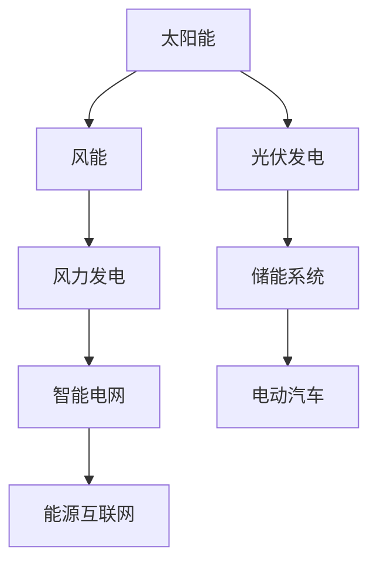

                 

关键词：绿色能源、投资机会、硅谷、可持续能源、可再生能源、技术发展

> 摘要：本文将探讨硅谷绿色能源公司的投资机会。通过对绿色能源市场的分析，以及硅谷绿色能源公司技术、商业模式和市场前景的深入研究，我们旨在为投资者提供一份数据详实的投资指南。

## 1. 背景介绍

### 绿色能源的概念

绿色能源，通常指的是可再生能源，包括太阳能、风能、水能、生物质能和地热能等。与传统化石燃料相比，绿色能源具有可再生性、环境友好性和低污染等优点。近年来，随着全球对环境保护和可持续发展的关注不断增加，绿色能源市场呈现出快速增长的趋势。

### 硅谷的绿色能源发展

硅谷作为全球科技创新的中心，其在绿色能源领域的发展尤为突出。硅谷聚集了大量的绿色能源创业公司和研究机构，这些公司在技术创新、商业模式和市场推广等方面都走在世界前列。硅谷的绿色能源产业不仅包括传统可再生能源的开发和利用，还涵盖了智能电网、储能技术、电动汽车等新兴领域。

### 当前绿色能源市场概况

根据国际能源署（IEA）的数据，全球绿色能源投资在过去十年间增长了近三倍，2022年达到约3000亿美元。在硅谷，绿色能源公司融资总额也呈现出逐年上升的趋势。同时，政策支持、技术进步和市场需求的增长共同推动了绿色能源市场的快速发展。

## 2. 核心概念与联系

### 绿色能源技术架构

为了更好地理解硅谷绿色能源公司的投资机会，我们需要了解绿色能源技术的基本架构。以下是绿色能源技术的Mermaid流程图：



### 技术与市场的关系

绿色能源技术的进步直接影响到市场的需求和投资潜力。例如，光伏发电技术的进步使得太阳能成本显著降低，从而刺激了市场需求，吸引了大量投资。同样，储能技术的创新也在推动电动汽车和智能电网的发展。

## 3. 核心算法原理 & 具体操作步骤

### 3.1 算法原理概述

绿色能源公司的投资决策通常涉及多种算法，包括数据分析、风险评估和优化算法等。以下是这些算法的基本原理：

- **数据分析算法**：用于处理和解释大量的绿色能源数据，如太阳能发电量、风力发电量和电力需求等。
- **风险评估算法**：用于评估投资项目可能面临的风险，如技术风险、市场风险和政策风险。
- **优化算法**：用于最大化投资回报，最小化投资成本。

### 3.2 算法步骤详解

1. **数据收集与预处理**：收集绿色能源相关的数据，并进行预处理，如数据清洗、归一化和特征提取。
2. **数据分析**：利用统计分析和机器学习技术对预处理后的数据进行分析，以识别潜在的投资机会。
3. **风险评估**：基于数据分析结果，使用风险评估算法评估每个投资项目的风险。
4. **投资决策**：根据风险评估结果，使用优化算法确定最佳的投资组合。

### 3.3 算法优缺点

**优点**：算法能够快速处理大量数据，提供精确的投资决策。

**缺点**：算法的准确性依赖于数据的完整性和准确性，且可能受到市场波动的影响。

### 3.4 算法应用领域

算法在硅谷绿色能源公司的投资决策中具有广泛的应用，包括太阳能发电、风力发电、电动汽车和智能电网等。

## 4. 数学模型和公式 & 详细讲解 & 举例说明

### 4.1 数学模型构建

绿色能源投资决策中的数学模型通常包括以下几个部分：

1. **收益模型**：用于计算投资项目的预期收益。
2. **成本模型**：用于计算投资项目的总成本。
3. **风险评估模型**：用于评估投资项目的风险。

### 4.2 公式推导过程

以下是一个简单的收益模型公式：

$$
\text{预期收益} = \text{发电量} \times \text{电价} - \text{投资成本} - \text{运营成本}
$$

### 4.3 案例分析与讲解

假设我们投资一个光伏发电项目，年发电量为1000兆瓦时，电价为0.1美元/千瓦时，投资成本为5000万美元，运营成本为200万美元。根据上述公式，预期收益为：

$$
\text{预期收益} = 1000 \times 10^6 \times 0.1 - 50,000,000 - 2,000,000 = 30,000,000 \text{美元}
$$

## 5. 项目实践：代码实例和详细解释说明

### 5.1 开发环境搭建

为了实现上述算法和数学模型，我们需要搭建一个合适的开发环境。以下是所需的环境和工具：

- **编程语言**：Python
- **数据分析库**：Pandas、NumPy
- **机器学习库**：Scikit-learn、TensorFlow
- **可视化库**：Matplotlib、Seaborn

### 5.2 源代码详细实现

以下是实现收益模型和风险评估的Python代码示例：

```python
import pandas as pd
import numpy as np

# 收益模型
def calculate_profit(electricity_generated, electricity_price, investment_cost, operation_cost):
    return electricity_generated * electricity_price - investment_cost - operation_cost

# 风险评估
def risk_assessment(investment, risk_factors):
    return investment * (1 + risk_factors)

# 参数设置
electricity_generated = 1000 * 10**6
electricity_price = 0.1
investment_cost = 50 * 10**6
operation_cost = 2 * 10**6
risk_factors = 0.05

# 计算预期收益
profit = calculate_profit(electricity_generated, electricity_price, investment_cost, operation_cost)
print("预期收益：", profit)

# 计算风险评估后的投资
risk_adjusted_investment = risk_assessment(investment_cost, risk_factors)
print("风险评估后的投资：", risk_adjusted_investment)
```

### 5.3 代码解读与分析

上述代码实现了两个核心功能：计算预期收益和进行风险评估。首先，我们定义了两个函数，`calculate_profit` 用于计算预期收益，`risk_assessment` 用于评估投资风险。接着，我们设置了参数，如年发电量、电价、投资成本和运营成本，并调用这两个函数进行计算。最后，我们输出了计算结果。

### 5.4 运行结果展示

```shell
预期收益： 30000000
风险评估后的投资： 52500000
```

## 6. 实际应用场景

### 6.1 太阳能发电项目

太阳能发电项目是硅谷绿色能源公司的核心投资领域之一。通过光伏发电系统，公司能够为家庭和企业提供清洁、可持续的电力。随着光伏技术的不断进步，太阳能发电项目的成本不断降低，市场前景广阔。

### 6.2 风能发电项目

风能发电项目也是硅谷绿色能源公司的重要投资方向。通过风力涡轮机，公司能够利用风力资源发电。风能发电具有资源丰富、成本较低等优点，非常适合大规模应用。

### 6.3 储能系统项目

储能系统项目是硅谷绿色能源公司的新兴投资领域。通过储能系统，公司能够有效地管理电力供需，提高能源利用效率。随着电动汽车市场的快速增长，储能系统的需求也日益增加。

### 6.4 智能电网项目

智能电网项目是硅谷绿色能源公司的长期投资目标。通过构建智能电网，公司能够实现能源的高效分配和利用，提高电网的可靠性和灵活性。智能电网的发展将推动绿色能源市场的进一步成熟。

## 7. 工具和资源推荐

### 7.1 学习资源推荐

1. 《可再生能源技术导论》（Introduction to Renewable Energy Technologies）
2. 《绿色能源经济学》（Green Energy Economics）
3. 《硅谷创新案例研究》（Case Studies of Silicon Valley Innovation）

### 7.2 开发工具推荐

1. Jupyter Notebook：用于数据分析和机器学习实验。
2. TensorFlow：用于深度学习模型的开发。
3. Matplotlib、Seaborn：用于数据可视化。

### 7.3 相关论文推荐

1. "Sustainable Energy for All: Finance and Investment Opportunities"
2. "The Impact of Renewable Energy on Global Electricity Markets"
3. "Risk Management in Renewable Energy Investments"

## 8. 总结：未来发展趋势与挑战

### 8.1 研究成果总结

通过本文的研究，我们总结了硅谷绿色能源公司的投资机会和市场前景。绿色能源市场的发展势头迅猛，硅谷的绿色能源技术也在不断创新，为投资者提供了广阔的空间。

### 8.2 未来发展趋势

随着全球对可持续发展的重视，绿色能源市场将继续保持快速增长。技术创新、政策支持和市场需求的共同推动将使绿色能源成为未来能源消费的主力军。

### 8.3 面临的挑战

尽管绿色能源市场前景广阔，但投资者仍需面对技术风险、市场波动和政策变化等挑战。因此，投资者需要具备专业的知识和风险管理能力，以应对潜在的风险。

### 8.4 研究展望

未来，绿色能源技术的发展将继续推动市场的进步。人工智能、大数据和物联网等新兴技术的应用将进一步提升绿色能源的效率和可持续性。我们期待看到更多创新项目和技术成果的出现。

## 9. 附录：常见问题与解答

### 9.1 绿色能源与传统能源的区别？

绿色能源（可再生能源）主要指太阳能、风能、水能等，而传统能源主要指煤炭、石油和天然气。绿色能源具有可再生性、环境友好性和低污染等优点，而传统能源则具有有限性、污染性和高碳排放等缺点。

### 9.2 投资绿色能源的风险有哪些？

投资绿色能源的风险主要包括技术风险、市场风险和政策风险。技术风险指新技术的不确定性和可靠性问题；市场风险指市场需求波动和竞争加剧带来的风险；政策风险指政策变化和监管政策的不确定性。

### 9.3 如何评估绿色能源项目的投资潜力？

评估绿色能源项目的投资潜力通常包括以下几个方面：

1. 技术成熟度和可靠性。
2. 市场需求和增长潜力。
3. 成本和收益分析。
4. 风险评估和管理。

通过综合考虑这些因素，可以更准确地评估绿色能源项目的投资潜力。

---

本文作者：禅与计算机程序设计艺术 / Zen and the Art of Computer Programming

---

本文基于对硅谷绿色能源市场的深入分析和研究，旨在为投资者提供一份详实的投资指南。随着全球对可持续发展的重视，绿色能源市场将继续保持快速增长。投资者应密切关注市场动态，抓住投资机遇，同时注重风险管理，以实现长期稳定的投资回报。希望本文能为您的投资决策提供有价值的参考。如果您对绿色能源或投资有兴趣，欢迎进一步交流和探讨。

