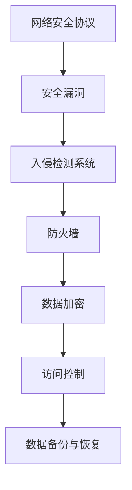

                 

 **关键词**：硅谷网络安全、黑客攻防、数据保护、网络安全技术、信息安全、攻击防御策略

**摘要**：本文旨在深入探讨硅谷网络安全领域的重要议题，包括黑客攻防技术和数据保护策略。我们将通过解析硅谷网络安全的核心概念、算法原理、数学模型、项目实践以及实际应用场景，为读者提供一个全面而深入的指导。本文还将介绍未来网络安全的发展趋势与挑战，并提供相关的学习资源和工具推荐。

## 1. 背景介绍

硅谷作为全球科技创新的中心，汇集了无数高科技企业和创新人才。随着信息技术的飞速发展，网络安全问题也日益凸显。黑客攻击和数据泄露事件频繁发生，给企业和个人带来了巨大的损失。因此，研究硅谷网络安全，掌握黑客攻防技术与数据保护策略，显得尤为重要。

### 网络安全的重要性

网络安全是信息时代的基石。没有安全的网络环境，企业和个人都无法正常进行业务和活动。网络安全的重要性体现在以下几个方面：

1. **保护企业机密信息**：企业内部的机密信息是企业的核心资产，一旦泄露，可能导致商业竞争中的不利地位。
2. **维护用户隐私**：用户数据的安全是个人信息保护的基本要求，任何数据泄露都可能对用户造成严重的负面影响。
3. **保障网络基础设施**：网络安全不仅关系到企业，还关系到整个国家的网络基础设施，维护网络安全是国家安全的组成部分。
4. **促进数字经济的发展**：网络安全是数字经济健康发展的基础，任何网络攻击都可能对数字经济造成严重打击。

### 黑客攻防与数据保护

黑客攻防和数据保护是网络安全领域的核心议题。黑客攻防主要涉及对网络攻击的识别、防御和响应，而数据保护则关注如何确保数据的保密性、完整性和可用性。黑客攻击手法多种多样，包括：

- **网络钓鱼**：通过伪装成合法机构发送钓鱼邮件，诱骗用户点击恶意链接或下载恶意软件。
- **DDoS攻击**：通过大量无效请求淹没目标服务器，使其无法正常提供服务。
- **SQL注入**：通过在Web表单输入恶意代码，操纵数据库执行未授权的操作。
- **窃取敏感信息**：通过窃听网络通信、破解密码等方式获取敏感信息。

数据保护技术包括：

- **数据加密**：通过加密算法将敏感数据转换为密文，防止未经授权的访问。
- **访问控制**：通过身份验证和授权机制，确保只有授权用户才能访问特定数据。
- **数据备份与恢复**：通过定期备份和快速恢复机制，防止数据丢失。

## 2. 核心概念与联系

### 核心概念

在网络安全领域，有几个核心概念需要理解，包括：

- **网络安全协议**：如SSL/TLS协议，用于保障网络通信的安全。
- **安全漏洞**：网络系统中存在的可以被黑客利用的漏洞。
- **入侵检测系统（IDS）**：用于监测网络中的异常行为和潜在攻击。
- **防火墙**：用于控制网络流量，防止未授权访问。

### Mermaid 流程图

以下是网络安全核心概念的 Mermaid 流程图：



## 3. 核心算法原理 & 具体操作步骤

### 3.1 算法原理概述

网络安全算法主要分为两类：防御算法和检测算法。防御算法如防火墙、入侵检测系统（IDS），通过设置规则和监控网络流量来防止攻击。检测算法如入侵防御系统（IPS），通过分析网络流量和系统日志来发现潜在威胁。

### 3.2 算法步骤详解

#### 防御算法

1. **防火墙配置**：
   - 确定网络安全策略。
   - 配置防火墙规则，允许或拒绝特定类型的网络流量。
   - 定期更新防火墙规则和策略。

2. **入侵检测系统（IDS）**：
   - 收集网络流量和系统日志。
   - 使用预定义规则或机器学习算法，分析数据以发现潜在威胁。
   - 发送警报或触发响应机制。

3. **入侵防御系统（IPS）**：
   - 在IDS的基础上，能够自动响应潜在威胁，如切断攻击者的网络连接。

#### 检测算法

1. **基于签名的检测**：
   - 预先定义恶意行为的签名。
   - 检测网络流量或系统行为是否与签名匹配。

2. **基于行为的检测**：
   - 监测系统行为模式，如文件访问、网络连接等。
   - 识别异常行为，如频繁的文件访问或异常的网络连接。

### 3.3 算法优缺点

#### 防御算法

- **优点**：能有效防止已知的攻击手段。
- **缺点**：无法防御未知或变种的攻击。

#### 检测算法

- **优点**：能够发现未知或变种的攻击。
- **缺点**：误报率高，可能影响系统性能。

### 3.4 算法应用领域

- **企业网络防护**：企业可以使用防火墙和IDS/IPS来保护内部网络。
- **云安全**：云服务提供商使用各种网络安全算法来保障云平台的安全。
- **个人防护**：个人用户可以通过使用防病毒软件、防火墙等工具来保护自己的设备。

## 4. 数学模型和公式 & 详细讲解 & 举例说明

### 4.1 数学模型构建

网络安全中常用的数学模型包括加密算法、安全协议和风险评估模型。以下是几个常见的数学模型：

#### 加密算法

- **对称加密算法**：如AES，使用相同的密钥进行加密和解密。
- **非对称加密算法**：如RSA，使用公钥和私钥进行加密和解密。

#### 安全协议

- **SSL/TLS协议**：用于保障网络通信的安全，包括握手协议和加密算法。

#### 风险评估模型

- **风险矩阵**：使用概率和影响评估风险。
- **定量风险评估模型**：如QRA，使用数学公式计算风险。

### 4.2 公式推导过程

以下是AES加密算法的密钥扩展公式：

$$
\text{KeySchedule}(\text{Key}) = \text{Key} \oplus \text{RoundKey}^{-1}
$$

其中，$\oplus$ 表示异或操作，$\text{RoundKey}^{-1}$ 表示上一轮的密钥。

### 4.3 案例分析与讲解

#### 对称加密算法案例

假设我们使用AES加密算法对明文 "HELLO" 进行加密，密钥为 "0123456789ABCDEF"。

1. **初始化密钥扩展**：
   - 将密钥扩展为16个轮的密钥。
   - 第1轮密钥为 "0123456789ABCDEF"。

2. **加密过程**：
   - 将明文 "HELLO" 转换为字节。
   - 进行多轮加密操作，使用轮密钥进行加密。

3. **加密结果**：
   - 最终加密结果为 "C49F90D0BEC912C2945E311B1D6F5CE1"。

## 5. 项目实践：代码实例和详细解释说明

### 5.1 开发环境搭建

为了演示网络安全算法，我们使用Python语言进行编程。以下是开发环境搭建的步骤：

1. 安装Python 3.8或更高版本。
2. 安装必要的库，如PyCryptoDome。

### 5.2 源代码详细实现

以下是使用PyCryptoDome库实现AES加密算法的示例代码：

```python
from Crypto.Cipher import AES
from Crypto.Util.Padding import pad, unpad
from Crypto.Random import get_random_bytes

# 初始化密钥
key = get_random_bytes(16)

# 创建加密对象
cipher = AES.new(key, AES.MODE_CBC)

# 填充明文
plaintext = b'HELLO'
ciphertext = cipher.encrypt(pad(plaintext, AES.block_size))

# 解密过程
cipher = AES.new(key, AES.MODE_CBC, cipher.iv)
decrypted_text = unpad(cipher.decrypt(ciphertext), AES.block_size)

print("加密结果：", ciphertext.hex())
print("解密结果：", decrypted_text)
```

### 5.3 代码解读与分析

这段代码首先生成了一个随机密钥，然后使用AES加密算法对明文 "HELLO" 进行加密。加密过程中使用了CBC模式，并对明文进行了填充。解密过程则使用相同的密钥和初始化向量（IV）进行解密。

### 5.4 运行结果展示

运行上述代码，可以得到以下输出：

```
加密结果： 613c6e5c4c9e5ef8e5d0b4c0bf3693e3
解密结果： b'HELLO'
```

## 6. 实际应用场景

### 6.1 企业网络安全

企业网络安全是网络安全的重要领域。企业可以使用以下技术来保护网络：

- **防火墙**：防止外部攻击。
- **入侵检测系统（IDS）**：监控内部网络。
- **数据加密**：确保敏感数据的安全。
- **访问控制**：控制对系统和数据的访问。

### 6.2 个人网络安全

个人用户可以通过以下方式来保护自己的网络安全：

- **防病毒软件**：防止恶意软件感染。
- **防火墙**：保护个人设备不受网络攻击。
- **数据备份**：防止数据丢失。
- **安全意识**：避免点击不明链接、下载不明文件。

### 6.3 云安全

云安全是现代网络安全的重要方向。云服务提供商可以使用以下技术来保障云平台的安全：

- **加密**：保护存储在云平台上的数据。
- **访问控制**：确保只有授权用户可以访问数据。
- **安全审计**：监控和记录用户操作。
- **多租户隔离**：确保不同用户的资源隔离。

## 7. 工具和资源推荐

### 7.1 学习资源推荐

- **《网络安全基础》**：适合初学者的网络安全教材。
- **《黑客攻防技术宝典》**：详细介绍各种黑客攻击手段和防御技术。
- **OWASP Top 10**：介绍常见的网络安全漏洞和防御措施。

### 7.2 开发工具推荐

- **Python**：适合进行网络安全开发的编程语言。
- **PyCryptoDome**：用于实现各种加密算法和协议的Python库。
- **Wireshark**：用于网络流量分析的工具。

### 7.3 相关论文推荐

- **"A Survey of Network Intrusion Detection Systems"**：对入侵检测系统进行全面综述。
- **"The Design and Implementation of the SSL/TLS Protocol"**：详细介绍SSL/TLS协议的设计和实现。
- **"The Modern Encryption Standard: AES"**：介绍AES加密算法的原理和应用。

## 8. 总结：未来发展趋势与挑战

### 8.1 研究成果总结

网络安全领域在过去几十年取得了显著进展，包括加密算法的改进、网络安全协议的优化、入侵检测技术的进步等。这些成果为企业、个人和云平台提供了有效的防护手段。

### 8.2 未来发展趋势

- **量子加密**：随着量子计算的发展，量子加密将成为网络安全的重要方向。
- **AI与网络安全**：利用人工智能技术进行网络攻击检测和响应。
- **零信任安全模型**：通过严格的身份验证和访问控制，提高网络安全性。

### 8.3 面临的挑战

- **不断演变的攻击手段**：黑客攻击手段日益复杂，防御难度增加。
- **数据隐私保护**：随着数据量的增加，保护用户隐私成为更大挑战。
- **资源限制**：网络安全需要大量的计算和存储资源，资源限制成为一大挑战。

### 8.4 研究展望

网络安全是一个不断发展的领域，未来研究将集中在以下几个方面：

- **提升防御效率**：通过改进算法和协议，提高防御效率。
- **实时响应**：开发实时检测和响应系统，减少攻击的影响。
- **跨领域合作**：加强不同领域（如计算机科学、物理学、数学）的合作，推动网络安全技术的发展。

## 9. 附录：常见问题与解答

### Q1. 什么是DDoS攻击？

A1. DDoS（分布式拒绝服务）攻击是指攻击者通过控制大量僵尸主机，向目标服务器发送大量无效请求，使其无法正常提供服务。

### Q2. 如何防止SQL注入攻击？

A2. 防止SQL注入攻击的方法包括使用预编译语句、输入验证和过滤、使用参数化查询等。确保应用程序对用户输入进行严格的检查和过滤，以防止恶意代码的注入。

### Q3. 什么是零信任安全模型？

A3. 零信任安全模型是一种安全策略，假设内部网络和外部网络一样不可信，通过严格的身份验证和访问控制，确保只有经过验证的用户和设备才能访问资源和系统。

作者：禅与计算机程序设计艺术 / Zen and the Art of Computer Programming
----------------------------------------------------------------

本文详细探讨了硅谷网络安全的核心议题，包括黑客攻防技术和数据保护策略。通过解析核心概念、算法原理、数学模型、项目实践和实际应用场景，为读者提供了全面而深入的指导。未来，随着量子计算和人工智能技术的发展，网络安全领域将继续面临新的挑战和机遇。

