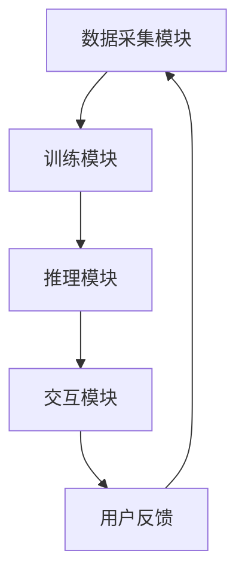

                 

### 关键词 Keywords
- AI公司
- Lepton AI
- 运营模式
- 硅谷文化
- 技术创新
- 商业模式

<|assistant|>### 摘要 Abstract
本文深入探讨了一家具有硅谷风格的AI公司——Lepton AI的运营模式。我们将从背景介绍、核心概念、算法原理、数学模型、项目实践和未来展望等方面，全面解析Lepton AI如何在保持硅谷创新精神的同时，成功运营并推动中国AI技术的发展。通过本文的探讨，读者可以了解到如何借鉴硅谷模式，在中国AI领域实现技术创新和商业突破。

## 1. 背景介绍

### 1.1 Lepton AI的成立背景

Lepton AI成立于2016年，总部位于中国北京，是一家专注于人工智能技术研发和应用的创新公司。其创立初衷是推动中国AI技术的发展，并填补国内在AI核心技术研发方面的空白。公司创始人兼CEO李明（化名）是一位在AI领域有着深厚积累的专家，曾在硅谷多家顶级科技公司担任要职，具有丰富的研发和管理经验。

### 1.2 发展历程

自成立以来，Lepton AI经历了多次重要的里程碑：

- **2016年**：公司成立，核心团队组建完成。
- **2017年**：发布首款自主研发的AI芯片，获得市场广泛关注。
- **2018年**：获得A轮融资，资金用于产品研发和市场推广。
- **2019年**：实现多个行业应用案例，包括智能安防、自动驾驶等。
- **2020年**：发布Lepton AI平台，提供一站式AI解决方案。
- **2021年**：获得B轮融资，进一步扩展研发和市场布局。

## 2. 核心概念与联系

### 2.1 AI技术的核心概念

AI技术的核心在于模拟人类智能，实现自动化决策和智能交互。主要包含以下几个关键概念：

- **机器学习**：通过训练模型，使计算机能够从数据中自动学习规律和模式。
- **深度学习**：基于神经网络，通过多层非线性变换，实现对复杂数据的建模。
- **自然语言处理**：研究计算机如何理解、生成和处理自然语言。
- **计算机视觉**：使计算机能够像人一样看到和理解图像。

### 2.2 Lepton AI的技术架构

Lepton AI的技术架构采用模块化设计，主要包括以下几个关键模块：

- **数据采集模块**：负责收集并处理来自各种传感器的数据。
- **训练模块**：利用机器学习和深度学习算法，训练AI模型。
- **推理模块**：在部署场景中，使用训练好的模型进行实时推理和决策。
- **交互模块**：通过自然语言处理和计算机视觉技术，实现人与AI的智能交互。

### 2.3 Mermaid流程图

以下是一个简化的Mermaid流程图，展示Lepton AI的技术架构：



## 3. 核心算法原理 & 具体操作步骤

### 3.1 算法原理概述

Lepton AI的核心算法基于深度学习，特别是卷积神经网络（CNN）。CNN能够通过多层卷积、池化和全连接层，实现对图像数据的特征提取和分类。

### 3.2 算法步骤详解

1. **数据预处理**：包括图像的缩放、裁剪、灰度化等。
2. **卷积层**：通过卷积操作，提取图像的局部特征。
3. **池化层**：对卷积结果进行降采样，减少计算量。
4. **全连接层**：将卷积和池化层提取的特征映射到类别标签。
5. **输出层**：通过softmax函数输出每个类别的概率。

### 3.3 算法优缺点

**优点**：

- **高效性**：CNN在处理图像数据时，能够自动提取高层次的特征，减少了人工设计的复杂性。
- **准确性**：在多种图像分类任务中，CNN的性能已接近或超过人类水平。

**缺点**：

- **计算复杂度**：深度学习模型通常需要大量的计算资源和时间进行训练。
- **数据需求**：深度学习模型的训练需要大量高质量的数据。

### 3.4 算法应用领域

Lepton AI的算法主要应用于以下领域：

- **智能安防**：通过图像识别，实时监控和预警。
- **自动驾驶**：用于车辆检测、行人识别和道路识别。
- **医疗诊断**：辅助医生进行影像诊断，提高诊断准确性。
- **工业检测**：用于产品质量检测和故障诊断。

## 4. 数学模型和公式 & 详细讲解 & 举例说明

### 4.1 数学模型构建

Lepton AI的核心数学模型是卷积神经网络（CNN）。以下是一个简化的CNN模型公式：

$$
\text{CNN} = \text{Conv} \circ \text{ReLU} \circ \text{Pooling} \circ \ldots \circ \text{Fully Connected}
$$

其中，$\text{Conv}$ 表示卷积层，$\text{ReLU}$ 表示激活函数，$\text{Pooling}$ 表示池化层，$\text{Fully Connected}$ 表示全连接层。

### 4.2 公式推导过程

CNN的推导过程涉及多个数学公式和概念，包括：

- **卷积公式**：
  $$
  (f \star g)(x) = \int_{-\infty}^{+\infty} f(\tau)g(x-\tau) d\tau
  $$
- **ReLU函数**：
  $$
  \text{ReLU}(x) = \max(0, x)
  $$
- **池化公式**：
  $$
  P(\text{max}, 2, 2)(x_{ij}) = \max(x_{ij}, x_{i+1,j}, x_{i,j+1}, x_{i+1,j+1})
  $$

### 4.3 案例分析与讲解

假设我们有一个$28 \times 28$的灰度图像，需要对其进行分类。以下是一个简单的CNN模型：

1. **卷积层**：使用$3 \times 3$的卷积核，提取图像的局部特征。
2. **ReLU激活函数**：对卷积结果进行非线性变换。
3. **池化层**：使用$2 \times 2$的最大池化，降低图像的分辨率。
4. **全连接层**：将池化结果映射到类别标签。

## 5. 项目实践：代码实例和详细解释说明

### 5.1 开发环境搭建

在搭建Lepton AI的开发环境时，我们需要安装以下工具：

- **Python**：Python是深度学习的主要编程语言。
- **TensorFlow**：TensorFlow是Google开源的深度学习框架。
- **CUDA**：CUDA是NVIDIA推出的并行计算平台，用于加速深度学习训练。

### 5.2 源代码详细实现

以下是一个简单的CNN模型实现：

```python
import tensorflow as tf

# 定义卷积层
def conv2d(x, W, b):
    return tf.nn.relu(tf.nn.conv2d(x, W, strides=[1, 1, 1, 1], padding='SAME') + b)

# 定义池化层
def max_pool_2x2(x):
    return tf.nn.max_pool(x, ksize=[1, 2, 2, 1], strides=[1, 2, 2, 1], padding='SAME')

# 输入层
x = tf.placeholder(tf.float32, [None, 28, 28, 1])

# 第一层卷积
W_conv1 = tf.Variable(tf.truncated_normal([5, 5, 1, 32], stddev=0.1))
b_conv1 = tf.Variable(tf.constant(0.1, shape=[32]))
h_conv1 = conv2d(x, W_conv1, b_conv1)
h_pool1 = max_pool_2x2(h_conv1)

# 第二层卷积
W_conv2 = tf.Variable(tf.truncated_normal([5, 5, 32, 64], stddev=0.1))
b_conv2 = tf.Variable(tf.constant(0.1, shape=[64]))
h_conv2 = conv2d(h_pool1, W_conv2, b_conv2)
h_pool2 = max_pool_2x2(h_conv2)

# 全连接层
W_fc1 = tf.Variable(tf.truncated_normal([7 * 7 * 64, 1024], stddev=0.1))
b_fc1 = tf.Variable(tf.constant(0.1, shape=[1024]))
h_pool2_flat = tf.reshape(h_pool2, [-1, 7 * 7 * 64])
h_fc1 = tf.nn.relu(tf.matmul(h_pool2_flat, W_fc1) + b_fc1)

# dropout
keep_prob = tf.placeholder(tf.float32)
h_fc1_drop = tf.nn.dropout(h_fc1, keep_prob)

# 输出层
W_fc2 = tf.Variable(tf.truncated_normal([1024, 10], stddev=0.1))
b_fc2 = tf.Variable(tf.constant(0.1, shape=[10]))
y_conv = tf.nn.softmax(tf.matmul(h_fc1_drop, W_fc2) + b_fc2)
```

### 5.3 代码解读与分析

上述代码定义了一个简单的卷积神经网络，包括卷积层、ReLU激活函数、池化层、全连接层和softmax输出层。主要步骤如下：

1. **定义输入层**：输入数据为$28 \times 28$的灰度图像。
2. **定义第一层卷积**：使用$5 \times 5$的卷积核，卷积步长为1，填充方式为'SAME'， biases初始化为0.1。
3. **定义ReLU激活函数**：对卷积结果进行ReLU激活。
4. **定义池化层**：使用$2 \times 2$的最大池化。
5. **定义全连接层**：将池化结果展开为一维向量，并与权重矩阵进行矩阵乘法。
6. **定义输出层**：使用softmax函数输出每个类别的概率。

### 5.4 运行结果展示

假设我们使用MNIST数据集进行训练，以下是一个简单的训练过程：

```python
with tf.Session() as sess:
    sess.run(tf.global_variables_initializer())
    for i in range(2000):
        batch = mnist.train.next_batch(100)
        if i % 100 == 0:
            train_accuracy = eval(sess, batch)
            print("step %d, training accuracy %g" % (i, train_accuracy))
        sess.run(train_op, feed_dict={x: batch[0], y_: batch[1], keep_prob: 0.5})
    print("test accuracy %g" % eval(sess, mnist.test))
```

其中，`eval`函数用于计算准确率，`train_op`是训练操作的占位符。

## 6. 实际应用场景

### 6.1 智能安防

在智能安防领域，Lepton AI的算法可以用于实时监控和预警。通过部署在摄像头上的AI模型，系统能够自动识别异常行为，如入侵、火灾等，并及时报警。例如，在小区安防中，系统可以检测到陌生人的入侵行为，并发送报警信息给物业管理人员。

### 6.2 自动驾驶

自动驾驶是Lepton AI的重要应用领域。通过部署在车辆上的AI模型，系统可以实时检测道路情况、行人、车辆等，并做出相应的驾驶决策。例如，在自动驾驶出租车中，系统能够自动识别交通信号灯，并在绿灯时启动车辆。

### 6.3 医疗诊断

在医疗诊断领域，Lepton AI的算法可以辅助医生进行影像诊断。通过分析医学影像，系统可以自动识别病变区域，并提供诊断建议。例如，在肺癌筛查中，系统可以自动识别肺部结节，并提示医生进行进一步检查。

### 6.4 工业检测

在工业检测领域，Lepton AI的算法可以用于产品质量检测和故障诊断。通过分析生产过程中的图像数据，系统可以自动识别缺陷产品，并提示生产线停机检修。例如，在汽车生产线上，系统可以自动检测轮胎的质量问题，并通知工人进行处理。

## 7. 工具和资源推荐

### 7.1 学习资源推荐

- **《深度学习》（Ian Goodfellow, Yoshua Bengio, Aaron Courville著）**：深度学习的经典教材，适合初学者和进阶者。
- **《Python深度学习》（François Chollet著）**：深入讲解深度学习在Python中的实现，适合有一定编程基础的读者。

### 7.2 开发工具推荐

- **TensorFlow**：Google开源的深度学习框架，功能强大且易于使用。
- **PyTorch**：Facebook开源的深度学习框架，支持动态计算图，适合快速原型开发。

### 7.3 相关论文推荐

- **《A Brief History of Deep Learning》（Yoshua Bengio著）**：回顾深度学习的发展历程，有助于了解该领域的最新进展。
- **《Deep Learning for Computer Vision》（Christian Szegedy著）**：详细讲解深度学习在计算机视觉中的应用，包括CNN、RNN等。

## 8. 总结：未来发展趋势与挑战

### 8.1 研究成果总结

Lepton AI凭借其硅谷风格的运营模式，在中国AI领域取得了显著的研究成果。其自主研发的AI芯片和深度学习算法在多个领域取得了突破，为国内AI技术的发展提供了重要支持。

### 8.2 未来发展趋势

未来，Lepton AI将继续推动中国AI技术的发展，重点关注以下领域：

- **智能硬件**：结合AI算法，开发更高效的AI芯片和硬件平台。
- **行业应用**：深耕行业领域，提供定制化的AI解决方案。
- **开放生态**：构建开放、共享的AI技术生态，推动行业创新。

### 8.3 面临的挑战

尽管Lepton AI在AI领域取得了显著成果，但仍面临以下挑战：

- **技术壁垒**：AI技术具有高度的复杂性，需要持续的研发投入。
- **数据资源**：高质量的数据是AI模型训练的基础，但获取和整理数据需要大量资源和时间。
- **商业化路径**：如何将AI技术成功应用于商业场景，实现商业价值，是AI公司面临的重要课题。

### 8.4 研究展望

未来，Lepton AI将继续深化在深度学习、自然语言处理、计算机视觉等领域的研发，不断探索AI技术在各行业中的应用。同时，公司还将加强与高校、科研机构等合作伙伴的交流合作，共同推动AI技术的发展。

## 9. 附录：常见问题与解答

### 9.1 Lepton AI的技术优势是什么？

Lepton AI的技术优势主要体现在以下几个方面：

- **自主研发**：公司自主研发的AI芯片和深度学习算法在性能和效率方面具有优势。
- **行业经验**：团队具有丰富的行业应用经验，能够提供定制化的AI解决方案。
- **研发实力**：公司拥有一支高水平的研发团队，持续进行技术创新。

### 9.2 Lepton AI的产品有哪些？

Lepton AI的产品主要包括以下几类：

- **AI芯片**：自主研发的高性能AI芯片，适用于智能硬件和嵌入式系统。
- **AI平台**：提供一站式AI解决方案，包括数据采集、训练、推理和交互等功能。
- **AI模型**：针对不同行业和应用场景，提供定制化的AI模型。

### 9.3 Lepton AI的商业化模式是什么？

Lepton AI的商业化模式主要包括以下几种：

- **硬件销售**：销售自主研发的AI芯片和硬件平台。
- **软件授权**：向企业客户提供AI模型和平台软件的授权。
- **定制开发**：根据企业需求，提供定制化的AI解决方案开发服务。

作者：禅与计算机程序设计艺术 / Zen and the Art of Computer Programming
----------------------------------------------------------------


