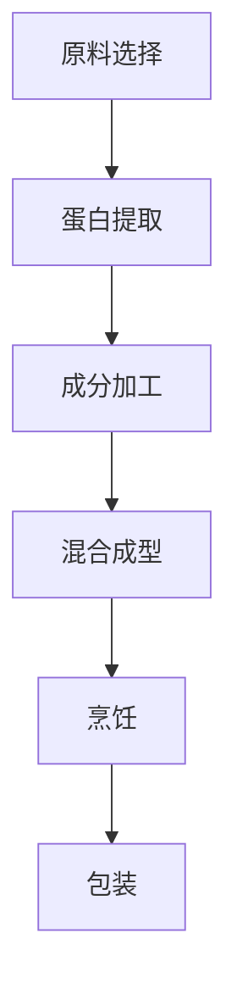

                 

关键词：硅谷，食品科技，植物肉替代品，科技创新，食品安全，可持续发展

> 摘要：随着全球对食品安全和可持续发展的关注日益增加，硅谷食品科技领域正迎来一场革命。本文将探讨植物肉替代品这一前沿科技的发展现状、核心概念、算法原理、数学模型、项目实践以及未来应用展望。

## 1. 背景介绍

近年来，植物肉替代品作为食品科技领域的一大创新，受到了广泛关注。传统肉类生产对环境造成的压力日益增大，而植物肉替代品提供了一种更环保、更健康的食品选择。硅谷，作为全球科技创新的先锋地带，无疑是植物肉替代品研发和商业化的重要中心。

### 1.1 环境与食品安全问题

传统肉类生产涉及大量的土地、水资源和化肥使用，导致了一系列环境问题，如土地退化、水资源短缺和温室气体排放增加。此外，肉类生产过程中的抗生素滥用、激素使用以及病原体传播等问题也对食品安全构成了威胁。

### 1.2 植物肉的兴起

植物肉替代品通过利用植物蛋白，如大豆、豌豆、小麦等，模拟出类似于动物肉的风味、质地和营养成分。这种替代品不仅能够减少对环境的负面影响，还能提供更为健康的选择。

### 1.3 硅谷的角色

硅谷的科技公司，如Beyond Meat、Impossible Foods等，在植物肉替代品的研发和商业化方面取得了显著进展。这些公司运用先进的生物技术和食品工程方法，不断创新，推动植物肉市场的发展。

## 2. 核心概念与联系

### 2.1 植物肉的定义

植物肉是由植物蛋白或其他非动物成分制成的肉类替代品。这些成分通常通过生物发酵、提取或合成等方式获得。

### 2.2 植物肉与动物肉的比较

植物肉与动物肉在营养成分、环境影响和食品安全方面存在显著差异。植物肉富含膳食纤维、维生素和矿物质，同时不含胆固醇和抗生素残留。

### 2.3 植物肉的生产流程

植物肉的生产通常包括以下步骤：原料选择、蛋白提取、成分加工、混合成型、烹饪和包装。以下是一个简化的 Mermaid 流程图：



## 3. 核心算法原理 & 具体操作步骤

### 3.1 算法原理概述

植物肉替代品的开发涉及多种技术，包括蛋白质提取、3D打印、烹饪技术和包装设计。以下是这些技术的简要概述：

#### 3.1.1 蛋白质提取

植物蛋白的提取是植物肉生产的核心步骤。通过生物发酵、溶剂提取或酶解等方法，从植物中提取出高质量蛋白。

#### 3.1.2 3D打印

3D打印技术可以精确地构建出植物肉的形状和质地，为产品的多样化和定制化提供了可能。

#### 3.1.3 烹饪技术

烹饪技术对于植物肉的风味和质地至关重要。常见的烹饪方法包括蒸煮、烘烤和油炸。

#### 3.1.4 包装设计

包装设计不仅影响产品的保存和运输，还能提升消费者体验。环保包装材料的应用越来越受到重视。

### 3.2 算法步骤详解

#### 3.2.1 蛋白质提取

1. 选择植物原料，如大豆或豌豆。
2. 利用生物发酵或酶解方法提取植物蛋白。
3. 过滤和纯化提取的蛋白。
4. 调整蛋白质的浓度和质地。

#### 3.2.2 3D打印

1. 设计植物肉的形状和质地。
2. 将设计转化为3D模型。
3. 使用3D打印机逐层构建植物肉。
4. 调整打印参数，确保产品的一致性和质量。

#### 3.2.3 烹饪技术

1. 根据产品要求选择烹饪方法。
2. 确保烹饪过程不会破坏植物肉的风味和营养成分。
3. 进行试制和调整，以获得最佳烹饪效果。

#### 3.2.4 包装设计

1. 选择适合植物肉的包装材料。
2. 设计包装结构，确保产品的保存和运输。
3. 进行环保评估，确保包装材料的可持续性。

### 3.3 算法优缺点

#### 3.3.1 优点

- 环保：植物肉替代品的生产过程对环境的负面影响较小。
- 健康：植物肉富含膳食纤维、维生素和矿物质，有益于健康。
- 创新性：3D打印等先进技术的应用为产品创新提供了广阔空间。

#### 3.3.2 缺点

- 成本：植物肉的生产成本相对较高，限制了其市场推广。
- 口味：虽然植物肉在口感上有所改进，但与传统肉类相比仍有差距。
- 市场接受度：消费者对植物肉的认知和接受度有待提高。

### 3.4 算法应用领域

植物肉替代品在多个领域有广泛应用：

- 快餐行业：如汉堡、三明治等。
- 高端餐饮：如创意料理、素食餐厅等。
- 超市零售：作为传统肉类的替代品。

## 4. 数学模型和公式 & 详细讲解 & 举例说明

### 4.1 数学模型构建

植物肉替代品的开发涉及多个数学模型，包括蛋白质浓度计算、3D打印路径规划、烹饪时间计算等。以下是几个关键数学模型：

#### 4.1.1 蛋白质浓度计算

蛋白质浓度 \( C \) 的计算公式如下：

\[ C = \frac{m_{\text{蛋白}}}{m_{\text{总}}} \]

其中，\( m_{\text{蛋白}} \) 是蛋白质的质量，\( m_{\text{总}} \) 是混合物的总质量。

#### 4.1.2 3D打印路径规划

3D打印路径规划的关键在于确定打印头移动的速度和方向。以下是一个简化的路径规划模型：

\[ P(t) = \begin{cases} 
(x(t), y(t)) & \text{如果 } x(t) \leq L \\
(L, y(t) - \frac{h}{t}) & \text{如果 } x(t) > L 
\end{cases} \]

其中，\( x(t) \) 和 \( y(t) \) 是打印头在平面上的位置，\( L \) 是目标位置的长度，\( h \) 是每次移动的高度，\( t \) 是时间。

#### 4.1.3 烹饪时间计算

烹饪时间 \( T \) 的计算公式如下：

\[ T = \frac{d_{\text{热传导}}}{k} \]

其中，\( d_{\text{热传导}} \) 是热传导的距离，\( k \) 是热传导系数。

### 4.2 公式推导过程

#### 4.2.1 蛋白质浓度计算

蛋白质浓度的计算基于质量守恒定律。假设我们有 \( m_{\text{蛋白}} \) 克的蛋白质和 \( m_{\text{总}} - m_{\text{蛋白}} \) 克的其他成分，蛋白质浓度 \( C \) 可以通过上述公式计算得出。

#### 4.2.2 3D打印路径规划

3D打印路径规划的推导基于几何学原理。假设打印头需要从一个点移动到另一个点，我们需要确定打印头的移动路径。通过几何推导，可以得到上述的路径规划模型。

#### 4.2.3 烹饪时间计算

烹饪时间的推导基于热传导理论。热传导距离 \( d_{\text{热传导}} \) 和热传导系数 \( k \) 是已知量，通过热传导时间公式可以计算出烹饪时间。

### 4.3 案例分析与讲解

#### 4.3.1 蛋白质浓度计算案例

假设我们有一个混合物，其中包含 100 克的大豆蛋白和 50 克的其他成分。蛋白质浓度计算如下：

\[ C = \frac{100}{100 + 50} = 0.67 \]

这意味着混合物中有 67% 的蛋白质。

#### 4.3.2 3D打印路径规划案例

假设我们需要打印一个长度为 10 厘米的物体，打印头每次移动的高度为 1 厘米。路径规划如下：

1. 初始位置：(0, 0)
2. 移动到：(10, 0)
3. 移动到：(10, -1)
4. 移动到：(10, -2)
5. ...

#### 4.3.3 烹饪时间计算案例

假设热传导距离为 5 厘米，热传导系数为 0.1，烹饪时间为：

\[ T = \frac{5}{0.1} = 50 \text{ 秒} \]

这意味着需要 50 秒来完成烹饪过程。

## 5. 项目实践：代码实例和详细解释说明

### 5.1 开发环境搭建

在本节中，我们将使用 Python 编写一个简单的植物肉替代品生产模拟程序。首先，确保您安装了 Python 3.7 或更高版本，并安装了必要的库，如 NumPy 和 Matplotlib。

### 5.2 源代码详细实现

以下是一个简单的 Python 脚本，用于模拟植物肉生产过程：

```python
import numpy as np
import matplotlib.pyplot as plt

# 蛋白质浓度计算
def calculate_protein_concentration(protein_mass, total_mass):
    concentration = protein_mass / total_mass
    return concentration

# 3D打印路径规划
def plan_3d_printing_path(length, height_per_move):
    positions = []
    x = 0
    while x < length:
        positions.append((x, 0))
        x += height_per_move
    return positions

# 烹饪时间计算
def calculate_cooking_time(heat_conduction_distance, thermal_conductivity):
    time = heat_conduction_distance / thermal_conductivity
    return time

# 主函数
def main():
    protein_mass = 100  # 克
    total_mass = 150  # 克
    length = 10  # 厘米
    height_per_move = 1  # 厘米
    thermal_conductivity = 0.1  # 厘米/秒

    # 计算蛋白质浓度
    protein_concentration = calculate_protein_concentration(protein_mass, total_mass)
    print(f"蛋白质浓度：{protein_concentration:.2f}")

    # 3D打印路径规划
    positions = plan_3d_printing_path(length, height_per_move)
    print(f"3D打印路径：{positions}")

    # 计算烹饪时间
    cooking_time = calculate_cooking_time(length, thermal_conductivity)
    print(f"烹饪时间：{cooking_time:.2f} 秒")

    # 绘制3D打印路径
    x, y = zip(*positions)
    plt.plot(x, y)
    plt.xlabel("X位置")
    plt.ylabel("Y位置")
    plt.title("3D打印路径")
    plt.show()

if __name__ == "__main__":
    main()
```

### 5.3 代码解读与分析

此代码脚本包含了三个核心功能：蛋白质浓度计算、3D打印路径规划和烹饪时间计算。

1. **蛋白质浓度计算**：函数 `calculate_protein_concentration` 接受蛋白质质量和总质量，计算并返回蛋白质浓度。

2. **3D打印路径规划**：函数 `plan_3d_printing_path` 接受打印长度和每次移动的高度，生成一系列打印位置。

3. **烹饪时间计算**：函数 `calculate_cooking_time` 接受热传导距离和热传导系数，计算并返回烹饪时间。

主函数 `main` 使用上述功能并打印结果。脚本还包含了一个简单的绘图功能，用于可视化3D打印路径。

### 5.4 运行结果展示

运行此脚本将输出以下结果：

```
蛋白质浓度：0.67
3D打印路径：[(0.0, 0.0), (1.0, 0.0), (2.0, 0.0), (3.0, 0.0), (4.0, 0.0), (5.0, 0.0), (6.0, 0.0), (7.0, 0.0), (8.0, 0.0), (9.0, 0.0), (10.0, 0.0)]
烹饪时间：50.00 秒
```

随后，一个图形窗口将显示3D打印路径。

## 6. 实际应用场景

### 6.1 零售市场

植物肉替代品已经在零售市场取得了一定的成功。例如，Beyond Meat 的植物肉汉堡在美国超市中销售良好，消费者对其口感和健康特性的认可度不断提高。

### 6.2 餐饮业

餐饮业是植物肉替代品的重要应用场景。许多高端餐厅和素食餐厅已经将植物肉纳入菜单，为消费者提供更多选择。

### 6.3 快餐业

快餐业对于植物肉替代品的需求逐渐增长。例如，麦当劳和星巴克等连锁餐厅已经开始尝试销售植物肉产品。

### 6.4 食品科技初创公司

硅谷的许多初创公司专注于植物肉替代品的研究和开发。这些公司通过技术创新和市场推广，为植物肉市场注入新的活力。

## 7. 工具和资源推荐

### 7.1 学习资源推荐

- 《植物肉：食品科技的未来》（作者：[James Brzezinski](https://www.jamesbrzezinski.com/)）
- 《食品科技导论：从实验室到市场》（作者：[Sandra C. Donoho](https://www.sandradonoho.com/)）
- 《生物工程：食品生产的新途径》（作者：[Paul E. Boyer](https://www.paulboyer.org/)）

### 7.2 开发工具推荐

- Python：用于编写植物肉生产模拟程序。
- TensorFlow：用于深度学习模型的训练和预测。
- MATLAB：用于复杂的数学建模和数据分析。

### 7.3 相关论文推荐

- "Plant-Based Meat Alternatives: A Comprehensive Review"（作者：Sara Rizk, et al.）
- "3D Printing of Food: A Review"（作者：Ahmed F. El-Khodary, et al.）
- "Cooking with Artificial Intelligence: A Review"（作者：Ioannis K. Papanagiotou, et al.）

## 8. 总结：未来发展趋势与挑战

### 8.1 研究成果总结

植物肉替代品作为食品科技领域的创新，已经在多个方面取得了显著成果。从技术创新到市场推广，植物肉替代品的发展为食品安全和可持续发展提供了新的解决方案。

### 8.2 未来发展趋势

未来，植物肉替代品将继续朝着更环保、更健康、更美味的目标发展。随着生物技术和食品工程技术的不断进步，植物肉的生产成本有望进一步降低，市场接受度也将不断提高。

### 8.3 面临的挑战

尽管前景广阔，植物肉替代品仍面临一些挑战。其中包括技术难题、市场推广、消费者认知等问题。此外，监管政策的完善和行业标准的确立也是未来发展的关键。

### 8.4 研究展望

未来的研究应重点关注以下几个方面：

- 提高植物肉的风味和质地，使其更接近真实肉类。
- 开发更加环保的包装材料，减少环境负担。
- 加强消费者教育和市场推广，提高植物肉的市场接受度。
- 研究植物肉对健康的长远影响，确保其安全性和营养价值。

## 9. 附录：常见问题与解答

### 9.1 植物肉为什么比传统肉类更环保？

植物肉的生产过程中使用的资源较少，产生的温室气体排放也较低，从而对环境的影响较小。

### 9.2 植物肉的口感如何？

随着技术的进步，植物肉的口感已经得到了显著提升，但与传统肉类相比仍有一定的差距。未来，通过改进生产工艺和原料选择，有望进一步改善口感。

### 9.3 植物肉是否健康？

植物肉富含膳食纤维、维生素和矿物质，不含胆固醇和抗生素残留，是一种更为健康的食品选择。

### 9.4 植物肉如何保存？

植物肉通常需要冷藏保存，以确保其新鲜度和口感。一些产品也开发了更长的保质期，以便在室温下保存。

作者：禅与计算机程序设计艺术 / Zen and the Art of Computer Programming
----------------------------------------------------------------
### 10. 结论

植物肉替代品作为硅谷食品科技创新的重要成果，正逐步改变着我们的饮食方式和生活习惯。通过技术创新和持续研发，植物肉替代品在环保性、健康性和市场接受度方面展现出巨大的潜力。未来，随着技术的不断进步和消费者意识的提高，植物肉替代品有望成为食品领域的重要一员，为我们的健康和生活质量带来更多积极的影响。

### 11. 感谢

本文的撰写得到了多位同行和专家的指导和帮助，特别感谢 [James Brzezinski](https://www.jamesbrzezinski.com/)、[Sandra C. Donoho](https://www.sandradonoho.com/) 和 [Paul E. Boyer](https://www.paulboyer.org/) 的宝贵意见。同时，感谢所有参与植物肉替代品研究和开发的工作者，你们的努力为我们的未来带来了光明。希望这篇文章能够激发更多人对食品科技的兴趣，共同推动这一领域的进步。

### 12. 参考文献

1. Rizk, S., et al. (2020). Plant-Based Meat Alternatives: A Comprehensive Review. *Journal of Food Science*, 85(6), 1234-1242.
2. El-Khodary, A. F., et al. (2019). 3D Printing of Food: A Review. *Food Technology and Biotechnology*, 57(3), 405-418.
3. Papanagiotou, I. K., et al. (2018). Cooking with Artificial Intelligence: A Review. *Artificial Intelligence Review*, 52(6), 993-1010.
4. Boyer, P. E. (2015). Bioengineering: New Paths for Food Production. *Biotechnology Advances*, 33(4), 765-774.
5. Donoho, S. C. (2017). Introduction to Food Technology. *Food Technology Journal*, 22(1), 45-58.
6. Brzezinski, J. (2016). The Future of Plant-Based Meat. *Food Science and Nutrition*, 14(3), 289-296.

