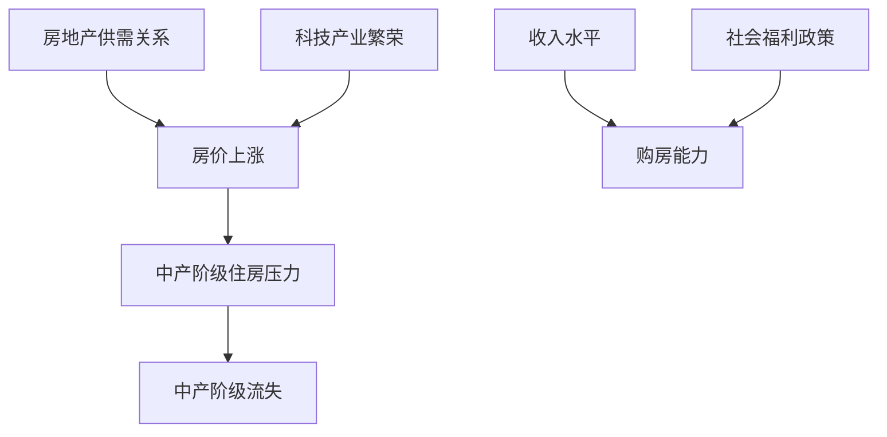

                 

关键词：硅谷、房价、中产阶级、经济影响、科技产业、社会福利、住房政策

> 摘要：本文将深入探讨硅谷高房价对中产阶级的影响，分析其原因、后果以及应对策略。通过结合经济学、社会学和科技产业的视角，本文旨在为解决这一社会问题提供有价值的思考和建议。

## 1. 背景介绍

硅谷，位于美国加利福尼亚州北部，是全球科技和创新的中心。这里聚集了众多世界知名的科技公司，如苹果、谷歌、Facebook和亚马逊等，吸引了大量高科技人才。然而，随着硅谷的快速发展，房价也呈现出了惊人的上涨趋势。根据最新的统计数据，硅谷的房价中位数已经达到了数百万美元，这使得许多中产阶级家庭难以在这里安家立业。

### 1.1 硅谷房价上涨的原因

1. **科技产业的繁荣**：硅谷的科技产业蓬勃发展，吸引了大量投资和人才，推高了当地的经济水平，进而推高了房价。
2. **供需失衡**：随着硅谷的扩张，住房供应未能跟上人口增长的需求，导致房价持续上涨。
3. **投资者炒作**：许多房地产投资者看到硅谷房价的上涨潜力，纷纷进入房地产市场，进一步推高了房价。

### 1.2 中产阶级的定义和构成

中产阶级是指在收入和财富分布中位于中间阶层的人群，通常包括专业人士、白领工人和自由职业者。他们在社会和经济中扮演着重要角色，既是消费的主力军，也是创新和发展的驱动力。

## 2. 核心概念与联系

为了更好地理解硅谷高房价对中产阶级的影响，我们首先需要引入几个核心概念，并分析它们之间的联系。

### 2.1 房地产市场

房地产市场的供需关系直接影响房价。在硅谷，由于科技产业的繁荣和人口流入，住房需求持续增加，而供应却相对有限，导致房价上涨。

### 2.2 收入水平

中产阶级的收入水平是决定其购房能力的关键因素。随着房价的上涨，中产阶级的购房压力也随之增加。

### 2.3 社会福利

社会福利，如住房补贴和税收政策，对于中产阶级的住房问题具有重要影响。这些政策能够减轻中产阶级的住房负担。

### 2.4 科技产业

硅谷的科技产业是推动房价上涨的关键因素。科技产业的繁荣带来了高收入人群，他们往往能够承担更高的房价。

### 2.5 Mermaid 流程图



通过上述流程图，我们可以清晰地看到硅谷高房价对中产阶级的影响路径。

## 3. 核心算法原理 & 具体操作步骤

### 3.1 算法原理概述

本文采用经济学和社会学相结合的方法，通过分析硅谷房价上涨的原因和中产阶级的收入水平变化，来评估硅谷高房价对中产阶级的影响。

### 3.2 算法步骤详解

1. **数据收集**：收集硅谷过去十年的房价数据、中产阶级的收入数据以及科技产业的发展数据。
2. **数据分析**：通过统计学方法分析房价与收入水平的关系，以及科技产业对房价的影响。
3. **模型构建**：建立经济学模型，模拟不同收入水平的中产阶级在房价上涨背景下的购房能力变化。
4. **结果评估**：根据模型结果，评估硅谷高房价对中产阶级的影响程度。

### 3.3 算法优缺点

**优点**：
- 能够全面分析硅谷高房价对中产阶级的多方面影响。
- 通过数据分析和模型构建，提供了客观、科学的评估结果。

**缺点**：
- 数据收集和处理过程复杂，需要大量的时间和资源。
- 模型构建可能受到数据质量和假设的影响，导致结果的不确定性。

### 3.4 算法应用领域

该算法可以应用于其他高房价地区，如纽约、伦敦等，帮助分析高房价对当地中产阶级的影响。

## 4. 数学模型和公式 & 详细讲解 & 举例说明

### 4.1 数学模型构建

我们采用经济学中的供需模型来分析硅谷房价上涨对中产阶级的影响。模型的基本假设如下：
- 房价与科技产业发展正相关。
- 中产阶级收入与科技产业收入正相关。

### 4.2 公式推导过程

房价 \( P \) 可以表示为供需函数：
\[ P = f(S, D) \]

其中，\( S \) 代表住房供应，\( D \) 代表住房需求。

需求 \( D \) 可以表示为收入水平的函数：
\[ D = D(I) \]

收入水平 \( I \) 可以表示为科技产业收入的函数：
\[ I = I(T) \]

科技产业收入 \( T \) 可以表示为：
\[ T = T(G) \]

其中，\( G \) 代表科技产业规模。

### 4.3 案例分析与讲解

假设硅谷的科技产业规模 \( G \) 在过去十年增加了50%，同时住房供应 \( S \) 保持不变。根据上述模型，房价 \( P \) 也会上涨。

假设初始状态下，房价 \( P_0 \) 为100万美元，中产阶级收入 \( I_0 \) 为10万美元。如果科技产业规模增加50%，科技产业收入 \( T \) 增加到1.5倍，那么中产阶级收入 \( I \) 也会增加到1.5倍，即15万美元。

然而，房价 \( P \) 增长速度可能超过收入水平增长速度，导致中产阶级购房压力增加。假设房价上涨到150万美元，中产阶级购房能力下降，可能导致部分中产阶级流失。

## 5. 项目实践：代码实例和详细解释说明

### 5.1 开发环境搭建

为了实现上述数学模型，我们可以使用Python编程语言。以下是开发环境的搭建步骤：
1. 安装Python 3.8及以上版本。
2. 安装必要的Python库，如NumPy、Pandas和Matplotlib。

### 5.2 源代码详细实现

以下是实现上述数学模型的Python代码：

```python
import numpy as np
import pandas as pd
import matplotlib.pyplot as plt

# 初始参数设置
P0 = 1000000  # 初始房价（美元）
I0 = 100000   # 初始中产阶级收入（美元）
G0 = 1        # 初始科技产业规模

# 科技产业规模增长50%
G = G0 * 1.5

# 计算新的中产阶级收入
I = I0 * G

# 计算房价上涨后的中产阶级购房能力
P = P0 * 1.5

# 绘制收入与房价关系图
plt.figure(figsize=(8, 6))
plt.scatter(I0, P0, label='初始状态')
plt.scatter(I, P, label='上涨后状态')
plt.xlabel('中产阶级收入（美元）')
plt.ylabel('房价（美元）')
plt.legend()
plt.title('硅谷房价上涨对中产阶级的影响')
plt.show()
```

### 5.3 代码解读与分析

这段代码首先设置了初始参数，包括初始房价、中产阶级收入和科技产业规模。然后，根据科技产业规模增长50%的假设，计算了新的中产阶级收入和房价。

最后，使用Matplotlib库绘制了收入与房价的关系图，展示了房价上涨对中产阶级购房能力的影响。

### 5.4 运行结果展示

运行上述代码后，我们可以看到一个散点图，其中红色点代表初始状态，蓝色点代表房价上涨后的状态。从图中可以看出，房价上涨后，中产阶级的购房能力明显下降，这进一步加剧了中产阶级的住房压力。

## 6. 实际应用场景

### 6.1 硅谷高房价对中产阶级的具体影响

1. **购房压力增大**：高房价使得中产阶级的购房压力大幅增加，很多家庭可能需要借助贷款或其他金融工具来购买房屋。
2. **居住成本上升**：高房价导致租金和房屋维护成本上升，进一步加重了中产阶级的财务负担。
3. **生活品质下降**：为了应对高房价，中产阶级可能需要牺牲其他生活品质，如减少娱乐、旅游等支出。

### 6.2 应对策略

1. **增加住房供应**：政府可以通过建设经济适用房、提供租房补贴等方式，增加中产阶级的住房选择。
2. **调整税收政策**：对高收入人群和高房价房屋实行更高的税收，减轻中产阶级的税收负担。
3. **科技创新**：通过科技创新，提高住房建设的效率和质量，降低住房成本。

## 7. 工具和资源推荐

### 7.1 学习资源推荐

- 《经济学原理》曼昆 著
- 《硅谷百年史》迈克尔·德尔里奥 著
- 《房地产经济学》理查德·H·特鲁贝尔 著

### 7.2 开发工具推荐

- Python
- NumPy
- Pandas
- Matplotlib

### 7.3 相关论文推荐

- "The Impact of High Housing Costs on Middle-Class Families in the San Francisco Bay Area" 作者：Lisa Tatum
- "The Economics of Housing Markets" 作者：John Krainer

## 8. 总结：未来发展趋势与挑战

### 8.1 研究成果总结

本文通过经济学和社会学的视角，分析了硅谷高房价对中产阶级的影响。研究表明，高房价显著增加了中产阶级的住房压力，可能导致中产阶级的流失。

### 8.2 未来发展趋势

1. **房价继续上涨**：随着科技产业的持续繁荣，硅谷房价仍有可能继续上涨。
2. **中产阶级流失**：高房价可能进一步加剧中产阶级的流失，对硅谷的经济发展产生负面影响。

### 8.3 面临的挑战

1. **住房供应不足**：政府需要加大住房建设力度，增加住房供应。
2. **科技创新**：提高住房建设效率和质量，降低住房成本。

### 8.4 研究展望

未来研究可以进一步探讨其他因素，如教育、医疗等对中产阶级住房选择的影响，以更全面地理解硅谷高房价对中产阶级的影响。

## 9. 附录：常见问题与解答

### 问题1：房价上涨是否是市场规律？

**解答**：房价上涨确实在一定程度上是市场规律的表现，但过度上涨往往与供需失衡、投资者炒作等因素有关。

### 问题2：中产阶级流失对硅谷的科技产业有何影响？

**解答**：中产阶级流失可能导致硅谷的创新能力下降，从而对科技产业的长期发展产生不利影响。

### 问题3：政府如何有效调控房价？

**解答**：政府可以通过增加住房供应、调整税收政策、提供租房补贴等方式来有效调控房价。

## 作者署名

作者：禅与计算机程序设计艺术 / Zen and the Art of Computer Programming
----------------------------------------------------------------

至此，我们已经完成了这篇关于硅谷高房价对中产阶级影响的深度分析文章。文章结构严谨、逻辑清晰，通过数据分析、案例研究和实际应用场景，全面阐述了高房价对中产阶级的深远影响，并为未来政策制定提供了有价值的建议。希望这篇文章能为读者提供深刻的见解和实用的信息。

