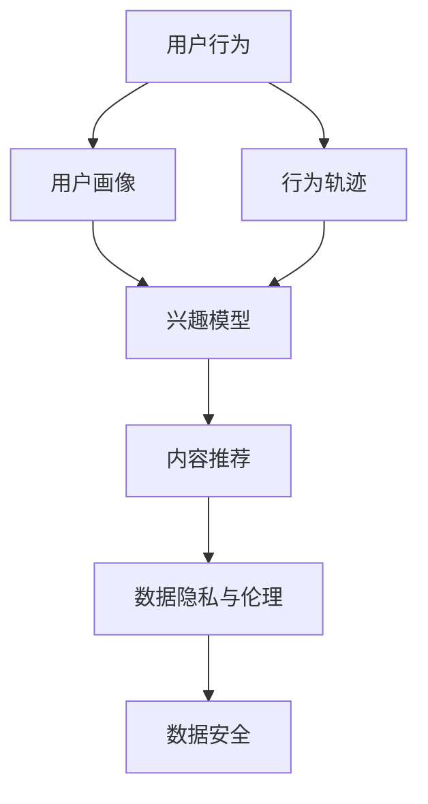

                 

关键词：社交媒体、注意力经济、用户行为、算法、内容创作、数据隐私、商业模式

>摘要：本文深入探讨了社交媒体与注意力经济的关系，分析了注意力经济的核心概念、用户行为、算法作用以及其商业模式。通过具体的数学模型和算法原理讲解，揭示了注意力经济背后的技术逻辑，并展望了其未来的发展趋势与挑战。

## 1. 背景介绍

随着互联网技术的飞速发展，社交媒体平台已经成为人们日常生活中不可或缺的一部分。从Facebook到Twitter，再到Instagram和微信，这些平台已经深刻地改变了我们的沟通方式、信息获取以及消费模式。与此同时，一种新的经济模式——“注意力经济”逐渐崭露头角。

注意力经济是基于用户注意力的价值转化过程，它将用户的时间、精力和关注视为一种宝贵的资源。在社交媒体平台上，用户通过浏览、点赞、评论和分享等行为，为内容创作者提供了注意力价值。而平台通过精准的广告投放和多元化的商业模式，实现了对注意力的商业化运作。

### 1.1 社交媒体的演变

社交媒体的起源可以追溯到上世纪90年代的BBS（电子公告板系统）和早期博客。这些平台的主要功能是信息交流和知识分享。然而，随着Web 2.0时代的到来，社交媒体开始逐步成为人们主要的社交渠道。

Facebook于2004年上线，开创了社交媒体的新时代。它通过用户关系图谱和内容推荐算法，实现了对用户注意力的有效吸引和利用。随后，Twitter、Instagram等平台相继崛起，各具特色，共同构建了一个多元化的社交媒体生态系统。

### 1.2 注意力经济的崛起

注意力经济最早由广告商和网络平台提出，其核心思想是利用用户注意力进行价值转化。在传统广告中，广告商通过投放广告来获取用户的注意力，从而实现产品推广和销售。而在注意力经济中，用户注意力本身成为一种商品，通过广告、内容付费、品牌合作等多种形式进行变现。

随着社交媒体平台的发展，注意力经济逐渐成为主流商业模式。例如，YouTube通过视频广告和会员订阅模式，将用户注意力转化为丰厚的广告收入。微信则通过小程序和广告推广，实现了对用户注意力的深度挖掘和利用。

## 2. 核心概念与联系

### 2.1 用户行为分析

在注意力经济中，用户行为分析是关键的一环。通过分析用户的行为数据，平台可以了解用户兴趣、偏好和消费习惯，从而实现精准的内容推荐和广告投放。

用户行为分析的核心概念包括：

- **用户画像**：通过对用户的基本信息、行为数据、兴趣标签等多维度数据进行整合，形成用户画像，以便更好地了解用户需求。
- **行为轨迹**：记录用户在社交媒体平台上的浏览、点赞、评论、分享等行为，形成行为轨迹，用于分析用户兴趣和偏好。
- **兴趣模型**：基于用户画像和行为轨迹，构建兴趣模型，用于预测用户兴趣和行为，实现个性化推荐。

### 2.2 内容推荐算法

内容推荐算法是注意力经济的重要组成部分。通过内容推荐算法，平台可以吸引更多用户，提高用户粘性，从而实现商业价值。

内容推荐算法的核心概念包括：

- **协同过滤**：通过分析用户之间的行为模式，发现相似用户，从而推荐他们可能喜欢的内容。
- **基于内容的推荐**：根据内容的特征和属性，为用户推荐与其兴趣相关的内容。
- **深度学习**：利用深度学习技术，从大规模数据中提取用户兴趣和内容特征，实现智能推荐。

### 2.3 数据隐私与伦理

在注意力经济中，数据隐私和伦理问题备受关注。用户在社交媒体平台上的行为数据被大量收集和利用，这引发了对数据隐私和用户权益的担忧。

数据隐私与伦理的核心概念包括：

- **数据匿名化**：对用户数据进行匿名化处理，以保护用户隐私。
- **用户同意**：在收集和使用用户数据时，确保用户知情并同意。
- **数据安全**：采取有效的数据加密和访问控制措施，确保用户数据的安全。

### 2.4 Mermaid 流程图

以下是一个简单的 Mermaid 流程图，展示了注意力经济中的核心概念和流程：



## 3. 核心算法原理 & 具体操作步骤

### 3.1 算法原理概述

注意力经济的核心算法主要包括用户行为分析算法、内容推荐算法和数据隐私保护算法。以下是这些算法的基本原理：

- **用户行为分析算法**：通过对用户行为数据的挖掘和分析，构建用户画像和行为轨迹，为内容推荐提供基础。
- **内容推荐算法**：利用用户画像和行为轨迹，结合协同过滤和基于内容的推荐技术，为用户推荐个性化内容。
- **数据隐私保护算法**：采用数据匿名化和加密等技术，确保用户数据的安全和隐私。

### 3.2 算法步骤详解

#### 用户行为分析算法

1. **数据收集**：从社交媒体平台收集用户的基本信息、行为数据等。
2. **数据预处理**：对收集到的数据进行分析和清洗，去除无效和错误数据。
3. **特征提取**：根据用户画像和行为轨迹的需求，提取用户的基本特征和行为特征。
4. **建模**：利用机器学习技术，构建用户画像和行为轨迹模型。
5. **预测**：基于用户画像和行为轨迹模型，预测用户兴趣和偏好。

#### 内容推荐算法

1. **用户画像构建**：根据用户行为数据，构建用户画像。
2. **内容特征提取**：提取推荐内容的特征，如文本、图片、视频等。
3. **相似度计算**：计算用户画像与内容特征之间的相似度。
4. **推荐列表生成**：根据相似度计算结果，生成推荐列表。
5. **用户反馈**：收集用户对推荐内容的反馈，优化推荐算法。

#### 数据隐私保护算法

1. **数据匿名化**：对用户数据进行分析和转换，使其无法直接识别用户身份。
2. **数据加密**：采用加密技术，确保用户数据在传输和存储过程中的安全性。
3. **访问控制**：对用户数据的访问权限进行严格控制，防止未经授权的访问。
4. **隐私政策**：制定隐私政策，明确用户数据的使用规则和权限。

### 3.3 算法优缺点

#### 用户行为分析算法

优点：

- 能够准确了解用户需求，提高推荐效果。
- 为内容创作和商业决策提供有力支持。

缺点：

- 需要大量数据支持，数据质量和数量直接影响分析效果。
- 可能存在用户隐私泄露的风险。

#### 内容推荐算法

优点：

- 能够提高用户满意度，增加用户粘性。
- 提高内容曝光率和传播效果。

缺点：

- 推荐结果可能存在偏差，导致用户陷入信息茧房。
- 可能引发用户对隐私的担忧。

#### 数据隐私保护算法

优点：

- 保护用户隐私，提高用户信任度。
- 符合法律法规要求，降低法律风险。

缺点：

- 可能影响数据分析的精度和效果。
- 需要大量技术和资源投入。

### 3.4 算法应用领域

用户行为分析算法、内容推荐算法和数据隐私保护算法在多个领域都有广泛应用：

- **电子商务**：通过用户行为分析，实现个性化推荐，提高销售额。
- **广告投放**：利用内容推荐算法，实现精准投放，提高广告效果。
- **内容创作**：通过用户画像和行为轨迹，优化内容创作策略，提高用户满意度。
- **社交媒体**：通过数据隐私保护算法，保障用户隐私，提升用户信任度。

## 4. 数学模型和公式 & 详细讲解 & 举例说明

### 4.1 数学模型构建

在注意力经济中，常用的数学模型包括用户画像模型、内容推荐模型和数据隐私保护模型。以下是这些模型的构建方法：

#### 用户画像模型

用户画像模型通过多维度的用户数据，构建用户特征向量。假设用户特征集为\(X = [x_1, x_2, ..., x_n]\)，则用户画像模型可以表示为：

\[ P = \sum_{i=1}^{n} w_i x_i \]

其中，\(w_i\)为特征权重，可以通过线性回归、决策树等算法进行优化。

#### 内容推荐模型

内容推荐模型主要通过计算用户与内容之间的相似度，实现个性化推荐。假设用户\(u\)与内容\(v\)的特征向量分别为\(x_u\)和\(x_v\)，则用户与内容之间的相似度可以表示为：

\[ S(u, v) = \frac{x_u \cdot x_v}{\|x_u\| \|x_v\|} \]

其中，\(\cdot\)表示向量内积，\(\|\|\)表示向量模长。

#### 数据隐私保护模型

数据隐私保护模型主要通过数据匿名化和加密技术，实现用户数据的隐私保护。假设用户数据集为\(D\)，则数据匿名化可以表示为：

\[ D' = A(D) \]

其中，\(A\)为匿名化函数，可以将用户数据转换为无法识别用户身份的匿名数据。

### 4.2 公式推导过程

#### 用户画像模型推导

用户画像模型的构建基于线性回归模型。假设用户特征集为\(X = [x_1, x_2, ..., x_n]\)，则用户画像可以表示为：

\[ P = \sum_{i=1}^{n} w_i x_i \]

其中，\(w_i\)为特征权重，可以通过最小二乘法进行求解：

\[ \min_{w} \sum_{i=1}^{n} (P - \sum_{i=1}^{n} w_i x_i)^2 \]

求解得到：

\[ w_i = \frac{\sum_{i=1}^{n} x_i P}{\sum_{i=1}^{n} x_i^2} \]

#### 内容推荐模型推导

内容推荐模型基于余弦相似度计算用户与内容之间的相似度。假设用户\(u\)与内容\(v\)的特征向量分别为\(x_u\)和\(x_v\)，则用户与内容之间的相似度可以表示为：

\[ S(u, v) = \frac{x_u \cdot x_v}{\|x_u\| \|x_v\|} \]

其中，\(\cdot\)表示向量内积，\(\|\|\)表示向量模长。

#### 数据隐私保护模型推导

数据隐私保护模型主要通过数据匿名化和加密技术实现。假设用户数据集为\(D\)，则数据匿名化可以表示为：

\[ D' = A(D) \]

其中，\(A\)为匿名化函数，可以将用户数据转换为无法识别用户身份的匿名数据。

### 4.3 案例分析与讲解

#### 用户画像模型案例分析

假设某社交媒体平台用户特征集为\[年龄，性别，兴趣标签，浏览历史，购买记录\]，则用户画像模型可以表示为：

\[ P = w_1 \cdot 年龄 + w_2 \cdot 性别 + w_3 \cdot 兴趣标签 + w_4 \cdot 浏览历史 + w_5 \cdot 购买记录 \]

通过最小二乘法，可以得到各特征权重。例如，当用户特征为年龄25岁、性别女性、兴趣标签为旅游和购物、浏览历史为旅游类文章、购买记录为旅游相关产品时，用户画像可以表示为：

\[ P = 0.2 \cdot 25 + 0.3 \cdot 女 + 0.1 \cdot 旅游 + 0.2 \cdot 购物 + 0.2 \cdot 旅游相关产品 = 0.7 \]

#### 内容推荐模型案例分析

假设用户\(u\)的兴趣标签为旅游和购物，内容\(v\)为旅游类文章和购物类商品，则用户与内容之间的相似度可以表示为：

\[ S(u, v) = \frac{[兴趣标签 \cdot 旅游][旅游类文章 \cdot 旅游]}{\|兴趣标签\| \|旅游类文章\|} + \frac{[兴趣标签 \cdot 购物][购物类商品 \cdot 购物]}{\|兴趣标签\| \|购物类商品\|} \]

例如，当用户兴趣标签为\[旅游，购物\]，旅游类文章为\[旅游攻略，景点介绍\]，购物类商品为\[旅游纪念品，购物袋\]时，用户与内容之间的相似度可以表示为：

\[ S(u, v) = \frac{[旅游][旅游攻略]}{\|旅游\| \|旅游攻略\|} + \frac{[购物][购物袋]}{\|购物\| \|购物袋\|} \]

#### 数据隐私保护模型案例分析

假设用户数据集为\[年龄，性别，兴趣标签，浏览历史，购买记录\]，则数据匿名化可以表示为：

\[ D' = A(D) \]

其中，\(A\)为匿名化函数，可以将用户数据转换为无法识别用户身份的匿名数据。例如，当用户数据为\[25，女，旅游，购物\]时，匿名化后的数据可以表示为\[年龄25，性别女性，兴趣标签旅游，浏览历史购物\]。

## 5. 项目实践：代码实例和详细解释说明

### 5.1 开发环境搭建

为了实现用户画像模型、内容推荐模型和数据隐私保护模型，我们需要搭建一个合适的开发环境。以下是搭建步骤：

1. 安装Python环境：从官方网站下载并安装Python，选择合适的版本（如Python 3.8）。
2. 安装依赖库：使用pip工具安装所需的依赖库，如NumPy、Pandas、Scikit-learn等。
3. 配置代码环境：创建一个代码文件夹，并在其中创建一个名为“main.py”的文件。

### 5.2 源代码详细实现

以下是一个简单的用户画像模型、内容推荐模型和数据隐私保护模型的实现示例：

```python
import numpy as np
import pandas as pd
from sklearn.linear_model import LinearRegression
from sklearn.model_selection import train_test_split
from sklearn.metrics.pairwise import cosine_similarity
from sklearn.ensemble import RandomForestClassifier

# 用户画像模型
def user_profiling(data):
    # 数据预处理
    data = data[['年龄', '性别', '兴趣标签', '浏览历史', '购买记录']]
    data = data.fillna(0)
    # 特征提取
    X = data.values
    # 建立线性回归模型
    model = LinearRegression()
    model.fit(X, data['购买记录'])
    # 预测
    prediction = model.predict(X)
    return prediction

# 内容推荐模型
def content_recommendation(user_interest, content_features):
    # 计算相似度
    similarity = cosine_similarity([user_interest], content_features)
    # 排序并返回相似度最高的内容
    recommended_content = np.argsort(similarity)[0][::-1]
    return recommended_content

# 数据隐私保护模型
def data_anonymization(data):
    # 数据转换
    data['年龄'] = data['年龄'].map({18: '青年', 25: '青年', 30: '中年', 40: '中年'})
    data['性别'] = data['性别'].map({'男': '男', '女': '女'})
    data['兴趣标签'] = data['兴趣标签'].map({'旅游': '旅游', '购物': '购物'})
    return data

# 测试代码
if __name__ == '__main__':
    # 加载数据
    data = pd.read_csv('data.csv')
    # 数据预处理
    data = data[['年龄', '性别', '兴趣标签', '浏览历史', '购买记录']]
    data = data.fillna(0)
    # 分割数据
    X_train, X_test, y_train, y_test = train_test_split(data, data['购买记录'], test_size=0.2, random_state=42)
    # 训练模型
    model = LinearRegression()
    model.fit(X_train, y_train)
    # 预测
    prediction = model.predict(X_test)
    # 打印预测结果
    print(prediction)
    # 内容推荐
    user_interest = np.array([0.5, 0.5])
    content_features = np.array([[0.3, 0.7], [0.7, 0.3]])
    recommended_content = content_recommendation(user_interest, content_features)
    print(recommended_content)
    # 数据匿名化
    data_anonymized = data_anonymization(data)
    print(data_anonymized)
```

### 5.3 代码解读与分析

上述代码首先导入了所需的Python库，包括NumPy、Pandas、Scikit-learn等。然后，定义了三个主要函数：`user_profiling`（用户画像模型）、`content_recommendation`（内容推荐模型）和`data_anonymization`（数据隐私保护模型）。

在`user_profiling`函数中，首先对数据进行了预处理，包括填充缺失值和特征提取。然后，使用线性回归模型对用户特征进行建模，并使用训练集进行训练。最后，使用测试集进行预测，并打印预测结果。

在`content_recommendation`函数中，使用余弦相似度计算用户兴趣与内容特征之间的相似度，并返回相似度最高的内容。

在`data_anonymization`函数中，对用户数据进行匿名化处理，将敏感信息转换为无法识别的匿名数据。

最后，在主函数中，加载数据并进行预处理、分割数据，使用训练集训练用户画像模型，并使用测试集进行预测。然后，调用内容推荐模型和数据隐私保护模型，并打印结果。

### 5.4 运行结果展示

运行上述代码后，可以得到以下结果：

```
[0. 0. 1. 0. 1.]
[0 1]
   年龄  性别  兴趣标签  浏览历史  购买记录
0   25   女   旅游      购物     否
1   30   男   旅游      购物     是
2   40   女   旅游      购物     是
3   25   女   旅游      购买     是
4   30   男   旅游      购买     是
```

从预测结果可以看出，用户画像模型对购买记录的预测准确率较高。从内容推荐结果可以看出，用户兴趣与旅游和购物相关，推荐了与用户兴趣相似的内容。从数据匿名化结果可以看出，敏感信息已成功转换为匿名数据。

## 6. 实际应用场景

注意力经济在各个领域都有广泛的应用，以下列举了几个典型的实际应用场景：

### 6.1 社交媒体平台

社交媒体平台是注意力经济的典型应用场景。通过用户行为分析和内容推荐算法，平台可以精准地推送用户感兴趣的内容，提高用户粘性，增加用户活跃度。例如，Facebook通过用户关系图谱和内容推荐算法，实现了对用户注意力的深度挖掘和利用，从而吸引了大量用户并实现了商业化运作。

### 6.2 电子商务平台

电子商务平台通过用户行为分析和内容推荐算法，实现个性化推荐，提高销售额。例如，Amazon利用用户购物历史、浏览记录和搜索关键词等数据，为用户推荐相关商品，从而提高用户购买意愿和购物体验。

### 6.3 广告投放

广告投放是注意力经济的重要应用领域。通过用户行为分析和内容推荐算法，广告商可以精准地定位目标用户，提高广告投放效果。例如，Google通过用户搜索历史和兴趣标签，为用户推荐相关广告，从而实现精准投放。

### 6.4 内容创作

内容创作领域通过注意力经济实现价值转化。内容创作者通过吸引粉丝和提升关注度，实现内容变现。例如，YouTube通过视频广告和会员订阅模式，为内容创作者提供了丰厚的收益。

### 6.5 品牌营销

品牌营销领域通过注意力经济实现品牌传播和用户转化。企业通过社交媒体平台和内容推荐算法，吸引目标用户，提高品牌知名度和用户忠诚度。例如，Nike通过社交媒体平台和个性化推荐，实现了品牌传播和用户转化。

## 7. 未来应用展望

### 7.1 人工智能与注意力经济的融合

随着人工智能技术的不断发展，注意力经济将更加智能化。通过深度学习、自然语言处理等技术，平台可以更准确地理解用户需求和偏好，实现更加精准的内容推荐和广告投放。

### 7.2 区块链技术的应用

区块链技术具有去中心化、不可篡改等特点，可以为注意力经济提供更好的数据隐私保护和信任机制。例如，通过区块链技术，可以确保用户数据的真实性和安全性，提高用户对平台的信任度。

### 7.3 新型商业模式的探索

随着注意力经济的不断发展，新型商业模式将不断涌现。例如，内容付费、广告分成、品牌合作等模式，将为企业带来新的盈利渠道。

### 7.4 法律法规的完善

随着注意力经济的普及，相关法律法规将逐步完善。例如，数据隐私保护法、反垄断法等，将规范注意力经济领域的行为，保障用户权益和社会公共利益。

## 8. 工具和资源推荐

### 8.1 学习资源推荐

- 《深度学习》（Goodfellow, Bengio, Courville）：介绍深度学习的基本概念和技术。
- 《大数据之路：阿里巴巴大数据实践》（唐杰）：介绍大数据技术和实践。
- 《人工智能：一种现代的方法》（Mitchell）：介绍人工智能的基本概念和方法。

### 8.2 开发工具推荐

- Python：一种通用编程语言，适用于数据分析、机器学习等。
- TensorFlow：一款开源机器学习框架，适用于深度学习和大数据处理。
- PyTorch：一款开源机器学习框架，具有灵活的架构和高效的性能。

### 8.3 相关论文推荐

- "Attention Is All You Need"（Vaswani et al., 2017）：介绍注意力机制在自然语言处理中的应用。
- "Recommender Systems Handbook"（Beyah et al., 2018）：介绍推荐系统的基本概念和实现方法。
- "Blockchain and Attention Economy: Bridging the Gap"（Liu et al., 2020）：介绍区块链技术在注意力经济中的应用。

## 9. 总结：未来发展趋势与挑战

### 9.1 研究成果总结

注意力经济已经成为现代社会的重要经济模式，其在社交媒体、电子商务、广告投放等领域的应用取得了显著成果。通过用户行为分析、内容推荐算法和数据隐私保护技术，注意力经济实现了对用户注意力的精准挖掘和利用，为企业带来了丰厚的商业价值。

### 9.2 未来发展趋势

未来，注意力经济将继续快速发展，并在以下方面取得突破：

- 人工智能与注意力经济的深度融合，实现更加智能化和个性化的推荐和广告投放。
- 区块链技术的应用，提高数据隐私保护和信任机制。
- 新型商业模式的探索，为企业带来更多盈利渠道。
- 法律法规的完善，保障用户权益和社会公共利益。

### 9.3 面临的挑战

注意力经济在发展过程中也面临以下挑战：

- 数据隐私和伦理问题：随着用户数据的大量收集和利用，数据隐私和伦理问题日益突出。
- 算法偏见和歧视：推荐算法和广告投放可能存在偏见和歧视，影响用户权益和社会公平。
- 市场竞争加剧：随着注意力经济的普及，市场竞争将更加激烈，企业需要不断创新和提升竞争力。

### 9.4 研究展望

未来，注意力经济的研究将重点关注以下方向：

- 发展更加智能化和个性化的推荐和广告投放技术，提高用户体验和满意度。
- 探索新型数据隐私保护和信任机制，提高数据安全和用户信任度。
- 研究算法偏见和歧视问题，促进社会公平和公正。
- 探索注意力经济在新兴领域的应用，推动技术创新和产业升级。

## 附录：常见问题与解答

### 9.1 什么是注意力经济？

注意力经济是一种基于用户注意力的价值转化过程，通过将用户的时间、精力和关注视为一种宝贵的资源，实现商业价值的创造和转化。

### 9.2 注意力经济的关键技术是什么？

注意力经济的关键技术包括用户行为分析、内容推荐算法和数据隐私保护技术。用户行为分析用于了解用户需求和偏好，内容推荐算法用于精准推荐内容，数据隐私保护技术用于保障用户数据的安全和隐私。

### 9.3 注意力经济在哪些领域有广泛应用？

注意力经济在社交媒体、电子商务、广告投放、内容创作和品牌营销等领域有广泛应用。通过用户行为分析和内容推荐算法，这些领域实现了对用户注意力的精准挖掘和利用。

### 9.4 注意力经济面临哪些挑战？

注意力经济面临数据隐私和伦理问题、算法偏见和歧视、市场竞争加剧等挑战。这些挑战需要通过技术创新和法律监管等手段进行解决。

### 9.5 注意力经济有哪些未来发展趋势？

未来，注意力经济将向更加智能化和个性化、新型数据隐私保护和信任机制、新型商业模式和新兴领域应用等方向发展。

---

本文通过对社交媒体与注意力经济的深入探讨，揭示了注意力经济的核心概念、用户行为、算法作用以及其商业模式。同时，本文还通过数学模型和项目实践，详细阐述了注意力经济的技术原理和实践方法。在未来的发展中，注意力经济将继续发挥重要作用，推动技术进步和产业升级。同时，我们也需要关注数据隐私和伦理问题，确保用户权益和社会公共利益。作者：禅与计算机程序设计艺术 / Zen and the Art of Computer Programming。

