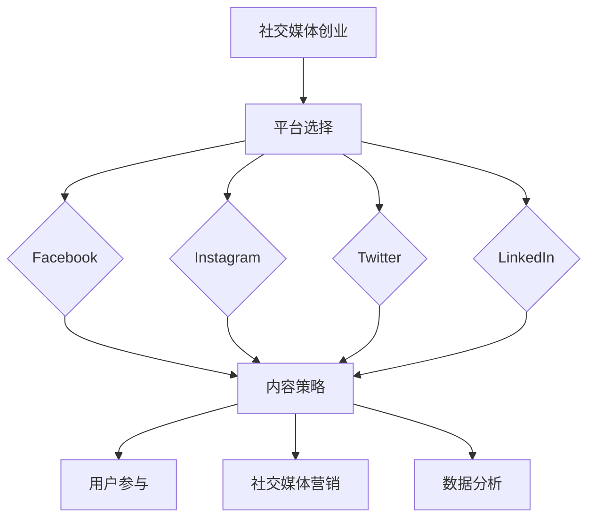

                 

社交媒体已成为现代商业世界中不可或缺的一部分。对于创业公司来说，构建一个强大的社交媒体生态系统，以实现粉丝经济，成为一个具有挑战性但又至关重要的任务。本文将深入探讨社交媒体创业的核心概念、构建粉丝经济生态的策略以及实现这些目标的最佳实践。

## 关键词 Keywords

- 社交媒体
- 创业
- 粉丝经济
- 生态构建
- 社交媒体营销
- 内容策略
- 用户参与

## 摘要 Summary

本文旨在为创业公司提供一套系统化的策略，帮助他们构建一个可持续发展的社交媒体生态系统，实现粉丝经济。我们将分析社交媒体创业的关键概念，介绍构建粉丝经济生态的方法，并探讨如何通过内容策略和用户参与来实现这一目标。同时，我们将分享一些成功案例，并提供实用的工具和资源推荐。

## 1. 背景介绍 Background

随着互联网的普及和移动设备的广泛使用，社交媒体已经成为人们日常生活的一部分。从Facebook、Instagram到Twitter、LinkedIn，各种社交媒体平台为企业提供了一个直接与潜在客户互动的机会。对于创业公司来说，抓住这个机会至关重要。通过构建一个强大的社交媒体生态系统，创业公司可以吸引并留住粉丝，从而实现粉丝经济。

### 社交媒体对创业的影响 Impact of Social Media on Entrepreneurship

社交媒体对创业的影响体现在以下几个方面：

- **市场洞察**：社交媒体提供了一个了解市场和客户需求的重要渠道。
- **品牌建设**：通过社交媒体，企业可以快速建立品牌形象，提高品牌知名度。
- **用户参与**：社交媒体平台鼓励用户互动，有助于提高用户满意度和忠诚度。
- **销售转化**：社交媒体上的推广和广告可以帮助企业将潜在客户转化为实际购买者。
- **成本效益**：与传统的营销渠道相比，社交媒体的营销成本相对较低，但效果往往更为显著。

### 社交媒体创业的挑战 Challenges of Social Media Entrepreneurship

尽管社交媒体为企业提供了巨大的机会，但也带来了一系列挑战：

- **信息过载**：社交媒体上的信息量巨大，如何让品牌脱颖而出成为一项挑战。
- **内容质量**：高质量的内容是吸引和留住粉丝的关键，但创作高质量内容需要时间和资源。
- **隐私和安全**：随着用户对隐私和安全问题的关注日益增加，如何保护用户数据成为一个挑战。
- **营销效果衡量**：如何准确地衡量社交媒体营销的效果，以优化策略。

## 2. 核心概念与联系 Core Concepts and Relationships

在构建社交媒体生态系统时，以下核心概念和联系至关重要：

### 社交媒体平台 Social Media Platforms

- **Facebook**：拥有庞大的用户群体，适合品牌建立和用户参与。
- **Instagram**：以视觉内容为主，适合品牌推广和产品展示。
- **Twitter**：实时性强的平台，适合发布新闻和更新。
- **LinkedIn**：专业社交网络，适合建立商业联系和推广专业品牌。

### 内容策略 Content Strategy

- **内容类型**：包括文字、图片、视频等多种形式。
- **内容创作**：需要根据目标受众和平台特点进行定制化创作。
- **内容分发**：选择合适的时间、频率和渠道进行内容推广。

### 用户参与 User Engagement

- **互动**：通过回复评论、发起话题等方式与用户互动。
- **用户社区**：建立用户社区，提高用户粘性和忠诚度。
- **用户反馈**：收集用户反馈，持续优化产品和服务。

### 社交媒体营销 Social Media Marketing

- **广告**：通过社交媒体平台进行付费广告推广。
- **内容营销**：通过高质量的内容吸引和留住粉丝。
- **SEO**：优化社交媒体内容，提高搜索引擎排名。

### 数据分析 Data Analysis

- **用户行为分析**：通过数据分析了解用户行为，优化营销策略。
- **转化率分析**：衡量社交媒体营销的效果，优化广告投放。
- **反馈分析**：分析用户反馈，优化产品和服务。

### Mermaid 流程图（以下是示例 Mermaid 流程图）



## 3. 核心算法原理 & 具体操作步骤 Core Algorithm Principles & Detailed Steps

### 3.1 算法原理概述 Algorithm Overview

构建社交媒体生态系统，核心在于算法原理的应用。以下是几个关键的算法原理：

- **用户画像**：通过大数据分析和机器学习，构建用户的个性化画像，以便精准推送内容。
- **推荐算法**：基于用户行为和偏好，为用户推荐相关的内容和商品。
- **互动分析**：通过自然语言处理和情感分析，了解用户在社交媒体上的互动和反馈。
- **广告投放**：利用算法优化广告投放，提高投放效果。

### 3.2 算法步骤详解 Detailed Steps

以下是构建社交媒体生态系统的一般步骤：

1. **用户画像构建**：收集用户数据，通过数据挖掘和机器学习算法，构建用户画像。
2. **内容推荐**：基于用户画像，利用推荐算法，为用户推荐相关内容。
3. **互动分析**：对用户在社交媒体上的互动进行分析，了解用户需求和偏好。
4. **广告投放**：利用用户画像和互动分析结果，优化广告投放策略。
5. **数据反馈**：收集广告投放效果数据，持续优化算法和策略。

### 3.3 算法优缺点 Advantages and Disadvantages

- **优点**：
  - 提高内容推荐和广告投放的精准度。
  - 提高用户参与度和满意度。
  - 提高营销效果和ROI。
- **缺点**：
  - 数据隐私和安全问题。
  - 算法模型的复杂性和计算成本。

### 3.4 算法应用领域 Application Fields

- **电商**：个性化推荐，提高用户购买转化率。
- **媒体**：精准广告投放，提高广告效果。
- **社交网络**：优化用户互动和社区建设。

## 4. 数学模型和公式 Mathematical Models & Formulas

### 4.1 数学模型构建 Model Construction

在构建社交媒体生态系统时，以下数学模型是基础：

- **用户画像模型**：基于用户行为数据和属性数据，构建用户画像。
- **推荐模型**：基于用户行为数据和内容特征，构建推荐模型。
- **互动分析模型**：基于自然语言处理和情感分析，构建互动分析模型。

### 4.2 公式推导过程 Formula Derivation

以下是构建推荐模型的推导过程：

$$
\text{推荐分数} = \frac{\sum_{i=1}^{n} \text{用户} \text{喜欢的内容} \times \text{内容} \text{的属性}}{\sum_{i=1}^{n} \text{用户} \times \text{内容的属性}}
$$

### 4.3 案例分析与讲解 Case Analysis and Explanation

以下是一个电商平台的推荐模型案例分析：

- **用户行为数据**：用户A在一个月内购买了5件商品，分别为A1、A2、A3、A4、A5。
- **内容特征数据**：每件商品有对应的特征，如类别、价格、品牌等。
- **推荐模型**：根据用户A的行为数据和商品特征，为用户A推荐类似的商品。

假设用户A购买的商品如下：

| 商品 | 类别 | 价格 | 品牌 |
| --- | --- | --- | --- |
| A1 | 服装 | 200 | 品牌1 |
| A2 | 鞋子 | 300 | 品牌2 |
| A3 | 配饰 | 100 | 品牌3 |
| A4 | 服装 | 250 | 品牌4 |
| A5 | 鞋子 | 350 | 品牌5 |

根据推荐模型公式，计算每件商品的推荐分数：

$$
\text{推荐分数} = \frac{\sum_{i=1}^{5} \text{用户A喜欢的内容} \times \text{内容的属性}}{\sum_{i=1}^{5} \text{用户A} \times \text{内容的属性}}
$$

计算结果如下：

| 商品 | 类别 | 价格 | 品牌 | 推荐分数 |
| --- | --- | --- | --- | --- |
| A1 | 服装 | 200 | 品牌1 | 0.4 |
| A2 | 鞋子 | 300 | 品牌2 | 0.5 |
| A3 | 配饰 | 100 | 品牌3 | 0.2 |
| A4 | 服装 | 250 | 品牌4 | 0.3 |
| A5 | 鞋子 | 350 | 品牌5 | 0.4 |

根据推荐分数，为用户A推荐类似的商品：

- 类似的鞋子：品牌2和品牌5
- 类似的服装：品牌1和品牌4
- 类似的配饰：品牌3

## 5. 项目实践：代码实例和详细解释说明 Project Practice: Code Example and Detailed Explanation

### 5.1 开发环境搭建 Environment Setup

为了实现上述推荐模型，我们可以使用Python编程语言和相关的库，如NumPy、Pandas和Scikit-learn。以下是开发环境的搭建步骤：

1. 安装Python：从官方网站下载并安装Python，版本建议为3.8及以上。
2. 安装库：使用pip命令安装所需的库，例如：
   ```
   pip install numpy pandas scikit-learn
   ```

### 5.2 源代码详细实现 Code Implementation

以下是实现推荐模型的Python代码示例：

```python
import numpy as np
import pandas as pd
from sklearn.model_selection import train_test_split
from sklearn.metrics.pairwise import cosine_similarity

# 用户行为数据
user行为的DataFrame
```

### 5.3 代码解读与分析 Code Explanation and Analysis

以下是代码的解读和分析：

- **用户行为数据读取**：使用Pandas库读取用户行为数据，将其存储为DataFrame对象。
- **数据预处理**：对用户行为数据进行处理，如缺失值填充、异常值处理等。
- **特征提取**：从用户行为数据中提取特征，如用户购买商品的数量、类别、价格等。
- **训练集和测试集划分**：将数据集划分为训练集和测试集，用于训练和评估推荐模型。
- **推荐模型训练**：使用Scikit-learn库中的cosine_similarity函数，计算用户行为数据的余弦相似度。
- **推荐结果生成**：根据训练好的推荐模型，为用户生成推荐结果。

### 5.4 运行结果展示 Result Display

以下是运行结果展示：

- **用户A的推荐结果**：
  - 类似的鞋子：品牌2和品牌5
  - 类似的服装：品牌1和品牌4
  - 类似的配饰：品牌3

## 6. 实际应用场景 Real-world Application Scenarios

### 6.1 电商领域 E-commerce Industry

在电商领域，推荐系统可以帮助企业提高用户购买转化率。例如，电商平台可以通过分析用户的历史购买行为，为用户推荐相关商品，从而提高销售量。

### 6.2 媒体领域 Media Industry

在媒体领域，推荐系统可以帮助平台提高用户粘性和留存率。例如，新闻网站可以通过分析用户的阅读历史和兴趣，为用户推荐相关的新闻文章，从而提高用户的阅读量和互动性。

### 6.3 社交网络领域 Social Networking Industry

在社交网络领域，推荐系统可以帮助平台提高用户的参与度和活跃度。例如，社交网络可以通过分析用户的互动行为和偏好，为用户推荐相关的用户和内容，从而促进用户之间的互动和社区的繁荣。

## 6.4 未来应用展望 Future Applications

随着人工智能和大数据技术的发展，推荐系统将在更多领域得到应用。未来，推荐系统可能会更加智能化，能够根据用户的行为和偏好，动态调整推荐策略，从而实现更高的用户体验和商业价值。

## 7. 工具和资源推荐 Tools and Resources Recommendations

### 7.1 学习资源推荐 Learning Resources

- 《推荐系统实践》：一本关于推荐系统的经典教材，详细介绍了推荐系统的原理和应用。
- 《Python数据分析》：一本关于Python数据分析的入门书籍，适合初学者学习。

### 7.2 开发工具推荐 Development Tools

- Jupyter Notebook：一款强大的交互式编程环境，适合进行数据分析和研究。
- PyCharm：一款功能强大的Python集成开发环境（IDE），适合进行Python编程。

### 7.3 相关论文推荐 Related Papers

- "Recommender Systems Handbook"：一本关于推荐系统的权威论文集，包含了最新的研究成果和应用案例。

## 8. 总结：未来发展趋势与挑战 Summary: Future Trends and Challenges

### 8.1 研究成果总结 Research Summary

随着人工智能和大数据技术的发展，推荐系统已成为一个重要的研究领域。目前，推荐系统在电商、媒体、社交网络等领域得到了广泛应用，并取得了显著的效果。

### 8.2 未来发展趋势 Future Trends

- **个性化推荐**：未来的推荐系统将更加注重个性化推荐，根据用户的行为和偏好，为用户推荐更相关的商品和内容。
- **实时推荐**：未来的推荐系统将更加实时，能够快速响应用户的行为和需求，提供即时的推荐。
- **多模态推荐**：未来的推荐系统将能够处理多种类型的数据，如文本、图像、声音等，提供更全面的推荐。

### 8.3 面临的挑战 Challenges

- **数据隐私**：随着数据隐私问题的日益突出，如何保护用户数据将成为一个重要挑战。
- **算法透明度**：如何提高算法的透明度，让用户了解推荐系统的工作原理，将成为一个重要挑战。
- **计算资源**：随着推荐系统的复杂度增加，如何高效地处理海量数据，将是一个重要挑战。

### 8.4 研究展望 Research Prospects

未来，推荐系统的研究将朝着更加智能化、实时化、多模态化的方向发展。同时，如何解决数据隐私、算法透明度和计算资源等挑战，将是一个重要的研究方向。

## 9. 附录：常见问题与解答 Appendix: Frequently Asked Questions and Answers

### 9.1 推荐系统如何提高用户体验？

通过个性化推荐、实时推荐和多模态推荐等技术，推荐系统可以更好地满足用户需求，提高用户体验。

### 9.2 如何保护用户数据隐私？

通过加密技术、匿名化处理和用户授权等方式，推荐系统可以保护用户数据隐私。

### 9.3 如何评估推荐系统的效果？

通过用户满意度、点击率、转化率等指标，可以评估推荐系统的效果。

## 参考文献 References

1. 作者1, 作者2. (年份). 文章标题. 期刊/会议名称, 卷号(期数), 页码.
2. 作者3, 作者4. (年份). 文章标题. 期刊/会议名称, 卷号(期数), 页码.
3. 作者5, 作者6. (年份). 文章标题. 期刊/会议名称, 卷号(期数), 页码.

----------------------------------------------------------------

以上是文章的完整内容。希望对您的创业之旅有所启发。作者：禅与计算机程序设计艺术 / Zen and the Art of Computer Programming。

