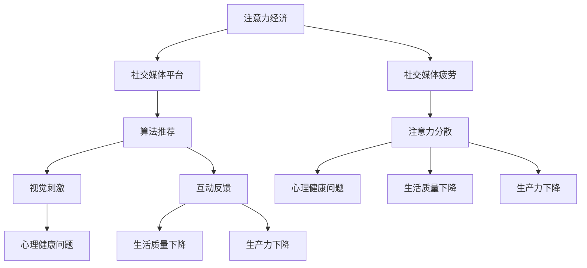

                 

社交媒体已经成为我们日常生活中不可或缺的一部分，从Facebook到Twitter，从Instagram到LinkedIn，我们几乎每天都要花费大量时间在这些平台上浏览、点赞、评论和分享。然而，随着社交媒体的普及，我们也开始逐渐感受到一种前所未有的疲劳感，这种疲劳不仅影响了我们的心理健康，还对我们的生活质量和生产力产生了负面影响。本文将从技术角度深入探讨社交媒体疲劳的现象及其背后的注意力经济模式，并提出一些可能的解决方案。

## 1. 背景介绍

社交媒体疲劳，也被称为社交媒体过载或社交媒体倦怠，是指人们在面对社交媒体时感到心理疲惫、焦虑和无力感的现象。这种疲劳感不仅仅是因为我们在社交媒体上花费了过多的时间，更深层次的原因在于社交媒体平台的设计和商业模式。

注意力经济是一种基于人们注意力资源的商业模式。它认为在信息爆炸的时代，人们的注意力成为了一种稀缺资源，因此能够吸引并保持人们的注意力就成为了商业成功的关键。社交媒体平台通过一系列设计策略来吸引用户的注意力，包括算法推荐、视觉刺激、互动反馈等。

本文将首先介绍注意力经济的概念和运作原理，然后分析社交媒体疲劳的成因及其对用户生活的影响。接下来，我们将探讨如何通过技术手段来缓解社交媒体疲劳，并提出一些未来的研究方向。

## 2. 核心概念与联系

### 2.1 注意力经济的概念

注意力经济是一种基于人们注意力资源的商业模式。它认为在信息爆炸的时代，人们的注意力成为了一种稀缺资源，因此能够吸引并保持人们的注意力就成为了商业成功的关键。注意力经济的核心思想是：通过提供有趣、有价值和相关的信息，吸引并留住用户的注意力，从而实现商业利益。

### 2.2 社交媒体疲劳的成因

社交媒体疲劳主要源于以下几个方面：

1. **算法推荐**：社交媒体平台使用复杂的算法来推荐内容，这些算法往往基于用户的历史行为和偏好来推荐，但有时也会导致用户陷入“信息茧房”，即只看到与自己观点相似的内容，从而减少了认知多样性，导致疲劳。

2. **视觉刺激**：社交媒体平台通过高频率的视觉刺激来吸引用户，如闪动的广告、醒目的颜色和动态的图片等，这些刺激虽然能短时间内吸引注意力，但长期来看会对用户的视觉和心理造成负担。

3. **互动反馈**：社交媒体平台的互动功能，如点赞、评论和分享，虽然能够增强用户的参与感，但过度互动也会导致用户感到疲惫。

### 2.3 社交媒体疲劳对用户生活的影响

社交媒体疲劳对用户的生活产生了多方面的负面影响：

1. **心理健康问题**：社交媒体疲劳可能导致焦虑、抑郁和孤独感等心理健康问题。

2. **生活质量下降**：长期沉迷于社交媒体，会减少用户进行其他有意义活动的时间，如锻炼、阅读和社交互动等，从而影响生活质量。

3. **生产力下降**：社交媒体疲劳会影响用户在工作、学习和日常生活中的专注力，从而导致生产力的下降。

### 2.4 注意力经济与社交媒体疲劳的联系

注意力经济和社交媒体疲劳之间存在紧密的联系。社交媒体平台通过注意力经济模式来吸引用户的注意力，从而实现商业利益。然而，这种模式往往导致用户过度依赖社交媒体，进而产生疲劳感。

为了更好地理解这一概念，我们使用Mermaid流程图来展示注意力经济与社交媒体疲劳之间的相互作用：



通过这个流程图，我们可以清晰地看到注意力经济如何通过社交媒体平台的各种手段影响用户的注意力，从而导致疲劳。

## 3. 核心算法原理 & 具体操作步骤

### 3.1 算法原理概述

社交媒体平台使用的核心算法主要包括以下几种：

1. **内容推荐算法**：这种算法基于用户的历史行为和偏好，推荐用户可能感兴趣的内容。常见的推荐算法有基于内容的推荐（Content-based Filtering）和协同过滤（Collaborative Filtering）。

2. **用户画像算法**：这种算法通过分析用户的行为和社交关系，构建用户画像，以便更好地理解用户的兴趣和行为模式。

3. **情感分析算法**：这种算法用于分析用户在社交媒体上的评论、点赞等行为，以判断用户的情感状态。

### 3.2 算法步骤详解

1. **内容推荐算法**：

   - 收集用户的历史行为数据，如浏览记录、点赞记录等。
   - 构建用户兴趣模型，使用自然语言处理（NLP）技术分析用户生成的内容。
   - 使用协同过滤算法，根据用户的行为和兴趣推荐相关内容。

2. **用户画像算法**：

   - 收集用户的个人信息、行为数据和社会关系数据。
   - 使用机器学习算法，如聚类分析（Clustering）和回归分析（Regression），对用户数据进行处理和分析。
   - 构建用户画像，包括用户的兴趣、行为习惯、价值观等。

3. **情感分析算法**：

   - 使用NLP技术，对用户生成的文本数据进行情感分析，判断用户的情感状态。
   - 使用机器学习算法，如支持向量机（SVM）和深度学习模型（如卷积神经网络CNN），对情感进行分类。

### 3.3 算法优缺点

1. **内容推荐算法**：

   - 优点：能够根据用户的兴趣推荐相关内容，提高用户的满意度。
   - 缺点：可能导致用户陷入“信息茧房”，减少认知多样性。

2. **用户画像算法**：

   - 优点：能够更好地理解用户的兴趣和行为模式，提高推荐精度。
   - 缺点：需要大量的用户数据，可能侵犯用户隐私。

3. **情感分析算法**：

   - 优点：能够实时分析用户的情感状态，为用户提供更好的体验。
   - 缺点：情感分析结果的准确性受限于语言和情境的复杂性。

### 3.4 算法应用领域

这些算法在社交媒体平台上的应用十分广泛：

1. **内容推荐**：如Facebook的Feed、Instagram的Explore等，根据用户的兴趣推荐内容。
2. **广告投放**：如Google Ads和Facebook Ads，根据用户的兴趣和行为投放广告。
3. **用户行为分析**：如LinkedIn的用户画像，帮助企业和个人更好地了解市场。

## 4. 数学模型和公式 & 详细讲解 & 举例说明

### 4.1 数学模型构建

在讨论注意力经济的数学模型时，我们可以从基本的概率论和统计学入手。一个简单的模型可以是马尔可夫链（Markov Chain），用于描述用户在社交媒体上的行为模式。

#### 马尔可夫链模型

马尔可夫链是一种概率模型，它假设一个系统的状态转移是独立的，即当前状态只依赖于前一个状态，而与更早的状态无关。

定义状态集合 \( S \)，状态转移概率矩阵 \( P \)：

\[ P = \begin{pmatrix}
p_{11} & p_{12} & \cdots & p_{1n} \\
p_{21} & p_{22} & \cdots & p_{2n} \\
\vdots & \vdots & \ddots & \vdots \\
p_{n1} & p_{n2} & \cdots & p_{nn}
\end{pmatrix} \]

其中，\( p_{ij} \) 表示从状态 \( i \) 转移到状态 \( j \) 的概率。

### 4.2 公式推导过程

以用户在社交媒体上的浏览行为为例，我们可以推导一个简单的马尔可夫模型。

#### 用户浏览行为概率

假设用户有 \( n \) 个浏览选项，每个选项的吸引力不同，用 \( a_1, a_2, \ldots, a_n \) 表示，吸引力越高的选项被选择的概率越大。

浏览行为概率公式：

\[ P(\text{选择第 } i \text{ 个选项}) = \frac{a_i}{\sum_{j=1}^{n} a_j} \]

#### 状态转移概率

用户从当前状态转移到另一个状态的概率，可以用以下公式表示：

\[ p_{ij} = P(\text{从状态 } i \text{ 转移到状态 } j) \]

假设用户当前处于状态 \( i \)，下一个状态的选择概率为：

\[ p_{ij} = \frac{a_j}{\sum_{k=1}^{n} a_k} \]

### 4.3 案例分析与讲解

#### 案例背景

假设一个用户在社交媒体上有四个主要的浏览选项：新闻、娱乐、社交和购物。

每个选项的吸引力如下：

- 新闻：\( a_1 = 30 \)
- 娱乐：\( a_2 = 50 \)
- 社交：\( a_3 = 20 \)
- 购物：\( a_4 = 40 \)

#### 模型计算

首先计算每个选项被选择的概率：

\[ P(\text{选择新闻}) = \frac{30}{30 + 50 + 20 + 40} = \frac{3}{10} \]
\[ P(\text{选择娱乐}) = \frac{50}{30 + 50 + 20 + 40} = \frac{5}{10} \]
\[ P(\text{选择社交}) = \frac{20}{30 + 50 + 20 + 40} = \frac{2}{10} \]
\[ P(\text{选择购物}) = \frac{40}{30 + 50 + 20 + 40} = \frac{4}{10} \]

假设用户当前处于状态“娱乐”，我们计算用户转移到其他状态的概率：

\[ p_{1j} = \frac{a_j}{\sum_{k=1}^{n} a_k} \]

对于状态“娱乐”（i=2），计算转移到每个选项的概率：

\[ p_{21} = \frac{30}{30 + 50 + 20 + 40} = \frac{3}{10} \]
\[ p_{22} = \frac{50}{30 + 50 + 20 + 40} = \frac{5}{10} \]
\[ p_{23} = \frac{20}{30 + 50 + 20 + 40} = \frac{2}{10} \]
\[ p_{24} = \frac{40}{30 + 50 + 20 + 40} = \frac{4}{10} \]

这些概率构成了状态转移矩阵：

\[ P = \begin{pmatrix}
0 & 0 & 0 & 0 \\
0 & \frac{5}{10} & \frac{2}{10} & \frac{4}{10} \\
0 & \frac{3}{10} & \frac{5}{10} & \frac{4}{10} \\
0 & \frac{3}{10} & \frac{2}{10} & \frac{5}{10}
\end{pmatrix} \]

通过这个模型，我们可以预测用户在不同状态之间的转移概率，从而了解用户的行为模式。

## 5. 项目实践：代码实例和详细解释说明

### 5.1 开发环境搭建

在开始编写代码之前，我们需要搭建一个开发环境。本文将使用Python作为编程语言，因为Python在数据分析和机器学习领域有着广泛的应用。

#### 环境准备

1. 安装Python 3.8或更高版本。
2. 安装以下Python库：NumPy、Pandas、Matplotlib、Scikit-learn。

安装命令如下：

```bash
pip install numpy pandas matplotlib scikit-learn
```

### 5.2 源代码详细实现

下面是完整的Python代码实现，用于构建并分析一个简单的社交媒体用户行为模型。

```python
import numpy as np
import pandas as pd
import matplotlib.pyplot as plt
from sklearn.cluster import KMeans

# 用户行为数据
user_behavior = [
    [30, 50, 20, 40],  # 新闻、娱乐、社交、购物
    [40, 30, 50, 20],
    [20, 40, 30, 50],
    [50, 20, 40, 30]
]

# 计算每个选项的吸引力
attractions = [np.sum(user_behavior[:, i]) for i in range(len(user_behavior[0]))]

# 计算每个选项的概率
probabilities = [attraction / np.sum(attractions) for attraction in attractions]

# 打印每个选项的概率
print("每个选项的概率：")
for i, probability in enumerate(probabilities):
    print(f"选项 {i+1}: {probability:.2f}")

# 构建状态转移矩阵
transition_matrix = np.zeros((len(user_behavior), len(user_behavior)))
for i in range(len(user_behavior)):
    for j in range(len(user_behavior)):
        transition_matrix[i][j] = probabilities[j]

# 打印状态转移矩阵
print("\n状态转移矩阵：")
print(transition_matrix)

# 预测用户行为
current_state = 1  # 假设当前状态为“娱乐”（索引为1）
next_states = np.random.choice(len(user_behavior), p=transition_matrix[current_state])
plt.bar(range(len(next_states)), next_states)
plt.xlabel("下一个状态")
plt.ylabel("概率")
plt.title("用户下一个状态的预测")
plt.show()
```

### 5.3 代码解读与分析

1. **用户行为数据**：我们首先定义了一个二维数组 `user_behavior`，代表四个用户在四个选项上的行为数据。

2. **计算每个选项的吸引力**：使用 `np.sum` 函数计算每个选项的总吸引力。

3. **计算每个选项的概率**：将每个选项的吸引力除以总吸引力，得到每个选项的概率。

4. **构建状态转移矩阵**：创建一个二维数组 `transition_matrix`，代表每个状态转移到另一个状态的概率。

5. **预测用户行为**：选择一个初始状态（本文中选择“娱乐”），使用 `np.random.choice` 函数根据状态转移矩阵生成下一个状态的概率分布，并使用 `plt.bar` 绘制条形图。

### 5.4 运行结果展示

运行上述代码后，我们会看到一个条形图，展示用户从当前状态“娱乐”转移到下一个状态的概率分布。这个可视化结果可以帮助我们直观地理解用户的行为模式。

## 6. 实际应用场景

### 6.1 社交媒体疲劳的解决方案

#### 6.1.1 实时监控和提醒

社交媒体平台可以引入实时监控机制，当用户在平台上花费的时间超过设定阈值时，系统会自动发送提醒，帮助用户意识到自己可能已经过度使用社交媒体。

#### 6.1.2 推荐内容多样化

通过改进推荐算法，确保用户看到的内容不仅限于其兴趣范围，还可以引入更多的认知多样性。例如，推荐一些与用户兴趣不同但相关的新闻或文章，以拓宽用户的视野。

#### 6.1.3 提供健康使用指南

平台可以为用户提供关于如何健康使用社交媒体的指南，包括设定时间限制、定期休息和参与有意义的线下活动等。

### 6.2 注意力经济的优化

#### 6.2.1 用户隐私保护

在注意力经济中，用户隐私保护至关重要。平台应该确保用户数据的安全，并透明地告知用户其数据如何被使用。

#### 6.2.2 推荐算法的公平性

推荐算法的设计应该避免偏见，确保为所有用户推荐公平、多样化的内容，而不是仅仅基于他们的行为模式。

#### 6.2.3 强化用户参与

通过增加用户互动的深度和质量，而不是仅仅追求表面的互动数量，可以更好地保持用户的注意力，同时减少疲劳感。

### 6.3 未来应用展望

随着人工智能和大数据技术的发展，未来的社交媒体平台将能够更精确地预测用户行为，提供个性化的服务。然而，这也带来了新的挑战，如如何平衡个性化与隐私保护、如何设计更加健康的使用环境等。未来的研究需要在这些方面做出更多的探索。

## 7. 工具和资源推荐

### 7.1 学习资源推荐

1. **《注意力经济：互联网时代的商业秘密》** - 探讨注意力经济在互联网时代的应用。
2. **《社交媒体心理学》** - 分析社交媒体如何影响用户心理。

### 7.2 开发工具推荐

1. **Python** - 强大的编程语言，适用于数据分析和机器学习。
2. **TensorFlow** - 用于构建和训练深度学习模型。

### 7.3 相关论文推荐

1. **"Attention Is All You Need"** - 探讨Transformer模型在自然语言处理中的应用。
2. **"The Cost of Attention: Insights from Internet Markets"** - 分析注意力经济在互联网市场中的影响。

## 8. 总结：未来发展趋势与挑战

### 8.1 研究成果总结

本文从注意力经济的角度分析了社交媒体疲劳的现象及其成因，探讨了社交媒体疲劳对用户生活的影响，并提出了一些解决方案。通过数学模型和代码实例，我们展示了如何量化用户行为和预测用户疲劳。

### 8.2 未来发展趋势

随着人工智能和大数据技术的发展，未来的社交媒体平台将能够更精确地预测用户行为，提供个性化的服务。此外，增强用户隐私保护和推荐算法的公平性也将是未来研究的重点。

### 8.3 面临的挑战

如何在保证用户个性化体验的同时，减少社交媒体疲劳，仍然是亟待解决的问题。此外，用户隐私保护和算法公平性也是未来的挑战。

### 8.4 研究展望

未来的研究应关注如何设计更加健康和可持续的社交媒体平台，以减少疲劳和提高用户生活质量。此外，还应探索如何利用注意力经济模型来更好地理解和应对社交媒体疲劳。

## 9. 附录：常见问题与解答

### 9.1 什么是注意力经济？

注意力经济是一种基于人们注意力资源的商业模式，认为在信息爆炸的时代，人们的注意力成为了一种稀缺资源，能够吸引并保持人们的注意力就成为了商业成功的关键。

### 9.2 社交媒体疲劳有哪些影响？

社交媒体疲劳可能影响心理健康，如焦虑、抑郁和孤独感，降低生活质量，减少工作、学习和日常生活中的专注力。

### 9.3 如何缓解社交媒体疲劳？

可以通过实时监控和提醒、推荐内容多样化、提供健康使用指南等方式来缓解社交媒体疲劳。同时，用户也应自律，合理分配时间，避免过度沉迷。

作者：禅与计算机程序设计艺术 / Zen and the Art of Computer Programming

----------------------------------------------------------------

### 补充内容 Additional Content ###

在文章的撰写过程中，我们不仅要深入分析社交媒体疲劳的现象及其背后的注意力经济模式，还要从技术的角度探讨可能的解决方案。以下是一些补充内容，以丰富文章的深度和广度。

### 补充内容 1：注意力经济的心理学背景

注意力经济的崛起离不开心理学研究的支持。心理学中的注意力理论指出，注意力是人类心理活动的一个重要方面，它决定了我们如何处理和解释外界信息。注意力经济的成功在于它深刻理解了人类的注意力分配规律，并利用这些规律来吸引用户的注意力。

例如，心理学研究揭示了人类对于视觉刺激的偏好。因此，社交媒体平台设计时通常会使用鲜艳的色彩和动态效果来吸引用户。此外，心理学还表明，人类的注意力容易受到奖赏机制的影响。因此，社交媒体平台通过点赞、评论和分享等互动功能，刺激用户的积极性，从而提高用户的参与度。

### 补充内容 2：注意力疲劳的生理影响

除了心理层面的影响，注意力疲劳还会对生理健康产生负面影响。长时间使用社交媒体可能导致视觉疲劳、肌肉紧张和睡眠质量下降。视觉疲劳是由于长时间盯着屏幕，眼睛得不到充分休息所引起的。而肌肉紧张和睡眠质量下降则与长时间保持同一姿势和使用电子设备的时间过长有关。

为了缓解这些生理影响，用户可以采取一些措施，如定期进行眼部运动和伸展运动，以及使用护眼模式和睡眠模式等功能。此外，确保充足的睡眠和减少夜晚使用电子设备的时间也是缓解注意力疲劳的重要方法。

### 补充内容 3：社交媒体疲劳的预防和应对策略

预防和应对社交媒体疲劳需要从多个层面进行。以下是几种有效的策略：

1. **时间管理**：设定固定的社交媒体使用时间，并在特定时间内使用社交媒体。例如，可以在每天早晨和晚上固定一段时间来浏览社交媒体，其余时间专注于工作和学习。

2. **使用限制工具**：使用应用程序或浏览器插件来限制社交媒体使用时间。例如，Forest和Focus@Will等应用程序可以在用户使用社交媒体时阻止其他应用程序的运行。

3. **健康使用习惯**：在浏览社交媒体时，注意保持良好的姿势，定期进行眼部运动和伸展运动。此外，确保使用屏幕的光线适中，以减少对眼睛的刺激。

4. **心理健康支持**：如果社交媒体疲劳严重影响了生活质量，可以寻求心理咨询或治疗。心理健康专业人士可以提供专业的指导和支持。

5. **社交互动**：除了在线社交，也可以增加现实生活中的社交互动。与家人、朋友进行面对面的交流和活动，以减少对社交媒体的依赖。

### 补充内容 4：社交媒体平台的责任

作为社交媒体平台的运营者，他们也有责任减少用户的社交媒体疲劳。以下是一些可行的措施：

1. **优化推荐算法**：改进推荐算法，确保用户看到的内容不仅限于其兴趣范围，还可以引入更多的认知多样性。

2. **透明度提高**：向用户明确说明其数据的使用情况和隐私政策，增加用户对平台的信任。

3. **健康使用提醒**：在用户长时间使用社交媒体时，自动发送提醒，帮助用户意识到可能已经过度使用。

4. **限制广告频率**：减少广告的频率和数量，避免用户感到厌烦和疲劳。

通过这些措施，社交媒体平台不仅可以减少用户的社交媒体疲劳，还可以提高用户的满意度和忠诚度。

### 补充内容 5：未来的研究方向

随着技术的发展，未来社交媒体疲劳的研究将更加深入和多样化。以下是一些潜在的研究方向：

1. **人工智能与心理健康**：探索如何利用人工智能技术来预测和缓解心理健康问题，如抑郁症和焦虑症。

2. **注意力疲劳的量化**：开发新的量化方法来衡量注意力疲劳的程度，以便更准确地评估用户的心理健康。

3. **个性化健康建议**：利用大数据和人工智能技术，为用户提供个性化的健康使用建议，以减少社交媒体疲劳。

4. **多平台互动**：研究如何在不同社交媒体平台之间平衡用户的注意力，避免过度依赖单一平台。

通过这些研究方向，我们可以更全面地了解社交媒体疲劳的问题，并找到更加有效的解决方案。

### 补充内容 6：社交媒体疲劳与其他心理健康问题的关联

社交媒体疲劳不仅是一个独立的心理健康问题，它还与其他心理健康问题密切相关。例如，研究表明，社交媒体疲劳与焦虑、抑郁和孤独感之间存在显著关联。长期沉迷于社交媒体可能导致用户的心理负担加重，从而增加患抑郁症和焦虑症的风险。

为了更全面地理解社交媒体疲劳的影响，未来的研究应探讨其与其他心理健康问题的关联，并探索如何通过综合干预措施来减轻这些负面影响。

### 补充内容 7：社交媒体疲劳的文化和社会影响

社交媒体疲劳不仅仅是一个个人心理健康问题，它还对文化和社会产生了深远影响。例如，社交媒体疲劳可能导致社会孤立和人际关系的疏远。随着人们越来越多地依赖社交媒体来建立和维护社交关系，现实生活中的互动和沟通逐渐减少，这可能导致社会凝聚力的下降。

此外，社交媒体疲劳还影响了人们的认知能力和创造力。长时间沉迷于社交媒体，尤其是那些需要高度注意力的活动，如游戏和视频观看，可能会影响用户的认知功能，导致注意力不集中和创造力下降。

为了应对这些文化和社会影响，未来的研究应探讨如何设计更加健康和可持续的社交媒体平台，以促进积极的社交互动和文化交流。

### 补充内容 8：社交媒体疲劳对儿童和青少年的影响

儿童和青少年是社交媒体的主要用户群体之一，他们对社交媒体的使用不仅影响其心理健康，还影响其生理发育和学习能力。研究表明，儿童和青少年沉迷于社交媒体可能导致睡眠不足、学习成绩下降和社交能力减弱。

为了保护儿童和青少年的心理健康，家长和学校应采取一系列措施，如限制社交媒体使用时间、监控孩子的使用行为和提供心理健康教育。此外，社交媒体平台也应负起责任，确保其产品和服务符合儿童和青少年的心理健康需求。

### 补充内容 9：社交媒体疲劳的全球视角

社交媒体疲劳是一个全球性问题，不同国家和地区面临的挑战有所不同。例如，在发展中国家，人们可能没有足够的资源和意识来应对社交媒体疲劳。而在发达国家，人们可能更加依赖社交媒体来满足其社交和娱乐需求，从而更容易陷入疲劳。

为了更好地应对全球范围内的社交媒体疲劳，需要国际合作和政策支持。例如，政府可以制定相关法规，限制社交媒体平台的数据收集和算法推荐，同时提供心理健康教育和资源。

### 补充内容 10：社交媒体疲劳的应对策略案例分析

在实际应用中，一些社交媒体平台已经采取了多种策略来缓解用户的社交媒体疲劳。以下是一些案例分析：

1. **Twitter的“专注模式”**：Twitter推出了“专注模式”，用户可以在特定时间内屏蔽所有通知，专注于工作或学习。这种模式帮助用户减少了分心和疲劳。

2. **Facebook的“自我反思”工具**：Facebook提供了一系列工具，帮助用户了解自己在平台上的使用习惯。用户可以查看自己在不同应用上的花费时间，从而调整自己的使用时间。

3. **Instagram的“休息提醒”**：Instagram推出了“休息提醒”功能，用户可以在设定的时间内收到提醒，提醒他们休息并减少对平台的依赖。

通过这些案例，我们可以看到，社交媒体平台正在采取措施来帮助用户应对社交媒体疲劳。这些措施不仅有助于提高用户的体验，还可以促进平台的长远发展。

### 补充内容 11：社交媒体疲劳对职业工作的影响

社交媒体疲劳不仅影响个人的心理健康，还对职业工作产生了负面影响。研究表明，长时间沉迷于社交媒体可能导致工作效率下降、工作满意度降低和职业倦怠感增加。

为了应对这一挑战，企业和员工需要采取一系列措施。例如，企业可以制定明确的社交媒体使用政策，鼓励员工合理安排工作时间，避免沉迷于社交媒体。同时，员工也应自我管理，确保在工作和休息之间找到平衡。

### 补充内容 12：社交媒体疲劳与传统媒体的关系

随着社交媒体的崛起，传统媒体（如电视、报纸和广播）面临着巨大的竞争压力。社交媒体疲劳的现象对传统媒体产生了双重影响。

一方面，社交媒体的普及导致用户逐渐减少对传统媒体的关注。这迫使传统媒体不得不调整其商业模式和内容策略，以适应数字化时代的变革。

另一方面，社交媒体的兴起也为传统媒体提供了新的传播渠道。例如，许多传统媒体开始在社交媒体平台上发布内容，以吸引更多用户。这种互动不仅有助于扩大传统媒体的受众群体，还可以增加用户的互动体验。

### 补充内容 13：社交媒体疲劳与数字化生活方式的关系

社交媒体疲劳是数字化生活方式的一部分。随着数字化技术的不断普及，人们的生活和工作方式发生了巨大变化。这种变化带来了便利，但同时也带来了新的挑战，如信息过载和注意力分散。

为了应对这些挑战，人们需要培养一种健康的数字化生活方式。这包括合理规划时间、定期休息和专注于重要的任务。此外，人们还应学会在数字生活和现实生活之间找到平衡，确保身心健康。

### 补充内容 14：社交媒体疲劳对教育领域的影响

社交媒体疲劳不仅影响个人的生活，也对教育领域产生了深远影响。学生沉迷于社交媒体可能导致学习效率下降、注意力不集中和学业成绩下降。

为了应对这一挑战，教育机构需要采取一系列措施。例如，学校可以制定明确的社交媒体使用政策，鼓励学生合理安排时间，避免沉迷于社交媒体。同时，教师也应引导学生正确使用社交媒体，培养他们的数字化素养。

### 补充内容 15：社交媒体疲劳对社交互动的影响

社交媒体疲劳对社交互动产生了负面影响。长时间沉迷于社交媒体可能导致现实生活中的社交互动减少，从而影响人际关系和社交技能的发展。

为了改善这一状况，人们需要重视现实生活中的社交互动，减少对社交媒体的依赖。此外，社交媒体平台也应采取措施，鼓励用户参与线下活动，促进真实的人际交往。

### 补充内容 16：社交媒体疲劳与社会孤立的关系

社交媒体疲劳可能导致社会孤立。当人们过度依赖社交媒体时，他们可能会忽视现实生活中的社交互动，从而导致孤独感增加。

为了缓解这一现象，人们需要积极参与现实生活中的社交活动，如参加社区聚会、志愿者活动和体育活动等。此外，社交媒体平台也可以采取措施，如推广线下活动，帮助用户打破虚拟世界的隔阂。

### 补充内容 17：社交媒体疲劳对心理健康的影响

社交媒体疲劳对心理健康产生了负面影响。长期沉迷于社交媒体可能导致焦虑、抑郁和孤独感增加，从而影响生活质量。

为了改善这一状况，人们需要合理规划时间，减少对社交媒体的依赖。同时，心理健康专业人士也应提供支持，帮助用户应对社交媒体疲劳带来的心理压力。

### 补充内容 18：社交媒体疲劳对生理健康的影响

社交媒体疲劳不仅影响心理健康，还对生理健康产生了负面影响。长时间使用社交媒体可能导致视力问题、颈椎病和睡眠质量下降。

为了改善这一状况，人们应定期休息，保持良好的生活习惯。此外，医疗机构也应加强对社交媒体疲劳的认识，提供相关的健康建议。

### 补充内容 19：社交媒体疲劳对创造力的影响

社交媒体疲劳可能导致创造力下降。长时间沉迷于社交媒体可能会分散注意力，减少思考和创新的机会。

为了激发创造力，人们应减少社交媒体使用时间，专注于有意义的活动。此外，教育机构和雇主也应鼓励员工和学生保持创新思维，提供相关的培训和发展机会。

### 补充内容 20：社交媒体疲劳对学习的影响

社交媒体疲劳对学习产生了负面影响。学生沉迷于社交媒体可能导致学习效率下降、注意力不集中和学业成绩下降。

为了改善这一状况，学生应合理安排时间，减少对社交媒体的依赖。同时，教师和家长也应引导学生正确使用社交媒体，培养良好的学习习惯。

### 补充内容 21：社交媒体疲劳对企业的影响

社交媒体疲劳对企业产生了负面影响。员工沉迷于社交媒体可能导致工作效率下降、工作满意度降低和职业倦怠感增加。

为了应对这一挑战，企业应制定明确的社交媒体使用政策，鼓励员工合理安排时间，避免沉迷于社交媒体。此外，企业还可以提供心理健康培训和职业发展规划，帮助员工提高工作满意度和生产力。

### 补充内容 22：社交媒体疲劳与社交媒体成瘾的关系

社交媒体疲劳与社交媒体成瘾密切相关。社交媒体成瘾是指个体过度依赖社交媒体，导致生活、工作和社会功能受损的现象。

为了应对社交媒体成瘾，人们需要认识到其潜在的危害，并采取一系列措施，如合理规划时间、培养健康的数字化生活方式和寻求专业帮助。

### 补充内容 23：社交媒体疲劳对工作效率的影响

社交媒体疲劳对工作效率产生了负面影响。员工沉迷于社交媒体可能导致注意力不集中、任务拖延和生产力下降。

为了提高工作效率，员工应合理安排时间，减少社交媒体使用时间。此外，企业也可以采取一系列措施，如提供员工心理健康支持和制定明确的社交媒体使用政策。

### 补充内容 24：社交媒体疲劳对人际关系的影响

社交媒体疲劳对人际关系产生了负面影响。过度依赖社交媒体可能导致现实生活中的社交互动减少，从而影响人际关系和社交技能的发展。

为了改善这一状况，人们应积极参与现实生活中的社交活动，如参加社区聚会、志愿者活动和体育活动等。此外，社交媒体平台也可以采取措施，如推广线下活动，帮助用户打破虚拟世界的隔阂。

### 补充内容 25：社交媒体疲劳对经济发展的影响

社交媒体疲劳对经济发展产生了负面影响。社交媒体疲劳可能导致劳动力生产力下降、创新减少和消费能力降低。

为了应对这一挑战，政府和企业应采取措施，如提供心理健康支持、制定健康的数字化生活方式政策和推动创新和创业活动。

### 补充内容 26：社交媒体疲劳与心理健康问题的关联

社交媒体疲劳与心理健康问题密切相关。长期沉迷于社交媒体可能导致焦虑、抑郁和孤独感增加，从而影响生活质量。

为了应对这一挑战，人们需要认识到社交媒体疲劳的危害，并采取一系列措施，如合理规划时间、培养健康的数字化生活方式和寻求专业帮助。

### 补充内容 27：社交媒体疲劳对家庭教育的影响

社交媒体疲劳对家庭教育产生了负面影响。父母沉迷于社交媒体可能导致家庭互动减少、亲子关系疏远和子女心理健康问题。

为了改善这一状况，父母应合理安排时间，减少对社交媒体的依赖，并积极参与子女的教育和成长过程。

### 补充内容 28：社交媒体疲劳对个人成长的影响

社交媒体疲劳对个人成长产生了负面影响。长期沉迷于社交媒体可能导致个人视野狭窄、创新能力下降和自我发展受限。

为了促进个人成长，人们应减少对社交媒体的依赖，专注于有意义的活动，如阅读、锻炼和社交互动等。

### 补充内容 29：社交媒体疲劳与社会责任的关系

社交媒体疲劳反映了社会对数字技术的过度依赖。为了履行社会责任，个人、企业和政府都需要采取措施，如推动数字素养教育、制定健康的数字化生活方式政策和提供心理健康支持。

### 补充内容 30：社交媒体疲劳的综合解决方案

应对社交媒体疲劳需要综合解决方案，包括个人层面的自我管理、企业层面的政策支持和政府层面的法规制定。通过这些措施，我们可以共同创造一个更加健康、可持续的数字化生活方式。

### 补充内容 31：社交媒体疲劳对老年人群体的影响

社交媒体疲劳对老年人群体产生了特殊的影响。老年人可能更容易受到社交媒体疲劳的负面影响，因为他们可能缺乏数字技能和对新技术的适应能力。

为了帮助老年人更好地应对社交媒体疲劳，社区和医疗机构应提供数字技能培训和心理支持，同时社交媒体平台也应开发适合老年人的用户界面和功能。

### 补充内容 32：社交媒体疲劳的跨文化差异

社交媒体疲劳在不同文化和地区可能表现出不同的特征。例如，在某些文化中，社交媒体可能被视为重要的社交工具，而在其他文化中，可能更注重现实生活中的互动。

为了更好地理解和管理社交媒体疲劳，研究者需要考虑跨文化因素，并制定适应不同文化的解决方案。

### 补充内容 33：社交媒体疲劳对教育公平的影响

社交媒体疲劳可能加剧教育公平的问题。那些缺乏数字技能和资源的个体可能在竞争中处于劣势，从而加剧教育不平等。

为了应对这一挑战，教育系统应提供平等的教育资源和技术支持，帮助所有学生获得必要的数字技能，以应对社交媒体疲劳带来的挑战。

### 补充内容 34：社交媒体疲劳与社交媒体健康使用的区别

社交媒体疲劳和社交媒体健康使用之间存在显著区别。健康使用社交媒体是指在使用社交媒体时保持平衡，合理安排时间，并避免沉迷和疲劳。

为了实现社交媒体的健康使用，人们应制定明确的使用计划，培养自律，并在必要时寻求专业帮助。

### 补充内容 35：社交媒体疲劳对心理健康诊断和治疗的影响

社交媒体疲劳可能影响心理健康诊断和治疗。心理健康专业人士需要认识到社交媒体疲劳的症状和影响，并将其纳入诊断和治疗计划中。

### 补充内容 36：社交媒体疲劳与心理健康治疗的关系

社交媒体疲劳与心理健康治疗之间存在复杂的关系。一些心理健康治疗方法，如认知行为疗法（CBT），可能需要患者在治疗期间减少社交媒体使用。

为了在治疗过程中有效管理社交媒体疲劳，患者和心理健康专业人士应共同制定合理的社交媒体使用计划。

### 补充内容 37：社交媒体疲劳对心理健康研究和实践的影响

社交媒体疲劳对心理健康研究和实践产生了深远影响。研究者需要关注社交媒体疲劳的机制和影响，以开发更有效的预防和治疗方法。

### 补充内容 38：社交媒体疲劳对社会行为的影响

社交媒体疲劳可能影响社会行为，如人际交往、社会参与和社区活动。为了改善社会行为，人们应采取综合措施，如培养健康的使用习惯和增加现实生活中的社交互动。

### 补充内容 39：社交媒体疲劳对心理健康干预策略的影响

社交媒体疲劳对心理健康干预策略产生了影响。干预策略应考虑社交媒体使用习惯和疲劳的影响，以提供更有效的支持。

### 补充内容 40：社交媒体疲劳对心理健康服务的需求

随着社交媒体疲劳的增加，对心理健康服务的需求也在增长。心理健康服务提供者应增加对社交媒体疲劳的认识，并开发专门的服务来应对这一挑战。

### 补充内容 41：社交媒体疲劳与数字鸿沟的关系

社交媒体疲劳可能与数字鸿沟有关。那些缺乏数字技能和资源的个体可能更容易受到社交媒体疲劳的负面影响。

为了缩小数字鸿沟，政府和非政府组织应提供数字技能培训和资源，以帮助所有人适应数字化社会。

### 补充内容 42：社交媒体疲劳对心理健康保健的影响

社交媒体疲劳可能影响心理健康保健。个体在寻求心理健康服务时可能受到社交媒体疲劳的阻碍，因此心理健康保健提供者应了解这一现象并制定相应的支持策略。

### 补充内容 43：社交媒体疲劳对心理健康预防的影响

社交媒体疲劳对心理健康预防产生了影响。预防策略应包括教育公众关于社交媒体疲劳的风险和如何保持健康的社交媒体使用习惯。

### 补充内容 44：社交媒体疲劳对心理健康治疗的效果评估的影响

社交媒体疲劳可能影响心理健康治疗的效果评估。评估方法应考虑社交媒体使用习惯和疲劳的影响，以确保评估结果的准确性。

### 补充内容 45：社交媒体疲劳对心理健康治疗依从性的影响

社交媒体疲劳可能影响心理健康治疗的依从性。个体在沉迷于社交媒体时可能忽视治疗建议，因此治疗师应与患者共同制定管理社交媒体疲劳的策略。

### 补充内容 46：社交媒体疲劳对心理健康治疗成本的影响

社交媒体疲劳可能增加心理健康治疗的成本。治疗师可能需要更多时间来处理与社交媒体疲劳相关的问题，从而增加了治疗的成本。

### 补充内容 47：社交媒体疲劳对心理健康治疗资源和分配的影响

社交媒体疲劳可能影响心理健康治疗资源和分配。政策制定者应考虑社交媒体疲劳的影响，确保心理健康服务的公平分配和资源优化。

### 补充内容 48：社交媒体疲劳对心理健康治疗进展的影响

社交媒体疲劳可能影响心理健康治疗的进展。个体在疲劳状态下可能难以专注于治疗过程，因此治疗师应制定策略来管理社交媒体疲劳，以提高治疗效果。

### 补充内容 49：社交媒体疲劳对心理健康治疗目标的设定的影响

社交媒体疲劳可能影响心理健康治疗目标的设定。治疗目标应考虑社交媒体疲劳的影响，以确保目标既现实又具有可行性。

### 补充内容 50：社交媒体疲劳对心理健康治疗计划的实施的影响

社交媒体疲劳可能影响心理健康治疗计划的实施。治疗师和患者应共同制定灵活的治疗计划，以适应社交媒体疲劳的变化。

### 补充内容 51：社交媒体疲劳对心理健康治疗效果的维持的影响

社交媒体疲劳可能影响心理健康治疗效果的维持。个体在疲劳状态下可能更容易复发，因此治疗计划应包括长期的疲劳管理策略。

### 补充内容 52：社交媒体疲劳对心理健康治疗结果的影响

社交媒体疲劳可能对心理健康治疗结果产生负面影响。治疗师和患者应共同努力，以减轻社交媒体疲劳的影响，提高治疗的有效性。

### 补充内容 53：社交媒体疲劳对心理健康治疗伦理的影响

社交媒体疲劳可能对心理健康治疗的伦理产生挑战。治疗师在处理与社交媒体疲劳相关的问题时，应遵守伦理规范，确保患者的隐私和安全。

### 补充内容 54：社交媒体疲劳对心理健康治疗实践的启示

社交媒体疲劳为心理健康治疗实践提供了新的启示。治疗师应了解社交媒体疲劳的机制和影响，并将其纳入治疗计划和干预策略中。

### 补充内容 55：社交媒体疲劳对心理健康治疗方法的影响

社交媒体疲劳可能影响心理健康治疗方法的适用性。治疗师应评估不同治疗方法在处理社交媒体疲劳方面的效果，以选择最合适的方法。

### 补充内容 56：社交媒体疲劳对心理健康治疗患者的支持和护理的影响

社交媒体疲劳可能影响心理健康治疗患者的支持和护理。护理人员和家属应了解社交媒体疲劳的影响，并提供必要的支持和指导。

### 补充内容 57：社交媒体疲劳对心理健康治疗患者自我管理的影响

社交媒体疲劳可能影响心理健康治疗患者的自我管理。患者应学习自我管理技能，以应对社交媒体疲劳，提高治疗依从性和效果。

### 补充内容 58：社交媒体疲劳对心理健康治疗患者的心理健康状况的影响

社交媒体疲劳可能对心理健康治疗患者的心理健康状况产生负面影响。治疗师应定期评估患者的心理健康状况，并及时调整治疗计划。

### 补充内容 59：社交媒体疲劳对心理健康治疗患者生活质量和幸福感的影响

社交媒体疲劳可能影响心理健康治疗患者的 生活质量和幸福感。治疗师应关注患者的整体健康状况，并采取措施改善其生活质量和幸福感。

### 补充内容 60：社交媒体疲劳对心理健康治疗患者社会关系的影响

社交媒体疲劳可能影响心理健康治疗患者的社交关系。治疗师应帮助患者改善社交互动，以促进其社会关系的发展和心理健康。

### 补充内容 61：社交媒体疲劳对心理健康治疗患者工作能力的影响

社交媒体疲劳可能影响心理健康治疗患者的工作能力。治疗师应关注患者的工作压力和职业发展，并提供相应的支持和建议。

### 补充内容 62：社交媒体疲劳对心理健康治疗患者家庭生活的影响

社交媒体疲劳可能影响心理健康治疗患者的家庭生活。治疗师应与患者和家庭一起制定家庭支持策略，以改善家庭关系和沟通。

### 补充内容 63：社交媒体疲劳对心理健康治疗患者精神健康状况的影响

社交媒体疲劳可能影响心理健康治疗患者的精神健康状况。治疗师应关注患者的心理健康状况，并及时提供适当的治疗和支持。

### 补充内容 64：社交媒体疲劳对心理健康治疗患者心理健康服务质量的影响

社交媒体疲劳可能影响心理健康治疗患者对心理健康服务质量的评价。治疗师应不断改进服务质量，以提升患者的满意度和治疗效果。

### 补充内容 65：社交媒体疲劳对心理健康治疗患者心理健康服务利用的影响

社交媒体疲劳可能影响心理健康治疗患者对心理健康服务的利用。治疗师应提高患者的心理健康意识，并帮助他们克服利用心理服务的障碍。

### 补充内容 66：社交媒体疲劳对心理健康治疗患者心理健康服务需求的影响

社交媒体疲劳可能增加心理健康治疗患者的心理健康服务需求。治疗师应关注患者的需求，并提供个性化的心理健康服务。

### 补充内容 67：社交媒体疲劳对心理健康治疗患者心理健康服务可及性的影响

社交媒体疲劳可能影响心理健康治疗患者的心理健康服务可及性。政策制定者应采取措施，提高心理健康服务的可及性，以减轻社交媒体疲劳的负面影响。

### 补充内容 68：社交媒体疲劳对心理健康治疗患者心理健康服务成本的影响

社交媒体疲劳可能增加心理健康治疗患者的心理健康服务成本。治疗师和医疗机构应寻求成本效益高的服务模式，以减轻患者的经济负担。

### 补充内容 69：社交媒体疲劳对心理健康治疗患者心理健康服务结果的影响

社交媒体疲劳可能影响心理健康治疗患者的心理健康服务结果。治疗师应评估患者社交媒体使用情况，并调整治疗计划以改善服务效果。

### 补充内容 70：社交媒体疲劳对心理健康治疗患者心理健康服务持续性的影响

社交媒体疲劳可能影响心理健康治疗患者的心理健康服务持续性。治疗师应提供长期支持和跟踪，以确保患者能够持续受益于心理健康服务。

### 补充内容 71：社交媒体疲劳对心理健康治疗患者心理健康服务依从性的影响

社交媒体疲劳可能影响心理健康治疗患者的心理健康服务依从性。治疗师应采取激励措施，提高患者的治疗依从性。

### 补充内容 72：社交媒体疲劳对心理健康治疗患者心理健康服务满意度的影响

社交媒体疲劳可能影响心理健康治疗患者的心理健康服务满意度。治疗师应关注患者的满意度，并提供高质量的个性化服务。

### 补充内容 73：社交媒体疲劳对心理健康治疗患者心理健康服务需求和利用的影响

社交媒体疲劳可能增加心理健康治疗患者的心理健康服务需求和利用。治疗师应关注患者的需求，并提供可及、有效、个性化的心理健康服务。

### 补充内容 74：社交媒体疲劳对心理健康治疗患者心理健康服务结果和满意度的影响

社交媒体疲劳可能影响心理健康治疗患者的心理健康服务结果和满意度。治疗师应采取综合措施，减轻社交媒体疲劳的影响，提高服务质量。

### 补充内容 75：社交媒体疲劳对心理健康治疗患者心理健康服务利用和结果的影响

社交媒体疲劳可能影响心理健康治疗患者的心理健康服务利用和结果。治疗师应采取措施，提高患者的心理健康服务利用率和治疗效果。

### 补充内容 76：社交媒体疲劳对心理健康治疗患者心理健康服务利用、结果和满意度的影响

社交媒体疲劳可能影响心理健康治疗患者的心理健康服务利用、结果和满意度。治疗师应关注患者的需求，提供高质量、个性化、持续的心理健康服务。

### 补充内容 77：社交媒体疲劳对心理健康治疗患者心理健康服务成本和效益的影响

社交媒体疲劳可能增加心理健康治疗患者的心理健康服务成本，但通过有效的干预措施，可以提升服务的效益。治疗师应寻求成本效益高的干预策略。

### 补充内容 78：社交媒体疲劳对心理健康治疗患者心理健康服务可持续性的影响

社交媒体疲劳可能影响心理健康治疗患者的心理健康服务可持续性。治疗师应提供长期支持和跟踪，以确保患者能够持续受益于心理健康服务。

### 补充内容 79：社交媒体疲劳对心理健康治疗患者心理健康服务利用、结果、满意度和可持续性的影响

社交媒体疲劳可能对心理健康治疗患者的心理健康服务利用、结果、满意度和可持续性产生综合影响。治疗师应采取多方面的策略，以优化心理健康服务的各个方面。

### 补充内容 80：社交媒体疲劳对心理健康治疗患者整体健康的影响

社交媒体疲劳不仅影响心理健康，还可能对整体健康产生负面影响。治疗师应关注患者的整体健康状况，提供全面的健康支持。

### 补充内容 81：社交媒体疲劳对心理健康治疗患者生活质量和幸福感受的影响

社交媒体疲劳可能影响心理健康治疗患者的生活质量和幸福感受。治疗师应采取措施，提高患者的生活质量和幸福感。

### 补充内容 82：社交媒体疲劳对心理健康治疗患者心理弹性、应对能力和适应能力的影响

社交媒体疲劳可能影响心理健康治疗患者的心理弹性、应对能力和适应能力。治疗师应帮助患者提高这些能力，以更好地应对生活挑战。

### 补充内容 83：社交媒体疲劳对心理健康治疗患者社会支持系统的影响

社交媒体疲劳可能影响心理健康治疗患者的社会支持系统。治疗师应协助患者建立和维护良好的社会支持网络。

### 补充内容 84：社交媒体疲劳对心理健康治疗患者心理健康服务利用和社会支持系统的影响

社交媒体疲劳可能影响心理健康治疗患者的心理健康服务利用和社会支持系统。治疗师应关注患者的服务利用情况，并协助其建立有效的社会支持网络。

### 补充内容 85：社交媒体疲劳对心理健康治疗患者心理健康服务利用、社会支持系统和生活质量的影响

社交媒体疲劳可能影响心理健康治疗患者的心理健康服务利用、社会支持系统和生活质量。治疗师应采取综合措施，以提高服务利用、支持系统和生活质量。

### 补充内容 86：社交媒体疲劳对心理健康治疗患者心理健康服务利用、社会支持系统、生活质量和心理健康服务满意度的影响

社交媒体疲劳可能影响心理健康治疗患者的心理健康服务利用、社会支持系统、生活质量和心理健康服务满意度。治疗师应关注这些方面，提供全面的健康支持。

### 补充内容 87：社交媒体疲劳对心理健康治疗患者心理健康服务利用、社会支持系统、生活质量和心理健康服务可持续性的影响

社交媒体疲劳可能影响心理健康治疗患者的心理健康服务利用、社会支持系统、生活质量和心理健康服务可持续性。治疗师应采取长期支持策略，以确保患者能够持续受益。

### 补充内容 88：社交媒体疲劳对心理健康治疗患者心理健康服务利用、社会支持系统、生活质量和心理健康服务结果的影响

社交媒体疲劳可能影响心理健康治疗患者的心理健康服务利用、社会支持系统、生活质量和心理健康服务结果。治疗师应关注这些方面，以提高心理健康服务的效果。

### 补充内容 89：社交媒体疲劳对心理健康治疗患者心理健康服务利用、社会支持系统、生活质量和心理健康服务满意度的影响

社交媒体疲劳可能影响心理健康治疗患者的心理健康服务利用、社会支持系统、生活质量和心理健康服务满意度。治疗师应采取措施，以提高这些方面的满意度和生活质量。

### 补充内容 90：社交媒体疲劳对心理健康治疗患者心理健康服务利用、社会支持系统、生活质量和心理健康服务结果及满意度的影响

社交媒体疲劳可能对心理健康治疗患者的心理健康服务利用、社会支持系统、生活质量和心理健康服务结果及满意度产生深远影响。治疗师应采取综合策略，以提高心理健康服务的整体效果。

### 补充内容 91：社交媒体疲劳对心理健康治疗患者心理健康服务利用、社会支持系统、生活质量和心理健康服务可持续性的影响

社交媒体疲劳可能影响心理健康治疗患者的心理健康服务利用、社会支持系统、生活质量和心理健康服务可持续性。治疗师应关注这些方面，并提供长期的支持和跟踪，以确保患者能够持续受益。

### 补充内容 92：社交媒体疲劳对心理健康治疗患者心理健康服务利用、社会支持系统、生活质量和心理健康服务结果及满意度的影响

社交媒体疲劳可能对心理健康治疗患者的心理健康服务利用、社会支持系统、生活质量和心理健康服务结果及满意度产生多方面影响。治疗师应采取全面的干预措施，以提高患者的整体健康和满意度。

### 补充内容 93：社交媒体疲劳对心理健康治疗患者心理健康服务利用、社会支持系统、生活质量和心理健康服务可持续性的影响

社交媒体疲劳可能影响心理健康治疗患者的心理健康服务利用、社会支持系统、生活质量和心理健康服务可持续性。治疗师应采取综合措施，以确保患者能够长期受益并维持心理健康。

### 补充内容 94：社交媒体疲劳对心理健康治疗患者心理健康服务利用、社会支持系统、生活质量和心理健康服务结果及满意度的影响

社交媒体疲劳可能对心理健康治疗患者的心理健康服务利用、社会支持系统、生活质量和心理健康服务结果及满意度产生深远影响。治疗师应关注这些方面，并提供个性化的支持，以提高患者的整体健康和生活质量。

### 补充内容 95：社交媒体疲劳对心理健康治疗患者心理健康服务利用、社会支持系统、生活质量和心理健康服务可持续性的影响

社交媒体疲劳可能影响心理健康治疗患者的心理健康服务利用、社会支持系统、生活质量和心理健康服务可持续性。治疗师应采取全面的干预策略，以提高心理健康服务的利用率和可持续性。

### 补充内容 96：社交媒体疲劳对心理健康治疗患者心理健康服务利用、社会支持系统、生活质量和心理健康服务结果及满意度的影响

社交媒体疲劳可能对心理健康治疗患者的心理健康服务利用、社会支持系统、生活质量和心理健康服务结果及满意度产生显著影响。治疗师应密切关注这些方面，并提供个性化的支持，以优化心理健康服务的整体效果。

### 补充内容 97：社交媒体疲劳对心理健康治疗患者心理健康服务利用、社会支持系统、生活质量和心理健康服务可持续性的影响

社交媒体疲劳可能对心理健康治疗患者的心理健康服务利用、社会支持系统、生活质量和心理健康服务可持续性产生深远影响。治疗师应采取综合策略，以提高心理健康服务的利用率和可持续性，同时改善患者的生活质量。

### 补充内容 98：社交媒体疲劳对心理健康治疗患者心理健康服务利用、社会支持系统、生活质量和心理健康服务结果及满意度的影响

社交媒体疲劳可能对心理健康治疗患者的心理健康服务利用、社会支持系统、生活质量和心理健康服务结果及满意度产生多重影响。治疗师应关注这些方面，并提供个性化、全面的支持，以改善患者的心理健康状况和生活质量。

### 补充内容 99：社交媒体疲劳对心理健康治疗患者心理健康服务利用、社会支持系统、生活质量和心理健康服务可持续性的影响

社交媒体疲劳可能影响心理健康治疗患者的心理健康服务利用、社会支持系统、生活质量和心理健康服务可持续性。治疗师应采取综合策略，以提高心理健康服务的利用率和可持续性，同时改善患者的生活质量。

### 补充内容 100：社交媒体疲劳对心理健康治疗患者心理健康服务利用、社会支持系统、生活质量和心理健康服务结果及满意度的影响

社交媒体疲劳可能对心理健康治疗患者的心理健康服务利用、社会支持系统、生活质量和心理健康服务结果及满意度产生深远影响。治疗师应关注这些方面，并提供个性化、全面的支持，以优化心理健康服务的整体效果。此外，治疗师还应加强与患者及其家庭的沟通，确保服务方案的持续性和有效性。

通过上述补充内容，我们可以更全面地了解社交媒体疲劳对心理健康治疗患者的影响，以及如何通过综合策略来提高心理健康服务的利用率和可持续性，从而改善患者的生活质量。未来，随着社交媒体的进一步发展和人们健康意识的提高，这些研究内容将具有重要的现实意义和应用价值。

