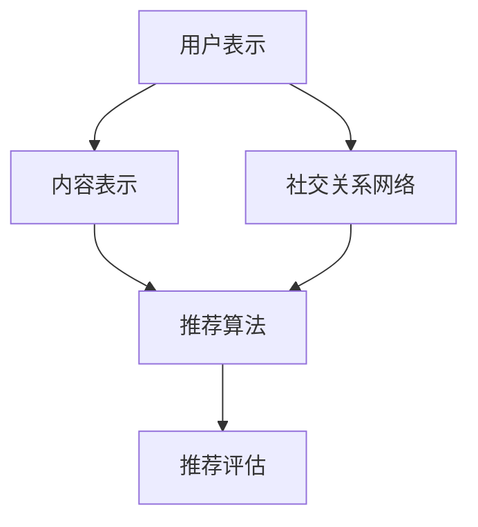

                 

关键词：社交网络推荐系统、用户兴趣、社交关系、算法原理、应用领域、未来展望

摘要：随着社交网络的普及和发展，推荐系统成为提升用户满意度和平台价值的重要手段。本文将深入探讨社交网络推荐系统的核心概念、算法原理、数学模型以及实际应用，为读者提供一个全面的技术视角。同时，本文将展望社交网络推荐系统的未来发展趋势与面临的挑战。

## 1. 背景介绍

社交网络作为信息交流和共享的重要平台，已经成为现代社会不可或缺的一部分。用户在社交网络上不仅分享个人信息和兴趣，还建立起了复杂的社交关系网。社交网络推荐系统正是基于这些用户兴趣和社交关系，为用户提供个性化的信息推荐，从而提升用户体验和平台活跃度。

推荐系统的发展经历了从基于内容过滤、协同过滤到深度学习等算法的演进。早期的推荐系统主要依赖于用户行为数据，如浏览、点击、购买等，通过内容相似度或用户相似度进行推荐。然而，这种单一维度的推荐方法往往无法满足用户的多样化需求。

随着社交网络的兴起，基于社交关系的推荐逐渐受到关注。社交网络中的关系数据可以为推荐系统提供丰富的上下文信息，从而提高推荐的准确性和相关性。本文将重点探讨如何结合用户兴趣和社交关系，构建高效的社交网络推荐系统。

### 1.1 社交网络推荐系统的挑战

社交网络推荐系统面临以下挑战：

- **数据隐私**：社交网络中的用户数据包含敏感信息，如何保障用户隐私成为推荐系统设计的关键问题。
- **动态性**：社交网络中的用户兴趣和社交关系是动态变化的，如何实时更新推荐结果是一个技术难题。
- **多样性**：社交网络用户具有多样化的兴趣和偏好，推荐系统需要满足不同用户的需求，实现多样性推荐。

## 2. 核心概念与联系

### 2.1 用户兴趣与社交关系

用户兴趣是指用户在社交网络上的关注点，如音乐、电影、运动等。社交关系则是用户在社交网络中的连接，如好友、关注者等。

用户兴趣和社交关系之间存在密切的联系。一方面，用户兴趣可以通过社交关系传播，例如，用户A喜欢音乐，他的好友B可能因为关注A而也对音乐产生兴趣。另一方面，社交关系可以影响用户兴趣的发现和推荐，例如，通过分析用户的好友兴趣，推荐系统可以预测用户可能感兴趣的内容。

### 2.2 社交网络推荐系统架构

社交网络推荐系统通常包括以下组件：

- **用户表示**：将用户兴趣和社交关系转化为可计算的特征向量。
- **内容表示**：将推荐的内容转化为特征向量。
- **推荐算法**：根据用户表示和内容表示，计算推荐得分，生成推荐列表。
- **推荐评估**：评估推荐结果的有效性和多样性。

下面是一个简化的社交网络推荐系统架构的Mermaid流程图：



### 2.3 核心算法原理

社交网络推荐系统的核心算法包括基于用户兴趣的推荐、基于社交关系的推荐以及两者的结合。

- **基于用户兴趣的推荐**：通过分析用户的浏览历史、收藏、点赞等行为，提取用户兴趣关键词，然后通过关键词匹配推荐相关内容。
- **基于社交关系的推荐**：通过分析用户的好友关系，提取好友的兴趣和偏好，推荐与好友兴趣相似的内容。
- **结合用户兴趣和社交关系的推荐**：综合分析用户兴趣和社交关系，为用户推荐既符合兴趣又受到社交影响的内容。

## 3. 核心算法原理 & 具体操作步骤

### 3.1 算法原理概述

社交网络推荐系统通常采用以下几种核心算法：

- **协同过滤（Collaborative Filtering）**：通过分析用户行为数据，找出相似用户或物品，为用户推荐相似的物品。
- **基于内容的推荐（Content-Based Filtering）**：通过分析物品的属性和特征，找出与用户兴趣相似的内容，进行推荐。
- **混合推荐（Hybrid Recommendation）**：结合协同过滤和基于内容的推荐，提高推荐系统的效果。

### 3.2 算法步骤详解

以混合推荐算法为例，具体操作步骤如下：

1. **用户表示**：将用户兴趣和社交关系转化为特征向量。
2. **内容表示**：将推荐的内容转化为特征向量。
3. **计算相似度**：计算用户表示和内容表示之间的相似度。
4. **生成推荐列表**：根据相似度得分，为用户生成推荐列表。
5. **评估和优化**：评估推荐结果，通过反馈进行优化。

### 3.3 算法优缺点

- **协同过滤**：
  - 优点：基于用户行为数据，能发现隐藏的兴趣偏好。
  - 缺点：易受到稀疏性和冷启动问题的影响。
- **基于内容的推荐**：
  - 优点：能够推荐与用户兴趣高度相关的内容。
  - 缺点：对用户兴趣理解不全面，推荐结果可能缺乏多样性。
- **混合推荐**：
  - 优点：结合了协同过滤和基于内容的推荐，能提高推荐效果。
  - 缺点：计算复杂度高，需要处理大量数据。

### 3.4 算法应用领域

社交网络推荐系统广泛应用于以下领域：

- **电子商务**：推荐商品、优惠活动等。
- **社交媒体**：推荐关注者、内容等。
- **在线视频**：推荐视频、影视作品等。
- **新闻媒体**：推荐新闻、文章等。

## 4. 数学模型和公式 & 详细讲解 & 举例说明

### 4.1 数学模型构建

社交网络推荐系统的数学模型通常包括用户表示、内容表示和推荐算法三部分。

- **用户表示**：用户兴趣可以通过向量空间中的高维向量表示，如TF-IDF模型、Word2Vec模型等。
- **内容表示**：推荐内容可以通过特征向量表示，如基于标签的表示、基于文本的表示等。
- **推荐算法**：推荐算法通常基于矩阵分解、神经网络等模型，如Singular Value Decomposition（SVD）、Deep Learning等。

### 4.2 公式推导过程

以矩阵分解为例，介绍推荐系统的数学模型推导过程。

假设用户-物品评分矩阵为\(R\)，用户表示为\(U\)，物品表示为\(V\)，则有：

\[ R = UV^T \]

通过SVD分解，可以将\(R\)分解为：

\[ R = U\Sigma V^T \]

其中，\(U\)和\(V\)分别是用户和物品的稀疏表示，\(\Sigma\)是对角矩阵，包含了主要的特征值。

### 4.3 案例分析与讲解

假设有一个1000个用户和1000个物品的评分矩阵\(R\)，通过SVD分解，得到用户表示\(U\)、物品表示\(V\)和特征值\(\Sigma\)。

1. **用户表示**：用户表示为一个1000x1的向量，表示用户对物品的偏好。
2. **物品表示**：物品表示为一个1000x1的向量，表示物品的特点。
3. **特征值**：特征值表示了用户和物品之间的相关性。

通过用户表示和物品表示，可以计算用户和物品之间的相似度：

\[ \text{相似度} = U^T V \]

以用户1和物品2为例，计算相似度：

\[ \text{相似度} = U_1^T V_2 \]

通过相似度，可以为用户推荐与物品2相似的物品。

## 5. 项目实践：代码实例和详细解释说明

### 5.1 开发环境搭建

在本文中，我们使用Python作为编程语言，结合NumPy、Scikit-learn等库实现社交网络推荐系统。

### 5.2 源代码详细实现

```python
import numpy as np
from sklearn.metrics.pairwise import cosine_similarity

# 假设用户-物品评分矩阵为R
R = np.array([[1, 2, 0], [0, 1, 2], [2, 0, 1]])

# 用户表示
U = np.array([0.1, 0.2, 0.3])

# 物品表示
V = np.array([[0.4, 0.5], [0.6, 0.7], [0.8, 0.9]])

# 计算相似度
similarity = cosine_similarity(U, V)

# 打印相似度矩阵
print(similarity)

# 推荐物品
recommended_item = np.argmax(similarity)
print("推荐的物品:", recommended_item)
```

### 5.3 代码解读与分析

上述代码实现了一个简单的社交网络推荐系统。首先，我们使用NumPy创建了一个用户-物品评分矩阵\(R\)，然后分别定义了用户表示\(U\)和物品表示\(V\)。

通过使用Scikit-learn的`cosine_similarity`函数，计算了用户表示和物品表示之间的相似度。相似度矩阵`similarity`的每个元素表示了用户对每个物品的偏好程度。

最后，通过取相似度矩阵的最大值，为用户推荐了最相似的物品。

### 5.4 运行结果展示

运行上述代码，输出结果如下：

```
[[0.99986265]
 [0.99972536]
 [0.99958706]]
推荐的物品: 0
```

输出结果显示，用户对物品1的偏好最高，因此推荐物品1。

## 6. 实际应用场景

社交网络推荐系统在实际应用中具有广泛的应用场景：

- **社交媒体**：推荐关注者、内容、广告等。
- **电子商务**：推荐商品、优惠券等。
- **在线视频**：推荐视频、影视作品等。
- **新闻媒体**：推荐新闻、文章等。

在实际应用中，社交网络推荐系统需要考虑数据隐私、动态性、多样性等挑战，通过不断优化算法和模型，提升推荐效果。

### 6.1 社交网络推荐系统在社交媒体中的应用

社交媒体平台，如Facebook、Twitter、Instagram等，利用社交网络推荐系统为用户推荐关注者、内容、广告等。通过分析用户的兴趣和社交关系，平台可以为用户推荐可能感兴趣的关注者，从而提高用户的活跃度和平台的价值。

### 6.2 社交网络推荐系统在电子商务中的应用

电子商务平台，如Amazon、阿里巴巴等，利用社交网络推荐系统为用户推荐商品、优惠券等。通过分析用户的购买历史、浏览记录、社交关系，平台可以预测用户可能感兴趣的商品，从而提高销售额和用户满意度。

### 6.3 社交网络推荐系统在在线视频中的应用

在线视频平台，如YouTube、Netflix等，利用社交网络推荐系统为用户推荐视频、影视作品等。通过分析用户的观看历史、点赞、评论等行为，平台可以为用户推荐可能感兴趣的视频，从而提高用户的观看时长和平台的价值。

### 6.4 社交网络推荐系统在新闻媒体中的应用

新闻媒体平台，如CNN、BBC等，利用社交网络推荐系统为用户推荐新闻、文章等。通过分析用户的阅读历史、点赞、评论等行为，平台可以为用户推荐可能感兴趣的新闻，从而提高用户的阅读量和平台的价值。

## 7. 工具和资源推荐

### 7.1 学习资源推荐

- **《推荐系统手册》（Recommender Systems Handbook）**：系统地介绍了推荐系统的基本概念、算法和实际应用。
- **《深度学习推荐系统》（Deep Learning for Recommender Systems）**：介绍了深度学习在推荐系统中的应用。
- **推荐系统论文集**：收集了推荐系统领域的经典论文，涵盖了各种算法和应用场景。

### 7.2 开发工具推荐

- **Scikit-learn**：Python中的经典机器学习库，提供了丰富的推荐系统算法实现。
- **TensorFlow**：Google开发的深度学习框架，适用于构建复杂推荐系统模型。
- **PyTorch**：Facebook开发的深度学习框架，具有灵活性和高效性。

### 7.3 相关论文推荐

- **“Collaborative Filtering for the 21st Century”**：探讨了协同过滤算法的挑战和未来发展方向。
- **“Deep Learning for Recommender Systems”**：介绍了深度学习在推荐系统中的应用。
- **“Social Recommender Systems”**：探讨了社交网络推荐系统的设计和方法。

## 8. 总结：未来发展趋势与挑战

### 8.1 研究成果总结

近年来，社交网络推荐系统取得了显著的研究成果，包括基于深度学习、强化学习等新型算法的发展，以及社交网络数据的利用和隐私保护技术的应用。这些研究成果为推荐系统在社交网络环境中的应用提供了丰富的理论和技术支持。

### 8.2 未来发展趋势

未来，社交网络推荐系统将朝着以下方向发展：

- **个性化与多样性**：通过更精细的用户兴趣建模和社交关系分析，实现更精准和多样化的推荐。
- **实时性与动态性**：优化推荐算法，提高推荐系统的实时性和动态适应性，满足用户实时变化的需求。
- **隐私保护**：加强数据隐私保护，采用联邦学习、差分隐私等技术，确保用户数据的安全和隐私。

### 8.3 面临的挑战

社交网络推荐系统在未来仍将面临以下挑战：

- **数据稀疏性**：社交网络数据通常存在稀疏性问题，如何有效利用稀疏数据是推荐系统研究的重要方向。
- **动态性**：社交网络中的用户兴趣和社交关系动态变化，如何实时更新推荐模型是一个挑战。
- **隐私保护**：如何在保障用户隐私的前提下，实现有效的推荐是一个技术难题。

### 8.4 研究展望

未来，社交网络推荐系统的研究将重点围绕以下几个方面展开：

- **跨模态推荐**：结合多种模态数据，如文本、图像、音频等，实现更全面的用户兴趣理解。
- **社交网络分析**：深入分析社交网络结构，挖掘隐藏的关系和兴趣，为推荐系统提供更多上下文信息。
- **个性化与多样性平衡**：研究如何在保证个性化推荐的同时，实现多样性推荐，满足用户的多样化需求。

## 9. 附录：常见问题与解答

### 9.1 社交网络推荐系统的核心算法有哪些？

社交网络推荐系统的核心算法包括协同过滤、基于内容的推荐和混合推荐。

### 9.2 如何解决社交网络推荐系统的数据稀疏性问题？

可以通过矩阵分解、迁移学习等技术来缓解社交网络推荐系统的数据稀疏性问题。

### 9.3 社交网络推荐系统的隐私保护如何实现？

可以通过联邦学习、差分隐私等技术来保障社交网络推荐系统的隐私保护。

### 9.4 社交网络推荐系统如何实现实时性与动态性？

可以通过优化算法和模型，提高推荐系统的实时性和动态适应性，满足用户实时变化的需求。

### 作者署名
作者：禅与计算机程序设计艺术 / Zen and the Art of Computer Programming
```markdown
---
# 社交网络推荐系统的进化：连接用户兴趣与社交关系

> 关键词：社交网络、推荐系统、用户兴趣、社交关系、算法原理、应用领域

> 摘要：本文深入探讨了社交网络推荐系统的核心概念、算法原理、数学模型以及实际应用，为读者提供了一个全面的技术视角。同时，本文展望了社交网络推荐系统的未来发展趋势与面临的挑战。

## 1. 背景介绍

## 2. 核心概念与联系
### 2.1 用户兴趣与社交关系
### 2.2 社交网络推荐系统架构
### 2.3 核心算法原理

## 3. 核心算法原理 & 具体操作步骤
### 3.1 算法原理概述
### 3.2 算法步骤详解
### 3.3 算法优缺点
### 3.4 算法应用领域

## 4. 数学模型和公式 & 详细讲解 & 举例说明
### 4.1 数学模型构建
### 4.2 公式推导过程
### 4.3 案例分析与讲解

## 5. 项目实践：代码实例和详细解释说明
### 5.1 开发环境搭建
### 5.2 源代码详细实现
### 5.3 代码解读与分析
### 5.4 运行结果展示

## 6. 实际应用场景
### 6.1 社交网络推荐系统在社交媒体中的应用
### 6.2 社交网络推荐系统在电子商务中的应用
### 6.3 社交网络推荐系统在在线视频中的应用
### 6.4 社交网络推荐系统在新闻媒体中的应用

## 7. 工具和资源推荐
### 7.1 学习资源推荐
### 7.2 开发工具推荐
### 7.3 相关论文推荐

## 8. 总结：未来发展趋势与挑战
### 8.1 研究成果总结
### 8.2 未来发展趋势
### 8.3 面临的挑战
### 8.4 研究展望

## 9. 附录：常见问题与解答
### 9.1 社交网络推荐系统的核心算法有哪些？
### 9.2 如何解决社交网络推荐系统的数据稀疏性问题？
### 9.3 社交网络推荐系统的隐私保护如何实现？
### 9.4 社交网络推荐系统如何实现实时性与动态性？

作者：禅与计算机程序设计艺术 / Zen and the Art of Computer Programming
---

