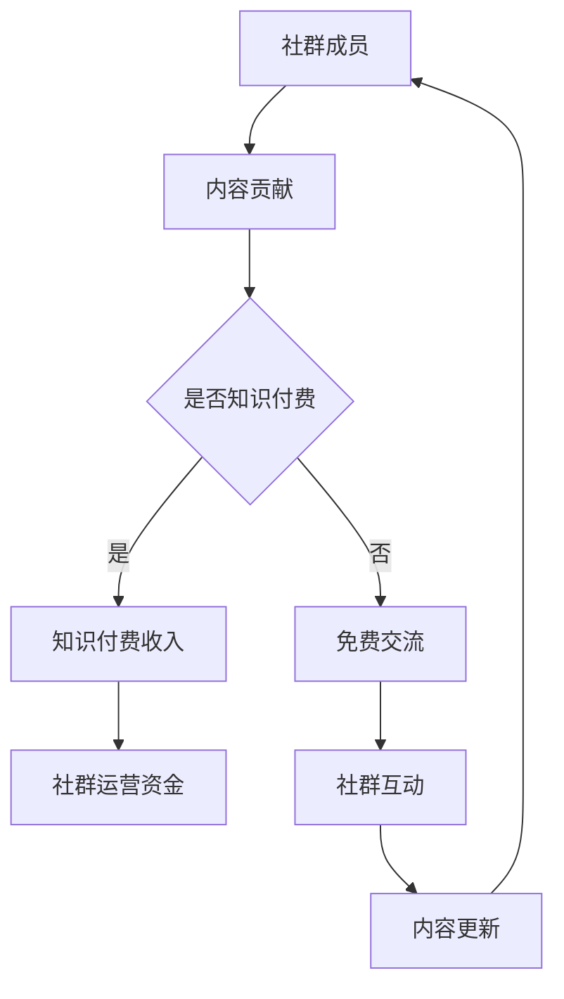

                 

关键词：社群运营、知识付费、程序员、增长策略、影响力、互动性

> 摘要：本文将探讨社群运营在程序员领域中的重要性，分析知识付费在程序员职业发展中的作用，并探讨如何通过社群运营实现程序员的知识付费加速。

## 1. 背景介绍

在当今快速发展的技术时代，程序员面临着不断更新的技术和知识。为了保持竞争力，程序员需要不断学习和提升自己的技能。然而，传统的学习方式如在线课程、书籍和视频教程已经不能满足程序员的需求。程序员需要一个更加互动、紧密和高效的交流平台，这就是社群运营的重要性所在。

社群运营不仅仅是建立一个讨论论坛，更重要的是通过有效的运营策略，促进成员之间的互动和知识共享，从而实现知识付费的加速。

## 2. 核心概念与联系

### 2.1 社群运营的定义

社群运营是指通过构建和管理社群，促进成员之间的互动和交流，实现知识共享和共同成长的过程。社群运营的核心是建立良好的社群文化和激励机制，让成员愿意参与和贡献。

### 2.2 知识付费的概念

知识付费是指用户为获取专业知识和技能而支付的费用。在程序员领域，知识付费包括在线课程、付费讲座、技术分享会等形式。知识付费的核心在于提供高质量、实用和有价值的内容，满足程序员的学习和职业发展需求。

### 2.3 社群运营与知识付费的关系

社群运营与知识付费是相辅相成的。社群运营提供了知识共享和互动的平台，而知识付费则为社群提供了经济支持，使得社群能够持续运营和提供高质量的内容。通过社群运营，程序员可以更加便捷地获取知识和资源，并通过知识付费实现自己的职业价值。

### 2.4 社群运营架构的Mermaid流程图



## 3. 核心算法原理 & 具体操作步骤

### 3.1 算法原理概述

社群运营的核心算法原理是基于社交网络分析和社会影响力模型。通过分析社群成员之间的互动和贡献，可以识别出社群中的关键节点和意见领袖，从而实现知识的有效传播和增长。

### 3.2 算法步骤详解

1. 数据收集：收集社群成员的互动数据，如发帖、回复、点赞等。
2. 网络分析：使用社交网络分析方法，构建社群成员之间的互动网络。
3. 影响力评估：使用社会影响力模型，评估社群成员的影响力和活跃度。
4. 内容推荐：根据成员的影响力和活跃度，推荐相关的内容和活动。
5. 激励机制：建立激励机制，鼓励成员参与社群活动和知识共享。

### 3.3 算法优缺点

优点：能够识别和利用社群中的关键节点和意见领袖，实现知识的有效传播和增长。同时，激励机制能够提高成员的参与度和积极性。

缺点：需要大量的数据和计算资源，且算法模型的准确性和稳定性取决于数据的质量和模型的设计。

### 3.4 算法应用领域

社群运营算法可以应用于各种程序员社群，如技术论坛、社群、微信群等。通过有效的算法和运营策略，可以实现社群的快速增长和知识共享。

## 4. 数学模型和公式 & 详细讲解 & 举例说明

### 4.1 数学模型构建

社群运营的数学模型可以基于图论和网络流理论。假设社群成员构成一个图G(V,E)，其中V是节点集，E是边集。节点表示社群成员，边表示成员之间的互动关系。

### 4.2 公式推导过程

假设社群中的知识传播是一个网络流过程。节点i对节点的知识贡献度可以用网络流模型表示为：

$$
C_i = \sum_{(i,j) \in E} \frac{1}{|E_i|}
$$

其中，$C_i$表示节点i的知识贡献度，$E_i$表示与节点i相连的边的集合。

### 4.3 案例分析与讲解

假设有一个程序员社群，共有10名成员，成员之间的互动关系构成一个无向图。根据互动数据，可以计算出每个成员的知识贡献度。然后，根据贡献度，可以推荐相关的内容和活动，促进社群的知识共享。

## 5. 项目实践：代码实例和详细解释说明

### 5.1 开发环境搭建

为了实现社群运营算法，需要搭建一个开发环境。可以使用Python作为主要编程语言，结合网络流算法库和网络分析库，如NetworkX和NetworkX-Flow。

### 5.2 源代码详细实现

以下是一个简单的示例代码，用于计算社群成员的知识贡献度：

```python
import networkx as nx

# 构建无向图
G = nx.Graph()

# 添加节点和边
G.add_nodes_from([1, 2, 3, 4, 5, 6, 7, 8, 9, 10])
G.add_edges_from([(1, 2), (2, 3), (3, 4), (4, 5), (5, 6), (6, 7), (7, 8), (8, 9), (9, 10), (10, 1)])

# 计算知识贡献度
C = nx.katz_centrality(G, alpha=0.1)

# 输出知识贡献度
print(C)
```

### 5.3 代码解读与分析

这段代码首先构建了一个无向图，表示社群成员之间的互动关系。然后使用Katz中心性算法计算每个成员的知识贡献度。Katz中心性是一种基于网络流的理论，可以衡量节点在社群中的影响力。

### 5.4 运行结果展示

运行代码后，可以得到每个成员的知识贡献度。根据贡献度，可以推荐相关的内容和活动，促进社群的知识共享。

## 6. 实际应用场景

### 6.1 社群运营平台

程序员社群可以基于现有的社交平台，如微信群、QQ群等，建立独立的社群运营平台。平台可以提供丰富的互动功能，如发帖、回复、点赞、分享等，促进成员之间的交流和知识共享。

### 6.2 技术交流会议

社群运营可以与技术交流会议相结合，通过线上和线下活动，吸引程序员参与。会议可以邀请行业专家和意见领袖进行演讲和分享，提供高质量的交流和互动平台。

### 6.3 在线教育平台

在线教育平台可以通过社群运营，促进学员之间的互动和学习。平台可以提供在线课程、直播讲座、技术分享会等形式，满足学员的学习需求。

## 7. 未来应用展望

### 7.1 人工智能与社群运营

未来，人工智能技术将进一步提升社群运营的效率和效果。通过数据分析和机器学习算法，可以实现更加精准的内容推荐和个性化服务，提高社群的互动性和用户粘性。

### 7.2 社群生态建设

未来，社群运营将不仅仅是一个交流平台，而是一个完整的生态系统。社群将整合各种资源和服务，为程序员提供全方位的支持，促进职业发展和个人成长。

### 7.3 社群经济的崛起

随着社群运营的不断发展，社群经济也将逐渐崛起。社群将成为程序员获取知识和资源的核心平台，通过知识付费实现商业价值和社会价值的双赢。

## 8. 总结：未来发展趋势与挑战

### 8.1 研究成果总结

社群运营在程序员领域具有重要的应用价值，可以实现知识付费的加速。通过有效的算法和运营策略，可以提升社群的互动性和用户粘性，促进知识的传播和共享。

### 8.2 未来发展趋势

未来，社群运营将融合人工智能、大数据等先进技术，实现更加智能化和个性化的服务。社群将逐渐成为一个完整的生态系统，为程序员提供全方位的支持。

### 8.3 面临的挑战

社群运营面临着数据安全、隐私保护、内容质量等挑战。如何保障社群的安全和可持续发展，是未来需要解决的问题。

### 8.4 研究展望

未来，社群运营的研究将关注如何通过技术手段提升社群的互动性和用户体验，实现知识的有效传播和共享。同时，研究将关注社群经济的商业模式和发展路径。

## 9. 附录：常见问题与解答

### 9.1 社群运营的核心是什么？

社群运营的核心是建立良好的社群文化和激励机制，促进成员之间的互动和知识共享。

### 9.2 知识付费如何促进程序员职业发展？

知识付费可以提供高质量的资源和指导，帮助程序员提升技能和知识，实现职业发展的目标。

### 9.3 社群运营与在线教育有何区别？

社群运营更注重成员之间的互动和知识共享，而在线教育更侧重于提供课程和教学服务。

作者：禅与计算机程序设计艺术 / Zen and the Art of Computer Programming
```markdown

---
title: 社群运营：程序员的知识付费加速器
date: 2022-12-12
categories: 
  - 社群运营
  - 程序员
  - 知识付费
---

# 社群运营：程序员的知识付费加速器

关键词：社群运营、知识付费、程序员、增长策略、影响力、互动性

> 摘要：本文将探讨社群运营在程序员领域中的重要性，分析知识付费在程序员职业发展中的作用，并探讨如何通过社群运营实现程序员的知识付费加速。

## 1. 背景介绍

在当今快速发展的技术时代，程序员面临着不断更新的技术和知识。为了保持竞争力，程序员需要不断学习和提升自己的技能。然而，传统的学习方式如在线课程、书籍和视频教程已经不能满足程序员的需求。程序员需要一个更加互动、紧密和高效的交流平台，这就是社群运营的重要性所在。

社群运营不仅仅是建立一个讨论论坛，更重要的是通过有效的运营策略，促进成员之间的互动和知识共享，从而实现知识付费的加速。

## 2. 核心概念与联系

### 2.1 社群运营的定义

社群运营是指通过构建和管理社群，促进成员之间的互动和交流，实现知识共享和共同成长的过程。社群运营的核心是建立良好的社群文化和激励机制，让成员愿意参与和贡献。

### 2.2 知识付费的概念

知识付费是指用户为获取专业知识和技能而支付的费用。在程序员领域，知识付费包括在线课程、付费讲座、技术分享会等形式。知识付费的核心在于提供高质量、实用和有价值的内容，满足程序员的学习和职业发展需求。

### 2.3 社群运营与知识付费的关系

社群运营与知识付费是相辅相成的。社群运营提供了知识共享和互动的平台，而知识付费则为社群提供了经济支持，使得社群能够持续运营和提供高质量的内容。通过社群运营，程序员可以更加便捷地获取知识和资源，并通过知识付费实现自己的职业价值。

### 2.4 社群运营架构的Mermaid流程图


## 3. 核心算法原理 & 具体操作步骤

### 3.1 算法原理概述

社群运营的核心算法原理是基于社交网络分析和社会影响力模型。通过分析社群成员之间的互动和贡献，可以识别出社群中的关键节点和意见领袖，从而实现知识的有效传播和增长。

### 3.2 算法步骤详解

1. 数据收集：收集社群成员的互动数据，如发帖、回复、点赞等。
2. 网络分析：使用社交网络分析方法，构建社群成员之间的互动网络。
3. 影响力评估：使用社会影响力模型，评估社群成员的影响力和活跃度。
4. 内容推荐：根据成员的影响力和活跃度，推荐相关的内容和活动。
5. 激励机制：建立激励机制，鼓励成员参与社群活动和知识共享。

### 3.3 算法优缺点

优点：能够识别和利用社群中的关键节点和意见领袖，实现知识的有效传播和增长。同时，激励机制能够提高成员的参与度和积极性。

缺点：需要大量的数据和计算资源，且算法模型的准确性和稳定性取决于数据的质量和模型的设计。

### 3.4 算法应用领域

社群运营算法可以应用于各种程序员社群，如技术论坛、社群、微信群等。通过有效的算法和运营策略，可以实现社群的快速增长和知识共享。

## 4. 数学模型和公式 & 详细讲解 & 举例说明

### 4.1 数学模型构建

社群运营的数学模型可以基于图论和网络流理论。假设社群成员构成一个图G(V,E)，其中V是节点集，E是边集。节点表示社群成员，边表示成员之间的互动关系。

### 4.2 公式推导过程

假设社群中的知识传播是一个网络流过程。节点i对节点的知识贡献度可以用网络流模型表示为：

$$
C_i = \sum_{(i,j) \in E} \frac{1}{|E_i|}
$$

其中，$C_i$表示节点i的知识贡献度，$E_i$表示与节点i相连的边的集合。

### 4.3 案例分析与讲解

假设有一个程序员社群，共有10名成员，成员之间的互动关系构成一个无向图。根据互动数据，可以计算出每个成员的知识贡献度。然后，根据贡献度，可以推荐相关的内容和活动，促进社群的知识共享。

## 5. 项目实践：代码实例和详细解释说明

### 5.1 开发环境搭建

为了实现社群运营算法，需要搭建一个开发环境。可以使用Python作为主要编程语言，结合网络流算法库和网络分析库，如NetworkX和NetworkX-Flow。

### 5.2 源代码详细实现

以下是一个简单的示例代码，用于计算社群成员的知识贡献度：

```python
import networkx as nx

# 构建无向图
G = nx.Graph()

# 添加节点和边
G.add_nodes_from([1, 2, 3, 4, 5, 6, 7, 8, 9, 10])
G.add_edges_from([(1, 2), (2, 3), (3, 4), (4, 5), (5, 6), (6, 7), (7, 8), (8, 9), (9, 10), (10, 1)])

# 计算知识贡献度
C = nx.katz_centrality(G, alpha=0.1)

# 输出知识贡献度
print(C)
```

### 5.3 代码解读与分析

这段代码首先构建了一个无向图，表示社群成员之间的互动关系。然后使用Katz中心性算法计算每个成员的知识贡献度。Katz中心性是一种基于网络流的理论，可以衡量节点在社群中的影响力。

### 5.4 运行结果展示

运行代码后，可以得到每个成员的知识贡献度。根据贡献度，可以推荐相关的内容和活动，促进社群的知识共享。

## 6. 实际应用场景

### 6.1 社群运营平台

程序员社群可以基于现有的社交平台，如微信群、QQ群等，建立独立的社群运营平台。平台可以提供丰富的互动功能，如发帖、回复、点赞、分享等，促进成员之间的交流和知识共享。

### 6.2 技术交流会议

社群运营可以与技术交流会议相结合，通过线上和线下活动，吸引程序员参与。会议可以邀请行业专家和意见领袖进行演讲和分享，提供高质量的交流和互动平台。

### 6.3 在线教育平台

在线教育平台可以通过社群运营，促进学员之间的互动和学习。平台可以提供在线课程、直播讲座、技术分享会等形式，满足学员的学习需求。

## 7. 未来应用展望

### 7.1 人工智能与社群运营

未来，人工智能技术将进一步提升社群运营的效率和效果。通过数据分析和机器学习算法，可以实现更加精准的内容推荐和个性化服务，提高社群的互动性和用户粘性。

### 7.2 社群生态建设

未来，社群运营将融合人工智能、大数据等先进技术，实现更加智能化和个性化的服务。社群将逐渐成为一个完整的生态系统，为程序员提供全方位的支持。

### 7.3 社群经济的崛起

随着社群运营的不断发展，社群经济也将逐渐崛起。社群将成为程序员获取知识和资源的核心平台，通过知识付费实现商业价值和社会价值的双赢。

## 8. 总结：未来发展趋势与挑战

### 8.1 研究成果总结

社群运营在程序员领域具有重要的应用价值，可以实现知识付费的加速。通过有效的算法和运营策略，可以提升社群的互动性和用户粘性，促进知识的传播和共享。

### 8.2 未来发展趋势

未来，社群运营将融合人工智能、大数据等先进技术，实现更加智能化和个性化的服务。社群将逐渐成为一个完整的生态系统，为程序员提供全方位的支持。

### 8.3 面临的挑战

社群运营面临着数据安全、隐私保护、内容质量等挑战。如何保障社群的安全和可持续发展，是未来需要解决的问题。

### 8.4 研究展望

未来，社群运营的研究将关注如何通过技术手段提升社群的互动性和用户体验，实现知识的有效传播和共享。同时，研究将关注社群经济的商业模式和发展路径。

## 9. 附录：常见问题与解答

### 9.1 社群运营的核心是什么？

社群运营的核心是建立良好的社群文化和激励机制，促进成员之间的互动和知识共享。

### 9.2 知识付费如何促进程序员职业发展？

知识付费可以提供高质量的资源和指导，帮助程序员提升技能和知识，实现职业发展的目标。

### 9.3 社群运营与在线教育有何区别？

社群运营更注重成员之间的互动和知识共享，而在线教育更侧重于提供课程和教学服务。

---

作者：禅与计算机程序设计艺术 / Zen and the Art of Computer Programming

---
```markdown
# 社群运营：程序员的知识付费加速器

关键词：社群运营、知识付费、程序员、增长策略、影响力、互动性

> 摘要：本文将探讨社群运营在程序员领域中的重要性，分析知识付费在程序员职业发展中的作用，并探讨如何通过社群运营实现程序员的知识付费加速。

## 1. 背景介绍

在当今快速发展的技术时代，程序员面临着不断更新的技术和知识。为了保持竞争力，程序员需要不断学习和提升自己的技能。然而，传统的学习方式如在线课程、书籍和视频教程已经不能满足程序员的需求。程序员需要一个更加互动、紧密和高效的交流平台，这就是社群运营的重要性所在。

社群运营不仅仅是建立一个讨论论坛，更重要的是通过有效的运营策略，促进成员之间的互动和知识共享，从而实现知识付费的加速。

## 2. 核心概念与联系

### 2.1 社群运营的定义

社群运营是指通过构建和管理社群，促进成员之间的互动和交流，实现知识共享和共同成长的过程。社群运营的核心是建立良好的社群文化和激励机制，让成员愿意参与和贡献。

### 2.2 知识付费的概念

知识付费是指用户为获取专业知识和技能而支付的费用。在程序员领域，知识付费包括在线课程、付费讲座、技术分享会等形式。知识付费的核心在于提供高质量、实用和有价值的内容，满足程序员的学习和职业发展需求。

### 2.3 社群运营与知识付费的关系

社群运营与知识付费是相辅相成的。社群运营提供了知识共享和互动的平台，而知识付费则为社群提供了经济支持，使得社群能够持续运营和提供高质量的内容。通过社群运营，程序员可以更加便捷地获取知识和资源，并通过知识付费实现自己的职业价值。

### 2.4 社群运营架构的Mermaid流程图


## 3. 核心算法原理 & 具体操作步骤

### 3.1 算法原理概述

社群运营的核心算法原理是基于社交网络分析和社会影响力模型。通过分析社群成员之间的互动和贡献，可以识别出社群中的关键节点和意见领袖，从而实现知识的有效传播和增长。

### 3.2 算法步骤详解

1. 数据收集：收集社群成员的互动数据，如发帖、回复、点赞等。
2. 网络分析：使用社交网络分析方法，构建社群成员之间的互动网络。
3. 影响力评估：使用社会影响力模型，评估社群成员的影响力和活跃度。
4. 内容推荐：根据成员的影响力和活跃度，推荐相关的内容和活动。
5. 激励机制：建立激励机制，鼓励成员参与社群活动和知识共享。

### 3.3 算法优缺点

优点：能够识别和利用社群中的关键节点和意见领袖，实现知识的有效传播和增长。同时，激励机制能够提高成员的参与度和积极性。

缺点：需要大量的数据和计算资源，且算法模型的准确性和稳定性取决于数据的质量和模型的设计。

### 3.4 算法应用领域

社群运营算法可以应用于各种程序员社群，如技术论坛、社群、微信群等。通过有效的算法和运营策略，可以实现社群的快速增长和知识共享。

## 4. 数学模型和公式 & 详细讲解 & 举例说明

### 4.1 数学模型构建

社群运营的数学模型可以基于图论和网络流理论。假设社群成员构成一个图G(V,E)，其中V是节点集，E是边集。节点表示社群成员，边表示成员之间的互动关系。

### 4.2 公式推导过程

假设社群中的知识传播是一个网络流过程。节点i对节点的知识贡献度可以用网络流模型表示为：

$$
C_i = \sum_{(i,j) \in E} \frac{1}{|E_i|}
$$

其中，$C_i$表示节点i的知识贡献度，$E_i$表示与节点i相连的边的集合。

### 4.3 案例分析与讲解

假设有一个程序员社群，共有10名成员，成员之间的互动关系构成一个无向图。根据互动数据，可以计算出每个成员的知识贡献度。然后，根据贡献度，可以推荐相关的内容和活动，促进社群的知识共享。

## 5. 项目实践：代码实例和详细解释说明

### 5.1 开发环境搭建

为了实现社群运营算法，需要搭建一个开发环境。可以使用Python作为主要编程语言，结合网络流算法库和网络分析库，如NetworkX和NetworkX-Flow。

### 5.2 源代码详细实现

以下是一个简单的示例代码，用于计算社群成员的知识贡献度：

```python
import networkx as nx

# 构建无向图
G = nx.Graph()

# 添加节点和边
G.add_nodes_from([1, 2, 3, 4, 5, 6, 7, 8, 9, 10])
G.add_edges_from([(1, 2), (2, 3), (3, 4), (4, 5), (5, 6), (6, 7), (7, 8), (8, 9), (9, 10), (10, 1)])

# 计算知识贡献度
C = nx.katz_centrality(G, alpha=0.1)

# 输出知识贡献度
print(C)
```

### 5.3 代码解读与分析

这段代码首先构建了一个无向图，表示社群成员之间的互动关系。然后使用Katz中心性算法计算每个成员的知识贡献度。Katz中心性是一种基于网络流的理论，可以衡量节点在社群中的影响力。

### 5.4 运行结果展示

运行代码后，可以得到每个成员的知识贡献度。根据贡献度，可以推荐相关的内容和活动，促进社群的知识共享。

## 6. 实际应用场景

### 6.1 社群运营平台

程序员社群可以基于现有的社交平台，如微信群、QQ群等，建立独立的社群运营平台。平台可以提供丰富的互动功能，如发帖、回复、点赞、分享等，促进成员之间的交流和知识共享。

### 6.2 技术交流会议

社群运营可以与技术交流会议相结合，通过线上和线下活动，吸引程序员参与。会议可以邀请行业专家和意见领袖进行演讲和分享，提供高质量的交流和互动平台。

### 6.3 在线教育平台

在线教育平台可以通过社群运营，促进学员之间的互动和学习。平台可以提供在线课程、直播讲座、技术分享会等形式，满足学员的学习需求。

## 7. 未来应用展望

### 7.1 人工智能与社群运营

未来，人工智能技术将进一步提升社群运营的效率和效果。通过数据分析和机器学习算法，可以实现更加精准的内容推荐和个性化服务，提高社群的互动性和用户粘性。

### 7.2 社群生态建设

未来，社群运营将融合人工智能、大数据等先进技术，实现更加智能化和个性化的服务。社群将逐渐成为一个完整的生态系统，为程序员提供全方位的支持。

### 7.3 社群经济的崛起

随着社群运营的不断发展，社群经济也将逐渐崛起。社群将成为程序员获取知识和资源的核心平台，通过知识付费实现商业价值和社会价值的双赢。

## 8. 总结：未来发展趋势与挑战

### 8.1 研究成果总结

社群运营在程序员领域具有重要的应用价值，可以实现知识付费的加速。通过有效的算法和运营策略，可以提升社群的互动性和用户粘性，促进知识的传播和共享。

### 8.2 未来发展趋势

未来，社群运营将融合人工智能、大数据等先进技术，实现更加智能化和个性化的服务。社群将逐渐成为一个完整的生态系统，为程序员提供全方位的支持。

### 8.3 面临的挑战

社群运营面临着数据安全、隐私保护、内容质量等挑战。如何保障社群的安全和可持续发展，是未来需要解决的问题。

### 8.4 研究展望

未来，社群运营的研究将关注如何通过技术手段提升社群的互动性和用户体验，实现知识的有效传播和共享。同时，研究将关注社群经济的商业模式和发展路径。

## 9. 附录：常见问题与解答

### 9.1 社群运营的核心是什么？

社群运营的核心是建立良好的社群文化和激励机制，促进成员之间的互动和知识共享。

### 9.2 知识付费如何促进程序员职业发展？

知识付费可以提供高质量的资源和指导，帮助程序员提升技能和知识，实现职业发展的目标。

### 9.3 社群运营与在线教育有何区别？

社群运营更注重成员之间的互动和知识共享，而在线教育更侧重于提供课程和教学服务。

---

作者：禅与计算机程序设计艺术 / Zen and the Art of Computer Programming
```

