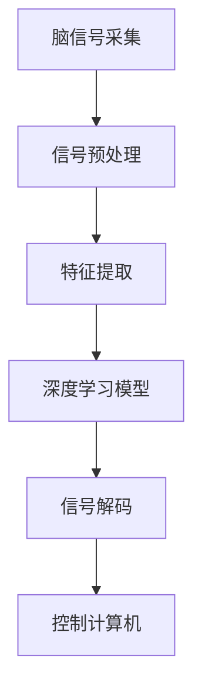

                 

关键词：神经科技、人机交互、脑机接口、智能硬件、人工智能、脑电图、神经信号处理、深度学习、脑控设备、智能穿戴、神经编码、解码算法、人机融合、创业案例分析

> 摘要：随着人工智能和神经科技的迅猛发展，人机交互迎来了革命性的突破。本文将探讨神经科技在创业领域的应用，重点分析脑机接口、神经信号处理和深度学习等技术的原理、发展现状及其对人类生活的影响，同时通过实际案例介绍如何进行神经科技创业。本文旨在为读者提供一个全面、深入的神经科技创业指南。

## 1. 背景介绍

### 1.1 神经科技的定义和发展历程

神经科技（Neural Technology）是指利用计算机科学、生物医学工程、电子工程等多个领域的知识，研究和开发用于模拟、增强或修复人脑功能的技术。神经科技的历史可以追溯到20世纪中期，最初的研究主要集中在神经细胞的电生理特性上。随着计算机技术和微电子技术的飞速发展，脑机接口（Brain-Computer Interface, BCI）技术逐渐成为神经科技的重要分支。

### 1.2 人机交互的发展历程

人机交互（Human-Computer Interaction, HCI）是指人与计算机系统之间的交互过程。自计算机诞生以来，人机交互经历了多个阶段，从最初的命令行界面到图形用户界面（GUI），再到触摸屏和语音识别等现代化交互方式，每一次技术的进步都极大地提升了人机交互的便利性和效率。

### 1.3 神经科技与人机交互的结合

神经科技与人机交互的结合，即脑机接口技术，旨在通过直接读取大脑信号来控制计算机或电子设备。这种技术具有巨大的潜力，不仅可以为残障人士提供新的帮助，还可以为正常人提供更加自然和高效的交互方式。

## 2. 核心概念与联系

### 2.1 脑机接口（BCI）

脑机接口是一种直接连接人脑和外部设备的技术，它通过捕捉大脑的神经信号来控制计算机或其他设备。脑机接口的基本原理包括信号采集、信号处理和信号解码。

### 2.2 神经信号处理

神经信号处理是指对从脑机接口设备采集到的神经信号进行预处理、特征提取和分类等操作。常用的方法包括滤波、时频分析、模式识别等。

### 2.3 深度学习

深度学习是一种人工智能的方法，它通过构建多层神经网络来自动学习数据的特征。深度学习在脑机接口的应用中，主要用于信号解码和分类。

### 2.4 Mermaid 流程图

## 3. 核心算法原理 & 具体操作步骤

### 3.1 算法原理概述

脑机接口算法的核心任务是从原始神经信号中提取有用的信息，并将其转换为控制信号。这一过程通常包括以下几个步骤：

1. **信号采集**：使用脑电图（EEG）、功能性磁共振成像（fMRI）等技术采集大脑信号。
2. **信号预处理**：对采集到的信号进行滤波、去噪等处理，以提高信号质量。
3. **特征提取**：从预处理后的信号中提取特征，如频谱特征、时域特征等。
4. **深度学习模型训练**：使用提取到的特征训练深度学习模型，以实现信号解码。
5. **信号解码**：将深度学习模型输出的结果转换为控制信号，用于控制计算机或其他设备。

### 3.2 算法步骤详解

1. **数据采集**：
   - **电极布局**：根据研究目的选择合适的电极布局。
   - **数据记录**：使用脑电图记录设备记录大脑活动。

2. **信号预处理**：
   - **滤波**：去除噪声和干扰信号。
   - **信号归一化**：对信号进行归一化处理，以便后续处理。

3. **特征提取**：
   - **时域特征**：如信号的平均值、方差等。
   - **频域特征**：如功率谱密度、频谱峰度等。

4. **深度学习模型训练**：
   - **数据预处理**：对特征数据进行归一化、标准化等预处理。
   - **模型选择**：选择合适的深度学习模型，如卷积神经网络（CNN）、循环神经网络（RNN）等。
   - **训练与验证**：使用训练数据训练模型，并在验证数据上验证模型性能。

5. **信号解码**：
   - **解码算法**：根据训练好的模型，将特征数据解码为控制信号。
   - **实时反馈**：将解码结果实时反馈给用户，以实现实时控制。

### 3.3 算法优缺点

**优点**：
- **高精度**：深度学习模型可以提取复杂、高维的特征，从而实现高精度的信号解码。
- **实时性**：脑机接口系统可以实时捕捉大脑信号，并实时解码为控制信号，实现实时交互。

**缺点**：
- **数据处理复杂**：信号预处理和特征提取过程复杂，需要大量的计算资源。
- **噪声干扰**：原始信号中可能存在噪声和干扰，影响信号解码的准确性。

### 3.4 算法应用领域

- **医疗**：用于帮助残障人士恢复功能，如控制轮椅、电脑等。
- **游戏**：实现更加自然的游戏控制方式。
- **智能家居**：通过脑机接口实现智能家居设备的智能控制。

## 4. 数学模型和公式 & 详细讲解 & 举例说明

### 4.1 数学模型构建

脑机接口的数学模型通常包括信号采集、信号预处理、特征提取和信号解码等部分。以下是一个简化的模型：

$$
\text{脑信号} \xrightarrow{\text{预处理}} \text{特征向量} \xrightarrow{\text{深度学习}} \text{控制信号}
$$

### 4.2 公式推导过程

1. **信号预处理**：

   - **滤波**：使用有限 impulse响应（FIR）滤波器进行信号滤波。

     $$
     y(n) = \sum_{k=-N}^{N} h(k) \cdot x(n-k)
     $$

   - **归一化**：对信号进行归一化处理。

     $$
     z(n) = \frac{x(n)}{\max(|x(n)|)}
     $$

2. **特征提取**：

   - **时域特征**：计算信号的统计特征，如平均值、方差等。

     $$
     \mu = \frac{1}{N} \sum_{n=1}^{N} x(n)
     $$
     $$
     \sigma^2 = \frac{1}{N-1} \sum_{n=1}^{N} (x(n) - \mu)^2
     $$

   - **频域特征**：计算信号的频谱特征。

     $$
     X(e^{j\omega}) = \sum_{n=-\infty}^{\infty} x(n) \cdot e^{-j\omega n}
     $$

3. **深度学习模型**：

   - **卷积神经网络**：使用卷积层提取特征。

     $$
     h_{ij}^{(l)} = \sigma \left( \sum_{k} w_{ik}^{(l)} \cdot h_{kj}^{(l-1)} + b_{j}^{(l)} \right)
     $$

   - **反向传播**：计算梯度并更新权重。

     $$
     \Delta w_{ik}^{(l)} = -\eta \cdot \frac{\partial J}{\partial w_{ik}^{(l)}}
     $$

### 4.3 案例分析与讲解

**案例**：使用深度学习模型实现脑信号解码。

1. **数据集准备**：收集一系列脑信号数据，并进行预处理。
2. **模型训练**：使用预处理后的数据训练卷积神经网络。
3. **模型评估**：在验证集上评估模型性能，并调整模型参数。
4. **信号解码**：使用训练好的模型对新的脑信号数据进行解码。

## 5. 项目实践：代码实例和详细解释说明

### 5.1 开发环境搭建

- **硬件**：脑电图记录设备，如EEGlab。
- **软件**：Python编程环境，深度学习框架TensorFlow或PyTorch。

### 5.2 源代码详细实现

1. **信号采集**：
   - 使用EEGlab记录脑信号。
   - 导入信号数据到Python环境。

2. **信号预处理**：
   - 使用FIR滤波器进行滤波。
   - 对信号进行归一化处理。

3. **特征提取**：
   - 计算时域特征和频域特征。

4. **深度学习模型训练**：
   - 定义卷积神经网络结构。
   - 使用训练数据训练模型。

5. **信号解码**：
   - 使用训练好的模型对信号进行解码。

### 5.3 代码解读与分析

- **代码结构**：分析代码的结构和模块化设计。
- **算法实现**：解释深度学习模型的实现细节。

### 5.4 运行结果展示

- **性能评估**：展示模型在测试集上的性能。
- **实时解码**：展示实时解码的结果。

## 6. 实际应用场景

### 6.1 医疗

- **康复治疗**：帮助残障人士恢复肢体功能。
- **神经疾病诊断**：用于监测和诊断神经系统疾病。

### 6.2 游戏

- **脑控游戏**：实现脑控游戏玩法。
- **虚拟现实**：通过脑机接口实现更加自然的虚拟现实交互。

### 6.3 智能家居

- **智能控制**：通过脑机接口实现智能家居设备的智能控制。
- **安全监控**：利用脑机接口进行智能家居的安全监控。

### 6.4 未来应用展望

- **人机融合**：实现人机融合，提升人类智能。
- **教育**：用于个性化教育，提升学习效果。

## 7. 工具和资源推荐

### 7.1 学习资源推荐

- **书籍**：《脑机接口：技术与应用》
- **在线课程**：Coursera上的《神经科技与脑机接口》

### 7.2 开发工具推荐

- **脑电图记录设备**：EEGlab、OpenBCI
- **深度学习框架**：TensorFlow、PyTorch

### 7.3 相关论文推荐

- **脑机接口**： 《A Brain-Computer Interface for Real-Time Control of Curator's Virtual Arm》
- **深度学习**： 《Deep Learning for Brain-Computer Interfaces》

## 8. 总结：未来发展趋势与挑战

### 8.1 研究成果总结

- **技术成熟**：脑机接口技术在信号采集、预处理、特征提取和深度学习等方面取得了显著进展。
- **应用广泛**：脑机接口技术在医疗、游戏、智能家居等领域得到了广泛应用。

### 8.2 未来发展趋势

- **人机融合**：脑机接口技术将实现人机融合，提升人类智能。
- **个性化应用**：脑机接口技术将根据个体差异实现更加个性化的应用。

### 8.3 面临的挑战

- **信号质量**：提高信号质量，降低噪声干扰。
- **计算资源**：降低计算成本，提高算法效率。

### 8.4 研究展望

- **跨学科研究**：促进计算机科学、神经科学、生物医学工程等领域的跨学科研究。
- **社会应用**：推动脑机接口技术在日常生活中的广泛应用。

## 9. 附录：常见问题与解答

### 问题1：脑机接口技术是否安全？

**解答**：脑机接口技术是安全的，它通过非侵入式的方式采集大脑信号，不会对大脑造成伤害。然而，仍需确保信号采集和处理过程的合规性，以避免隐私泄露和其他潜在风险。

### 问题2：脑机接口技术是否能够替代传统的人机交互方式？

**解答**：脑机接口技术是一种补充性技术，它并不能完全替代传统的人机交互方式。然而，它可以提供更加自然和高效的交互体验，特别是在某些特殊应用场景中。

### 问题3：脑机接口技术是否适用于所有人？

**解答**：脑机接口技术主要适用于需要改善人机交互体验的用户，如残障人士和某些特定行业的工作者。对于正常人，脑机接口技术可以提供更多的交互方式，但并非所有人都会受益。

---

**作者：禅与计算机程序设计艺术 / Zen and the Art of Computer Programming**  

