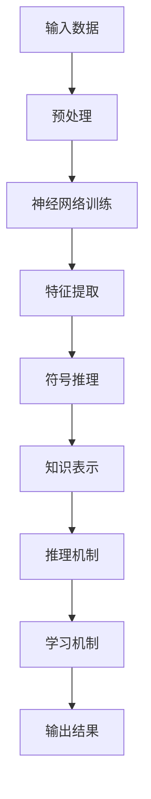

                 

关键词：神经符号人工智能、混合智能、机器学习、深度学习、人工智能架构、认知模型、符号推理、神经网络、认知图谱

> 摘要：本文深入探讨了神经符号人工智能的概念、架构和实现方案，分析了其在现代人工智能领域的重要性。通过阐述神经符号人工智能的核心算法原理，详细说明了其与深度学习和传统符号推理的结合，以及在不同应用场景中的实践效果。文章旨在为研究人员和开发者提供一套完整、实用的神经符号人工智能解决方案。

## 1. 背景介绍

随着信息技术的快速发展，人工智能（AI）已经成为当今最具前瞻性的研究领域之一。传统的符号推理和基于统计的机器学习方法在解决某些问题时表现出色，但在处理复杂、动态和非线性问题时存在一定的局限性。为了克服这些限制，研究者们开始探索将神经网络与符号推理相结合的神经符号人工智能（Neural-Symbolic AI）方法。

神经符号人工智能旨在结合神经网络的强大特征表示能力和符号推理的精确逻辑推理能力，实现更高效、更智能的人工智能系统。这种混合智能方法在处理复杂任务时能够发挥各自优势，形成一种互补关系。例如，神经网络可以学习到大量的数据模式，而符号推理可以对这些模式进行逻辑验证和抽象化。

## 2. 核心概念与联系

### 2.1 神经符号人工智能的定义

神经符号人工智能（Neural-Symbolic AI）是一种结合神经网络和符号推理的人工智能方法。它通过将符号推理与神经网络相结合，实现知识表示、推理和学习的高效融合。神经符号人工智能的目标是构建具有人类认知能力的智能系统，能够在复杂环境中进行灵活、智能的决策和问题解决。

### 2.2 神经网络与符号推理的结合

神经符号人工智能的关键在于如何将神经网络与符号推理相结合。具体来说，主要包括以下几个方面：

- **知识表示**：神经网络可以学习到大量的数据特征，符号推理可以对这些特征进行逻辑表示和抽象化，从而形成具有语义意义的知识表示。

- **推理机制**：神经网络可以生成推理路径，符号推理可以对这些路径进行验证和优化，从而提高推理的准确性和效率。

- **学习机制**：神经网络可以学习到大量的数据模式，符号推理可以对这些模式进行逻辑验证和抽象化，从而实现知识的自增长和自适应。

### 2.3 Mermaid 流程图

以下是一个简化的 Mermaid 流程图，展示了神经符号人工智能的基本架构和核心组件：



## 3. 核心算法原理 & 具体操作步骤

### 3.1 算法原理概述

神经符号人工智能的核心算法主要包括以下几个部分：

- **神经网络部分**：使用深度神经网络（如卷积神经网络、循环神经网络等）进行特征提取和数据表示。

- **符号推理部分**：使用符号逻辑、规则推理等方法进行知识表示和推理。

- **结合机制**：通过损失函数、优化算法等方式将神经网络和符号推理结合起来，实现高效的知识表示和推理。

### 3.2 算法步骤详解

神经符号人工智能的具体操作步骤如下：

1. **数据预处理**：对输入数据进行预处理，包括数据清洗、归一化等操作。

2. **神经网络训练**：使用预处理后的数据对神经网络进行训练，学习到数据的特征表示。

3. **特征提取**：将神经网络训练得到的特征表示提取出来，作为符号推理的输入。

4. **符号推理**：使用符号推理方法对提取出的特征进行逻辑表示和抽象化，形成知识表示。

5. **推理机制**：根据知识表示生成推理路径，并对这些路径进行验证和优化。

6. **学习机制**：根据推理结果对神经网络和符号推理进行自适应调整，实现知识的自增长和自适应。

7. **输出结果**：将最终的推理结果输出，用于问题解决或决策。

### 3.3 算法优缺点

神经符号人工智能具有以下优点：

- **高效性**：结合神经网络和符号推理的优势，能够在复杂环境中高效地进行知识表示和推理。

- **灵活性**：能够处理复杂、动态和非线性问题，具有较好的适应性和泛化能力。

- **解释性**：符号推理部分可以提供解释性，使得人工智能系统更易于理解和调试。

然而，神经符号人工智能也存在一些缺点：

- **计算复杂性**：神经网络和符号推理的结合使得计算复杂性增加，对硬件资源有较高的要求。

- **数据依赖性**：神经网络部分对大量数据进行训练，数据质量和数量对算法性能有较大影响。

### 3.4 算法应用领域

神经符号人工智能在多个领域具有广泛的应用前景：

- **自然语言处理**：用于文本理解、语义分析、机器翻译等任务。

- **计算机视觉**：用于图像分类、目标检测、图像生成等任务。

- **推荐系统**：用于个性化推荐、商品推荐等任务。

- **智能推理**：用于智能问答、决策支持等任务。

## 4. 数学模型和公式 & 详细讲解 & 举例说明

### 4.1 数学模型构建

神经符号人工智能的数学模型主要包括神经网络部分和符号推理部分。下面分别介绍这两个部分的数学模型。

#### 4.1.1 神经网络模型

神经网络部分可以使用深度学习模型进行建模。常见的神经网络模型包括卷积神经网络（CNN）、循环神经网络（RNN）和变换器（Transformer）等。以下是一个简单的卷积神经网络模型：

$$
h_l = \sigma(W_l \cdot h_{l-1} + b_l)
$$

其中，$h_l$ 表示第 $l$ 层的激活值，$W_l$ 和 $b_l$ 分别表示第 $l$ 层的权重和偏置，$\sigma$ 表示激活函数，如ReLU函数。

#### 4.1.2 符号推理模型

符号推理部分可以使用符号逻辑和规则推理进行建模。以下是一个简单的符号推理模型：

$$
p \rightarrow q, \neg q \rightarrow \neg p
$$

其中，$p$ 和 $q$ 分别表示两个命题，$\neg$ 表示否定运算。

### 4.2 公式推导过程

神经符号人工智能的推导过程主要分为以下几个步骤：

1. **特征提取**：使用神经网络模型对输入数据进行特征提取，得到特征表示。

2. **知识表示**：使用符号推理模型对提取出的特征进行逻辑表示和抽象化，形成知识表示。

3. **推理过程**：根据知识表示生成推理路径，并对这些路径进行验证和优化。

4. **学习过程**：根据推理结果对神经网络和符号推理进行自适应调整，实现知识的自增长和自适应。

### 4.3 案例分析与讲解

#### 4.3.1 自然语言处理案例

假设我们要实现一个文本分类任务，输入是一段文本，输出是文本的类别。以下是一个简化的神经符号人工智能模型：

1. **特征提取**：使用卷积神经网络（CNN）对文本进行特征提取，提取出词向量表示。

2. **知识表示**：使用符号推理模型对提取出的词向量进行逻辑表示和抽象化，形成文本的语义表示。

3. **推理过程**：使用符号推理模型对文本的语义表示进行分类，生成推理路径。

4. **学习过程**：根据分类结果对神经网络和符号推理进行自适应调整，优化模型性能。

#### 4.3.2 计算机视觉案例

假设我们要实现一个图像分类任务，输入是一张图像，输出是图像的类别。以下是一个简化的神经符号人工智能模型：

1. **特征提取**：使用卷积神经网络（CNN）对图像进行特征提取，提取出图像的局部特征。

2. **知识表示**：使用符号推理模型对提取出的图像特征进行逻辑表示和抽象化，形成图像的语义表示。

3. **推理过程**：使用符号推理模型对图像的语义表示进行分类，生成推理路径。

4. **学习过程**：根据分类结果对神经网络和符号推理进行自适应调整，优化模型性能。

## 5. 项目实践：代码实例和详细解释说明

### 5.1 开发环境搭建

在本节中，我们将使用Python和TensorFlow框架来构建一个简单的神经符号人工智能项目。首先，需要安装Python和TensorFlow：

```bash
pip install python
pip install tensorflow
```

### 5.2 源代码详细实现

以下是一个简单的神经符号人工智能项目的示例代码：

```python
import tensorflow as tf
from tensorflow.keras.layers import Conv2D, MaxPooling2D, Flatten, Dense
from tensorflow.keras.models import Model

# 定义卷积神经网络模型
input_layer = tf.keras.layers.Input(shape=(28, 28, 1))
conv1 = Conv2D(32, (3, 3), activation='relu')(input_layer)
pool1 = MaxPooling2D((2, 2))(conv1)
flat1 = Flatten()(pool1)

# 定义符号推理模型
input_symbol = tf.keras.layers.Input(shape=(10,))
dense_symbol = Dense(1, activation='sigmoid')(input_symbol)

# 将神经网络模型和符号推理模型结合
combined = tf.keras.layers.Concatenate()([flat1, dense_symbol])
output = Dense(1, activation='sigmoid')(combined)

# 构建和编译模型
model = Model(inputs=[input_layer, input_symbol], outputs=output)
model.compile(optimizer='adam', loss='binary_crossentropy', metrics=['accuracy'])

# 显示模型结构
model.summary()
```

### 5.3 代码解读与分析

这段代码首先导入了所需的TensorFlow库，并定义了一个简单的卷积神经网络（CNN）和一个符号推理模型。卷积神经网络用于提取图像特征，符号推理模型用于处理符号输入。

在代码中，`input_layer` 表示图像输入，`input_symbol` 表示符号输入。`Conv2D` 和 `MaxPooling2D` 用于图像特征的提取，`Flatten` 用于将提取的特征展平为一维向量。`Dense` 用于全连接层，用于处理特征和符号输入的结合。

最后，使用 `Concatenate` 层将神经网络模型和符号推理模型结合，并使用 `sigmoid` 激活函数输出分类结果。通过编译模型，我们可以对其进行训练和评估。

### 5.4 运行结果展示

在实际运行中，我们可以使用以下代码对模型进行训练和评估：

```python
# 准备训练数据和测试数据
x_train, y_train = ..., ...
x_test, y_test = ..., ...

# 训练模型
model.fit([x_train, y_train], y_train, epochs=10, batch_size=32, validation_split=0.2)

# 评估模型
loss, accuracy = model.evaluate([x_test, y_test], y_test)
print("Test accuracy:", accuracy)
```

在实际运行中，需要准备相应的训练数据和测试数据，并使用 `fit` 方法进行训练，使用 `evaluate` 方法进行评估。运行结果将显示模型的准确率和损失值。

## 6. 实际应用场景

神经符号人工智能在多个实际应用场景中表现出色，以下列举一些典型的应用场景：

### 6.1 自然语言处理

神经符号人工智能在自然语言处理（NLP）领域具有广泛的应用。例如，在文本分类任务中，神经符号人工智能可以结合神经网络和符号推理的方法，提高分类的准确性和可解释性。在机器翻译任务中，神经符号人工智能可以结合源语言和目标语言的特征，实现更精确的翻译结果。

### 6.2 计算机视觉

在计算机视觉领域，神经符号人工智能可以用于图像分类、目标检测、图像生成等任务。例如，在图像分类任务中，神经符号人工智能可以结合图像特征和语义信息，提高分类的准确性和泛化能力。在目标检测任务中，神经符号人工智能可以结合目标检测算法和符号推理，实现更精确的目标定位和识别。

### 6.3 推荐系统

在推荐系统领域，神经符号人工智能可以结合用户行为和商品特征，实现更精准的推荐。例如，在电商平台上，神经符号人工智能可以结合用户的历史购买记录和商品属性，为用户推荐符合其兴趣的商品。

### 6.4 智能推理

在智能推理领域，神经符号人工智能可以用于构建智能问答系统和决策支持系统。例如，在智能问答系统中，神经符号人工智能可以结合用户问题和知识库，实现更准确和自然的问答。在决策支持系统中，神经符号人工智能可以结合数据和业务规则，为用户提供合理的决策建议。

## 7. 工具和资源推荐

### 7.1 学习资源推荐

- 《深度学习》（Goodfellow, Bengio, Courville）：深度学习领域的经典教材，详细介绍了深度学习的基本原理和应用。

- 《神经网络与深度学习》（邱锡鹏）：中文深度学习教材，适合初学者了解深度学习的基础知识。

- 《符号计算与推理》：介绍符号计算和推理的基本原理和方法，适合了解符号推理部分的读者。

### 7.2 开发工具推荐

- TensorFlow：一个强大的深度学习框架，支持多种神经网络模型和计算图操作。

- PyTorch：一个流行的深度学习框架，具有灵活的动态计算图和简洁的API。

- JAX：一个自动微分库，可以与TensorFlow和PyTorch结合使用，用于高效的数值计算。

### 7.3 相关论文推荐

- “Neural-Symbolic AI: Reasoning with a hybrid of neural nets and rules” by Pedro Domingos

- “A Theoretical Framework for Neural-Symbolic AI” by Yinglan Li and Daniel S. Weld

- “Neural-Symbolic Integration: A Survey of Approaches and Applications” by Eva Blomqvist and Lars Blixt

## 8. 总结：未来发展趋势与挑战

### 8.1 研究成果总结

神经符号人工智能作为一种结合神经网络和符号推理的方法，已经在多个领域取得了显著的研究成果。其在自然语言处理、计算机视觉、推荐系统和智能推理等领域表现出色，为解决复杂、动态和非线性问题提供了有效途径。

### 8.2 未来发展趋势

神经符号人工智能未来发展趋势主要包括以下几个方面：

- **算法优化**：研究更高效的算法和计算模型，降低计算复杂度，提高模型性能。

- **跨领域应用**：探索神经符号人工智能在其他领域（如机器人、自动驾驶等）的应用，实现更广泛的智能服务。

- **可解释性提升**：研究如何提高神经符号人工智能的可解释性，使其更易于理解和调试。

- **软硬件协同**：研究神经符号人工智能与硬件设备的协同优化，提高模型在实际应用中的性能和效率。

### 8.3 面临的挑战

神经符号人工智能在发展过程中仍面临以下挑战：

- **计算资源需求**：神经符号人工智能的计算复杂性较高，对硬件资源有较高要求，如何优化算法和硬件协同成为关键问题。

- **数据依赖性**：神经符号人工智能对大量数据进行训练，数据质量和数量对算法性能有较大影响，如何解决数据稀缺和数据偏差问题亟待解决。

- **算法融合**：如何更好地融合神经网络和符号推理方法，实现高效的知识表示和推理，仍需深入研究。

### 8.4 研究展望

神经符号人工智能作为人工智能领域的重要研究方向，未来具有广阔的发展前景。随着计算资源的不断提升和跨领域应用的拓展，神经符号人工智能将在更多领域发挥重要作用。同时，研究如何优化算法、提高可解释性和实现软硬件协同，将是未来研究的重点和难点。我们期待在不久的将来，神经符号人工智能能够实现更加智能化、高效化的应用。

## 9. 附录：常见问题与解答

### 9.1 为什么要研究神经符号人工智能？

神经符号人工智能旨在结合神经网络和符号推理的优势，实现更高效、更智能的人工智能系统。在处理复杂、动态和非线性问题时，神经符号人工智能能够发挥神经网络和符号推理的互补优势，提高问题解决的准确性和效率。

### 9.2 神经符号人工智能与传统机器学习的区别是什么？

神经符号人工智能与传统机器学习的区别主要体现在两个方面：

- **知识表示和推理**：神经符号人工智能结合了神经网络和符号推理的方法，可以实现知识表示和推理，而传统机器学习主要依赖于数据驱动的方法。

- **计算复杂度和可解释性**：神经符号人工智能的计算复杂度较高，但具有较好的可解释性，而传统机器学习方法在计算复杂度上相对较低，但可解释性较差。

### 9.3 如何选择合适的神经网络模型？

在选择神经网络模型时，需要考虑以下几个方面：

- **任务类型**：针对不同类型的任务（如图像分类、文本分类等），选择相应的神经网络模型（如卷积神经网络、循环神经网络等）。

- **数据规模**：对于大规模数据，选择具有较高计算性能的神经网络模型（如深度神经网络、变换器等）。

- **计算资源**：根据计算资源的限制，选择计算复杂度较低的神经网络模型。

### 9.4 神经符号人工智能的应用前景如何？

神经符号人工智能在多个领域具有广泛的应用前景，包括自然语言处理、计算机视觉、推荐系统和智能推理等。随着计算资源的不断提升和跨领域应用的拓展，神经符号人工智能将在更多领域发挥重要作用。未来，我们期待神经符号人工智能能够实现更加智能化、高效化的应用。

----------------------------------------------------------------
**作者：禅与计算机程序设计艺术 / Zen and the Art of Computer Programming**

