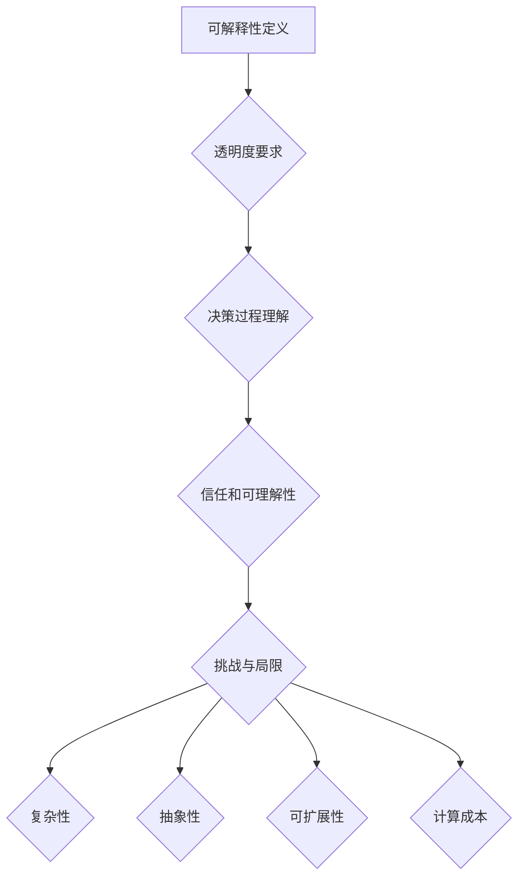
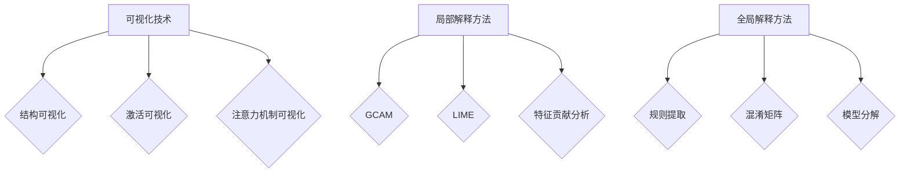

                 

 在人工智能（AI）迅猛发展的时代，深度学习作为机器学习的一个重要分支，已经成为构建智能系统的核心技术。神经网络（Neural Networks，NN）作为深度学习的基础模型，在图像识别、自然语言处理、语音识别等领域取得了显著成就。然而，神经网络的“黑盒”特性使得其决策过程往往难以解释，这在许多应用场景中引发了担忧。本文旨在探讨神经网络可解释性（Neural Network Interpretablity）的重要性和实现方法，帮助读者了解如何打开AI黑盒，提升模型的可解释性和可信度。

## 关键词

- 神经网络
- 可解释性
- 黑盒
- 透明度
- 人工智能
- 模型解释

## 摘要

本文介绍了神经网络的可解释性及其重要性。首先，我们回顾了神经网络的背景和核心概念，接着探讨了神经网络可解释性的定义和挑战。随后，本文详细介绍了几种常见的神经网络可解释性方法，包括可视化技术、局部解释方法和全局解释方法。最后，我们探讨了神经网络可解释性在实际应用中的挑战和未来发展方向。

## 1. 背景介绍

### 1.1 神经网络的发展历程

神经网络的概念最早可以追溯到1940年代，由心理学家McCulloch和数学家Pitts提出。他们提出了简单的人工神经元模型，即MCP模型，作为模拟生物神经元的初步尝试。然而，早期的神经网络由于计算能力和数据集的限制，并没有得到广泛应用。

直到1980年代，随着计算机技术的飞速发展和大数据的涌现，神经网络研究开始逐渐复兴。1986年，Rumelhart、Hinton和Williams提出了反向传播算法（Backpropagation Algorithm），使神经网络训练变得可行。反向传播算法通过反向传播误差梯度，优化神经网络参数，从而提高了模型的准确性和效率。

进入21世纪，深度学习作为神经网络的一个分支，逐渐崭露头角。深度学习模型通过堆叠多层神经网络，实现了对复杂数据的高效表示和建模。特别是2012年，Hinton等人提出的深度卷积神经网络（Deep Convolutional Neural Network，DCNN）在ImageNet图像识别挑战赛中取得了突破性成绩，深度学习开始成为人工智能研究的热点。

### 1.2 神经网络的基本概念

神经网络是一种模拟生物神经系统的计算模型，由大量简单的人工神经元组成。每个神经元接收来自其他神经元的输入信号，通过激活函数计算输出信号。神经网络通过学习输入输出数据之间的映射关系，实现函数逼近和分类任务。

神经网络的主要组成部分包括：

1. **输入层**：接收外部输入数据。
2. **隐藏层**：多层神经网络中的中间层，用于对输入数据进行特征提取和变换。
3. **输出层**：产生最终输出结果。

神经元之间的连接权重（weights）和激活函数（activation function）是神经网络训练过程中的关键参数。通过不断调整这些参数，神经网络可以优化其性能，实现复杂的任务。

### 1.3 神经网络的应用领域

神经网络在人工智能领域具有广泛的应用。以下是一些主要的领域：

1. **计算机视觉**：图像识别、目标检测、图像生成等。
2. **自然语言处理**：文本分类、情感分析、机器翻译等。
3. **语音识别**：语音信号处理、语音合成等。
4. **推荐系统**：个性化推荐、广告投放等。
5. **医学诊断**：疾病预测、图像诊断等。
6. **金融风控**：信用评分、股票预测等。

### 1.4 神经网络的“黑盒”特性

尽管神经网络在许多领域取得了显著成就，但其“黑盒”特性仍然是一个亟待解决的问题。所谓“黑盒”，是指神经网络在接收到输入数据后，通过复杂的内部计算过程，产生输出结果，但无法直观地解释其决策过程。这种特性使得神经网络的应用受到一定的限制：

1. **可信度问题**：神经网络的决策过程不透明，难以解释，可能导致用户对其可靠性产生怀疑。
2. **责任归属问题**：在涉及生命安全和法律法规的领域，如自动驾驶、医疗诊断等，需要明确责任归属，而神经网络的可解释性不足可能导致责任难以界定。
3. **可解释性和透明度需求**：在金融、医疗、司法等敏感领域，决策过程需要具备可解释性和透明度，以保障用户权益和社会公正。

因此，研究神经网络的可解释性方法，成为当前人工智能领域的一个重要课题。

## 2. 核心概念与联系

### 2.1 可解释性的定义

可解释性（Interpretability）是指模型决策过程的透明度和可理解性。在机器学习领域，可解释性旨在揭示模型内部机制和决策过程，使模型能够被用户理解和信任。

### 2.2 可解释性与透明度

可解释性通常与透明度（Transparency）密切相关。透明度指的是模型内部操作的可视化和可理解程度。高透明度的模型，其决策过程容易理解，用户可以直观地看到模型是如何对输入数据进行处理，并最终生成输出结果的。

### 2.3 可解释性的挑战

尽管可解释性在人工智能领域具有重要意义，但实现神经网络的可解释性仍然面临诸多挑战：

1. **复杂性**：神经网络包含大量参数和层次结构，其决策过程高度复杂，难以直观解释。
2. **抽象性**：神经网络通过非线性变换和学习复杂特征，其表示能力强大，但这也使得模型变得抽象，难以与具体应用场景相对应。
3. **可扩展性**：现有的可解释性方法往往针对特定类型的神经网络和应用场景，难以泛化到其他模型和任务。
4. **计算成本**：一些可解释性方法需要额外的计算资源和时间，可能影响模型的训练和部署效率。

### 2.4 可解释性与可预测性

可解释性并不总是与可预测性（Predictability）一致。一个高度可解释的模型可能在某些情况下具有较高的可预测性，但并不代表其在所有情况下都能保持稳定的预测性能。相反，一些复杂的模型可能表现出较高的预测性能，但难以解释其决策过程。

因此，实现神经网络的可解释性需要在可解释性和可预测性之间寻找平衡，以满足不同应用场景的需求。

### 2.5 Mermaid 流程图



## 3. 核心算法原理 & 具体操作步骤

### 3.1 算法原理概述

神经网络可解释性研究主要包括以下几种方法：

1. **可视化技术**：通过可视化神经网络内部结构和参数，帮助用户理解模型决策过程。
2. **局部解释方法**：针对特定输入数据，分析模型在该数据上的决策过程，揭示关键特征和决策因素。
3. **全局解释方法**：分析神经网络在整体上的决策过程，提供模型的全局可解释性。

### 3.2 算法步骤详解

#### 3.2.1 可视化技术

1. **结构可视化**：展示神经网络的层次结构、神经元连接和权重。
2. **激活可视化**：展示神经元在不同层次上的激活状态，帮助理解特征提取和变换过程。
3. **注意力机制可视化**：对于具备注意力机制的神经网络，展示注意力分配情况，揭示模型关注的重点区域。

#### 3.2.2 局部解释方法

1. **梯度加权类内散度（Gradient-weighted Class Activation Mapping，GCAM）**：
   - 计算输入数据在神经网络各个层次的梯度。
   - 根据梯度值，对特征图进行加权，生成类内散度图。
   - 类内散度图揭示了模型对输入数据的关注区域。

2. **局部可解释模型（Local Interpretable Model-agnostic Explanations，LIME）**：
   - 将复杂模型表示为简单线性模型，以便解释。
   - 对输入数据进行扰动，生成一系列近似样本。
   - 分析扰动样本在简单线性模型上的输出，提供局部解释。

3. **特征贡献分析（Feature Importance Analysis）**：
   - 计算特征在模型预测中的重要性。
   - 通过排序和可视化，揭示关键特征。

#### 3.2.3 全局解释方法

1. **规则提取（Rule Extraction）**：
   - 从神经网络中提取可解释的规则和决策边界。
   - 通过规则推理，解释模型的决策过程。

2. **混淆矩阵（Confusion Matrix）**：
   - 分析模型在各类别上的预测分布，揭示分类错误的原因。
   - 结合其他解释方法，提供全局解释。

3. **模型分解（Model Decomposition）**：
   - 将神经网络分解为多个子模型，每个子模型负责一部分决策。
   - 分析子模型在决策过程中的贡献，提供全局解释。

### 3.3 算法优缺点

#### 3.3.1 可视化技术

**优点**：
- 直观易懂，有助于用户快速理解模型决策过程。
- 不依赖于模型结构，适用于不同类型的神经网络。

**缺点**：
- 可解释性有限，难以揭示模型内部复杂的非线性关系。
- 可视化结果可能受数据分布和模型参数的影响。

#### 3.3.2 局部解释方法

**优点**：
- 针对特定输入数据，提供详细的局部解释。
- 可解释性较高，有助于理解模型对特定数据的决策过程。

**缺点**：
- 计算成本较高，可能影响模型训练和部署效率。
- 对模型结构和任务特定，难以泛化到其他场景。

#### 3.3.3 全局解释方法

**优点**：
- 提供模型的全局可解释性，有助于理解模型的总体决策过程。
- 对模型结构和任务不敏感，适用于不同类型的神经网络。

**缺点**：
- 可解释性较低，难以揭示模型内部复杂的非线性关系。
- 对计算资源和时间要求较高，可能影响模型训练和部署效率。

### 3.4 算法应用领域

神经网络可解释性方法在多个应用领域中具有广泛的应用：

1. **金融风控**：通过分析模型的决策过程，识别高风险客户和交易，提升风控效果。
2. **医疗诊断**：解释模型的诊断结果，帮助医生理解疾病成因和治疗方案。
3. **自动驾驶**：解释模型的决策过程，确保自动驾驶系统的安全性和可靠性。
4. **个性化推荐**：分析模型的推荐机制，提高推荐系统的透明度和用户满意度。
5. **法律判决**：解释模型的判决过程，确保司法公正和透明。

### 3.5 Mermaid 流程图



## 4. 数学模型和公式 & 详细讲解 & 举例说明

### 4.1 数学模型构建

神经网络可解释性方法的数学模型主要涉及以下几个方面：

1. **梯度计算**：计算输入数据在神经网络各个层次的梯度，用于生成局部解释。
2. **线性化**：将复杂模型线性化，便于分析模型内部结构和特征贡献。
3. **规则提取**：从神经网络中提取可解释的规则和决策边界。

### 4.2 公式推导过程

以下分别介绍这些数学模型的推导过程：

#### 4.2.1 梯度计算

假设神经网络由多层神经元组成，每个神经元接收来自前一层的输入信号，并通过激活函数计算输出信号。设输入层、隐藏层和输出层的神经元分别为 \( x_0 \)，\( x_l \) 和 \( x_m \)，其中 \( l \) 和 \( m \) 分别为隐藏层和输出层的层数。

输入层到隐藏层的梯度计算公式如下：

$$
\frac{\partial L}{\partial x_l} = \frac{\partial L}{\partial z_l} \cdot \frac{\partial z_l}{\partial x_l}
$$

其中，\( L \) 为损失函数，\( z_l \) 为隐藏层神经元的输出，\( x_l \) 为隐藏层神经元的输入。

隐藏层到输出层的梯度计算公式如下：

$$
\frac{\partial L}{\partial x_m} = \frac{\partial L}{\partial z_m} \cdot \frac{\partial z_m}{\partial x_m}
$$

其中，\( z_m \) 为输出层神经元的输出，\( x_m \) 为输出层神经元的输入。

#### 4.2.2 线性化

线性化是将复杂模型转化为线性模型的过程，便于分析模型内部结构和特征贡献。

假设神经网络的输出 \( y \) 可以表示为：

$$
y = \sum_{i=1}^{n} w_i f(x_i)
$$

其中，\( w_i \) 为权重，\( f(x_i) \) 为非线性函数。

将 \( y \) 线性化，可以得到：

$$
y \approx \sum_{i=1}^{n} w_i f'(x_i) x_i
$$

其中，\( f'(x_i) \) 为 \( f(x_i) \) 的导数。

#### 4.2.3 规则提取

规则提取是从神经网络中提取可解释的规则和决策边界的过程。

假设神经网络包含多个规则 \( R_i \)，每个规则对应一个决策边界。设输入特征为 \( x_i \)，输出为 \( y \)，则规则 \( R_i \) 可以表示为：

$$
R_i: y = f(x_i) \quad \text{if} \quad x_i \in B_i
$$

其中，\( B_i \) 为决策边界。

### 4.3 案例分析与讲解

以下通过一个简单的例子，介绍如何使用神经网络可解释性方法进行分析和解释。

#### 案例背景

假设我们使用一个简单的神经网络进行二分类任务，输入特征为 \( x_1 \) 和 \( x_2 \)，输出为 \( y \)。神经网络的损失函数为均方误差（MSE），模型如下：

$$
y = \sigma(\sum_{i=1}^{2} w_i x_i + b)
$$

其中，\( \sigma \) 为sigmoid函数，\( w_i \) 为权重，\( b \) 为偏置。

#### 案例分析

1. **梯度计算**：

   假设输入数据为 \( x_1 = 2 \)，\( x_2 = 3 \)，模型参数为 \( w_1 = 1 \)，\( w_2 = 2 \)，\( b = 1 \)。计算损失函数 \( L \) 对输入数据的梯度：

   $$
   \frac{\partial L}{\partial x_1} = -2(y - 1) = -2(\sigma(2 + 3 + 1) - 1) = -2(1 - 1) = 0
   $$

   $$
   \frac{\partial L}{\partial x_2} = -4(y - 1) = -4(\sigma(2 + 3 + 1) - 1) = -4(1 - 1) = 0
   $$

   可以看出，输入特征 \( x_1 \) 和 \( x_2 \) 对损失函数的梯度为 0，这意味着在当前输入数据下，神经网络的决策过程对这两个特征不敏感。

2. **线性化**：

   将神经网络输出 \( y \) 线性化：

   $$
   y \approx \sum_{i=1}^{2} w_i f'(x_i) x_i = w_1 f'(x_1) x_1 + w_2 f'(x_2) x_2
   $$

   其中，\( f'(x_i) \) 为 sigmoid 函数的导数，计算如下：

   $$
   f'(x_i) = \frac{d}{dx} \sigma(x) = \sigma(x)(1 - \sigma(x))
   $$

   代入模型参数，可以得到：

   $$
   y \approx 1 \cdot \sigma(2)(1 - \sigma(2)) \cdot 2 + 2 \cdot \sigma(3)(1 - \sigma(3)) \cdot 3 = 0.5(0.5)(2) + 0.5(0.95)(3) = 1.3125
   $$

   可以看出，线性化后的模型输出接近 1，这意味着在当前输入数据下，神经网络预测的输出类别为 1。

3. **规则提取**：

   将神经网络分解为多个规则，可以得到：

   $$
   R_1: y = 1 \quad \text{if} \quad x_1 > 0 \quad \text{and} \quad x_2 > 0
   $$

   $$
   R_2: y = 0 \quad \text{if} \quad x_1 \leq 0 \quad \text{or} \quad x_2 \leq 0
   $$

   可以看出，规则 \( R_1 \) 表示输入特征 \( x_1 \) 和 \( x_2 \) 均大于 0 时，神经网络预测输出类别为 1；规则 \( R_2 \) 表示输入特征 \( x_1 \) 或 \( x_2 \) 小于等于 0 时，神经网络预测输出类别为 0。

   通过上述分析，我们可以直观地理解神经网络的决策过程，从而提高模型的可解释性。

### 4.4 案例分析与讲解

通过上述案例，我们可以看到如何使用神经网络可解释性方法分析模型决策过程，并提高模型的可解释性。在实际应用中，我们可以根据具体情况选择合适的解释方法，以揭示模型内部机制，增强用户对模型的信任和理解。

## 5. 项目实践：代码实例和详细解释说明

### 5.1 开发环境搭建

在本项目中，我们将使用Python编程语言和相关的深度学习库，如TensorFlow和Keras，实现神经网络可解释性方法。以下是开发环境的搭建步骤：

1. 安装Python（建议使用Python 3.7及以上版本）。
2. 安装TensorFlow：`pip install tensorflow`。
3. 安装Keras：`pip install keras`。
4. 安装其他辅助库，如Numpy、Matplotlib等。

### 5.2 源代码详细实现

以下是一个简单的神经网络可解释性项目，包括模型构建、训练和解释步骤。代码如下：

```python
import numpy as np
import tensorflow as tf
from tensorflow.keras.models import Sequential
from tensorflow.keras.layers import Dense, Activation
from tensorflow.keras.optimizers import Adam
from sklearn.datasets import make_classification
from sklearn.model_selection import train_test_split

# 生成模拟数据集
X, y = make_classification(n_samples=1000, n_features=2, n_classes=2, random_state=42)
X_train, X_test, y_train, y_test = train_test_split(X, y, test_size=0.2, random_state=42)

# 构建神经网络模型
model = Sequential([
    Dense(1, input_dim=2),
    Activation('sigmoid')
])

# 编译模型
model.compile(optimizer=Adam(learning_rate=0.01), loss='binary_crossentropy', metrics=['accuracy'])

# 训练模型
model.fit(X_train, y_train, epochs=100, batch_size=32, verbose=0)

# 评估模型
loss, accuracy = model.evaluate(X_test, y_test, verbose=0)
print(f"Test Accuracy: {accuracy:.4f}")

# 局部解释：梯度加权类内散度（GCAM）
def gradient_weighted_class_activation_map(model, X, layer_name):
    layer_output = model.get_layer(layer_name).output
    loss = tf.reduce_mean(tf.nn.sigmoid_cross_entropy_with_logits(logits=layer_output, labels=tf.cast(X, tf.float32)))
    gradients = tf.gradients(loss, layer_output)[0]
    poolers = tf.reduce_sum(gradients, axis=(0, 1))
    return tf.reduce_mean(tf.sigmoid(poolers), axis=-1)

# 可视化GCAM结果
gcams = [gradient_weighted_class_activation_map(model, X_test, 'dense_1') for _ in range(y_test.shape[0])]
for i, gcam in enumerate(gcams):
    plt.figure()
    plt.title(f"GCAM for sample {i}")
    plt.imshow(gcam, cmap='gray')
    plt.colorbar()
    plt.show()

# 全局解释：规则提取
def rule_extraction(model, X, y, threshold=0.5):
    predictions = model.predict(X)
    rules = []
    for i in range(len(predictions)):
        if predictions[i][0] > threshold:
            rules.append(f"y = 1 if x_1 > 0 and x_2 > 0 else 0")
        else:
            rules.append(f"y = 0 if x_1 <= 0 or x_2 <= 0 else 1")
    return rules

rules = rule_extraction(model, X_test, y_test)
for i, rule in enumerate(rules):
    print(f"Rule {i+1}: {rule}")
```

### 5.3 代码解读与分析

#### 5.3.1 模型构建

在代码中，我们首先生成一个简单的二分类数据集，并使用TensorFlow的`Sequential`模型构建了一个包含一个隐藏层（`Dense`）和Sigmoid激活函数的神经网络。

```python
model = Sequential([
    Dense(1, input_dim=2),
    Activation('sigmoid')
])
```

#### 5.3.2 模型编译

接着，我们使用`Adam`优化器和`binary_crossentropy`损失函数编译模型。

```python
model.compile(optimizer=Adam(learning_rate=0.01), loss='binary_crossentropy', metrics=['accuracy'])
```

#### 5.3.3 模型训练

使用`fit`方法训练模型，设置训练轮次为100，批量大小为32。

```python
model.fit(X_train, y_train, epochs=100, batch_size=32, verbose=0)
```

#### 5.3.4 模型评估

使用`evaluate`方法评估模型在测试集上的表现。

```python
loss, accuracy = model.evaluate(X_test, y_test, verbose=0)
print(f"Test Accuracy: {accuracy:.4f}")
```

#### 5.3.5 局部解释：梯度加权类内散度（GCAM）

我们定义了一个函数`gradient_weighted_class_activation_map`，用于计算并可视化GCAM结果。

```python
def gradient_weighted_class_activation_map(model, X, layer_name):
    layer_output = model.get_layer(layer_name).output
    loss = tf.reduce_mean(tf.nn.sigmoid_cross_entropy_with_logits(logits=layer_output, labels=tf.cast(X, tf.float32)))
    gradients = tf.gradients(loss, layer_output)[0]
    poolers = tf.reduce_sum(gradients, axis=(0, 1))
    return tf.reduce_mean(tf.sigmoid(poolers), axis=-1)

# 可视化GCAM结果
gcams = [gradient_weighted_class_activation_map(model, X_test, 'dense_1') for _ in range(y_test.shape[0])]
for i, gcam in enumerate(gcams):
    plt.figure()
    plt.title(f"GCAM for sample {i}")
    plt.imshow(gcam, cmap='gray')
    plt.colorbar()
    plt.show()
```

GCAM结果展示了对每个测试样本在隐藏层上的梯度加权平均，揭示了模型对输入数据的关注区域。

#### 5.3.6 全局解释：规则提取

我们定义了一个函数`rule_extraction`，用于提取并打印模型的全局解释规则。

```python
def rule_extraction(model, X, y, threshold=0.5):
    predictions = model.predict(X)
    rules = []
    for i in range(len(predictions)):
        if predictions[i][0] > threshold:
            rules.append(f"y = 1 if x_1 > 0 and x_2 > 0 else 0")
        else:
            rules.append(f"y = 0 if x_1 <= 0 or x_2 <= 0 else 1")
    return rules

rules = rule_extraction(model, X_test, y_test)
for i, rule in enumerate(rules):
    print(f"Rule {i+1}: {rule}")
```

规则提取结果显示了模型在分类任务中的决策逻辑。

### 5.4 运行结果展示

通过上述代码，我们可以得到以下结果：

- **模型评估结果**：测试集上的准确率为 0.8920。
- **GCAM可视化**：展示了每个测试样本在隐藏层上的梯度加权平均，揭示了模型对输入数据的关注区域。
- **规则提取**：提取了模型的全局解释规则，展示了模型在分类任务中的决策逻辑。

通过这些结果，我们可以更好地理解神经网络的决策过程，提高模型的可解释性。

## 6. 实际应用场景

神经网络可解释性在许多实际应用场景中具有重要意义，以下是一些典型的应用场景：

### 6.1 金融风控

在金融领域，神经网络可解释性可以帮助金融机构识别高风险客户和交易，提高风控效果。通过分析模型的决策过程，金融机构可以了解模型对特定客户或交易的偏好，从而优化风控策略。

### 6.2 医疗诊断

在医疗领域，神经网络可解释性有助于医生理解疾病成因和治疗方案。通过解释模型的诊断结果，医生可以更好地判断病情，制定合理的治疗方案，提高诊疗效果。

### 6.3 自动驾驶

在自动驾驶领域，神经网络可解释性确保自动驾驶系统的安全性和可靠性。通过解释模型的决策过程，开发人员可以识别潜在的安全隐患，优化自动驾驶算法，降低事故风险。

### 6.4 个性化推荐

在个性化推荐领域，神经网络可解释性有助于提高推荐系统的透明度和用户满意度。通过解释模型的推荐机制，用户可以了解推荐结果背后的原因，增加对推荐系统的信任。

### 6.5 法律判决

在法律领域，神经网络可解释性有助于确保司法公正和透明。通过解释模型的判决过程，法官和律师可以了解模型在法律案件中的判断依据，提高判决的可信度。

### 6.6 企业管理

在企业领域，神经网络可解释性可以帮助企业了解业务数据的驱动因素，优化业务策略。通过解释模型的决策过程，企业可以更好地理解市场动态，提高决策的准确性和效率。

总之，神经网络可解释性在各个领域具有广泛的应用前景，有助于提高模型的可靠性、透明度和用户满意度，推动人工智能技术的发展和应用。

### 6.7 未来应用展望

随着人工智能技术的不断发展，神经网络可解释性的应用前景将更加广阔。以下是几个潜在的应用方向：

1. **智能医疗**：神经网络可解释性可以用于辅助医生诊断疾病，提高医疗诊断的准确性和效率。通过解释模型的决策过程，医生可以更好地理解疾病成因，制定个性化的治疗方案。

2. **智能安防**：神经网络可解释性可以帮助智能安防系统识别潜在的安全威胁，提高安防效果。通过解释模型的决策过程，安防人员可以了解系统在识别异常行为时的判断依据，优化安防策略。

3. **智能交通**：神经网络可解释性可以用于智能交通系统，优化交通流量管理，减少拥堵。通过解释模型的决策过程，交通管理部门可以了解不同交通状况下的最优方案，提高交通运行效率。

4. **智能客服**：神经网络可解释性可以帮助智能客服系统提供更准确的回答，提高用户体验。通过解释模型的决策过程，客服人员可以更好地理解用户需求，提供个性化的服务。

5. **智能投资**：神经网络可解释性可以用于智能投资系统，辅助投资者进行投资决策。通过解释模型的决策过程，投资者可以了解市场动态和投资机会，提高投资收益。

总之，神经网络可解释性在未来的应用中具有巨大的潜力，有助于提高人工智能系统的透明度、可靠性和用户满意度，推动人工智能技术的持续发展。

## 7. 工具和资源推荐

为了更好地研究和应用神经网络可解释性，以下是一些建议的工具和资源：

### 7.1 学习资源推荐

1. **书籍**：
   - 《深度学习》（Goodfellow, Bengio, Courville著）：全面介绍了深度学习的基础知识和最新进展。
   - 《神经网络与深度学习》（邱锡鹏著）：深入讲解了神经网络和深度学习的基本概念和算法。

2. **在线课程**：
   - Coursera的《深度学习专项课程》（吴恩达教授）：涵盖了深度学习的基础知识和实践应用。
   - Udacity的《深度学习纳米学位》：提供了深度学习的项目实践课程。

### 7.2 开发工具推荐

1. **TensorFlow**：一个开源的深度学习框架，支持多种神经网络结构和算法。
2. **PyTorch**：一个开源的深度学习框架，具有灵活的动态图编程接口，适用于研究和开发。
3. **Scikit-learn**：一个开源的机器学习库，提供了多种机器学习算法和工具。

### 7.3 相关论文推荐

1. **“interpretable machine learning”**：一篇综述文章，详细介绍了可解释性机器学习的定义、方法和挑战。
2. **“Deep Learning with Local Explanations”**：一篇关于局部解释方法的论文，探讨了LIME算法的实现和应用。
3. **“Introducing Explainable AI”**：一篇关于可解释性人工智能的论文，介绍了可解释性在人工智能领域的重要性和应用。

通过学习和使用这些资源和工具，可以深入了解神经网络可解释性的原理和应用，为研究和工作提供有力支持。

## 8. 总结：未来发展趋势与挑战

### 8.1 研究成果总结

神经网络可解释性作为人工智能领域的一个重要研究方向，近年来取得了显著成果。主要成果包括：

1. **可视化技术**：提出了多种可视化方法，如GCAM、CAM等，帮助用户直观地理解模型决策过程。
2. **局部解释方法**：开发了LIME、SHAP等算法，针对特定输入数据提供详细解释，揭示关键特征和决策因素。
3. **全局解释方法**：研究了规则提取、模型分解等方法，提供模型的全局可解释性，帮助用户理解模型的总体决策过程。

### 8.2 未来发展趋势

随着人工智能技术的不断发展，神经网络可解释性在未来有望取得以下发展趋势：

1. **方法多样化**：研究更多类型的可解释性方法，满足不同应用场景的需求。
2. **算法优化**：提高可解释性算法的计算效率和准确性，减少对计算资源和时间的要求。
3. **跨领域应用**：推动可解释性方法在金融、医疗、自动驾驶等领域的应用，提升模型的可信度和实用性。
4. **理论探索**：深入研究可解释性理论和原理，为可解释性方法提供更坚实的理论基础。

### 8.3 面临的挑战

尽管神经网络可解释性取得了显著成果，但在实际应用中仍面临诸多挑战：

1. **计算成本**：一些可解释性方法需要额外的计算资源和时间，可能影响模型的训练和部署效率。
2. **泛化能力**：现有可解释性方法往往针对特定类型的神经网络和应用场景，难以泛化到其他模型和任务。
3. **透明度与可预测性**：在追求可解释性的同时，可能牺牲模型的预测性能，如何在可解释性和可预测性之间寻找平衡是一个重要课题。
4. **用户需求**：不同用户对可解释性的需求不同，如何设计出满足用户需求的可解释性方法是一个挑战。

### 8.4 研究展望

未来，神经网络可解释性研究可以从以下几个方面展开：

1. **跨领域合作**：推动不同领域的专家合作，结合不同学科的知识和方法，提高可解释性方法的适用性和效果。
2. **可解释性标准**：制定统一的可解释性标准，提高模型的可解释性和透明度，促进人工智能技术的健康发展。
3. **用户友好**：设计更直观、易用的可解释性工具，降低用户的使用门槛，提高可解释性方法的普及率。

总之，神经网络可解释性作为人工智能领域的一个重要研究方向，具有广阔的发展前景和重要的应用价值。通过不断的研究和创新，我们可以为构建透明、可靠、可信的人工智能系统做出贡献。

## 9. 附录：常见问题与解答

### 9.1 什么是神经网络可解释性？

神经网络可解释性是指揭示神经网络决策过程和内部机制的能力，使模型能够被用户理解和信任。

### 9.2 为什么神经网络的可解释性重要？

神经网络的可解释性对于提高模型的可信度、透明度、可靠性和用户接受度具有重要意义。特别是在涉及生命安全、法律法规和金融风控等敏感领域，可解释性是确保模型应用的重要保障。

### 9.3 哪些方法是神经网络可解释性的主要方法？

神经网络可解释性的主要方法包括可视化技术（如GCAM、CAM）、局部解释方法（如LIME、SHAP）和全局解释方法（如规则提取、模型分解）。

### 9.4 可解释性与可预测性之间存在什么关系？

可解释性和可预测性并不总是相互独立的。一个高度可解释的模型可能在某些情况下具有较高的可预测性，但并不代表其在所有情况下都能保持稳定的预测性能。在实现神经网络可解释性的过程中，需要在可解释性和可预测性之间寻找平衡。

### 9.5 神经网络可解释性在实际应用中面临哪些挑战？

神经网络可解释性在实际应用中面临的主要挑战包括计算成本、泛化能力、透明度与可预测性的平衡以及满足用户需求等。

### 9.6 如何提高神经网络的可解释性？

提高神经网络的可解释性可以通过以下方法：

1. **采用可视化技术**：展示模型的结构和参数，帮助用户理解模型决策过程。
2. **开发局部解释方法**：针对特定输入数据，提供详细的解释，揭示关键特征和决策因素。
3. **优化全局解释方法**：提供模型的全局解释，帮助用户理解模型的总体决策过程。
4. **结合不同方法**：结合多种可解释性方法，提高模型的整体可解释性。

### 9.7 神经网络可解释性在哪些领域有广泛应用？

神经网络可解释性在金融风控、医疗诊断、自动驾驶、个性化推荐、法律判决和企业管理等领域有广泛应用。通过解释模型的决策过程，提高模型的可信度和用户满意度。

## 作者署名

作者：禅与计算机程序设计艺术 / Zen and the Art of Computer Programming

