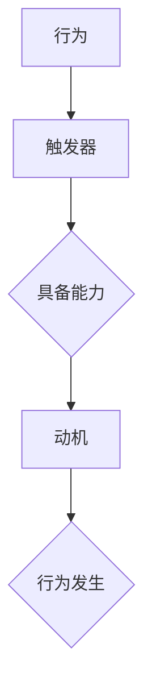

                 

关键词：福格模型、管理习惯、行为心理学、工作效能、组织发展

> 摘要：本文旨在探讨福格模型在管理习惯养成中的应用，通过解析行为心理学的核心理论，结合实际案例，分析福格模型如何帮助管理者在组织中培养积极的工作习惯，提升工作效率和组织效能。

## 1. 背景介绍

在当今快节奏、高度竞争的工作环境中，组织和工作效率成为了决定企业成败的关键因素。有效的管理习惯不仅能提高个人的工作效能，还能促进团队协作和组织发展。然而，培养良好的管理习惯并非易事，它需要深入理解人的行为动机和心理机制。

行为心理学在这方面提供了重要的理论支持。福格模型（BJ Fogg Behavior Model）作为行为心理学中的重要理论，提出了行为发生的基本条件：动机（Motivation）、能力（Ability）和触发器（Trigger）三者结合。这一模型为管理者在习惯养成中提供了实用且具有操作性的指导。

## 2. 核心概念与联系

### 2.1 福格模型原理图



**2.2 福格模型的核心概念**

- **触发器（Trigger）**：外部事件或内部想法，能够激发个体采取特定行动。
- **动机（Motivation）**：个体采取特定行动的内在驱动力，可以是兴趣、渴望或需求。
- **能力（Ability）**：个体实施特定行为所需的技能、资源或机会。

只有当这三个要素同时满足时，行为才会发生。福格模型指出，通过调整这三个要素，管理者可以有效地引导团队成员形成和保持良好的工作习惯。

## 3. 核心算法原理 & 具体操作步骤

### 3.1 算法原理概述

福格模型是一种基于行为心理学的理论模型，它帮助我们理解个体行为背后的动机、能力和触发器的互动关系。具体来说，模型强调：

- **动机**：激发个体产生行为的需求或欲望。例如，提高工作效率可能是因为对职业发展的期望或对工作成就的渴望。
- **能力**：个体执行特定行为的能力，包括知识和技能、资源和支持等。例如，掌握项目管理技能和拥有合适的项目管理工具。
- **触发器**：促使个体采取行动的刺激。例如，定期的工作会议或项目进度报告。

### 3.2 算法步骤详解

#### 3.2.1 分析动机

- **识别目标行为**：确定管理者希望养成的良好习惯。
- **找出内在动机**：通过访谈、问卷调查等方法，了解团队成员对目标行为的内在动机。

#### 3.2.2 提升能力

- **提供培训和教育**：确保团队成员具备实施目标行为所需的技能和知识。
- **提供资源和工具**：确保团队成员能够轻松地获取所需资源和工具，以提升能力。

#### 3.2.3 设定触发器

- **创建明确的行动计划**：制定具体的行动计划和时间表，作为行动的触发器。
- **设置提醒和反馈机制**：通过日历提醒、进度追踪工具等，确保团队成员按时执行行动计划，并通过定期反馈机制，强化行为。

### 3.3 算法优缺点

**优点**：

- **理论性强**：基于行为心理学，具备科学依据。
- **操作性高**：提供了具体的操作步骤，易于实施。

**缺点**：

- **复杂度较高**：需要综合考虑动机、能力和触发器三个要素，对管理者的要求较高。
- **实施难度**：需要持续监控和调整，以确保行为得以持续。

### 3.4 算法应用领域

福格模型在多个领域都有广泛的应用，包括：

- **企业培训**：通过模型设计培训课程，提升员工技能和能力。
- **员工激励**：通过设定明确的触发器和动机，激励员工形成良好的工作习惯。
- **项目管理**：通过模型优化项目进度和资源分配，提高项目成功率。

## 4. 数学模型和公式 & 详细讲解 & 举例说明

### 4.1 数学模型构建

福格模型的核心是一个简单的逻辑关系：行为 = 动机 × 能力 × 触发器。我们可以用以下公式表示：

\[ 行为 = f(\text{动机}, \text{能力}, \text{触发器}) \]

其中：

- \( f \) 表示行为的函数。
- \( \text{动机} \)、\( \text{能力} \)、\( \text{触发器} \) 分别代表三个核心要素。

### 4.2 公式推导过程

公式的推导基于行为心理学的核心理论，即行为是由内在动机、外部刺激（触发器）和执行能力共同作用的结果。具体推导过程如下：

1. **行为心理学基础**：个体的行为是由内在动机驱动的，同时受到外部环境刺激的影响。
2. **能力定义**：能力是指个体实施特定行为所需的知识、技能和资源。
3. **触发器定义**：触发器是促使个体采取行动的特定刺激或信号。
4. **综合推导**：将动机、能力和触发器结合起来，推导出行为的函数表达式。

### 4.3 案例分析与讲解

假设一个团队希望在项目中提升代码质量，我们可以应用福格模型来分析如何实现这一目标：

- **动机**：团队成员对代码质量的内在动机可能是对职业发展的期望和对代码责任的认知。
- **能力**：团队成员需要具备代码审查和缺陷修复的技能，同时拥有高质量的代码库和工具。
- **触发器**：定期代码审查会议、代码质量报告和项目进度目标可以作为触发器。

通过调整这三个要素，我们可以设计一个具体的行动计划：

1. **提升动机**：通过团队会议和一对一交流，增强团队成员对代码质量重要性的认识。
2. **提升能力**：组织代码审查培训，提供高质量的代码库和审查工具。
3. **设定触发器**：每周定期举行代码审查会议，发布代码质量报告，设定明确的代码质量目标。

通过这一行动计划，团队可以逐步提升代码质量，形成良好的工作习惯。

## 5. 项目实践：代码实例和详细解释说明

### 5.1 开发环境搭建

为了更好地展示福格模型在项目实践中的应用，我们假设开发一个简单的任务管理系统。以下是开发环境搭建的步骤：

1. **确定技术栈**：选择Python作为编程语言，使用Django作为Web框架。
2. **搭建开发环境**：安装Python和Django，配置数据库（如SQLite）。
3. **编写基本代码**：创建项目结构，编写用户注册和登录的功能。

### 5.2 源代码详细实现

以下是任务管理系统的核心代码片段，展示了如何应用福格模型来提升代码质量和团队协作：

```python
# models.py

from django.db import models

class Task(models.Model):
    title = models.CharField(max_length=255)
    description = models.TextField()
    status = models.CharField(max_length=50, choices=(('Not Started', 'Not Started'), ('In Progress', 'In Progress'), ('Completed', 'Completed')))
    owner = models.ForeignKey('auth.User', on_delete=models.CASCADE)

    def __str__(self):
        return self.title

# tasks/admin.py

from django.contrib import admin
from .models import Task

@admin.register(Task)
class TaskAdmin(admin.ModelAdmin):
    list_display = ('title', 'status', 'owner')
    search_fields = ['title', 'status', 'owner__username']

# tasks/urls.py

from django.urls import path
from . import views

urlpatterns = [
    path('', views.TaskListView.as_view(), name='task_list'),
    path('<int:pk>/', views.TaskDetailView.as_view(), name='task_detail'),
]

# tasks/views.py

from django.http import HttpResponse
from django.views.generic import ListView, DetailView
from .models import Task

class TaskListView(ListView):
    model = Task
    template_name = 'tasks/task_list.html'

    def get_context_data(self, **kwargs):
        context = super().get_context_data(**kwargs)
        context['tasks'] = Task.objects.all()
        return context

class TaskDetailView(DetailView):
    model = Task
    template_name = 'tasks/task_detail.html'
```

### 5.3 代码解读与分析

上述代码实现了任务管理系统的基本功能，包括任务创建、列表展示和详情查看。以下是关键部分的分析：

- **models.py**：定义了Task模型，包括任务标题、描述、状态和所有者等信息。
- **admin.py**：在Django管理界面中注册了Task模型，并配置了列表展示和搜索功能。
- **urls.py**：配置了任务列表和详情的URL路径。
- **views.py**：定义了两个视图类，分别用于任务列表和详情展示。

### 5.4 运行结果展示

通过运行任务管理系统，我们可以看到以下结果：

- **任务列表页面**：展示了所有任务的列表，包括任务标题、状态和所有者。
- **任务详情页面**：展示了特定任务的详细信息，包括标题、描述、状态和所有者。

这些结果展示了如何通过代码实现和管理任务，同时也展示了如何通过良好的代码质量和工作习惯来提升团队协作效率。

## 6. 实际应用场景

### 6.1 企业内部培训

企业可以利用福格模型设计内部培训课程，提升员工的技能和能力。例如，针对新入职员工，可以设计一系列的入职培训课程，包括公司文化、产品知识、工作流程等，并通过定期考核和反馈机制，确保员工能够掌握相关知识和技能。

### 6.2 项目管理

在项目管理中，福格模型可以帮助团队制定有效的项目计划，提升项目成功率。通过设定明确的触发器（如项目进度报告、工作坊等），提升团队成员的能力（如提供项目管理培训），并激发团队成员的动机（如设定项目目标和奖励机制），可以确保项目按计划顺利进行。

### 6.3 员工激励

企业可以利用福格模型设计激励机制，激发员工的积极性和创造力。例如，通过设定明确的绩效目标和奖励机制，提供必要的培训和支持，激发员工的工作动机，同时通过及时的反馈和认可，提升员工的工作能力。

## 7. 工具和资源推荐

### 7.1 学习资源推荐

- **《行为心理学导论》**：这本书提供了全面的行为心理学基础知识，适合初学者了解福格模型和相关理论。
- **《福格模型：动机、能力和触发器的互动》**：详细介绍福格模型的理论和实践应用，适合希望深入理解模型的管理者。

### 7.2 开发工具推荐

- **JIRA**：用于项目管理和任务跟踪，可以帮助团队设定触发器和监控项目进度。
- **Trello**：简单直观的任务管理工具，适合小型团队进行任务分配和进度跟踪。

### 7.3 相关论文推荐

- **“The Fogg Behavior Model: A Practical Guide to Behavior Change at Work”**：这篇文章详细介绍了福格模型在工作环境中的应用，提供了实用的案例和建议。
- **“Motivation, Ability, and Trigger: A Theory of Predicting and Nudging Behaviors”**：这篇文章从行为心理学的角度，探讨了动机、能力和触发器在行为预测和引导中的作用。

## 8. 总结：未来发展趋势与挑战

### 8.1 研究成果总结

福格模型作为一种基于行为心理学的理论模型，已被广泛应用于企业培训、项目管理和员工激励等领域。通过分析动机、能力和触发器三个要素，管理者可以更有效地培养良好的工作习惯，提升工作效率和组织效能。

### 8.2 未来发展趋势

随着人工智能和大数据技术的发展，福格模型的应用场景将更加广泛。例如，通过数据分析，可以更精准地识别员工的动机和能力，从而设计更个性化的培训计划和激励机制。此外，福格模型也可以与人工智能相结合，开发出智能化的行为预测和引导系统。

### 8.3 面临的挑战

尽管福格模型具有很高的实用性，但在实际应用中仍面临一些挑战。首先，需要管理者具备一定的心理学知识和能力，能够准确识别和调整动机、能力和触发器。其次，福格模型的应用需要持续监控和调整，以确保行为得以持续。

### 8.4 研究展望

未来研究可以进一步探讨福格模型在不同文化和组织环境中的应用，以及如何与人工智能技术相结合，提升模型的预测和引导能力。此外，还可以研究福格模型在不同类型的行为（如创新行为、团队协作行为等）中的应用，以拓展其应用范围。

## 9. 附录：常见问题与解答

### 9.1 问题1：福格模型是否适用于所有组织和文化背景？

福格模型的基本原理是通用的，但实际应用时需要考虑到不同组织和文化背景的具体情况。例如，在某些文化中，员工可能更注重关系和团队协作，而在另一些文化中，个人成就和竞争更为突出。因此，在应用福格模型时，需要根据具体情况调整动机、能力和触发器的设定。

### 9.2 问题2：如何确保团队成员的能力提升？

确保团队成员的能力提升需要提供持续的教育和培训，同时提供必要的资源和工具。例如，可以通过组织内部培训、外部专家讲座、在线课程等多种形式，提升团队成员的技能和能力。此外，还可以通过导师制度、团队合作和任务轮换等方式，促进团队成员之间的知识共享和能力提升。

### 9.3 问题3：福格模型是否适用于所有类型的工作？

福格模型可以应用于各种类型的工作，但具体实施时需要根据工作类型和特点进行调整。例如，对于创意型工作，可能需要更多的触发器和动机来激发员工的创造力；而对于重复性工作，可能需要更多的能力和资源的支持。

## 作者署名

作者：禅与计算机程序设计艺术 / Zen and the Art of Computer Programming

以上是《福格模型在管理习惯养成中的应用》一文的完整内容。希望本文能够帮助读者更好地理解福格模型，并在实际工作中应用这一理论，提升管理效能和组织发展。

