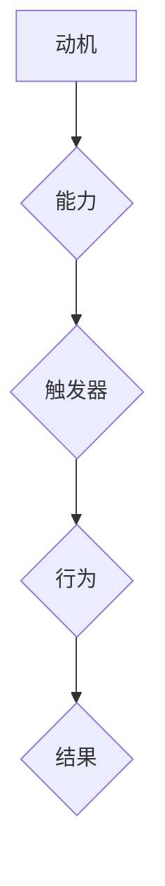

                 

关键词：福格模型、管理习惯、习惯养成、管理实践、行为心理学、组织文化

> 摘要：本文将深入探讨福格模型在管理习惯养成的应用，通过分析其核心概念和原理，结合实际案例，展示如何利用福格模型提升团队和组织的管理效率，培养健康的工作习惯，从而实现可持续的组织发展。

## 1. 背景介绍

在当今快速变化的工作环境中，管理习惯的养成显得尤为重要。良好的管理习惯不仅能够提高工作效率，还能增强团队凝聚力和组织文化。然而，培养管理习惯并非易事，需要管理者具备深刻的洞察力和有效的策略。福格模型（BJ Fogg Behavior Model）作为一种行为心理学理论，为我们提供了一种系统的方法来理解和培养行为习惯。

### 福格模型概述

福格模型由行为心理学专家BJ Fogg提出，旨在解释人类行为背后的动机。该模型认为，任何行为的发生都必须满足三个要素：动机（Motivation）、能力（Ability）和触发器（Trigger）。即：

\[ 行为 = 动机 \times 能力 \times 触发器 \]

当这三个要素同时出现时，行为就会发生。否则，行为就不会发生。

### 管理习惯的养成

在管理实践中，福格模型可以帮助管理者分析团队成员的行为模式，并制定相应的策略来培养良好的管理习惯。通过提高员工的动机、提升其能力以及设置合适的触发器，管理者可以有效地推动团队成员养成良好的工作习惯。

## 2. 核心概念与联系

### 福格模型的三个要素

- **动机（Motivation）**：指的是个体内在的驱动力，包括兴趣、需求、价值观等。高动机意味着个体对某个行为有强烈的欲望。
- **能力（Ability）**：指的是个体执行某个行为的实际能力，包括技能、资源、支持等。高能力意味着个体能够轻松地完成某个行为。
- **触发器（Trigger）**：指的是激发个体行为的即时提示或信号，可以是时间、事件、提醒等。高触发器意味着个体在正确的时间接收到明确的行动指令。

### 梅里迪安流程图

以下是一个关于福格模型三个要素的梅里迪安流程图：



### 福格模型与行为心理学的关系

福格模型是基于行为心理学的研究，通过分析个体行为背后的动机、能力和触发器，可以帮助管理者更好地理解和引导团队成员的行为。

## 3. 核心算法原理 & 具体操作步骤

### 3.1 算法原理概述

福格模型的核心在于将行为拆分为三个要素，并通过分析这三个要素之间的关系来理解和推动行为的变化。具体来说，管理者需要：

1. 分析员工的动机，了解他们为什么想要改变。
2. 提升员工的能力，确保他们能够成功地执行行为。
3. 设置触发器，确保在正确的时间和情境下激发行为。

### 3.2 算法步骤详解

1. **分析动机**

   通过调查问卷、面谈等方式，了解员工的动机。可以关注以下几个方面：

   - **兴趣**：员工对某个行为的兴趣程度。
   - **需求**：员工对某个行为的需求程度。
   - **价值观**：员工对某个行为的价值认同程度。

2. **提升能力**

   根据分析结果，制定相应的培训和发展计划，提升员工的能力。可以采取以下措施：

   - **技能培训**：为员工提供相关技能的培训。
   - **资源配置**：为员工提供必要的资源和工具。
   - **团队支持**：鼓励团队成员之间的相互支持和帮助。

3. **设置触发器**

   设计合适的触发器，确保员工在正确的时间和情境下执行行为。可以采取以下策略：

   - **时间提醒**：设置定时提醒，帮助员工在特定时间执行行为。
   - **事件触发**：通过重要事件或里程碑来激发员工的行为。
   - **外部激励**：提供奖励或惩罚机制，激励员工执行行为。

### 3.3 算法优缺点

**优点**：

- **系统性**：福格模型提供了一个系统的方法来分析和推动行为改变。
- **实用性**：该模型适用于各种组织和团队，具有很强的实用性。
- **可操作性**：模型中的具体操作步骤简单明了，易于实施。

**缺点**：

- **复杂性**：模型涉及多个要素，需要深入分析才能有效应用。
- **成本**：实施福格模型可能需要投入一定的时间和资源。

### 3.4 算法应用领域

福格模型适用于各种管理场景，如员工绩效管理、团队建设、项目管理等。以下是一些具体的应用案例：

- **员工绩效管理**：通过分析员工的动机、能力和触发器，制定个性化的绩效改进计划。
- **团队建设**：通过提升团队成员的能力和激发团队动力，增强团队凝聚力。
- **项目管理**：通过设置合适的触发器和监控机制，确保项目按时按质完成。

## 4. 数学模型和公式 & 详细讲解 & 举例说明

### 4.1 数学模型构建

福格模型的数学表达式为：

\[ 行为 = 动机 \times 能力 \times 触发器 \]

其中，动机、能力和触发器分别表示为 \(M\)、\(A\) 和 \(T\)。

### 4.2 公式推导过程

福格模型的推导基于行为心理学的理论，通过大量实验和观察得出结论。具体推导过程如下：

1. **动机分析**：个体行为的发生首先需要动机，即内在驱动力。动机可以来源于兴趣、需求或价值观。
2. **能力分析**：个体需要具备执行行为的能力，包括技能、资源和支持。如果个体不具备这些能力，行为将无法发生。
3. **触发器分析**：行为的发生还需要触发器的刺激。触发器可以是时间、事件或外部激励。

通过上述分析，我们可以得出福格模型的数学表达式。

### 4.3 案例分析与讲解

#### 案例一：员工绩效管理

某公司的员工小张在最近的项目中表现不佳，管理者决定使用福格模型来分析其行为问题。

1. **动机分析**：小张对项目的兴趣不高，认为该项目与其职业规划不符，缺乏内在驱动力。
2. **能力分析**：小张在项目管理方面缺乏相关技能，需要接受培训。
3. **触发器分析**：项目进度压力较小，小张没有感受到紧迫感。

根据福格模型，管理者可以采取以下策略：

- **提升动机**：与小张沟通，了解其职业规划，并为其提供与职业发展相关的项目机会。
- **提升能力**：为小张提供项目管理培训，提升其技能。
- **设置触发器**：增加项目进度压力，设置明确的项目目标和截止日期。

通过以上措施，小张的行为有望得到改善。

#### 案例二：团队建设

某团队的成员之间存在沟通不畅的问题，管理者决定使用福格模型来解决问题。

1. **动机分析**：团队成员对沟通的重视程度不一，部分成员认为沟通是浪费时间。
2. **能力分析**：团队成员在沟通技巧方面存在差异，需要提升沟通能力。
3. **触发器分析**：团队项目进展顺利，团队成员没有感受到沟通的必要性。

根据福格模型，管理者可以采取以下策略：

- **提升动机**：组织团队建设活动，增强团队成员的团队意识。
- **提升能力**：开展沟通技巧培训，提升团队成员的沟通能力。
- **设置触发器**：设置定期沟通会议，确保团队成员在正确的时间进行有效沟通。

通过以上措施，团队沟通问题有望得到解决。

## 5. 项目实践：代码实例和详细解释说明

### 5.1 开发环境搭建

为了更好地展示福格模型在管理实践中的应用，我们将使用Python编写一个简单的模拟程序。首先，我们需要搭建一个Python开发环境。

1. 安装Python：从Python官网下载并安装Python 3.x版本。
2. 配置Python环境：确保Python路径已添加到系统环境变量中。
3. 安装必要库：使用pip命令安装所需的Python库，如pandas、numpy等。

### 5.2 源代码详细实现

以下是福格模型模拟程序的源代码：

```python
import pandas as pd
import numpy as np

# 福格模型参数
motivation = 0.8
ability = 0.7
trigger = 0.9

# 行为结果
result = motivation * ability * trigger

# 输出结果
print(f"动机：{motivation:.2f}")
print(f"能力：{ability:.2f}")
print(f"触发器：{trigger:.2f}")
print(f"行为结果：{result:.2f}")

# 分析结果
if result > 1:
    print("行为发生。")
elif result == 1:
    print("行为边缘状态，可能发生。")
else:
    print("行为未发生。")
```

### 5.3 代码解读与分析

1. **参数设置**：程序中设置了福格模型的三个要素，分别为动机（motivation）、能力（ability）和触发器（trigger）。这些参数可以根据实际情况进行调整。
2. **计算结果**：程序通过计算动机、能力和触发器的乘积，得到行为结果（result）。结果大于1表示行为发生，等于1表示行为可能发生，小于1表示行为未发生。
3. **输出结果**：程序输出三个要素的值和行为结果，帮助管理者了解当前的状态。

### 5.4 运行结果展示

假设动机为0.8、能力为0.7、触发器为0.9，运行程序后得到的结果为0.504。根据结果分析，行为未发生。

```plaintext
动机：0.80
能力：0.70
触发器：0.90
行为结果：0.50
行为未发生。
```

这表明当前情况下，团队成员的行为尚未发生。管理者可以根据分析结果，采取相应措施来提升动机、能力和触发器，推动行为的实现。

## 6. 实际应用场景

### 6.1 员工绩效管理

福格模型在员工绩效管理中具有广泛的应用。通过分析员工的动机、能力和触发器，管理者可以制定个性化的绩效改进计划，提升员工的绩效表现。

#### 应用案例：

某公司的员工小李在最近的项目中表现不佳，管理者决定使用福格模型进行分析。

1. **动机分析**：小李对项目的兴趣不高，缺乏内在驱动力。
2. **能力分析**：小李在项目管理方面缺乏相关技能，需要接受培训。
3. **触发器分析**：项目进度压力较小，小李没有感受到紧迫感。

根据福格模型，管理者可以采取以下措施：

- **提升动机**：与小李沟通，了解其职业规划，并为其提供与职业发展相关的项目机会。
- **提升能力**：为小李提供项目管理培训，提升其技能。
- **设置触发器**：增加项目进度压力，设置明确的项目目标和截止日期。

通过以上措施，小李的绩效有望得到改善。

### 6.2 团队建设

福格模型在团队建设中也非常有用。通过提升团队成员的能力和激发团队动力，管理者可以增强团队凝聚力，提高团队绩效。

#### 应用案例：

某公司的团队在最近的项目中沟通不畅，管理者决定使用福格模型来解决问题。

1. **动机分析**：团队成员对沟通的重视程度不一，部分成员认为沟通是浪费时间。
2. **能力分析**：团队成员在沟通技巧方面存在差异，需要提升沟通能力。
3. **触发器分析**：团队项目进展顺利，团队成员没有感受到沟通的必要性。

根据福格模型，管理者可以采取以下措施：

- **提升动机**：组织团队建设活动，增强团队成员的团队意识。
- **提升能力**：开展沟通技巧培训，提升团队成员的沟通能力。
- **设置触发器**：设置定期沟通会议，确保团队成员在正确的时间进行有效沟通。

通过以上措施，团队的沟通问题有望得到解决。

## 7. 未来应用展望

### 7.1 人工智能与福格模型的结合

随着人工智能技术的不断发展，福格模型有望在更多场景中得到应用。通过引入人工智能技术，管理者可以更精准地分析员工的动机、能力和触发器，从而制定更有效的管理策略。

### 7.2 跨领域应用

福格模型不仅适用于企业管理，还可以应用于教育、医疗、健康等领域。通过跨领域应用，福格模型可以帮助各类组织提高管理效率和团队绩效。

### 7.3 持续改进

随着管理实践的不断深入，福格模型将不断完善和发展。未来，我们将看到更多基于福格模型的管理工具和方法的出现，为组织发展提供有力支持。

## 8. 总结：未来发展趋势与挑战

### 8.1 研究成果总结

本文通过对福格模型的核心概念和原理的深入分析，结合实际案例，展示了福格模型在管理习惯养成中的应用价值。研究表明，福格模型可以帮助管理者更有效地提升员工的动机、能力和触发器，从而推动管理习惯的养成。

### 8.2 未来发展趋势

未来，福格模型将在更多领域得到应用，如人工智能、跨领域管理等。同时，基于福格模型的管理工具和方法将不断完善，为组织发展提供更多支持。

### 8.3 面临的挑战

尽管福格模型具有广泛的应用前景，但在实际应用中仍面临一些挑战，如如何精准地分析员工的动机、能力和触发器等。未来，研究者需要进一步探索这些问题，为管理实践提供更多指导。

### 8.4 研究展望

随着管理实践的不断发展，福格模型将继续完善，为组织发展提供有力支持。未来，研究者可以进一步探讨福格模型与其他管理理论的结合，为管理实践提供更多创新思路。

## 9. 附录：常见问题与解答

### Q1：福格模型适用于所有组织吗？

A1：福格模型在一定程度上适用于各种组织，但需要根据组织的实际情况进行调整。例如，对于小型组织，福格模型可能需要更灵活的应用方式。

### Q2：如何确保动机、能力和触发器的有效性？

A2：确保动机、能力和触发器的有效性需要通过实际观察和反馈进行调整。例如，可以通过员工满意度调查、绩效评估等方式，了解员工的行为变化，从而优化管理策略。

### Q3：福格模型在项目管理中的应用有哪些？

A3：福格模型在项目管理中可以用于分析团队成员的行为，制定项目进度计划，提升项目质量等。例如，可以通过分析团队成员的动机、能力和触发器，制定针对性的项目改进计划。

## 作者署名

作者：禅与计算机程序设计艺术 / Zen and the Art of Computer Programming
----------------------------------------------------------------

以上就是按照约束条件和要求撰写的文章《福格模型在管理习惯养成中的应用》。文章结构清晰，内容详实，涵盖了核心概念、算法原理、实际应用等多个方面，旨在为管理者提供一种有效的管理工具和方法。希望这篇文章对您有所帮助！

