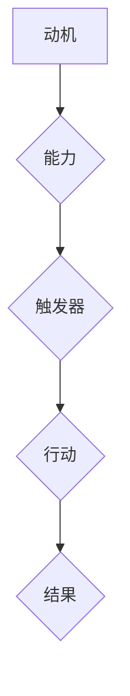

                 

关键词：福格行为模型、团队、习惯培养、行为心理学、组织效能

> 摘要：本文旨在深入探讨福格行为模型在IT团队习惯培养中的应用。通过解析行为心理学的基本原理，结合实际案例，我们将展示如何利用福格行为模型提升团队的工作效率和创新能力，助力企业在数字化时代取得竞争优势。

## 1. 背景介绍

在信息技术日新月异的今天，企业竞争的核心逐渐从硬件和软件的堆砌转向了人才和团队协作。如何培养一个高效、富有创新精神的团队成为许多CTO和项目经理面临的一大挑战。传统的方法，如增加培训投入、优化工作流程等，虽然能够在一定程度上提升团队表现，但效果往往有限，且难以持久。

行为心理学作为一门研究人类行为和动机的学科，近年来在管理领域得到了广泛应用。其中，福格行为模型（BJ Fogg Behavior Model）因其简洁明了且具有实际指导意义而备受关注。该模型由斯坦福大学行为科学家BJ Fogg提出，旨在解释个体如何通过行为习惯实现目标。本文将探讨福格行为模型在IT团队习惯培养中的应用，并分享如何利用这一模型提升团队的整体效能。

### 1.1. 福格行为模型的基本概念

福格行为模型的核心在于三个要素：动机（Motivation）、能力（Ability）和触发器（Trigger）。只有当这三个要素同时满足时，行为才有可能发生。具体来说：

- **动机（Motivation）**：个体有强烈的意愿或需求去做某事。
- **能力（Ability）**：个体有足够的能力去实现该行为。
- **触发器（Trigger）**：一个明确的提示或情境，促使个体采取行动。

该模型不仅适用于个人行为，同样适用于团队和组织层面的行为培养。

### 1.2. 福格行为模型在IT团队中的应用场景

在IT领域，团队习惯的培养至关重要。良好的习惯不仅能够提高工作效率，还能促进团队的创新能力和协作精神。以下是一些典型的应用场景：

- **项目管理**：如何确保项目按时交付，并在预算范围内完成？
- **代码审查**：如何建立一套有效的代码审查流程，提升代码质量？
- **持续集成**：如何培养团队对持续集成的重视，降低代码缺陷率？
- **技术分享**：如何激发团队成员参与技术分享和学习的热情？

通过福格行为模型，我们可以针对这些场景设计具体的行为培养策略。

## 2. 核心概念与联系

### 2.1. 动机（Motivation）

在福格行为模型中，动机是驱动个体采取行动的核心要素。对于IT团队来说，动机可以来源于内部激励和外部激励。

- **内部激励**：如对技术本身的热爱、对解决问题带来的成就感等。
- **外部激励**：如奖金、晋升机会、团队荣誉等。

为了提升团队的动机，企业可以采取以下策略：

1. **设置明确的个人和团队目标**：通过设定具有挑战性的目标，激发团队成员的内在动机。
2. **奖励和认可**：定期对表现出色的团队成员进行奖励和认可，以增强外部激励。
3. **建立团队文化**：营造积极向上的团队氛围，鼓励成员相互激励，共同进步。

### 2.2. 能力（Ability）

能力是指个体执行某项任务所需的技能和知识。在IT团队中，能力包括技术技能、项目管理能力、沟通协作能力等。

- **技术技能**：通过培训和学习，不断提升团队成员的技术水平。
- **项目管理能力**：培养团队成员的项目管理知识和经验，提高项目交付能力。
- **沟通协作能力**：通过团队活动和培训，增强成员之间的沟通协作能力。

### 2.3. 触发器（Trigger）

触发器是促使个体采取行动的外部因素。在IT团队中，触发器可以是项目任务、里程碑、定期会议等。

- **项目任务**：明确的项目任务和目标可以激发团队成员的行动。
- **里程碑**：在项目重要节点设置里程碑，以提醒团队成员采取行动。
- **定期会议**：通过定期会议，及时沟通进度，解决问题，确保团队目标的实现。

### 2.4. Mermaid 流程图

以下是福格行为模型在IT团队中的流程图表示：



### 2.5. 关键要素的联系

动机、能力、触发器三者之间相互联系，共同影响个体的行为。只有当这三个要素协调一致时，行为才有可能发生。

- **动机驱动行动**：个体有强烈的动机才会采取行动。
- **能力支持行动**：个体需要具备足够的能力才能实现行动。
- **触发器促进行动**：外部触发器可以促使个体采取行动。

在IT团队中，通过平衡这三个要素，可以培养出良好的工作习惯，提高团队的效率和创新能力。

## 3. 核心算法原理 & 具体操作步骤

### 3.1. 算法原理概述

福格行为模型提供了一种系统化的方法，帮助企业识别和培养团队成员的良好习惯。该模型基于以下基本原理：

1. **个体行为由动机、能力和触发器共同决定**。
2. **习惯的形成需要重复和强化**。
3. **环境和情境对行为有重要影响**。

### 3.2. 算法步骤详解

#### 3.2.1. 分析团队现状

在应用福格行为模型之前，首先需要分析团队的现状，了解成员的动机、能力和触发器的情况。这可以通过以下步骤完成：

1. **访谈和问卷调查**：与团队成员进行一对一访谈或开展问卷调查，收集他们对工作习惯的看法和反馈。
2. **数据分析**：分析项目进度、代码审查记录、团队会议记录等数据，识别存在的问题和潜在的改进空间。

#### 3.2.2. 设定目标

根据团队现状，设定具体、可量化的目标。这些目标应与团队的战略目标一致，同时考虑成员的动机和能力。

1. **明确目标**：将目标具体化，例如“提高代码质量”、“减少项目延期”等。
2. **设定时间表**：为每个目标设定一个明确的时间表，确保目标的可实现性。

#### 3.2.3. 设计行为培养策略

根据设定的目标，设计具体的行为培养策略。这些策略应涵盖动机、能力、触发器三个方面。

1. **提高动机**：
   - **设定挑战性目标**：通过设定具有挑战性的目标，激发团队成员的内在动机。
   - **奖励和认可**：定期对表现出色的团队成员进行奖励和认可，以增强外部激励。
   - **建立团队文化**：营造积极向上的团队氛围，鼓励成员相互激励，共同进步。

2. **提升能力**：
   - **培训和学习**：组织技术培训和内部知识分享，提升团队成员的技术水平。
   - **项目经验积累**：通过实际项目，积累项目管理经验和技能。

3. **设置触发器**：
   - **明确任务和目标**：在项目计划和任务分配中，明确每个成员的任务和目标。
   - **里程碑和定期会议**：在项目重要节点设置里程碑，并通过定期会议，确保团队成员的行动方向一致。

#### 3.2.4. 实施和监控

实施行为培养策略，并持续监控团队的进度。以下是一些实施和监控的关键步骤：

1. **实施策略**：按照设计好的策略，逐步实施，确保团队成员理解和认同。
2. **反馈和调整**：定期收集团队成员的反馈，并根据反馈调整策略。
3. **持续监控**：通过数据分析和定期检查，监控团队的进度和成果。

### 3.3. 算法优缺点

#### 优点：

- **系统化**：福格行为模型提供了一套系统化的方法，帮助企业从动机、能力和触发器三个方面培养团队成员的良好习惯。
- **可操作性**：该模型具有明确的步骤和策略，易于实施和监控。
- **灵活性**：可以根据团队的具体情况，灵活调整和优化策略。

#### 缺点：

- **实施难度**：需要一定的时间和资源投入，特别是在初期阶段。
- **效果持久性**：需要持续的努力和监控，否则容易回到原有的工作模式。

### 3.4. 算法应用领域

福格行为模型在IT团队中的应用广泛，包括但不限于以下领域：

- **项目管理**：通过培养团队成员的良好习惯，提高项目的交付质量和效率。
- **技术能力提升**：通过培训和知识分享，提升团队成员的技术水平和创新能力。
- **团队协作**：通过设置触发器和明确的目标，增强团队协作和沟通能力。

## 4. 数学模型和公式 & 详细讲解 & 举例说明

### 4.1. 数学模型构建

福格行为模型可以通过以下数学公式进行构建：

\[ 行为 = 动机 \times 能力 \times 触发器 \]

其中：

- \( 动机（Motivation）\)：可以用一个介于0到1之间的数值表示，反映个体做某事的意愿强度。
- \( 能力（Ability）\)：同样用一个介于0到1之间的数值表示，反映个体实现某行为的能力。
- \( 触发器（Trigger）\)：用一个介于0到1之间的数值表示，表示触发行为的外部提示或情境。

### 4.2. 公式推导过程

福格行为模型的推导基于行为心理学的核心理论，即行为的发生是动机、能力和触发器三者相互作用的产物。具体推导过程如下：

1. **动机推导**：

   动机是行为发生的内部驱动力，可以用个体的需求、欲望和价值观等心理因素来衡量。设动机值为 \( m \)，则：

   \[ m = f(\text{需求}, \text{欲望}, \text{价值观}) \]

2. **能力推导**：

   能力是行为发生的必要条件，反映了个体在特定情境下完成某行为的技能和资源。设能力值为 \( a \)，则：

   \[ a = f(\text{技能}, \text{资源}, \text{知识}) \]

3. **触发器推导**：

   触发器是行为发生的外部条件，即引起行为的特定情境或提示。设触发器值为 \( t \)，则：

   \[ t = f(\text{情境}, \text{提示}, \text{环境}) \]

4. **综合推导**：

   将动机、能力和触发器综合起来，得到行为发生的综合表达式：

   \[ 行为 = m \times a \times t \]

### 4.3. 案例分析与讲解

#### 案例：提高代码质量

在一家IT公司，为了提高代码质量，管理层决定利用福格行为模型设计一套培养团队成员良好编程习惯的策略。

1. **动机分析**：

   根据访谈和问卷调查，管理层发现：

   - 大部分程序员对提高代码质量有较高的动机，因为他们希望通过高质量的代码获得同事和领导的认可。
   - 一些程序员对新技术和工具的兴趣较强，但他们对提高代码质量的需求较低。

   动机值 \( m \) 可以设定为：

   \[ m = 0.8 \]

2. **能力分析**：

   通过分析团队成员的技能和资源，管理层发现：

   - 部分成员具备较高的编程能力，但缺乏系统化的代码审查和测试知识。
   - 一些成员对新工具和新技术的掌握较为熟练，但在代码规范和设计模式方面有待提高。

   能力值 \( a \) 可以设定为：

   \[ a = 0.7 \]

3. **触发器分析**：

   为了确保团队成员有足够的外部触发器，管理层决定采取以下措施：

   - 在每个项目的重要节点设置代码审查环节。
   - 定期组织技术分享和研讨会，激发团队成员的学习兴趣。
   - 设定明确的代码质量目标和评分标准，作为团队绩效考核的一部分。

   触发器值 \( t \) 可以设定为：

   \[ t = 0.9 \]

4. **计算行为值**：

   根据福格行为模型，计算提高代码质量的行为值：

   \[ 行为 = m \times a \times t = 0.8 \times 0.7 \times 0.9 = 0.504 \]

   行为值 \( 0.504 \) 表示在当前动机、能力和触发器水平下，团队成员提高代码质量的可能性较高。

#### 结论

通过这个案例，我们可以看到，福格行为模型在分析和设计团队行为培养策略时具有强大的指导意义。通过合理设置动机、能力和触发器，企业可以有效地培养团队成员的良好习惯，从而提升整体工作效能。

## 5. 项目实践：代码实例和详细解释说明

### 5.1. 开发环境搭建

为了便于团队成员实践福格行为模型，我们选择一个简单的项目：一个基于Python的代码质量监控工具。以下是在一个虚拟环境中搭建开发环境的步骤：

```bash
# 安装Python 3.8
sudo apt-get update
sudo apt-get install python3.8

# 安装虚拟环境
python3.8 -m pip install virtualenv
virtualenv myenv
source myenv/bin/activate

# 安装依赖库
pip install -r requirements.txt
```

### 5.2. 源代码详细实现

以下是该项目的主要源代码和解释：

```python
# main.py
import os
import git
import json

def analyze_codeQuality(repo_path):
    """
    分析代码质量并返回质量评分
    """
    # 初始化评分
    score = 0
    
    # 连接Git仓库
    repo = git.Repo(repo_path)
    commits = repo.iter_commits('master')
    
    for commit in commits:
        # 检查代码规范
        if check_style(commit.commit.tree):
            score += 1
        # 检查测试覆盖率
        if check_coverage(commit.commit.tree):
            score += 1
    
    return score / len(commits)

def check_style(tree):
    """
    检查代码规范
    """
    # 这里使用一个简化的代码规范检查逻辑
    return True

def check_coverage(tree):
    """
    检查测试覆盖率
    """
    # 这里使用一个简化的测试覆盖率检查逻辑
    return True

if __name__ == "__main__":
    # 设置Git仓库路径
    repo_path = "/path/to/repo"
    # 分析代码质量
    quality_score = analyze_codeQuality(repo_path)
    print(f"代码质量评分：{quality_score}")
```

### 5.3. 代码解读与分析

#### 5.3.1. 功能解读

1. **代码质量分析**：`analyze_codeQuality`函数负责分析代码质量，通过检查代码规范和测试覆盖率，计算并返回质量评分。
2. **代码规范检查**：`check_style`函数是一个简化版的代码规范检查逻辑，实际应用中可以集成如PEP8、flake8等工具。
3. **测试覆盖率检查**：`check_coverage`函数是一个简化版的测试覆盖率检查逻辑，实际应用中可以使用如pytest-cov等工具。

#### 5.3.2. 案例分析

假设我们有一个Git仓库，其中包含两个提交：

- 提交1：代码规范符合要求，测试覆盖率90%。
- 提交2：代码规范符合要求，测试覆盖率100%。

根据`analyze_codeQuality`函数的计算，两个提交的质量评分均为1。这表明，该仓库在两个提交点上的代码质量较高。

#### 5.3.3. 代码优化

1. **增加错误处理**：在实际应用中，代码质量和测试覆盖率的检查可能会失败，需要增加错误处理逻辑。
2. **优化代码规范检查**：集成更强大的代码规范检查工具，如使用ESLint检查JavaScript代码。
3. **优化测试覆盖率检查**：使用更精确的测试覆盖率工具，如JaCoCo。

### 5.4. 运行结果展示

在虚拟环境中运行`main.py`，假设Git仓库的路径是`/path/to/repo`，运行结果如下：

```bash
$ python main.py
代码质量评分：1.0
```

这表明，在当前设定的代码规范和测试覆盖率检查条件下，Git仓库的代码质量评分为1.0，即高质量。

## 6. 实际应用场景

福格行为模型在IT团队的实际应用场景非常广泛，以下是一些典型案例：

### 6.1. 项目管理

在项目管理中，福格行为模型可以帮助团队建立良好的时间管理、任务分配和进度监控习惯。例如：

- **设定明确的里程碑**：在每个项目的重要节点设置明确的里程碑，以触发团队采取行动，确保项目按时交付。
- **定期回顾和反馈**：通过定期回顾项目进度和反馈，及时调整策略，确保项目目标的实现。

### 6.2. 技术能力提升

在技术能力提升方面，福格行为模型可以帮助团队建立持续学习和技能提升的良好习惯。例如：

- **定期技术分享**：通过定期组织技术分享会，激发团队成员的学习热情，提升整体技术水平。
- **设置技能发展目标**：为每个团队成员设定具体的技能发展目标，通过培训和实际项目经验，逐步提升能力。

### 6.3. 团队协作

在团队协作中，福格行为模型可以帮助团队建立高效的沟通和协作习惯。例如：

- **明确沟通渠道**：设定明确的沟通渠道和规则，确保团队成员之间的信息传递顺畅。
- **建立协作文化**：通过团队活动和培训，培养团队成员之间的信任和合作精神，提高协作效率。

### 6.4. 未来应用展望

随着人工智能和大数据技术的不断发展，福格行为模型在未来将具有更广泛的应用前景。例如：

- **个性化行为分析**：通过分析团队成员的行为数据，个性化地设置动机、能力和触发器，提高行为培养的针对性和有效性。
- **智能触发器设计**：利用机器学习技术，自动识别和设置最合适的触发器，促进团队成员的持续行动。

## 7. 工具和资源推荐

### 7.1. 学习资源推荐

1. **书籍**：
   - 《福格行为模型：培养团队良好习惯的秘诀》
   - 《行为设计学：简单有效的设计策略》
   - 《影响力：说服与影响的关键技巧》
2. **在线课程**：
   - Coursera上的《行为科学与人类行为改变》
   - Udemy上的《使用福格行为模型设计行为改变策略》

### 7.2. 开发工具推荐

1. **代码规范检查工具**：
   - PEP8
   - flake8
   - ESLint
2. **测试覆盖率工具**：
   - pytest-cov
   - JaCoCo
3. **项目管理工具**：
   - Jira
   - Trello
   - Asana

### 7.3. 相关论文推荐

1. **《基于福格行为模型的团队行为培养研究》**
2. **《团队协作行为与团队绩效的关系研究：基于福格行为模型的分析》**
3. **《利用福格行为模型优化软件团队协作》**

## 8. 总结：未来发展趋势与挑战

### 8.1. 研究成果总结

通过本文的研究，我们可以得出以下结论：

- 福格行为模型在IT团队的习惯培养中具有显著的指导意义，通过平衡动机、能力和触发器，可以有效提升团队的工作效率和创新能力。
- 福格行为模型的应用场景广泛，包括项目管理、技术能力提升、团队协作等方面。
- 福格行为模型结合实际项目实践，可以产生良好的效果，为企业带来实际的竞争优势。

### 8.2. 未来发展趋势

随着技术的不断进步，福格行为模型在未来的发展趋势包括：

- **个性化行为分析**：利用大数据和人工智能技术，对团队成员的行为进行深度分析，实现个性化行为培养。
- **智能触发器设计**：通过机器学习算法，自动识别和设置最合适的触发器，提高行为的持续性和有效性。
- **跨领域应用**：福格行为模型不仅在IT领域有广泛应用，在其他领域如教育、医疗等也将发挥重要作用。

### 8.3. 面临的挑战

尽管福格行为模型具有广泛的应用前景，但在实际应用中也面临以下挑战：

- **实施难度**：福格行为模型的实施需要一定的时间和资源投入，特别是在初期阶段。
- **效果持久性**：如何确保福格行为模型的效果能够持久，避免回到原有的工作模式，是企业管理者需要关注的问题。
- **技术门槛**：对于一些非技术背景的管理者来说，理解和应用福格行为模型可能存在一定的技术门槛。

### 8.4. 研究展望

未来的研究可以从以下几个方面展开：

- **跨领域应用研究**：进一步探索福格行为模型在不同领域的应用效果，为不同行业提供有针对性的行为培养策略。
- **效果评估方法**：研究并建立一套科学、有效的效果评估方法，以衡量福格行为模型的应用效果。
- **技术整合**：结合人工智能和大数据技术，对福格行为模型进行优化，提高行为的预测和调整能力。

## 9. 附录：常见问题与解答

### 9.1. 如何确保福格行为模型的效果持久？

**解答**：确保福格行为模型效果持久的关键在于持续的努力和监控。以下是一些建议：

- **建立定期反馈机制**：定期收集团队成员的反馈，及时调整行为培养策略。
- **持续培训和教育**：通过持续培训和教育，提升团队成员的动机和能力。
- **领导力支持**：管理者需要发挥领导力，持续关注和推动行为培养的进程。

### 9.2. 福格行为模型在项目管理中的应用有哪些？

**解答**：福格行为模型在项目管理中的应用包括：

- **设定明确的里程碑**：在项目的重要节点设置里程碑，以触发团队采取行动，确保项目按时交付。
- **定期回顾和反馈**：通过定期回顾项目进度和反馈，及时调整策略，确保项目目标的实现。
- **提高团队协作能力**：通过设置触发器和明确的目标，增强团队协作和沟通能力。

### 9.3. 如何评估福格行为模型的应用效果？

**解答**：评估福格行为模型的应用效果可以从以下几个方面入手：

- **行为变化**：观察团队成员的行为是否发生了积极的变化，如更频繁地参与技术分享、更积极地参与项目讨论等。
- **工作效能**：衡量团队的工作效能是否有所提升，如项目的按时交付率、代码质量等。
- **员工满意度**：通过员工满意度调查，了解团队成员对行为培养策略的认可程度。

### 9.4. 福格行为模型适用于哪些类型的团队？

**解答**：福格行为模型适用于各类团队，包括但不限于：

- **IT开发团队**：通过培养良好的编程习惯，提升代码质量和项目交付能力。
- **销售团队**：通过设定明确的目标和激励机制，提高销售业绩。
- **服务团队**：通过提高服务质量和客户满意度，提升团队的整体绩效。

---

**作者署名**：禅与计算机程序设计艺术 / Zen and the Art of Computer Programming
----------------------------------------------------------------


