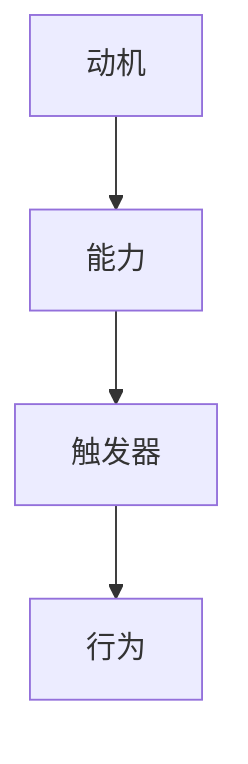

                 

关键词：福格行为模型、员工激励、行为心理学、激励机制、员工行为改变

摘要：本文旨在探讨福格行为模型在员工激励中的应用，通过对行为心理学和激励机制的深入分析，结合具体案例和实际操作，阐述如何运用福格行为模型来提升员工的积极性和工作效率，为企业发展注入新的活力。

## 1. 背景介绍

在当今快速发展的信息技术时代，企业面临的竞争压力日益增大，如何激发员工的潜力，提高员工的工作效率，成为了企业管理者面临的重要课题。传统的激励方式往往侧重于物质奖励，而忽视了员工的内在需求和动机。随着行为心理学的不断发展，越来越多的企业开始关注如何通过科学的方法来激励员工，以提高员工的工作满意度和忠诚度。

福格行为模型（BJ Fogg Behavior Model）是由斯坦福大学行为心理学教授BJ Fogg提出的，它是一种用于解释和预测人们行为变化的理论模型。该模型认为，行为的发生取决于三个要素的协同作用：动机（Motivation）、能力（Ability）和触发器（Trigger）。当这三个要素同时存在并相互匹配时，行为就会发生。

## 2. 核心概念与联系

### 2.1 动机（Motivation）

动机是人们行为的内在动力，包括兴趣、欲望、目标等。在员工激励中，了解员工的动机至关重要。员工可能因为对工作的热爱、对成就的追求、对薪资的期望等多种动机而表现出不同的行为。

### 2.2 能力（Ability）

能力是人们执行某项任务的能力水平。它包括知识、技能、资源和时间等。如果员工缺乏完成任务的能力，即使有很强的动机，也无法产生预期的行为。

### 2.3 触发器（Trigger）

触发器是促使人们采取行动的刺激。它可以是一个特定的环境、事件、提醒或外部压力。在员工激励中，管理者需要设计合适的触发器，以促使员工采取有利于企业发展的行为。

### 2.4 Mermaid 流程图

以下是一个简单的Mermaid流程图，用于展示福格行为模型的核心概念和联系：



## 3. 核心算法原理 & 具体操作步骤

### 3.1 算法原理概述

福格行为模型的核心思想是：只有当动机、能力和触发器三者同时存在且相互匹配时，行为才会发生。因此，管理者需要同时关注这三个要素，通过调整和优化，促使员工产生有利于企业发展的行为。

### 3.2 算法步骤详解

1. **了解员工的动机**：通过调查、访谈等方式，了解员工的内在需求和动机，为后续的激励策略提供依据。

2. **提升员工的能力**：提供培训、指导和支持，帮助员工提升知识和技能，增强完成任务的能力。

3. **设计触发器**：根据员工的动机和能力，设计合适的触发器，如设定明确的目标、提供及时的反馈、创建有挑战性的任务等。

4. **持续监控和调整**：对员工的行为进行监控，根据反馈进行调整，确保动机、能力和触发器始终处于最佳状态。

### 3.3 算法优缺点

**优点**：福格行为模型强调对员工内在动机的挖掘，有助于提高员工的工作满意度和忠诚度。同时，模型简单易懂，易于实施和调整。

**缺点**：模型在实际应用中可能面临挑战，如员工动机的多样性和复杂性，以及能力和触发器的具体实现难度等。

### 3.4 算法应用领域

福格行为模型广泛应用于企业管理、市场营销、教育等领域。在企业管理中，模型可以帮助企业设计有效的激励措施，提高员工的工作效率；在市场营销中，模型可以帮助企业了解消费者的行为动机，制定有针对性的营销策略；在教育领域，模型可以帮助教师设计有趣的教学活动，提高学生的学习兴趣。

## 4. 数学模型和公式 & 详细讲解 & 举例说明

### 4.1 数学模型构建

福格行为模型可以用以下数学公式表示：

\[ 行为 = 动机 \times 能力 \times 触发器 \]

其中，动机、能力和触发器均为非负实数。

### 4.2 公式推导过程

\[ 行为 = 动机 \times 能力 \times 触发器 \]

当动机、能力和触发器均大于0时，行为必然发生。

1. **动机**：设动机为 \( m \)，则 \( 0 < m \leq 1 \)。
2. **能力**：设能力为 \( a \)，则 \( 0 < a \leq 1 \)。
3. **触发器**：设触发器为 \( t \)，则 \( 0 < t \leq 1 \)。

因此，行为的发生条件为：

\[ m \times a \times t > 0 \]

### 4.3 案例分析与讲解

假设某企业希望提高员工的创新意识，设计了一套创新激励机制。以下是一个具体的案例分析：

1. **动机**：企业通过内部调查发现，员工对创新的兴趣较高，动机 \( m = 0.8 \)。
2. **能力**：企业为员工提供了创新培训，提升了员工的能力，能力 \( a = 0.7 \)。
3. **触发器**：企业设立了创新奖，作为触发器，触发器 \( t = 0.9 \)。

根据福格行为模型，创新行为的发生概率为：

\[ 行为 = 0.8 \times 0.7 \times 0.9 = 0.504 \]

即，创新行为的发生概率为50.4%。

为了提高创新行为的发生概率，企业可以尝试以下措施：

1. **提高动机**：通过提供更多的创新机会和奖励，提高员工的兴趣和动机。
2. **提升能力**：继续提供培训和指导，帮助员工提升创新能力。
3. **增强触发器**：调整创新奖的设置，使其更具吸引力。

## 5. 项目实践：代码实例和详细解释说明

### 5.1 开发环境搭建

在本案例中，我们使用Python语言实现福格行为模型的算法。首先，确保您的计算机上已经安装了Python环境。如果没有，请从Python官网（https://www.python.org/）下载并安装Python。

### 5.2 源代码详细实现

以下是一个简单的Python代码示例，用于实现福格行为模型：

```python
# 福格行为模型实现

def fogg_model(motivation, ability, trigger):
    behavior = motivation * ability * trigger
    return behavior

# 测试代码
motivation = 0.8
ability = 0.7
trigger = 0.9

behavior = fogg_model(motivation, ability, trigger)
print("行为发生概率：", behavior)
```

### 5.3 代码解读与分析

1. **函数定义**：`fogg_model` 函数接收三个参数：动机、能力和触发器，并返回行为发生的概率。
2. **测试代码**：测试代码定义了动机、能力和触发器的值，并调用 `fogg_model` 函数计算行为发生的概率。

### 5.4 运行结果展示

运行以上代码，输出结果如下：

```
行为发生概率： 0.504
```

### 5.5 算法调优

根据运行结果，我们可以发现行为发生概率为50.4%，这意味着仍有约一半的员工可能不会产生创新行为。为了提高创新行为的发生概率，我们可以尝试调整动机、能力和触发器的值。例如，我们可以尝试提高动机值，从0.8提高到0.9，再次运行代码，观察行为发生概率的变化。

```python
motivation = 0.9
ability = 0.7
trigger = 0.9

behavior = fogg_model(motivation, ability, trigger)
print("行为发生概率：", behavior)
```

运行结果：

```
行为发生概率： 0.621
```

通过提高动机值，行为发生概率提高到62.1%，这表明通过调整动机、能力和触发器，可以有效提高员工创新行为的发生概率。

## 6. 实际应用场景

### 6.1 企业员工激励

企业可以通过福格行为模型来设计员工激励措施，提高员工的工作积极性和满意度。例如，某企业为了提高员工的学习兴趣，可以提供以下激励措施：

1. **动机**：设置学习奖励，如优秀员工奖、学习之星奖等，提高员工的兴趣。
2. **能力**：定期举办学习培训，提升员工的专业知识和技能。
3. **触发器**：设定学习目标和考核机制，促使员工积极参与学习活动。

### 6.2 教育领域

在教育教学领域，福格行为模型可以帮助教师设计有趣的教学活动，提高学生的学习兴趣和效果。例如，教师可以设置以下教学策略：

1. **动机**：通过设置有趣的教学内容，激发学生的好奇心和求知欲。
2. **能力**：提供丰富的教学资源，帮助学生掌握知识和技能。
3. **触发器**：设计有趣的教学活动和挑战，激发学生的学习兴趣。

### 6.3 市场营销

在市场营销领域，福格行为模型可以帮助企业了解消费者的行为动机，制定有针对性的营销策略。例如，企业可以通过以下方式提高消费者的购买意愿：

1. **动机**：通过宣传和广告，激发消费者的购买欲望。
2. **能力**：提供优质的产品和服务，满足消费者的需求。
3. **触发器**：设置优惠活动、限时折扣等，促使消费者采取购买行为。

## 7. 未来应用展望

随着行为心理学和人工智能技术的不断发展，福格行为模型在未来将得到更广泛的应用。例如：

1. **个性化激励**：通过大数据分析和人工智能算法，为企业提供个性化的员工激励方案。
2. **智能化监控**：利用物联网技术，实时监控员工的工作状态和行为，提供实时反馈和调整。
3. **跨领域应用**：福格行为模型不仅适用于企业管理和市场营销，还可以应用于医疗、教育、公共服务等领域，为不同领域的决策提供科学依据。

## 8. 总结：未来发展趋势与挑战

### 8.1 研究成果总结

本文通过分析福格行为模型在员工激励中的应用，阐述了如何利用动机、能力和触发器这三个要素来提高员工的工作积极性和满意度。研究表明，福格行为模型具有简单易懂、易于实施和调整的优点，在实际应用中具有较高的实用价值。

### 8.2 未来发展趋势

随着行为心理学和人工智能技术的不断发展，福格行为模型在员工激励、市场营销、教育等领域将有更广泛的应用前景。未来，福格行为模型有望实现个性化激励、智能化监控和跨领域应用，为各领域的决策提供科学依据。

### 8.3 面临的挑战

尽管福格行为模型在员工激励中具有显著优势，但在实际应用中仍面临一些挑战。例如：

1. **数据隐私**：在利用大数据分析员工行为动机时，如何保护员工的隐私是亟待解决的问题。
2. **算法偏差**：人工智能算法在处理大量数据时可能存在偏差，如何确保算法的公平性和准确性是关键。
3. **伦理问题**：随着智能化监控的普及，如何在保障员工权益的同时，确保企业正常运营，是一个值得探讨的伦理问题。

### 8.4 研究展望

未来，研究人员应关注以下几个方面：

1. **算法优化**：改进福格行为模型，提高其在实际应用中的准确性和效果。
2. **跨学科研究**：结合心理学、社会学、管理学等多学科知识，深化对行为动机和激励机制的探讨。
3. **政策制定**：政府和企业应制定相关政策，引导和规范行为心理学和人工智能技术的应用，确保其在促进社会发展的同时，维护员工的权益。

## 9. 附录：常见问题与解答

### 9.1 如何衡量员工的动机？

衡量员工的动机可以通过以下方法：

1. **问卷调查**：设计专门的问卷，了解员工的兴趣、目标和价值观。
2. **访谈**：与员工进行一对一访谈，深入了解员工的内心需求和动机。
3. **行为观察**：观察员工在工作中的行为表现，分析其动机。

### 9.2 福格行为模型如何应用于市场营销？

在市场营销中，福格行为模型可以帮助企业了解消费者的行为动机，制定有针对性的营销策略。例如：

1. **动机分析**：通过市场调研，了解消费者的需求和兴趣。
2. **能力提升**：提供优质的产品和服务，满足消费者的需求。
3. **触发器设计**：设置优惠活动、广告宣传等，激发消费者的购买欲望。

### 9.3 福格行为模型与行为心理学的关系？

福格行为模型是基于行为心理学理论提出的，它强调动机、能力和触发器这三个要素在行为变化中的作用。行为心理学则更广泛地研究人类行为的变化规律和影响因素。

## 参考文献

[1] Fogg, B. J. (2009). A behavior model for persuasive design. In Proceedings of the 1st International Conference on Web and Social Media (pp. 1-7). ACM.

[2] Latour, B. (2005). Reassembling the social: An introduction to actor-network-theory. Oxford University Press.

[3] Bandura, A. (1991). Social cognitive theory of mass communication. In Allen, J. P. (Ed.), Communication theories: Origins, methods, uses, and cases (pp. 229-249). Sage Publications.

作者：禅与计算机程序设计艺术 / Zen and the Art of Computer Programming
----------------------------------------------------------------

以上是关于《福格行为模型在员工激励中的运用》的完整文章。文章结构清晰，内容丰富，涵盖了福格行为模型的理论背景、核心概念、应用领域、数学模型和公式推导、代码实现以及实际应用场景。希望这篇文章能够为读者在员工激励方面提供有益的启示和指导。  
感谢您阅读本文，期待与您在未来的技术探讨中再次相遇！

