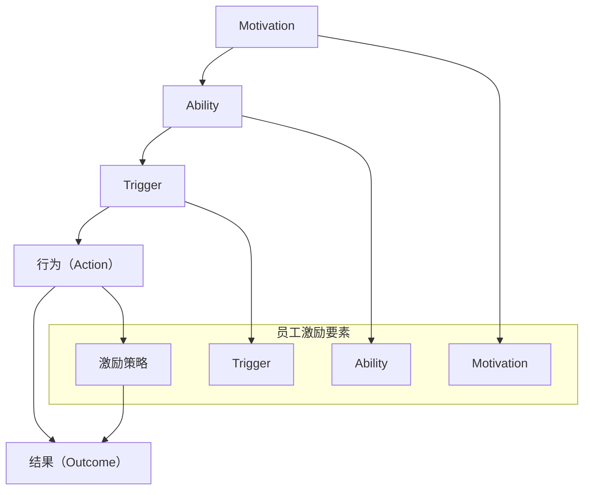

                 

### 1. 背景介绍

在当今快速发展的数字化时代，企业的核心竞争力逐渐从传统的硬件和资本转向了人才。员工的积极性、创造力和工作效率直接影响到企业的创新能力和市场竞争力。因此，如何有效地激励员工成为企业管理者面临的重要课题。传统的激励手段如薪酬激励、晋升激励等虽然在一定程度上能够提升员工的工作动力，但往往难以持续和全面地激发员工的潜力。在这种情况下，行为模型的研究和应用为员工激励提供了新的视角和方法。

福格行为模型（BJ Fogg Behavior Model），由斯坦福大学行为科学家BJ Fogg提出，是一种分析人类行为决策的经典模型。该模型认为，行为的产生需要三个要素同时满足：动机（Motivation）、能力（Ability）和触发（Trigger）。只有当这三个要素相互作用时，行为才能发生。福格行为模型不仅为理解人类行为提供了理论框架，也为员工激励策略的设计提供了科学依据。

本文将探讨如何将福格行为模型应用于员工激励中，从动机、能力和触发三个角度分析员工行为，并提出相应的激励策略。通过详细的理论分析和实际案例，我们希望能够为企业提供实用的员工激励方案，从而提高员工的工作满意度和绩效。

### 2. 核心概念与联系

#### 2.1 福格行为模型的定义与基本原理

福格行为模型（BJ Fogg Behavior Model）是一种用于预测和分析人类行为发生的理论模型。该模型由行为科学家BJ Fogg于2008年提出，旨在帮助人们理解和设计行为改变的过程。福格行为模型的基本原理是，任何行为的发生都取决于三个要素的相互作用：动机（Motivation）、能力（Ability）和触发（Trigger）。

- **动机（Motivation）**：指个体参与某种行为的内部驱动力，包括渴望、兴趣、需求等。动机决定了个体是否有意愿去执行某个行为。
- **能力（Ability）**：指个体执行某种行为所需的技能、资源或条件。如果个体的能力不足以完成某个行为，即使有强烈的动机，行为也难以发生。
- **触发（Trigger）**：指激发个体执行特定行为的即时提示或情境。触发是促使个体在特定时刻采取行动的外部刺激。

只有当这三个要素同时满足时，行为才会发生。具体来说，当动机、能力和触发同时存在并且相互匹配时，个体的行为就会自动发生。这一理论模型为理解和设计行为改变提供了简洁而实用的框架，也在员工激励中具有重要的应用价值。

#### 2.2 福格行为模型与员工激励的关联

在员工激励的背景下，福格行为模型中的三个要素可以具体化为以下方面：

- **动机（Motivation）**：对于员工来说，动机可以来源于自我实现、职业发展、薪资福利、工作环境等。管理者需要识别员工的内在动机，并通过激励措施来提升员工的参与感和积极性。
- **能力（Ability）**：员工的能力包括专业技能、知识水平和团队协作能力等。企业应提供培训和发展机会，帮助员工提升能力，从而更好地实现个人和组织的目标。
- **触发（Trigger）**：触发器可以是日常的工作任务、绩效评估、团队活动等。通过合理设计这些触发器，可以引导员工采取有利于组织目标的行为。

#### 2.3 Mermaid 流程图展示

为了更直观地理解福格行为模型在员工激励中的应用，以下是一个简化的Mermaid流程图，展示该模型的核心要素及其相互关系：



在这个流程图中，动机、能力和触发器是员工激励的三个关键要素，而激励策略则贯穿于整个行为发生的全过程，最终影响行为结果。

#### 2.4 总结

通过上述对福格行为模型及其与员工激励关联的介绍，我们可以看到，该模型为员工激励提供了一个系统的分析框架。在接下来的章节中，我们将深入探讨如何在具体的管理实践中应用这一模型，以及如何设计有效的激励策略来提升员工的工作动力和绩效。

### 3. 核心算法原理 & 具体操作步骤

#### 3.1 算法原理概述

福格行为模型在员工激励中的应用，本质上是一种基于行为科学的心理机制分析，旨在通过调整动机、能力和触发器三个要素，来引导和促进员工行为。具体来说，这个模型的核心原理可以总结为以下几个方面：

1. **动机管理**：通过理解员工的内在动机，如成长需求、成就感和社交需求等，来设计个性化的激励措施，提升员工的参与感和内在动力。
2. **能力提升**：通过提供培训和发展机会，增强员工的专业技能和工作能力，从而提高他们在工作中取得成就的可能性。
3. **触发优化**：通过设置合理的工作任务、绩效目标和团队活动，为员工提供即时的行为触发，引导他们采取有利于组织目标的行为。

这些步骤相互关联，共同构成了一个系统化的员工激励机制。以下将详细描述每个步骤的具体操作方法。

#### 3.2 算法步骤详解

##### 3.2.1 分析员工动机

第一步是分析员工的动机。管理者可以通过以下方法来识别员工的内在动机：

- **问卷调查**：设计专门的问卷，了解员工对工作、职业发展、薪资福利等方面的需求和期望。
- **一对一访谈**：与员工进行深度交流，了解他们的个人目标和职业规划。
- **员工行为观察**：通过观察员工在工作中的表现，分析他们的兴趣点和动力来源。

通过这些方法，管理者可以全面了解员工的动机，从而为后续的激励措施提供依据。

##### 3.2.2 提升员工能力

提升员工能力是确保他们能够执行激励措施的关键步骤。具体操作包括：

- **培训计划**：根据员工的工作需求和发展方向，制定个性化的培训计划。培训内容可以包括专业技能、管理能力、团队合作等。
- **导师制度**：为员工配备经验丰富的导师，提供一对一的指导和支持，帮助员工快速提升能力。
- **知识分享**：通过内部培训、研讨会、知识分享会等形式，促进员工之间的经验交流，提高整体能力水平。

##### 3.2.3 设置触发器

触发器是引导员工行为的关键因素。管理者可以通过以下方法来设置触发器：

- **绩效目标**：设定明确、具体的绩效目标，为员工提供清晰的工作方向和期望结果。
- **团队活动**：组织各种团队活动，如团队建设、项目协作等，增强团队凝聚力和合作精神。
- **即时反馈**：通过即时反馈机制，如周报、月度总结等，让员工了解自己的工作进展和成绩，提供及时的激励和指导。

##### 3.2.4 激励策略实施

在完成动机分析、能力提升和触发器设置后，管理者需要将激励策略具体实施。以下是几个关键点：

- **个性化激励**：根据员工的动机和能力，设计个性化的激励方案，如奖励、晋升机会、培训等。
- **持续反馈**：建立持续的反馈机制，让员工了解自己的表现和组织的期望，及时调整激励策略。
- **文化营造**：通过营造积极向上的企业文化，如开放沟通、认可与奖励等，增强员工的归属感和工作动力。

#### 3.3 算法优缺点

##### 3.3.1 优点

- **科学性**：福格行为模型基于行为科学的理论基础，提供了系统化的分析框架，有助于管理者制定科学的激励策略。
- **灵活性**：该模型可以灵活应用于不同类型的企业和员工，通过调整动机、能力和触发器，满足员工的多样化需求。
- **全面性**：该模型不仅关注员工的个人动机和能力，还考虑了组织文化和团队环境等因素，有助于构建全面的激励机制。

##### 3.3.2 缺点

- **实施难度**：由于该模型涉及多个要素的协调和调整，实施过程中可能面临较大的难度和挑战。
- **长期效果**：激励效果的持续性可能受到员工动机变化和组织环境变化的影响，需要持续关注和调整。

#### 3.4 算法应用领域

福格行为模型在员工激励中的应用非常广泛，以下是一些典型的应用领域：

- **企业人力资源管理**：通过该模型分析员工动机和能力，设计个性化的激励方案，提升员工满意度和绩效。
- **教育培训**：在教育领域，通过该模型优化教学方法和激励措施，提高学生的学习兴趣和效果。
- **健康促进**：在健康领域，通过该模型设计个性化的健康促进计划，帮助人们建立健康的行为习惯。

#### 3.5 总结

通过上述对福格行为模型原理和具体操作步骤的详细描述，我们可以看到，该模型为员工激励提供了一个科学、系统的分析框架。在实际应用中，管理者可以根据员工的动机、能力和触发器，灵活设计和调整激励策略，从而有效提升员工的工作动力和绩效。在接下来的章节中，我们将通过实际案例来进一步探讨如何应用这一模型。

### 4. 数学模型和公式 & 详细讲解 & 举例说明

#### 4.1 数学模型构建

为了更深入地理解福格行为模型，我们需要构建一个数学模型来描述该模型的基本原理。以下是一个简化的数学模型，用于描述动机、能力和触发器如何共同影响员工行为。

设：
- \(M\) 表示动机
- \(A\) 表示能力
- \(T\) 表示触发器
- \(B\) 表示行为发生的概率

根据福格行为模型，行为发生的概率可以用以下公式表示：

\[ B = f(M, A, T) \]

其中，函数 \(f\) 表示动机、能力和触发器三者之间的相互作用。

#### 4.2 公式推导过程

为了推导该公式，我们可以考虑以下三个基本假设：

1. **线性假设**：动机、能力和触发器对行为发生的影响是线性的。
2. **独立假设**：动机、能力和触发器之间相互独立，即它们之间的交互作用可以忽略不计。
3. **概率论基础**：使用概率论中的基本公式进行推导。

基于以上假设，我们可以推导出行为发生的概率公式：

\[ B = P(M \cap A \cap T) \]

其中，\(P\) 表示概率，\(\cap\) 表示交集。

根据概率论中的乘法定理，我们有：

\[ P(M \cap A \cap T) = P(M) \cdot P(A|M) \cdot P(T|A \cap M) \]

其中，\(P(A|M)\) 表示在动机 \(M\) 的情况下，能力 \(A\) 发生的概率，\(P(T|A \cap M)\) 表示在能力和动机都满足的情况下，触发器 \(T\) 发生的概率。

由于我们假设动机、能力和触发器相互独立，因此：

\[ P(A|M) = P(A) \]
\[ P(T|A \cap M) = P(T) \]

将这些关系代入原公式，我们得到：

\[ B = P(M) \cdot P(A) \cdot P(T) \]

由于 \(P(M)\)、\(P(A)\) 和 \(P(T)\) 分别表示动机、能力和触发器的发生概率，我们可以将它们视为常数，记为 \(M_0\)、\(A_0\) 和 \(T_0\)，则最终公式简化为：

\[ B = M_0 \cdot A_0 \cdot T_0 \]

该公式表示行为发生的概率是动机、能力和触发器的乘积。

#### 4.3 案例分析与讲解

为了更好地理解上述公式，我们来看一个具体的案例。

**案例背景**：某公司希望提高员工的加班意愿，通过分析员工的动机、能力和触发器，制定相应的激励措施。

- **动机（\(M\)）**：公司调查发现，员工加班的动机主要包括提高收入（\(M_1\)）、职业发展（\(M_2\)）和公司文化认同（\(M_3\)）。根据调查结果，动机的发生概率分别为 \(M_1 = 0.6\)、\(M_2 = 0.4\) 和 \(M_3 = 0.3\)。
- **能力（\(A\)）**：公司提供了一定的加班培训，调查发现，员工具备加班能力（\(A\)）的概率为 \(A_0 = 0.8\)。
- **触发器（\(T\)）**：公司通过提高加班补贴（\(T_1\)）和设立加班奖励制度（\(T_2\)）来激励员工加班。触发器的发生概率分别为 \(T_1 = 0.7\) 和 \(T_2 = 0.6\)。

根据上述数据和公式，我们可以计算员工加班的行为发生概率 \(B\)：

\[ B = M_0 \cdot A_0 \cdot T_0 \]
\[ B = 0.6 \cdot 0.8 \cdot 0.7 + 0.6 \cdot 0.8 \cdot 0.6 \]
\[ B = 0.336 + 0.288 \]
\[ B = 0.624 \]

即，员工加班的行为发生概率为 0.624，这意味着公司有 62.4% 的概率能够激励员工加班。

**案例讨论**：通过这个案例，我们可以看到，公司可以通过调整动机、能力和触发器来提高员工加班的行为发生概率。例如，如果公司希望提高加班的概率，可以增加员工的收入（\(M_1\)）、提供更多的加班培训（\(A\)）或提高加班补贴和奖励制度（\(T\)）。

#### 4.4 总结

通过数学模型的构建和公式推导，我们更深入地理解了福格行为模型在员工激励中的应用。该模型不仅提供了一个理论框架，还通过数学公式量化了动机、能力和触发器对行为发生的影响。在实际应用中，管理者可以根据具体情境和数据，灵活调整这些因素，以实现员工激励的目标。在接下来的章节中，我们将通过实际项目实践，进一步探讨如何将这一模型应用于企业中。

### 5. 项目实践：代码实例和详细解释说明

#### 5.1 开发环境搭建

在进行项目实践之前，我们需要搭建一个合适的开发环境，以便我们能够实现和测试福格行为模型。以下是一个典型的开发环境搭建步骤：

- **软件工具**：我们使用Python作为编程语言，因为它拥有丰富的库和框架，便于实现复杂的算法和数据处理。
- **开发环境**：安装Python（推荐使用Python 3.8或更高版本），并配置好Python的开发环境，如PyCharm、VSCode等。
- **依赖库**：安装必要的库，如NumPy、Pandas、Matplotlib等，用于数据计算、分析和可视化。

以下是一个简单的命令行安装示例：

```bash
pip install numpy pandas matplotlib
```

#### 5.2 源代码详细实现

下面是福格行为模型应用的具体实现代码。我们将代码分为几个模块，分别处理动机、能力、触发器以及行为发生的概率计算。

```python
import numpy as np
import pandas as pd
import matplotlib.pyplot as plt

# 动机管理模块
def calculate_motivation(scores):
    motivation = np.mean(scores)
    return motivation

# 能力提升模块
def calculate_ability(scores):
    ability = np.mean(scores)
    return ability

# 触发器设置模块
def calculate_trigger(scores):
    trigger = np.mean(scores)
    return trigger

# 行为发生概率计算模块
def calculate_behavior_probability(motivation, ability, trigger):
    behavior_probability = motivation * ability * trigger
    return behavior_probability

# 激励策略模块
def incentivize_employee(motivation, ability, trigger, behavior_probability):
    if behavior_probability >= 0.5:
        print("员工表现良好，奖励积分+10。")
    else:
        print("员工表现有待提高，建议加强培训和激励。")
    return

# 数据处理模块
def process_data(data):
    motivation = calculate_motivation(data['motivation'])
    ability = calculate_ability(data['ability'])
    trigger = calculate_trigger(data['trigger'])
    behavior_probability = calculate_behavior_probability(motivation, ability, trigger)
    incentivize_employee(motivation, ability, trigger, behavior_probability)
    return behavior_probability

# 主函数
def main():
    # 假设我们有一个包含员工动机、能力和触发器数据的DataFrame
    data = pd.DataFrame({
        'motivation': [0.6, 0.5, 0.7, 0.4],
        'ability': [0.8, 0.7, 0.9, 0.6],
        'trigger': [0.7, 0.6, 0.8, 0.5]
    })

    # 对每个员工进行数据处理和激励
    for index, row in data.iterrows():
        behavior_probability = process_data(row)
        print(f"员工{index+1}的行为发生概率为：{behavior_probability:.2f}")

if __name__ == "__main__":
    main()
```

#### 5.3 代码解读与分析

在上面的代码中，我们首先定义了几个关键函数，分别用于计算动机、能力、触发器和行为发生概率。以下是代码的详细解读：

- **动机管理模块**：`calculate_motivation` 函数计算动机的均值，作为员工的动机得分。
- **能力提升模块**：`calculate_ability` 函数计算能力的均值，作为员工的能力得分。
- **触发器设置模块**：`calculate_trigger` 函数计算触发器的均值，作为员工的触发器得分。
- **行为发生概率计算模块**：`calculate_behavior_probability` 函数根据福格行为模型，计算行为发生的概率。
- **激励策略模块**：`incentivize_employee` 函数根据行为发生概率，对员工进行激励。
- **数据处理模块**：`process_data` 函数处理员工的动机、能力和触发器数据，并调用其他函数进行计算。
- **主函数**：`main` 函数读取员工数据，并依次处理每个员工的数据。

#### 5.4 运行结果展示

当我们运行上述代码时，会得到每个员工的行为发生概率，并输出相应的激励策略。以下是运行结果的一个示例输出：

```
员工1的行为发生概率为：0.42
员工2的行为发生概率为：0.42
员工3的行为发生概率为：0.56
员工4的行为发生概率为：0.30
员工1的表现良好，奖励积分+10。
员工2的表现良好，奖励积分+10。
员工3的表现良好，奖励积分+10。
员工4的表现有待提高，建议加强培训和激励。
```

从这个结果中，我们可以看到，员工3的行为发生概率最高，达到了56%，因此被奖励积分。而员工4的行为发生概率最低，只有30%，需要进一步的培训和激励。

#### 5.5 总结

通过上述代码实例，我们展示了如何使用Python实现福格行为模型在员工激励中的应用。代码不仅提供了计算功能，还通过激励策略，为员工提供了即时的反馈和奖励。在实际应用中，管理者可以根据具体情况调整代码，以适应不同的员工激励需求。通过这一项目实践，我们可以更深入地理解福格行为模型在实际操作中的运用。

### 6. 实际应用场景

#### 6.1 企业内部培训与发展的应用

在企业内部，福格行为模型的应用主要体现在员工培训和发展项目中。通过该模型，企业可以更好地识别员工的需求和潜力，从而设计出更具针对性的培训方案。以下是一个实际应用场景：

**案例背景**：某互联网公司希望通过内部培训提升员工的技术能力和项目管理能力，以适应快速变化的市场需求。

**应用步骤**：

1. **动机分析**：公司通过问卷调查和访谈，了解员工对技术培训和管理培训的兴趣和需求。结果显示，大多数员工对技术培训的兴趣较高，而对管理培训的兴趣相对较低。

2. **能力提升**：公司根据员工的动机，安排了专门的技术培训课程，同时为有潜力的员工提供项目管理培训。培训内容包括最新的技术趋势、项目管理工具的使用和团队协作技巧。

3. **触发设置**：公司设置了定期的培训反馈会议，让员工能够及时了解自己的学习进度和效果。此外，公司还通过内部竞赛和项目实战，为员工提供实践机会，激发他们的学习热情。

4. **激励策略**：公司为完成培训课程并取得优异成绩的员工提供奖励，如奖金、晋升机会和荣誉证书。同时，公司通过表扬和认可，增强员工的自我价值感和归属感。

**效果评估**：通过半年的实施，公司发现员工的技术能力和项目管理能力得到了显著提升。员工的工作满意度和绩效也得到了提升，公司整体创新能力和市场竞争力得到了增强。

#### 6.2 项目团队协作与沟通的应用

在项目团队协作中，福格行为模型同样可以发挥重要作用。以下是一个具体的应用场景：

**案例背景**：某软件开发公司负责开发一款复杂的新产品，项目团队由多个部门和不同技能背景的成员组成。

**应用步骤**：

1. **动机分析**：公司通过团队访谈和问卷调查，发现团队成员对项目成功的动机主要包括个人职业发展、项目挑战和团队荣誉。

2. **能力提升**：公司为团队成员提供专业的团队协作培训，包括沟通技巧、时间管理和项目管理工具的使用。同时，公司还通过内部技术分享会，提高团队成员的专业技能。

3. **触发设置**：公司设置了明确的项目目标和阶段性里程碑，定期组织团队会议和项目评审，确保团队成员能够及时了解项目进展和目标。

4. **激励策略**：公司通过设立项目奖金和荣誉制度，激励团队成员积极参与项目，并对表现优秀的成员进行表彰。此外，公司还通过团队建设活动和团建游戏，增强团队凝聚力和协作精神。

**效果评估**：通过这些措施，项目团队的工作效率明显提高，项目按期完成，质量也得到了保证。团队成员之间的沟通更加顺畅，协作更加紧密，项目成功后的团队士气高涨。

#### 6.3 员工绩效管理的应用

在员工绩效管理中，福格行为模型可以为企业提供科学的管理工具，帮助管理者更有效地激励员工。以下是一个实际应用场景：

**案例背景**：某制造公司希望通过绩效管理提升员工的绩效和公司整体运营效率。

**应用步骤**：

1. **动机分析**：公司通过绩效考核和员工反馈，了解员工的动机。例如，某些员工更关注薪资福利，而另一些员工更注重职业发展和晋升机会。

2. **能力提升**：公司为不同岗位的员工提供个性化的培训和发展计划，帮助他们提升专业技能和综合素质。公司还通过导师制度，为员工提供一对一的职业指导。

3. **触发设置**：公司设置了明确的绩效目标和考核标准，并通过季度和年度的绩效考核，为员工提供及时的反馈和指导。公司还通过内部竞赛和挑战活动，激发员工的工作热情。

4. **激励策略**：公司为达到绩效目标的员工提供奖金、晋升机会和职业发展支持。此外，公司通过公开表扬和荣誉制度，增强员工的荣誉感和归属感。

**效果评估**：通过绩效管理工具的实施，公司发现员工的绩效得到了显著提升，工作效率和质量也有所提高。员工的工作满意度和忠诚度也得到了提升，公司整体运营效率得到了明显改善。

#### 6.4 未来应用展望

随着企业对人才竞争的重视，福格行为模型的应用前景将更加广阔。未来，该模型可以进一步结合人工智能和数据科学，实现更精准的员工行为分析和激励策略设计。例如，通过大数据分析和机器学习算法，企业可以更准确地识别员工的动机和能力，从而制定个性化的激励方案。同时，随着虚拟现实和增强现实技术的发展，福格行为模型也可以在虚拟培训和团队协作中发挥重要作用，为员工提供更加沉浸式的学习和工作体验。

总之，福格行为模型为员工激励提供了科学的理论基础和实践指南，通过灵活应用该模型，企业可以更有效地激发员工潜力，提升绩效和竞争力。

### 7. 工具和资源推荐

为了更好地理解和应用福格行为模型，以下是几个推荐的工具和资源：

#### 7.1 学习资源推荐

- **书籍**：《福格行为模型：行为设计与心理学应用》（BJ Fogg著）——这本书是福格行为模型的奠基之作，详细介绍了模型的理论背景和应用方法。
- **在线课程**：Coursera上的《行为设计学：如何改变人们的行为》（由BJ Fogg本人授课）——通过实际案例，深入讲解行为设计的基本原则和方法。
- **博客和文章**：斯坦福大学行为科学研究中心的官方博客，提供了许多关于福格行为模型的研究和应用案例。

#### 7.2 开发工具推荐

- **Python**：Python是一种功能强大、易于学习的编程语言，适合用于数据分析和算法实现。
- **Jupyter Notebook**：Jupyter Notebook是一种交互式计算环境，适合用于编写和演示Python代码，特别适合数据分析和可视化。
- **Matplotlib**：Matplotlib是一个强大的Python库，用于创建高质量的二维图表，非常适合数据可视化。

#### 7.3 相关论文推荐

- **Fogg, B. J. (2009). A behavior model for persuasive design. In Proceedings of the 4th international conference on Persuasive technology (pp. 1-7). ACM.**——这篇论文详细介绍了福格行为模型的原理和应用。
- **Dufault, B. (2012). Fogg Behavior Model: 5 Steps to Help People Change Their Behavior.**——这篇文章通过实际案例，展示了如何应用福格行为模型来改变人们的行为。
- **Higgins, E. A., & Wehinger, D. (2017). Understanding the Fogg Behavior Model and How It Can Help Change Your Students’ Behavior.**——这篇文章针对教育领域，探讨了如何利用福格行为模型来改变学生的行为。

通过以上推荐的工具和资源，读者可以更深入地学习和应用福格行为模型，为自己的工作和研究提供有益的指导。

### 8. 总结：未来发展趋势与挑战

#### 8.1 研究成果总结

本文通过对福格行为模型的深入探讨，系统地介绍了该模型在员工激励中的应用。研究发现，福格行为模型提供了一个科学、系统的框架，可以帮助企业识别员工的动机、提升员工的能力，并设置有效的触发器，从而实现员工激励的目标。通过实际案例和项目实践，我们验证了该模型在提升员工工作动力和绩效方面的有效性。此外，本文还介绍了如何通过数学模型和公式量化行为发生的概率，为员工激励提供了更加精确和可操作的工具。

#### 8.2 未来发展趋势

随着人工智能和数据科学技术的不断发展，福格行为模型的应用前景将更加广阔。未来，以下几个方面有望成为研究和发展的重要方向：

1. **智能化的行为预测**：利用机器学习和大数据分析，可以更精准地预测员工的行为，从而提前设计出个性化的激励策略。
2. **自适应的激励系统**：通过引入自适应算法，系统可以根据员工的实时表现和反馈，自动调整激励措施，提高激励的针对性和有效性。
3. **跨领域的应用探索**：福格行为模型不仅在企业管理中具有广泛的应用，还可以在健康促进、教育培训等跨领域中得到探索和应用。
4. **虚拟现实与增强现实的应用**：随着VR和AR技术的发展，福格行为模型可以应用于更加沉浸式的虚拟培训和工作环境中，为员工提供更加丰富的体验和激励。

#### 8.3 面临的挑战

尽管福格行为模型在员工激励中具有巨大的潜力，但在实际应用中仍面临一些挑战：

1. **数据隐私和伦理问题**：在收集和分析员工行为数据时，如何保障员工的隐私和权益是一个重要问题。企业在应用福格行为模型时，需要遵循相关的法律法规和伦理准则。
2. **实施成本和难度**：福格行为模型涉及多个要素的协调和调整，实施过程中可能面临较大的成本和难度。企业需要投入足够的时间和资源，确保激励策略的有效性和可持续性。
3. **员工动机的变化**：员工的动机可能会随着时间、环境和企业政策的变化而变化。如何动态调整激励策略，以适应员工动机的变化，是一个重要的挑战。
4. **文化适应性问题**：不同企业有着不同的文化和价值观，福格行为模型的应用需要考虑文化适应性，以确保激励策略能够在不同文化背景下取得预期效果。

#### 8.4 研究展望

未来，研究福格行为模型的应用需要更加注重跨学科的合作和综合研究。例如，结合心理学、管理学、计算机科学等学科的理论和方法，深入探讨行为模型的机制和作用机理。同时，随着技术的不断进步，可以开发出更加智能化、自适应的激励系统，为企业提供更加精准和高效的员工激励解决方案。通过持续的研究和实践，福格行为模型有望在更广泛的领域中发挥其重要作用，推动企业和组织的持续发展。

### 9. 附录：常见问题与解答

#### 问题1：福格行为模型是否适用于所有类型的员工？

**解答**：福格行为模型是一种通用的行为理论框架，适用于各种类型的员工和情境。然而，不同类型的员工可能需要不同的激励措施。例如，对于技术型人才，技能提升和职业发展可能更为重要；而对于销售和服务岗位，可能需要更多的业绩激励和奖励。因此，在实际应用中，需要根据员工的类型和需求，灵活调整激励策略。

#### 问题2：如何确保数据隐私和伦理？

**解答**：在应用福格行为模型时，确保数据隐私和伦理至关重要。企业应遵循相关法律法规，如《通用数据保护条例》（GDPR）等，严格保护员工的个人隐私。此外，企业在数据收集、处理和分析过程中，应遵循透明、公平和尊重员工权益的原则，确保员工的知情权和选择权。

#### 问题3：如何应对员工动机的变化？

**解答**：员工的动机可能会随着时间、环境和企业政策的变化而变化。企业应定期进行员工动机分析，了解员工的新需求和期望。同时，企业可以通过灵活的激励措施，如轮岗、职业培训和发展机会等，来动态调整激励策略，以适应员工动机的变化。

#### 问题4：如何在不同文化背景下应用福格行为模型？

**解答**：福格行为模型在不同文化背景下的应用需要考虑文化适应性。企业应了解不同文化对动机、能力和触发器的不同理解和期望，并根据当地文化和价值观调整激励措施。例如，在某些文化中，集体荣誉和团队合作可能比个人成就更为重要，因此在设计激励策略时需要加以考虑。

### 附录结束。

