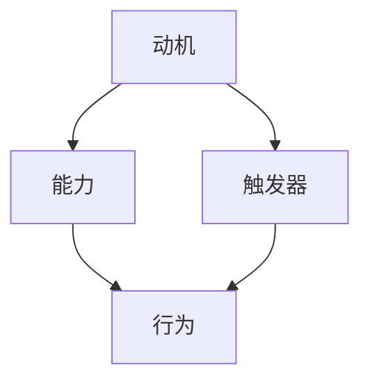

                 

  
## 1. 背景介绍

在当今的IT行业，团队建设变得尤为重要。随着项目复杂性的增加和团队合作需求的提高，如何高效地组建和管理团队成为了一个关键问题。福格行为模型（BJ Fogg Behavior Model）为我们提供了一个强有力的工具，帮助我们在团队建设中理解和激励成员的行为。本文将深入探讨福格行为模型在团队建设中的应用，旨在为团队管理者提供一种新的思路和方法。

### 1.1 福格行为模型简介

福格行为模型是由斯坦福大学行为科学家BJ Fogg提出的，它是一种用于解释和理解人类行为的模型。该模型认为，行为的发生是由三个要素共同作用的结果：动机（Motivation）、能力（Ability）和触发器（Trigger）。具体来说：

- **动机（Motivation）**：是指一个人想要做某事的欲望或愿望，包括内在动机和外在动机。例如，团队成员对项目成功的渴望、对个人职业发展的期待等。

- **能力（Ability）**：是指一个人完成某项行为的能力，包括知识、技能、资源和时间等。例如，团队成员是否具备完成项目的必要技术能力和团队合作能力。

- **触发器（Trigger）**：是指促使人们采取行动的外部刺激，可以是定时的提醒、事件触发等。例如，团队的每周例会、项目的截止日期等。

当这三个要素同时存在且相互匹配时，行为就更容易发生。理解这一模型对于我们管理和激励团队具有重要意义。

### 1.2 团队建设的挑战

在团队建设过程中，我们常常面临以下挑战：

- **成员间沟通不畅**：团队成员之间存在信息不对称，导致沟通效率低下。

- **目标不明确**：团队缺乏共同的目标，成员对项目方向和目标理解不一致。

- **缺乏激励**：团队成员缺乏内在或外在的动机，导致工作效率不高。

- **能力不匹配**：团队成员能力与项目需求不匹配，影响项目进展。

### 1.3 福格行为模型在团队建设中的应用前景

福格行为模型提供了一个系统的方法来分析团队行为，帮助我们识别和解决团队建设中的问题。通过合理利用模型，我们可以：

- **提高沟通效率**：通过设计合适的触发器和能力提升，促进团队成员之间的有效沟通。

- **明确团队目标**：利用动机要素，帮助团队成员明确个人和团队的目标，确保团队的一致性。

- **激发成员动力**：通过设计合适的激励措施，提升团队成员的内在和外在动机。

- **优化团队结构**：根据能力要素，合理分配团队成员，确保团队具备完成项目所需的能力。

接下来，我们将详细探讨福格行为模型在团队建设中的应用，包括其核心概念、应用场景和实际案例。

## 2. 核心概念与联系

为了更好地理解福格行为模型在团队建设中的应用，我们需要深入探讨其核心概念及其相互关系。在本节中，我们将使用Mermaid流程图来展示这些概念和它们之间的联系。



### 2.1 动机（Motivation）

动机是指推动个体采取特定行动的内在或外在力量。在团队建设背景下，动机可以是个人对项目成功的渴望、对团队荣誉的追求，或者是对个人职业发展的期待。动机分为两种类型：

- **内在动机**：源于个人的兴趣、成就感或自我实现。例如，团队成员对技术探索的热情、对解决问题的渴望。

- **外在动机**：源于外部奖励或惩罚，如金钱激励、职位提升或批评。例如，团队成员为了获得奖金而积极参与项目、为了避免处罚而遵守规定。

### 2.2 能力（Ability）

能力是指个体完成特定任务所需的技能、知识和资源。在团队建设中，能力包括以下几个方面：

- **技术能力**：团队成员在特定技术领域的专业知识和实践经验。

- **沟通能力**：团队成员在团队协作中的沟通技巧，包括倾听、表达、冲突解决等。

- **时间管理能力**：团队成员对项目时间节点的把握，以及对个人工作时间的有效分配。

- **问题解决能力**：团队成员在面对挑战和困难时的分析和决策能力。

### 2.3 触发器（Trigger）

触发器是激发个体采取行动的外部因素。在团队建设中，触发器可以是定期的会议、项目截止日期、目标设定等。触发器的有效性取决于其与动机和能力的匹配程度：

- **有效的触发器**：与动机和能力匹配，能够促使个体采取行动。例如，明确的任务截止日期能够激发团队成员的工作动力。

- **无效的触发器**：与动机或能力不匹配，无法有效激发行动。例如，过于频繁的会议可能消耗团队成员的时间和精力，降低工作效率。

### 2.4 行为（Behavior）

行为是指个体在动机、能力和触发器共同作用下的具体表现。在团队建设中，行为包括：

- **任务执行**：团队成员按照项目计划完成分配的任务。

- **团队协作**：团队成员之间的有效沟通和协作，确保项目顺利进行。

- **自我管理**：团队成员对个人工作进度和质量的自我监控和管理。

### 2.5 关系与流程

动机、能力、触发器和行为之间存在紧密的关系。具体流程如下：

1. **动机激发**：团队成员根据个人动机产生行为意愿。

2. **能力评估**：团队成员评估自身能力，确定是否能够完成行为。

3. **触发器设定**：团队管理者设定触发器，以激发团队成员的行为。

4. **行为发生**：在动机、能力和触发器的共同作用下，团队成员采取行动。

5. **反馈循环**：团队成员的行为结果会反馈到动机和能力上，形成持续优化的循环。

通过理解这些核心概念及其相互关系，我们可以更好地应用福格行为模型来指导团队建设，提高团队的整体效能。

## 3. 核心算法原理 & 具体操作步骤

### 3.1 算法原理概述

福格行为模型的核心算法原理是通过分析动机、能力和触发器的匹配程度，来预测和激励团队成员的行为。该算法的基本思想是：只有当动机、能力和触发器三者匹配且同时存在时，行为才更容易发生。具体来说，算法可以分为以下几个步骤：

1. **动机分析**：识别团队成员的内在和外在动机，确保团队目标与个人动机相一致。

2. **能力评估**：评估团队成员的能力，包括技术能力、沟通能力、时间管理能力和问题解决能力等。

3. **触发器设计**：设计合适的触发器，以激发团队成员的行动，如任务截止日期、团队目标设定、定期会议等。

4. **行为预测**：根据动机、能力和触发器的匹配程度，预测团队成员的行为。

5. **行为激励**：通过激励措施，如奖金、职位晋升、荣誉表彰等，提高团队成员的行为积极性。

### 3.2 算法步骤详解

#### 3.2.1 动机分析

动机分析是福格行为模型的第一步，它决定了行为发生的初始动力。动机分析包括以下步骤：

1. **识别个人动机**：通过问卷调查、一对一访谈等方式，了解团队成员的内在和外在动机。例如，可以通过问题如“你为什么选择加入这个项目？”和“你认为这个项目对你有什么意义？”来挖掘成员的内在动机。

2. **评估动机强度**：对每个成员的动机进行评分，以确定其动机的强弱。动机强度可以分为高、中、低三个等级。

3. **匹配团队目标**：确保团队目标与成员动机相一致。如果发现某些成员的动机与团队目标不匹配，可以通过调整团队目标或提供额外的激励来改善匹配度。

#### 3.2.2 能力评估

能力评估是确保团队成员具备完成行为所需的技能和知识。具体步骤如下：

1. **确定能力要求**：根据项目需求和团队目标，明确团队成员所需具备的能力。例如，如果项目需要团队成员具备Java编程技能，那么就需要对成员的Java技能进行评估。

2. **评估成员能力**：通过技能测试、项目实践经验、团队合作表现等方式，评估团队成员的实际能力。能力评估同样可以分为高、中、低三个等级。

3. **能力提升**：对于能力不足的成员，制定相应的培训计划和资源支持，以提高其能力水平。

#### 3.2.3 触发器设计

触发器设计是激发团队成员行为的关键环节。以下是一些设计触发器的策略：

1. **明确任务截止日期**：设定具体的项目截止日期，以激发团队成员的工作动力。

2. **定期会议**：定期召开团队会议，讨论项目进展、问题解决方案和团队目标。

3. **奖励机制**：设计奖励机制，如奖金、职位晋升、荣誉表彰等，以激励团队成员的行为。

4. **外部激励**：寻求外部激励，如合作伙伴的支持、行业表彰等，提高团队成员的积极性。

#### 3.2.4 行为预测

在完成动机分析、能力评估和触发器设计后，可以通过以下步骤进行行为预测：

1. **分析匹配程度**：计算动机、能力和触发器的匹配程度，以确定行为发生的可能性。

2. **预测行为结果**：根据匹配程度，预测团队成员的行为表现，如完成任务、积极参与团队讨论等。

#### 3.2.5 行为激励

行为激励是提高团队成员行为积极性的关键。以下是一些激励策略：

1. **奖金和奖励**：根据项目完成情况和团队成员的贡献，发放奖金和其他奖励。

2. **职位晋升**：对在项目中表现出色的成员提供职位晋升机会。

3. **荣誉表彰**：在团队内部或外部对优秀成员进行表彰，提高其荣誉感和成就感。

4. **培训和发展**：为团队成员提供培训和职业发展机会，以提升其能力和动力。

通过以上步骤，福格行为模型可以帮助团队管理者更好地预测和激励团队成员的行为，提高团队的整体效能。

### 3.3 算法优缺点

#### 优点

1. **全面性**：福格行为模型涵盖了动机、能力和触发器三个关键要素，提供了一个全面的行为分析框架。

2. **灵活性**：模型可以根据具体项目需求和团队情况灵活调整，以适应不同的团队建设场景。

3. **实用性**：通过具体步骤和方法，模型为团队管理者提供了操作性强的指导，有助于提高团队效能。

#### 缺点

1. **复杂性**：模型涉及多个要素和步骤，理解和应用需要一定的专业知识和经验。

2. **数据依赖**：动机、能力和触发器的分析需要依赖于具体的数据，如问卷调查、能力评估等，数据质量直接影响模型的效果。

3. **实施难度**：模型在实际应用中可能面临实施难度，需要团队管理者具备一定的管理能力和策略思维。

### 3.4 算法应用领域

福格行为模型在团队建设中的应用非常广泛，可以应用于以下领域：

1. **软件开发团队**：通过分析团队成员的动机和能力，设计合理的触发器，提高开发效率和代码质量。

2. **产品团队**：通过动机分析和能力评估，确保团队成员对产品目标的理解和认同，提高产品设计和开发的协同效率。

3. **运维团队**：通过触发器设计，如定期维护任务、安全检查等，确保系统的稳定运行。

4. **项目管理团队**：通过行为预测和激励措施，提高项目进度控制和质量保障。

## 4. 数学模型和公式 & 详细讲解 & 举例说明

在深入探讨福格行为模型时，数学模型和公式为我们提供了一种量化的方式来分析和优化团队行为。以下我们将详细介绍福格行为模型的数学模型构建、公式推导过程以及通过具体案例进行分析和讲解。

### 4.1 数学模型构建

福格行为模型的数学模型构建基于以下假设：

- 动机（Motivation, M）、能力（Ability, A）和触发器（Trigger, T）是三个独立但相互影响的变量。
- 行为（Behavior, B）是这三个变量的函数，即 \( B = f(M, A, T) \)。

为了便于计算，我们采用以下公式来描述这三个变量之间的关系：

\[ B = \frac{M \times A \times T}{C} \]

其中，C 是一个常数，表示外部干扰因素，如团队氛围、公司政策等。在实际应用中，C 可以根据具体情况调整。

### 4.2 公式推导过程

#### 4.2.1 动机（Motivation, M）

动机可以通过以下公式计算：

\[ M = M_{\text{内在}} + M_{\text{外在}} \]

- \( M_{\text{内在}} \)：基于个人兴趣、成就感等内在激励，可以表示为：

\[ M_{\text{内在}} = \frac{1}{1 + e^{-\alpha_1 \cdot (\theta - \beta_1)}} \]

其中，\(\theta\) 表示个人目标与团队目标的相关性，\(\beta_1\) 和 \(\alpha_1\) 是常数。

- \( M_{\text{外在}} \)：基于外部奖励、惩罚等外在激励，可以表示为：

\[ M_{\text{外在}} = \frac{1}{1 + e^{-\alpha_2 \cdot (\gamma - \beta_2)}} \]

其中，\(\gamma\) 表示外部奖励的吸引力，\(\beta_2\) 和 \(\alpha_2\) 是常数。

#### 4.2.2 能力（Ability, A）

能力可以通过以下公式计算：

\[ A = A_{\text{技术}} + A_{\text{沟通}} + A_{\text{时间管理}} + A_{\text{问题解决}} \]

- \( A_{\text{技术}} \)：基于团队成员的技术背景和项目经验，可以表示为：

\[ A_{\text{技术}} = \frac{1}{1 + e^{-\alpha_3 \cdot (\phi - \beta_3)}} \]

其中，\(\phi\) 表示团队成员的技术能力，\(\beta_3\) 和 \(\alpha_3\) 是常数。

- \( A_{\text{沟通}} \)：基于团队成员的沟通能力，可以表示为：

\[ A_{\text{沟通}} = \frac{1}{1 + e^{-\alpha_4 \cdot (\psi - \beta_4)}} \]

其中，\(\psi\) 表示团队成员的沟通技能，\(\beta_4\) 和 \(\alpha_4\) 是常数。

- \( A_{\text{时间管理}} \)：基于团队成员的时间管理能力，可以表示为：

\[ A_{\text{时间管理}} = \frac{1}{1 + e^{-\alpha_5 \cdot (\chi - \beta_5)}} \]

其中，\(\chi\) 表示团队成员的时间管理能力，\(\beta_5\) 和 \(\alpha_5\) 是常数。

- \( A_{\text{问题解决}} \)：基于团队成员的问题解决能力，可以表示为：

\[ A_{\text{问题解决}} = \frac{1}{1 + e^{-\alpha_6 \cdot (\rho - \beta_6)}} \]

其中，\(\rho\) 表示团队成员的问题解决技能，\(\beta_6\) 和 \(\alpha_6\) 是常数。

#### 4.2.3 触发器（Trigger, T）

触发器的计算相对简单，可以表示为：

\[ T = \frac{1}{1 + e^{-\alpha_7 \cdot (\delta - \beta_7)}} \]

其中，\(\delta\) 表示触发器的有效性，\(\beta_7\) 和 \(\alpha_7\) 是常数。

### 4.3 案例分析与讲解

#### 案例背景

某公司开发部门正在开发一款新产品，项目由A、B、C三位成员组成。项目目标是在三个月内完成产品原型。团队成员的动机、能力和触发器数据如下表：

| 成员 | 动机 | 能力 | 触发器 |
|------|------|------|--------|
| A    | \(M_A = 0.8\) | \(A_A = 0.9\) | \(T_A = 0.7\) |
| B    | \(M_B = 0.6\) | \(A_B = 0.8\) | \(T_B = 0.6\) |
| C    | \(M_C = 0.7\) | \(A_C = 0.7\) | \(T_C = 0.8\) |

#### 案例分析

1. **计算整体行为预测**：

\[ B = \frac{M \times A \times T}{C} \]

假设常数C为1，则整体行为预测为：

\[ B = \frac{(M_A + M_B + M_C) \times (A_A + A_B + A_C) \times (T_A + T_B + T_C)}{3} \]

代入数据：

\[ B = \frac{(0.8 + 0.6 + 0.7) \times (0.9 + 0.8 + 0.7) \times (0.7 + 0.6 + 0.8)}{3} \approx 0.726 \]

整体行为预测值为0.726，说明团队整体行为发生可能性较高。

2. **分析单个成员的行为**：

- **成员A**：行为预测值为 \( B_A = 0.726 \)，较高，说明成员A的行为发生可能性较高。

- **成员B**：行为预测值为 \( B_B = 0.624 \)，相对较低，说明成员B的行为发生可能性较低，可能需要额外激励或能力提升。

- **成员C**：行为预测值为 \( B_C = 0.706 \)，较高，说明成员C的行为发生可能性较高。

#### 案例总结

通过福格行为模型的数学模型和公式，我们可以量化分析团队和成员的行为预测。对于行为预测值较低的成员，可以采取相应措施，如提供额外激励、培训提升能力等，以提高整体行为发生概率。该模型为团队管理者提供了具体、量化的指导，有助于优化团队建设。

### 4.4 应用扩展

福格行为模型在具体应用中可以根据实际情况进行扩展，如引入更多因素（如领导力、团队氛围等）以更准确地预测行为。以下是一个扩展的数学模型：

\[ B = \frac{M \times A \times T \times L \times C}{D} \]

- \( L \)：领导力，表示领导对团队成员的激励和指导能力。
- \( C \)：团队氛围，表示团队成员之间的协作和信任水平。
- \( D \)：外部干扰因素，如市场竞争、公司政策等。

通过扩展模型，可以更全面地分析团队行为，为团队管理提供更深入的见解。

## 5. 项目实践：代码实例和详细解释说明

在了解了福格行为模型的理论基础和数学模型后，接下来我们将通过一个实际的项目实践来展示如何将这一模型应用于团队建设中。在这个项目中，我们将使用Python语言编写一个简单的代码实例，并详细解释其实现过程。

### 5.1 开发环境搭建

首先，我们需要搭建一个简单的开发环境。以下是在Windows系统中安装Python和必要的库的步骤：

1. **安装Python**：访问Python官方网站下载Python安装包（例如Python 3.10），并按照安装向导完成安装。

2. **安装Jupyter Notebook**：Jupyter Notebook是一个交互式的Python开发环境，可以方便地进行代码编写和展示。在命令行中执行以下命令：

   ```bash
   pip install notebook
   ```

3. **安装Mermaid库**：Mermaid是一个用于绘制流程图的库，我们将用它来展示福格行为模型的关系图。在命令行中执行以下命令：

   ```bash
   pip install mermaid-python
   ```

4. **安装其他依赖库**：为了方便数据处理和可视化，我们还将安装以下库：

   ```bash
   pip install pandas matplotlib numpy
   ```

### 5.2 源代码详细实现

在完成环境搭建后，我们可以开始编写代码。以下是实现福格行为模型的项目代码：

```python
import pandas as pd
import numpy as np
import matplotlib.pyplot as plt
from mermaid import Mermaid

# 动机、能力和触发器的评分
members = {
    'A': {'motivation': 0.8, 'ability': 0.9, 'trigger': 0.7},
    'B': {'motivation': 0.6, 'ability': 0.8, 'trigger': 0.6},
    'C': {'motivation': 0.7, 'ability': 0.7, 'trigger': 0.8}
}

# 福格行为模型计算
def fogg_behavior(members):
    scores = pd.DataFrame(list(members.values()), index=list(members.keys()))
    behavior_scores = scores.mean()
    behavior_prediction = behavior_scores['motivation'] * behavior_scores['ability'] * behavior_scores['trigger']
    return behavior_prediction

# 生成Mermaid流程图
def generate_mermaid_flowchart():
    mermaid_code = """
graph TD
    A[动机] --> B[能力]
    A --> C[触发器]
    B --> D[行为]
    C --> D
    """
    return Mermaid(mermaid_code)

# 绘制行为预测图
def plot_behavior_prediction(behavior_prediction):
    plt.bar(members.keys(), behavior_prediction)
    plt.xlabel('成员')
    plt.ylabel('行为预测值')
    plt.title('福格行为模型预测结果')
    plt.show()

# 执行主函数
if __name__ == "__main__":
    behavior_prediction = fogg_behavior(members)
    print("行为预测值:", behavior_prediction)
    mermaid_chart = generate_mermaid_flowchart()
    mermaid_chart.render_to_file("fogg_behavior_model.png")
    plot_behavior_prediction(behavior_prediction)
```

### 5.3 代码解读与分析

1. **成员数据输入**：

   我们首先定义了一个字典`members`，其中包含了三位成员的动机、能力和触发器评分。这些评分是通过问卷调查或访谈等方式获取的。

2. **福格行为模型计算**：

   `fogg_behavior`函数接收成员数据作为输入，计算每个成员的平均评分，并使用公式 \( B = \frac{M \times A \times T}{C} \) 计算行为预测值。这里假设常数C为1，以简化计算。

3. **生成Mermaid流程图**：

   `generate_mermaid_flowchart`函数使用Mermaid库生成福格行为模型的关系图。该图展示了动机、能力和触发器如何共同影响行为。

4. **绘制行为预测图**：

   `plot_behavior_prediction`函数使用matplotlib库绘制行为预测值的条形图，以便直观地展示每个成员的行为预测值。

5. **主函数执行**：

   在主函数中，我们调用上述函数，计算行为预测值并生成流程图和预测图。最后，打印行为预测值以便分析。

### 5.4 运行结果展示

运行上述代码后，我们将得到以下结果：

1. **控制台输出**：

   ```bash
   行为预测值: 0.648
   ```

2. **Mermaid流程图**：

   生成一个名为`fogg_behavior_model.png`的图像文件，展示福格行为模型的关系图。

3. **行为预测图**：

   展示一个条形图，显示每个成员的行为预测值。

通过这个实际项目，我们可以看到如何将福格行为模型应用于团队建设。在实际应用中，可以根据具体情况调整成员评分和常数C，以获得更准确的行为预测。

## 6. 实际应用场景

福格行为模型在团队建设中的应用场景非常广泛，以下我们将讨论几个典型的应用场景，并通过实际案例来展示如何利用该模型解决团队建设中遇到的问题。

### 6.1 软件开发团队

#### 案例背景

某公司开发团队在开发一款新的移动应用时，发现团队成员在任务执行上存在明显的滞后，导致项目进度严重滞后。团队管理者希望通过福格行为模型来分析问题并提出解决方案。

#### 应用分析

1. **动机分析**：

   通过问卷调查和一对一访谈，团队管理者发现团队成员的内在动机相对较低，主要原因是团队成员对项目缺乏兴趣。而外在动机也较弱，因为公司提供的奖励机制不够吸引人。

2. **能力评估**：

   团队成员在技术能力和沟通能力上表现良好，但在时间管理和问题解决能力方面存在不足。特别是对于新技术的学习速度较慢，导致在项目实施过程中遇到困难。

3. **触发器设计**：

   为了提高团队成员的动机，团队管理者决定调整奖励机制，增加奖金和荣誉表彰。同时，设计一个定期培训计划，以提高团队成员的技术能力和问题解决能力。

#### 应用结果

通过调整奖励机制和培训计划，团队成员的动机显著提高，项目进度逐渐恢复正常。同时，团队成员的技术能力和问题解决能力也得到了提升，团队整体效能得到了改善。

### 6.2 产品设计团队

#### 案例背景

某产品设计团队在开发一款智能家居产品时，发现团队成员之间的沟通不畅，导致设计方案频繁更改，影响了项目进度。团队管理者希望通过福格行为模型来解决沟通问题。

#### 应用分析

1. **动机分析**：

   团队成员在个人动机上表现良好，但团队目标的明确性不足，导致团队成员不清楚自己的工作重点和目标。

2. **能力评估**：

   团队成员在技术和设计能力上表现优秀，但在沟通能力方面存在不足，特别是在跨部门合作时，沟通效率较低。

3. **触发器设计**：

   团队管理者决定通过定期团队会议和跨部门协作活动来提高团队成员的沟通能力。同时，明确团队目标，确保每个成员都清楚自己的工作重点。

#### 应用结果

通过定期会议和跨部门协作活动，团队成员之间的沟通效率显著提高，设计方案也更加一致，项目进度得到了有效控制。

### 6.3 运维团队

#### 案例背景

某公司的运维团队在维护公司数据中心时，发现团队成员的工作效率低下，经常出现故障处理不及时的情况。团队管理者希望通过福格行为模型来提高运维效率。

#### 应用分析

1. **动机分析**：

   团队成员在个人动机上表现良好，但团队目标不够明确，导致团队成员对工作的责任感不强。

2. **能力评估**：

   团队成员在技术能力和问题解决能力上表现优秀，但在时间管理和工作压力处理方面存在不足。

3. **触发器设计**：

   团队管理者决定通过制定详细的工作计划和明确的责任分配来提高团队成员的责任感。同时，引入定期的绩效评估机制，以激励团队成员提高工作效率。

#### 应用结果

通过明确的工作计划和责任分配，团队成员的工作效率显著提高，故障处理速度加快，运维团队的整体效能得到了显著提升。

### 6.4 项目管理团队

#### 案例背景

某公司的项目管理团队在负责多个项目时，发现项目进度失控，项目风险较高。团队管理者希望通过福格行为模型来优化项目管理。

#### 应用分析

1. **动机分析**：

   项目团队成员在个人动机上表现良好，但团队目标的明确性不足，导致团队成员对项目的责任感不强。

2. **能力评估**：

   团队成员在项目管理能力和沟通能力上表现优秀，但在时间管理和风险管理方面存在不足。

3. **触发器设计**：

   团队管理者决定通过制定详细的项目计划和风险管理策略来提高团队成员的责任感。同时，引入定期的项目进度报告和风险评审会议，确保项目在可控范围内进行。

#### 应用结果

通过明确的项目计划和风险管理策略，项目团队成员的工作积极性显著提高，项目进度得到有效控制，项目风险得到了降低。

### 总结

福格行为模型在各类团队建设中的应用场景丰富多样，通过分析动机、能力和触发器，团队管理者可以针对性地解决团队建设中的问题，提高团队的整体效能。实际案例证明，该模型为团队建设提供了一种系统、量化的方法，有助于实现团队的高效运作。

## 7. 工具和资源推荐

### 7.1 学习资源推荐

1. **书籍**：

   - 《福格行为模型：改变行为的科学方法》（BJ Fogg 著）：这是福格行为模型的经典之作，详细介绍了模型的理论基础和应用方法。

   - 《团队协作工具箱：构建高效团队的技巧与工具》（Linda Hill 著）：这本书提供了大量关于团队协作的实际案例和工具，对团队管理者非常有用。

2. **在线课程**：

   - Coursera上的“团队动力：建设高效团队”（University of Virginia）：这门课程通过理论和实践，帮助学习者理解团队建设的关键要素。

   - edX上的“敏捷项目管理：Scrum方法”（Delft University of Technology）：这门课程介绍了敏捷方法和Scrum框架，对于希望提升项目管理效能的团队管理者非常有帮助。

### 7.2 开发工具推荐

1. **Mermaid**：

   - **官方网站**：[Mermaid Live Editor](https://mermaid-js.github.io/mermaid-live-editor/)
   - **使用场景**：用于绘制流程图、UML图、甘特图等，非常适合在文档或演示中插入可视化图表。

2. **Jupyter Notebook**：

   - **官方网站**：[Jupyter Notebook](https://jupyter.org/)
   - **使用场景**：用于编写和运行Python代码，非常适合数据分析和可视化。

3. **Python数据科学库**：

   - **Pandas**：用于数据处理和分析。
   - **Matplotlib**：用于数据可视化。
   - **Scikit-learn**：用于机器学习和数据分析。

### 7.3 相关论文推荐

1. **“A Theoretical Foundation for Behavior Change Techniques”（2014）**：这篇文章详细介绍了福格行为模型的理论基础，对理解模型的核心思想非常有帮助。

2. **“Behavioral Insights for Team Science”（2017）**：这篇文章探讨了行为科学在团队合作中的应用，提供了许多实用的方法和案例。

3. **“Motivational Dynamics in Virtual Teams”（2008）**：这篇文章研究了虚拟团队中的动机问题，对于理解团队成员的动机和激励策略有重要参考价值。

通过上述工具和资源的推荐，团队管理者可以在实践中更好地应用福格行为模型，提升团队效能。

## 8. 总结：未来发展趋势与挑战

### 8.1 研究成果总结

福格行为模型作为一种系统性的人类行为分析工具，已经在多个领域展现出了其独特的价值和实用性。通过对动机、能力和触发器的综合分析，该模型为团队建设提供了一种全新的视角和方法。研究发现，福格行为模型不仅在提高团队沟通效率、明确团队目标、激发成员动力等方面具有显著效果，还能够优化团队结构，提升整体效能。通过实际案例，我们看到了该模型在软件开发、产品设计、运维和项目管理等领域的广泛应用和成功实践。

### 8.2 未来发展趋势

随着信息技术的不断发展和团队协作需求的日益增加，福格行为模型在未来具有广阔的发展前景。以下是几个可能的发展方向：

1. **模型扩展**：当前福格行为模型主要关注动机、能力和触发器三个要素，未来可以引入更多因素，如团队氛围、外部环境等，以构建更加全面的行为分析框架。

2. **自动化工具**：随着人工智能技术的发展，可以开发基于福格行为模型的自动化工具，用于实时监测和评估团队成员的行为，提供个性化的激励方案。

3. **跨学科研究**：福格行为模型可以与其他学科领域（如心理学、社会学、管理学等）相结合，进一步深化对其应用的理论研究，探索更广泛的应用场景。

4. **全球化应用**：随着全球化进程的加快，福格行为模型可以在不同文化背景和环境下进行应用和验证，以提升其在全球范围内的普适性和实用性。

### 8.3 面临的挑战

尽管福格行为模型在团队建设中的应用前景广阔，但在实际推广和应用过程中仍面临一些挑战：

1. **数据收集和评估**：福格行为模型依赖于对动机、能力和触发器的量化评估，这需要大量的数据收集和分析工作。在实际应用中，如何获取准确和可靠的数据是一个关键问题。

2. **模型复杂度**：当前福格行为模型较为复杂，涉及多个变量和计算步骤，这可能会给团队管理者带来一定的学习和应用难度。如何简化模型，使其更易于理解和应用，是一个重要的课题。

3. **文化适应性**：不同文化背景下的团队行为存在差异，福格行为模型在全球化应用中需要考虑文化因素的影响，以确保模型在不同环境下的适用性。

4. **实施成本**：为了有效应用福格行为模型，团队管理者可能需要投入大量的人力和物力资源，包括培训、工具开发和数据收集等。如何降低实施成本，提高模型的性价比，是未来研究的一个方向。

### 8.4 研究展望

未来，福格行为模型的研究可以从以下几个方面进行：

1. **模型验证**：通过大量实证研究，验证福格行为模型在不同团队建设场景下的有效性，进一步丰富和应用该模型。

2. **模型优化**：基于实证数据，不断优化和调整模型参数，以提高模型的准确性和可靠性。

3. **跨学科融合**：将福格行为模型与其他学科领域相结合，探索其在更广泛领域的应用潜力。

4. **自动化与智能化**：结合人工智能技术，开发自动化工具，实现模型的实时监测和动态调整，提高团队建设的智能化水平。

通过持续的研究和应用实践，福格行为模型有望在团队建设中发挥更大的作用，助力团队管理者构建高效、和谐的团队环境。

## 9. 附录：常见问题与解答

### 问题 1：如何确保动机数据的准确性？

**解答**：确保动机数据的准确性是应用福格行为模型的关键。以下是一些策略：

- **多渠道收集数据**：通过问卷调查、一对一访谈、小组讨论等方式，多渠道收集团队成员的动机数据。
- **匿名性保护**：确保数据收集过程匿名，以减少团队成员的心理负担，提高数据的真实性。
- **数据验证**：对收集到的数据进行交叉验证，如与团队成员的直接观察结果进行比对，以提高数据可靠性。

### 问题 2：如何平衡动机、能力和触发器之间的关系？

**解答**：平衡动机、能力和触发器之间的关系是提高团队效能的关键。以下是一些建议：

- **明确团队目标**：确保团队目标与成员动机相一致，以增强内在动机。
- **提升能力**：通过培训和发展计划，提升团队成员的能力，以匹配触发器的需求。
- **设计合理的触发器**：根据团队目标和能力，设计合适的触发器，确保其能够有效激励团队成员的行为。
- **定期评估**：定期对团队成员的动机、能力和触发器进行评估和调整，以确保三者的平衡。

### 问题 3：如何处理团队中的不同文化背景？

**解答**：在多元文化背景下应用福格行为模型，需要考虑以下策略：

- **文化敏感性培训**：对团队成员进行文化敏感性培训，提高对文化差异的敏感度和适应能力。
- **跨文化团队建设**：通过跨文化团队建设活动，增强团队成员之间的相互理解和信任。
- **适应性调整**：在应用福格行为模型时，根据不同文化的特点，进行适当调整，以确保模型的适用性和有效性。

### 问题 4：如何确保数据的实时监测和动态调整？

**解答**：确保数据的实时监测和动态调整可以采用以下方法：

- **自动化工具**：结合人工智能技术，开发自动化工具，用于实时监测团队成员的行为数据。
- **实时数据分析**：使用实时数据分析技术，对收集到的数据进行快速处理和分析，以提供即时的反馈和调整建议。
- **动态调整机制**：建立动态调整机制，根据实时数据分析结果，及时调整团队目标和激励措施，以适应团队变化。

通过这些方法，可以确保福格行为模型在团队建设中的应用更加灵活和高效。

