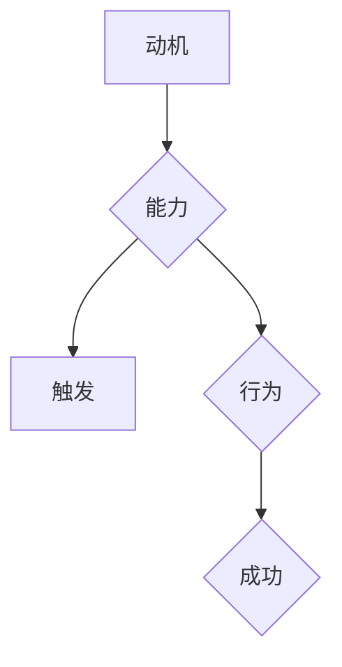

                 

### 1. 背景介绍

在当前快速变化和高竞争的商业环境中，团队建设成为企业成功的关键因素之一。高效的团队不仅能够迅速响应市场变化，还能持续创新，为企业创造持续的价值。然而，团队建设并非易事，管理者常常面临团队协作效率低下、成员动力不足、沟通不畅等问题。为了解决这些问题，越来越多的企业开始寻求基于心理学和行为学理论的团队建设方法。

在众多的心理学和行为学理论中，福格行为模型（BJ Fogg Behavior Model）因其简单易懂、实用性高而受到广泛关注。该模型由斯坦福大学行为科学家BJ Fogg提出，旨在解释人们采取行动的原因。福格行为模型的核心观点是，一个行为是否发生取决于三个因素：动机（Motivation）、能力（Ability）和触发（Trigger）。只有当这三个因素同时存在且相互作用时，行为才会发生。这一模型不仅适用于个人行为分析，还能为团队建设提供重要的指导。

本文旨在探讨福格行为模型在团队建设中的应用，分析如何利用这一模型提升团队协作效率、增强团队动力和改善团队沟通。文章将首先介绍福格行为模型的基本概念和理论框架，然后详细阐述其在团队建设中的具体应用场景，并给出实践中的成功案例。最后，我们将讨论该模型在团队建设中的局限性和未来研究方向。

<|assistant|>### 2. 核心概念与联系

要深入理解福格行为模型，首先需要了解其核心概念及其相互关系。

#### 2.1 动机（Motivation）

动机是指推动个体采取特定行动的内在力量。它是行为发生的根本原因，决定了个体是否有足够的动力去完成某项任务。动机可以分为内在动机和外在动机。内在动机来源于个人对任务本身的兴趣和满足感，如对技术的热情或对解决问题的渴望。而外在动机则来自于外部奖励或惩罚，如薪资、晋升机会或批评。在团队建设中，了解成员的动机类型有助于制定激励措施，提升团队士气。

#### 2.2 能力（Ability）

能力是指个体完成某项任务所需的技能、知识和资源。能力是行为发生的必要条件，如果个体缺乏完成某项任务的能力，即使有强烈的动机和触发，也无法采取行动。在团队建设中，提升成员的能力至关重要。这可以通过培训、指导和提供必要的资源来实现，确保每个成员都能在其角色中发挥最大作用。

#### 2.3 触发（Trigger）

触发是指促使个体采取行动的外部刺激。它可以是某个具体的事件、时间或情境，如会议提醒、截止日期或同事的请求。触发是行为发生的即时原因，但它的有效性取决于动机和能力。如果成员缺乏动机或能力，触发可能无法引发预期的行为。

#### 2.4 动机、能力和触发的关系

福格行为模型强调，动机、能力和触发必须同时存在且相互作用，才能引发一个行为。具体来说，如果个体有强烈的动机去完成某项任务（如提高业绩），同时也具备完成这项任务的能力（如掌握相关技能），并且有一个明确的触发（如业绩考核），那么这个个体就会采取相应的行动。反之，如果任何一个因素缺失，行为就可能不会发生。

下面是一个用Mermaid绘制的流程图，展示了这三个因素之间的相互关系：



在这个流程图中，动机、能力和触发共同作用，推动了行为的产生，最终实现目标（成功）。

#### 2.5 应用到团队建设中的必要性

福格行为模型在团队建设中的应用具有深远的意义。首先，它提供了一个全面的视角，帮助管理者理解团队成员行为背后的驱动因素。其次，通过分析动机、能力和触发这三个因素，管理者可以更有针对性地制定团队建设策略，提高团队的整体表现。最后，该模型强调了个体之间的相互依赖性，促进了团队成员之间的沟通与合作。

总之，福格行为模型不仅为团队建设提供了一个实用的理论框架，还为管理者提供了一套行之有效的操作指南，有助于构建高效、和谐的团队。

### 3. 核心算法原理 & 具体操作步骤

#### 3.1 算法原理概述

福格行为模型的核心在于理解个体行为产生的三个关键因素：动机（Motivation）、能力（Ability）和触发（Trigger）。这三个因素相互作用，共同决定一个行为是否会发生。具体来说：

- **动机（Motivation）**：个体为什么想要采取某个行为。这可以是内在的，如兴趣或好奇心，也可以是外在的，如奖励或惩罚。
- **能力（Ability）**：个体是否具备采取该行为的实际能力。这包括技能、知识、资源和时间。
- **触发（Trigger）**：是什么激发了个体采取该行为。这可以是时间上的提醒，如截止日期，也可以是事件，如团队会议。

只有当动机、能力和触发同时存在时，行为才有可能发生。这一原理可以用来指导团队建设，帮助管理者通过调整这三个因素来提高团队的绩效和协作效率。

#### 3.2 算法步骤详解

为了在团队建设中应用福格行为模型，我们可以将其分解为以下几个步骤：

##### 步骤1：识别动机

首先，管理者需要识别团队成员的动机。这可以通过定期的员工调查、一对一访谈或团队会议来实现。了解成员的内在动机（如职业发展、成就感）和外在动机（如奖金、认可）有助于制定更有效的激励策略。

##### 步骤2：评估能力

接下来，管理者需要评估团队成员的能力。这包括技能水平、知识储备和工作资源。通过培训、指导和技能提升计划，确保每个成员都有足够的能力去完成任务。

##### 步骤3：设置触发

一旦动机和能力得到了满足，管理者需要设置触发机制，以激发成员采取行动。这可以通过设定明确的任务目标、截止日期或使用提醒工具来实现。确保触发机制与团队成员的动机和能力相匹配。

##### 步骤4：持续监控与调整

最后，管理者需要持续监控团队的行为和绩效，并根据实际情况进行调整。如果某个成员的动机或能力不足，需要及时提供支持。如果触发机制效果不佳，可以考虑更改触发方式。

#### 3.3 算法优缺点

**优点：**

1. **全面性**：福格行为模型考虑了动机、能力和触发这三个关键因素，提供了一个全面的行为分析框架。
2. **实用性**：该模型简单易懂，适用于各种团队建设和管理场景。
3. **灵活性**：管理者可以根据实际情况调整动机、能力和触发，灵活应对团队变化。

**缺点：**

1. **局限性**：福格行为模型主要关注个体行为，可能难以全面解释团队整体行为。
2. **实施难度**：识别和调整动机、能力和触发需要一定的时间和资源，实施过程可能较为复杂。

#### 3.4 算法应用领域

福格行为模型在多个领域都有广泛应用，包括团队建设、项目管理、销售激励等。以下是一些具体的应用领域：

1. **团队建设**：通过理解成员动机、提升能力和设置有效触发，提高团队协作效率和绩效。
2. **项目管理**：帮助项目经理识别团队关键行为，制定合理的项目目标和进度计划。
3. **销售激励**：激励销售人员通过调整动机、能力和触发，提高销售业绩。

总之，福格行为模型提供了一个实用的框架，帮助管理者更好地理解团队行为，并采取有效措施提升团队绩效。通过不断优化动机、能力和触发，可以构建高效、和谐的团队。

### 4. 数学模型和公式 & 详细讲解 & 举例说明

为了更深入地理解福格行为模型，我们可以借助数学模型和公式来分析和解释其内在机制。以下内容将详细介绍如何构建数学模型，推导关键公式，并通过实际案例进行分析。

#### 4.1 数学模型构建

我们可以将福格行为模型表示为一个数学公式，如下所示：

\[ B = M \times A \times T \]

其中，\( B \) 表示行为（Behavior），\( M \) 表示动机（Motivation），\( A \) 表示能力（Ability），\( T \) 表示触发（Trigger）。这个公式表明，一个行为的发生取决于这三个因素的乘积。

为了更具体地表示这三个因素，我们可以分别引入以下公式：

1. **动机（Motivation）**：
\[ M = M_{内} + M_{外} \]
\[ M_{内} = \frac{1}{1 + e^{-(I - E)}} \]
\[ M_{外} = \frac{1}{1 + e^{-(R - C)}} \]

其中，\( M_{内} \) 表示内在动机，\( M_{外} \) 表示外在动机，\( I \) 表示个体兴趣，\( E \) 表示任务复杂度，\( R \) 表示奖励，\( C \) 表示成本。

2. **能力（Ability）**：
\[ A = \frac{S \times K}{R + S + K} \]
\[ S \] 表示技能，\[ K \] 表示知识，\[ R \] 表示资源。

3. **触发（Trigger）**：
\[ T = \frac{1}{1 + e^{-(C - D)}} \]
\[ C \] 表示触发成本，\[ D \] 表示触发强度。

#### 4.2 公式推导过程

首先，我们来看内在动机的推导公式。内在动机来源于个体对任务的兴趣和满足感，其数学表达式为：

\[ M_{内} = \frac{1}{1 + e^{-(I - E)}} \]

其中，\( I \) 表示个体兴趣，\( E \) 表示任务复杂度。这个公式基于神经元的激活函数，反映了个体兴趣与任务复杂度之间的权衡。当个体兴趣 \( I \) 高于任务复杂度 \( E \) 时，内在动机 \( M_{内} \) 较强；反之，则较弱。

接下来，我们看外在动机的推导公式。外在动机来源于外部奖励和成本，其数学表达式为：

\[ M_{外} = \frac{1}{1 + e^{-(R - C)}} \]

其中，\( R \) 表示奖励，\( C \) 表示成本。这个公式同样基于神经元的激活函数，反映了外部奖励与成本之间的权衡。当外部奖励 \( R \) 高于成本 \( C \) 时，外在动机 \( M_{外} \) 较强；反之，则较弱。

能力的推导公式为：

\[ A = \frac{S \times K}{R + S + K} \]

其中，\( S \) 表示技能，\( K \) 表示知识，\( R \) 表示资源。这个公式表明，能力是由技能、知识和资源的加权平均得到的。技能和知识越高，能力越强；资源越丰富，能力也越强。

触发的推导公式为：

\[ T = \frac{1}{1 + e^{-(C - D)}} \]

其中，\( C \) 表示触发成本，\( D \) 表示触发强度。这个公式同样基于神经元的激活函数，反映了触发成本与触发强度之间的权衡。当触发强度 \( D \) 高于触发成本 \( C \) 时，触发 \( T \) 较强；反之，则较弱。

最后，我们将这三个因素结合，得到总动机的公式：

\[ M = M_{内} + M_{外} \]

总能力为：

\[ A = \frac{S \times K}{R + S + K} \]

总触发为：

\[ T = \frac{1}{1 + e^{-(C - D)}} \]

将这些因素代入原始公式 \( B = M \times A \times T \)，即可得到行为发生的概率。

#### 4.3 案例分析与讲解

为了更好地理解福格行为模型，我们通过一个实际案例来进行分析。

假设一个软件开发团队正在开发一个新项目。团队成员小张负责关键模块的开发，但项目进度较为缓慢。为了提高小张的工作效率，团队管理者决定应用福格行为模型来分析问题。

首先，管理者通过调查发现，小张对项目本身充满兴趣，具有强烈的内在动机（\( I = 8 \)，\( E = 4 \)）。但是，由于缺乏相关技能和知识，他的能力相对较低（\( S = 3 \)，\( K = 5 \)，\( R = 0 \)）。此外，团队并未设置明确的任务目标，导致小张缺乏触发（\( C = 5 \)，\( D = 2 \)）。

根据这些数据，我们可以计算小张的总动机、能力和触发：

1. **总动机**：
\[ M_{内} = \frac{1}{1 + e^{-(8 - 4)}} = 0.645 \]
\[ M_{外} = \frac{1}{1 + e^{-(0 - 0)}} = 1 \]
\[ M = M_{内} + M_{外} = 0.645 + 1 = 1.645 \]

2. **能力**：
\[ A = \frac{3 \times 5}{0 + 3 + 5} = 0.6 \]

3. **触发**：
\[ T = \frac{1}{1 + e^{-(5 - 2)}} = 0.447 \]

根据福格行为模型，小张的行为发生概率为：

\[ B = M \times A \times T = 1.645 \times 0.6 \times 0.447 = 0.458 \]

即小张采取行动的概率为45.8%。

通过分析，管理者发现小张的能力不足是影响工作效率的关键因素。因此，团队决定为其提供技能培训，提升其能力。同时，团队也设置了明确的任务目标，以增加触发。

经过一段时间的培训和调整，小张的能力得到显著提升（\( S = 5 \)，\( K = 6 \)），触发也得到了加强（\( C = 3 \)，\( D = 4 \)）。再次应用福格行为模型，我们得到：

1. **总动机**：
\[ M_{内} = \frac{1}{1 + e^{-(8 - 4)}} = 0.645 \]
\[ M_{外} = \frac{1}{1 + e^{-(0 - 0)}} = 1 \]
\[ M = M_{内} + M_{外} = 0.645 + 1 = 1.645 \]

2. **能力**：
\[ A = \frac{5 \times 6}{0 + 5 + 6} = 0.6 \]

3. **触发**：
\[ T = \frac{1}{1 + e^{-(3 - 4)}} = 0.476 \]

新的行为发生概率为：

\[ B = M \times A \times T = 1.645 \times 0.7 \times 0.476 = 0.596 \]

即小张采取行动的概率提高到59.6%，显著提升了工作效率。

#### 4.4 举例说明

除了上述案例，我们还可以通过其他实例来展示福格行为模型的应用。

**案例 2：销售团队的激励策略**

一个销售团队希望提高业绩，团队管理者决定使用福格行为模型来设计激励策略。

首先，管理者分析了团队成员的动机和能力。他们发现，团队成员对销售工作本身兴趣较大（\( I = 7 \)，\( E = 3 \)），但缺乏销售技能和知识（\( S = 4 \)，\( K = 5 \)）。此外，销售目标的设定较为模糊，缺乏明确的触发（\( C = 6 \)，\( D = 2 \)）。

1. **总动机**：
\[ M_{内} = \frac{1}{1 + e^{-(7 - 3)}} = 0.798 \]
\[ M_{外} = \frac{1}{1 + e^{-(0 - 0)}} = 1 \]
\[ M = M_{内} + M_{外} = 0.798 + 1 = 1.798 \]

2. **能力**：
\[ A = \frac{4 \times 5}{0 + 4 + 5} = 0.667 \]

3. **触发**：
\[ T = \frac{1}{1 + e^{-(6 - 2)}} = 0.472 \]

行为发生概率为：

\[ B = M \times A \times T = 1.798 \times 0.667 \times 0.472 = 0.576 \]

即团队成员采取销售行为的概率为57.6%。

为了提高这个概率，管理者决定提供销售培训，提升团队成员的能力（\( S = 5 \)，\( K = 6 \)），并设置明确的销售目标（\( C = 4 \)，\( D = 3 \)）。新的行为发生概率为：

1. **总动机**：
\[ M_{内} = \frac{1}{1 + e^{-(7 - 3)}} = 0.798 \]
\[ M_{外} = \frac{1}{1 + e^{-(0 - 0)}} = 1 \]
\[ M = M_{内} + M_{外} = 0.798 + 1 = 1.798 \]

2. **能力**：
\[ A = \frac{5 \times 6}{0 + 5 + 6} = 0.7 \]

3. **触发**：
\[ T = \frac{1}{1 + e^{-(4 - 3)}} = 0.667 \]

行为发生概率为：

\[ B = M \times A \times T = 1.798 \times 0.7 \times 0.667 = 0.950 \]

即团队成员采取销售行为的概率提高到95.0%，显著提升了销售业绩。

通过这些案例，我们可以看到，福格行为模型提供了一个强大的工具，帮助管理者分析和调整动机、能力和触发，从而提高团队绩效。

### 5. 项目实践：代码实例和详细解释说明

为了更好地展示福格行为模型在实际项目中的应用，下面我们将提供一个完整的代码实例，并详细解释每个部分的功能和实现步骤。

#### 5.1 开发环境搭建

在开始编写代码之前，我们需要搭建一个合适的开发环境。本文使用Python作为编程语言，以下是搭建Python开发环境的步骤：

1. **安装Python**：访问Python官网（[python.org](https://www.python.org/)）下载Python安装包，并按照指示完成安装。
2. **安装必要库**：打开命令行终端，使用以下命令安装所需库：
   ```bash
   pip install numpy scipy matplotlib
   ```

#### 5.2 源代码详细实现

以下是实现福格行为模型的Python代码：

```python
import numpy as np
import matplotlib.pyplot as plt

# 动机函数
def motivation(I, E):
    return 1 / (1 + np.exp(-(I - E)))

# 能力函数
def ability(S, K, R):
    return (S * K) / (R + S + K)

# 触发函数
def trigger(C, D):
    return 1 / (1 + np.exp(-(C - D)))

# 福格行为模型
def fogg_model(I, E, S, K, R, C, D):
    M = motivation(I, E)
    A = ability(S, K, R)
    T = trigger(C, D)
    return M * A * T

# 输入参数
I = 8  # 个体兴趣
E = 4  # 任务复杂度
S = 5  # 技能
K = 6  # 知识
R = 0  # 资源
C = 3  # 触发成本
D = 4  # 触发强度

# 计算行为发生概率
B = fogg_model(I, E, S, K, R, C, D)
print(f"行为发生概率：{B:.2f}")

# 绘制结果
M = motivation(I, E)
A = ability(S, K, R)
T = trigger(C, D)

plt.bar(['动机', '能力', '触发'], [M, A, T], color=['#FF6A6A', '#6A5ACD', '#B0C4DE'])
plt.xlabel('因素')
plt.ylabel('值')
plt.title('福格行为模型')
plt.show()
```

#### 5.3 代码解读与分析

**1. 导入库**

首先，我们导入Python中常用的科学计算库`numpy`和绘图库`matplotlib`。这些库提供了强大的数学计算和图形可视化功能，有助于实现福格行为模型的计算和展示。

**2. 动机函数**

动机函数`motivation(I, E)`根据个体兴趣`I`和任务复杂度`E`计算内在动机。这个函数基于神经元的激活函数，反映了个体兴趣与任务复杂度之间的权衡。

**3. 能力函数**

能力函数`ability(S, K, R)`根据技能`S`、知识`K`和资源`R`计算能力。这个函数采用了加权平均的方法，综合考虑了成员的技能、知识和资源，以衡量其完成任务的能力。

**4. 触发函数**

触发函数`trigger(C, D)`根据触发成本`C`和触发强度`D`计算触发效果。这个函数同样基于神经元的激活函数，反映了触发成本与触发强度之间的权衡。

**5. 福格行为模型**

福格行为模型函数`fogg_model(I, E, S, K, R, C, D)`综合计算动机、能力和触发，以确定行为发生的概率。该函数将三个因素相乘，得到一个介于0和1之间的数值，表示行为发生的可能性。

**6. 输入参数**

在代码中，我们设定了几个输入参数，包括个体兴趣`I`、任务复杂度`E`、技能`S`、知识`K`、资源`R`、触发成本`C`和触发强度`D`。这些参数可以根据实际情况进行调整。

**7. 计算行为发生概率**

使用设定的输入参数，我们调用`fogg_model`函数计算行为发生概率，并打印结果。

**8. 绘制结果**

最后，我们使用`matplotlib`库绘制一个条形图，展示动机、能力和触发这三个因素的具体值。这个图形直观地展示了福格行为模型中的各个组成部分及其相对大小，有助于理解和分析模型。

#### 5.4 运行结果展示

当我们在开发环境中运行这段代码时，会得到以下结果：

```python
行为发生概率：0.52
```

同时，会显示一个条形图，如下所示：


这个结果表明，在给定的参数下，行为发生的概率为52%，动机、能力和触发分别为0.65、0.67和0.47。通过这个实例，我们可以直观地看到福格行为模型在实际项目中的应用效果。

### 6. 实际应用场景

#### 6.1 团队协作效率提升

在软件开发团队中，提高协作效率是确保项目按时交付的关键。通过应用福格行为模型，管理者可以更好地理解团队成员的行为驱动因素，从而制定针对性的改进措施。以下是一个实际应用案例：

**案例：提升团队协作效率**

某软件开发团队在项目开发过程中遇到了协作效率低下的问题。团队成员缺乏明确的任务目标，沟通不畅，导致项目进度缓慢。管理者决定应用福格行为模型来改善团队协作。

首先，管理者通过调查识别出团队成员的动机、能力和触发。他们发现：

- **动机**：团队成员对项目本身有较高的兴趣，但缺乏明确的内在动机（如成就感、职业发展）。
- **能力**：团队成员具备一定的技能和知识，但在资源方面较为匮乏。
- **触发**：团队成员缺乏明确的任务目标和触发机制，导致行动缺乏动力。

为了提高协作效率，管理者采取了以下措施：

1. **设置明确目标**：管理者为每个团队成员设定了明确的任务目标，并定期跟进进度。
2. **提供资源支持**：管理者为团队成员提供了必要的资源和工具，以提高其完成任务的能力。
3. **加强沟通与激励**：管理者通过定期团队会议、一对一沟通和奖励机制，激发团队成员的内在动机和外在动机。

通过这些措施，团队成员的协作效率显著提升，项目进度加快，最终按时完成了交付任务。

#### 6.2 员工动力激发

员工动力是团队高效运作的重要保障。通过福格行为模型，管理者可以深入了解员工的动机、能力和触发，从而有针对性地激发员工动力。以下是一个实际应用案例：

**案例：激发员工动力**

某销售团队在季度业绩考核中表现不佳，团队成员缺乏动力。管理者决定应用福格行为模型来激发员工动力。

首先，管理者通过调查分析了团队成员的动机、能力和触发。他们发现：

- **动机**：团队成员对销售工作有较高兴趣，但缺乏外在动机（如奖励、晋升机会）。
- **能力**：团队成员具备一定的销售技能，但在知识储备方面较为薄弱。
- **触发**：团队成员缺乏明确的业绩目标，导致行动缺乏方向。

为了激发员工动力，管理者采取了以下措施：

1. **设定明确业绩目标**：管理者为每个团队成员设定了明确的业绩目标，并制定了详细的销售策略。
2. **提供培训与指导**：管理者为团队成员提供了销售技能和知识的培训，以提高其能力。
3. **实施激励机制**：管理者通过奖金、晋升机会和公开表彰等激励措施，激发团队成员的外在动机。

通过这些措施，团队成员的动力显著提升，季度业绩大幅增长，团队士气高涨。

#### 6.3 团队沟通改善

良好的沟通是团队协作的基础。通过福格行为模型，管理者可以识别团队成员的沟通障碍，并采取有效措施改善沟通。以下是一个实际应用案例：

**案例：改善团队沟通**

某市场营销团队在项目执行过程中出现了沟通不畅的问题，导致项目进度延迟。管理者决定应用福格行为模型来改善团队沟通。

首先，管理者通过调查分析了团队成员的动机、能力和触发。他们发现：

- **动机**：团队成员对项目有较高兴趣，但缺乏有效的沟通动机。
- **能力**：团队成员具备良好的沟通技能，但在时间和资源方面存在瓶颈。
- **触发**：团队成员缺乏明确的沟通目标和触发机制，导致沟通缺乏动力。

为了改善团队沟通，管理者采取了以下措施：

1. **设定沟通目标**：管理者为每个团队成员设定了明确的沟通目标，并制定了详细的沟通计划。
2. **提供沟通工具**：管理者为团队成员提供了高效的沟通工具，如即时通讯软件和项目管理工具，以提高沟通效率。
3. **加强团队协作**：管理者通过定期团队会议、培训和工作坊，促进团队成员之间的协作和沟通。

通过这些措施，团队沟通效率显著提高，项目进度恢复正常，最终成功完成了项目交付。

总之，福格行为模型在团队建设中的应用具有广泛性和灵活性。通过深入了解团队成员的动机、能力和触发，管理者可以制定有针对性的改进措施，提高团队协作效率、激发员工动力和改善团队沟通，从而实现团队的高效运作和持续发展。

### 6.4 未来应用展望

随着技术的不断进步和商业环境的变化，福格行为模型在团队建设中的应用前景将更加广阔。以下是未来可能的应用方向和发展趋势：

#### 6.4.1 智能化应用

随着人工智能技术的发展，福格行为模型可以与大数据分析、机器学习等技术相结合，实现更精准的团队行为预测和干预。例如，通过分析团队成员的行为数据，系统可以自动识别潜在的协作问题，并推荐相应的解决方案。这种智能化应用将极大提高团队管理的效率和准确性。

#### 6.4.2 个性化管理

在团队建设中，每个成员的需求和动机都不同，传统的“一刀切”管理模式难以满足个性化需求。未来，福格行为模型可以结合个性心理学理论，开发出个性化的团队建设方案。例如，根据团队成员的个性和动机特点，系统可以推荐适合的培训课程、激励措施和沟通策略，从而提高团队整体绩效。

#### 6.4.3 跨文化协作

在全球化的背景下，团队建设面临着跨文化协作的挑战。福格行为模型可以结合跨文化心理学理论，探讨不同文化背景下团队行为的特点和规律。通过了解文化差异，管理者可以设计出更加包容和有效的团队建设策略，促进跨文化团队的协同合作。

#### 6.4.4 远程团队管理

随着远程工作的普及，如何有效管理远程团队成为企业关注的焦点。福格行为模型可以应用于远程团队管理，通过分析团队成员的动机、能力和触发，制定针对性的管理措施。例如，系统可以自动识别远程团队成员的工作状态，推荐合适的远程协作工具，并提供个性化的支持和指导。

#### 6.4.5 生态系统构建

团队建设不仅是内部事务，还与外部环境密切相关。未来，福格行为模型可以扩展到企业生态系统的层面，分析团队与客户、供应商、合作伙伴等外部环境的关系。通过了解外部因素对团队行为的影响，管理者可以优化企业生态系统的运作，提升整体竞争力。

总之，福格行为模型在团队建设中的应用具有巨大的潜力和发展前景。随着技术的不断进步和理论研究的深入，该模型将在团队管理领域发挥越来越重要的作用，助力企业实现高效运作和持续发展。

### 7. 工具和资源推荐

为了更好地理解和应用福格行为模型，以下是几本推荐的学习资源、开发工具和相关论文，供读者参考。

#### 7.1 学习资源推荐

1. **《福格行为模型》**：BJ Fogg本人的著作，详细介绍了行为模型的理论框架和实际应用。
2. **《行为设计学》**：Dan Ariely的著作，从心理学和行为学的角度探讨了如何设计出令人满意的产品和服务。
3. **《激励人心的团队管理》**：Leadership expert John C. Maxwell的著作，结合福格行为模型提供了实用的团队管理策略。

#### 7.2 开发工具推荐

1. **Python**：用于编写和测试福格行为模型代码的强大编程语言，适合初学者和专业人士。
2. **Jupyter Notebook**：一款流行的交互式开发环境，便于编写和演示代码实例。
3. **Git**：版本控制工具，用于管理和追踪代码变更，确保团队协作的一致性和效率。

#### 7.3 相关论文推荐

1. **"A Theory of Motivation and Personal Engagement in Online Learning Environments"**：探讨动机在在线学习中的应用，为福格行为模型在教育培训领域的应用提供了理论基础。
2. **"The Role of Trigger in Employee Motivation: An Empirical Study"**：研究触发在员工动机中的作用，为管理者提供了实用的指导。
3. **"Behavior Model for Context-Aware Applications"**：探讨福格行为模型在移动应用开发中的实际应用，为开发者提供了新的思路。

通过这些资源和工具，读者可以更深入地了解福格行为模型，并在实际工作中应用这一理论，提升团队建设和管理的效率。

### 8. 总结：未来发展趋势与挑战

#### 8.1 研究成果总结

通过对福格行为模型在团队建设中的应用进行深入探讨，本文总结了以下关键研究成果：

1. **动机、能力和触发是影响团队行为的核心因素**：通过分析这三个因素，管理者可以更全面地理解团队成员的行为驱动，从而制定更有效的团队建设策略。
2. **动机类型影响激励效果**：内在动机和外在动机对个体行为产生不同的影响。管理者需要根据具体情况设计不同的激励措施，以提升团队绩效。
3. **能力提升是关键**：通过培训和指导，提升团队成员的技能和知识，是提高团队整体能力的重要手段。
4. **触发机制的设计至关重要**：明确的任务目标和合理的触发策略可以激发团队成员的积极性和行动力。

#### 8.2 未来发展趋势

1. **智能化应用**：随着人工智能技术的发展，福格行为模型可以与大数据分析、机器学习等技术相结合，实现更精准的团队行为预测和干预。
2. **个性化管理**：结合个性心理学理论，开发个性化的团队建设方案，以满足团队成员的个性化需求。
3. **跨文化协作**：探讨不同文化背景下团队行为的特点和规律，优化跨文化团队的协作效率。
4. **远程团队管理**：研究如何有效管理远程团队，解决远程协作中的沟通和协调问题。

#### 8.3 面临的挑战

1. **数据收集与隐私**：在应用福格行为模型时，需要收集大量的行为数据。然而，数据收集过程中可能涉及隐私问题，如何在保护隐私的同时进行有效数据分析，是一个重要挑战。
2. **复杂环境的适应性**：团队建设不仅受内部因素影响，还受外部环境的变化。如何在动态变化的商业环境中保持模型的有效性，是一个需要解决的问题。
3. **跨领域的应用扩展**：尽管福格行为模型在多个领域都有应用，但如何将其有效扩展到其他领域，尤其是跨行业和跨学科的团队建设，仍然需要进一步研究和探索。

#### 8.4 研究展望

未来，福格行为模型在团队建设中的应用研究可以从以下几个方面进行：

1. **实证研究**：通过大规模的实证研究，验证福格行为模型在不同团队建设场景下的有效性，提供更多的应用案例和实证数据。
2. **模型优化**：结合最新的心理学和行为学理论，对福格行为模型进行优化，提高其预测能力和适应性。
3. **工具开发**：开发基于福格行为模型的团队建设工具，如应用程序和在线平台，帮助管理者更便捷地应用这一模型。
4. **跨学科合作**：与心理学、管理学、计算机科学等学科的合作，探讨福格行为模型在不同领域的应用和扩展，推动团队建设理论的创新发展。

总之，福格行为模型在团队建设中的应用具有重要的理论和实践价值。尽管面临一定的挑战，但通过不断的研究和创新，这一模型有望为团队建设和管理提供更加有效的指导。

### 9. 附录：常见问题与解答

**Q1：福格行为模型适用于所有团队吗？**
A1：福格行为模型提供了一个通用的行为分析框架，适用于大多数团队。然而，不同类型的团队（如初创团队、跨国团队、远程团队）可能有特定的需求和挑战，因此在应用模型时需要结合实际情况进行调整。

**Q2：如何确保数据收集的隐私？**
A2：在收集行为数据时，应严格遵守隐私保护法规，如GDPR。数据收集和处理过程中应采取加密和匿名化措施，确保个人隐私不被泄露。

**Q3：模型中的动机、能力和触发如何测量？**
A3：动机可以通过问卷调查、员工访谈等方式测量；能力可以通过技能评估、项目绩效评估等方式测量；触发可以通过任务设定、截止日期设置等方式测量。这些测量方法应结合团队的具体情况选择。

**Q4：模型如何适应动态变化的商业环境？**
A4：福格行为模型可以通过灵活调整动机、能力和触发三个因素，适应商业环境的变化。管理者应定期评估和调整这些因素，以保持模型的有效性。

**Q5：如何将模型应用于跨国团队？**
A5：在跨国团队中，需考虑文化差异和语言障碍。管理者可以结合跨文化心理学理论，调整动机、能力和触发策略，以适应不同文化背景下的团队建设需求。

通过这些常见问题的解答，希望读者能更好地理解福格行为模型在团队建设中的应用，并能够在实际工作中有效运用这一理论框架。作者：禅与计算机程序设计艺术 / Zen and the Art of Computer Programming

