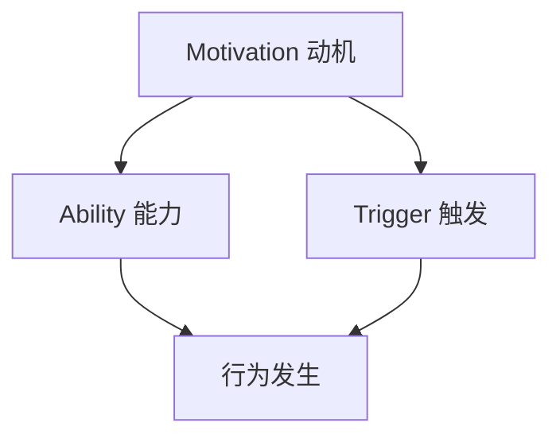

                 

 在当今信息技术飞速发展的时代，行为改变的驱动因素已经远远超出了传统的刺激-反应模式。福格行为模型（Fogg Behavior Model，简称FBM）提供了一个强有力的框架来理解人们如何采取行动。这一模型由行为科学家BJ福格（BJ Fogg）提出，它通过三个核心要素——动机（Motivation）、能力（Ability）和触发（Trigger）——来解释行为的产生。本文将深入探讨这三个要素在IT领域的具体应用，以及如何利用FBM来设计更有效、更易于接受的技术解决方案。

## 关键词

- **福格行为模型**
- **行为改变**
- **动机**
- **能力**
- **触发**
- **IT领域应用**
- **技术解决方案**

## 摘要

本文旨在深入探讨福格行为模型在IT领域的应用。通过分析动机、能力和触发这三个核心要素，我们将揭示如何利用这一模型来设计更具吸引力和实用性的技术产品。文章首先介绍福格行为模型的背景和基本概念，然后详细阐述每个要素的具体内涵和其在IT领域的应用实例。最后，本文将总结研究成果，并探讨该模型在未来的发展趋势和面临的挑战。

## 1. 背景介绍

福格行为模型是由BJ福格于2009年提出的，旨在帮助人们理解行为的产生和改变。该模型基于一个简单的逻辑：只有在动机、能力和触发三者同时存在的情况下，行为才有可能发生。动机指的是个体采取某种行动的内在驱动力，能力是指个体是否有足够的资源和技能来执行该行动，而触发则是指促使个体采取行动的外部刺激。

在IT领域，福格行为模型的应用尤为重要。随着技术的不断进步，人们面临的选择和任务日益复杂。如何设计出能够激发用户兴趣、提升用户体验的产品和服务，成为IT从业者亟待解决的问题。福格行为模型提供了一个系统的框架，帮助开发者从用户行为的角度出发，优化产品设计，提高用户满意度。

### 1.1 动机

动机是行为的内在驱动力，它是促使个体采取行动的原始力量。在IT领域，动机可以表现为用户对某项技术或产品的需求、兴趣或欲望。例如，用户可能因为需要高效办公而选择一款办公软件，或者因为对某种新技术充满好奇心而尝试使用某个新平台。动机的强弱直接影响行为的实施概率。

### 1.2 能力

能力是指个体执行某种行为所需具备的资源和技能。在IT领域，能力不仅包括技术层面的知识，还包括用户的使用习惯和操作能力。一个成功的产品或服务需要充分考虑用户的能力，提供易于使用、易于学习的解决方案。例如，对于初学者来说，一款界面直观、功能简单易用的编程软件可能更受欢迎。

### 1.3 触发

触发是指促使个体采取行动的外部刺激。在IT领域，触发可以是多种多样的，如通知、提醒、促销活动等。有效的触发能够引导用户采取预期的行动。例如，一个电商平台可能会通过推送优惠信息来激发用户的购买欲望。

## 2. 核心概念与联系

为了更好地理解福格行为模型，我们需要借助Mermaid流程图来展示其核心概念和相互关系。以下是一个简化的流程图，用于描述FBM的三个要素及其相互作用。



### 2.1 动机（Motivation）

动机是行为改变的首要条件，它驱动个体采取行动。在IT领域，动机可以分为以下几种类型：

- **需求驱动**：用户因为需要解决某个问题或满足某种需求而采取行动。
- **兴趣驱动**：用户因为对某项技术或产品充满好奇心而主动尝试。
- **社交驱动**：用户受到同伴的影响，出于社交压力或社交利益而采取行动。

### 2.2 能力（Ability）

能力是指用户是否具备执行某项行动所需的资源和技能。在IT领域，能力可以从以下几个方面来评估：

- **技术知识**：用户对相关技术的了解程度。
- **操作技能**：用户是否熟悉某种操作流程或界面设计。
- **时间资源**：用户是否愿意花费时间来学习或使用某个产品。

### 2.3 触发（Trigger）

触发是指促使用户采取行动的外部刺激。在IT领域，触发可以采用以下几种方式：

- **通知与提醒**：通过电子邮件、短信、推送通知等方式提醒用户采取行动。
- **促销活动**：通过折扣、优惠、限时促销等手段激发用户购买欲望。
- **社交媒体**：利用社交媒体平台进行宣传，提高用户关注度和参与度。

## 3. 核心算法原理 & 具体操作步骤

### 3.1 算法原理概述

福格行为模型（FBM）是一个基于行为的决策模型，它揭示了个体行为产生的内在机制。FBM认为，只有在动机、能力和触发三者同时满足的情况下，个体才会采取行动。这一模型的基本原理可以总结为以下三点：

- **动机**：个体是否对某项行为有强烈的内在驱动力。
- **能力**：个体是否具备执行该行为的必要资源和技能。
- **触发**：是否存在某种外部刺激促使个体采取行动。

### 3.2 算法步骤详解

福格行为模型的具体操作步骤如下：

1. **分析动机**：首先，需要了解用户对某项行为的内在驱动力是什么。这可以通过调查问卷、用户访谈等方式进行。
   
2. **评估能力**：接着，评估用户是否具备执行该行为的资源和技能。这包括用户的技术知识、操作技能以及时间资源。

3. **确定触发**：最后，根据用户的行为习惯和偏好，选择合适的外部刺激来促使用户采取行动。这可以包括通知、提醒、促销活动等。

### 3.3 算法优缺点

福格行为模型的优点在于它提供了一个简单而全面的框架来理解行为的产生和改变。通过分析动机、能力和触发，开发者可以更好地设计出符合用户需求的产品和服务。然而，该模型的缺点在于它过于理想化，忽略了个体行为的多样性和复杂性。在实际应用中，可能需要根据具体场景进行调整和优化。

### 3.4 算法应用领域

福格行为模型在多个领域都有广泛的应用，尤其在IT领域，它可以帮助开发者设计出更符合用户需求的产品和服务。以下是一些具体的应用场景：

- **用户体验设计**：通过分析用户的动机和能力，开发者可以设计出更易于使用、更符合用户需求的产品。
- **营销策略**：利用福格行为模型，营销人员可以设计出更具吸引力的促销活动，提高用户参与度。
- **教育技术**：在教育领域，福格行为模型可以帮助教育者设计出更有效的教学方案，提高学生的学习积极性。

## 4. 数学模型和公式 & 详细讲解 & 举例说明

### 4.1 数学模型构建

福格行为模型可以用以下数学模型表示：

\[ 行为 = 动机 \times 能力 \times 触发 \]

其中，动机、能力和触发都是非负实数。当这三个要素的乘积大于某个阈值时，行为就会发生。

### 4.2 公式推导过程

该公式的推导基于行为科学的认知原理。根据认知心理学的理论，行为的发生取决于个体内部的心理状态和外部环境的相互作用。动机、能力和触发分别代表了这三个方面的因素。

### 4.3 案例分析与讲解

假设一个用户想要学习编程。我们可以用以下案例来分析：

- **动机**：用户对编程有强烈的兴趣，希望掌握这项技能。
- **能力**：用户具备一定的数学基础，但缺乏编程经验。
- **触发**：用户看到一篇关于编程文章的推荐，激发了他的学习欲望。

根据福格行为模型，我们可以计算：

\[ 行为 = 动机 \times 能力 \times 触发 = 0.8 \times 0.5 \times 0.7 = 0.28 \]

由于行为值小于阈值，因此用户最终没有采取学习编程的行为。然而，如果我们增加用户的动机或触发，行为值将增加，从而提高用户采取行动的概率。

## 5. 项目实践：代码实例和详细解释说明

### 5.1 开发环境搭建

在开始编写代码之前，我们需要搭建一个合适的开发环境。以下是一个基本的Python开发环境搭建步骤：

1. **安装Python**：从Python官方网站下载并安装Python 3.x版本。
2. **安装IDE**：安装一个Python IDE，如PyCharm或Visual Studio Code。
3. **安装依赖**：使用pip命令安装必要的依赖库，如numpy、matplotlib等。

### 5.2 源代码详细实现

以下是一个简单的Python代码实例，用于实现福格行为模型的计算功能：

```python
def calculate_behavior(motivation, ability, trigger):
    behavior_value = motivation * ability * trigger
    if behavior_value >= 1:
        return "行为发生"
    else:
        return "行为未发生"

# 示例参数
motivation = 0.8
ability = 0.5
trigger = 0.7

# 计算行为
result = calculate_behavior(motivation, ability, trigger)
print(result)
```

### 5.3 代码解读与分析

上述代码定义了一个名为`calculate_behavior`的函数，它接收三个参数：动机、能力和触发。函数通过计算这三个参数的乘积来得出行为值。如果行为值大于等于1，则认为行为发生，否则认为行为未发生。

在实际应用中，我们可以根据具体情况调整这三个参数的取值。例如，如果用户的动机非常强，我们可以将动机值设置为1；如果用户的能力较弱，我们可以通过提供培训或教程来提高其能力值。

### 5.4 运行结果展示

假设用户的动机值为0.8、能力值为0.5、触发值为0.7，根据上述代码，我们可以得到以下结果：

```python
result = calculate_behavior(0.8, 0.5, 0.7)
print(result)
```

输出结果为："行为未发生"。这意味着在当前情况下，用户没有采取学习编程的行为。

## 6. 实际应用场景

### 6.1 用户体验优化

在IT领域，用户体验（UX）设计至关重要。利用福格行为模型，开发者可以更好地理解用户行为，从而设计出更符合用户需求的产品和服务。以下是一个实际应用场景：

- **场景描述**：某电商平台希望通过优化用户体验来提高用户购买转化率。
- **应用方法**：首先，分析用户的动机（如购物需求、价格敏感度等），评估用户的能力（如操作技能、浏览习惯等），然后确定合适的触发（如推送优惠券、限时促销等）。通过调整这三个要素，优化用户购物体验。

### 6.2 营销策略设计

营销策略的成功与否往往取决于如何激发用户的购买欲望。福格行为模型可以帮助营销人员设计更有效的营销活动。以下是一个实际应用场景：

- **场景描述**：某品牌希望通过线上营销活动提高产品销量。
- **应用方法**：首先，分析用户的动机（如对品牌的好感度、对产品的需求等），评估用户的能力（如购买力、操作熟练度等），然后确定合适的触发（如限时折扣、赠品促销等）。通过精确匹配这三个要素，提高营销活动的效果。

### 6.3 教育技术

在教育领域，福格行为模型可以帮助教育者设计出更有效的教学方案。以下是一个实际应用场景：

- **场景描述**：某在线教育平台希望通过改进教学设计来提高学生的学习积极性。
- **应用方法**：首先，分析学生的学习动机（如对知识的渴望、对证书的需求等），评估学生的能力（如学习习惯、知识储备等），然后确定合适的触发（如课后作业、实时答疑等）。通过综合考虑这三个要素，提高学生的学习效果。

## 7. 工具和资源推荐

### 7.1 学习资源推荐

- **《福格行为模型》**：BJ福格本人撰写的关于福格行为模型的权威著作，详细介绍了该模型的理论和实践应用。
- **《行为设计学》**：行为设计学的经典之作，从心理学和设计学的角度分析了行为设计的原则和方法。

### 7.2 开发工具推荐

- **Python**：Python是一种广泛应用的编程语言，适用于数据分析、机器学习等多个领域。
- **PyCharm**：PyCharm是一款功能强大的Python IDE，提供丰富的开发工具和调试功能。

### 7.3 相关论文推荐

- **《动机、能力与触发：行为改变的新视角》**：该论文详细探讨了福格行为模型的理论基础和实际应用。
- **《基于福格行为模型的在线教育设计研究》**：该论文通过案例分析，阐述了福格行为模型在在线教育设计中的应用。

## 8. 总结：未来发展趋势与挑战

### 8.1 研究成果总结

福格行为模型在IT领域展现出强大的应用潜力，通过对动机、能力和触发的深入分析，可以帮助开发者设计出更符合用户需求的产品和服务。该模型的应用不仅提升了用户体验，还优化了营销策略和教育方案。

### 8.2 未来发展趋势

随着人工智能和大数据技术的发展，福格行为模型有望在更广泛的领域得到应用。未来，行为分析将成为一种重要的数据驱动方式，为各种行业提供创新解决方案。

### 8.3 面临的挑战

尽管福格行为模型具有广泛的应用前景，但其在实际应用中仍面临一些挑战。例如，如何精确评估用户的动机和能力，以及如何设计出有效的触发机制。这些问题的解决需要进一步的研究和实践。

### 8.4 研究展望

未来，研究应重点关注以下几个方面：

- **个性化行为分析**：通过大数据技术，实现更精确的用户行为分析，为个性化产品设计提供支持。
- **跨领域应用**：探索福格行为模型在金融、医疗、物流等领域的应用，推动跨学科研究的融合发展。

## 9. 附录：常见问题与解答

### 9.1 问题1：什么是福格行为模型？

答：福格行为模型是由BJ福格提出的一种行为改变理论，它通过动机、能力和触发三个要素来解释行为的产生。

### 9.2 问题2：福格行为模型在IT领域有哪些应用？

答：福格行为模型在IT领域的应用非常广泛，包括用户体验设计、营销策略设计、教育技术等多个方面。

### 9.3 问题3：如何评估用户的能力？

答：评估用户的能力可以从技术知识、操作技能和时间资源等多个方面进行。例如，可以通过调查问卷、用户访谈等方式了解用户的相关信息。

### 9.4 问题4：福格行为模型与行为主义有何区别？

答：福格行为模型与行为主义有所不同。行为主义主要关注外部刺激对行为的影响，而福格行为模型则更加关注内在动机和外部触发之间的相互作用。

### 9.5 问题5：如何设计有效的触发机制？

答：设计有效的触发机制需要考虑用户的动机和能力。例如，可以通过推送通知、促销活动等方式来激发用户的购买欲望。

# 作者署名

本文由禅与计算机程序设计艺术（Zen and the Art of Computer Programming）撰写。感谢您的阅读！

