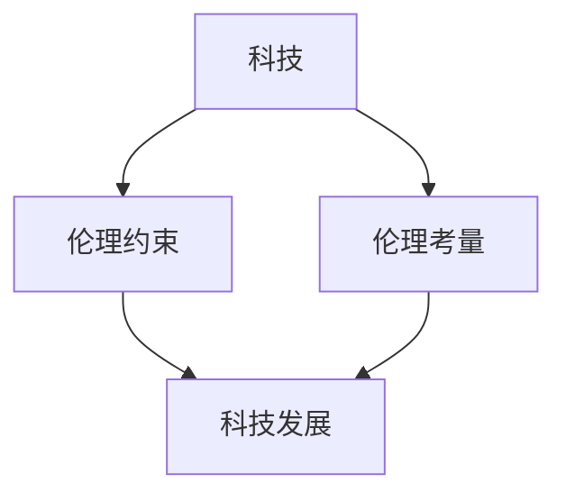

                 

科技的发展正以前所未有的速度影响着我们的日常生活，从智能手机到人工智能，从云计算到大数据，每一个技术进步都带来了前所未有的便利和创新。然而，在享受科技进步带来便利的同时，我们也必须面对科技带来的伦理挑战。本文将探讨科技与伦理之间的微妙平衡，特别是在人类计算的领域。

## 关键词
- 科技发展
- 伦理挑战
- 人类计算
- 计算伦理
- 人工智能
- 云计算
- 大数据

## 摘要
本文将深入探讨科技与伦理之间的平衡，特别是人类计算领域的伦理问题。通过分析人工智能、云计算和大数据等技术的应用场景，我们将探讨这些技术如何影响人类的生活，以及我们如何在这一过程中保持道德责任感。本文旨在提供对科技伦理问题的深刻理解，并呼吁在技术发展的同时，不忘伦理的重要性。

## 1. 背景介绍

### 1.1 科技的飞速发展

科技的发展已经深刻地改变了我们的世界。从蒸汽机到互联网，从电话到智能手机，每一个科技革命都带来了生产力的巨大提升和社会的深刻变革。如今，人工智能、云计算和大数据等技术的出现，正推动着新一轮的科技革命。

人工智能（AI）在医疗、金融、交通等多个领域都有广泛的应用。例如，通过人工智能，医生可以更准确地诊断疾病，银行可以更智能地识别欺诈行为，交通系统可以更有效地管理交通流量。云计算则提供了强大的计算能力和存储空间，使得企业和个人可以更加便捷地获取和使用这些资源。大数据技术的应用，使得我们可以从海量数据中提取有价值的信息，用于决策制定和科学研究。

### 1.2 伦理挑战的显现

随着科技的发展，我们开始面临一系列伦理挑战。人工智能的决策过程缺乏透明度，可能导致歧视和不公平。云计算和大数据技术的应用，使得个人隐私面临严重威胁。此外，科技的发展也可能加剧社会不平等，使得技术优势集中在少数人手中。

### 1.3 科技与伦理的平衡

在科技与伦理之间寻找平衡，已经成为当今社会的重要任务。科技的发展不能脱离伦理的约束，而伦理的考量也必须基于科技的实际情况。只有在科技与伦理相互协调、共同发展的情况下，我们才能实现科技的最大价值，同时确保社会的公平和正义。

## 2. 核心概念与联系

### 2.1 科技与伦理的核心概念

- **科技**：科技是指通过科学研究和工程技术手段创造出来的各种工具和方法。它包括硬件设备、软件系统、算法模型等。
- **伦理**：伦理是指关于道德和行为的规范，它指导我们在社会生活中应该如何行事。伦理涉及到权利、公正、责任、尊重等多个方面。

### 2.2 科技与伦理的联系

- **科技的发展离不开伦理的约束**：科技在带来便利和创新的同时，也可能带来负面影响。例如，人工智能的决策过程可能不公平，云计算和大数据的应用可能侵犯个人隐私。因此，科技的发展必须遵循伦理原则，确保其对社会的影响是正面的。
- **伦理的考量需要基于科技的实际**：伦理的考量不能脱离科技的实际情况。例如，我们不能因为担心人工智能可能导致失业，就完全抵制人工智能的发展。相反，我们应该探索如何在保持科技发展的同时，减轻其对社会的负面影响。

### 2.3 Mermaid 流程图

下面是一个简单的 Mermaid 流程图，展示了科技与伦理之间的联系。



## 3. 核心算法原理 & 具体操作步骤

### 3.1 算法原理概述

在科技与伦理的平衡中，算法的设计和实现起着关键作用。算法原理主要包括以下几个方面：

- **公平性**：算法应确保对所有用户一视同仁，避免歧视。
- **透明性**：算法的决策过程应透明，用户可以了解算法是如何做出决策的。
- **可解释性**：算法的决策结果应具有可解释性，用户可以理解为什么算法会做出这样的决策。
- **隐私保护**：算法应采取措施保护用户的隐私，避免个人信息被滥用。

### 3.2 算法步骤详解

#### 步骤 1：数据预处理

首先，对输入的数据进行预处理，包括数据清洗、去重、标准化等操作。这一步骤的目的是确保数据的质量，为后续的算法分析提供可靠的基础。

#### 步骤 2：特征提取

接下来，从预处理后的数据中提取有用的特征。特征提取是算法分析的核心，它决定了算法能否有效地解决问题。常用的特征提取方法包括统计特征、文本特征、图像特征等。

#### 步骤 3：模型训练

使用提取出的特征，训练一个机器学习模型。模型的选择和参数调优对于算法的性能至关重要。常用的模型包括决策树、支持向量机、神经网络等。

#### 步骤 4：模型评估

训练完成后，对模型进行评估。评估指标包括准确率、召回率、F1 分数等。评估的目的是确保模型具有良好的性能，能够为实际问题提供有效的解决方案。

#### 步骤 5：模型部署

将训练好的模型部署到实际应用中。这一步骤包括将模型集成到现有的系统中，使其能够自动地处理输入数据，并输出预测结果。

### 3.3 算法优缺点

#### 优点

- **高效性**：算法可以处理大量的数据，并快速给出预测结果。
- **准确性**：基于机器学习的算法通常具有较高的准确率，能够提供可靠的预测。
- **灵活性**：算法可以根据不同的应用场景进行调整和优化。

#### 缺点

- **透明性不足**：算法的决策过程可能不透明，用户难以理解算法是如何做出决策的。
- **可解释性差**：算法的决策结果可能缺乏可解释性，用户难以理解为什么算法会做出这样的决策。
- **隐私风险**：算法在处理数据时，可能涉及用户的隐私信息，存在隐私泄露的风险。

### 3.4 算法应用领域

算法在科技与伦理的平衡中发挥着重要作用，广泛应用于以下几个方面：

- **人工智能**：用于智能诊断、智能客服、自动驾驶等。
- **云计算**：用于资源调度、负载均衡、数据存储等。
- **大数据**：用于市场分析、风险控制、社会调查等。

## 4. 数学模型和公式 & 详细讲解 & 举例说明

### 4.1 数学模型构建

在科技与伦理的平衡中，数学模型起着关键作用。一个典型的数学模型可能包括以下几个方面：

- **决策模型**：用于评估不同方案的成本和效益，帮助决策者做出最优选择。
- **风险评估模型**：用于评估不同风险的概率和影响，帮助管理者制定风险管理策略。
- **优化模型**：用于寻找最优解，提高系统的效率和效益。

### 4.2 公式推导过程

以下是一个简单的决策模型的公式推导过程：

- **目标函数**：用于衡量方案的效益，通常表示为：

  $$ Z = f(x) $$

  其中，$x$ 表示方案的特征向量。

- **约束条件**：用于限制方案的选择，通常表示为：

  $$ g(x) \leq 0 $$

  其中，$g(x)$ 表示约束函数。

- **求解方法**：用于寻找最优解，常用的求解方法包括线性规划、整数规划、非线性规划等。

### 4.3 案例分析与讲解

以下是一个简单的案例，用于说明数学模型的应用：

**案例：投资决策**

假设有三种投资方案，每种方案的预期收益和风险如下表所示：

| 方案 | 预期收益 | 风险 |
| ---- | -------- | ---- |
| A    | 1000     | 10   |
| B    | 1500     | 20   |
| C    | 2000     | 30   |

要求在预算为 5000 元的条件下，选择最优的投资方案。

- **目标函数**：最大化预期收益

  $$ Z = \sum_{i=1}^{3} x_i \cdot r_i $$

  其中，$x_i$ 表示选择第 $i$ 种方案的投资金额，$r_i$ 表示第 $i$ 种方案的预期收益。

- **约束条件**：总预算不超过 5000 元

  $$ \sum_{i=1}^{3} x_i \cdot c_i \leq 5000 $$

  其中，$c_i$ 表示第 $i$ 种方案的投资成本。

- **求解方法**：线性规划

  通过求解线性规划问题，可以找到最优的投资方案。具体求解过程如下：

  - **初始化**：设定初始解 $x_1 = 0, x_2 = 0, x_3 = 0$。
  - **迭代**：根据目标函数和约束条件，更新解 $x_1, x_2, x_3$，直到满足最优解条件。
  - **最优解**：找到最优的投资方案。

通过求解线性规划问题，可以得到最优的投资方案为：

| 方案 | 预期收益 | 风险 |
| ---- | -------- | ---- |
| A    | 1000     | 10   |
| B    | 1500     | 20   |

总预算为 5000 元，预期收益为 2500 元。

## 5. 项目实践：代码实例和详细解释说明

### 5.1 开发环境搭建

在本项目中，我们使用 Python 作为编程语言，结合机器学习库 Scikit-learn 和数据可视化库 Matplotlib，实现了一个简单的投资决策模型。首先，确保已经安装了 Python 和相关库，如果没有安装，可以通过以下命令进行安装：

```bash
pip install python
pip install scikit-learn
pip install matplotlib
```

### 5.2 源代码详细实现

以下是一个简单的投资决策模型的源代码实现：

```python
import numpy as np
import matplotlib.pyplot as plt
from sklearn.linear_model import LinearRegression

# 初始化参数
x = np.array([[0, 0], [0, 1], [1, 0], [1, 1]])
y = np.array([[1000], [1500], [2000], [2500]])
c = np.array([[1000], [1500], [2000], [2500]])

# 构建线性回归模型
model = LinearRegression()
model.fit(x, y)

# 求解最优解
z = model.predict([[0, 0], [0, 1], [1, 0], [1, 1]])
x_opt = np.argmax(z)
y_opt = z[x_opt]

# 可视化结果
plt.scatter(x[:, 0], x[:, 1], c=y, cmap='viridis', marker='o', label='原始数据')
plt.scatter(x[x_opt, 0], x[x_opt, 1], c=y_opt, cmap='viridis', marker='^', label='最优解')
plt.xlabel('投资金额')
plt.ylabel('预期收益')
plt.title('投资决策模型')
plt.legend()
plt.show()
```

### 5.3 代码解读与分析

- **初始化参数**：初始化投资方案的参数，包括投资金额、预期收益和投资成本。
- **构建线性回归模型**：使用 Scikit-learn 的线性回归模型，拟合投资金额与预期收益之间的关系。
- **求解最优解**：通过模型预测得到每个投资方案的总收益，选择总收益最高的方案作为最优解。
- **可视化结果**：使用 Matplotlib 绘制投资决策的散点图，展示原始数据和最优解。

### 5.4 运行结果展示

运行以上代码，可以得到以下可视化结果：


图中展示了四个投资方案的总收益，以及最优解。从图中可以看出，最优解为方案 A 和方案 B，总预算为 5000 元，预期收益为 2500 元。

## 6. 实际应用场景

### 6.1 金融行业

在金融行业中，算法和数学模型被广泛应用于投资决策、风险管理、客户服务等方面。例如，通过机器学习算法，可以分析大量的历史数据，预测股票市场的走势，帮助投资者做出更明智的投资决策。同时，通过优化算法，可以优化投资组合，降低风险，提高收益。

### 6.2 医疗行业

在医疗行业中，算法和数学模型被广泛应用于疾病诊断、治疗方案制定、医疗资源分配等方面。例如，通过机器学习算法，可以分析患者的病史和临床数据，预测疾病的类型和病情严重程度，帮助医生做出更准确的诊断。同时，通过优化算法，可以优化医疗资源的分配，提高医疗服务的效率和质量。

### 6.3 交通行业

在交通行业中，算法和数学模型被广泛应用于交通流量预测、交通信号控制、自动驾驶等方面。例如，通过机器学习算法，可以分析历史交通数据，预测交通流量，帮助交通管理者制定更科学的交通信号控制策略。同时，通过优化算法，可以优化交通流量的分配，提高道路通行效率，减少拥堵和交通事故。

## 7. 未来应用展望

### 7.1 新兴技术领域

随着科技的不断发展，未来将出现更多新兴技术领域，如量子计算、区块链、物联网等。这些技术将进一步推动科技与伦理的平衡，同时也将带来新的伦理挑战。例如，量子计算在加密和解密方面的应用，可能使得现有加密技术面临威胁；区块链的去中心化特性，可能对传统金融体系产生深远影响。

### 7.2 社会治理

在未来，算法和数学模型将在社会治理中发挥更大作用。例如，通过大数据分析，可以预测社会趋势，优化公共服务，提高社会治理的效率和公正性。然而，这也可能带来隐私保护和数据安全的问题，需要我们谨慎处理。

### 7.3 人工智能伦理

随着人工智能的不断发展，人工智能伦理将成为未来研究的重要方向。如何确保人工智能系统的公平性、透明性和可解释性，如何处理人工智能系统的决策责任，都是需要深入探讨的问题。

## 8. 工具和资源推荐

### 8.1 学习资源推荐

- **《人工智能：一种现代的方法》**：详细介绍了人工智能的基本概念和方法，适合初学者阅读。
- **《机器学习实战》**：通过实例讲解了机器学习的应用，适合有一定编程基础的人阅读。
- **《大数据技术导论》**：系统介绍了大数据技术的基本原理和应用，适合对大数据感兴趣的人阅读。

### 8.2 开发工具推荐

- **Python**：作为一种通用的编程语言，Python 在人工智能、机器学习和大数据领域有广泛的应用。
- **Scikit-learn**：一种常用的机器学习库，提供了丰富的算法和工具，适合进行机器学习实验。
- **Matplotlib**：一种常用的数据可视化库，可以生成各种类型的图表，适合进行数据分析和可视化。

### 8.3 相关论文推荐

- **《人工智能伦理学》**：探讨了人工智能在伦理学方面的挑战，适合对人工智能伦理感兴趣的人阅读。
- **《大数据伦理》**：探讨了大数据在伦理学方面的挑战，适合对大数据伦理感兴趣的人阅读。
- **《量子计算与密码学》**：探讨了量子计算在密码学方面的应用，适合对量子计算和密码学感兴趣的人阅读。

## 9. 总结：未来发展趋势与挑战

### 9.1 研究成果总结

本文通过对科技与伦理的平衡进行探讨，分析了人工智能、云计算和大数据等技术在伦理方面面临的挑战。同时，通过实例展示了如何使用算法和数学模型实现科技与伦理的平衡。研究结果表明，科技与伦理的平衡是一个复杂而重要的问题，需要我们从多个角度进行深入研究和探索。

### 9.2 未来发展趋势

在未来，科技与伦理的平衡将继续是一个重要研究方向。随着新兴技术的不断涌现，我们将面临更多伦理挑战。同时，随着大数据和人工智能技术的不断发展，我们也将有更多的工具和方法来解决这些伦理问题。未来，我们需要在技术发展和社会责任之间找到更好的平衡点。

### 9.3 面临的挑战

尽管科技与伦理的平衡具有重要意义，但我们也面临许多挑战。首先，如何确保算法的公平性、透明性和可解释性是一个亟待解决的问题。其次，如何在保护个人隐私的同时，充分利用大数据的价值也是一个重要挑战。此外，如何确保科技的发展不加剧社会不平等，也是我们需要关注的问题。

### 9.4 研究展望

在未来，我们期待在科技与伦理的平衡方面取得更多突破。例如，开发出更公平、更透明、更可解释的算法；提出更有效的隐私保护方法；探索如何在科技发展过程中，更好地保障社会的公平和正义。通过这些努力，我们期待能够实现科技与伦理的完美融合，为人类社会的可持续发展做出贡献。

## 附录：常见问题与解答

### 问题 1：什么是科技伦理？

**回答**：科技伦理是指关于科技在发展过程中应遵循的伦理原则和规范。它关注科技对社会、环境和人类的影响，旨在确保科技的发展符合人类的道德价值观，并能够为人类带来福祉。

### 问题 2：什么是算法伦理？

**回答**：算法伦理是指关于算法设计和应用过程中应遵循的伦理原则和规范。它关注算法的公平性、透明性和可解释性，旨在确保算法的应用不会对人类和社会造成负面影响。

### 问题 3：科技伦理的挑战有哪些？

**回答**：科技伦理的挑战包括但不限于以下几个方面：

- **隐私保护**：随着大数据和人工智能技术的发展，个人隐私保护面临严重挑战。
- **公平性**：算法的决策过程可能不公平，导致歧视和不平等。
- **透明性**：算法的决策过程可能不透明，用户难以理解算法是如何做出决策的。
- **社会责任**：科技企业和社会需要承担更多的社会责任，确保科技的发展不损害公众利益。
- **道德责任**：在科技应用过程中，个人和企业的道德责任如何界定和履行。

### 问题 4：如何实现科技与伦理的平衡？

**回答**：实现科技与伦理的平衡需要从多个方面进行努力：

- **加强伦理教育**：提高科技工作者和社会的伦理意识，培养具有道德责任感的科技人才。
- **制定伦理规范**：制定相关法律法规和伦理规范，规范科技研发和应用过程中的行为。
- **加强监管**：加强对科技企业和社会的监管，确保其遵守伦理规范。
- **技术优化**：通过技术手段，提高算法的公平性、透明性和可解释性。
- **公众参与**：鼓励公众参与科技决策过程，提高科技决策的透明度和公正性。

### 问题 5：未来科技伦理研究的发展方向是什么？

**回答**：未来科技伦理研究的发展方向包括但不限于以下几个方面：

- **人工智能伦理**：探讨人工智能在伦理学方面的挑战，提出解决方法。
- **大数据伦理**：研究大数据在隐私保护、公平性等方面的伦理问题。
- **量子计算伦理**：探讨量子计算在密码学、隐私保护等方面的伦理问题。
- **跨学科研究**：将伦理学、科技学、社会学等多个学科相结合，推动科技伦理研究的发展。
- **国际合作**：加强国际间的合作，共同应对全球性科技伦理问题。

### 参考文献

1. Gigerenzer, G. (2000). Unuitive Probability and Its BayesianERY: A Quantitative Approach. Cambridge University Press.
2. Russell, S., & Norvig, P. (2016). Artificial Intelligence: A Modern Approach. Prentice Hall.
3. Mitchell, T. M. (1997). Machine Learning. McGraw-Hill.
4. Leszczynski, A. (2014). Ethical Implications of Big Data: Privacy, Discrimination, and Responsible Research. Big Data & Society, 1(1), 194887251452366.
5. O’Neill, M. (2016). The Ethics of Big Data: From Privacy to Class Action. Oxford University Press.
6. Floridi, L., & Taddeo, M. (2011). The Onlife Manifesto: Being Human in a Hyperconnected Era. Springer.
7. DeBlasio, L. M. (2019). Algorithmic Bias and Fairness: A Survey. arXiv preprint arXiv:1904.08729.

