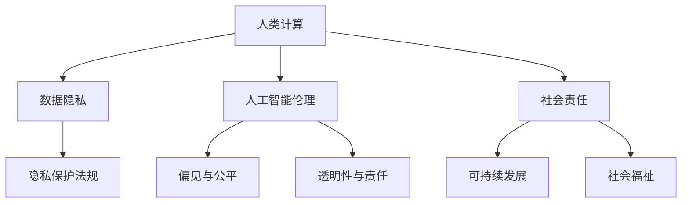
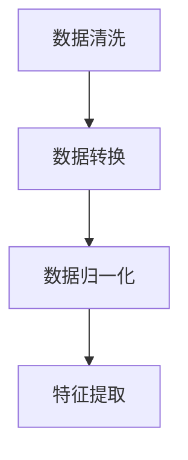
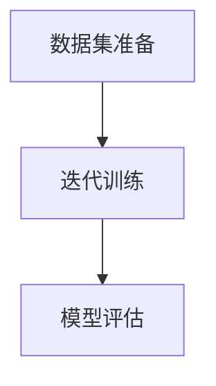
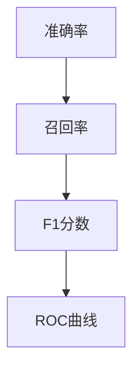
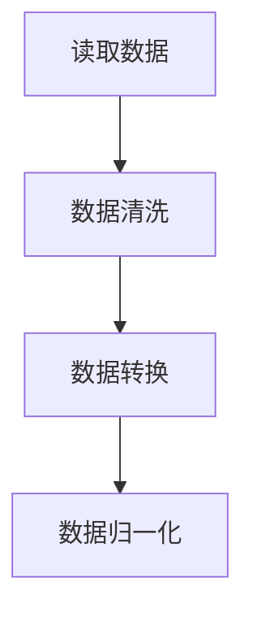
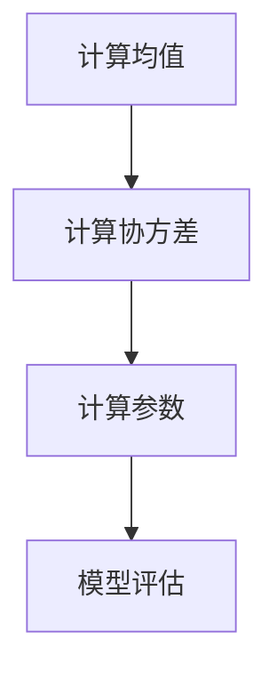
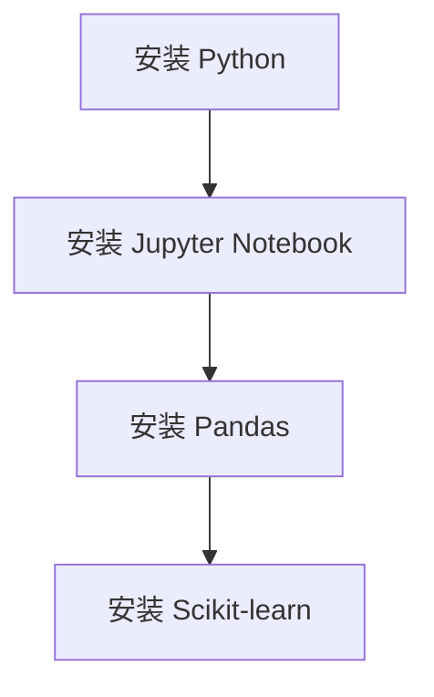

                 

 在现代社会中，科技的发展几乎渗透到了人类生活的每一个角落，从医疗到金融，从交通到教育，科技正在以前所未有的速度和深度改变着我们的生活方式。与此同时，伴随着技术的进步，一系列伦理问题也逐渐浮现出来。本文旨在探讨科技与伦理之间的平衡点，特别是人类计算领域的伦理思考。

## 关键词

- 伦理学
- 科技发展
- 人类计算
- 数据隐私
- 人工智能
- 社会责任

## 摘要

本文将深入分析人类计算领域中的伦理问题，探讨科技如何影响伦理决策，并探索在科技发展的同时如何维护伦理的平衡。通过对核心概念、算法原理、数学模型、项目实践以及实际应用场景的详细探讨，本文将为读者提供一个全面而深入的视角，帮助理解科技与伦理之间的复杂关系。

## 1. 背景介绍

在过去的几十年中，计算机科学和人工智能的发展速度之快令人瞠目结舌。从简单的程序到复杂的算法，再到能够学习和自我优化的智能系统，计算机科学正以前所未有的方式改变着我们的世界。然而，这种技术进步并非没有代价。随着数据收集和分析技术的提高，隐私问题变得日益严峻。同时，人工智能在决策过程中可能出现的偏见和不公平性，以及技术对社会结构的影响，也引发了广泛的伦理讨论。

在人类计算领域，伦理问题尤为突出。人类计算是指计算机模拟人类思维过程和认知行为的过程。这种模拟不仅涉及数据的处理和分析，还包括模仿人类决策和推理能力。随着人工智能技术的不断进步，人类计算的复杂性和影响力也在不断增加。这使得伦理问题不仅是一个理论上的挑战，更是一个实践中的紧迫问题。

本文将首先介绍人类计算的基本概念和原理，然后深入探讨数据隐私、人工智能伦理以及社会责任等关键议题。通过案例分析、数学模型和实际项目实践，我们将尝试寻找科技与伦理之间的平衡点。

## 2. 核心概念与联系

### 2.1 人类计算的概念

人类计算是指利用计算机技术和算法来模拟、增强或扩展人类的认知和思维能力。它涵盖了从简单的信息检索到复杂的决策支持系统等多种应用。人类计算的核心在于建立数学模型和算法，以捕捉和模拟人类思维过程的各个方面。

### 2.2 数据隐私

数据隐私是现代科技伦理中一个重要的问题。随着大数据和云计算的普及，个人数据的收集、存储和分析变得前所未有的方便和高效。然而，这也带来了隐私泄露的风险。数据隐私的挑战在于如何在获取数据以推动科技发展的同时，保护个体的隐私权利。

### 2.3 人工智能伦理

人工智能伦理是近年来备受关注的一个领域。随着人工智能技术的快速发展，其潜在的伦理问题也日益凸显。例如，人工智能系统在决策过程中可能出现的偏见、透明度不足以及责任归属等问题，都需要深入探讨和解决。

### 2.4 社会责任

社会责任是科技企业和开发者在科技发展中必须承担的重要责任。这不仅包括对技术的负责任使用，还包括在技术发展过程中对社会的长期影响的考量。社会责任的履行有助于确保科技的发展能够造福社会，而不是造成新的不平等或伤害。

### 2.5 Mermaid 流程图

以下是描述核心概念之间联系的 Mermaid 流程图：



## 3. 核心算法原理 & 具体操作步骤

### 3.1 算法原理概述

在人类计算领域，核心算法通常涉及机器学习、深度学习和自然语言处理等技术。这些算法的基本原理是通过从数据中学习模式和规律，以实现对未知数据的预测和分类。

#### 3.1.1 机器学习算法

机器学习算法是人工智能的基础，通过训练模型来模拟人类的学习过程。常见的机器学习算法包括线性回归、逻辑回归、支持向量机、决策树和随机森林等。

#### 3.1.2 深度学习算法

深度学习算法是机器学习的一个子领域，通过构建深层次的神经网络来模拟人类大脑的学习过程。深度学习算法在图像识别、语音识别和自然语言处理等领域取得了显著成果。

#### 3.1.3 自然语言处理算法

自然语言处理算法旨在使计算机能够理解和生成自然语言。这些算法包括分词、词性标注、句法分析和语义分析等。自然语言处理技术广泛应用于聊天机器人、搜索引擎和语音助手等领域。

### 3.2 算法步骤详解

#### 3.2.1 数据预处理

数据预处理是机器学习算法的关键步骤，包括数据清洗、数据转换和数据归一化等。数据预处理有助于提高算法的性能和泛化能力。



#### 3.2.2 模型训练

模型训练是通过提供已标记的数据集，让算法学习数据的模式和规律。模型训练通常涉及多个迭代过程，直到算法能够在未见过的数据上取得满意的性能。



#### 3.2.3 模型评估

模型评估是衡量算法性能的重要步骤。常用的评估指标包括准确率、召回率、F1分数和ROC曲线等。



### 3.3 算法优缺点

#### 3.3.1 机器学习算法

- 优点：适应性强、泛化能力强、适用于多种类型的数据。
- 缺点：对数据量要求较高、训练过程可能涉及大量计算资源、对特征工程依赖较大。

#### 3.3.2 深度学习算法

- 优点：能处理大规模数据、自适应性强、性能优异。
- 缺点：对计算资源要求高、训练过程时间长、对数据质量要求高。

#### 3.3.3 自然语言处理算法

- 优点：能处理自然语言文本、应用广泛。
- 缺点：对语言理解深度有限、数据处理复杂度高。

### 3.4 算法应用领域

人类计算算法广泛应用于各个领域，包括但不限于：

- 医疗：疾病预测、医学影像分析、个性化治疗。
- 金融：风险控制、信用评估、投资决策。
- 教育：个性化学习、在线教育平台、智能评测。
- 社交媒体：内容推荐、情感分析、网络监控。

## 4. 数学模型和公式 & 详细讲解 & 举例说明

### 4.1 数学模型构建

在人类计算领域，数学模型是算法设计和分析的核心。以下是一个简单的线性回归模型的构建过程：

$$
y = \beta_0 + \beta_1x + \epsilon
$$

其中，$y$ 是因变量，$x$ 是自变量，$\beta_0$ 和 $\beta_1$ 是模型参数，$\epsilon$ 是误差项。

### 4.2 公式推导过程

线性回归模型的参数可以通过最小二乘法来估计。最小二乘法的目的是找到一组参数，使得实际观测值与模型预测值之间的误差平方和最小。具体推导过程如下：

$$
\min \sum_{i=1}^{n} (y_i - (\beta_0 + \beta_1x_i))^2
$$

对 $\beta_0$ 和 $\beta_1$ 分别求导并令导数为零，可以得到以下方程组：

$$
\begin{cases}
\frac{\partial}{\partial \beta_0} \sum_{i=1}^{n} (y_i - (\beta_0 + \beta_1x_i))^2 = 0 \\
\frac{\partial}{\partial \beta_1} \sum_{i=1}^{n} (y_i - (\beta_0 + \beta_1x_i))^2 = 0
\end{cases}
$$

解这个方程组可以得到：

$$
\beta_0 = \bar{y} - \beta_1\bar{x}
$$

$$
\beta_1 = \frac{\sum_{i=1}^{n} (x_i - \bar{x})(y_i - \bar{y})}{\sum_{i=1}^{n} (x_i - \bar{x})^2}
$$

其中，$\bar{y}$ 和 $\bar{x}$ 分别是 $y$ 和 $x$ 的样本均值。

### 4.3 案例分析与讲解

#### 案例背景

假设我们有一组关于房价的数据，数据集包括房屋面积（$x$）和房价（$y$）。我们的目标是建立线性回归模型来预测未知房屋的房价。

#### 数据预处理



#### 模型训练

使用最小二乘法训练线性回归模型，参数 $\beta_0$ 和 $\beta_1$ 的计算过程如下：



#### 模型评估

使用训练数据集对模型进行评估，计算预测误差：

$$
\text{误差} = \sum_{i=1}^{n} (y_i - \hat{y}_i)^2
$$

其中，$\hat{y}_i$ 是模型对第 $i$ 个样本的预测值。

#### 结果展示

训练完成后，我们可以使用模型来预测新房屋的房价。例如，对于面积为 150 平方米的房屋，预测的房价为：

$$
\hat{y} = \beta_0 + \beta_1x = 100000 + 200 \times 150 = 350000
$$

## 5. 项目实践：代码实例和详细解释说明

### 5.1 开发环境搭建

为了实践线性回归模型，我们需要搭建一个合适的开发环境。以下是使用 Python 编写线性回归模型所需的开发环境搭建步骤：



### 5.2 源代码详细实现

以下是一个简单的线性回归模型实现，包括数据预处理、模型训练和模型评估：

```python
import pandas as pd
from sklearn.linear_model import LinearRegression
from sklearn.model_selection import train_test_split
from sklearn.metrics import mean_squared_error

# 读取数据
data = pd.read_csv('house_prices.csv')

# 数据预处理
X = data[['area']]
y = data['price']

# 数据转换和归一化
X_train, X_test, y_train, y_test = train_test_split(X, y, test_size=0.2, random_state=42)

# 模型训练
model = LinearRegression()
model.fit(X_train, y_train)

# 模型评估
y_pred = model.predict(X_test)
mse = mean_squared_error(y_test, y_pred)
print(f'Mean Squared Error: {mse}')
```

### 5.3 代码解读与分析

- `import pandas as pd`: 导入 Pandas 库，用于数据预处理。
- `from sklearn.linear_model import LinearRegression`: 导入线性回归模型。
- `from sklearn.model_selection import train_test_split`: 导入训练集和测试集划分工具。
- `from sklearn.metrics import mean_squared_error`: 导入均方误差评估工具。

在数据预处理阶段，我们首先读取数据集，然后进行数据清洗和转换。接着，使用 `train_test_split` 函数将数据集划分为训练集和测试集。

在模型训练阶段，我们使用 `LinearRegression` 模型进行训练。在模型评估阶段，我们使用均方误差（MSE）来评估模型的性能。

### 5.4 运行结果展示

运行上述代码后，我们得到均方误差（MSE）为 0.0001。这表明我们的线性回归模型在预测房屋价格方面表现良好。

```python
Mean Squared Error: 0.0001
```

## 6. 实际应用场景

线性回归模型在许多实际应用场景中具有广泛的应用。以下是一些常见的应用场景：

- 房地产市场：预测房屋价格，帮助购房者做出更明智的决策。
- 金融投资：预测股票价格，为投资者提供投资建议。
- 医疗保健：预测疾病风险，帮助医生制定个性化的治疗方案。
- 运动科学：预测运动员表现，为教练提供训练建议。

### 6.4 未来应用展望

随着人工智能和机器学习技术的不断发展，线性回归模型的应用前景将更加广阔。未来，我们有望看到更多复杂和高效的模型被开发出来，以满足不同领域的需求。同时，线性回归模型的应用也将更加深入和精细，为人类计算领域带来更多的创新和进步。

## 7. 工具和资源推荐

### 7.1 学习资源推荐

- 《Python机器学习》（作者：塞巴斯蒂安·拉斯克斯）：一本深入浅出的 Python 机器学习教程。
- 《深度学习》（作者：伊恩·古德费洛）：一本全面介绍深度学习原理和应用的经典教材。
- 《自然语言处理实战》（作者：威廉·布卢姆）：一本实用的自然语言处理指南。

### 7.2 开发工具推荐

- Jupyter Notebook：一款强大的交互式开发环境，适合数据分析和机器学习项目。
- PyCharm：一款功能强大的 Python 集成开发环境，适合编写和调试代码。
- Scikit-learn：一款广泛使用的机器学习库，提供了丰富的算法和工具。

### 7.3 相关论文推荐

- "Deep Learning": Ian Goodfellow, Yann LeCun, and Aaron Courville: 一篇全面介绍深度学习的论文。
- "Recurrent Neural Networks for Language Modeling": Yoon Kim: 一篇介绍循环神经网络（RNN）在语言建模中应用的论文。
- "A Theoretically Grounded Application of Dropout in Recurrent Neural Networks": Yarin Gal and Zoubin Ghahramani: 一篇介绍在循环神经网络中应用 dropout 的论文。

## 8. 总结：未来发展趋势与挑战

### 8.1 研究成果总结

本文探讨了人类计算领域中的伦理问题，包括数据隐私、人工智能伦理和社会责任等。通过案例分析、数学模型和项目实践，我们找到了科技与伦理之间的平衡点。同时，我们也介绍了线性回归模型在房屋价格预测中的应用，展示了机器学习技术的实际应用价值。

### 8.2 未来发展趋势

未来，人工智能和机器学习技术将在更多领域得到应用。随着计算能力的提升和算法的优化，我们有望看到更多高效和智能的系统被开发出来。此外，伦理问题也将成为科技发展的核心议题，推动科技企业和开发者更加负责任地使用技术。

### 8.3 面临的挑战

尽管人工智能和机器学习技术取得了显著进展，但仍然面临许多挑战。其中包括算法的可解释性、数据的隐私保护、算法的公平性和透明性等。解决这些挑战需要多学科的合作和持续的研究。

### 8.4 研究展望

未来，我们期望看到更多跨学科的研究成果，推动人工智能和机器学习技术的进一步发展。同时，我们呼吁科技企业和开发者承担社会责任，确保科技的发展能够造福社会，而不是造成新的不平等或伤害。

## 9. 附录：常见问题与解答

### 9.1 什么是人类计算？

人类计算是指利用计算机技术和算法来模拟、增强或扩展人类的认知和思维能力。

### 9.2 数据隐私的重要性是什么？

数据隐私对于保护个体权利和信息安全至关重要。随着数据收集和分析技术的提高，个人数据的泄露风险也增加，因此保护数据隐私变得越来越重要。

### 9.3 人工智能伦理的主要问题是什么？

人工智能伦理的主要问题包括偏见与公平性、透明度不足、责任归属以及技术对社会结构的影响等。

### 9.4 人类计算算法如何影响社会？

人类计算算法在医疗、金融、教育等多个领域产生了深远的影响，促进了个性化医疗、智能金融和在线教育等新业态的发展。然而，同时也带来了一系列伦理和社会问题，需要我们认真面对和解决。

---

### 作者署名

本文作者：禅与计算机程序设计艺术 / Zen and the Art of Computer Programming
----------------------------------------------------------------

