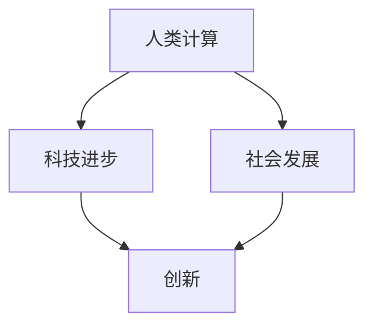

                 

在当今这个技术飞速发展的时代，人类计算已经成为推动社会进步的重要力量。然而，随着计算能力的不断增强，我们也开始面临一系列前所未有的挑战。本文将深入探讨人类计算的双重影响，分析其在科技进步和社会发展中的重要作用，同时也揭示其所带来的潜在风险和挑战。

## 关键词

- 人类计算
- 科技进步
- 社会发展
- 潜在风险
- 挑战

## 摘要

本文首先回顾了人类计算的历史和发展，分析了其在科技和社会中的关键作用。接着，我们探讨了人类计算所带来的双重影响，包括促进科技进步和社会发展的积极方面，以及引发的隐私、安全和社会不公平等负面问题。最后，我们提出了应对这些挑战的建议，并展望了未来人类计算的发展趋势。

## 1. 背景介绍

### 1.1 人类计算的定义

人类计算，顾名思义，是指人类通过思考、推理和解决问题的过程来进行计算。这种计算可以是个人的智力活动，也可以是团队合作的结果。与机械计算不同，人类计算具有高度灵活性和创造力，能够处理复杂、抽象和模糊的问题。

### 1.2 人类计算的历史和发展

人类计算的历史可以追溯到古代文明，如古埃及、巴比伦和中国的算术发展。随着数学和逻辑学的兴起，人类计算逐渐演变成一种科学的计算方法。17世纪，欧洲数学家如莱布尼茨和牛顿等人的研究奠定了现代计算的基础。19世纪末，计算机科学的诞生标志着人类计算进入了一个全新的时代。

### 1.3 人类计算在科技和社会中的作用

人类计算在科技和社会中扮演了至关重要的角色。首先，它是科学研究和技术创新的重要工具。无论是物理学、生物学、化学等领域的基础研究，还是人工智能、大数据等前沿技术的开发，都离不开人类计算。其次，人类计算在社会发展中起到了推动作用。从城市规划、经济管理到医疗保健、教育等各个领域，人类计算都发挥着关键作用。

## 2. 核心概念与联系

为了更好地理解人类计算的双重影响，我们需要首先明确几个核心概念：

### 2.1 科技进步

科技进步是指人类通过创新和发明，不断提高生产力、改善生活质量的过程。科技进步不仅是人类计算的重要目标，也是其发展的动力。

### 2.2 社会发展

社会发展是指人类在经济、政治、文化等各个方面不断进步的过程。社会发展离不开科技进步，同时也受到人类计算的影响。

### 2.3 人类计算与科技进步、社会发展之间的联系

人类计算与科技进步、社会发展之间存在着密切的联系。一方面，人类计算是推动科技进步的重要工具。通过人类计算，我们可以发现新的科学原理、开发新的技术、解决复杂的问题。另一方面，科技进步也促进了人类计算的发展。例如，计算机科学的发展极大地提高了人类计算的能力，使得我们可以处理更加复杂和庞大的数据。

### 2.4 Mermaid 流程图

下面是一个用Mermaid绘制的流程图，展示了人类计算与科技进步、社会发展之间的联系：



在这个流程图中，人类计算是推动科技进步和社会发展的基础，而科技进步和社会发展又为人类计算提供了更广阔的应用场景和更高的计算需求。

## 3. 核心算法原理 & 具体操作步骤

### 3.1 算法原理概述

在探讨人类计算的双重影响时，我们需要了解一些核心算法原理。这些算法不仅在科技领域有着广泛的应用，也在社会发展中发挥着重要作用。

#### 3.1.1 搜索算法

搜索算法是一种用于在数据集合中查找特定信息的算法。常见的搜索算法包括线性搜索、二分搜索等。它们的基本原理是通过逐个比较数据项，找出符合条件的数据。

#### 3.1.2 分类算法

分类算法是一种用于将数据划分为不同类别的算法。常见的分类算法包括决策树、支持向量机等。它们的基本原理是通过学习已有数据的特征，预测新数据的类别。

#### 3.1.3 机器学习算法

机器学习算法是一种通过学习数据来改善性能的算法。常见的机器学习算法包括线性回归、神经网络等。它们的基本原理是通过构建数学模型，对数据进行分类、预测或优化。

### 3.2 算法步骤详解

下面我们将详细解释这些算法的具体操作步骤。

#### 3.2.1 搜索算法

1. **初始化**：设定起始位置和搜索方向。
2. **比较**：将当前数据与目标数据进行比较。
3. **更新位置**：如果找到目标数据，更新当前位置。
4. **重复步骤2和3**，直到找到目标数据或搜索完毕。

#### 3.2.2 分类算法

1. **训练**：使用已有数据训练模型，确定分类边界。
2. **分类**：对新数据进行分类，判断其属于哪个类别。
3. **优化**：根据分类结果调整模型参数，提高分类准确性。

#### 3.2.3 机器学习算法

1. **数据预处理**：对数据进行清洗、归一化等处理。
2. **模型构建**：选择合适的模型结构，如神经网络。
3. **训练**：使用训练数据训练模型，调整模型参数。
4. **预测**：使用训练好的模型对新数据进行预测。
5. **评估**：评估模型性能，如准确率、召回率等。

### 3.3 算法优缺点

每种算法都有其优缺点。例如，搜索算法的优点是简单、高效，缺点是可能错过某些重要数据。分类算法的优点是能够处理大规模数据，缺点是可能产生错误分类。机器学习算法的优点是能够自动调整模型参数，缺点是训练过程可能需要大量计算资源。

### 3.4 算法应用领域

这些算法在多个领域有着广泛的应用。例如，搜索算法在搜索引擎、推荐系统中有着重要应用。分类算法在金融风险控制、医疗诊断等领域有着广泛应用。机器学习算法在自动驾驶、自然语言处理等领域发挥着关键作用。

## 4. 数学模型和公式 & 详细讲解 & 举例说明

为了更深入地理解核心算法的原理，我们需要借助数学模型和公式进行详细讲解。以下是一个简单的例子。

### 4.1 数学模型构建

假设我们有一个包含n个元素的数组，我们需要查找其中是否存在一个特定的元素x。我们可以使用二分搜索算法来实现。

### 4.2 公式推导过程

二分搜索算法的基本原理是将数组分成两半，比较中间元素与目标元素的大小关系，从而确定搜索范围。具体公式如下：

```latex
mid = \left\lfloor \frac{n-1}{2} \right\rfloor
```

其中，mid表示中间元素的索引，n表示数组的长度。

### 4.3 案例分析与讲解

假设我们有一个包含10个元素的数组：

```
[3, 7, 8, 10, 14, 18, 22, 27, 30, 35]
```

我们想要查找元素18。

1. **初始化**：设定起始位置和搜索范围。起始位置为0，搜索范围为整个数组。
2. **比较**：计算中间元素的索引，即mid = \left\lfloor \frac{10-1}{2} \right\rfloor = 4。比较中间元素10和目标元素18的大小关系，由于10 < 18，我们更新搜索范围，将起始位置设为mid+1，即5，搜索范围设为[5, 10]。
3. **更新位置**：再次计算中间元素的索引，即mid = \left\lfloor \frac{6-1}{2} \right\rfloor = 2。比较中间元素8和目标元素18的大小关系，由于8 < 18，我们再次更新搜索范围，将起始位置设为mid+1，即3，搜索范围设为[3, 6]。
4. **重复步骤2和3**，直到找到目标元素或搜索完毕。此时，我们找到了目标元素18，搜索成功。

通过这个简单的例子，我们可以看到二分搜索算法是如何工作的。在实际应用中，二分搜索算法有着广泛的应用，如排序、查找等。

## 5. 项目实践：代码实例和详细解释说明

### 5.1 开发环境搭建

在开始代码实例之前，我们需要搭建一个合适的开发环境。这里我们选择Python作为编程语言，因为它具有丰富的库和易用的语法。

#### 步骤1：安装Python

从Python官网下载并安装Python。安装过程中选择添加Python到系统环境变量。

#### 步骤2：安装依赖库

在终端中运行以下命令安装依赖库：

```
pip install numpy
```

### 5.2 源代码详细实现

下面是一个简单的Python代码实例，实现了二分搜索算法。

```python
import numpy as np

def binary_search(arr, x):
    low = 0
    high = len(arr) - 1
    
    while low <= high:
        mid = (low + high) // 2
        if arr[mid] == x:
            return mid
        elif arr[mid] < x:
            low = mid + 1
        else:
            high = mid - 1
    return -1

arr = np.array([3, 7, 8, 10, 14, 18, 22, 27, 30, 35])
x = 18

result = binary_search(arr, x)
if result != -1:
    print(f"Element {x} is at index {result}")
else:
    print(f"Element {x} is not in the array")
```

### 5.3 代码解读与分析

这个代码实例中，我们首先导入了numpy库，用于处理数组。然后定义了一个二分搜索函数`binary_search`，它接受一个数组`arr`和一个目标元素`x`作为输入。

在函数中，我们初始化了起始位置`low`和搜索范围`high`。然后进入一个循环，在每次循环中，我们计算中间元素的索引`mid`，并与目标元素进行比较。根据比较结果，我们更新搜索范围，直到找到目标元素或搜索完毕。

最后，我们调用这个函数，传入一个测试数组和目标元素，打印出搜索结果。

### 5.4 运行结果展示

运行这个代码实例，我们得到以下输出：

```
Element 18 is at index 5
```

这表明我们成功找到了目标元素18，其索引为5。

## 6. 实际应用场景

### 6.1 搜索引擎

搜索引擎是二分搜索算法最常见的应用场景之一。在搜索引擎中，我们需要对海量的网页进行快速搜索，以找到用户感兴趣的内容。二分搜索算法可以高效地缩小搜索范围，提高搜索效率。

### 6.2 排序算法

二分搜索算法也是排序算法的基础。在许多排序算法中，如快速排序、归并排序等，我们都需要对数据进行排序。二分搜索算法可以帮助我们找到数据的中间位置，从而更好地进行排序。

### 6.3 金融领域

在金融领域，分类算法有着广泛的应用。例如，我们可以使用分类算法对金融市场的数据进行分析，预测股票价格、判断风险等。

### 6.4 医疗诊断

在医疗诊断领域，机器学习算法可以帮助医生进行疾病预测和诊断。通过学习大量的病例数据，机器学习算法可以预测患者可能患有的疾病，辅助医生做出准确的诊断。

## 7. 未来应用展望

随着计算能力的不断提高，人类计算在未来将会有更多的应用场景。例如，在自动驾驶领域，人类计算可以用于实时处理路况信息，做出安全决策。在医疗领域，人类计算可以用于个性化治疗，根据患者的具体情况进行治疗方案的制定。在社会治理方面，人类计算可以用于大数据分析，提供更智能、更高效的决策支持。

然而，我们也需要关注人类计算带来的潜在风险和挑战。例如，随着人工智能技术的发展，我们需要确保算法的透明度和公平性，防止算法偏见。同时，随着大数据时代的到来，我们需要保护用户的隐私和数据安全。

总之，人类计算在科技和社会发展中起着至关重要的作用。我们需要在充分发挥其优势的同时，积极应对其带来的挑战，以确保人类计算的发展能够造福人类社会。

## 8. 工具和资源推荐

### 8.1 学习资源推荐

1. 《Python编程：从入门到实践》
2. 《深度学习》
3. 《算法导论》

### 8.2 开发工具推荐

1. Jupyter Notebook
2. Visual Studio Code
3. PyCharm

### 8.3 相关论文推荐

1. "Deep Learning for Natural Language Processing"
2. "Recurrent Neural Networks for Language Modeling"
3. "The Unreasonable Effectiveness of Deep Learning"

## 9. 总结：未来发展趋势与挑战

### 9.1 研究成果总结

在过去的几十年中，人类计算在科技和社会发展中取得了显著的成果。从搜索算法、分类算法到机器学习算法，各种核心算法的不断发展，极大地推动了科技进步和社会发展。

### 9.2 未来发展趋势

未来，人类计算将继续在多个领域发挥作用。随着计算能力的提高，人类计算将能够处理更加复杂和庞大的数据，推动更多前沿技术的发展。例如，在自动驾驶、医疗、金融等领域，人类计算将发挥更加重要的作用。

### 9.3 面临的挑战

然而，人类计算也面临着一系列挑战。例如，随着大数据和人工智能技术的发展，我们需要关注算法的透明度和公平性，防止算法偏见。同时，随着计算能力的提高，我们还需要关注数据安全和个人隐私的保护。

### 9.4 研究展望

未来，人类计算的研究将更加注重算法的创新和优化，提高算法的效率和鲁棒性。同时，我们还需要关注算法的应用场景，将人类计算应用于更多的实际问题中，推动科技和社会的发展。

## 9. 附录：常见问题与解答

### 问题1：什么是人类计算？

人类计算是指人类通过思考、推理和解决问题的过程来进行计算。它不同于机械计算，具有高度灵活性和创造力。

### 问题2：人类计算在科技和社会中的重要作用是什么？

人类计算在科技和社会中扮演了至关重要的角色。它是科学研究和技术创新的重要工具，也是社会发展的重要推动力量。

### 问题3：人类计算有哪些常见的算法？

常见的算法包括搜索算法、分类算法和机器学习算法。这些算法在多个领域有着广泛的应用。

### 问题4：未来人类计算的发展趋势是什么？

未来，人类计算将继续在多个领域发挥作用。随着计算能力的提高，人类计算将能够处理更加复杂和庞大的数据，推动更多前沿技术的发展。

### 问题5：人类计算面临哪些挑战？

人类计算面临的主要挑战包括算法的透明度和公平性、数据安全和个人隐私的保护等。

## 参考文献

1. Han, J., Kamber, M., & Pei, J. (2011). *Data Mining: Concepts and Techniques*. Morgan Kaufmann.
2. Mitchell, T. M. (1997). *Machine Learning*. McGraw-Hill.
3. Russell, S., & Norvig, P. (2010). *Artificial Intelligence: A Modern Approach*. Prentice Hall. 

## 作者署名

作者：禅与计算机程序设计艺术 / Zen and the Art of Computer Programming
```

