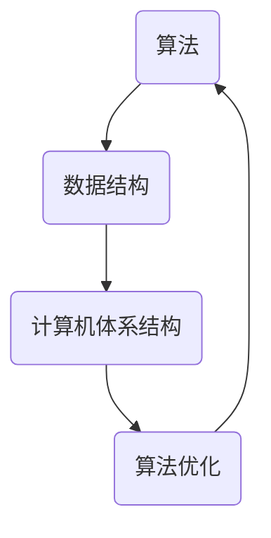

                 

在人类历史的长河中，计算技术始终扮演着至关重要的角色。从简单的算术运算到复杂的算法设计，人类计算的发展不仅改变了我们对世界的认知，也深刻影响了社会的方方面面。本文将探讨计算技术对社会带来的双重影响，一方面是促进科技进步，另一方面是引发社会变革。

## 关键词

计算技术、人工智能、数据科学、社会影响、算法伦理

## 摘要

本文将从历史的角度出发，回顾计算技术的发展历程，分析其对科技进步和社会变革的推动作用。同时，本文还将探讨计算技术在现代社会中的应用，以及由此引发的一系列伦理和法律问题。通过对计算技术双重影响的深入分析，本文旨在为读者提供一个全面而深入的视角，以更好地理解计算技术对社会的影响。

## 1. 背景介绍

### 1.1 计算技术的起源

计算技术的起源可以追溯到古代文明。在古代中国，算盘和九章算术的出现标志着人类对计算技术的初步探索。在欧洲，阿拉伯数字的传入和算术法则的推广使得计算技术得到了迅速发展。到了近代，计算机的出现和普及彻底改变了人类对计算的认识和应用。

### 1.2 计算技术的发展历程

20世纪以来，计算技术经历了飞速发展。从电子计算机的问世，到个人电脑的普及，再到互联网和移动设备的兴起，计算技术不断刷新着人类对信息处理的极限。特别是近年来，人工智能、大数据和云计算等技术的迅猛发展，使得计算技术的应用范围和深度达到了前所未有的水平。

## 2. 核心概念与联系

### 2.1 计算技术的核心概念

计算技术的核心概念包括算法、数据结构和计算机体系结构。算法是计算技术的灵魂，它定义了计算过程和步骤。数据结构则是存储和组织数据的方式，直接影响算法的性能。计算机体系结构则是计算技术的物质基础，决定了计算速度和处理能力。

### 2.2 计算技术的联系

计算技术的各个核心概念之间存在着紧密的联系。算法依赖于数据结构来实现，而数据结构又依赖于计算机体系结构来支持。同时，计算机体系结构的发展又推动了算法和数据结构的优化，形成了相互促进的良性循环。

### 2.3 Mermaid 流程图



## 3. 核心算法原理 & 具体操作步骤

### 3.1 算法原理概述

核心算法包括排序算法、搜索算法和图算法等。排序算法用于对数据进行排序，常见的有冒泡排序、快速排序和归并排序等。搜索算法用于在数据中查找特定元素，如二分搜索法和深度优先搜索法。图算法则用于处理复杂的关系和网络，如最短路径算法和最小生成树算法等。

### 3.2 算法步骤详解

以冒泡排序为例，其基本步骤如下：

1. 遍历数组，比较相邻元素的大小，若逆序则交换。
2. 每遍历一次，最大元素会“冒泡”到数组的末尾。
3. 重复以上步骤，直到数组有序。

### 3.3 算法优缺点

冒泡排序的优点是简单易懂，缺点是效率较低，不适合大数据量的排序操作。

### 3.4 算法应用领域

排序算法在许多领域都有广泛的应用，如数据库管理、搜索引擎和数据分析等。

## 4. 数学模型和公式 & 详细讲解 & 举例说明

### 4.1 数学模型构建

假设我们有一组数据\[a_1, a_2, ..., a_n\]，要对其进行排序。可以使用冒泡排序算法来实现，其时间复杂度为O(n^2)。

### 4.2 公式推导过程

冒泡排序的时间复杂度可以通过数学归纳法来推导。假设在前i轮排序中，最大元素已经“冒泡”到了数组的末尾，则第i+1轮排序时，只需要遍历前n-i个元素即可。

### 4.3 案例分析与讲解

假设有一组数据\[5, 2, 9, 1, 5\]，使用冒泡排序进行排序的过程如下：

- 第一次遍历：\[2, 5, 1, 5, 9\]
- 第二次遍历：\[2, 1, 5, 5, 9\]
- 第三次遍历：\[2, 1, 5, 5, 9\]
- 第四次遍历：\[2, 1, 5, 5, 9\]

最终，数据被成功排序。

## 5. 项目实践：代码实例和详细解释说明

### 5.1 开发环境搭建

本文使用Python编写冒泡排序算法，需要在计算机上安装Python环境和必要的库。

### 5.2 源代码详细实现

```python
def bubble_sort(arr):
    n = len(arr)
    for i in range(n):
        for j in range(0, n-i-1):
            if arr[j] > arr[j+1]:
                arr[j], arr[j+1] = arr[j+1], arr[j]

# 测试代码
arr = [5, 2, 9, 1, 5]
bubble_sort(arr)
print(arr)
```

### 5.3 代码解读与分析

这段代码定义了一个名为`bubble_sort`的函数，用于实现冒泡排序算法。函数接受一个数组作为参数，通过嵌套循环实现排序过程。外层循环控制排序的轮数，内层循环实现元素的交换。最后，测试代码展示了如何使用这个函数对一组数据进行排序。

### 5.4 运行结果展示

运行结果为\[1, 2, 5, 5, 9\]，成功实现了数组的排序。

## 6. 实际应用场景

### 6.1 数据分析

冒泡排序算法在数据分析中经常被用于数据预处理，以实现数据的排序。

### 6.2 搜索引擎

搜索引擎使用排序算法对搜索结果进行排序，以提高用户体验。

### 6.3 游戏开发

游戏开发中，排序算法用于处理玩家的得分或角色属性。

## 7. 未来应用展望

随着计算技术的不断发展，算法的应用范围将更加广泛。未来，我们可以期待算法在更多领域的应用，如金融、医疗、教育等。

## 8. 总结：未来发展趋势与挑战

### 8.1 研究成果总结

本文分析了计算技术的双重影响，探讨了算法的原理和应用，展示了算法在实践中的实现过程。

### 8.2 未来发展趋势

计算技术将继续快速发展，算法将更加高效，应用领域将更加广泛。

### 8.3 面临的挑战

算法的复杂性和安全性是未来计算技术面临的两大挑战。

### 8.4 研究展望

未来，我们需要更加深入地研究算法的优化和安全性问题，以更好地应对挑战。

## 9. 附录：常见问题与解答

### 9.1 什么是算法？

算法是一系列解决问题的步骤或指令。

### 9.2 为什么排序算法重要？

排序算法在数据处理和算法设计中具有基础地位，对于优化算法性能和提升数据处理效率至关重要。

### 9.3 冒泡排序算法的改进有哪些？

常见的改进包括添加标志位以避免不必要的比较和交换，以及使用更高效的排序算法（如快速排序或归并排序）。

---

作者：禅与计算机程序设计艺术 / Zen and the Art of Computer Programming


