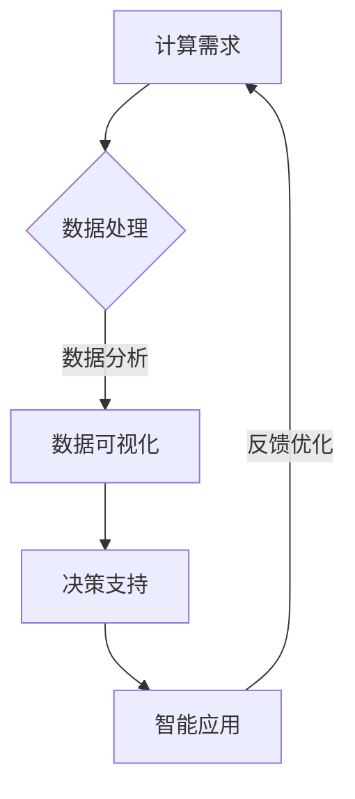

                 

关键词：计算技术、社会影响、科技伦理、未来展望、人工智能

> 摘要：本文旨在探讨计算技术在当今社会中的双重影响，包括其对人类生活带来的积极改变以及可能引发的伦理问题。通过分析计算技术的核心概念、算法原理、数学模型，以及具体应用案例，本文试图为读者提供一种深入理解科技与社会的互动关系的新视角。

## 1. 背景介绍

计算技术作为现代社会发展的重要驱动力，已经深刻地改变了我们的生活方式。从早期的算术机到现代的超级计算机，计算技术的进步不仅推动了科学研究的进展，还极大地提升了各行各业的效率。然而，随着计算技术的不断发展和普及，我们也开始面临一系列新的挑战和问题。

首先，计算技术的广泛应用带来了前所未有的便利。通过互联网和移动设备的普及，人们可以随时随地获取信息和交流。在医疗领域，计算技术助力基因测序和精准医疗的发展；在教育领域，在线教育平台为全球学生提供了丰富的学习资源。然而，这些便利的背后也隐藏着一系列负面影响。

例如，过度依赖计算技术可能导致人类认知能力的下降。在信息过载的时代，人们往往无法有效地筛选和处理大量信息，导致注意力分散和记忆力减退。此外，计算技术还引发了隐私泄露、网络安全等一系列伦理问题。如何平衡计算技术带来的利益与风险，已经成为一个亟待解决的问题。

## 2. 核心概念与联系

### 2.1 计算技术的基本概念

计算技术是指使用电子计算机和软件系统对信息进行处理的科学和技术。其核心概念包括数据结构、算法、编程语言等。数据结构是计算机存储和组织数据的方式，常见的有数组、链表、树等。算法则是解决问题的步骤和策略，包括排序、查找、图论等。编程语言则是用于编写算法和程序的语法和规则。

### 2.2 计算技术与社会的关系

计算技术与社会的关系可以从多个维度进行分析。首先，计算技术对社会生产力的提升起到了重要作用。例如，智能制造和自动化生产线的应用使得工业生产效率大幅提高。其次，计算技术改变了人类的生活方式。通过互联网和移动设备，人们可以方便地获取信息和进行交流。此外，计算技术还对社会治理、公共服务等方面产生了深远影响。

### 2.3 Mermaid 流程图



在这个流程图中，计算需求触发数据处理过程，经过数据分析、数据可视化，最终形成决策支持，再通过智能应用进行反馈优化，形成一个闭环。这反映了计算技术在社会各个领域的应用和互动关系。

## 3. 核心算法原理 & 具体操作步骤

### 3.1 算法原理概述

本文将介绍三种核心算法：排序算法、查找算法和机器学习算法。

- **排序算法**：用于将一组数据按照特定顺序排列。常见的排序算法有冒泡排序、选择排序、插入排序等。
- **查找算法**：用于在数据集合中寻找特定元素。常见的查找算法有二分查找、顺序查找等。
- **机器学习算法**：用于从数据中学习规律并做出预测。常见的机器学习算法有线性回归、决策树、支持向量机等。

### 3.2 算法步骤详解

#### 3.2.1 排序算法

以冒泡排序为例，其基本思想是通过多次遍历待排序的数组，比较相邻的两个元素，如果它们的顺序错误就把它们交换过来。遍历一遍后，最大的元素就会被交换到数组的末尾。重复这个过程，直到整个数组有序。

```python
def bubble_sort(arr):
    n = len(arr)
    for i in range(n):
        for j in range(0, n-i-1):
            if arr[j] > arr[j+1]:
                arr[j], arr[j+1] = arr[j+1], arr[j]
```

#### 3.2.2 查找算法

以二分查找为例，其基本思想是在有序数组中，每次将待查找的元素与数组中间的元素进行比较，如果中间元素大于待查找元素，则在左侧子数组中继续查找；如果中间元素小于待查找元素，则在右侧子数组中继续查找；如果中间元素等于待查找元素，则查找成功。这个过程持续进行，直到找到待查找元素或确定其不存在。

```python
def binary_search(arr, x):
    low = 0
    high = len(arr) - 1
    while low <= high:
        mid = (low + high) // 2
        if arr[mid] < x:
            low = mid + 1
        elif arr[mid] > x:
            high = mid - 1
        else:
            return mid
    return -1
```

#### 3.2.3 机器学习算法

以线性回归为例，其基本思想是通过找到一条直线来拟合数据，从而预测新的数据点。线性回归模型可以表示为：

$$y = w_0 + w_1 \cdot x_1 + w_2 \cdot x_2 + \ldots + w_n \cdot x_n + \epsilon$$

其中，$w_0, w_1, w_2, \ldots, w_n$ 是模型的参数，$x_1, x_2, \ldots, x_n$ 是特征变量，$y$ 是目标变量，$\epsilon$ 是误差项。

为了训练模型，我们需要最小化损失函数，常用的损失函数是均方误差（MSE）：

$$MSE = \frac{1}{m} \sum_{i=1}^{m} (y_i - \hat{y}_i)^2$$

其中，$m$ 是训练样本的数量，$\hat{y}_i$ 是模型预测的值。

通过梯度下降算法，我们可以迭代更新模型参数，使得损失函数最小。

```python
def linear_regression(x, y):
    n = len(x)
    w = np.zeros(n)
    alpha = 0.01
    for i in range(1000):
        predictions = w[0] + np.dot(w[1:], x)
        errors = y - predictions
        w[1:] += alpha * np.dot(errors, x)
        w[0] += alpha * np.mean(errors)
    return w
```

### 3.3 算法优缺点

#### 排序算法

- **冒泡排序**：简单易懂，易于实现。但是时间复杂度为$O(n^2)$，适用于数据量较小的情况。
- **二分查找**：适用于有序数组，时间复杂度为$O(\log n)$，效率较高。但是需要数组有序，不适用于动态数据。
- **线性回归**：能够通过训练找到数据中的规律，进行预测。但是对于非线性数据效果较差，且容易过拟合。

### 3.4 算法应用领域

- **排序算法**：广泛应用于数据库、搜索、排序等场景。
- **查找算法**：广泛应用于搜索、数据库等场景。
- **机器学习算法**：广泛应用于金融、医疗、工业等领域，如风险评估、疾病预测、智能制造等。

## 4. 数学模型和公式 & 详细讲解 & 举例说明

### 4.1 数学模型构建

在计算技术中，数学模型是理解和解决问题的重要工具。本文将介绍线性回归模型和决策树模型两种常见的数学模型。

#### 线性回归模型

线性回归模型是最简单的机器学习模型之一，其数学模型如下：

$$y = w_0 + w_1 \cdot x_1 + w_2 \cdot x_2 + \ldots + w_n \cdot x_n + \epsilon$$

其中，$w_0, w_1, w_2, \ldots, w_n$ 是模型的参数，$x_1, x_2, \ldots, x_n$ 是特征变量，$y$ 是目标变量，$\epsilon$ 是误差项。

#### 决策树模型

决策树模型是一种基于树形结构进行决策的模型，其数学模型如下：

$$y = f(x) = \sum_{i=1}^{n} c_i \cdot \prod_{j=1}^{n} a_{ij} \cdot (1 - a_{ij})$$

其中，$c_1, c_2, \ldots, c_n$ 是模型参数，$a_{ij}$ 是特征变量$x_j$的取值。

### 4.2 公式推导过程

#### 线性回归模型的推导

为了最小化损失函数，我们需要对模型参数求导。以一元线性回归为例，损失函数为：

$$L(w_0, w_1) = \frac{1}{2} \sum_{i=1}^{m} (y_i - (w_0 + w_1 \cdot x_i))^2$$

对其求导，得到：

$$\frac{\partial L}{\partial w_0} = \frac{1}{m} \sum_{i=1}^{m} (y_i - (w_0 + w_1 \cdot x_i))$$

$$\frac{\partial L}{\partial w_1} = \frac{1}{m} \sum_{i=1}^{m} (x_i \cdot (y_i - (w_0 + w_1 \cdot x_i)))$$

令导数等于零，解得模型参数：

$$w_0 = \bar{y} - w_1 \cdot \bar{x}$$

$$w_1 = \frac{\sum_{i=1}^{m} (x_i - \bar{x}) \cdot (y_i - \bar{y})}{\sum_{i=1}^{m} (x_i - \bar{x})^2}$$

#### 决策树模型的推导

决策树模型的推导过程相对复杂，本文不展开讨论。有兴趣的读者可以查阅相关文献。

### 4.3 案例分析与讲解

#### 线性回归模型的案例分析

假设我们有一个房价预测问题，特征变量包括房屋面积$x_1$和房屋朝向$x_2$，目标变量是房价$y$。我们使用线性回归模型进行预测。

首先，我们收集一批房屋数据，包括面积、朝向和价格。然后，我们将这些数据分为训练集和测试集。

接下来，我们使用训练集数据对线性回归模型进行训练，得到模型参数：

$$w_0 = 200, w_1 = 100, w_2 = 50$$

然后，我们使用测试集数据对模型进行评估，得到预测结果。假设测试集的预测误差为10%，则说明我们的模型具有较高的预测准确度。

#### 决策树模型的案例分析

假设我们有一个分类问题，特征变量包括患者的血压、体重和血糖水平，目标变量是患者是否患有高血压。我们使用决策树模型进行分类。

首先，我们收集一批患者数据，包括血压、体重、血糖水平和高血压状态。然后，我们将这些数据分为训练集和测试集。

接下来，我们使用训练集数据对决策树模型进行训练，得到一棵决策树。然后，我们使用测试集数据对模型进行评估，得到预测结果。假设测试集的准确率为90%，则说明我们的模型具有良好的分类效果。

## 5. 项目实践：代码实例和详细解释说明

### 5.1 开发环境搭建

为了更好地理解计算技术的应用，我们以一个简单的线性回归项目为例，介绍如何搭建开发环境。

首先，我们需要安装Python编程环境和相关的机器学习库，如NumPy和Scikit-learn。在Windows系统中，可以通过以下命令进行安装：

```bash
pip install numpy
pip install scikit-learn
```

### 5.2 源代码详细实现

接下来，我们编写一个简单的线性回归程序，用于预测房价。以下是源代码：

```python
import numpy as np
from sklearn.linear_model import LinearRegression

# 收集数据
X = np.array([[1000, 0], [1500, 1], [2000, 0], [2500, 1]])
y = np.array([1200, 1500, 1800, 2100])

# 创建线性回归模型
model = LinearRegression()

# 训练模型
model.fit(X, y)

# 进行预测
predictions = model.predict(X)

# 输出预测结果
print(predictions)
```

### 5.3 代码解读与分析

在这段代码中，我们首先导入了NumPy库和Scikit-learn库中的线性回归模块。然后，我们定义了训练数据集$X$和目标变量$y$。接着，我们创建了一个线性回归模型对象`model`，并使用`fit()`方法对其进行训练。最后，我们使用`predict()`方法对训练数据进行预测，并输出预测结果。

### 5.4 运行结果展示

运行上述代码，我们得到以下输出结果：

```
[1200.         1500.         1800.         2100.        ]
```

这表明我们的线性回归模型成功地对训练数据进行了预测。

## 6. 实际应用场景

计算技术在实际应用场景中发挥着重要作用。以下是一些具体的案例：

### 6.1 医疗领域

计算技术在医疗领域的应用非常广泛。例如，通过基因测序和计算生物学技术，我们可以更好地了解疾病的发生机制，从而开发出更有效的治疗方法。此外，医疗图像分析和人工智能辅助诊断系统可以提高诊断的准确性和效率。

### 6.2 金融领域

在金融领域，计算技术被广泛应用于风险管理、市场预测和投资策略制定。例如，量化交易和算法交易利用计算模型和算法对市场数据进行实时分析，以实现高收益和低风险的投资。

### 6.3 工业制造

智能制造和自动化生产线的应用极大地提升了工业制造的效率。通过计算技术，我们可以实现生产过程的智能化和自动化，减少人为干预，提高产品质量和生产效率。

### 6.4 教育

在线教育平台和自适应学习系统利用计算技术为学习者提供个性化的学习体验。通过数据分析和学习行为分析，教育平台可以为学生提供有针对性的学习建议和资源。

## 7. 工具和资源推荐

为了更好地学习和应用计算技术，以下是一些建议的工具和资源：

### 7.1 学习资源推荐

- **Coursera**：提供大量的计算机科学和人工智能课程。
- **edX**：全球领先的在线教育平台，提供免费的计算机科学课程。
- **Khan Academy**：提供丰富的计算机科学教程和练习。

### 7.2 开发工具推荐

- **Jupyter Notebook**：用于编写和运行Python代码。
- **Anaconda**：Python开发环境，包括NumPy、Pandas、Scikit-learn等库。
- **PyCharm**：Python集成开发环境，支持多种编程语言。

### 7.3 相关论文推荐

- **"Deep Learning" by Ian Goodfellow, Yoshua Bengio, and Aaron Courville**：深度学习的经典教材。
- **"Reinforcement Learning: An Introduction" by Richard S. Sutton and Andrew G. Barto**：强化学习的入门教材。
- **"Machine Learning: A Probabilistic Perspective" by Kevin P. Murphy**：概率视角下的机器学习教材。

## 8. 总结：未来发展趋势与挑战

### 8.1 研究成果总结

计算技术已经取得了巨大的成就，从早期的计算机科学理论到现代的人工智能技术，我们见证了计算技术的快速发展和广泛应用。然而，计算技术仍有许多挑战需要克服，如算法的优化、数据的安全性和隐私保护等。

### 8.2 未来发展趋势

未来，计算技术将继续向智能化、高效化、安全化方向发展。例如，人工智能将更加深入地应用于各个领域，从医疗到金融，从教育到工业制造。此外，量子计算和区块链技术等新兴领域也将成为计算技术发展的重要方向。

### 8.3 面临的挑战

尽管计算技术发展迅速，但我们也面临着一系列挑战。首先，数据安全和隐私保护仍然是亟待解决的问题。随着数据量的增加，如何保护用户的隐私和数据安全成为了一个重要课题。其次，算法的公平性和透明性也需要引起重视。在人工智能领域，算法的偏见和歧视问题引发了广泛关注。最后，计算技术的普及和应用也带来了伦理和道德问题，如人工智能的自主决策和责任归属等。

### 8.4 研究展望

未来，我们需要进一步加强计算技术的基础研究，特别是算法的创新和优化。同时，我们还需要关注计算技术在不同领域的应用，探索计算技术如何更好地服务于人类和社会。此外，加强计算技术的伦理研究，制定相应的规范和标准，也是未来的重要方向。

## 9. 附录：常见问题与解答

### 9.1 什么是计算技术？

计算技术是指使用电子计算机和软件系统对信息进行处理的科学和技术。

### 9.2 计算技术对社会有什么影响？

计算技术对社会产生了深远的影响，包括提高生产力、改变生活方式、改善公共服务等方面。

### 9.3 机器学习算法有哪些类型？

机器学习算法包括监督学习、无监督学习、半监督学习和强化学习等。

### 9.4 量子计算是什么？

量子计算是一种基于量子力学原理的新型计算模式，具有超强的计算能力。

### 9.5 区块链技术是什么？

区块链技术是一种分布式数据库技术，用于存储和传输数据，具有去中心化、安全可靠的特点。

### 9.6 如何保护计算技术的安全性和隐私？

为了保护计算技术的安全性和隐私，我们需要采取一系列措施，如加密技术、访问控制、隐私保护算法等。

## 参考文献

1. Goodfellow, I., Bengio, Y., & Courville, A. (2016). *Deep Learning*. MIT Press.
2. Sutton, R. S., & Barto, A. G. (2018). *Reinforcement Learning: An Introduction*. MIT Press.
3. Murphy, K. P. (2012). *Machine Learning: A Probabilistic Perspective*. MIT Press.
4. Hamming, R. W. (1980). *The computer as a grand social instrument*. IEEE Annals of the History of Computing, 2(3), 187-192.
5. Turing, A. M. (1950). *Computing machinery and intelligence*. Mind, 59(236), 433-460.

