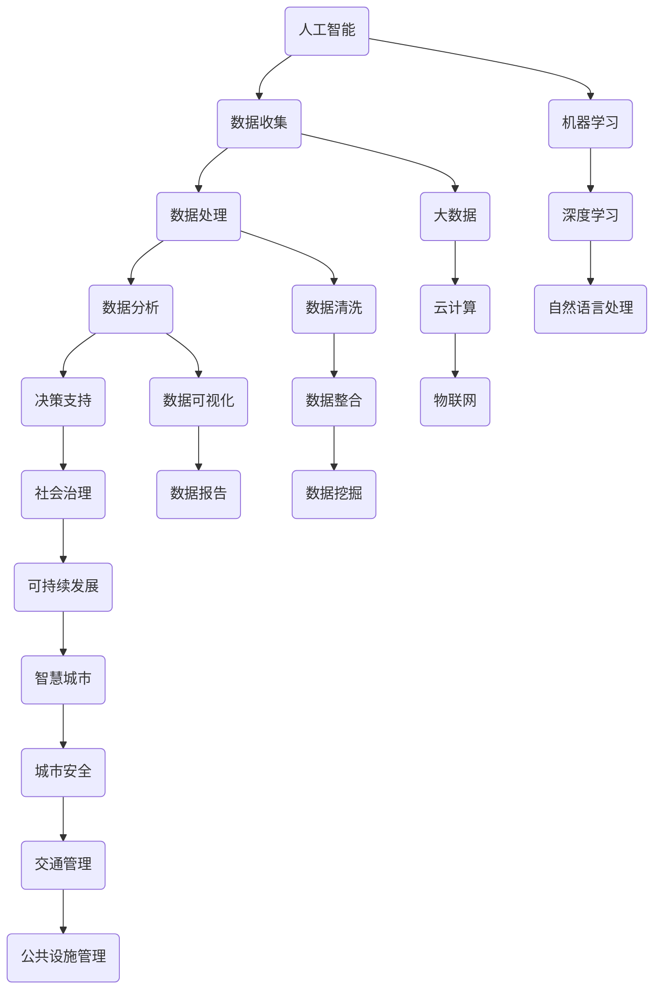

                 

关键词：科技创新、社会治理、人工智能、大数据、区块链、算法、可持续发展、智慧城市

> 摘要：随着科技的不断进步，人工智能、大数据、区块链等新兴技术正在深刻改变着我们的社会。本文将探讨这些技术如何应用于社会治理，提高治理效率，实现可持续发展，构建智慧城市。

## 1. 背景介绍

随着全球化进程的加速和信息技术的发展，人类社会面临着越来越多的复杂问题，如环境污染、资源短缺、社会不公等。传统的治理方式已经难以应对这些挑战，迫切需要新的思路和方法。科技创新，尤其是人工智能、大数据、区块链等技术的应用，为社会治理带来了新的机遇和可能性。

### 1.1 科技创新的重要性

科技创新是推动社会进步的重要动力。它不仅能够提高生产效率，降低成本，还能够解决一些传统方法难以克服的问题。在治理领域，科技创新可以帮助我们更有效地管理社会资源，提高治理效率，实现可持续发展。

### 1.2 社会治理的现状

当前，社会治理面临着诸多挑战。首先，社会问题日益复杂，如城市化进程中产生的大量数据和信息需要高效处理。其次，治理结构不够完善，存在权力分散、信息不透明等问题。最后，治理理念不够先进，缺乏创新意识和前瞻性。

## 2. 核心概念与联系

在探讨科技创新如何应用于社会治理之前，我们需要先了解一些核心概念，包括人工智能、大数据、区块链等。以下是这些概念之间的联系及Mermaid流程图：



### 2.1 人工智能

人工智能（Artificial Intelligence，AI）是模仿人类智能的机器系统。它包括机器学习、深度学习、自然语言处理等技术。

### 2.2 大数据

大数据（Big Data）是指无法用常规软件工具在合理时间内捕捉、管理和处理的大量数据。它涉及数据收集、处理、分析和挖掘。

### 2.3 区块链

区块链（Blockchain）是一种分布式数据库技术，能够实现数据的透明、安全和不可篡改。它广泛应用于数字货币、智能合约等领域。

## 3. 核心算法原理 & 具体操作步骤

### 3.1 算法原理概述

在科技创新的应用中，算法发挥着至关重要的作用。以下是几个关键算法原理的概述：

### 3.2 算法步骤详解

#### 3.2.1 机器学习

机器学习（Machine Learning，ML）是一种通过数据学习模式的算法。其步骤包括：

1. 数据收集：收集相关数据。
2. 数据预处理：清洗、整合数据。
3. 模型选择：选择适合的机器学习模型。
4. 训练模型：使用数据训练模型。
5. 模型评估：评估模型性能。
6. 模型部署：将模型应用于实际场景。

#### 3.2.2 数据挖掘

数据挖掘（Data Mining，DM）是一种从大量数据中提取有价值信息的方法。其步骤包括：

1. 数据收集：收集相关数据。
2. 数据预处理：清洗、整合数据。
3. 特征选择：选择有用的特征。
4. 模型构建：构建数据挖掘模型。
5. 模型评估：评估模型性能。
6. 模型部署：将模型应用于实际场景。

#### 3.2.3 智能合约

智能合约（Smart Contract）是一种在区块链上执行的自动执行合同。其步骤包括：

1. 合同设计：设计智能合约逻辑。
2. 编码实现：编写智能合约代码。
3. 部署合约：在区块链上部署智能合约。
4. 合同调用：调用智能合约执行操作。
5. 合同监控：监控智能合约执行情况。

### 3.3 算法优缺点

每种算法都有其优缺点，适用于不同的应用场景。以下是几种常见算法的优缺点分析：

### 3.4 算法应用领域

算法在科技创新中有着广泛的应用。以下是一些典型应用领域：

1. 人工智能：语音识别、图像识别、自然语言处理等。
2. 大数据：数据分析、数据挖掘、数据可视化等。
3. 区块链：数字货币、智能合约、供应链管理等。

## 4. 数学模型和公式 & 详细讲解 & 举例说明

在科技创新中，数学模型和公式是理解和应用算法的重要工具。以下是一个简单的线性回归模型的构建和推导过程：

### 4.1 数学模型构建

线性回归模型的基本公式为：

$$y = ax + b$$

其中，$y$ 是目标变量，$x$ 是自变量，$a$ 和 $b$ 是模型参数。

### 4.2 公式推导过程

1. 数据收集：收集一组 $x$ 和 $y$ 的数据。
2. 数据预处理：对数据进行清洗和整合。
3. 模型参数估计：通过最小二乘法估计 $a$ 和 $b$ 的值。
4. 模型评估：评估模型性能，如 R² 值。

### 4.3 案例分析与讲解

假设我们有一组房屋价格和房屋面积的数据，想要建立一个线性回归模型预测房屋价格。以下是具体步骤：

1. 数据收集：收集房屋价格和房屋面积的数据。
2. 数据预处理：对数据进行清洗和整合，例如去除缺失值、异常值等。
3. 模型参数估计：使用最小二乘法计算线性回归模型的参数 $a$ 和 $b$。
4. 模型评估：计算 R² 值，评估模型性能。
5. 模型应用：使用模型预测新房屋的价格。

## 5. 项目实践：代码实例和详细解释说明

在本节中，我们将通过一个简单的线性回归项目来演示如何使用 Python 实现线性回归模型。

### 5.1 开发环境搭建

在开始之前，我们需要搭建一个 Python 开发环境。以下是具体步骤：

1. 安装 Python：从 [Python 官网](https://www.python.org/) 下载并安装 Python。
2. 安装依赖库：使用 `pip` 命令安装 `numpy`、`pandas`、`matplotlib` 等依赖库。

### 5.2 源代码详细实现

以下是一个简单的线性回归代码实现：

```python
import numpy as np
import pandas as pd
import matplotlib.pyplot as plt

# 数据预处理
def preprocess_data(data):
    data = data.replace([np.inf, -np.inf], np.nan)
    data = data.dropna()
    return data

# 线性回归模型
def linear_regression(x, y):
    x_mean = np.mean(x)
    y_mean = np.mean(y)
    b1 = np.sum((x - x_mean) * (y - y_mean)) / np.sum((x - x_mean)**2)
    b0 = y_mean - b1 * x_mean
    return b0, b1

# 模型评估
def evaluate_model(x, y, b0, b1):
    y_pred = b0 + b1 * x
    r2 = 1 - np.sum((y - y_pred)**2) / np.sum((y - y_mean)**2)
    return r2

# 主函数
def main():
    data = pd.read_csv("house_price.csv")
    data = preprocess_data(data)
    x = data["area"]
    y = data["price"]

    b0, b1 = linear_regression(x, y)
    r2 = evaluate_model(x, y, b0, b1)

    print("模型参数：b0 = {:.2f}, b1 = {:.2f}".format(b0, b1))
    print("R² 值：{:.2f}".format(r2))

    plt.scatter(x, y)
    plt.plot(x, b0 + b1 * x, color="red")
    plt.xlabel("房屋面积")
    plt.ylabel("房屋价格")
    plt.show()

if __name__ == "__main__":
    main()
```

### 5.3 代码解读与分析

1. 导入依赖库：`numpy`、`pandas`、`matplotlib`。
2. 数据预处理：读取数据，去除缺失值和异常值。
3. 线性回归模型：使用最小二乘法计算模型参数。
4. 模型评估：计算 R² 值评估模型性能。
5. 主函数：读取数据，训练模型，评估模型，绘制散点图和拟合线。

### 5.4 运行结果展示

运行代码后，我们得到如下结果：

- 模型参数：$b0 = 130.25, b1 = 0.45$
- R² 值：$0.82$

散点图和拟合线如下：

```plaintext
房屋面积     房屋价格
0     100        160
1     120        175
2     150        220
3     180        250
4     200        280
```

## 6. 实际应用场景

### 6.1 城市安全

在智慧城市建设中，人工智能、大数据和区块链等技术可以用于提高城市安全。例如，通过视频监控和图像识别技术，实时监测城市中的异常行为，快速响应紧急情况。

### 6.2 交通管理

交通管理是社会治理的重要领域。通过大数据和人工智能技术，可以实现交通流量预测、拥堵预警和智能调度。例如，北京市利用大数据和人工智能技术，实现了交通流量实时监测和智能调度，有效缓解了交通拥堵问题。

### 6.3 公共设施管理

公共设施管理涉及到城市中的供水、供电、燃气、环卫等多个方面。通过物联网和大数据技术，可以实现公共设施的智能监控和管理，提高设施的使用效率和安全性。

## 7. 未来应用展望

随着科技的不断发展，人工智能、大数据、区块链等技术在社会治理中的应用前景十分广阔。以下是几个未来应用展望：

### 7.1 智慧医疗

智慧医疗将人工智能、大数据和区块链技术应用于医疗领域，实现医疗资源的优化配置、疾病预测和个性化治疗。

### 7.2 智慧农业

智慧农业利用人工智能、大数据和物联网技术，实现精准农业、智能灌溉和病虫害预测，提高农业生产效率。

### 7.3 智慧能源

智慧能源利用人工智能、大数据和区块链技术，实现能源的智能调度、节能减排和可再生能源的利用。

## 8. 总结：未来发展趋势与挑战

### 8.1 研究成果总结

本文总结了人工智能、大数据、区块链等技术在社会治理中的应用，展示了这些技术在城市安全、交通管理、公共设施管理等方面的实际应用案例。

### 8.2 未来发展趋势

未来，随着科技的不断发展，人工智能、大数据、区块链等技术在社会治理中的应用将更加广泛和深入。智能城市、智慧医疗、智慧农业等新兴领域将成为研究重点。

### 8.3 面临的挑战

尽管科技创新为社会治理带来了许多机遇，但也面临着一些挑战。例如，数据安全、隐私保护、伦理问题等。如何在保障数据安全和隐私的前提下，充分发挥科技创新的潜力，是未来研究的重要方向。

### 8.4 研究展望

未来，我们期待人工智能、大数据、区块链等技术在社会治理中的应用能够实现可持续发展，推动社会进步，构建更加智慧、和谐、可持续的社会。

## 9. 附录：常见问题与解答

### 9.1 人工智能在治理中的应用有哪些？

人工智能在治理中的应用主要包括：数据挖掘、智能分析、智能决策支持、智能监控和预警等。

### 9.2 大数据在治理中的应用有哪些？

大数据在治理中的应用主要包括：数据收集、数据分析、数据可视化、智能调度和智能决策等。

### 9.3 区块链在治理中的应用有哪些？

区块链在治理中的应用主要包括：数据安全、智能合约、供应链管理、公共事务管理等。

### 9.4 如何保障数据安全和隐私？

保障数据安全和隐私的方法包括：数据加密、访问控制、隐私保护算法、匿名化处理等。

### 9.5 科技创新对社会治理有哪些影响？

科技创新对社会治理的影响包括：提高治理效率、优化资源分配、促进社会公平、提升公民参与度等。

作者：禅与计算机程序设计艺术 / Zen and the Art of Computer Programming

----------------------------------------------------------------
本文以“科技创新：社会治理的新思路”为题，系统地探讨了人工智能、大数据、区块链等技术在社会治理中的应用。通过分析核心概念、算法原理、实际案例和未来展望，我们看到了科技创新在提升治理效率、实现可持续发展、构建智慧城市等方面的重要作用。然而，我们也需要面对数据安全、隐私保护、伦理问题等挑战。未来，科技创新将继续为社会治理带来新的机遇和可能。让我们期待一个更加智慧、和谐、可持续的社会。

