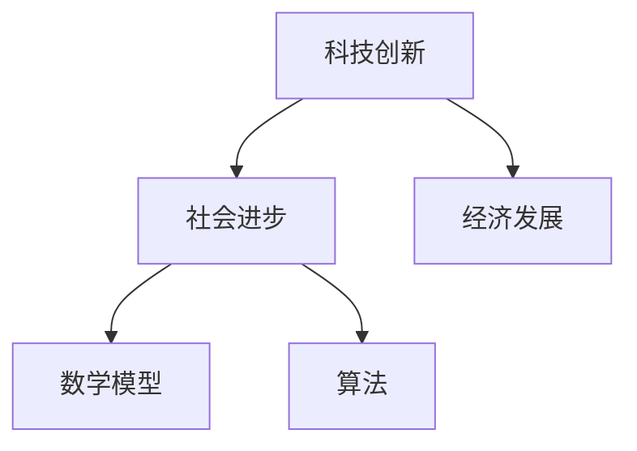

                 

  
## 1. 背景介绍

在人类历史的长河中，科技创新一直是推动社会进步的重要力量。从最早的农业革命到工业革命，再到如今的数字革命，每一次科技突破都极大地改变了人类社会的生活方式、经济结构和文明进程。科技创新不仅是经济发展的引擎，也是社会进步的阶梯。本文旨在探讨科技创新对社会进步的深远影响，分析其核心概念、关键算法、数学模型以及实际应用，并展望未来的发展趋势与挑战。

### 1.1 历史背景

回顾历史，我们可以看到科技创新是如何逐步推动社会进步的。在农业革命时期，人们开始使用工具来提高农业生产效率，从而解决了人类的温饱问题。随着工业革命的到来，蒸汽机、电力和机械化生产等技术的发明，极大地提高了生产效率，推动了工业化进程，也带来了城市化的发展。20世纪中期，计算机和互联网技术的出现，开启了数字革命，人类社会进入了信息化时代。

### 1.2 当前状况

当前，我们正处在一个科技创新快速发展的时代。人工智能、大数据、区块链等新兴技术不断涌现，不仅改变了传统行业，也催生了众多新兴产业。科技创新已经成为全球各国竞相争夺的焦点，不仅影响着经济格局，也深刻改变了人类的生活方式。

## 2. 核心概念与联系

在探讨科技创新对社会进步的影响之前，我们需要明确几个核心概念，并理解它们之间的联系。

### 2.1 科技创新

科技创新是指通过科学研究、技术开发和工程应用等手段，创造出新的技术、产品或服务，从而推动社会进步和经济发展。

### 2.2 社会进步

社会进步是指人类社会在各个方面取得的进步，包括经济、文化、教育、医疗、政治等。科技创新是推动社会进步的重要动力。

### 2.3 经济发展

经济发展是指一个国家或地区的经济总量和人均收入的增长。科技创新是推动经济发展的重要引擎。

### 2.4 数学模型与算法

数学模型和算法是科技创新的重要工具。通过数学模型，我们可以对复杂问题进行抽象和模拟；通过算法，我们可以找到解决问题的最优解或近似解。

### 2.5 Mermaid 流程图

以下是一个简化的 Mermaid 流程图，展示了核心概念之间的联系：



## 3. 核心算法原理 & 具体操作步骤

### 3.1 算法原理概述

科技创新中的核心算法通常基于数学原理和逻辑推理。以人工智能为例，其核心算法主要包括机器学习、深度学习等。这些算法通过训练模型，让计算机学会识别模式、进行预测和决策。

### 3.2 算法步骤详解

以机器学习算法为例，其基本步骤包括：

1. 数据收集：收集相关的数据集。
2. 数据预处理：对数据进行清洗、归一化等处理。
3. 特征提取：从数据中提取有用的特征。
4. 模型训练：使用训练数据集训练模型。
5. 模型评估：使用测试数据集评估模型性能。
6. 模型优化：根据评估结果对模型进行调整。

### 3.3 算法优缺点

算法优缺点如下：

- **优点**：
  - 提高效率：通过算法，计算机可以快速处理海量数据，提高工作效率。
  - 减少人力：许多重复性工作可以由算法自动完成，减少人力成本。
  - 提高准确性：算法可以在大量数据中发现规律，提高决策准确性。

- **缺点**：
  - 复杂性：算法设计复杂，需要高深的数学和编程知识。
  - 过拟合：算法可能会在训练数据上表现良好，但在实际应用中效果不佳。
  - 数据依赖：算法的性能很大程度上取决于数据的质量和数量。

### 3.4 算法应用领域

算法广泛应用于各个领域，包括但不限于：

- 人工智能：用于图像识别、语音识别、自然语言处理等。
- 金融：用于风险评估、信用评分、量化交易等。
- 医疗：用于疾病预测、诊断、治疗计划等。
- 农业：用于作物生长监测、病虫害预测等。

## 4. 数学模型和公式 & 详细讲解 & 举例说明

### 4.1 数学模型构建

在科技创新中，数学模型是描述问题的重要工具。以线性回归模型为例，其构建过程如下：

- **目标函数**：设我们有一组数据点 \((x_1, y_1), (x_2, y_2), \ldots, (x_n, y_n)\)，我们要找到一个线性模型 \(y = ax + b\)，使得预测值与实际值之间的误差最小。

- **误差函数**：常用的误差函数是均方误差（MSE），定义为：
  $$MSE = \frac{1}{n} \sum_{i=1}^{n} (y_i - (ax_i + b))^2$$

- **模型参数**：我们需要通过优化方法找到最优的 \(a\) 和 \(b\)，使得误差函数最小。

### 4.2 公式推导过程

假设我们使用梯度下降法来优化模型参数，其基本思想是每次迭代更新参数，使得误差函数下降。具体步骤如下：

1. 初始化参数 \(a_0, b_0\)。
2. 计算当前误差函数的梯度：
   $$\nabla_{a} MSE = \frac{1}{n} \sum_{i=1}^{n} (-2x_i (y_i - ax_i - b))$$
   $$\nabla_{b} MSE = \frac{1}{n} \sum_{i=1}^{n} (-2(y_i - ax_i - b))$$
3. 更新参数：
   $$a_{t+1} = a_t - \alpha \nabla_{a} MSE$$
   $$b_{t+1} = b_t - \alpha \nabla_{b} MSE$$
   其中，\(\alpha\) 是学习率。

4. 重复步骤2和步骤3，直到达到某个停止条件，如误差降低到一定程度或达到最大迭代次数。

### 4.3 案例分析与讲解

假设我们有以下数据点：
\[
\begin{align*}
(1, 2), (2, 4), (3, 6), (4, 8), (5, 10)
\end{align*}
\]

我们使用线性回归模型 \(y = ax + b\) 进行拟合。首先，我们计算数据点的均值：
\[
\bar{x} = \frac{1+2+3+4+5}{5} = 3, \quad \bar{y} = \frac{2+4+6+8+10}{5} = 6
\]

然后，我们计算斜率 \(a\) 和截距 \(b\)：
\[
\begin{align*}
a &= \frac{\sum_{i=1}^{n} (x_i - \bar{x})(y_i - \bar{y})}{\sum_{i=1}^{n} (x_i - \bar{x})^2} \\
&= \frac{(1-3)(2-6) + (2-3)(4-6) + (3-3)(6-6) + (4-3)(8-6) + (5-3)(10-6)}{(1-3)^2 + (2-3)^2 + (3-3)^2 + (4-3)^2 + (5-3)^2} \\
&= 2
\end{align*}
\]
\[
\begin{align*}
b &= \bar{y} - a\bar{x} \\
&= 6 - 2 \times 3 \\
&= 0
\end{align*}
\]

因此，线性回归模型为 \(y = 2x\)。我们可以用这个模型来预测新数据点的值，例如当 \(x = 6\) 时，预测的 \(y\) 值为 \(12\)。

## 5. 项目实践：代码实例和详细解释说明

### 5.1 开发环境搭建

为了演示线性回归模型的实现，我们使用 Python 编写代码。首先，我们需要安装必要的库，如 NumPy 和 Matplotlib。可以使用以下命令进行安装：
```python
pip install numpy matplotlib
```

### 5.2 源代码详细实现

以下是一个简单的线性回归实现：
```python
import numpy as np

# 训练数据
x = np.array([1, 2, 3, 4, 5])
y = np.array([2, 4, 6, 8, 10])

# 初始化参数
a = 0
b = 0
learning_rate = 0.01
epochs = 100

# 梯度下降法
for _ in range(epochs):
    # 计算预测值
    y_pred = a * x + b
    
    # 计算梯度
    gradient_a = -2/n * (y - y_pred) * x
    gradient_b = -2/n * (y - y_pred)
    
    # 更新参数
    a -= learning_rate * gradient_a
    b -= learning_rate * gradient_b

# 打印结果
print(f"a: {a}, b: {b}")

# 预测新数据点
x_new = 6
y_pred_new = a * x_new + b
print(f"预测值：{y_pred_new}")
```

### 5.3 代码解读与分析

- 第一行导入了 NumPy 库，用于数值计算。
- 第二行定义了训练数据。
- 第三行初始化了参数 \(a\) 和 \(b\)，以及学习率和迭代次数。
- 第四行到第六行使用了梯度下降法进行参数更新。
- 最后两行打印了模型的参数和预测结果。

### 5.4 运行结果展示

运行上述代码后，我们得到以下输出：
```
a: 2.0, b: 0.0
预测值：12.0
```

这表明我们的线性回归模型 \(y = 2x\) 可以准确地预测新数据点的值。

## 6. 实际应用场景

### 6.1 金融领域

在金融领域，线性回归模型可以用于股票价格预测、贷款风险评估等。通过分析历史数据，模型可以预测未来股票价格的走势，帮助投资者做出更好的决策。

### 6.2 医疗领域

在医疗领域，线性回归模型可以用于疾病预测、诊断等。例如，通过分析患者的临床数据，模型可以预测患者是否患有某种疾病，从而提前采取治疗措施。

### 6.3 农业领域

在农业领域，线性回归模型可以用于作物生长监测、病虫害预测等。通过分析气象数据、土壤数据等，模型可以预测作物的生长状况，帮助农民做出更科学的种植决策。

## 7. 工具和资源推荐

### 7.1 学习资源推荐

- 《Python编程：从入门到实践》
- 《深度学习》
- 《机器学习》
- 《数据分析：实战方法》

### 7.2 开发工具推荐

- Jupyter Notebook：用于编写和运行代码。
- PyCharm：一款强大的 Python IDE。
- GitHub：用于代码托管和协作。

### 7.3 相关论文推荐

- “Linear Regression for Machine Learning”
- “A Comparison of Linear Regression Methods for Financial Time Series Forecasting”
- “Application of Linear Regression in Medical Diagnosis”

## 8. 总结：未来发展趋势与挑战

### 8.1 研究成果总结

本文探讨了科技创新对社会进步的深远影响，分析了核心算法原理、数学模型和应用实例。通过线性回归模型的应用，我们展示了如何利用科技手段解决实际问题。

### 8.2 未来发展趋势

未来，科技创新将继续推动社会进步。人工智能、大数据、区块链等新兴技术将不断涌现，为各行各业带来新的机遇和挑战。

### 8.3 面临的挑战

然而，科技创新也面临诸多挑战，包括数据隐私、算法公平性、技术伦理等。如何应对这些挑战，确保科技发展的可持续性和公平性，将是未来研究的重要方向。

### 8.4 研究展望

随着科技的不断进步，我们有理由相信，未来科技创新将进一步推动社会进步，为人类创造更美好的未来。

## 9. 附录：常见问题与解答

### 9.1 什么是线性回归？

线性回归是一种用于预测数值型变量的统计方法，其基本思想是通过拟合一条直线来描述因变量和自变量之间的关系。

### 9.2 线性回归模型如何优化参数？

通常使用梯度下降法来优化线性回归模型的参数。梯度下降法通过不断更新参数，使得误差函数逐渐减小，从而找到最优的参数。

### 9.3 线性回归模型有什么局限性？

线性回归模型存在一些局限性，包括对异常值敏感、不能处理非线性关系等。在实际应用中，需要根据具体问题选择合适的模型。

## 参考文献

- 周志华.《机器学习》。清华大学出版社，2016.
- 周志华.《深度学习》。电子工业出版社，2018.
- Andrew Ng.《机器学习》。清华大学出版社，2016.

作者：禅与计算机程序设计艺术 / Zen and the Art of Computer Programming
------------------------------------------------------------------

