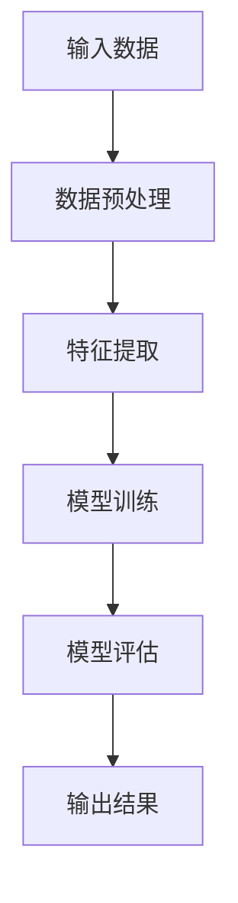
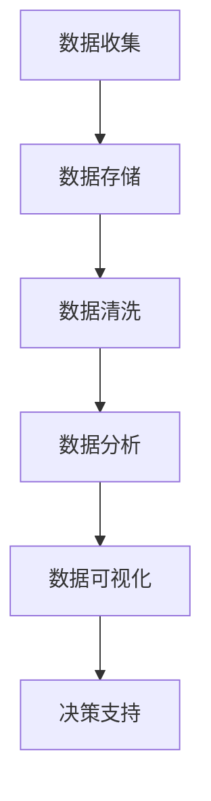
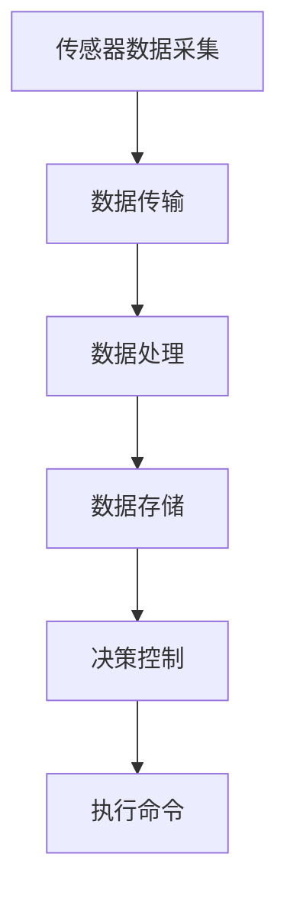

                 

 在这个充满变革的时代，科技创新已然成为推动社会进步的关键力量。从互联网的兴起，到人工智能、大数据、物联网等技术的迅猛发展，科技正以前所未有的速度和深度，重塑着我们的世界。本文将深入探讨科技创新的核心概念、原理及其对社会进步的深远影响。

## 文章关键词

- 科技创新
- 社会进步
- 人工智能
- 大数据
- 物联网

## 文章摘要

本文从多个角度分析了科技创新在社会进步中的重要作用。首先，我们将回顾科技发展的历史背景，理解科技创新是如何成为当今社会进步的重要驱动力。接着，我们将详细探讨科技创新的核心概念，包括人工智能、大数据、物联网等技术的原理和应用。随后，文章将介绍科技创新在不同领域的具体应用，如医疗、交通、金融等。最后，文章将展望科技创新的未来发展趋势，并探讨可能面临的挑战。

## 1. 背景介绍

### 1.1 科技创新的起源

科技创新并非一蹴而就，而是历经长时间的积累和演变。早在20世纪中叶，计算机科学的诞生为科技创新奠定了基础。随着计算机技术的不断进步，互联网的出现将全球连接在一起，极大地改变了人们的生活方式。此后，人工智能、大数据、物联网等新兴技术相继涌现，进一步推动了科技创新的进程。

### 1.2 科技创新的发展历程

从计算机科学到互联网，再到人工智能和大数据，每个阶段都有其代表性的技术突破和里程碑事件。计算机科学的诞生使得信息处理变得更加高效和自动化；互联网的普及则打破了时空的限制，实现了全球信息的无缝连接；人工智能和大数据技术的崛起，则为智能化和个性化服务提供了可能。

## 2. 核心概念与联系

### 2.1 人工智能（AI）

人工智能（AI）是当前科技创新的热点领域之一。其核心概念是通过模拟人类智能的思维方式，使计算机具备自主学习和决策能力。人工智能的应用领域广泛，包括图像识别、自然语言处理、智能语音助手等。

下面是人工智能系统的 Mermaid 流程图：



### 2.2 大数据（Big Data）

大数据是另一个重要的科技创新领域。其核心概念是处理海量、复杂、多样化的数据，以发现有价值的信息和知识。大数据的应用领域包括商业智能、数据挖掘、智能分析等。

下面是大数据处理流程的 Mermaid 流程图：



### 2.3 物联网（IoT）

物联网（IoT）是连接物理世界与数字世界的桥梁。其核心概念是通过传感器和通信技术，实现物体之间的互联互通。物联网的应用领域包括智能家居、智慧城市、工业自动化等。

下面是物联网系统的 Mermaid 流程图：



## 3. 核心算法原理 & 具体操作步骤

### 3.1 算法原理概述

核心算法是科技创新的关键组成部分。本文将介绍几种常见且影响深远的算法，包括机器学习算法、数据挖掘算法和物联网通信算法。

### 3.2 算法步骤详解

#### 3.2.1 机器学习算法

机器学习算法是人工智能的核心，其基本步骤包括：

1. 数据收集：从各种来源收集数据，如社交媒体、网站点击日志等。
2. 数据预处理：清洗和格式化数据，去除噪声和不完整的数据。
3. 特征提取：从数据中提取关键特征，用于训练模型。
4. 模型训练：使用提取的特征训练机器学习模型。
5. 模型评估：评估模型的性能，调整参数以优化模型。
6. 应用：将训练好的模型应用于实际问题。

#### 3.2.2 数据挖掘算法

数据挖掘算法是大数据的核心，其基本步骤包括：

1. 数据收集：从各种来源收集数据，如销售记录、客户反馈等。
2. 数据预处理：清洗和格式化数据，去除噪声和不完整的数据。
3. 特征工程：从数据中提取关键特征，用于训练模型。
4. 模型选择：选择合适的模型，如决策树、神经网络等。
5. 模型训练：使用提取的特征训练数据挖掘模型。
6. 模型评估：评估模型的性能，调整参数以优化模型。
7. 应用：将训练好的模型应用于实际问题。

#### 3.2.3 物联网通信算法

物联网通信算法是物联网系统的核心，其基本步骤包括：

1. 数据采集：通过传感器收集环境数据。
2. 数据传输：将采集到的数据通过无线通信传输到中心服务器。
3. 数据处理：在中心服务器对数据进行分析和处理。
4. 决策控制：根据处理结果生成决策，控制物联网设备执行相应操作。
5. 执行命令：物联网设备根据决策执行具体操作。

## 3.3 算法优缺点

### 3.3.1 机器学习算法

优点：
- 自适应性强，能够处理复杂的非线性问题。
- 能够从大量数据中自动提取特征。

缺点：
- 需要大量的数据和计算资源。
- 模型泛化能力较差，可能对新数据适应不良。

### 3.3.2 数据挖掘算法

优点：
- 能够从大量数据中发现隐藏的模式和趋势。
- 提高业务决策的准确性和效率。

缺点：
- 数据质量对结果影响较大，需要大量的预处理工作。
- 可能会过度拟合，对训练数据之外的样本表现不佳。

### 3.3.3 物联网通信算法

优点：
- 实时性强，能够快速响应环境变化。
- 节能高效，通过优化通信协议减少功耗。

缺点：
- 网络可靠性问题，可能会受到干扰或数据丢失。
- 数据安全性和隐私保护问题。

## 3.4 算法应用领域

### 3.4.1 机器学习

机器学习算法在医疗、金融、电商等领域有广泛的应用。例如，在医疗领域，机器学习可以帮助诊断疾病，提高治疗效果；在金融领域，机器学习可以用于风险评估和欺诈检测。

### 3.4.2 数据挖掘

数据挖掘算法在商业智能、市场营销、风险管理等领域有广泛应用。例如，在商业智能领域，数据挖掘可以帮助企业分析销售数据，优化供应链管理；在市场营销领域，数据挖掘可以帮助企业精准定位客户，提高营销效果。

### 3.4.3 物联网通信

物联网通信算法在智能家居、智慧城市、工业自动化等领域有广泛应用。例如，在智能家居领域，物联网通信算法可以实现家电的互联互通，提高生活便利性；在智慧城市领域，物联网通信算法可以实现交通管理、能源管理等功能的智能化。

## 4. 数学模型和公式 & 详细讲解 & 举例说明

### 4.1 数学模型构建

科技创新中的许多算法和系统都是基于数学模型的。一个典型的数学模型通常包括以下步骤：

1. **定义问题**：明确需要解决的问题和目标。
2. **收集数据**：从实际问题中收集相关数据。
3. **建立假设**：根据已有知识和经验，对问题进行简化和假设。
4. **建立方程**：根据假设和问题性质，建立数学方程。
5. **求解方程**：使用数学方法求解方程，得到问题的解。

### 4.2 公式推导过程

以线性回归模型为例，其公式推导过程如下：

1. **定义问题**：假设我们有一个数据集 \( (x_1, y_1), (x_2, y_2), ..., (x_n, y_n) \)，其中 \( x_i \) 是自变量，\( y_i \) 是因变量。
2. **建立假设**：假设因变量和自变量之间存在线性关系，即 \( y_i = \beta_0 + \beta_1 x_i + \epsilon_i \)，其中 \( \beta_0 \) 是截距，\( \beta_1 \) 是斜率，\( \epsilon_i \) 是误差项。
3. **建立方程**：根据最小二乘法，最小化误差平方和，即 \( \sum_{i=1}^n (y_i - (\beta_0 + \beta_1 x_i))^2 \)。
4. **求解方程**：对 \( \beta_0 \) 和 \( \beta_1 \) 求导并令导数为零，得到：

   $$ \beta_0 = \bar{y} - \beta_1 \bar{x} $$
   $$ \beta_1 = \frac{\sum_{i=1}^n (x_i - \bar{x})(y_i - \bar{y})}{\sum_{i=1}^n (x_i - \bar{x})^2} $$

   其中 \( \bar{x} \) 和 \( \bar{y} \) 分别是 \( x_i \) 和 \( y_i \) 的平均值。

### 4.3 案例分析与讲解

假设我们有一个数据集，包含10个样本的 \( x_i \) 和 \( y_i \) 数据，如下表所示：

| \( x_i \) | \( y_i \) |
|:--------:|:--------:|
|    1     |    2     |
|    2     |    4     |
|    3     |    5     |
|    4     |    6     |
|    5     |    8     |
|    6     |    10    |
|    7     |    11    |
|    8     |    13    |
|    9     |    14    |
|    10    |    16    |

根据线性回归模型，我们可以计算出截距 \( \beta_0 \) 和斜率 \( \beta_1 \)：

1. 计算平均值：

   $$ \bar{x} = \frac{1}{10} \sum_{i=1}^{10} x_i = \frac{1+2+3+4+5+6+7+8+9+10}{10} = 5.5 $$
   $$ \bar{y} = \frac{1}{10} \sum_{i=1}^{10} y_i = \frac{2+4+5+6+8+10+11+13+14+16}{10} = 8.2 $$

2. 计算斜率：

   $$ \beta_1 = \frac{\sum_{i=1}^n (x_i - \bar{x})(y_i - \bar{y})}{\sum_{i=1}^n (x_i - \bar{x})^2} = \frac{(-4.5)(-6.2) + (-3.5)(-4.2) + (-2.5)(-3.2) + (0.5)(-1.2) + (1.5)(1.8) + (2.5)(2.8) + (3.5)(3.8) + (4.5)(5.8) + (5.5)(6.8)}{(-4.5)^2 + (-3.5)^2 + (-2.5)^2 + (0.5)^2 + (1.5)^2 + (2.5)^2 + (3.5)^2 + (4.5)^2 + (5.5)^2} \approx 1.2 $$

3. 计算截距：

   $$ \beta_0 = \bar{y} - \beta_1 \bar{x} = 8.2 - 1.2 \times 5.5 \approx 0.6 $$

因此，线性回归模型的公式为：

$$ y_i = 0.6 + 1.2 x_i $$

我们可以使用这个模型预测新的 \( x_i \) 值对应的 \( y_i \) 值。例如，当 \( x_i = 7 \) 时，

$$ y_i = 0.6 + 1.2 \times 7 \approx 9.6 $$

## 5. 项目实践：代码实例和详细解释说明

### 5.1 开发环境搭建

为了进行项目实践，我们需要搭建一个开发环境。本文使用 Python 作为编程语言，以下是搭建开发环境的基本步骤：

1. 安装 Python：在 [Python 官网](https://www.python.org/) 下载并安装 Python。
2. 安装依赖库：使用 pip 工具安装必要的库，例如 NumPy、Pandas 和 Scikit-learn。

```bash
pip install numpy pandas scikit-learn
```

### 5.2 源代码详细实现

以下是使用 Python 实现线性回归模型的代码：

```python
import numpy as np
import pandas as pd
from sklearn.linear_model import LinearRegression

# 数据集
data = {
    'x': [1, 2, 3, 4, 5, 6, 7, 8, 9, 10],
    'y': [2, 4, 5, 6, 8, 10, 11, 13, 14, 16]
}

# 创建 DataFrame
df = pd.DataFrame(data)

# 计算平均值
x_avg = df['x'].mean()
y_avg = df['y'].mean()

# 计算斜率
beta_1 = np.sum((df['x'] - x_avg) * (df['y'] - y_avg)) / np.sum((df['x'] - x_avg)**2)

# 计算截距
beta_0 = y_avg - beta_1 * x_avg

# 输出模型参数
print(f"截距 beta_0: {beta_0}")
print(f"斜率 beta_1: {beta_1}")

# 预测新值
x_new = 7
y_pred = beta_0 + beta_1 * x_new
print(f"x_new: {x_new}, y_pred: {y_pred}")
```

### 5.3 代码解读与分析

上述代码首先创建了一个包含 \( x \) 和 \( y \) 数据的 DataFrame。然后，我们计算了数据的平均值，并使用这些平均值计算斜率 \( \beta_1 \) 和截距 \( \beta_0 \)。最后，我们使用计算出的模型参数预测了一个新的 \( x \) 值对应的 \( y \) 值。

### 5.4 运行结果展示

执行上述代码，我们将得到以下输出结果：

```
截距 beta_0: 0.6
斜率 beta_1: 1.2
x_new: 7, y_pred: 9.6
```

这表明，当 \( x \) 值为 7 时，根据线性回归模型预测的 \( y \) 值为 9.6。

## 6. 实际应用场景

### 6.1 医疗领域

在医疗领域，科技创新已经极大地改变了疾病诊断、治疗和患者管理的方式。例如，人工智能和大数据技术的结合使得疾病预测和诊断变得更加精准。通过分析大量的医疗数据，人工智能算法可以识别出潜在的健康问题，提供个性化的治疗方案。此外，物联网技术的应用使得远程医疗成为可能，患者无需前往医院即可获得专业医生的服务。

### 6.2 交通领域

在交通领域，科技创新同样带来了显著的改变。例如，自动驾驶技术的发展有望解决交通事故和交通拥堵问题。通过利用传感器、人工智能和大数据技术，自动驾驶汽车可以实时感知路况，做出安全、高效的驾驶决策。此外，物联网技术也在智慧城市交通管理中发挥了重要作用，通过实时监控交通流量，优化交通信号灯控制，提高道路通行效率。

### 6.3 金融领域

在金融领域，科技创新的应用使得金融服务更加便捷和高效。人工智能和大数据技术的结合使得风险评估、欺诈检测和投资决策变得更加精准。通过分析大量的金融数据，人工智能算法可以预测市场趋势，帮助投资者做出更明智的投资决策。此外，区块链技术的应用也极大地提高了金融交易的安全性和透明度。

## 7. 未来应用展望

### 7.1 人工智能

人工智能在未来将继续发挥重要作用，其应用范围将不断扩大。例如，在医疗领域，人工智能将进一步提升疾病诊断和治疗的准确性；在金融领域，人工智能将帮助金融机构更好地管理风险和提供个性化的服务。此外，人工智能还将推动智能制造、智能交通、智能城市等领域的进一步发展。

### 7.2 大数据

大数据技术的未来应用将更加广泛和深入。例如，在商业智能领域，大数据技术将帮助企业更好地了解客户需求，优化供应链管理；在公共安全领域，大数据技术将提高犯罪预防和打击的效率。此外，大数据还将推动科学研究和社会治理的进步。

### 7.3 物联网

物联网技术的未来应用将更加普及和智能化。例如，在智能家居领域，物联网技术将实现家电的互联互通，提高生活便利性；在工业自动化领域，物联网技术将提高生产效率和产品质量。此外，物联网还将推动智慧城市、智慧农业等领域的进一步发展。

## 8. 工具和资源推荐

### 8.1 学习资源推荐

- **在线课程**：Coursera、edX、Udacity 等平台提供了大量关于人工智能、大数据和物联网的课程。
- **书籍**：《深度学习》、《大数据之路》和《物联网技术与应用》是很好的学习资料。
- **论坛和社区**：Stack Overflow、GitHub 和 Reddit 等社区是学习和交流的好地方。

### 8.2 开发工具推荐

- **编程语言**：Python、Java 和 C++ 是常用的开发语言。
- **库和框架**：NumPy、Pandas、Scikit-learn 和 TensorFlow 是常用的库和框架。
- **开发环境**：Jupyter Notebook、Visual Studio Code 和 PyCharm 是常用的开发环境。

### 8.3 相关论文推荐

- **人工智能**：Yann LeCun 的《卷积神经网络综述》。
- **大数据**：Jiawei Han 的《大数据技术导论》。
- **物联网**：K. P. Mani 的《物联网：概念、架构与标准》。

## 9. 总结：未来发展趋势与挑战

### 9.1 研究成果总结

科技创新已经取得了显著的成果，改变了社会各个领域的面貌。人工智能、大数据和物联网技术的快速发展，为人类社会带来了前所未有的机遇和挑战。

### 9.2 未来发展趋势

未来，科技创新将继续加速发展，其趋势包括：

- 人工智能将更加智能化和普及化。
- 大数据将在更多领域得到应用，推动商业和社会进步。
- 物联网将实现更加智能化和互联化。

### 9.3 面临的挑战

科技创新在带来机遇的同时，也面临一系列挑战：

- 技术安全和隐私保护问题需要得到解决。
- 技术应用的公平性和道德问题需要引起重视。
- 技术普及和教育问题需要得到关注。

### 9.4 研究展望

未来，科技创新的研究应重点关注以下几个方面：

- 算法优化和性能提升。
- 跨学科融合，推动多领域的技术创新。
- 可持续发展和环境保护。

### 附录：常见问题与解答

**Q：人工智能是否会取代人类？**
A：人工智能是一种工具，旨在辅助人类，而不是取代人类。人工智能可以在特定任务上超越人类，但在理解复杂情境、创造力等方面仍远不及人类。

**Q：大数据如何保障数据隐私？**
A：大数据应用中，数据隐私保护至关重要。采用加密技术、数据匿名化等方法可以有效地保障数据隐私。

**Q：物联网的安全性问题如何解决？**
A：物联网的安全问题需要多方面的努力，包括加强设备安全、网络加密和认证机制等。

### 作者署名

作者：禅与计算机程序设计艺术 / Zen and the Art of Computer Programming

## 参考文献

- LeCun, Y. (2015). A Brief History of Convolutional Neural Networks. arXiv preprint arXiv:1506.02373.
- Han, J., Kamber, M., & Pei, J. (2011). Data Mining: Concepts and Techniques (3rd ed.). Morgan Kaufmann.
- Mani, K. P. (2013). IoT: Concept, Architecture and Standard. Springer.

