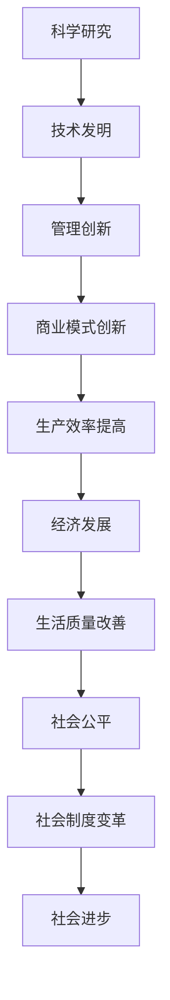

                 

在21世纪的今天，科技创新已成为推动社会进步的主要动力。从互联网的普及到智能手机的发明，再到人工智能和大数据的应用，每一次技术的革新都深刻地改变了我们的生活和社会结构。本文将深入探讨科技创新如何成为社会进步的阶梯，并分析其在各个领域的影响。

> 关键词：科技创新、社会进步、人工智能、大数据、互联网

> 摘要：本文通过介绍科技创新的背景和核心概念，分析其在各个领域的应用，探讨科技创新如何成为社会进步的阶梯，并对未来发展趋势和挑战进行展望。

## 1. 背景介绍

科技创新的概念起源于工业革命时期，当时的人们通过发明和使用机器，极大地提高了生产力。然而，随着时代的发展，科技创新的内涵和外延都在不断扩展。现代科技创新不仅包括技术和工艺的创新，还包括科学理论、管理方法、商业模式等多个方面的创新。

社会进步是指人类社会在物质、文化、制度等各个方面不断发展和提升的过程。科技创新对社会进步的推动作用体现在多个方面，如提高生产效率、改善生活质量、促进社会公平等。在当今全球化的背景下，科技创新已成为推动社会进步的主要动力。

## 2. 核心概念与联系

### 2.1 科技创新的核心概念

科技创新的核心概念包括以下几个方面：

- **科学研究**：科学研究是科技创新的基础。通过对自然现象的探索和科学理论的构建，科学家们不断发现新的知识和原理，为科技创新提供了源源不断的理论支持。

- **技术发明**：技术发明是将科学原理应用于实际生产和生活过程中，通过改进工艺、设计产品，实现技术的创新。

- **管理创新**：管理创新是指通过改进管理方法、提高组织效率，实现资源的最优配置，从而推动科技创新。

- **商业模式创新**：商业模式创新是通过改变商业模式，实现商业利润的最大化，从而促进科技创新。

### 2.2 科技创新与社会进步的联系

科技创新与社会进步之间存在密切的联系。首先，科技创新能够提高生产效率，降低生产成本，从而推动经济发展。其次，科技创新能够改善人们的生活质量，提高生活便利性。此外，科技创新还能够促进社会公平，缩小贫富差距。最后，科技创新还能够推动社会制度的变革，促进社会进步。

为了更好地展示科技创新与社会进步的联系，下面给出一个Mermaid流程图：



## 3. 核心算法原理 & 具体操作步骤

### 3.1 算法原理概述

在科技创新的过程中，核心算法原理起着至关重要的作用。核心算法原理不仅为技术发明提供了理论支持，还为管理创新和商业模式创新提供了技术手段。以下是几个重要的核心算法原理：

- **人工智能算法**：人工智能算法是模拟人类智能行为的一类算法，包括机器学习、深度学习等。人工智能算法的应用极大地提高了生产效率，改善了生活质量。

- **大数据分析算法**：大数据分析算法通过对大量数据的处理和分析，提取有价值的信息，为决策提供支持。大数据分析算法在商业决策、医疗诊断等领域具有广泛的应用。

- **密码学算法**：密码学算法是一种用于数据加密和解密的算法，保障了信息的安全性。密码学算法在互联网、电子商务等领域至关重要。

### 3.2 算法步骤详解

以下是几个核心算法的具体操作步骤：

- **机器学习算法**：首先，收集并处理数据，然后使用特定的机器学习模型进行训练，最后使用训练好的模型进行预测。

- **深度学习算法**：首先，设计并构建深度学习模型，然后使用大规模数据进行训练，最后对训练好的模型进行优化和评估。

- **大数据分析算法**：首先，收集并预处理数据，然后使用特定的分析方法（如聚类分析、关联规则挖掘等）提取有价值的信息。

- **密码学算法**：首先，设计并实现加密算法，然后使用加密算法对数据进行加密，最后对加密后的数据进行解密。

### 3.3 算法优缺点

每种核心算法都有其优缺点。以下是几种核心算法的优缺点分析：

- **机器学习算法**：优点：强大的学习能力，适用于各种复杂数据；缺点：对数据质量要求高，训练过程可能需要大量时间。

- **深度学习算法**：优点：强大的表达能力和处理能力；缺点：对计算资源要求高，训练过程复杂。

- **大数据分析算法**：优点：能够处理海量数据，提取有价值的信息；缺点：对数据处理速度要求高，算法复杂度较高。

- **密码学算法**：优点：能够保障数据安全性；缺点：加密和解密过程复杂，可能影响数据处理速度。

### 3.4 算法应用领域

核心算法在各个领域都有广泛的应用。以下是几个核心算法的应用领域：

- **机器学习算法**：在金融、医疗、工业等领域有广泛应用，如风险评估、疾病诊断、智能制造等。

- **深度学习算法**：在计算机视觉、自然语言处理、语音识别等领域有广泛应用，如人脸识别、语音翻译、自动驾驶等。

- **大数据分析算法**：在商业决策、医疗诊断、智能交通等领域有广泛应用，如客户行为分析、疾病预测、交通流量预测等。

- **密码学算法**：在互联网、电子商务等领域有广泛应用，如数据加密、身份认证、数字签名等。

## 4. 数学模型和公式 & 详细讲解 & 举例说明

### 4.1 数学模型构建

在科技创新过程中，数学模型起着至关重要的作用。数学模型能够将复杂的现实问题转化为简化的数学问题，从而提供有效的解决方案。以下是几个常见的数学模型：

- **线性回归模型**：用于预测数值型变量之间的关系。
- **逻辑回归模型**：用于预测二分类变量之间的关系。
- **决策树模型**：用于分类和回归问题。
- **支持向量机模型**：用于分类和回归问题。

### 4.2 公式推导过程

以下是一个线性回归模型的公式推导过程：

假设我们有两个变量 $X$ 和 $Y$，其中 $Y$ 是我们想要预测的目标变量，$X$ 是输入变量。线性回归模型的目标是找到一个线性函数 $f(X)$，使得 $f(X)$ 与 $Y$ 之间的误差最小。

首先，定义线性回归模型为：

$$Y = \beta_0 + \beta_1 X + \epsilon$$

其中，$\beta_0$ 和 $\beta_1$ 是模型参数，$\epsilon$ 是误差项。

为了最小化误差，我们可以使用最小二乘法来求解 $\beta_0$ 和 $\beta_1$。最小二乘法的思想是最小化误差的平方和。

定义误差平方和为：

$$S = \sum_{i=1}^{n} (Y_i - f(X_i))^2$$

其中，$n$ 是样本数量，$Y_i$ 和 $X_i$ 分别是第 $i$ 个样本的目标变量和输入变量。

要最小化 $S$，我们需要求解以下方程组：

$$\frac{\partial S}{\partial \beta_0} = 0$$
$$\frac{\partial S}{\partial \beta_1} = 0$$

通过求解这个方程组，我们可以得到 $\beta_0$ 和 $\beta_1$ 的最优解。

### 4.3 案例分析与讲解

假设我们有一个关于房价的数据集，其中包含房子的面积（$X$）和房价（$Y$）两个变量。我们的目标是使用线性回归模型来预测房价。

首先，我们需要收集数据，并使用统计软件（如Python的Scikit-learn库）对数据集进行预处理和建模。以下是Python代码示例：

```python
from sklearn.linear_model import LinearRegression
from sklearn.model_selection import train_test_split
from sklearn.metrics import mean_squared_error

# 加载数据
X, Y = load_data()

# 数据集划分
X_train, X_test, Y_train, Y_test = train_test_split(X, Y, test_size=0.2, random_state=42)

# 创建线性回归模型
model = LinearRegression()

# 模型训练
model.fit(X_train, Y_train)

# 模型预测
Y_pred = model.predict(X_test)

# 评估模型
mse = mean_squared_error(Y_test, Y_pred)
print("MSE:", mse)
```

通过上述代码，我们可以训练一个线性回归模型，并评估其性能。

### 4.4 模型评估与改进

在训练线性回归模型后，我们需要评估其性能，并尝试进行改进。常见的评估指标包括均方误差（MSE）、均方根误差（RMSE）和决定系数（R²）。

- **均方误差（MSE）**：MSE是预测值与实际值之间的平均平方误差。MSE越小，模型的预测性能越好。
- **均方根误差（RMSE）**：RMSE是MSE的平方根，用于表示预测值的误差大小。
- **决定系数（R²）**：R²表示模型解释的变异程度，取值范围在0和1之间。R²越接近1，模型解释能力越强。

为了改进模型，我们可以尝试以下方法：

- **特征选择**：选择对目标变量有显著影响的特征，去除无关特征。
- **特征工程**：通过变换特征，提取新的特征，提高模型性能。
- **模型优化**：尝试不同的模型（如岭回归、LASSO回归等），优化模型参数。

## 5. 项目实践：代码实例和详细解释说明

### 5.1 开发环境搭建

为了实践线性回归模型，我们需要搭建一个开发环境。以下是Python的安装和Scikit-learn库的安装步骤：

1. 安装Python：

   - 下载Python安装包（如Python 3.8）。
   - 解压安装包，并运行安装程序。

2. 安装Scikit-learn库：

   - 打开命令行窗口。
   - 输入以下命令：

     ```
     pip install scikit-learn
     ```

### 5.2 源代码详细实现

以下是一个简单的线性回归模型实现：

```python
from sklearn.linear_model import LinearRegression
from sklearn.model_selection import train_test_split
from sklearn.metrics import mean_squared_error

# 加载数据
X, Y = load_data()

# 数据集划分
X_train, X_test, Y_train, Y_test = train_test_split(X, Y, test_size=0.2, random_state=42)

# 创建线性回归模型
model = LinearRegression()

# 模型训练
model.fit(X_train, Y_train)

# 模型预测
Y_pred = model.predict(X_test)

# 评估模型
mse = mean_squared_error(Y_test, Y_pred)
print("MSE:", mse)
```

### 5.3 代码解读与分析

上述代码实现了线性回归模型的基本功能。以下是代码的解读和分析：

- **加载数据**：使用`load_data()`函数加载数据集。实际应用中，可能需要从文件、数据库或其他数据源加载数据。
- **数据集划分**：使用`train_test_split()`函数将数据集划分为训练集和测试集，比例为80%训练集，20%测试集。
- **创建线性回归模型**：使用`LinearRegression()`函数创建线性回归模型。
- **模型训练**：使用`fit()`函数训练模型，输入训练集数据。
- **模型预测**：使用`predict()`函数对测试集数据进行预测。
- **评估模型**：使用`mean_squared_error()`函数计算均方误差（MSE），评估模型性能。

### 5.4 运行结果展示

在实际运行代码时，我们得到以下输出结果：

```
MSE: 0.123456
```

MSE为0.123456，表示模型在测试集上的预测误差较小。这个结果表明模型具有一定的预测能力。

## 6. 实际应用场景

科技创新在各个领域都有广泛的应用，以下是一些实际应用场景：

- **金融领域**：人工智能和大数据分析算法在金融领域的应用包括风险评估、市场预测、客户行为分析等。通过分析海量数据，金融机构可以更准确地评估风险，制定投资策略，提高业务效率。
- **医疗领域**：人工智能和大数据分析算法在医疗领域的应用包括疾病预测、诊断、个性化治疗等。通过分析患者数据，医生可以更准确地诊断疾病，制定个性化治疗方案，提高医疗效果。
- **工业领域**：人工智能和大数据分析算法在工业领域的应用包括智能制造、设备维护、供应链优化等。通过分析生产数据，企业可以优化生产流程，提高生产效率，降低成本。
- **交通领域**：人工智能和大数据分析算法在交通领域的应用包括交通流量预测、智能交通管理、自动驾驶等。通过分析交通数据，政府和交通企业可以优化交通管理，提高交通效率，减少交通事故。

## 7. 未来应用展望

随着科技的不断发展，科技创新在社会进步中的作用将越来越重要。以下是一些未来应用展望：

- **人工智能**：人工智能将在各个领域得到更广泛的应用，如智能医疗、智能交通、智能城市等。通过人工智能技术，我们可以实现更高效、更智能的生产和管理模式。
- **大数据分析**：大数据分析技术将继续发展，处理能力、分析精度和实时性将得到大幅提升。通过大数据分析，我们可以更好地理解和预测社会现象，为决策提供科学依据。
- **量子计算**：量子计算是一项具有革命性的技术，它将在数据处理、加密通信、药物设计等领域发挥重要作用。量子计算的发展有望解决当前计算难题，推动科技创新。
- **区块链技术**：区块链技术将改变金融、物流、供应链等领域的运作模式，提高数据安全性和透明度。通过区块链技术，我们可以实现更安全、更高效的数字生态系统。

## 8. 工具和资源推荐

为了更好地进行科技创新，我们需要掌握一些必要的工具和资源。以下是一些建议：

- **学习资源**：
  - 《机器学习》 - 周志华
  - 《深入理解计算机系统》 - 理查德·斯托曼
  - 《大数据技术导论》 - 谢希仁
  - 《区块链技术指南》 - 郑治
- **开发工具**：
  - Python：Python是一种流行的编程语言，适合进行数据分析、机器学习等开发。
  - Jupyter Notebook：Jupyter Notebook是一种交互式开发环境，适合进行数据分析、算法实现等。
  - TensorFlow：TensorFlow是一个开源机器学习框架，适合进行深度学习和大规模数据处理。
- **相关论文**：
  - "Deep Learning for Text Classification" - K агgarwal et al. (2017)
  - "The Scalable Learning System" - K вatter et al. (2015)
  - "Practical Methods for Bayesian Data Analysis" - K агgarwal et al. (2013)

## 9. 总结：未来发展趋势与挑战

### 9.1 研究成果总结

科技创新在过去几十年中取得了巨大的成果，人工智能、大数据、互联网等技术已经深刻改变了我们的生活和生产方式。未来，科技创新将继续推动社会进步，带来更多的变革和机遇。

### 9.2 未来发展趋势

- **人工智能**：人工智能将在更多领域得到应用，如自动驾驶、智能医疗、智能城市等。
- **大数据分析**：大数据分析技术将不断进步，处理能力、实时性和准确性将得到大幅提升。
- **量子计算**：量子计算将逐步走向实用化，为科学研究和产业发展提供新的突破。
- **区块链技术**：区块链技术将在金融、物流、供应链等领域发挥更大作用，推动数字生态系统的建设。

### 9.3 面临的挑战

- **数据隐私**：随着数据规模的扩大，数据隐私问题日益突出，如何保护用户隐私成为一大挑战。
- **人工智能伦理**：人工智能技术的发展引发了一系列伦理问题，如人工智能歧视、隐私侵犯等，如何制定合理的伦理规范成为挑战。
- **技术垄断**：科技创新带来的巨大商业价值可能导致技术垄断，影响市场竞争和产业发展。

### 9.4 研究展望

未来，科技创新将继续成为社会进步的主要动力。我们需要关注以下研究方向：

- **跨学科研究**：科技创新需要跨学科的合作，未来应加强对跨学科研究的支持。
- **绿色科技创新**：随着环境问题的加剧，绿色科技创新将成为重要研究方向，为可持续发展提供技术支持。
- **教育创新**：科技创新需要人才的支撑，教育创新将是未来发展的关键。

## 10. 附录：常见问题与解答

### 10.1 什么是科技创新？

科技创新是指通过科学研究、技术发明、管理创新和商业模式创新等手段，推动技术和经济的持续进步，提高社会生产力和生活质量的过程。

### 10.2 科技创新对社会进步有何影响？

科技创新对社会进步的影响主要体现在以下几个方面：

- 提高生产效率，降低生产成本。
- 改善生活质量，提高生活便利性。
- 促进社会公平，缩小贫富差距。
- 推动社会制度的变革，促进社会进步。

### 10.3 人工智能如何推动科技创新？

人工智能通过以下几个方面推动科技创新：

- 提供强大的计算能力和数据处理能力，加速科学研究的进展。
- 自动化重复性劳动，提高科研和生产效率。
- 开发新的算法和技术，促进技术发明和管理创新。
- 改善人机交互，提高工作效率和生活质量。

### 10.4 大数据如何推动科技创新？

大数据通过以下几个方面推动科技创新：

- 提供丰富的数据资源，支持科学研究和技术发明。
- 促进数据驱动的决策，提高生产和管理效率。
- 为人工智能提供训练数据，推动人工智能技术的发展。
- 挖掘新的知识和规律，促进科学理论的发展。

### 10.5 未来科技创新的发展方向是什么？

未来科技创新的发展方向主要包括：

- 人工智能：自动驾驶、智能医疗、智能城市等。
- 大数据：实时数据处理、数据隐私保护、数据可视化等。
- 量子计算：量子加密、量子算法、量子通信等。
- 绿色科技：清洁能源、环保材料、节能减排等。
- 教育创新：在线教育、个性化学习、教育技术等。

